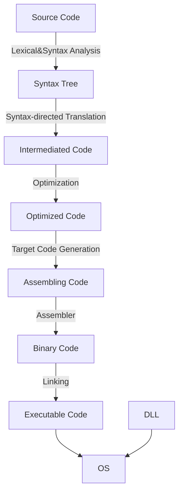

# 1 Introduction to Compiling

```mermaid
graph TD
Sc[Source Code]
--Lexical&Syntax Analysis-->
St[Syntax Tree]
--Syntax-directed Translation-->
Ic[Intermediated Code]
--Optimization-->
Oc[Optimized Code]
--Target Code Generation-->
Ac[Assembling Code]
--Assembler-->
Bc[Binary Code]
--Linking-->
Ec[Executable Code]
-->
os[OS]
dll-->os
dll[DLL]
```

## 1.1 The Phases of a Compiler

