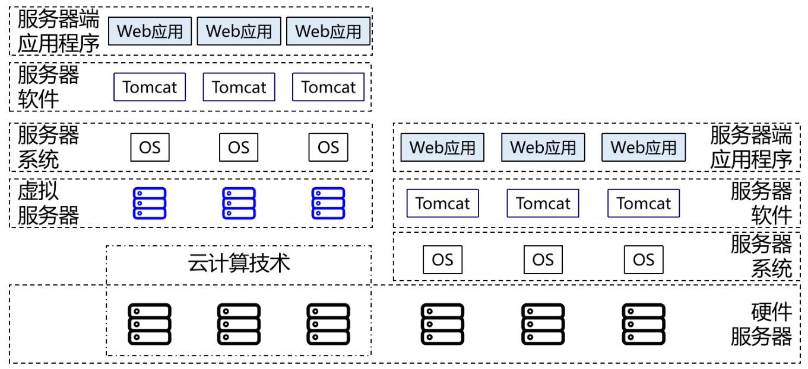
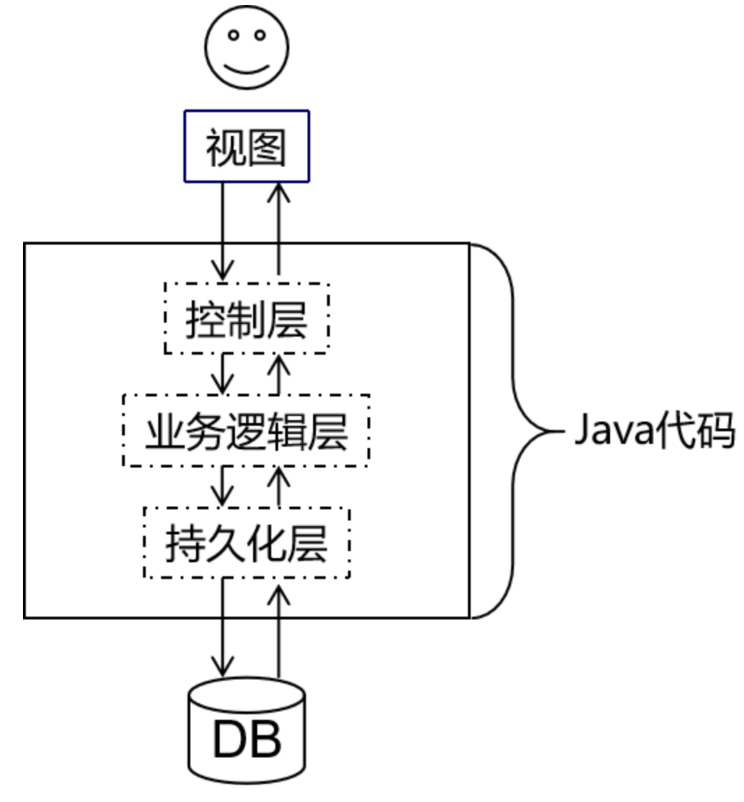

# 1 JavaWeb开发概述

## 1.1 服务器端应用程序

## 1.2 请求和响应

## 1.3 架构

### 1.3.1 概念

**架构其实就是项目的结构**。只不过结构这个词太小了，不适合用来描述项目这么大的东西，所以换了另一个更大的词：架构。所以当我们聊一个项目的架构时，我们聊的是项目是由哪些部分组成的。

### 1.3.2 发展演变历程

#### 单一架构

一个项目就是一个工程，这样的结构就是单一架构，也叫`all in one`。我们现在的`JavaWeb`阶段、`SSM`阶段都是学习单一架构开发技术。

#### 分布式架构

一个项目中包含很多工程，每个工程作为一个模块。模块之间存在调用关系。分布式架构阶段的技术分为两类：

- Java框架：`SpringBoot`、`SpringCloud`、`Dubbo`等等；
- 中间件：`Redis`、`ElasticSearch`、`FastDFS`、`Nginx`、`Zookeeper`、`RabbitMQ`等等；

### 1.3.3 单一架构技术体系

- 视图：用户的操作界面+数据的动态显示：
  - 前端技术：`HTML/CSS/JavaScript`；
  - 服务器端页面模板技术：`Thymeleaf`；
- 控制层：处理请求+跳转页面：
  - 服务器：`Tomcat`；
  - 控制器：`Servlet`；
  - 域对象：`request`、`session`、`servletContext`；
  - 过滤器：`Filter`；
  - 监听器：`Listener`；
  - 异步交互：`Ajax`；
- 业务逻辑层：业务逻辑计算；
- 持久化层：操作数据库；

## 1.4 技术体系

