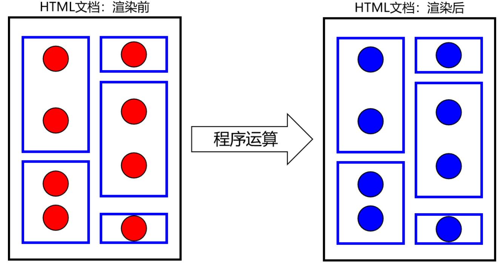
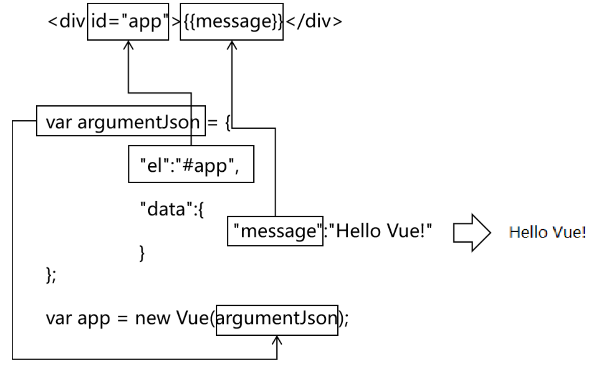
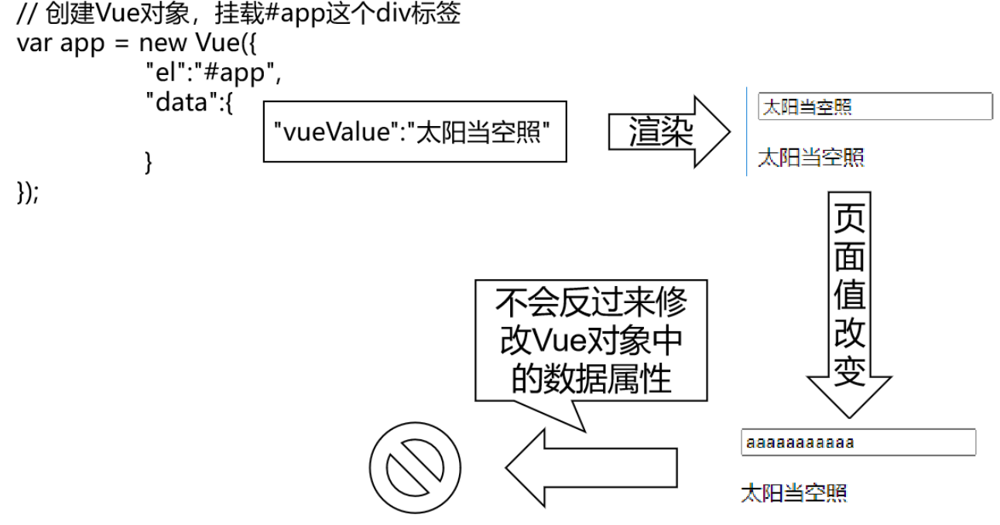

# 10 Vue.js

## 10.1 Vue.js简介

### 10.1.1 框架

任何编程语言在最初的时候都是没有框架的，后来随着在实际开发过程中不断总结**『经验』**，积累**『最佳实践』**，慢慢的人们发现很多**『特定场景』**下的**『特定问题』**总是可以**『套用固定解决方案』**。

于是有人把成熟的**『固定解决方案』**收集起来，整合在一起，就成了**『框架』**。

在使用框架的过程中，我们往往只需要告诉框架**『做什么（声明）』**，而不需要关心框架**『怎么做（编程）』**。

对于Java程序来说，我们使用框架就是导入那些封装了**『固定解决方案』**的jar包，然后通过**『配置文件』**告诉框架做什么，就能够大大简化编码，提高开发效率。我们使用过的junit其实就是一款单元测试框架。

而对于JavaScript程序来说，我们使用框架就是导入那些封装了**『固定解决方案』**的**『js文件』**，然后在框架的基础上编码。

### 10.1.2 Vue.js

Vue (读音 /vjuː/，类似于**view**) 是一套用于构建用户界面的**渐进式框架**。与其它大型框架不同的是，Vue 被设计为可以自底向上逐层应用。Vue 的核心库只关注视图层，不仅易于上手，还便于与第三方库或既有项目整合。另一方面，当与[现代化的工具链](https://cn.vuejs.org/v2/guide/single-file-components.html)以及各种[支持类库](https://github.com/vuejs/awesome-vue#libraries--plugins)结合使用时，Vue 也完全能够为复杂的单页应用提供驱动。


## 10.2 Vue.js环境

### 10.2.1 开发中的最佳实践

『最佳实践』是实际开发中，针对特定问题提炼出来的最好的解决方案。把『最佳实践』抽取出来，封装到各自编程语言的程序包中，就是框架的基础。

- Java语言的程序包：jar包
- JavaScript语言的程序包：外部js文件

对于Java程序来说，框架=jar包+配置文件。对于Vue来说，导入**Vue的外部js文件**就能够使用Vue框架了。

### 10.2.2 创建Vue应用

#### 安装`Node.js`

网上有很多教程，直接在官网下载即可。

#### 项目创建

在自己的项目文件夹启动终端，或者`cd`到目标文件夹，然后运行以下命令：

```shell
> npm init vue@latest
```

这一指令将会安装并执行 [create-vue](https://github.com/vuejs/create-vue)，它是 Vue 官方的项目脚手架工具。你将会看到一些诸如 TypeScript 和测试支持之类的可选功能提示：

```shell
✔ Project name: … <your-project-name>
✔ Add TypeScript? … No / Yes
✔ Add JSX Support? … No / Yes
✔ Add Vue Router for Single Page Application development? … No / Yes
✔ Add Pinia for state management? … No / Yes
✔ Add Vitest for Unit testing? … No / Yes
✔ Add Cypress for both Unit and End-to-End testing? … No / Yes
✔ Add ESLint for code quality? … No / Yes
✔ Add Prettier for code formatting? … No / Yes

Scaffolding project in ./<your-project-name>...
Done.
```

如果不确定是否要开启某个功能，你可以直接按下回车键选择 `No`。在项目被创建后，通过以下步骤安装依赖并启动开发服务器：

```shell
> cd <your-project-name>
> npm install
> npm run dev
```

#### 通过CDN使用Vue

新手练习可以简单创建一个html文件，然后借助 script 标签直接通过 CDN 来使用 Vue：

```html
<script src="https://unpkg.com/vue@3/dist/vue.global.js"></script>
```

这里使用了 [unpkg](https://unpkg.com/)，但也可以使用任何提供 npm 包服务的 CDN，例如 [jsdelivr](https://www.jsdelivr.com/package/npm/vue) 或 [cdnjs](https://cdnjs.com/libraries/vue)。当然，你也可以下载此文件并自行提供服务。

通过 CDN 使用 Vue 时，不涉及“构建步骤”。这使得设置更加简单，并且可以用于增强静态的 HTML 或与后端框架集成。但是将无法使用单文件组件 (SFC) 语法。

## 10.3 声明式渲染

### 10.3.1 概念

#### 声明式

**『声明式』**是相对于**『编程式』**而言的。

- 声明式：告诉框架做什么，具体操作由框架完成；
- 编程式：自己编写代码完成具体操作；

#### 渲染



 上图含义解释：

- 蓝色方框：HTML标签；
- 红色圆形：动态、尚未确定的数据；
- 蓝色圆形：经过程序运算以后，计算得到的具体的，可以直接在页面上显示的数据；
- 渲染：程序计算动态数据得到具体数据的过程；

### 10.3.2 HelloVue

```html
<!DOCTYPE html>
<html lang="en">
<head>
    <meta charset="UTF-8">
    <title>Vue3 Test</title>
</head>
<body>
<!-- 使用{{}}格式，指定要被渲染的数据 -->
<script src="https://unpkg.com/vue@3/dist/vue.global.js"></script>
    
<div id="app">{{ message }}</div>
    
<script>
    const { createApp } = Vue
    createApp({
        data() {
            return {
                message: 'Hello Vue!'
            }
        }
    }).mount('#app')
</script>
</body>
</html>
```



## 10.4 绑定元素属性

### 10.4.1 基本语法

`v-bind:HTML标签的原始属性名`。

### 10.4.2 测试

```html
<!DOCTYPE html>
<html lang="en">
<head>
    <meta charset="UTF-8">
    <title>Vue3 Test2</title>
</head>
<body>
<!-- 使用{{}}格式，指定要被渲染的数据 -->
<script src="https://unpkg.com/vue@3/dist/vue.global.js"></script>

<div id="app">
  <!-- v-bind:value表示将value属性交给Vue来进行管理，也就是绑定到Vue对象 -->
  <!-- vueValue是一个用来渲染属性值的表达式，相当于标签体中加{{}}的表达式 -->
  <input type="text" v-bind:value="vueValue" />

  <!-- 同样的表达式，在标签体内通过{{}}告诉Vue这里需要渲染； -->
  <!-- 在HTML标签的属性中，通过v-bind:属性名="表达式"的方式告诉Vue这里要渲染 -->
  <p>{{vueValue}}</p>
</div>

<script>
  const { createApp } = Vue
  const app = createApp({
    data(){
      return {
        vueValue: "太阳当空照"
      }
    }
  })
  app.mount("#app")
</script>
</body>
</html>
```

## 10.5 双向数据绑定

### 10.5.1 问题



而使用了双向绑定后，就可以实现：页面上数据被修改后，Vue对象中的数据属性也跟着被修改。

### 10.5.2 测试

```html
<!DOCTYPE html>
<html lang="en">
<head>
    <meta charset="UTF-8">
    <title>Vue3 Test3</title>
</head>
<body>
<!-- 使用{{}}格式，指定要被渲染的数据 -->
<script src="https://unpkg.com/vue@3/dist/vue.global.js"></script>
<h1>双向数据绑定</h1>
<div id="app">
  <!-- v-bind:属性名 效果是从Vue对象渲染到页面 -->
  <!-- v-model:属性名 效果不仅是从Vue对象渲染到页面，而且能够在页面上数据修改后反向修改Vue对象中的数据属性 -->
  <input type="text" v-model="vueValue"/>

  <p>{{vueValue}}</p>
</div>

<script>
  const {createApp} = Vue
  const app = createApp({
    data() {
      return {
        vueValue: "太阳当空照"
      }
    }
  })
  app.mount("#app")
</script>
</body>
</html>
```

`p`标签内的数据能够和文本框中的数据实现同步修改：

### 10.5.3 去除前后空格

#### `.trim`修饰符

实际开发中，要考虑到用户在输入数据时，有可能会包含前后空格。而这些前后的空格对我们程序运行来说都是干扰因素，要去掉。在v-model后面加上.trim修饰符即可实现。

```html
<input type="text" v-model.trim="vueValue" />
```

## 10.6 条件渲染

### 10.6.1 `v-if`与`v-else`

```html
<!DOCTYPE html>
<html lang="en">
<head>
    <meta charset="UTF-8">
    <title>Vue3 Test4</title>
</head>
<body>
<script src="https://unpkg.com/vue@3/dist/vue.global.js"></script>
    
<div id = "app">
    <button @click="awesome = !awesome">Toggle</button>
    <h1 v-if="awesome">Vue is awesome!</h1>
    <h1 v-else>Oh no 😢</h1>
</div>

<script>
    const {createApp} = Vue;
    const app = createApp({
        data(){
            return {
                awesome: true
            }
        }
    });
    app.mount("#app");
</script>
</body>
</html>
```

### 10.6.2 `v-show`

另一个可以用来按条件显示一个元素的指令是 `v-show`。其用法基本一样：

```html
<h1 v-show="ok">Hello!</h1>
```

不同之处在于 `v-show` 会在 DOM 渲染中保留该元素；`v-show` 仅切换了该元素上名为 `display` 的 CSS 属性。

`v-show` 不支持在 `<template>` 元素上使用，也不能和 `v-else` 搭配使用。


## 10.7 列表渲染

### 10.7.1 迭代数组

```html
<!DOCTYPE html>
<html lang="en">
<head>
    <meta charset="UTF-8">
    <title>Vue3 Test5</title>
</head>
<body>
<script src="https://unpkg.com/vue@3/dist/vue.global.js"></script>
<div id="app1">
  <li v-for="fruit in fruitList">{{fruit}}</li>
</div>
<script>
  const {createApp} = Vue;
  const app1 = createApp({
    data(){
      return {
        fruitList:[
                "apple",
                "banana",
                "orange",
                "grape"
        ]
      }
    }
  });
  app1.mount("#app1")
</script>
</body>
</html>
```

### 10.7.2 迭代对象列表

```html
<!DOCTYPE html>
<html lang="en">
<head>
    <meta charset="UTF-8">
    <title>Vue3 Test5</title>
</head>
<body>
<script src="https://unpkg.com/vue@3/dist/vue.global.js"></script>
<h1>渲染数组</h1>
<div id="app1">
  <li v-for="fruit in fruitList">{{fruit}}</li>
</div>
<h1>渲染对象列表</h1>
<div id="app2">
  <table>
    <tr>
      <th>编号</th>
      <th>姓名</th>
      <th>年龄</th>
      <th>专业</th>
    </tr>
    <tr v-for="employee in employeeList">
      <td>{{employee.empId}}</td>
      <td>{{employee.empName}}</td>
      <td>{{employee.empAge}}</td>
      <td>{{employee.empSubject}}</td>
    </tr>
  </table>
</div>
<script>
  const {createApp} = Vue;
  const app1 = createApp({
    data(){
      return {
        fruitList:[
                "apple",
                "banana",
                "orange",
                "grape"
        ]
      }
    }
  });
  app1.mount("#app1");

  const app2 = createApp({
    data(){
      return {
        "employeeList":[
          {
            "empId":11,
            "empName":"tom",
            "empAge":111,
            "empSubject":"java"
          },
          {
            "empId":22,
            "empName":"jerry",
            "empAge":222,
            "empSubject":"php"
          },
          {
            "empId":33,
            "empName":"bob",
            "empAge":333,
            "empSubject":"python"
          }
        ]
      }
    }
  });
  app2.mount("#app2")
</script>
</body>
</html>
```

## 10.8 事件驱动

### 10.8.1 字符串反转

```html
<!DOCTYPE html>
<html lang="en">
<head>
    <meta charset="UTF-8">
    <title>Vue3 Test6</title>
</head>
<body>
<script src="https://unpkg.com/vue@3/dist/vue.global.js"></script>
<div id="app">
  <p>{{message}}</p>

  <!-- v-on:事件类型="事件响应函数的函数名" -->
  <button v-on:click="reverseMessage">Click me,reverse message</button>
</div>
<script>
  const {createApp} = Vue;
  const app = createApp({
    data(){
      return {
        message: "Hello Vue!"
      }
    },
    methods:{
      reverseMessage(){
        this.message = this.message.split("").reverse().join("");
      }
    }
  });
  app.mount("#app");
</script>
</body>
</html>
```

### 10.8.2 获取鼠标位置信息

```html
<!DOCTYPE html>
<html lang="en">
<head>
    <meta charset="UTF-8">
    <title>Vue3 Test7</title>
</head>
<body>
<script src="https://unpkg.com/vue@3/dist/vue.global.js"></script>
<div id="app">
  <div id="area"
       v-on:mousemove="recordPosition"
       style="border: 1px solid black;width: 500px;height: 500px;">

  </div>
  <p id="showPosition">{{position}}</p>
</div>

<script>
  const {createApp} = Vue;
  const app = createApp({
    data(){
      return{
        position: "暂时没有获取鼠标位置信息"
      }
    },
    methods:{
      recordPosition(event){
        this.position = event.clientX + ", " + event.clientY;
      }
    }
  });
  app.mount("#app")
</script>
</body>
</html>
```

## 10.9 监听属性

### 10.9.1 需求

```html
<div id="app">
	<p>尊姓：{{firstName}}</p>
	<p>大名：{{lastName}}</p>
	尊姓：<input type="text" v-model="firstName" /><br/>
	大名：<input type="text" v-model="lastName" /><br/>
	<p>全名：{{fullName}}</p>
</div>
```

在上面代码的基础上，我们希望firstName或lastName属性发生变化时，修改fullName属性。此时需要对firstName或lastName属性进行**『侦听』**。

具体来说，所谓**『侦听』**就是对message属性进行监控，当firstName或lastName属性的值发生变化时，调用我们准备好的函数。

### 10.9.2 测试

```html
<!DOCTYPE html>
<html lang="en">
<head>
    <meta charset="UTF-8">
    <title>Vue3 Test9</title>
</head>
<body>
<script src="https://unpkg.com/vue@3/dist/vue.global.js"></script>
<div id="app">
  <p>尊姓：{{firstName}}</p>
  <p>大名：{{lastName}}</p>
  <label>
  尊姓：<input type="text" v-model="firstName" /><br/>
  大名：<input type="text" v-model="lastName" /><br/>
  </label>
  <p>全名：{{fullName}}</p>
</div>
<script>
    const {createApp} = Vue;
    const app = createApp({
        data(){
            return{
                firstName:"jim",
                lastName:"green",
                fullName:"jim green"
            }
        },
        watch:{
            firstName: function (inputValue){
                this.fullName = inputValue + " " + this.lastName;
            },
            lastName: function (inputValue){
                this.fullName = this.firstName + " " + inputValue;
            }
        }
    });
    app.mount("#app");
</script>
</body>
</html>
```

