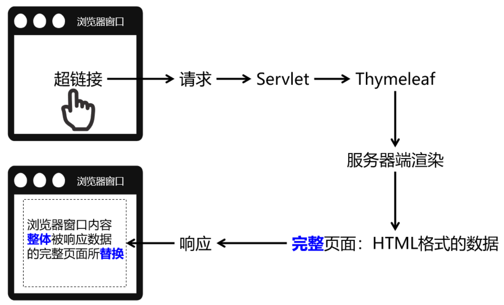
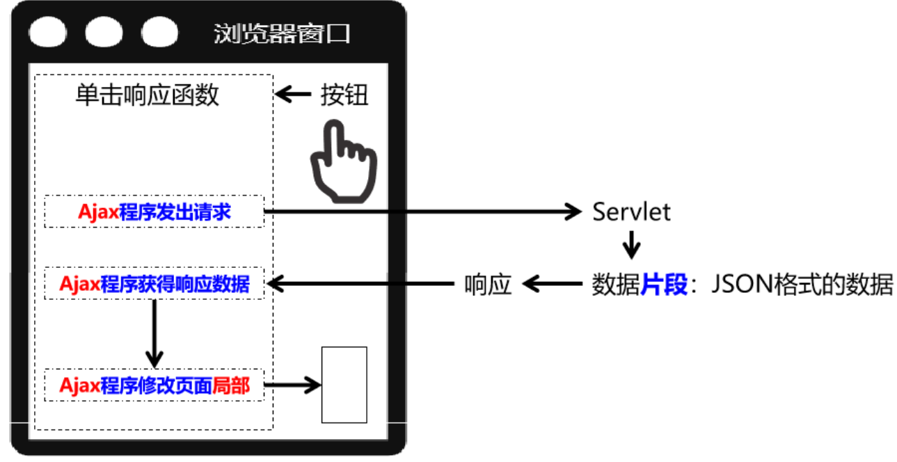
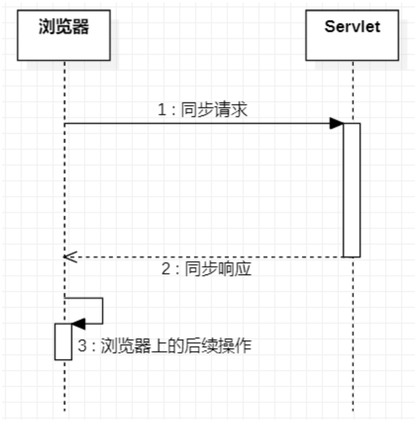
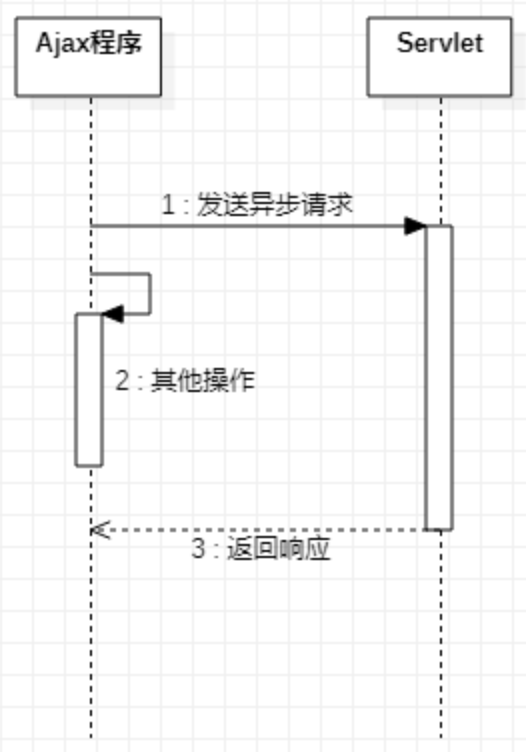
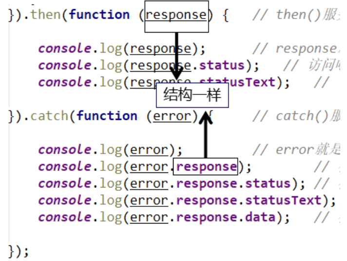

# 12 Axios Ajax

## 12.1 Ajax概述

### 12.1.1 服务器端渲染



### 12.1.2 Ajax渲染（局部更新）



### 12.1.3 前后端分离

彻底舍弃服务器端渲染，数据全部通过Ajax方式以JSON格式来传递。

### 12.1.4 同步与异步

Ajax本身就是Asynchronous JavaScript And XML的缩写，直译为：异步的JavaScript和XML。在实际应用中Ajax指的是：**不刷新浏览器窗口**，**不做页面跳转**，**局部更新页面内容**的技术。

**『同步』**和**『异步』**是一对相对的概念，那么什么是同步，什么是异步呢？

#### 同步

多个操作**按顺序执行**，前面的操作没有完成，后面的操作就必须**等待**。所以同步操作通常是**串行**的。



#### 异步

多个操作相继开始**并发执行**，即使开始的先后顺序不同，但是由于它们各自是**在自己独立的进程或线程中**完成，所以**互不干扰**，**谁也*不用等*谁**。



### 12.1.5 Axios简介

使用原生的JavaScript程序执行Ajax极其繁琐，所以一定要使用框架来完成。而Axios就是目前最流行的前端Ajax框架。

使用Axios和使用Vue一样，导入对应的*.js文件即可。官方提供的script标签引入方式为：

```html
<script src="https://unpkg.com/axios/dist/axios.min.js"></script>
```

我们可以把这个axios.min.js文件下载下来保存到本地来使用。

## 12.2 Axios基本用法

### 12.2.1 测试

#### 前端代码

```html
<html>
  <head>
    <title>Axios Test</title>
  </head>
  <body>
  <script src="https://unpkg.com/vue@3/dist/vue.global.js"></script>
  <script src="https://unpkg.com/axios/dist/axios.min.js"></script>

  <div id="app">
    <button @click="commonParam">普通请求参数</button>
  </div>

  <script>
    const { createApp } = Vue
    const app = createApp({
      data(){},
      methods:{
        commonParam:function (){
          axios({
            method:"post",
            url:"/pro4_axios/AjaxServlet?method=commonParam",
            data: {
              userName: "tom",
              userPwd: "123456"
            }
          }).then(function (response){
            console.log(response);
          }).catch(function (error){
            console.log(error);
          });
        }
      }
    });
    app.mount("#app");
  </script>
  </body>
</html>
```

#### 后端代码

```java
public class AjaxServlet extends ModelBaseServlet {
    protected void commonParam(HttpServletRequest request, HttpServletResponse response) throws IOException {
        String userName = request.getParameter("userName");
        String userPwd = request.getParameter("userPwd");

        System.out.println("userName = " + userName);
        System.out.println("userPwd = " + userPwd);

        response.setContentType("text/html;charset=UTF-8");
        response.getWriter().write("服务器返回普通文本字符串");
    }
}
```

#### axios程序接收到的响应对象结构

| 属性名     | 作用                                             |
| ---------- | ------------------------------------------------ |
| config     | 调用axios(config对象)方法时传入的JSON对象        |
| data       | 服务器端返回的响应体数据                         |
| headers    | 响应消息头                                       |
| request    | 原生JavaScript执行Ajax操作时使用的XMLHttpRequest |
| status     | 响应状态码                                       |
| statusText | 响应状态码的说明文本                             |

#### 服务器端处理请求失败后

```js
catch(function (error) {     // catch()服务器端处理请求出错后，会调用
    console.log(error);         // error就是出错时服务器端返回的响应数据
    console.log(error.response);        // 在服务器端处理请求失败后，获取axios封装的JSON格式的响应数据对象
    console.log(error.response.status); // 在服务器端处理请求失败后，获取响应状态码
    console.log(error.response.statusText); // 在服务器端处理请求失败后，获取响应状态说明文本
    console.log(error.response.data);   // 在服务器端处理请求失败后，获取响应体数据
});
```

response对象的结构还是和then()函数传入的回调函数中的response是一样的：



回调函数：开发人员声明，但是调用时交给系统来调用。像单击响应函数、then()、catch()里面传入的都是回调函数。回调函数是相对于普通函数来说的，普通函数就是开发人员自己声明，自己调用。

### 12.2.2 发送请求体JSON

#### 后端代码

Gson是Google研发的一款非常优秀的**JSON数据解析和生成工具**，它可以帮助我们将数据在JSON字符串和Java对象之间互相转换。

```java
protected void requestBodyJSON(HttpServletRequest request, HttpServletResponse response) throws ServletException, IOException {

    // 1.由于请求体数据有可能很大，所以Servlet标准在设计API的时候要求我们通过输入流来读取
    BufferedReader reader = request.getReader();

    // 2.创建StringBuilder对象来累加存储从请求体中读取到的每一行
    StringBuilder builder = new StringBuilder();

    // 3.声明临时变量
    String bufferStr = null;

    // 4.循环读取
    while((bufferStr = reader.readLine()) != null) {
        builder.append(bufferStr);
    }

    // 5.关闭流
    reader.close();

    // 6.累加的结果就是整个请求体
    String requestBody = builder.toString();

    // 7.创建Gson对象用于解析JSON字符串
    Gson gson = new Gson();

    // 8.将JSON字符串还原为Java对象
    Student student = gson.fromJson(requestBody, Student.class);
    System.out.println("student = " + student);

    System.out.println("requestBody = " + requestBody);

    response.setContentType("text/html;charset=UTF-8");
    response.getWriter().write("服务器端返回普通文本字符串作为响应");
}
```

### 12.2.3 服务器端返回JSON数据

```java
protected void responseBodyJSON(HttpServletRequest request, HttpServletResponse response) throws ServletException, IOException {

    // 1.准备数据对象
    Student student = new Student();
    student.setStuId(10);
    student.setStuName("tom");
    student.setSchool(new School(11,"atguigu"));
    student.setSubjectList(Arrays.asList(new Subject("java", 95.5), new Subject("php", 93.3)));

    Map<String, Teacher> teacherMap = new HashMap<>();
    teacherMap.put("t1", new Teacher("lili", 25));
    teacherMap.put("t2", new Teacher("mary", 26));
    teacherMap.put("t3", new Teacher("katty", 27));

    student.setTeacherMap(teacherMap);

    // 2.创建Gson对象
    Gson gson = new Gson();

    // 3.将Java对象转换为JSON对象
    String json = gson.toJson(student);
    
    // 4.设置响应体的内容类型
    response.setContentType("application/json;charset=UTF-8");
    response.getWriter().write(json);
}
```

