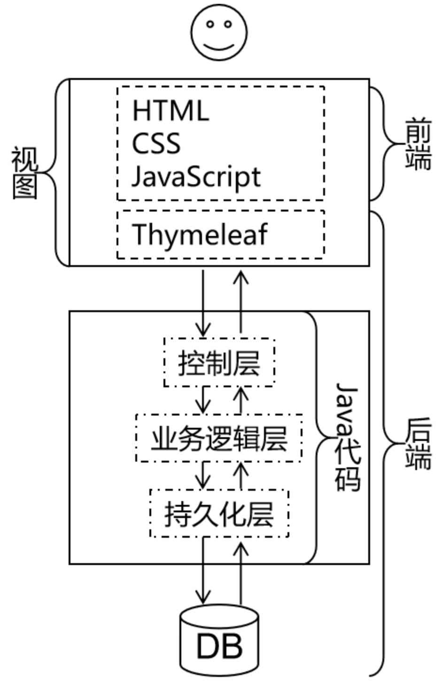

# 2 HTML&CSS

## 2.1 单一架构

从现在的`JavaWeb`阶段到后面学习`SSM`框架阶段都是在学习单一架构项目开发的技术。而在`JavaWeb`阶段由于重点是探讨如何实现Web开发，所以必须学习一部分前端开发的技术。本节就是让大家明确我们现在要学习的内容在整个架构体系中处于什么位置。

### 2.1.1 视图层

严格来说视图分成两层：

- 前端技术：`HTML/CSS/JavaScript`
- 服务器端页面模板技术：`Thymeleaf`

其中`HTML`、`CSS`、`JavaScript`都是工作在浏览器上的，所以它们都属于前端技术。而`Thymeleaf`是在服务器上把动态内容计算出具体数据，所以严格来说`Thymeleaf`是后端技术。



> 这里大家会有个疑问：为什么在`视图`这个地方已经有`HTML`、`CSS`、`JavaScript`这些前端技术了，能够生成用户可以操作的界面，那为什么还需要`Thymeleaf`这样一个后端技术呢？
>
> 简单来说原因是`Thymeleaf`=`HTML+动态数据`，而`HTML`不支持动态数据，这部分需要借助`Thymeleaf`来完成。

### 2.1.2 Web2.0

`Web2.0`是相对于更早的网页开发规范而提出的新规范。`Web2.0`规范之前的网页开发并没有明确的将`HTML`、`CSS`、`JavaScript`代码**<u>分开</u>**，而是互相之间纠缠在一起，导致代码维护困难，开发效率很低。

> 在开发中我们把这样彼此纠缠、互相影响的现象称为`耦合`。而把耦合在一起的东西拆解开，让他们彼此独立出来称为`解耦`。各个组成部分独立完成自己负责的功能，和其他模块无关称为`内聚`。
>
> 将来大家经常会听到一句话：软件开发提倡 `高内聚，低耦合`。
>
> 一个软件项目只有做到了高内聚、低耦合才能算得上结构严谨，模块化程度高，有利于开发和维护。

所以`Web2.0`规范主张将网页代码分成下面三个部分：

- 结构：由`HTML`实现，负责管理网页的内容。将来网页上不管是静态还是动态的数据都是填写到HTML的标签里；
- 表现：由`CSS`实现，负责管理网页内容的表现形式。比如：颜色、尺寸、位置、层级等等。也就是给数据穿上一身漂亮的衣服；
- 行为：由`JavaScript`实现，负责实现网页的动态交互效果。比如：轮播图、表单验证、鼠标滑过显示下拉菜单、鼠标滑过改变背景颜色等等；

## 2.2 HTML简介

### 2.2.1 超文本语言

**<u>超文本标记语言（Hyper Text Markup Language，HTML）</u>**文件本质上是文本文件，而普通的文本文件只能显示字符。但是HTML技术则通过HTML标签把其他网页、图片、音频、视频等各种多媒体资源引入到当前网页中，让网页有了非常丰富的呈现方式，这就是超文本的含义——本身是文本，但是呈现出来的最终效果超越了文本


### 2.2.2 标记语言

说HTML是一种『标记语言』是因为它不是向Java这样的『编程语言』，因为它是由一系列『标签』组成的，没有常量、变量、流程控制、异常处理、IO等等这些功能。HTML很简单，每个标签都有它固定的含义和确定的页面显示效果。

标签是通过一组尖括号+标签名的方式来定义的：

```html
<p>
    HTML is a very popular fore-end technology.
</p>
```

这个例子中使用了一个`p`标签来定义一个段落，`<p>`叫**『开始标签』**，`</p>`叫**『结束标签』**。开始标签和结束标签一起构成了一个完整的标签。开始标签和结束标签之间的部分叫**『文本标签体』**，也简称**『标签体』**。

有时候标签还带有**<u>属性</u>**：

```html
<a href="http://www.xxx.com">
    show detail
</a>
```

`href="http://www.xxx.com"`就是属性，`href`是**『属性名』**，`"http://www.xxx.com"`是**『属性值』**。

还有一种标签是**<u>单标签</u>**：

```html
<input type="text" name="username" />
```

### 2.2.3 Hello World


### 2.2.4 HTML文件结构

#### 文档类型声明

HTML文件中第一行的内容，用来告诉浏览器当前HTML文档的基本信息，其中最重要的就是当前HTML文档遵循的语法标准。这里我们只需要知道HTML有4和5这两个大的版本，`HTML4`版本的文档类型声明是：

```html
<!DOCTYPE HTML PUBLIC "-//W3C//DTD HTML 4.01 Transitional//EN"
"http://www.w3.org/TR/html4/loose.dtd">
```

`HTML5`版本的文档类型声明是：

```html
<!DOCTYPE html>
```

现在主流的技术选型都是使用`HTML5`，之前的版本基本不用了。

#### 根标签

`html`标签是整个文档的根标签，所有其他标签都必须放在html标签里面。上面的文档类型不能当做普通标签看待。

> 所谓『根』其实是『树根』的意思。在一个树形结构中，根节点只能有一个。

#### 头部

`head`标签用于定义文档的头部，其他头部元素都放在head标签里。头部元素包括`title`标签、`script`标签、`style`标签、`link`标签、`meta`标签等等。

#### 主体

`body`标签定义网页的主体内容，在浏览器窗口内显示的内容都定义到`body`标签内。

#### 注释

HTML注释的写法是：

```html
<!-- 注释内容 -->
```

注释的内容不会显示到浏览器窗口内，是开发人员用来对代码内容进行解释说明。

### 2.2.5 HTML语法规则

- 根标签有且只能有一个；
- 无论是双标签还是单标签都必须正确关闭；
- 标签可以嵌套但不能交叉嵌套；
- 注释不能嵌套；
- 属性必须有值，值必须加引号，单引号或双引号均可；
- 标签名不区分大小写但建议使用小写；

## 2.3 使用HTML展示文章

以文章的组织形式展示数据是HTML最基本的功能了，网页上显示的文章在没有做任何CSS样式设定的情况下如下图所示：


本节我们要学习的HTML标签如下表：

| 标签名称 | 功能                   |
| -------- | ---------------------- |
| `h1~h6`  | 1级标题~6级标题        |
| `p`      | 段落                   |
| `a`      | 超链接                 |
| `ul/li`  | 无序列表               |
| `img`    | 图片                   |
| `div`    | 定义一个前后有换行的块 |
| `span`   | 定义一个前后无换行的块 |

### 2.3.1 标签标题

```html
<!DOCTYPE html>
<html lang="en">
<head>
    <meta charset="UTF-8">
    <title>Title</title>
</head>
<body>
    <h1>这是一级标题</h1>
    <h2>这是二级标题</h2>
    <h3>这是三级标题</h3>
    <h4>这是四级标题</h4>
    <h5>这是五级标题</h5>
    <h6>这是六级标题</h6>
</body>
</html>
```

==**<u>注意：标题标签前后有换行。</u>**==

### 2.3.2 段落标签

```html
<p>There is clearly a need for CSS to be taken seriously by graphic artists. The Zen Garden aims to excite, inspire, and encourage participation. To begin, view some of the existing designs in the list. Clicking on any one will load the style sheet into this very page. The code remains the same, the only thing that has changed is the external .css file. Yes, really.</p>
```

==**<u>注意：标题标签前后有换行。</u>**==

### 2.3.3 超链接

```html
<a href="page02-anchor-target.html">点我跳转到下一个页面</a>
```

点击后跳转到`href`属性指定的页面

### 2.3.4 路径

在整个Web开发技术体系中，**路径**是一个贯穿始终的重要概念。凡是需要获取另外一个资源的时候都需要用到路径。要想理解路径这个概念，我们首先要认识一个概念：**『文件系统』**。

#### 文件系统

Windows系统和Linux系统的文件系统有很大差别，为了让我们编写的代码不会因为从Windows系统部署到了Linux系统而出现故障，实际开发时不允许使用**物理路径**。

> 物理路径举例：
>
> `D:\aaa\pro01-HTML\page01-article-tag.html`
>
> `D:\aaa\pro01-HTML\page02-anchor-target.html`

幸运的是不管是Windows系统还是Linux系统环境下，目录结构都是**树形结构**，编写路径的规则是一样的。

所以我们**以项目的树形目录结构为依据**来编写路径就不用担心操作系统平台发生变化之后路径错误的问题了。有了这个大前提，我们具体编写路径时有两种具体写法：

- 相对路径；
- 绝对路径（建议使用）；

#### 相对路径

**相对路径都是以*『当前位置』*为基准**来编写的。假设我们现在正在浏览a页面，想在a页面内通过超链接跳转到z页面。


那么按照相对路径的规则，我们现在所在的位置是`a.html`所在的b目录；`z.html`并不在b目录下，所以我们要从b目录出发，向上走，进入b的父目录——c目录；c目录还是不行，继续向上走，进入c的父目录——d目录；在从d目录向下经过两级子目录——e目录、f目录才能找到`z.html`。

所以整个路径的写法是：

```html
<a href="../../e/f/z.html">To z.html</a>
```

可以看到使用相对路径有可能会很繁琐，而且在后面我们结合了在服务器上运行的Java程序后，相对路径的基准是有可能发生变化的，所以**不建议使用相对路径**。

#### 绝对路径

测试绝对路径的前提是通过IDEA的内置服务器访问我们编写的HTML页面——这样访问地址的组成结构才能和我们以后在服务器上运行的Java程序一致。

绝对路径要求必须是以**『正斜线』**，测试开头在端口号后面的位置代表的是**『服务器根目录』**，从这里开始我们就是在服务器的内部查找一个具体的Web应用。

所以编写绝对路径时就从这个位置开始，**按照目录结构找到目标文件**即可。拿前面相对路径中的例子来说，我们想在a.html页面中通过超链接访问z.html。此时路径从正斜线开始，和a.html自身所在位置没有任何关系：

```html
<a href="/d/e/f/z.html">To z.html</a>
```

### 2.3.5 换行

```html
<p>
    We would like to see as much CSS1 as possible. CSS2 should be limited to widely-supported elements only. The css Zen Garden is about functional, practical CSS and not the latest bleeding-edge tricks viewable by 2% of the browsing public.<br/>The only real requirement we have is that your CSS validates.
</p>
```

### 2.3.6 无序列表

```html
<ul>
    <li>Apple</li>
    <li>Banana</li>
    <li>Grape</li>
</ul>
```

### 2.3.7 图片

`src`属性用来指定图片文件的路径，这里同样按我们前面说的使用**『绝对路径』**。

```html

```

### 2.3.8 块

**『块』**并不是为了显示文章内容的，而是为了方便结合CSS对页面进行布局。块有两种，div是前后有换行的块，span是前后没有换行的块。

把下面代码粘贴到HTML文件中查看他们的区别：

```html
<div style="border: 1px solid black;width: 100px;height: 100px;">This is a div block</div>
<div style="border: 1px solid black;width: 100px;height: 100px;">This is a div block</div>

<span style="border: 1px solid black;width: 100px;height: 100px;">This is a span block</span>
<span style="border: 1px solid black;width: 100px;height: 100px;">This is a span block</span>
```

### 2.3.9 实体

在HTML文件中，`<`、`>`等等这样的符号已经被赋予了特定含义，不会作为符号本身显示到页面上，此时如果我们想使用符号本身怎么办呢？那就是使用HTML实体来转义。


资料来源：[W3School](https://www.w3school.com.cn/html/html_entities.asp)

## 2.4 表格标签

`table`：标签是表格标签

- `border`：设置表格标签；
- `width`：设置表格宽度；
- `height`：设置表格高度；
- `align`：设置表格相对于页面的对齐方式；
- `cellspacing`：设置单元格间距；

`tr`：是行标签；

`th`：是表头标签；

`td`：是单元格标签；

- `align`：设置单元格文本对齐方式；

`b`：是加粗标签；

### 2.4.1 普通表格

**<u>做一个带表头的，三行，三列的表格，并显示边框:</u>**

```html
<table align="center" border="1" width="300" height="300" cellspacing="0">
  <tr>
    <th>1.1</th>
    <th>1.2</th>
    <th>1.3</th>
  </tr>
  <tr>
    <td>2.1</td>
    <td>2.2</td>
    <td>2.3</td>
  </tr>
  <tr>
    <td>3.1</td>
    <td>3.2</td>
    <td>3.3</td>
  </tr>
</table>
```

### 2.4.2 跨行跨列表格

`colspan`：属性设置跨列；

`rowspan`：属性设置跨行；

```html
<table align="center" width="500" height="500" cellspacing="0" border="1">
  <tr>
    <td colspan="2">1.1</td>
    <td>1.3</td>
    <td>1.4</td>
    <td>1.5</td>
  </tr>
  <tr>
    <td rowspan="2">2.1</td>
    <td>2.2</td>
    <td>2.3</td>
    <td>2.4</td>
    <td>2.5</td>
  </tr>
  <tr>
    <td>3.2</td>
    <td>3.3</td>
    <td>3.4</td>
    <td>3.5</td>
  </tr>
  <tr>
    <td>4.1</td>
    <td>4.2</td>
    <td>4.3</td>
    <td colspan="2" rowspan="2">4.4</td>
  </tr>
  <tr>
    <td>5.1</td>
    <td>5.2</td>
    <td>5.3</td>
  </tr>
</table>
```

###   2.4.3 `iframe`框架标签

`ifarme`标签可以在页面上开辟一个小区域显示一个单独的页面`ifarme`和`a`标签组合使用的步骤:

1. 在`iframe`标签中使用`name`属性定义一个名称；
2. 在`a`标签的`target`属性上设置`iframe`的`name`的属性值；

```html
<iframe src="html_test0.html" width="500" height="400" name="abc"></iframe>
<br/>
<ul>
  <li><a href="html_test0.html" target="abc">Hellow world</a></li>
</ul>
```


## 2.5 HTML表单收集数据

### 2.5.1 什么是表单

在项目开发过程中，凡是需要用户填写的信息都需要用到表单。

### 2.5.2 `form`标签

在HTML中我们使用`form`标签来定义一个表单。而对于`form`标签来说有两个最重要的属性：`action`和`method`。

```html
<form action="/aaa/pro01-HTML/page05-form-target.html" method="post">
    
</form>
```

#### `action`属性

用户在表单里填写的信息需要发送到服务器端，对于Java项目来说就是交给Java代码来处理。那么在页面上我们就必须正确填写服务器端的能够接收表单数据的地址。

==**<u>这个地址要写在form标签的action属性中。</u>**==但是现在暂时我们还没有服务器端环境，所以先借用一个HTML页面来当作服务器端地址使用。

#### `method`属性

在`form`标签中`method`属性用来定义提交表单的**『请求方式』**。`method`属性只有两个可选值：`get`或`post`，没有极特殊情况的话使用post即可。

『请求方式』可见《计算机网络-自顶向下》HTTP协议中查看。

### 2.5.3 `name`和`value`

在用户使用一个软件系统时，需要一次性提交很多数据是非常正常的现象。我们肯定不能要求用户一个数据一个数据的提交，而肯定是所有数据填好后一起提交。那就带来一个问题，服务器怎么从众多数据中识别出来收货人、所在地区、详细地址、手机号码……？

很简单，**给每个数据都起一个『名字』**，发送数据时用**『名字』**携带对应的数据，接收数据时通过**『名字』**获取对应的数据。

在各个具体的表单标签中，我们通过**『name属性』**来给数据起**『名字』**，通过**『value属性』**来保存要发送给服务器的**『值』**。

但是名字和值之间既有可能是**『一个名字对应一个值』**，也有可能是**『一个名字对应多个值』**。

这么看来这样的关系很像我们Java中的Map，而事实上在服务器端就是使用Map类型来接收请求参数的。具体的是类型是：**`Map<String,String[]>`**。

`name`属性就是Map的键，`value`属性就是Map的值。

有了上面介绍的基础知识，下面我们就可以来看具体的表单标签了。

### 2.5.4 单行文本框

```html
<label>
    个性签名：
    <input type="text" name="signal"/>
</label><br/>
```

### 2.5.5 密码框

```html
<label>
    密码：
    <input type="password" name="secret"/>
</label><br/>
```

### 2.5.6 单选框

```html
<label>
    你最喜欢的季节是：
    <input type="radio" name="season" value="spring"/>春天
    <input type="radio" name="season" value="summer" checked="checked"/>夏天
    <input type="radio" name="season" value="autumn"/>秋天
    <input type="radio" name="season" value="winter"/>冬天
</label>

<br/><br/>
<label>
    你最喜欢的动物是：
    <input type="radio" name="animal" value="tiger"/>路虎
    <input type="radio" name="animal" value="horse" checked="checked"/>宝马
    <input type="radio" name="animal" value="cheetah"/>捷豹
</label>
```

- `name`属性相同的`radio`为一组，组内互斥；
- 当用户选择了一个`radio`并提交表单，这个`radio`的`name`属性和`value`属性组成一个键值对发送给服务器；
- 设置`checked="checked"`属性设置默认被选中的`radio`；

### 2.5.7 多选框

```html
<label>
    你最喜欢的球队是：
    <input type="checkbox" name="team" value="Brazil"/>巴西
    <input type="checkbox" name="team" value="German" checked="checked"/>德国
    <input type="checkbox" name="team" value="France"/>法国
    <input type="checkbox" name="team" value="China" checked="checked"/>中国
    <input type="checkbox" name="team" value="Italian"/>意大利
</label>
```

### 2.5.8 下拉列表

```html
<label>
你喜欢的运动是：
<select name="interesting">
  <option value="swimming">游泳</option>
  <option value="running">跑步</option>
  <option value="shooting" selected="selected">射击</option>
  <option value="skating">溜冰</option>
</select>
</label>
```

- 下拉列表用到了两种标签，其中`select`标签用来定义下拉列表，而`option`标签设置列表项；
- `name`属性在`select`标签中设置；
- `value`属性在`option`标签中设置；
- `option`标签的标签体是显示出来给用户看的，提交到服务器的是`value`属性的值；
- 通过在`option`标签中设置`selected="selected"`属性实现默认选中的效果；

### 2.5.9 按钮

```html
<label>
    <button type="button">普通按钮</button>
    <button type="reset">重置按钮</button>
    <button type="submit">提交按钮</button>
</label>
```

| 类型     | 功能                                             |
| -------- | ------------------------------------------------ |
| 普通按钮 | 点击后无效果，需要通过JavaScript绑定单击响应函数 |
| 重置按钮 | 点击后将表单内的所有表单项都恢复为默认值         |
| 提交按钮 | 点击后提交表单                                   |

### 2.5.10 表单隐藏域

```html
<label>
    <input type="hidden" name="userId" value="2233"/>
</label>
```

通过表单隐藏域设置的表单项不会显示到页面上，用户看不到。但是提交表单时会一起被提交。用来设置一些需要和表单一起提交但是不希望用户看到的数据，例如：用户id等等。

### 2.5.11 多行文本框

```html
<label>
    自我介绍：<textarea name="desc"></textarea>
</label>
```

`textarea`没有`value`属性，如果要设置默认值需要写在开始和结束标签之间。

## 2.6 CSS的简单应用

### 2.6.1 设置CSS样式的方式

#### 在HTML标签内设置

仅对当前标签有效

```html
<div style="border: 1px solid black;width: 100px; height: 100px;">&nbsp;</div>
```

#### 在head标签内设置

对当前页面有效

```html
<!DOCTYPE html>
<html lang="en">
<head>
  <meta charset="UTF-8">
  <title>CSS Test</title>
  <style>
    .one {
      border: 1px solid black;
      width: 100px;
      height: 100px;
      background-color: lightgreen;
      margin-top: 5px;
    }
  </style>
</head>
<body>
<div style="border: 1px solid black;width: 100px; height: 100px;">&nbsp;</div>
    
<div class="one">&nbsp;</div>
<div class="one">&nbsp;</div>
<div class="one">&nbsp;</div>
</body>
</html>
```

#### 引入外部CSS样式文件

**<u>编辑CSS文件</u>**

```css
.two {
  border: 1px solid black;
  width: 100px;
  height: 100px;
  background-color: yellow;
  margin-top: 5px;
}
```

**<u>引入外部CSS文件</u>**

在需要使用这个CSS文件的HTML页面的`head`标签内加入：

```html
<link rel="stylesheet" type="text/css" href="/aaa/pro01-HTML/style/example.css" />
```

于是下面HTML代码的显示效果是：

```html
<div class="two">&nbsp;</div>
<div class="two">&nbsp;</div>
<div class="two">&nbsp;</div>
```

### 2.6.2 CSS代码语法

- CSS样式由选择器和声明组成，而声明又由属性和值组成；
- 属性和值之间用冒号隔开；
- 多条声明之间用分号隔开；
- 使用`/* ... */`声明注释；


### 2.6.3 CSS选择器

#### 标签选择器

HTML代码：

```html
<p>Hello, this is a p tag.</p>
<p>Hello, this is a p tag.</p>
<p>Hello, this is a p tag.</p>
<p>Hello, this is a p tag.</p>
<p>Hello, this is a p tag.</p>
```

CSS代码：

```css
p {
    color: blue;
    font-weight: bold;
}
```

#### `id`选择器

HTML代码：

```html
<p>Hello, this is a p tag.</p>
<p>Hello, this is a p tag.</p>
<p id="special">Hello, this is a p tag.</p>
<p>Hello, this is a p tag.</p>
<p>Hello, this is a p tag.</p>
```

CSS代码：

```css
#special {
    font-size: 20px;
    background-color: aqua;
}
```

#### 类选择器

HTML代码：

```html
<div class="one">&nbsp;</div>
<div class="one">&nbsp;</div>
<div class="one">&nbsp;</div>
```

CSS代码：

```css
.one {
    border: 1px solid black;
    width: 100px;
    height: 100px;
    background-color: lightgreen;
    margin-top: 5px;
}
```


