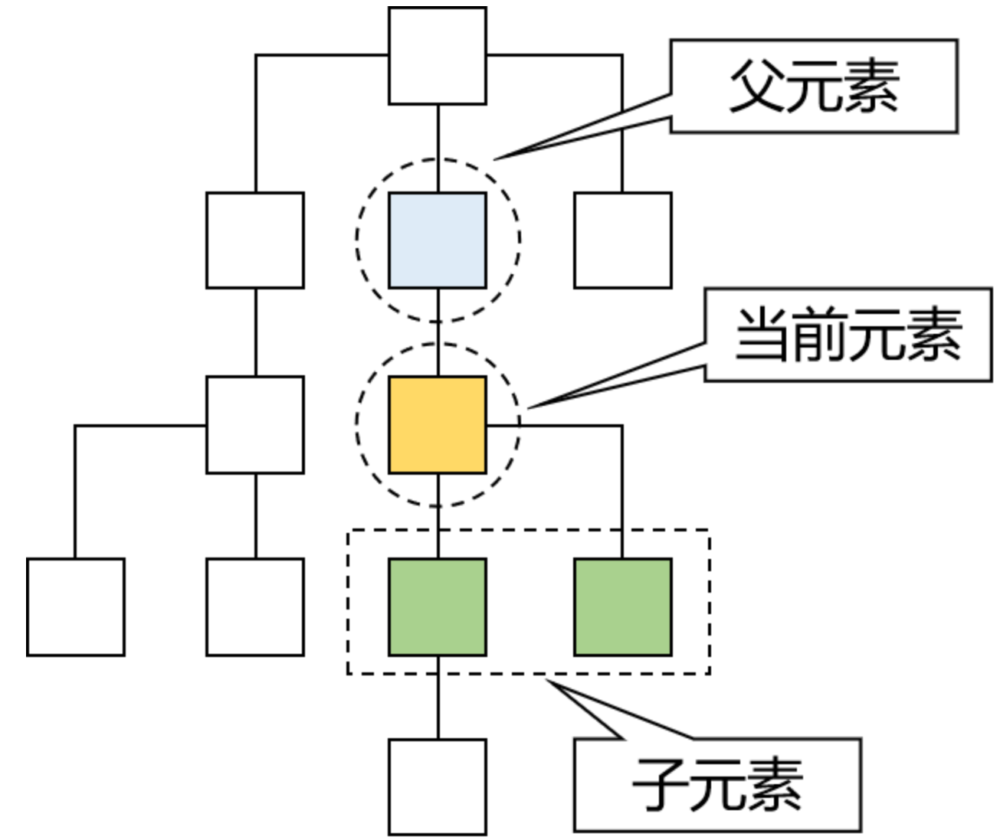

# 3 JavaScript

## 3.1 JavaScript简介

### 3.1.1 起源

在**1995**年时，由**Netscape**公司的**Brendan Eich**，在网景导航者浏览器上首次设计实现而成。Netscape在最初将其脚本语言命名为LiveScript，因为Netscape与Sun合作，网景公司管理层希望它外观看起来像Java，因此取名为JavaScript。

### 3.1.2 特征

#### 脚本语言

JavaScript是一种解释型的脚本语言。不同于C、C++、Java等语言先编译后执行, JavaScript不会产生编译出来的字节码文件，而是在程序的运行过程中对源文件逐行进行解释。

#### 基于对象

JavaScript是一种基于对象的脚本语言，它不仅可以创建对象，也能使用现有的对象。但是面向对象的三大特性：『封装』、『继承』、『多态』中，JavaScript能够实现封装，可以模拟继承，不支持多态，所以它不是一门面向对象的编程语言。

#### 弱类型

JavaScript中也有明确的数据类型，但是声明一个变量后它可以接收任何类型的数据，并且会在程序执行过程中根据上下文自动转换类型。

#### 事件驱动

JavaScript是一种采用事件驱动的脚本语言，它不需要经过Web服务器就可以对用户的输入做出响应。

#### 跨平台性

`JavaScript`脚本语言不依赖于操作系统，仅需要浏览器的支持。因此一个`JavaScript`脚本在编写后可以带到任意机器上使用，前提是机器上的浏览器支持`JavaScript`脚本语言。目前`JavaScript`已被大多数的浏览器所支持。

## 3.2 Hello World

### 3.2.1 功能效果图


### 3.2.2 代码实现

```html
<!DOCTYPE html>
<html lang="en">
<head>
  <meta charset="UTF-8">
  <title>JS: Hello world!</title>
</head>
<body>
<!-- 在HTML代码中定义一个按钮 -->
<button type="button" id="helloBtn">SayHello</button>
</body>
<!-- 在script标签中编写JavaScript代码 -->
<script type="text/javascript">

  // document对象代表整个HTML文档
  // document对象调用getElementById()方法表示根据id查找对应的元素对象
  var btnElement = document.getElementById("helloBtn");

  // 给按钮元素对象绑定单击响应函数
  btnElement.onclick = function(){
    // 弹出警告框
    alert("hello");
  };
</script>
</html>
```

## 3.3 JavaScript基本语法

### 3.3.1 代码嵌入方式

#### HTML文档内

- JavaScript代码要写在`script`标签内；
- `script`标签可以写在文档内的任意位置；
- 为了能够方便查询或操作HTML标签（元素）`script`标签可以写在`body`标签后面；

可以参考简化版的HelloWorld

```html
<!-- 在HBuilderX中，script标签通过打字“sc”两个字母就可以直接完整生成 -->
<script type="text/javascript">
	// 下面是同样实现HelloWorld功能的简化版代码
	document.getElementById("helloBtn").onclick = function() {
		alert("Hello simple");
	};
</script>
```

#### 引入外部JS文档

在script标签内通过src属性指定外部xxx.js文件的路径即可。但是要注意以下两点：

- 引用外部JavaScript文件的`script`标签里面不能写JavaScript代码；
- 先引入，再使用；
- ==**<u>`script`标签不能写成单标签</u>**==；

引入方式如下：

```html
<body>
</body>
<!-- 使用script标签的src属性引用外部JavaScript文件，和Java中的import语句类似 -->
<!-- 引用外部JavaScript文件的script标签里面不能写JavaScript代码 -->
<!-- 引用外部JavaScript文件的script标签不能改成单标签 -->
<!-- 外部JavaScript文件一定要先引入再使用 -->
<script src="/pro02-JavaScript/scripts/outter.js" type="text/javascript" charset="utf-8"></script>
<script type="text/javascript">
	// 调用外部JavaScript文件中声明的方法
	showMessage();
</script>
```

### 3.3.2 声明和使用变量

#### 数据类新

**<u>基本数据类型：</u>**

- 数值型：JavaScript不区分整数、小数；
- 字符串：JavaScript不区分字符、字符串；单引号、双引号意思一样；
- 布尔型：`true`、`false`；
  - 在JavaScript中，其他类型和布尔类型的自动转换；
  - `true`：非零的数值，非空字符串，非空对象；
  - `false`：零，空字符串，null，undefined；

**<u>引用类型：</u>**

- 关键字：`var`；

- 数据类型：JavaScript变量可以接收任意类型的数据；

- 标识符：严格区分大小写；

- 变量使用规则

  - 如果使用了一个没有声明的变量，那么会在运行时报错

    `Uncaught ReferenceError: b is not defined`；

  - 如果声明一个变量没有初始化，那么这个变量的值就是`undefined`；

### 3.3.3 函数

#### 内置函数

内置函数：系统已经声明好了可以直接使用的函数。

**<u>弹出警告框</u>**

```javascript
alert("警告框内容");
```

**<u>弹出确认框</u>**

用户点击『确定』返回true，点击『取消』返回false

```js
var result = confirm("老板，你真的不加个钟吗？");
if(result) {
	console.log("老板点了确定，表示要加钟");
}else{
	console.log("老板点了取消，表示不加钟");
}
```

**<u>在控制台打印日志</u>**

```js
console.log("日志内容");
```

#### 声明函数

写法1：

```js
function sum(a, b) {
    return a+b;
}
```

写法2：

```js
var total = function(a, b) {
    return a+b;
};
```

写法2可以这样解读：声明一个函数，相当于创建了一个『函数对象』，将这个对象的『引用』赋值给变量`total`。最后加的分号不是给函数声明加的，而是给整体的赋值语句加的分号。

#### 调用函数

JavaScript中函数本身就是一种对象，函数名就是这个**『对象』**的**『引用』**。而调用函数的格式是：**函数引用()**。

```js
function sum(a, b) {
	return a+b;
}

var result = sum(2, 3);
console.log("result="+result);
```

```js
var total = function() {
    return a+b;
}

var totalResult = total(3,6);
console.log("totalResult="+totalResult);
```

### 3.3.4 对象

JavaScript中没有『类』的概念，对于系统内置的对象可以直接创建使用。

#### 使用`new`关键字创建对象

```js
// 创建对象
var obj01 = new Object();
// 给对象设置属性和属性值
obj01.stuName = "tom";
obj01.stuAge = 20;
obj01.stuSubject = "java";
// 在控制台输出对象
console.log(obj01);
```

#### 使用`{}`创建对象

```js
// 创建对象
var obj02 = {
    "soldierName":"john",
    "soldierAge":35,
    "soldierWeapon":"gun"
};
// 在控制台输出对象
console.log(obj02);
```

#### 给对象设置函数属性

```js
// 创建对象
var obj01 = new Object();
// 给对象设置属性和属性值
obj01.stuName = "tom";
obj01.stuAge = 20;
obj01.stuSubject = "java";
obj01.study = function() {
	console.log(this.stuName + " is studying");
};
// 在控制台输出对象
console.log(obj01);
// 调用函数
obj01.study();
```

```js
// 创建对象
var obj02 = {
	"soldierName":"john",
	"soldierAge":35,
	"soldierWeapon":"gun",
	"soldierShoot":function(){
		console.log(this.soldierName + " is using " + this.soldierWeapon);
	}
};

// 在控制台输出对象
console.log(obj02);
// 调用函数
obj02.soldierShoot();
```

#### `this`关键词

this关键字只有两种情况：

- 在函数外面：`this`关键字指向`window`对象（代表当前浏览器窗口）；
- 在函数里面：`this`关键字指向调用函数的对象；

```js
// 直接打印this
console.log(this);
// 函数中的this
// 1.声明函数
function getName() {
	console.log(this.name);
}
// 2.创建对象
var obj01 = {
	"name":"tom",
	"getName":getName
};
var obj02 = {
	"name":"jerry",
	"getName":getName
};
// 3.调用函数
obj01.getName();
obj02.getName();
```

### 3.3.5 数组

#### 使用`new`关键字创建数组

```js
// 1.创建数组对象
var arr01 = new Array();
// 2.压入数据
arr01.push("apple");
arr01.push("orange");
arr01.push("banana");
arr01.push("grape");
// 3.遍历数组
for (var i = 0; i < arr01.length; i++) {
	console.log(arr01[i]);
}
// 4.数组元素反序
arr01.reverse();
for (var i = 0; i < arr01.length; i++) {
	console.log(arr01[i]);
}
// 5.数组元素拼接成字符串
var arrStr = arr01.join(",");
console.log(arrStr);
// 6.字符串拆分成数组
var arr02 = arrStr.split(",");
for (var i = 0; i < arr02.length; i++) {
	console.log(arr02[i]);
}
// 7.弹出数组中最后一个元素
var ele = arr01.pop();
console.log(ele);
```

#### 使用`[]`创建数组

```js
// 8.使用[]创建数组
var arr03 = ["cat","dog","tiger"];
console.log(arr03);
```

### 3.3.6 JSON

#### JSON格式的用途

在开发中凡是涉及到**『跨平台数据传输』**，JSON格式一定是首选。

#### JSON格式的说明

- JSON数据两端要么是**`{}`**，要么是**`[]`**；
- **`{}`**定义JSON对象；
- **`[]`**定义JSON数组；
- JSON对象的格式是：

```json
{key:value,key:value,...,key:value}
```

- JOSN数组的格式是：

```json
[value,value,...,value]
```

- `key`的类型固定是字符串
- `value`的类型可以是：
  - 基本数据类型
  - 引用类型：JSON对象或JSON数组

正因为JSON格式中value部分还可以继续使用JSON对象或JSON数组，所以JSON格式是可以**『多层嵌套』**的，所以JSON格式不论多么复杂的数据类型都可以表达。

```json
{
	"stuId":556,
	"stuName":"carl",
	"school":{
		"schoolId":339,
		"schoolName":"atguigu"
	},
	"subjectList":[
		{
			"subjectName":"java",
			"subjectScore":50
		},
		{
			"subjectName":"PHP",
			"subjectScore":35
		},
		{
			"subjectName":"python",
			"subjectScore":24
		}
	],
	"teacherMap":{
		"aaa":{
			"teacherName":"zhangsan",
			"teacherAge":20
		},
		"bbb":{
			"teacherName":"zhangsanfeng",
			"teacherAge":108
		},
		"ccc":{
			"teacherName":"zhangwuji",
			"teacherAge":25
		}
	}
}
```

#### JSON对象和JSON字符串互转

JSON对象→JSON字符串：

```js
var jsonObj = {"stuName":"tom","stuAge":20};
var jsonStr = JSON.stringify(jsonObj);
console.log(typeof jsonObj); // object
console.log(typeof jsonStr); // string
```

JSON字符串→JSON字对象：

```js
jsonObj = JSON.parse(jsonStr);
console.log(jsonObj); // {stuName: "tom", stuAge: 20}
```

## 3.4 DOM

### 3.4.1 概念

**文档对象模型（Document Object Model，DOM）**，将HTML文档抽象成模型，再封装成对象方便用程序操作。

这是一种非常常用的编程思想：将现实世界的事务抽象成模型，这样就非常容易使用对象来量化的描述现实事务，从而把生活中的问题转化成一个程序问题，最终实现用应用软件协助解决现实问题。而在这其中模型就是那个连通现实世界和代码世界的桥梁。

#### DOM树

浏览器把HTML文档从服务器上下载下来之后就开始按照**『从上到下』**的顺序**『读取HTML标签』**。每一个标签都会被封装成一个**『对象』**。

而第一个读取到的肯定是根标签html，然后是它的子标签head，再然后是head标签里的子标签。所以从html标签开始，整个文档中的所有标签都会根据它们之间的**『父子关系』**被放到一个**『树形结构』**的对象中。


这个包含了所有标签对象的整个树形结构对象就是JavaScript中的一个**可以直接使用的内置对象**：**`document`**。

例如下面的结构：


会被解析为：


### 3.4.2 具体概述

#### 组成部分类型

整个文档中的一切都可以看做Node。各个具体组成部分的具体类型可以看做Node类型的子类。

> 其实严格来说，JavaScript并不支持真正意义上的『继承』，这里我们借用Java中的『继承』概念，从逻辑上来帮助我们理解各个类型之间的关系。

| 组成部分         | 节点类型 | 具体类型 |
| ---------------- | -------- | -------- |
| 整个文档         | 文档节点 | Document |
| HTML标签         | 元素节点 | Element  |
| HTML标签内的文本 | 文本节点 | Text     |
| HTML标签内的属性 | 属性节点 | Attr     |
| 注释             | 注释节点 | Comment  |

#### 父子关系



#### 先辈后代关系


### 3.4.3 DOM操作

由于实际开发时基本上都是使用JavaScript的各种框架来操作，而框架中的操作方式和我们现在看到的原生操作完全不同，所以下面罗列的API仅供参考，不做要求。

#### 在整个文档范围内查询元素节点

| 功能               | API                                     | 返回值           |
| ------------------ | --------------------------------------- | ---------------- |
| 根据id值查询       | document.getElementById(“id值”)         | 一个具体的元素节 |
| 根据标签名查询     | document.getElementsByTagName(“标签名”) | 元素节点数组     |
| 根据name属性值查询 | document.getElementsByName(“name值”)    | 元素节点数组     |

#### 在具体元素节点范围内查找子节点

| 功能               | API                                            | 返回值   |
| ------------------ | ---------------------------------------------- | -------- |
| 查找全部子节点     | element.childNodes 【W3C考虑换行，IE≤8不考虑】 | 节点数组 |
| 查找第一个子节点   | element.firstChild 【W3C考虑换行，IE≤8不考虑】 | 节点对象 |
| 查找最后一个子节点 | element.lastChild 【W3C考虑换行，IE≤8不考虑】  | 节点对象 |

#### 查找指定元素节点的父节点

| 功能                     | API                | 返回值   |
| ------------------------ | ------------------ | -------- |
| 查找指定元素节点的父节点 | element.parentNode | 节点对象 |

#### 查找指定元素节点的兄弟节点

| 功能               | API                                              | 返回值   |
| ------------------ | ------------------------------------------------ | -------- |
| 查找前一个兄弟节点 | node.previousSibling 【W3C考虑换行，IE≤8不考虑】 | 节点对象 |
| 查找后一个兄弟节点 | node.nextSibling 【W3C考虑换行，IE≤8不考虑】     | 节点对象 |

#### 属性操作

| 需求       | 操作方式                     |
| ---------- | ---------------------------- |
| 读取属性值 | `元素对象.属性名`            |
| 修改属性值 | `元素对象.属性名=新的属性值` |

#### 文本操作

| 需求       | 操作方式                              |
| ---------- | ------------------------------------- |
| 读取文本值 | element.firstChild.nodeValue          |
| 修改文本值 | element.firstChild.nodeValue=新文本值 |

#### DOM增删改操作

| API                                      | 功能                                       |
| ---------------------------------------- | ------------------------------------------ |
| document.createElement(“标签名”)         | 创建元素节点并返回，但不会自动添加到文档中 |
| document.createTextNode(“文本值”)        | 创建文本节点并返回，但不会自动添加到文档中 |
| element.appendChild(ele)                 | 将ele添加到element所有子节点后面           |
| parentEle.insertBefore(newEle,targetEle) | 将newEle插入到targetEle前面                |
| parentEle.replaceChild(newEle, oldEle)   | 用新节点替换原有的旧子节点                 |
| parentEle.removeChild(childNode)         | 删除指定的子节点                           |
| element.innerHTML                        | 读写HTML代码                               |

## 3.5 JavaScript事件驱动

在`div`中移动鼠标，并实时显示鼠标坐标：

```html
<!DOCTYPE html>
<html>
	<head>
		<meta charset="utf-8">
		<title></title>
		<style type="text/css">
			#eventArea {
				border: 1px solid black;
				width: 100px;
				height: 100px;
			}
		</style>
	</head>
	<body>
		<!-- 用div作为鼠标移动区域 -->
		<div id="eventArea"></div>
		
		<!-- 在p标签内显示鼠标坐标 -->
		<p id="showData"></p>
	</body>
	<script type="text/javascript">
		
		// 根据id找到div标签对应的元素对象
		var divEle = document.getElementById("eventArea");
		
		// 根据id找到p标签对应的元素对象
		var pEle = document.getElementById("showData");
		
		// 声明事件响应函数
		function whenMouseMove(event){
			pEle.innerText = event.clientX + " " + event.clientY;
		}
		
		// 将事件响应函数赋值给对应的事件属性		
		// onmousemove表示在鼠标移动的时候
		divEle.onmousemove = whenMouseMove;
	</script>
</html>
```

