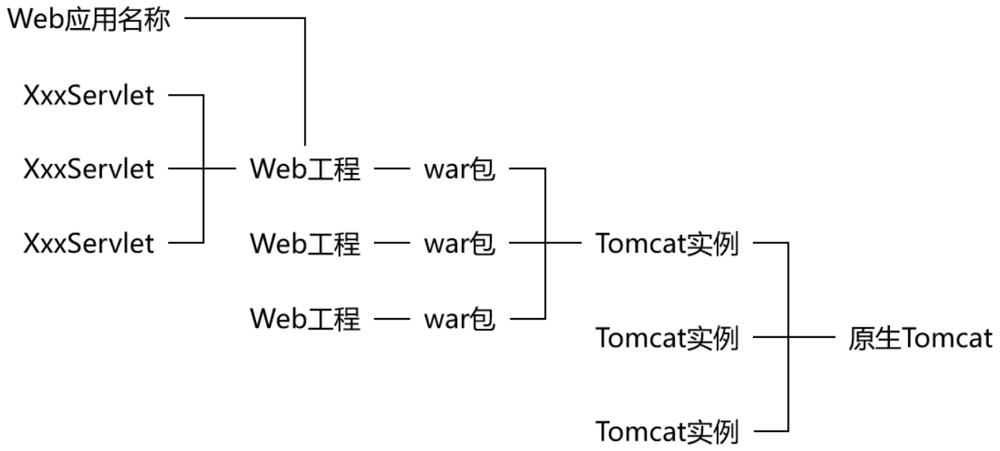
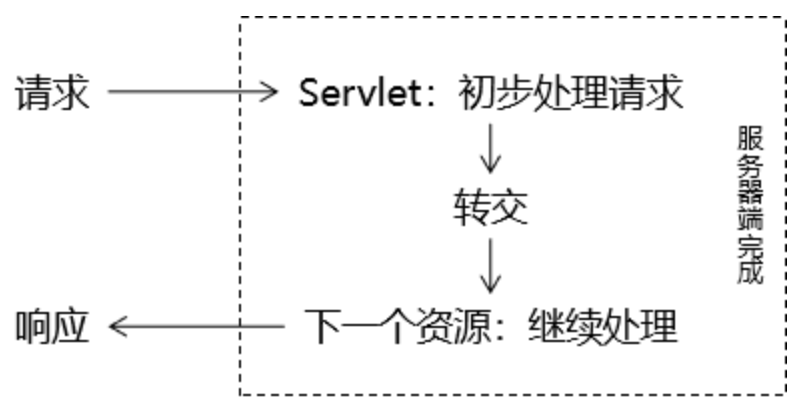
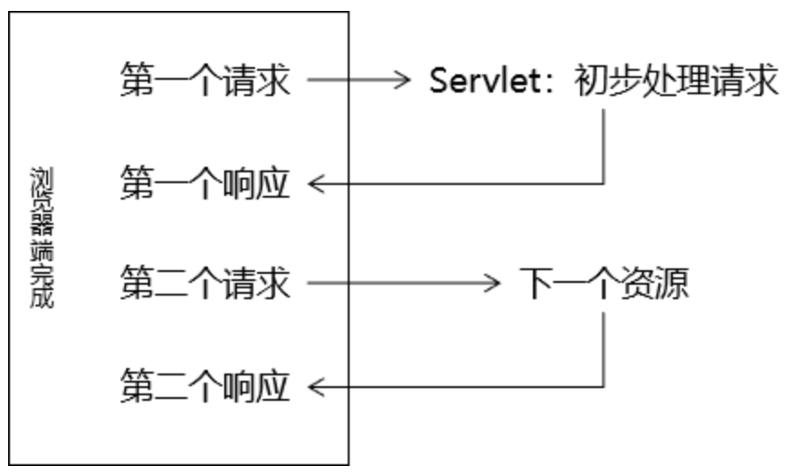

# 5 Servlet

## 5.1 概述

### 5.1.1 名字

`Servlet=Server+applet`

- `Server`：服务器；

- `applet`：小程序；

`Servlet`含义是服务器端的小程序

### 5.1.2 Servlet在Web中作用


在整个Web应用中，Servlet主要负责处理请求、协调调度功能。我们可以把Servlet称为Web应用中的**『控制器』**。

## 5.2 Servlet HelloWorld

### 5.2.1 HelloWorld分析

#### 目标

在页面上点击超链接，由`Servlet`处理这个请求，并返回一个响应字符串：`Hello,I am Servlet`。

#### 思路


### 5.2.2 具体步骤

1. 创建动态Web module；
2. 在`index.jsp`中创建超链接；

```html
<!-- /Web应用地址/Servlet地址 -->
<a href="/app/helloServlet">Servlet Hello World</a>
```

3. 创建`HelloServlet.java`；

```java
public class HelloServlet implements Servlet {
    @Override
    public void init(ServletConfig servletConfig) throws ServletException {

    }

    @Override
    public ServletConfig getServletConfig() {
        return null;
    }

    @Override
    public void service(ServletRequest servletRequest, ServletResponse servletResponse) throws ServletException, IOException {

        // 控制台打印，证明这个方法被调用了
        System.out.println("我是HelloServlet，我执行了！");

        // 返回响应字符串
        // 1、获取能够返回响应数据的字符流对象
        PrintWriter writer = servletResponse.getWriter();

        // 2、向字符流对象写入数据
        writer.write("Hello,I am Servlet");
    }

    @Override
    public String getServletInfo() {
        return null;
    }

    @Override
    public void destroy() {

    }
}
```

4. 在web.xml中配置HelloServlet

```xml
<!-- 配置Servlet本身 -->
<servlet>
    <!-- 全类名太长，给Servlet设置一个简短名称 -->
    <servlet-name>HelloServlet</servlet-name>

    <!-- 配置Servlet的全类名 -->
    <servlet-class>com.atguigu.servlet.HelloServlet</servlet-class>
</servlet>

<!-- 将Servlet和访问地址关联起来 -->
<servlet-mapping>
    <servlet-name>HelloServlet</servlet-name>
    <url-pattern>/helloServlet</url-pattern>
</servlet-mapping>
```

**『虚拟路径』**：Servlet并**不是**文件系统中**实际存在**的**目录或文件**，所以为了方便浏览器访问，我们创建了**虚拟**出来的路径来访问它。

### 5.2.3 梳理概念

#### 原生Tomcat

从官网下载的zip文件，可通过命令行shell运行；

#### IDEA中的Tomcat实例

在IDEA中对具体网络项目、网络模块进行Tomcat配置；

#### IDEA中的Web工程


#### 访问资源的地址

1. **<u>静态资源</u>**
   - HTML文件；
   - CSS文件；
   - JavaScript文件；
   - 图片文件；

`/Web应用名称/静态资源本身的路径`

2. **<u>动态资源</u>**
   - Servlet

`/Web应用名称/虚拟路径`

#### 总体的逻辑结构



## 5.3 Servlet生命周期

### 5.3.1 Servlet接口


### 5.3.2 Servlet创建对象的时机

#### 验证方式

在HelloServlet的构造器中执行控制台打印：

```java
public HelloServlet(){
    System.out.println("我来了！HelloServlet对象创建！");
}
```

#### 结论

- 默认情况下：Servlet在**第一次接收到请求**的时候才创建对象
- 创建对象后，所有的URL地址匹配的请求都由这同一个对象来处理；
- Tomcat中，每一个请求会被分配一个线程来处理，所以可以说：Servlet是**单实例，多线程**方式运行的；
- 既然Servlet是多线程方式运行，所以有线程安全方面的可能性，所以不能在处理请求的方法中修改公共属性；

#### 修改创建对象的时机

修改`web.xml`中Servlet的配置：

```xml
<!-- 配置Servlet本身 -->
<servlet>
    <!-- 全类名太长，给Servlet设置一个简短名称 -->
    <servlet-name>HelloServlet</servlet-name>

    <!-- 配置Servlet的全类名 -->
    <servlet-class>com.atguigu.servlet.HelloServlet</servlet-class>

    <!-- 配置Servlet启动顺序 -->
    <load-on-startup>1</load-on-startup>
</servlet>
```

### 5.3.3 Servlet容器

#### 容器

在开发使用的各种技术中，经常会有很多对象会放在容器中；

#### 功能

容器会管理内部对象的整个生命周期。对象在容器中才能够正常的工作，得到来自容器的全方位的支持。

- 创建对象；
- 初始化；
- 工作；
- 清理；

#### 本身也是对象

- 特点1：往往是非常大的对象；
- 特点2：通常的单例的；

#### Servlet容器产品

- Tomcat
- jetty
- jboss
- Weblogic
- WebSphere
- glassfish

### 5.3.4 总结

| 名称       | 时机                                                         | 次数 |
| ---------- | ------------------------------------------------------------ | ---- |
| 创建对象   | 默认情况：接收到第一次请求 修改启动顺序后：Web应用启动过程中 | 一次 |
| 初始化操作 | 创建对象之后                                                 | 一次 |
| 处理请求   | 接收到请求                                                   | 多次 |
| 销毁操作   | Web应用卸载之前                                              | 一次 |

## 5.4 `ServletConfig`和`ServletContext`

### 5.4.1 类比

Servlet对象 → ServletConfig对象 → ServletContext对象

### 5.4.2 `ServletConfig`接口

| 方法名                  | 作用                                                         |
| ----------------------- | ------------------------------------------------------------ |
| getServletName()        | 获取`<servlet-name>HelloServlet</servlet-name>`定义的Servlet名称 |
| **getServletContext()** | 获取ServletContext对象                                       |
| getInitParameter()      | 获取配置Servlet时设置的『初始化参数』，根据名字获取值        |
| getInitParameterNames() | 获取所有初始化参数名组成的Enumeration对象                    |

#### 初始化参数举例

```xml
<!-- 配置Servlet本身 -->
<servlet>
    <!-- 全类名太长，给Servlet设置一个简短名称 -->
    <servlet-name>HelloServlet</servlet-name>
    <!-- 配置Servlet的全类名 -->
    <servlet-class>com.atguigu.servlet.HelloServlet</servlet-class>

    <!-- 配置初始化参数 -->
    <init-param>
        <param-name>goodMan</param-name>
        <param-value>me</param-value>
    </init-param>

    <!-- 配置Servlet启动顺序 -->
    <load-on-startup>1</load-on-startup>
</servlet>
```

#### 测试

```java
class HelloServlet implements Servlet {

    // 声明一个成员变量，用来接收init()方法传入的servletConfig对象
    private ServletConfig servletConfig;

    public HelloServlet(){
        System.out.println("我来了！HelloServlet对象创建！");
    }

    @Override
    public void init(ServletConfig servletConfig) throws ServletException {

        System.out.println("HelloServlet对象初始化");

        // 将Tomcat调用init()方法时传入的servletConfig对象赋值给成员变量
        this.servletConfig = servletConfig;

    }

    @Override
    public ServletConfig getServletConfig() {

        // 返回成员变量servletConfig，方便使用
        return this.servletConfig;
    }

    @Override
    public void service(ServletRequest servletRequest, ServletResponse servletResponse) throws ServletException, IOException {

        // 控制台打印，证明这个方法被调用了
        System.out.println("我是HelloServlet，我执行了！");

        // 返回响应字符串
        // 1、获取能够返回响应数据的字符流对象
        PrintWriter writer = servletResponse.getWriter();

        // 2、向字符流对象写入数据
        writer.write("Hello,I am Servlet");

        // =============分割线===============
        // 测试ServletConfig对象的使用
        // 1.获取ServletConfig对象：在init()方法中完成
        System.out.println("servletConfig = " + servletConfig.getClass().getName());

        // 2.通过servletConfig对象获取ServletContext对象
        ServletContext servletContext = this.servletConfig.getServletContext();
        System.out.println("servletContext = " + servletContext.getClass().getName());

        // 3.通过servletConfig对象获取初始化参数
        Enumeration<String> enumeration = this.servletConfig.getInitParameterNames();
        while (enumeration.hasMoreElements()) {
            String name = enumeration.nextElement();
            System.out.println("name = " + name);

            String value = this.servletConfig.getInitParameter(name);
            System.out.println("value = " + value);
        }
    }

    @Override
    public String getServletInfo() {
        return null;
    }

    @Override
    public void destroy() {
        System.out.println("HelloServlet对象即将销毁，现在执行清理操作");
    }
}
```

- 广义Servlet：`javax.servlet`包下的一系列接口定义的一组**Web开发标准**。遵循这一套标准，不同的Servlet容器提供了不同的实现。
- 狭义Servlet：`javax.servlet.Servlet`接口和它的实现类，也就是实际开发时使用的具体的Servlet。

Servlet标准和JDBC标准对比：

| Servlet标准                     | JDBC标准                             |
| ------------------------------- | ------------------------------------ |
| javax.servlet包下的一系列接口   | javax.sql包下的一系列接口            |
| Servlet容器厂商提供的具体实现类 | 数据库厂商提供的实现类（数据库驱动） |

同样都体现了**面向接口编程**的思想，同时也体现了**解耦**的思想：只要接口不变，下层方法有任何变化，都不会影响上层方法。

### 5.4.3 `ServletContext`接口

- 代表：整个Web应用
- 是否单例：是
- 典型的功能：
  - 获取某个资源的真实路径：getRealPath()
  - 获取整个Web应用级别的初始化参数：getInitParameter()
  - 作为Web应用范围的域对象
    - 存入数据：setAttribute()
    - 取出数据：getAttribute()

#### 配置Web应用级别的初始化参数

```xml
<!-- 配置Web应用的初始化参数 -->
<context-param>
    <param-name>handsomeMan</param-name>
    <param-value>alsoMe</param-value>
</context-param>
```

#### 获取参数

```java
String handsomeMan = servletContext.getInitParameter("handsomeMan");
System.out.println("handsomeMan = " + handsomeMan);
```

## 5.5 使用IDEA创建Servlet

在Web模块中的`src`文件右键可添加`Servlet`选项文件，取消勾选`创建Java EE注解类`，`web.xml`中会自动添加`servlet`标签，然后我们自己补充`servlet-mapping`标签。

IDEA生成的Servlet类会自动继承`HttpServlet`。

## 5.6 Servlet继承关系

### 5.6.1 类型关系


### 5.6.2 方法关系


## 5.7 动态Web工程内编写路径

### 5.7.1 为什么要写路径

- 整个系统要根据功能拆分成许许多多**独立**的**资源**；
- 资源之间既要完成自身的功能又要和其他资源**配合**；
- 写路径就是为了从一个资源**跳转**到下一个资源；

### 5.7.2 路径复杂

#### 先开发再部署

- **工程目录**：我们写代码的地方，但是在服务器上运行的不是这个；
- **部署目录**：经过Java源文件**编译**和**目录重组**后，IDEA就替我们准备好了可以在服务器上运行的部署目录；
- **区别**：因为从工程目录到部署目录经过了**目录重组**，所以它们的目录结构是**不同**的；
- **基准**：用户通过浏览器访问服务器，而服务器上运行的是部署目录，所以写路径的时候**参考部署目录**而不是工程目录；
- **对应关系**：**工程目录下的web目录对应部署目录的根目录**，同时部署目录的根目录也是路径中的**Web应用根目录**；


#### 路径的各个组成部分

从最前面一直到Web应用名称这里都是固定写法，到资源名这里要看具体是什么资源。

##### 具体文件

我们写代码的时候都是在工程目录下操作，所以参照工程目录来说最方便。按照工程目录的目录结构来说，从web目录开始按照实际目录结构写就好了（不包括web目录本身）。


##### Servlet

访问Servlet的路径是我们在`web.xml`中配置的，大家可能注意到了，`url-pattern`里面的路径我们也是**斜杠开头**的，但是这个开头的斜杠代表**Web应用根目录**。

同样是开头的斜杠，超链接路径中的开头斜杠代表服务器根目录，Servlet地址开头的斜杠，代表Web应用根目录。

### 5.7.3 准则

| 路径类型           | 解析方式                  |
| ------------------ | ------------------------- |
| 由浏览器解析的路径 | 开头斜杠代表服务器根目录  |
| 由服务器解析的路径 | 开头斜杠代表Web应用根目录 |

- 浏览器解析的路径举例：
  - 所有HTML标签中的路径
  - **重定向**过程中指定的路径
- 服务器解析的路径举例：
  - 所有web.xml中配置的路径
  - **请求转发**过程中指定的路径

### 5.7.4 写路径步骤


### 5.7.5 动态获取上下文步骤

#### 上下文路径的概念

**上下文路径（context path）**=/Web应用名称；

#### 动态获取

由于项目部署的时候，上下文路径是可以变化的，所以写死有可能发生错误。此时我们通过request对象动态获取上下文路径就不用担心这个问题了。调用下面这个方法，每一次获取的都是当前环境下实际的上下文路径的值。

```java
request.getContextPath()
```

## 5.8 请求转发和重定向

### 5.8.1 接力

发一个请求给Servlet，接力棒就传递到了Servlet手中。而绝大部分情况下，Servlet不能独自完成一切，需要把接力棒继续传递下去，此时我们就需要请求的**『转发』**或**『重定向』**。

### 5.8.2 转发

在请求的处理过程中，Servlet完成了自己的任务，需要把请求**转交给下一个资源**继续处理。



```java
request.getRequestDispatcher("/fruit/apple/red/sweet/big.html").forward(request, response);
```

关键：由于转发操作的核心部分是**在服务器端完成**的，所以浏览器感知不到，整个过程中浏览器**只发送一次请求**。

### 5.8.3 重定向

在请求的处理过程中，Servlet完成了自己的任务，然后以一个**响应**的方式告诉浏览器：“要完成这个任务还需要你另外**再访问下一个资源**”。



```java
response.sendRedirect("/app/fruit/apple/red/sweet/big.html");
```

关键：由于重定向操作的核心部分是**在浏览器端完成**的，所以整个过程中浏览器**共发送两次请求**。

### 5.8.4 对比

| 转发                                 | 重定向                               |
| ------------------------------------ | ------------------------------------ |
| **一次请求**                         | **两次请求**                         |
| 浏览器地址栏显示的是第一个资源的地址 | 浏览器地址栏显示的是第二个资源的地址 |
| 全程使用的是同一个request对象        | 全程使用的是不同的request对象        |
| 在服务器端完成                       | 在浏览器端完成                       |
| 目标资源地址由服务器解析             | 目标资源地址由浏览器解析             |
| 目标资源可以在WEB-INF目录下          | 目标资源不能在WEB-INF目录下          |
| 目标资源仅限于本应用内部             | 目标资源可以是外部资源               |

### 5.8.5 应用场景

可以简单的判断：能用转发的先用转发，如果转发不行，再使用重定向。

- 需要通过同一个request对象把数据携带到目标资源：只能用转发；
- 如果希望前往下一个资源之后，浏览器刷新访问的是第二个资源：只能用重定向；

## 5.9 获取请求参数

### 5.9.1 概念

浏览器在给服务器发送请求的同时，携带的参数数据。

### 5.9.2 基本形式

- URL地址后面附着的请求参数；

`/orange/CharacterServlet?username=汤姆`

- 表单；
- Ajax请求（将来会学到）；

### 5.9.3 服务器对请求参数的封装

总体上来说，服务器端将请求参数封装为**`Map<String, String[]>`**。

- 键：请求参数的名字；
- 值：请求参数的值组成的数组；

### 5.9.4 获取请求参数的方法

| 方法名                                       | 返回值类型            |
| -------------------------------------------- | --------------------- |
| request.getParameterMap()                    | Map<String, String[]> |
| request.getParameter("请求参数的名字")       | String                |
| request.getParameterValues("请求参数的名字") | String []             |
| request.getParameterNames()                  | Enumeration<String>   |

### 5.9.5 示例

#### HTML

```html
<!-- 测试请求参数的表单 -->
<form action="/orange/ParamServlet" method="post">

    <!-- 单行文本框 -->
    <!-- input标签配合type="text"属性生成单行文本框 -->
    <!-- name属性定义的是请求参数的名字 -->
    <!-- 如果设置了value属性，那么这个值就是单行文本框的默认值 -->
    个性签名：<input type="text" name="signal" value="单行文本框的默认值" /><br/>

    <!-- 密码框 -->
    <!-- input标签配合type="password"属性生成密码框 -->
    <!-- 用户在密码框中填写的内容不会被一明文形式显示 -->
    密码：<input type="password" name="secret" /><br/>

    <!-- 单选框 -->
    <!-- input标签配合type="radio"属性生成单选框 -->
    <!-- name属性一致的radio会被浏览器识别为同一组单选框，同一组内只能选择一个 -->
    <!-- 提交表单后，真正发送给服务器的是name属性和value属性的值 -->
    <!-- 使用checked="checked"属性设置默认被选中 -->
    请选择你最喜欢的季节：
    <input type="radio" name="season" value="spring" />春天
    <input type="radio" name="season" value="summer" checked="checked" />夏天
    <input type="radio" name="season" value="autumn" />秋天
    <input type="radio" name="season" value="winter" />冬天

    <br/><br/>

    你最喜欢的动物是：
    <input type="radio" name="animal" value="tiger" />路虎
    <input type="radio" name="animal" value="horse" checked="checked" />宝马
    <input type="radio" name="animal" value="cheetah" />捷豹

    <br/>

    <!-- 多选框 -->
    <!-- input标签和type="checkbox"配合生成多选框 -->
    <!-- 多选框被用户选择多个并提交表单后会产生『一个名字携带多个值』的情况 -->
    你最喜欢的球队是：
    <input type="checkbox" name="team" value="Brazil"/>巴西
    <input type="checkbox" name="team" value="German" checked="checked"/>德国
    <input type="checkbox" name="team" value="France"/>法国
    <input type="checkbox" name="team" value="China" checked="checked"/>中国
    <input type="checkbox" name="team" value="Italian"/>意大利

    <br/>

    <!-- 下拉列表 -->
    <!-- 使用select标签定义下拉列表整体，在select标签内设置name属性 -->
    你最喜欢的运动是：
    <select name="sport">
        <!-- 使用option属性定义下拉列表的列表项 -->
        <!-- 使用option标签的value属性设置提交给服务器的值，在option标签的标签体中设置给用户看的值 -->
        <option value="swimming">游泳</option>
        <option value="running">跑步</option>

        <!-- 使用option标签的selected="selected"属性设置这个列表项默认被选中 -->
        <option value="shooting" selected="selected">射击</option>
        <option value="skating">溜冰</option>
    </select>

    <br/>

    <br/><br/>

    <!-- 表单隐藏域 -->
    <!-- input标签和type="hidden"配合生成表单隐藏域 -->
    <!-- 表单隐藏域在页面上不会有任何显示，用来保存要提交到服务器但是又不想让用户看到的数据 -->
    <input type="hidden" name="userId" value="234654745" />

    <!-- 多行文本框 -->
    自我介绍：<textarea name="desc">多行文本框的默认值</textarea>

    <br/>

    <!-- 普通按钮 -->
    <button type="button">普通按钮</button>

    <!-- 重置按钮 -->
    <button type="reset">重置按钮</button>

    <!-- 表单提交按钮 -->
    <button type="submit">提交按钮</button>
</form>
```

#### Java

```java
// 获取包含全部请求参数的Map
    Map<String, String[]> parameterMap = request.getParameterMap();

    // 遍历这个包含全部请求参数的Map
    Set<String> keySet = parameterMap.keySet();

    for (String key : keySet) {

        String[] values = parameterMap.get(key);

        System.out.println(key + "=" + Arrays.asList(values));
    }

    System.out.println("---------------------------");

    // 根据请求参数名称获取指定的请求参数值
    // getParameter()方法：获取单选框的请求参数
    String season = request.getParameter("season");
    System.out.println("season = " + season);

    // getParameter()方法：获取多选框的请求参数
    // 只能获取到多个值中的第一个
    String team = request.getParameter("team");
    System.out.println("team = " + team);

    // getParameterValues()方法：取单选框的请求参数
    String[] seasons = request.getParameterValues("season");
    System.out.println("Arrays.asList(seasons) = " + Arrays.asList(seasons));

    // getParameterValues()方法：取多选框的请求参数
    String[] teams = request.getParameterValues("team");
    System.out.println("Arrays.asList(teams) = " + Arrays.asList(teams));
```

## 5.10 请求响应设置字符集

### 5.10.1 请求

#### GET请求

在`server.xml`的`Connector`标签中增加`URIEncoding`属性：

```xml
<Connector port="8080" protocol="HTTP/1.1"
		   connectionTimeout="20000"
		   redirectPort="8443" 
		   URIEncoding="UTF-8"
		   />
```

重启Tomcat实例即可。

#### POST请求

使用request对象设置字符集：

```java
// 使用request对象设置字符集
request.setCharacterEncoding("UTF-8");

// 获取请求参数
String username = request.getParameter("username");

System.out.println("username = " + username);
```

### 5.10.2 响应

编码字符集和解码字符集一致

```java
// 设置服务器端的编码字符集
response.setCharacterEncoding("UTF-8");

PrintWriter writer = response.getWriter();

writer.write("<!DOCTYPE html>                  ");
writer.write("<html>                           ");
writer.write("<head>                           ");
writer.write("<!-- 设置浏览器端的解码字符集 -->");
writer.write("    <meta charset='UTF-8'>       ");
writer.write("    <title>Title</title>         ");
writer.write("</head>                          ");
writer.write("<body>                           ");
writer.write("<p>志玲姐姐你好！</p>            ");
writer.write("</body>                          ");
writer.write("</html>                          ");
```

或者

设置response对象：

```java
response.setContentType("text/html;charset=UTF-8");
```

