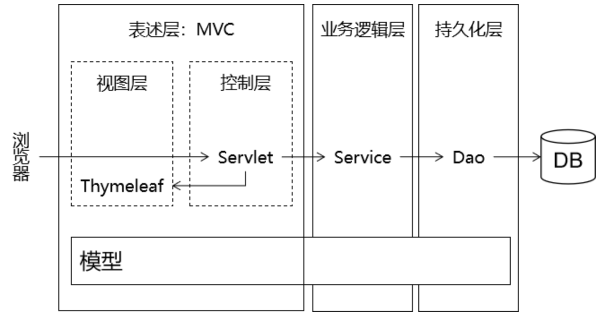
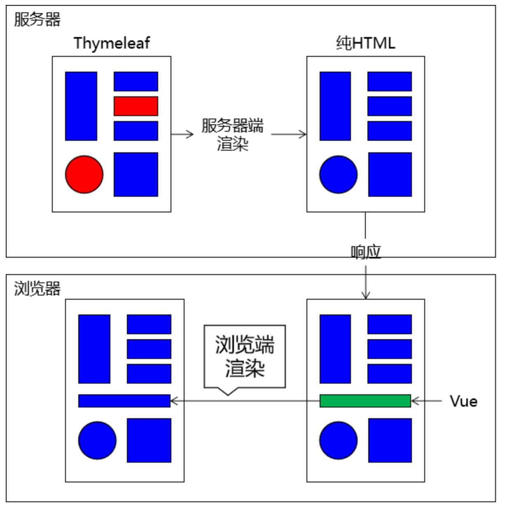
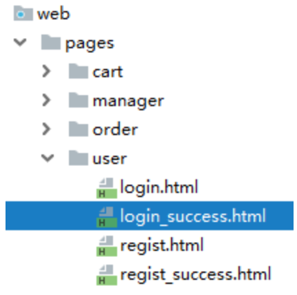
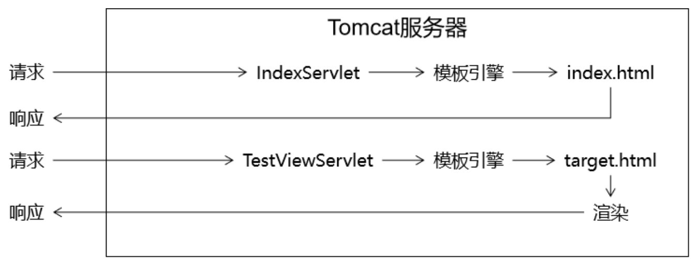
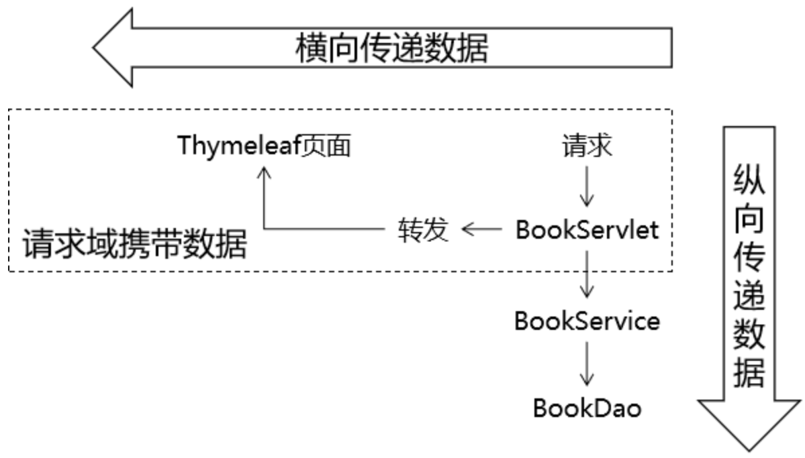
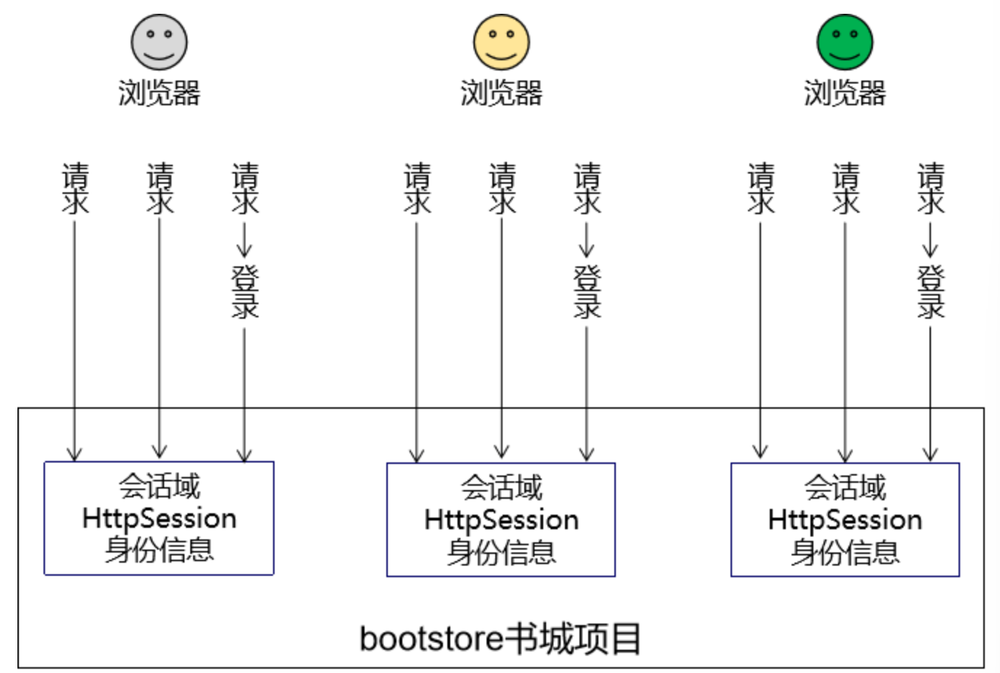
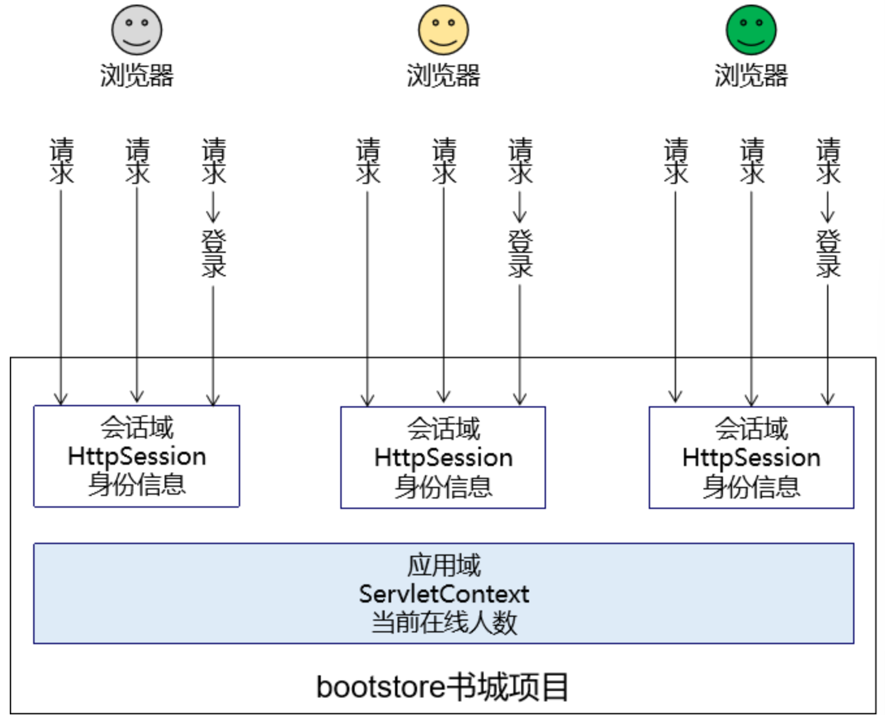
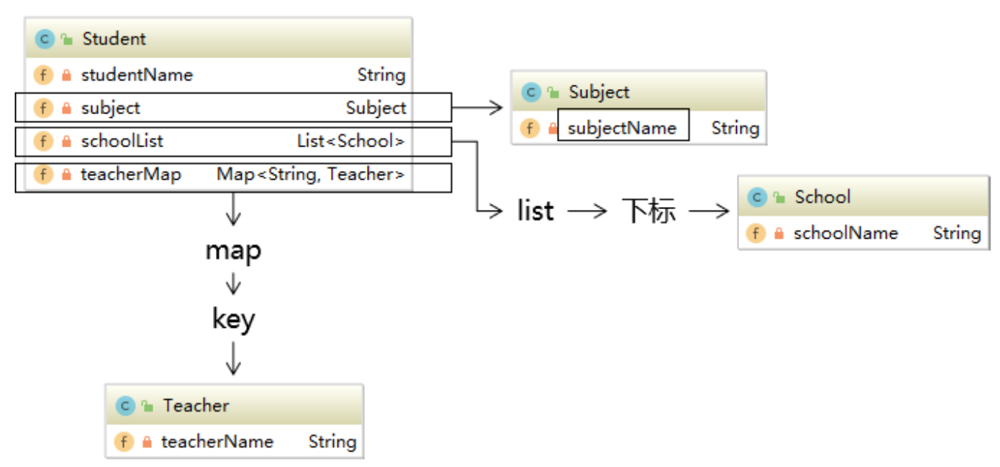
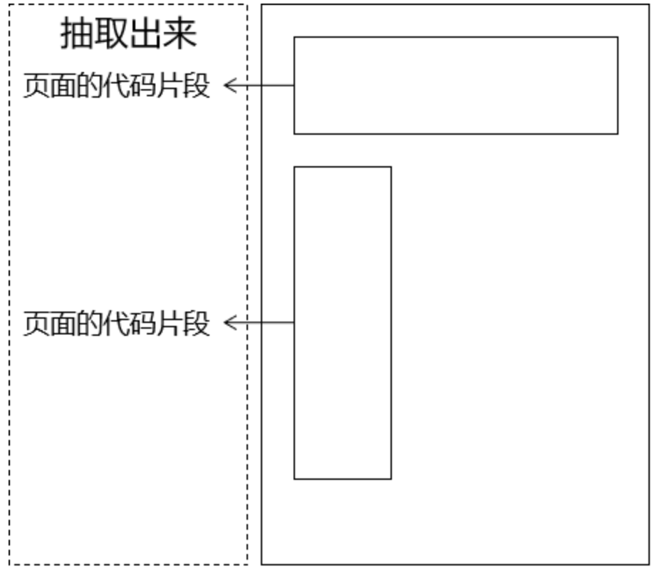

# 6 Thymeleaf

## 6.1 MVC

### 6.1.1 背景

我们对HTML的新的期待：既能够正常显示页面，又能在页面中包含动态数据部分。而动态数据单靠HTML本身是无法做到的，所以此时我们需要引入服务器端动态视图模板技术。

### 6.1.2 从三层结构到MVC

#### MVC概念

- M：Model模型；

- V：View视图；

- C：Controller控制器；

MVC是在表述层开发中运用的一种设计理念。主张把**封装数据的『模型』**、**显示用户界面的『视图』**、**协调调度的『控制器』**分开。

好处：

- 进一步实现各个组件之间的解耦；
- 让各个组件可以单独维护；
- 将视图分离出来以后，我们后端工程师和前端工程师的对接更方便；

#### MVC和三层架构之间的关系



### 6.1.3 前后端对接方式

- 服务器端渲染：前端工程师把前端页面一整套做好交给后端工程师；
- 前后端分离：开会商量JSON格式，然后分头开发。在后端程序尚不可用时，前端工程师会使用`Mock.js`生成假数据使用，在后端程序可用后再连接实际后端程序获取真实数据；



## 6.2 Thymeleaf简介

### 6.2.1 服务器模板技术

JSP、Freemarker、Velocity等等，它们有一个共同的名字：**服务器端模板技术**。

### 6.2.2 Thymeleaf介绍

Thymelaf是一个适用于web和独立环境的现代服务器端Java模板引擎，能够处理HTML、XML、JavaScript、CSS甚至纯文本。Thymelaf的主要目标是提供一种优雅且高度可维护的创建模板的方法。为了实现这一点，它建立在自然模板的概念之上，以一种不影响模板用作设计原型的方式将其逻辑注入模板文件。这改善了设计的沟通，并弥合了设计和开发团队之间的差距。Thymelaf也从一开始就考虑到了Web标准，尤其是HTML5，允许您在需要时创建完全验证的模板。

> Thymeleaf is a modern server-side Java template engine for both web and standalone environments, capable of processing HTML, XML, JavaScript, CSS and even plain text. The main goal of Thymeleaf is to provide an elegant and highly-maintainable way of creating templates. To achieve this, it builds on the concept of Natural Templates to inject its logic into template files in a way that doesn’t affect the template from being used as a design prototype. This improves communication of design and bridges the gap between design and development teams. Thymeleaf has also been designed from the beginning with Web Standards in mind – especially HTML5 – allowing you to create fully validating templates if that is a need for you.

### 6.2.3 Thymeleaf优势

- SpringBoot官方推荐使用的视图模板技术，和SpringBoot完美整合；
- 不经过服务器运算仍然可以直接查看原始值，对前端工程师更友好；

```html
<!DOCTYPE html>
<html lang="en" xmlns:th="http://www.thymeleaf.org">
<head>
    <meta charset="UTF-8">
    <title>Title</title>
</head>
<body>

    <p th:text="${hello}">Original Value</p>

</body>
</html>
```

### 6.2.4 物理视图和逻辑视图

#### 物理视图

在Servlet中，将请求转发到一个HTML页面文件时，使用的完整的转发路径就是**物理视图**。



`/pages/user/login_success.html`

如果我们把所有的HTML页面都放在某个统一的目录下，那么转发地址就会呈现出明显的规律：

- `/pages/user/login.html`；
- `/pages/user/login_success.html`；
- `/pages/user/regist.html`；
- `/pages/user/regist_success.html`；

路径的开头都是：`/pages/user/`

路径的结尾都是：`.html`

所以，路径开头的部分我们称之为**视图前缀**，路径结尾的部分我们称之为**视图后缀**。

#### 逻辑视图

==**<u>物理视图=视图前缀+逻辑视图+视图后缀</u>**==

上面的例子中：

| 视图前缀     | 逻辑视图      | 视图后缀 | 物理视图                       |
| ------------ | ------------- | -------- | ------------------------------ |
| /pages/user/ | login         | .html    | /pages/user/login.html         |
| /pages/user/ | login_success | .html    | /pages/user/login_success.html |

## 6.3 引入Thymeleaf环境

### 6.3.1 引入步骤

1. 加入Thymeleaf提供的jar包；
2. 配置上下文参数；

```xml
<!-- 在上下文参数中配置视图前缀和视图后缀 -->
<context-param>
    <param-name>view-prefix</param-name>
    <param-value>/WEB-INF/view/</param-value>
</context-param>
<context-param>
    <param-name>view-suffix</param-name>
    <param-value>.html</param-value>
</context-param>
```

> 为什么要放在WEB-INF目录下？
>
> 原因：WEB-INF目录不允许浏览器直接访问，所以我们的视图模板文件放在这个目录下，是一种保护。以免外界可以随意访问视图模板文件。
>
> 访问WEB-INF目录下的页面，都必须通过Servlet转发过来，简单说就是：不经过Servlet访问不了。
>
> 这样就方便我们在Servlet中检查当前用户是否有权限访问。
>
> 那放在WEB-INF目录下之后，重定向进不去怎么办？
>
> 重定向到Servlet，再通过Servlet转发到WEB-INF下。

3. 创建Servlet基类；

```java
import jakarta.servlet.*;
import jakarta.servlet.http.*;
import org.thymeleaf.TemplateEngine;
import org.thymeleaf.context.WebContext;
import org.thymeleaf.templatemode.TemplateMode;
import org.thymeleaf.templateresolver.WebApplicationTemplateResolver;
import org.thymeleaf.web.IWebExchange;
import org.thymeleaf.web.servlet.JakartaServletWebApplication;

import java.io.IOException;

public class ViewBaseServlet extends HttpServlet {
    private TemplateEngine templateEngine;

    @Override
    public void init() throws ServletException {

        // 1.获取ServletContext对象
        ServletContext servletContext = this.getServletContext();

        // 2.创建Thymeleaf解析器对象
        WebApplicationTemplateResolver templateResolver = new WebApplicationTemplateResolver(JakartaServletWebApplication.buildApplication(servletContext));

        // 3.给解析器对象设置参数
        // ①HTML是默认模式，明确设置是为了代码更容易理解
        templateResolver.setTemplateMode(TemplateMode.HTML);

        // ②设置前缀
        String viewPrefix = servletContext.getInitParameter("view-prefix");

        templateResolver.setPrefix(viewPrefix);

        // ③设置后缀
        String viewSuffix = servletContext.getInitParameter("view-suffix");

        templateResolver.setSuffix(viewSuffix);

        // ④设置缓存过期时间（毫秒）
        templateResolver.setCacheTTLMs(60000L);

        // ⑤设置是否缓存
        templateResolver.setCacheable(true);

        // ⑥设置服务器端编码方式
        templateResolver.setCharacterEncoding("utf-8");

        // 4.创建模板引擎对象
        templateEngine = new TemplateEngine();

        // 5.给模板引擎对象设置模板解析器
        templateEngine.setTemplateResolver(templateResolver);

    }

    protected void processTemplate(String templateName, HttpServletRequest req, HttpServletResponse resp) throws IOException {
        // 1.设置响应体内容类型和字符集
        resp.setContentType("text/html;charset=UTF-8");
        IWebExchange iServletWebExchange = JakartaServletWebApplication.buildApplication(this.getServletContext()).buildExchange(req, resp);
        // 2.创建WebContext对象
        WebContext webContext = new WebContext(iServletWebExchange);
        webContext.setVariable("url", getServletContext().getContextPath());

        // 3.处理模板数据
        templateEngine.process(templateName, webContext, resp.getWriter());
    }
}
```

### 6.3.2 HelloWorld

#### 创建TestThymeleafServlet.java

```java
import jakarta.servlet.ServletException;
import jakarta.servlet.http.HttpServletRequest;
import jakarta.servlet.http.HttpServletResponse;

import java.io.IOException;

public class TestThymeleafServlet extends ViewBaseServlet {
    @Override
    protected void doGet(HttpServletRequest request, HttpServletResponse response) throws ServletException, IOException {
        // 1.声明当前请求要前往的视图名称
        String viewName = "target";

        // 2.调用ViewBaseServlet父类中的解析视图模板的方法
        super.processTemplate(viewName, request, response);
    }

    @Override
    protected void doPost(HttpServletRequest request, HttpServletResponse response) throws ServletException, IOException {

    }
}
```

#### 添加web.xml

```xml
<servlet>
    <servlet-name>ViewBaseServlet</servlet-name>
    <servlet-class>com.seu.servlet.ViewBaseServlet</servlet-class>
</servlet>
<servlet>
    <servlet-name>TestThymeleafServlet</servlet-name>
    <servlet-class>com.seu.servlet.TestThymeleafServlet</servlet-class>
</servlet>
<servlet-mapping>
    <servlet-name>ViewBaseServlet</servlet-name>
    <url-pattern>/ViewBaseServlet</url-pattern>
</servlet-mapping>
<servlet-mapping>
    <servlet-name>TestThymeleafServlet</servlet-name>
    <url-pattern>/TestThymeleafServlet</url-pattern>
</servlet-mapping>
```

#### Thymeleaf页面target.html

```html
<!DOCTYPE html>
<html lang="en"  xmlns:th="http://www.thymeleaf.org">
<head>
    <meta charset="UTF-8">
    <title>Title</title>
</head>
<body>
<!-- 在p标签的基础上，使用Thymeleaf的表达式，解析了一个URL地址 -->
<p th:text="${url}">Thymeleaf将在这里显示一个Web应用地址</p>
<p th:text="@{'/aaa/bbb'}">Thymeleaf将在这里显示一个解析出来的URL地址</p>
</body>
</html>
```

## 6.4 表达式语法

### 6.4.1 修改标签文本值

```html
<p th:text="标签体新值">标签体原始值</p>
```

- 不经过服务器解析，直接用浏览器打开HTML文件，看到的是『标签体原始值』；
- 经过服务器解析，Thymeleaf引擎根据th:text属性指定的『标签体新值』去**替换**『标签体原始值』；

### 6.4.2 修改指定属性值

```html
<input type="text" name="username" th:value="文本框新值" value="文本框旧值" />
```

==**<u>语法：任何HTML标签原有的属性，前面加上`th:`就都可以通过Thymeleaf来设定新值</u>**==

### 6.4.3 解析URL地址

```html
<p th:text="@{/aaa/bbb/ccc}">标签体原始值</p>
```

解析结果为：

`/view/aaa/bbb/ccc`

所以`@{}`的作用是**在字符串前附加『上下文路径』**

如果我们直接访问index.html本身，那么index.html是不需要通过Servlet，当然也不经过模板引擎，所以index.html上的Thymeleaf的任何表达式都不会被解析。

解决办法：通过Servlet访问index.html，这样就可以让模板引擎渲染页面了：



### 6.4.4 直接执行表达式

- Java Servlet

```java
request.setAttribute("reqAttrName", "<span>hello-value</span>");
```

- 页面代码

```html
<p>有转义效果：[[${reqAttrName}]]</p>
<p>无转义效果：[(${reqAttrName})]</p>
```

- 执行效果

```html
<p>有转义效果：&lt;span&gt;hello-value&lt;/span&gt;</p>
<p>无转义效果：<span>hello-value</span></p>
```

## 6.5 访问域对象

### 6.5.1 域对象

#### 请求域

在请求转发的场景下，我们可以借助`HttpServletRequest`对象内部给我们提供的存储空间，帮助我们携带数据，把数据发送给转发的目标资源。

请求域：`HttpServletRequest`对象内部给我们提供的存储空间



#### 会话域



#### 应用域



> PS：在我们使用的视图是JSP的时候，域对象有4个
>
> - pageContext
> - request：请求域
> - session：会话域
> - application：应用域
>
> 所以在JSP的使用背景下，我们可以说域对象有4个，现在使用Thymeleaf了，没有`pageContext`；

### 6.5.2 将数据存入属性域

#### 操作请求域

Servlet：

```java
String requestAttrName = "helloRequestAttr";
String requestAttrValue = "helloRequestAttr-VALUE";

request.setAttribute(requestAttrName, requestAttrValue);
```

Thymeleaf:

```html
<p th:text="${helloRequestAttr}">request field value</p>
```

#### 操作会话域

Servlet：

```java
// ①通过request对象获取session对象
HttpSession session = request.getSession();

// ②存入数据
session.setAttribute("helloSessionAttr", "helloSessionAttr-VALUE");
```

Thymeleaf:

```html
<p th:text="${session.helloSessionAttr}">这里显示会话域数据</p>
```

#### 操作应用域

Servlet：

```java
// ①通过调用父类的方法获取ServletContext对象
ServletContext servletContext = getServletContext();

// ②存入数据
servletContext.setAttribute("helloAppAttr", "helloAppAttr-VALUE");
```

Thymeleaf:

```html
<p th:text="${application.helloAppAttr}">这里显示应用域数据</p>
```

## 6.6 内置对象

### 6.6.1 概念

所谓内置对象其实就是在表达式中**可以直接使用**的对象。

### 6.6.2 基本内置对象

- `#ctx`: the context object;
- `#vars`: the context variables;
- `#locale`: the context locale;
- `#request`: the `HttpServletREquest` object;
- `#response`: the `HttpServletResponse` object;
- `#session`: the `HttpSession` object;
- `#servletContext`: the `ServletContext` object;

用法举例：

```html
<h3>表达式的基本内置对象</h3>
<p th:text="${#request.getClass().getName()}">这里显示#request对象的全类名</p>
<p th:text="${#request.getContextPath()}">调用#request对象的getContextPath()方法</p>
<p th:text="${#request.getAttribute('helloRequestAttr')}">调用#request对象的getAttribute()方法，读取属性域</p>
```

### 6.6.3 公共内置对象

- `#conversions`;
- `#dates`;
- `#calendars`;
- `#numbers`;
- `#string`;
- `#object`;
- `#bools`;
- `#arrays`;
- `#lists`;
- `#sets`;
- `#maps`;
- `#aggregates`;
- `#ids`;

Servlet中将List集合数据存入请求域：

```java
request.setAttribute("aNotEmptyList", Arrays.asList("aaa","bbb","ccc"));
request.setAttribute("anEmptyList", new ArrayList<>());
```

页面代码：

```html
<p>#list对象isEmpty方法判断集合整体是否为空aNotEmptyList：<span th:text="${#lists.isEmpty(aNotEmptyList)}">测试#lists</span></p>
<p>#list对象isEmpty方法判断集合整体是否为空anEmptyList：<span th:text="${#lists.isEmpty(anEmptyList)}">测试#lists</span></p>
```

## 6.7 `${}`中的表达式本质为OGNL

### 6.7.1 OGNL

**对象-图导航语言（Object-Graph Navigation Language，OGNL）**。

### 6.7.2 对象图

从根对象触发，通过特定的语法，逐层访问对象的各种属性。



### 6.7.3 OGNL语法

#### 起点

在Thymeleaf环境下，`${}`中的表达式可以从下列元素开始：

- 访问属性域的起点
  - 请求域属性名；
  - `session`；
  - `application`；
- `param`
- 内置对象
  - `#request`；
  - `#session`；
  - ``#lists`；
  - `#strings`；

#### 属性访问语法

- 访问对象属性：使用`getXxx()`、`setXxx()`方法定义的属性
  - `对象.属性名`；
- 访问List集合或数组
  - `集合或数组[下标]`；
- 访问Map集合
  - `Map集合.key`；
  - `Map集合['key']`；


## 6.8 分支与迭代

### 6.8.1 分支

#### `if`和`unless`

让标记了`th:if`、`th:unless`的标签根据条件决定是否显示。

实体bean：

```java
public class Employee {
    private Integer empId;
    private String empName;
    private Double empSalary;

    public Employee(Integer empId, String empName, Double empSalary){
        this.empId = empId;
        this.empName = empName;
        this.empSalary = empSalary;
    }

    public void setEmpId(Integer empId) {
        this.empId = empId;
    }

    public void setEmpName(String empName) {
        this.empName = empName;
    }

    public void setEmpSalary(Double empSalary) {
        this.empSalary = empSalary;
    }

    public Integer getEmpId() {
        return empId;
    }

    public String getEmpName() {
        return empName;
    }

    public Double getEmpSalary() {
        return empSalary;
    }
}
```

Servlet代码：

```java
public class EmployeeServlet extends ViewBaseServlet {
    @Override
    protected void doGet(HttpServletRequest request, HttpServletResponse response) throws ServletException, IOException {
        List<Employee> employeeList = new ArrayList<>();
        employeeList.add(new Employee(100, "Wang", 300.0));
        employeeList.add(new Employee(1001, "Chen", 1000.0));
        employeeList.add(new Employee(1001, "Li", 888.8));

        request.setAttribute("employeeList", employeeList);
        super.processTemplate("list", request, response);
    }

    @Override
    protected void doPost(HttpServletRequest request, HttpServletResponse response) throws ServletException, IOException {

    }
}
```

list.html代码：

```html
<table>
    <tr>
        <th>员工编号</th>
        <th>员工姓名</th>
        <th>员工工资</th>
    </tr>
    <tr th:if="${#lists.isEmpty(employeeList)}">
        <td colspan="3">抱歉！没有查询到你搜索的数据！</td>
    </tr>
    <tr th:if="${not #lists.isEmpty(employeeList)}">
        <td colspan="3">有数据！</td>
    </tr>
    <tr th:unless="${#lists.isEmpty(employeeList)}">
        <td colspan="3">有数据！</td>
    </tr>
</table>
```

**<u>if配合not关键词和unless配合原表达式效果是一样的</u>**

#### switch

```html
<h3>测试switch</h3>
<div th:switch="${user.memberLevel}">
    <p th:case="level-1">银牌会员</p>
    <p th:case="level-2">金牌会员</p>
    <p th:case="level-3">白金会员</p>
    <p th:case="level-4">钻石会员</p>
</div>
```

### 6.8.2 迭代

```html
<h3>测试each</h3>
<table>
  <thead>
  <tr>
    <th>员工编号</th>
    <th>员工姓名</th>
    <th>员工工资</th>
    <th>序号</th>
  </tr>
  </thead>
  <tbody th:if="${#lists.isEmpty(employeeList)}">
  <tr>
    <td colspan="3">抱歉！没有查询到你搜索的数据！</td>
  </tr>
  </tbody>
  <tbody th:if="${not #lists.isEmpty(employeeList)}">
  <!-- 遍历出来的每一个元素的名字 : ${要遍历的集合} -->
  <tr th:each="employee, empStatus : ${employeeList}">
    <td th:text="${employee.empId}">empId</td>
    <td th:text="${employee.empName}">empName</td>
    <td th:text="${employee.empSalary}">empSalary</td>
    <td th:text="${empStatus.count}">count</td>
  </tr>
  </tbody>
</table>
```

## 6.9 包含其他模板文件

### 6.9.1 应用场景

抽取各个页面的公共部分：



### 6.9.2 创建页面的代码片段

使用`th:fragment`来给这个片段命名：

```html
<div th:fragment="header">
    <p>被抽取出来的头部内容</p>
</div>
```

### 6.9.3 包含到有需要的页面

| 语法       | 效果                                                     |
| ---------- | -------------------------------------------------------- |
| th:insert  | 把目标的代码片段整个插入到当前标签内部                   |
| th:replace | 用目标的代码替换当前标签                                 |
| th:include | 把目标的代码片段去除最外层标签，然后再插入到当前标签内部 |

页面代码举例：

```html
<!-- 代码片段所在页面的逻辑视图 :: 代码片段的名称 -->
<div id="badBoy" th:insert="segment :: header">
    div标签的原始内容
</div>

<div id="worseBoy" th:replace="segment :: header">
    div标签的原始内容
</div>

<div id="worstBoy" th:include="segment :: header">
    div标签的原始内容
</div>
```

