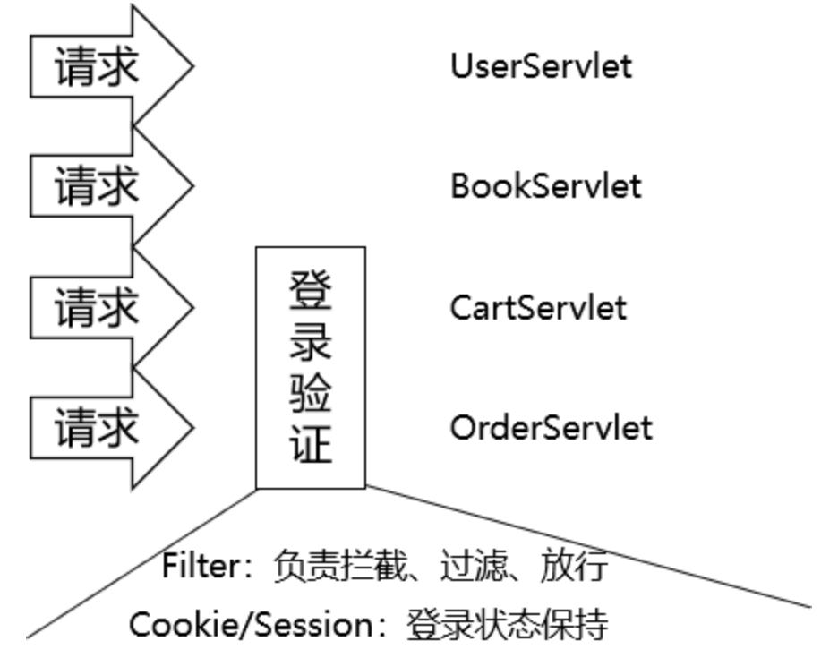
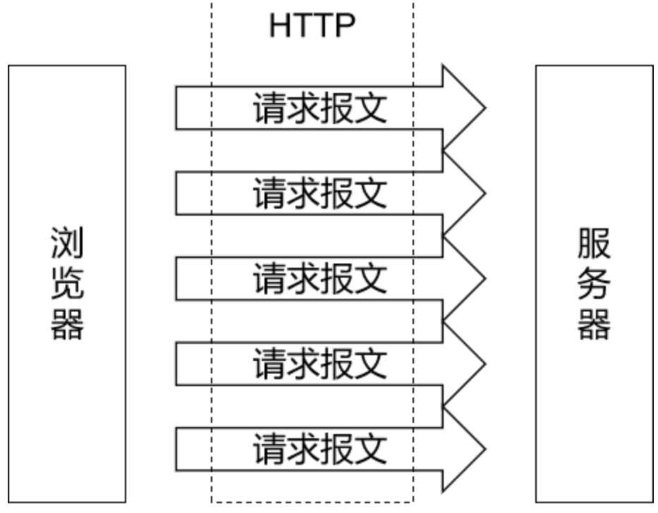
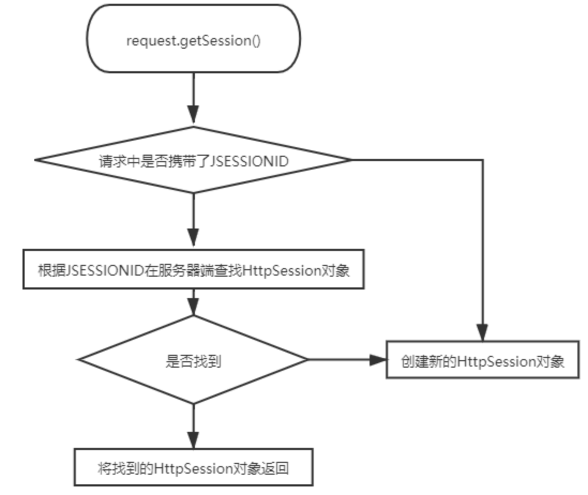
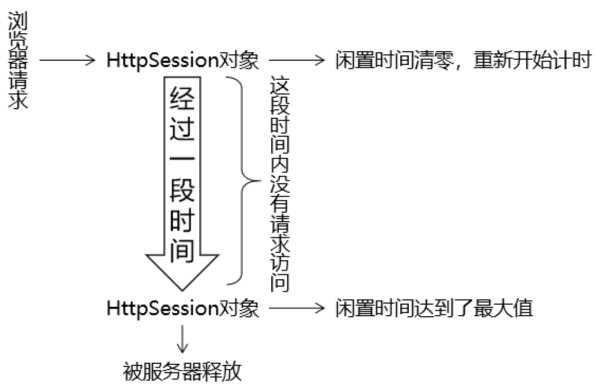

# 7 会话控制

## 7.1 数据存入会话域

### 7.1.1 保持登陆状态



保持用户登录状态，背后的底层逻辑是：服务器在接收到用户请求的时候，有办法判断这个请求来自于之前的某一个用户。所以保持登录状态，本质上是保持**『会话状态』**。

### 7.1.2 解决方法

使用HttpSession对象，将数据存入**会话域**就能保持会话状态。

```java
HttpSession session = request.getSession();
session.setAttribute("user", user);
```

## 7.2 Cookie的工作机制

### 7.2.1 HTTP协议和会话控制

HTTP协议本身是无状态的。单靠HTTP协议本身无法判断一个请求来自于哪一个浏览器，所以也就没法识别用户的身份状态。



### 7.2.2 Cookie介绍

#### 本质

- 在浏览器端临时存储数据；
- 键值对；
- 键和值都是字符串类型；
- 数据量很小；

#### Cookie在浏览器和服务器之间传递

**<u>没有Cookie的状态：</u>**

在服务器端没有创建Cookie并返回的情况下，浏览器端不会保存Cookie信息。双方在请求和响应的过程中也不会携带Cookie的数据。

**<u>创建Cookie对象并返回：</u>**

```java
// 1.创建Cookie对象
Cookie cookie = new Cookie("cookie-message", "hello-cookie");

// 2.将Cookie对象添加到响应中
response.addCookie(cookie);

// 3.返回响应
processTemplate("page-target", request, response);
```

**<u>浏览器拿到Cookie之后：</u>**

浏览器拿到Cookie之后，以后的每一个请求都会携带Cookie信息。

**<u>服务器读取Cookie信息：</u>**

```java
// 1.通过request对象获取Cookie的数组
Cookie[] cookies = request.getCookies();

// 2.遍历数组
for (Cookie cookie : cookies) {
    System.out.println("cookie.getName() = " + cookie.getName());
    System.out.println("cookie.getValue() = " + cookie.getValue());
    System.out.println();
}
```

#### Cookie的时效性

- 会话级Cookie
  - 服务器端并没有明确指定Cookie的存在时间；
  - 在浏览器端，Cookie数据存在于内存中；
  - 只要浏览器还开着，Cookie数据就一直都在；
  - 浏览器关闭，内存中的Cookie数据就会被释放；
- 持久化Cookie
  - 服务器端明确设置了Cookie的存在时间；
  - 在浏览器端，Cookie数据会被保存到硬盘上；
  - Cookie在硬盘上存在的时间根据服务器端限定的时间来管控，不受浏览器关闭的影响；
  - 持久化Cookie到达了预设的时间会被释放；

```java
// ※给Cookie设置过期时间
// 正数：Cookie的过期时间，以秒为单位
// 负数：表示这个Cookie是会话级的Cookie，浏览器关闭时释放
// 0：通知浏览器立即删除这个Cookie
cookie.setMaxAge(20);
```

#### Cookie的domain和path

上网时间长了，本地会保存很多Cookie。对浏览器来说，访问互联网资源时不能每次都把所有Cookie带上。浏览器会使用Cookie的domain和path属性值来和当前访问的地址进行比较，从而决定是否携带这个Cookie。

## 7.3 Session的工作机制

### 7.3.1 简介

前提：浏览器正常访问服务器

- 服务器端没调用`request.getSession()`方法：什么都不会发生；
- 服务器端调用了`request.getSession()`方法
  - 服务器端检查当前请求中是否携带了`JSESSIONID`的`Cookie`
    - 有：根据`JSESSIONID`在服务器端查找对应的`HttpSession`对象
      - 能找到：将找到的`HttpSession`对象作为`request.getSession()`方法的返回值返回
      - 找不到：服务器端新建一个`HttpSession`对象作为`request.getSession()`方法的返回值返回
    - 无：服务器端新建一个`HttpSession`对象作为`request.getSession()`方法的返回值返回

### 7.3.2 流程图表示



### 7.3.3 代码验证

```java
// 1.调用request对象的方法尝试获取HttpSession对象
HttpSession session = request.getSession();

// 2.调用HttpSession对象的isNew()方法
boolean wetherNew = session.isNew();

// 3.打印HttpSession对象是否为新对象
System.out.println("wetherNew = " + (wetherNew?"HttpSession对象是新的":"HttpSession对象是旧的"));

// 4.调用HttpSession对象的getId()方法
String id = session.getId();

// 5.打印JSESSIONID的值
System.out.println("JSESSIONID = " + id);
```

### 7.3.4 时效性

#### 设置原因

用户量很大之后，Session对象相应的也要创建很多。如果一味创建不释放，那么服务器端的内存迟早要被耗尽。

#### 设置难点

从服务器端的角度，很难精确得知类似浏览器关闭的动作。而且即使浏览器一直没有关闭，也不代表用户仍然在使用。

#### 设置最大闲置时间

- 默认值：`1800`秒；

最大闲置时间生效的机制如下：



#### 代码验证

```java
// ※测试时效性
// 获取默认的最大闲置时间
int maxInactiveIntervalSecond = session.getMaxInactiveInterval();
System.out.println("maxInactiveIntervalSecond = " + maxInactiveIntervalSecond);

// 设置默认的最大闲置时间
session.setMaxInactiveInterval(15);
```

#### 强制失效

```java
session.invalidate();
```

