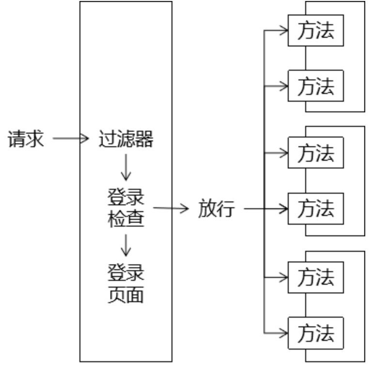

# 8 过滤器

## 8.1 过滤器简介

### 8.1.1 登陆检查



### 8.1.2 过滤器三要素

#### 拦截

过滤器之所以能够对请求进行预处理，关键是对请求进行拦截，把请求拦截下来才能够做后续的操作。而且对于一个具体的过滤器，它必须明确它要拦截的请求，而不是所有请求都拦截。

#### 过滤

根据业务功能实际的需求，看看在把请求拦截到之后，需要做什么检查或什么操作，写对应的代码即可。

#### 放行

过滤器完成自己的任务或者是检测到当前请求符合过滤规则，那么可以将请求放行。所谓放行，就是让请求继续去访问它原本要访问的资源。

## 8.2 HelloWorld

### 8.2.1 思路


### 8.2.2 操作步骤

#### 准备工作

- 创建`module`；
- 加入`Thymeleaf`环境；
- 完成首页访问功能；
- 创建`Target01Servlet`以及`target01.html`；
- 创建`SpecialServlet`以及`special.html`；

**<u>创建TargetFilter类：</u>**

- 要点1：实现`javax.servlet.Filter`接口
- 要点2：在`doFilter()`方法中执行过滤
- 要点3：如果满足过滤条件使用 `chain.doFilter(request, response);`放行
- 要点4：如果不满足过滤条件转发或重定向请求
  - 附带问题：Thymeleaf模板渲染。这里我们选择的解决办法是跳转到一个Servlet，由Servlet负责执行模板渲染返回页面。

```java
public class Target01Filter implements Filter {
    @Override
    public void init(FilterConfig filterConfig) throws ServletException {

    }

    @Override
    public void doFilter(ServletRequest request, ServletResponse response, FilterChain chain) throws IOException, ServletException {

        // 1.打印一句话表明Filter执行了
        System.out.println("过滤器执行：Target01Filter");

        // 2.检查是否满足过滤条件
        // 人为设定一个过滤条件：请求参数message是否等于monster
        // 等于：放行
        // 不等于：将请求跳转到另外一个页面
        // ①获取请求参数
        String message = request.getParameter("message");

        // ②检查请求参数是否等于monster
        if ("monster".equals(message)) {

            // ③执行放行
            // FilterChain对象代表过滤器链
            // chain.doFilter(request, response)方法效果：将请求放行到下一个Filter，
            // 如果当前Filter已经是最后一个Filter了，那么就将请求放行到原本要访问的目标资源
            chain.doFilter(request, response);

        }else{

            // ④跳转页面
            request.getRequestDispatcher("/SpecialServlet?method=toSpecialPage").forward(request, response);

        }

    }

    @Override
    public void destroy() {

    }
}
```

**<u>配置TargetFilter类：</u>**

```xml
<!-- 配置Target01Filter -->
<filter>
    <!-- 配置Filter的名称 -->
    <filter-name>Target01Filter</filter-name>

    <!-- 配置Filter的全类名，便于Servlet容器创建Filter对象 -->
    <filter-class>com.atguigu.filter.filter.Target01Filter</filter-class>
</filter>

<!-- 配置Filter要拦截的目标资源 -->
<filter-mapping>
    <!-- 指定这个mapping对应的Filter名称 -->
    <filter-name>Target01Filter</filter-name>

    <!-- 通过请求地址模式来设置要拦截的资源 -->
    <url-pattern>/Target01Servlet</url-pattern>
</filter-mapping>
```

## 8.3 过滤器生命周期

和Servlet生命周期类比，Filter生命周期的关键区别是：**在Web应用启动时创建对象**

| 生命周期阶段 | 执行时机         | 执行次数 |
| ------------ | ---------------- | -------- |
| 创建对象     | Web应用启动时    | 一次     |
| 初始化       | 创建对象后       | 一次     |
| 拦截请求     | 接收到匹配的请求 | 多次     |
| 销毁         | Web应用卸载前    | 一次     |

## 8.4 过滤器匹配规则

### 8.4.1 精准匹配

指定被拦截资源的完整路径：

```xml
<!-- 配置Filter要拦截的目标资源 -->
<filter-mapping>
    <!-- 指定这个mapping对应的Filter名称 -->
    <filter-name>Target01Filter</filter-name>

    <!-- 通过请求地址模式来设置要拦截的资源 -->
    <url-pattern>/Target01Servlet</url-pattern>
</filter-mapping>
```

### 8.4.2 模糊匹配

相比较精确匹配，使用模糊匹配可以让我们创建一个Filter就能够覆盖很多目标资源，不必专门为每一个目标资源都创建Filter，提高开发效率。

#### 前杠后星

在我们配置了`url-pattern`为`/user/*`之后，请求地址只要是`/user`开头的那么就会被匹配。

```xml
<filter-mapping>
    <filter-name>Target02Filter</filter-name>

    <!-- 模糊匹配：前杠后星 -->
    <!--
        /user/Target02Servlet
        /user/Target03Servlet
        /user/Target04Servlet
    -->
    <url-pattern>/user/*</url-pattern>
</filter-mapping>
```

**极端情况：/\*匹配所有请求**

#### 前星后缀

```xml
<filter>
    <filter-name>Target04Filter</filter-name>
    <filter-class>com.atguigu.filter.filter.Target04Filter</filter-class>
</filter>
<filter-mapping>
    <filter-name>Target04Filter</filter-name>
    <url-pattern>*.png</url-pattern>
</filter-mapping>
```

### 8.4.3 匹配Servlet名称

```xml
<filter-mapping>
    <filter-name>Target05Filter</filter-name>

    <!-- 根据Servlet名称匹配 -->
    <servlet-name>Target01Servlet</servlet-name>
</filter-mapping>
```

## 8.5 过滤器链

### 8.5.1 概念

- 多个Filter的**拦截范围**如果存在**重合部分**，那么这些Filter会形成**Filter链**；
- 浏览器请求重合部分对应的目标资源时，会**依次经过**Filter链中的每一个Filter；
- Filter链中每一个Filter执行的**顺序是由web.xml中filter-mapping配置的顺序决定**的；


### 8.5.2 测试

```xml
<filter-mapping>
    <filter-name>TargetChain03Filter</filter-name>
    <url-pattern>/Target05Servlet</url-pattern>
</filter-mapping>
<filter-mapping>
    <filter-name>TargetChain02Filter</filter-name>
    <url-pattern>/Target05Servlet</url-pattern>
</filter-mapping>
<filter-mapping>
    <filter-name>TargetChain01Filter</filter-name>
    <url-pattern>/Target05Servlet</url-pattern>
</filter-mapping>
```

先执行TargetChain03Filter，然后执行TargetChain02Filter，最后执行TargetChain01Filter。

