# JavaWeb基础

**@author: Shuxin_Wang**

**@time: 2023.03.15**

--------

[toc]

---------

# 1 JavaWeb开发概述

## 1.1 服务器端应用程序


## 1.2 请求和响应


## 1.3 架构

### 1.3.1 概念

**架构其实就是项目的结构**。只不过结构这个词太小了，不适合用来描述项目这么大的东西，所以换了另一个更大的词：架构。所以当我们聊一个项目的架构时，我们聊的是项目是由哪些部分组成的。

### 1.3.2 发展演变历程

#### 单一架构

一个项目就是一个工程，这样的结构就是单一架构，也叫`all in one`。我们现在的`JavaWeb`阶段、`SSM`阶段都是学习单一架构开发技术。

#### 分布式架构

一个项目中包含很多工程，每个工程作为一个模块。模块之间存在调用关系。分布式架构阶段的技术分为两类：

- Java框架：`SpringBoot`、`SpringCloud`、`Dubbo`等等；
- 中间件：`Redis`、`ElasticSearch`、`FastDFS`、`Nginx`、`Zookeeper`、`RabbitMQ`等等；

### 1.3.3 单一架构技术体系

- 视图：用户的操作界面+数据的动态显示：
  - 前端技术：`HTML/CSS/JavaScript`；
  - 服务器端页面模板技术：`Thymeleaf`；
- 控制层：处理请求+跳转页面：
  - 服务器：`Tomcat`；
  - 控制器：`Servlet`；
  - 域对象：`request`、`session`、`servletContext`；
  - 过滤器：`Filter`；
  - 监听器：`Listener`；
  - 异步交互：`Ajax`；
- 业务逻辑层：业务逻辑计算；
- 持久化层：操作数据库；

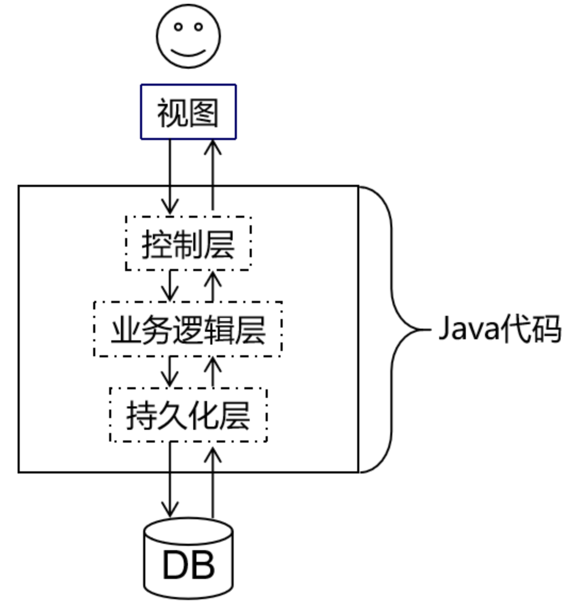

## 1.4 技术体系

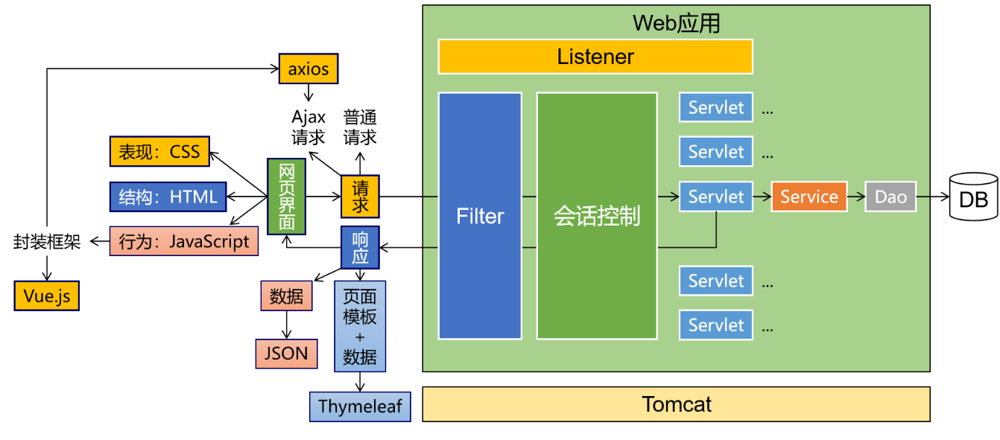


# 2 HTML&CSS

## 2.1 单一架构

从现在的`JavaWeb`阶段到后面学习`SSM`框架阶段都是在学习单一架构项目开发的技术。而在`JavaWeb`阶段由于重点是探讨如何实现Web开发，所以必须学习一部分前端开发的技术。本节就是让大家明确我们现在要学习的内容在整个架构体系中处于什么位置。

### 2.1.1 视图层

严格来说视图分成两层：

- 前端技术：`HTML/CSS/JavaScript`
- 服务器端页面模板技术：`Thymeleaf`

其中`HTML`、`CSS`、`JavaScript`都是工作在浏览器上的，所以它们都属于前端技术。而`Thymeleaf`是在服务器上把动态内容计算出具体数据，所以严格来说`Thymeleaf`是后端技术。


> 这里大家会有个疑问：为什么在`视图`这个地方已经有`HTML`、`CSS`、`JavaScript`这些前端技术了，能够生成用户可以操作的界面，那为什么还需要`Thymeleaf`这样一个后端技术呢？
>
> 简单来说原因是`Thymeleaf`=`HTML+动态数据`，而`HTML`不支持动态数据，这部分需要借助`Thymeleaf`来完成。

### 2.1.2 Web2.0

`Web2.0`是相对于更早的网页开发规范而提出的新规范。`Web2.0`规范之前的网页开发并没有明确的将`HTML`、`CSS`、`JavaScript`代码**<u>分开</u>**，而是互相之间纠缠在一起，导致代码维护困难，开发效率很低。

> 在开发中我们把这样彼此纠缠、互相影响的现象称为`耦合`。而把耦合在一起的东西拆解开，让他们彼此独立出来称为`解耦`。各个组成部分独立完成自己负责的功能，和其他模块无关称为`内聚`。
>
> 将来大家经常会听到一句话：软件开发提倡 `高内聚，低耦合`。
>
> 一个软件项目只有做到了高内聚、低耦合才能算得上结构严谨，模块化程度高，有利于开发和维护。

所以`Web2.0`规范主张将网页代码分成下面三个部分：

- 结构：由`HTML`实现，负责管理网页的内容。将来网页上不管是静态还是动态的数据都是填写到HTML的标签里；
- 表现：由`CSS`实现，负责管理网页内容的表现形式。比如：颜色、尺寸、位置、层级等等。也就是给数据穿上一身漂亮的衣服；
- 行为：由`JavaScript`实现，负责实现网页的动态交互效果。比如：轮播图、表单验证、鼠标滑过显示下拉菜单、鼠标滑过改变背景颜色等等；

## 2.2 HTML简介

### 2.2.1 超文本语言

**<u>超文本标记语言（Hyper Text Markup Language，HTML）</u>**文件本质上是文本文件，而普通的文本文件只能显示字符。但是HTML技术则通过HTML标签把其他网页、图片、音频、视频等各种多媒体资源引入到当前网页中，让网页有了非常丰富的呈现方式，这就是超文本的含义——本身是文本，但是呈现出来的最终效果超越了文本


### 2.2.2 标记语言

说HTML是一种『标记语言』是因为它不是向Java这样的『编程语言』，因为它是由一系列『标签』组成的，没有常量、变量、流程控制、异常处理、IO等等这些功能。HTML很简单，每个标签都有它固定的含义和确定的页面显示效果。

标签是通过一组尖括号+标签名的方式来定义的：

```html
<p>
    HTML is a very popular fore-end technology.
</p>
```

这个例子中使用了一个`p`标签来定义一个段落，`<p>`叫**『开始标签』**，`</p>`叫**『结束标签』**。开始标签和结束标签一起构成了一个完整的标签。开始标签和结束标签之间的部分叫**『文本标签体』**，也简称**『标签体』**。

有时候标签还带有**<u>属性</u>**：

```html
<a href="http://www.xxx.com">
    show detail
</a>
```

`href="http://www.xxx.com"`就是属性，`href`是**『属性名』**，`"http://www.xxx.com"`是**『属性值』**。

还有一种标签是**<u>单标签</u>**：

```html
<input type="text" name="username" />
```

### 2.2.3 Hello World


### 2.2.4 HTML文件结构

#### 文档类型声明

HTML文件中第一行的内容，用来告诉浏览器当前HTML文档的基本信息，其中最重要的就是当前HTML文档遵循的语法标准。这里我们只需要知道HTML有4和5这两个大的版本，`HTML4`版本的文档类型声明是：

```html
<!DOCTYPE HTML PUBLIC "-//W3C//DTD HTML 4.01 Transitional//EN"
"http://www.w3.org/TR/html4/loose.dtd">
```

`HTML5`版本的文档类型声明是：

```html
<!DOCTYPE html>
```

现在主流的技术选型都是使用`HTML5`，之前的版本基本不用了。

#### 根标签

`html`标签是整个文档的根标签，所有其他标签都必须放在html标签里面。上面的文档类型不能当做普通标签看待。

> 所谓『根』其实是『树根』的意思。在一个树形结构中，根节点只能有一个。

#### 头部

`head`标签用于定义文档的头部，其他头部元素都放在head标签里。头部元素包括`title`标签、`script`标签、`style`标签、`link`标签、`meta`标签等等。

#### 主体

`body`标签定义网页的主体内容，在浏览器窗口内显示的内容都定义到`body`标签内。

#### 注释

HTML注释的写法是：

```html
<!-- 注释内容 -->
```

注释的内容不会显示到浏览器窗口内，是开发人员用来对代码内容进行解释说明。

### 2.2.5 HTML语法规则

- 根标签有且只能有一个；
- 无论是双标签还是单标签都必须正确关闭；
- 标签可以嵌套但不能交叉嵌套；
- 注释不能嵌套；
- 属性必须有值，值必须加引号，单引号或双引号均可；
- 标签名不区分大小写但建议使用小写；

## 2.3 使用HTML展示文章

以文章的组织形式展示数据是HTML最基本的功能了，网页上显示的文章在没有做任何CSS样式设定的情况下如下图所示：


本节我们要学习的HTML标签如下表：

| 标签名称 | 功能                   |
| -------- | ---------------------- |
| `h1~h6`  | 1级标题~6级标题        |
| `p`      | 段落                   |
| `a`      | 超链接                 |
| `ul/li`  | 无序列表               |
| `img`    | 图片                   |
| `div`    | 定义一个前后有换行的块 |
| `span`   | 定义一个前后无换行的块 |

### 2.3.1 标签标题

```html
<!DOCTYPE html>
<html lang="en">
<head>
    <meta charset="UTF-8">
    <title>Title</title>
</head>
<body>
    <h1>这是一级标题</h1>
    <h2>这是二级标题</h2>
    <h3>这是三级标题</h3>
    <h4>这是四级标题</h4>
    <h5>这是五级标题</h5>
    <h6>这是六级标题</h6>
</body>
</html>
```

==**<u>注意：标题标签前后有换行。</u>**==

### 2.3.2 段落标签

```html
<p>There is clearly a need for CSS to be taken seriously by graphic artists. The Zen Garden aims to excite, inspire, and encourage participation. To begin, view some of the existing designs in the list. Clicking on any one will load the style sheet into this very page. The code remains the same, the only thing that has changed is the external .css file. Yes, really.</p>
```

==**<u>注意：标题标签前后有换行。</u>**==

### 2.3.3 超链接

```html
<a href="page02-anchor-target.html">点我跳转到下一个页面</a>
```

点击后跳转到`href`属性指定的页面

### 2.3.4 路径

在整个Web开发技术体系中，**路径**是一个贯穿始终的重要概念。凡是需要获取另外一个资源的时候都需要用到路径。要想理解路径这个概念，我们首先要认识一个概念：**『文件系统』**。

#### 文件系统

Windows系统和Linux系统的文件系统有很大差别，为了让我们编写的代码不会因为从Windows系统部署到了Linux系统而出现故障，实际开发时不允许使用**物理路径**。

> 物理路径举例：
>
> `D:\aaa\pro01-HTML\page01-article-tag.html`
>
> `D:\aaa\pro01-HTML\page02-anchor-target.html`

幸运的是不管是Windows系统还是Linux系统环境下，目录结构都是**树形结构**，编写路径的规则是一样的。

所以我们**以项目的树形目录结构为依据**来编写路径就不用担心操作系统平台发生变化之后路径错误的问题了。有了这个大前提，我们具体编写路径时有两种具体写法：

- 相对路径；
- 绝对路径（建议使用）；

#### 相对路径

**相对路径都是以*『当前位置』*为基准**来编写的。假设我们现在正在浏览a页面，想在a页面内通过超链接跳转到z页面。


那么按照相对路径的规则，我们现在所在的位置是`a.html`所在的b目录；`z.html`并不在b目录下，所以我们要从b目录出发，向上走，进入b的父目录——c目录；c目录还是不行，继续向上走，进入c的父目录——d目录；在从d目录向下经过两级子目录——e目录、f目录才能找到`z.html`。

所以整个路径的写法是：

```html
<a href="../../e/f/z.html">To z.html</a>
```

可以看到使用相对路径有可能会很繁琐，而且在后面我们结合了在服务器上运行的Java程序后，相对路径的基准是有可能发生变化的，所以**不建议使用相对路径**。

#### 绝对路径

测试绝对路径的前提是通过IDEA的内置服务器访问我们编写的HTML页面——这样访问地址的组成结构才能和我们以后在服务器上运行的Java程序一致。

绝对路径要求必须是以**『正斜线』**，测试开头在端口号后面的位置代表的是**『服务器根目录』**，从这里开始我们就是在服务器的内部查找一个具体的Web应用。

所以编写绝对路径时就从这个位置开始，**按照目录结构找到目标文件**即可。拿前面相对路径中的例子来说，我们想在a.html页面中通过超链接访问z.html。此时路径从正斜线开始，和a.html自身所在位置没有任何关系：

```html
<a href="/d/e/f/z.html">To z.html</a>
```

### 2.3.5 换行

```html
<p>
    We would like to see as much CSS1 as possible. CSS2 should be limited to widely-supported elements only. The css Zen Garden is about functional, practical CSS and not the latest bleeding-edge tricks viewable by 2% of the browsing public.<br/>The only real requirement we have is that your CSS validates.
</p>
```

### 2.3.6 无序列表

```html
<ul>
    <li>Apple</li>
    <li>Banana</li>
    <li>Grape</li>
</ul>
```

### 2.3.7 图片

`src`属性用来指定图片文件的路径，这里同样按我们前面说的使用**『绝对路径』**。

```html

```

### 2.3.8 块

**『块』**并不是为了显示文章内容的，而是为了方便结合CSS对页面进行布局。块有两种，div是前后有换行的块，span是前后没有换行的块。

把下面代码粘贴到HTML文件中查看他们的区别：

```html
<div style="border: 1px solid black;width: 100px;height: 100px;">This is a div block</div>
<div style="border: 1px solid black;width: 100px;height: 100px;">This is a div block</div>

<span style="border: 1px solid black;width: 100px;height: 100px;">This is a span block</span>
<span style="border: 1px solid black;width: 100px;height: 100px;">This is a span block</span>
```

### 2.3.9 实体

在HTML文件中，`<`、`>`等等这样的符号已经被赋予了特定含义，不会作为符号本身显示到页面上，此时如果我们想使用符号本身怎么办呢？那就是使用HTML实体来转义。


资料来源：[W3School](https://www.w3school.com.cn/html/html_entities.asp)

## 2.4 表格标签

`table`：标签是表格标签

- `border`：设置表格标签；
- `width`：设置表格宽度；
- `height`：设置表格高度；
- `align`：设置表格相对于页面的对齐方式；
- `cellspacing`：设置单元格间距；

`tr`：是行标签；

`th`：是表头标签；

`td`：是单元格标签；

- `align`：设置单元格文本对齐方式；

`b`：是加粗标签；

### 2.4.1 普通表格

**<u>做一个带表头的，三行，三列的表格，并显示边框:</u>**

```html
<table align="center" border="1" width="300" height="300" cellspacing="0">
  <tr>
    <th>1.1</th>
    <th>1.2</th>
    <th>1.3</th>
  </tr>
  <tr>
    <td>2.1</td>
    <td>2.2</td>
    <td>2.3</td>
  </tr>
  <tr>
    <td>3.1</td>
    <td>3.2</td>
    <td>3.3</td>
  </tr>
</table>
```

### 2.4.2 跨行跨列表格

`colspan`：属性设置跨列；

`rowspan`：属性设置跨行；

```html
<table align="center" width="500" height="500" cellspacing="0" border="1">
  <tr>
    <td colspan="2">1.1</td>
    <td>1.3</td>
    <td>1.4</td>
    <td>1.5</td>
  </tr>
  <tr>
    <td rowspan="2">2.1</td>
    <td>2.2</td>
    <td>2.3</td>
    <td>2.4</td>
    <td>2.5</td>
  </tr>
  <tr>
    <td>3.2</td>
    <td>3.3</td>
    <td>3.4</td>
    <td>3.5</td>
  </tr>
  <tr>
    <td>4.1</td>
    <td>4.2</td>
    <td>4.3</td>
    <td colspan="2" rowspan="2">4.4</td>
  </tr>
  <tr>
    <td>5.1</td>
    <td>5.2</td>
    <td>5.3</td>
  </tr>
</table>
```

###   2.4.3 `iframe`框架标签

`ifarme`标签可以在页面上开辟一个小区域显示一个单独的页面`ifarme`和`a`标签组合使用的步骤:

1. 在`iframe`标签中使用`name`属性定义一个名称；
2. 在`a`标签的`target`属性上设置`iframe`的`name`的属性值；

```html
<iframe src="html_test0.html" width="500" height="400" name="abc"></iframe>
<br/>
<ul>
  <li><a href="html_test0.html" target="abc">Hellow world</a></li>
</ul>
```


## 2.5 HTML表单收集数据

### 2.5.1 什么是表单

在项目开发过程中，凡是需要用户填写的信息都需要用到表单。

### 2.5.2 `form`标签

在HTML中我们使用`form`标签来定义一个表单。而对于`form`标签来说有两个最重要的属性：`action`和`method`。

```html
<form action="/aaa/pro01-HTML/page05-form-target.html" method="post">
    
</form>
```

#### `action`属性

用户在表单里填写的信息需要发送到服务器端，对于Java项目来说就是交给Java代码来处理。那么在页面上我们就必须正确填写服务器端的能够接收表单数据的地址。

==**<u>这个地址要写在form标签的action属性中。</u>**==但是现在暂时我们还没有服务器端环境，所以先借用一个HTML页面来当作服务器端地址使用。

#### `method`属性

在`form`标签中`method`属性用来定义提交表单的**『请求方式』**。`method`属性只有两个可选值：`get`或`post`，没有极特殊情况的话使用post即可。

『请求方式』可见《计算机网络-自顶向下》HTTP协议中查看。

### 2.5.3 `name`和`value`

在用户使用一个软件系统时，需要一次性提交很多数据是非常正常的现象。我们肯定不能要求用户一个数据一个数据的提交，而肯定是所有数据填好后一起提交。那就带来一个问题，服务器怎么从众多数据中识别出来收货人、所在地区、详细地址、手机号码……？

很简单，**给每个数据都起一个『名字』**，发送数据时用**『名字』**携带对应的数据，接收数据时通过**『名字』**获取对应的数据。

在各个具体的表单标签中，我们通过**『name属性』**来给数据起**『名字』**，通过**『value属性』**来保存要发送给服务器的**『值』**。

但是名字和值之间既有可能是**『一个名字对应一个值』**，也有可能是**『一个名字对应多个值』**。

这么看来这样的关系很像我们Java中的Map，而事实上在服务器端就是使用Map类型来接收请求参数的。具体的是类型是：**`Map<String,String[]>`**。

`name`属性就是Map的键，`value`属性就是Map的值。

有了上面介绍的基础知识，下面我们就可以来看具体的表单标签了。

### 2.5.4 单行文本框

```html
<label>
    个性签名：
    <input type="text" name="signal"/>
</label><br/>
```

### 2.5.5 密码框

```html
<label>
    密码：
    <input type="password" name="secret"/>
</label><br/>
```

### 2.5.6 单选框

```html
<label>
    你最喜欢的季节是：
    <input type="radio" name="season" value="spring"/>春天
    <input type="radio" name="season" value="summer" checked="checked"/>夏天
    <input type="radio" name="season" value="autumn"/>秋天
    <input type="radio" name="season" value="winter"/>冬天
</label>

<br/><br/>
<label>
    你最喜欢的动物是：
    <input type="radio" name="animal" value="tiger"/>路虎
    <input type="radio" name="animal" value="horse" checked="checked"/>宝马
    <input type="radio" name="animal" value="cheetah"/>捷豹
</label>
```

- `name`属性相同的`radio`为一组，组内互斥；
- 当用户选择了一个`radio`并提交表单，这个`radio`的`name`属性和`value`属性组成一个键值对发送给服务器；
- 设置`checked="checked"`属性设置默认被选中的`radio`；

### 2.5.7 多选框

```html
<label>
    你最喜欢的球队是：
    <input type="checkbox" name="team" value="Brazil"/>巴西
    <input type="checkbox" name="team" value="German" checked="checked"/>德国
    <input type="checkbox" name="team" value="France"/>法国
    <input type="checkbox" name="team" value="China" checked="checked"/>中国
    <input type="checkbox" name="team" value="Italian"/>意大利
</label>
```

### 2.5.8 下拉列表

```html
<label>
你喜欢的运动是：
<select name="interesting">
  <option value="swimming">游泳</option>
  <option value="running">跑步</option>
  <option value="shooting" selected="selected">射击</option>
  <option value="skating">溜冰</option>
</select>
</label>
```

- 下拉列表用到了两种标签，其中`select`标签用来定义下拉列表，而`option`标签设置列表项；
- `name`属性在`select`标签中设置；
- `value`属性在`option`标签中设置；
- `option`标签的标签体是显示出来给用户看的，提交到服务器的是`value`属性的值；
- 通过在`option`标签中设置`selected="selected"`属性实现默认选中的效果；

### 2.5.9 按钮

```html
<label>
    <button type="button">普通按钮</button>
    <button type="reset">重置按钮</button>
    <button type="submit">提交按钮</button>
</label>
```

| 类型     | 功能                                             |
| -------- | ------------------------------------------------ |
| 普通按钮 | 点击后无效果，需要通过JavaScript绑定单击响应函数 |
| 重置按钮 | 点击后将表单内的所有表单项都恢复为默认值         |
| 提交按钮 | 点击后提交表单                                   |

### 2.5.10 表单隐藏域

```html
<label>
    <input type="hidden" name="userId" value="2233"/>
</label>
```

通过表单隐藏域设置的表单项不会显示到页面上，用户看不到。但是提交表单时会一起被提交。用来设置一些需要和表单一起提交但是不希望用户看到的数据，例如：用户id等等。

### 2.5.11 多行文本框

```html
<label>
    自我介绍：<textarea name="desc"></textarea>
</label>
```

`textarea`没有`value`属性，如果要设置默认值需要写在开始和结束标签之间。

## 2.6 CSS的简单应用

### 2.6.1 设置CSS样式的方式

#### 在HTML标签内设置

仅对当前标签有效

```html
<div style="border: 1px solid black;width: 100px; height: 100px;">&nbsp;</div>
```

#### 在head标签内设置

对当前页面有效

```html
<!DOCTYPE html>
<html lang="en">
<head>
  <meta charset="UTF-8">
  <title>CSS Test</title>
  <style>
    .one {
      border: 1px solid black;
      width: 100px;
      height: 100px;
      background-color: lightgreen;
      margin-top: 5px;
    }
  </style>
</head>
<body>
<div style="border: 1px solid black;width: 100px; height: 100px;">&nbsp;</div>
    
<div class="one">&nbsp;</div>
<div class="one">&nbsp;</div>
<div class="one">&nbsp;</div>
</body>
</html>
```

#### 引入外部CSS样式文件

**<u>编辑CSS文件</u>**

```css
.two {
  border: 1px solid black;
  width: 100px;
  height: 100px;
  background-color: yellow;
  margin-top: 5px;
}
```

**<u>引入外部CSS文件</u>**

在需要使用这个CSS文件的HTML页面的`head`标签内加入：

```html
<link rel="stylesheet" type="text/css" href="/aaa/pro01-HTML/style/example.css" />
```

于是下面HTML代码的显示效果是：

```html
<div class="two">&nbsp;</div>
<div class="two">&nbsp;</div>
<div class="two">&nbsp;</div>
```

### 2.6.2 CSS代码语法

- CSS样式由选择器和声明组成，而声明又由属性和值组成；
- 属性和值之间用冒号隔开；
- 多条声明之间用分号隔开；
- 使用`/* ... */`声明注释；


### 2.6.3 CSS选择器

#### 标签选择器

HTML代码：

```html
<p>Hello, this is a p tag.</p>
<p>Hello, this is a p tag.</p>
<p>Hello, this is a p tag.</p>
<p>Hello, this is a p tag.</p>
<p>Hello, this is a p tag.</p>
```

CSS代码：

```css
p {
    color: blue;
    font-weight: bold;
}
```

#### `id`选择器

HTML代码：

```html
<p>Hello, this is a p tag.</p>
<p>Hello, this is a p tag.</p>
<p id="special">Hello, this is a p tag.</p>
<p>Hello, this is a p tag.</p>
<p>Hello, this is a p tag.</p>
```

CSS代码：

```css
#special {
    font-size: 20px;
    background-color: aqua;
}
```

#### 类选择器

HTML代码：

```html
<div class="one">&nbsp;</div>
<div class="one">&nbsp;</div>
<div class="one">&nbsp;</div>
```

CSS代码：

```css
.one {
    border: 1px solid black;
    width: 100px;
    height: 100px;
    background-color: lightgreen;
    margin-top: 5px;
}
```


# 3 JavaScript

## 3.1 JavaScript简介

### 3.1.1 起源

在**1995**年时，由**Netscape**公司的**Brendan Eich**，在网景导航者浏览器上首次设计实现而成。Netscape在最初将其脚本语言命名为LiveScript，因为Netscape与Sun合作，网景公司管理层希望它外观看起来像Java，因此取名为JavaScript。

### 3.1.2 特征

#### 脚本语言

JavaScript是一种解释型的脚本语言。不同于C、C++、Java等语言先编译后执行, JavaScript不会产生编译出来的字节码文件，而是在程序的运行过程中对源文件逐行进行解释。

#### 基于对象

JavaScript是一种基于对象的脚本语言，它不仅可以创建对象，也能使用现有的对象。但是面向对象的三大特性：『封装』、『继承』、『多态』中，JavaScript能够实现封装，可以模拟继承，不支持多态，所以它不是一门面向对象的编程语言。

#### 弱类型

JavaScript中也有明确的数据类型，但是声明一个变量后它可以接收任何类型的数据，并且会在程序执行过程中根据上下文自动转换类型。

#### 事件驱动

JavaScript是一种采用事件驱动的脚本语言，它不需要经过Web服务器就可以对用户的输入做出响应。

#### 跨平台性

`JavaScript`脚本语言不依赖于操作系统，仅需要浏览器的支持。因此一个`JavaScript`脚本在编写后可以带到任意机器上使用，前提是机器上的浏览器支持`JavaScript`脚本语言。目前`JavaScript`已被大多数的浏览器所支持。

## 3.2 Hello World

### 3.2.1 功能效果图

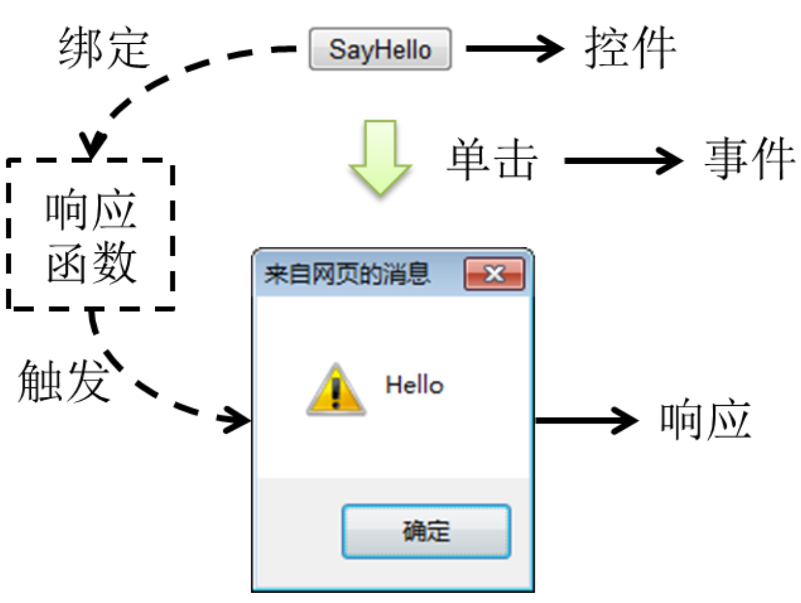

### 3.2.2 代码实现

```html
<!DOCTYPE html>
<html lang="en">
<head>
  <meta charset="UTF-8">
  <title>JS: Hello world!</title>
</head>
<body>
<!-- 在HTML代码中定义一个按钮 -->
<button type="button" id="helloBtn">SayHello</button>
</body>
<!-- 在script标签中编写JavaScript代码 -->
<script type="text/javascript">

  // document对象代表整个HTML文档
  // document对象调用getElementById()方法表示根据id查找对应的元素对象
  var btnElement = document.getElementById("helloBtn");

  // 给按钮元素对象绑定单击响应函数
  btnElement.onclick = function(){
    // 弹出警告框
    alert("hello");
  };
</script>
</html>
```

## 3.3 JavaScript基本语法

### 3.3.1 代码嵌入方式

#### HTML文档内

- JavaScript代码要写在`script`标签内；
- `script`标签可以写在文档内的任意位置；
- 为了能够方便查询或操作HTML标签（元素）`script`标签可以写在`body`标签后面；

可以参考简化版的HelloWorld

```html
<!-- 在HBuilderX中，script标签通过打字“sc”两个字母就可以直接完整生成 -->
<script type="text/javascript">
	// 下面是同样实现HelloWorld功能的简化版代码
	document.getElementById("helloBtn").onclick = function() {
		alert("Hello simple");
	};
</script>
```

#### 引入外部JS文档

在script标签内通过src属性指定外部xxx.js文件的路径即可。但是要注意以下两点：

- 引用外部JavaScript文件的`script`标签里面不能写JavaScript代码；
- 先引入，再使用；
- ==**<u>`script`标签不能写成单标签</u>**==；

引入方式如下：

```html
<body>
</body>
<!-- 使用script标签的src属性引用外部JavaScript文件，和Java中的import语句类似 -->
<!-- 引用外部JavaScript文件的script标签里面不能写JavaScript代码 -->
<!-- 引用外部JavaScript文件的script标签不能改成单标签 -->
<!-- 外部JavaScript文件一定要先引入再使用 -->
<script src="/pro02-JavaScript/scripts/outter.js" type="text/javascript" charset="utf-8"></script>
<script type="text/javascript">
	// 调用外部JavaScript文件中声明的方法
	showMessage();
</script>
```

### 3.3.2 声明和使用变量

#### 数据类新

**<u>基本数据类型：</u>**

- 数值型：JavaScript不区分整数、小数；
- 字符串：JavaScript不区分字符、字符串；单引号、双引号意思一样；
- 布尔型：`true`、`false`；
  - 在JavaScript中，其他类型和布尔类型的自动转换；
  - `true`：非零的数值，非空字符串，非空对象；
  - `false`：零，空字符串，null，undefined；

**<u>引用类型：</u>**

- 关键字：`var`；

- 数据类型：JavaScript变量可以接收任意类型的数据；

- 标识符：严格区分大小写；

- 变量使用规则

  - 如果使用了一个没有声明的变量，那么会在运行时报错

    `Uncaught ReferenceError: b is not defined`；

  - 如果声明一个变量没有初始化，那么这个变量的值就是`undefined`；

### 3.3.3 函数

#### 内置函数

内置函数：系统已经声明好了可以直接使用的函数。

**<u>弹出警告框</u>**

```javascript
alert("警告框内容");
```

**<u>弹出确认框</u>**

用户点击『确定』返回true，点击『取消』返回false

```js
var result = confirm("老板，你真的不加个钟吗？");
if(result) {
	console.log("老板点了确定，表示要加钟");
}else{
	console.log("老板点了取消，表示不加钟");
}
```

**<u>在控制台打印日志</u>**

```js
console.log("日志内容");
```

#### 声明函数

写法1：

```js
function sum(a, b) {
    return a+b;
}
```

写法2：

```js
var total = function(a, b) {
    return a+b;
};
```

写法2可以这样解读：声明一个函数，相当于创建了一个『函数对象』，将这个对象的『引用』赋值给变量`total`。最后加的分号不是给函数声明加的，而是给整体的赋值语句加的分号。

#### 调用函数

JavaScript中函数本身就是一种对象，函数名就是这个**『对象』**的**『引用』**。而调用函数的格式是：**函数引用()**。

```js
function sum(a, b) {
	return a+b;
}

var result = sum(2, 3);
console.log("result="+result);
```

```js
var total = function() {
    return a+b;
}

var totalResult = total(3,6);
console.log("totalResult="+totalResult);
```

### 3.3.4 对象

JavaScript中没有『类』的概念，对于系统内置的对象可以直接创建使用。

#### 使用`new`关键字创建对象

```js
// 创建对象
var obj01 = new Object();
// 给对象设置属性和属性值
obj01.stuName = "tom";
obj01.stuAge = 20;
obj01.stuSubject = "java";
// 在控制台输出对象
console.log(obj01);
```

#### 使用`{}`创建对象

```js
// 创建对象
var obj02 = {
    "soldierName":"john",
    "soldierAge":35,
    "soldierWeapon":"gun"
};
// 在控制台输出对象
console.log(obj02);
```

#### 给对象设置函数属性

```js
// 创建对象
var obj01 = new Object();
// 给对象设置属性和属性值
obj01.stuName = "tom";
obj01.stuAge = 20;
obj01.stuSubject = "java";
obj01.study = function() {
	console.log(this.stuName + " is studying");
};
// 在控制台输出对象
console.log(obj01);
// 调用函数
obj01.study();
```

```js
// 创建对象
var obj02 = {
	"soldierName":"john",
	"soldierAge":35,
	"soldierWeapon":"gun",
	"soldierShoot":function(){
		console.log(this.soldierName + " is using " + this.soldierWeapon);
	}
};

// 在控制台输出对象
console.log(obj02);
// 调用函数
obj02.soldierShoot();
```

#### `this`关键词

this关键字只有两种情况：

- 在函数外面：`this`关键字指向`window`对象（代表当前浏览器窗口）；
- 在函数里面：`this`关键字指向调用函数的对象；

```js
// 直接打印this
console.log(this);
// 函数中的this
// 1.声明函数
function getName() {
	console.log(this.name);
}
// 2.创建对象
var obj01 = {
	"name":"tom",
	"getName":getName
};
var obj02 = {
	"name":"jerry",
	"getName":getName
};
// 3.调用函数
obj01.getName();
obj02.getName();
```

### 3.3.5 数组

#### 使用`new`关键字创建数组

```js
// 1.创建数组对象
var arr01 = new Array();
// 2.压入数据
arr01.push("apple");
arr01.push("orange");
arr01.push("banana");
arr01.push("grape");
// 3.遍历数组
for (var i = 0; i < arr01.length; i++) {
	console.log(arr01[i]);
}
// 4.数组元素反序
arr01.reverse();
for (var i = 0; i < arr01.length; i++) {
	console.log(arr01[i]);
}
// 5.数组元素拼接成字符串
var arrStr = arr01.join(",");
console.log(arrStr);
// 6.字符串拆分成数组
var arr02 = arrStr.split(",");
for (var i = 0; i < arr02.length; i++) {
	console.log(arr02[i]);
}
// 7.弹出数组中最后一个元素
var ele = arr01.pop();
console.log(ele);
```

#### 使用`[]`创建数组

```js
// 8.使用[]创建数组
var arr03 = ["cat","dog","tiger"];
console.log(arr03);
```

### 3.3.6 JSON

#### JSON格式的用途

在开发中凡是涉及到**『跨平台数据传输』**，JSON格式一定是首选。

#### JSON格式的说明

- JSON数据两端要么是**`{}`**，要么是**`[]`**；
- **`{}`**定义JSON对象；
- **`[]`**定义JSON数组；
- JSON对象的格式是：

```json
{key:value,key:value,...,key:value}
```

- JOSN数组的格式是：

```json
[value,value,...,value]
```

- `key`的类型固定是字符串
- `value`的类型可以是：
  - 基本数据类型
  - 引用类型：JSON对象或JSON数组

正因为JSON格式中value部分还可以继续使用JSON对象或JSON数组，所以JSON格式是可以**『多层嵌套』**的，所以JSON格式不论多么复杂的数据类型都可以表达。

```json
{
	"stuId":556,
	"stuName":"carl",
	"school":{
		"schoolId":339,
		"schoolName":"atguigu"
	},
	"subjectList":[
		{
			"subjectName":"java",
			"subjectScore":50
		},
		{
			"subjectName":"PHP",
			"subjectScore":35
		},
		{
			"subjectName":"python",
			"subjectScore":24
		}
	],
	"teacherMap":{
		"aaa":{
			"teacherName":"zhangsan",
			"teacherAge":20
		},
		"bbb":{
			"teacherName":"zhangsanfeng",
			"teacherAge":108
		},
		"ccc":{
			"teacherName":"zhangwuji",
			"teacherAge":25
		}
	}
}
```

#### JSON对象和JSON字符串互转

JSON对象→JSON字符串：

```js
var jsonObj = {"stuName":"tom","stuAge":20};
var jsonStr = JSON.stringify(jsonObj);
console.log(typeof jsonObj); // object
console.log(typeof jsonStr); // string
```

JSON字符串→JSON字对象：

```js
jsonObj = JSON.parse(jsonStr);
console.log(jsonObj); // {stuName: "tom", stuAge: 20}
```

## 3.4 DOM

### 3.4.1 概念

**文档对象模型（Document Object Model，DOM）**，将HTML文档抽象成模型，再封装成对象方便用程序操作。

这是一种非常常用的编程思想：将现实世界的事务抽象成模型，这样就非常容易使用对象来量化的描述现实事务，从而把生活中的问题转化成一个程序问题，最终实现用应用软件协助解决现实问题。而在这其中模型就是那个连通现实世界和代码世界的桥梁。

#### DOM树

浏览器把HTML文档从服务器上下载下来之后就开始按照**『从上到下』**的顺序**『读取HTML标签』**。每一个标签都会被封装成一个**『对象』**。

而第一个读取到的肯定是根标签html，然后是它的子标签head，再然后是head标签里的子标签。所以从html标签开始，整个文档中的所有标签都会根据它们之间的**『父子关系』**被放到一个**『树形结构』**的对象中。

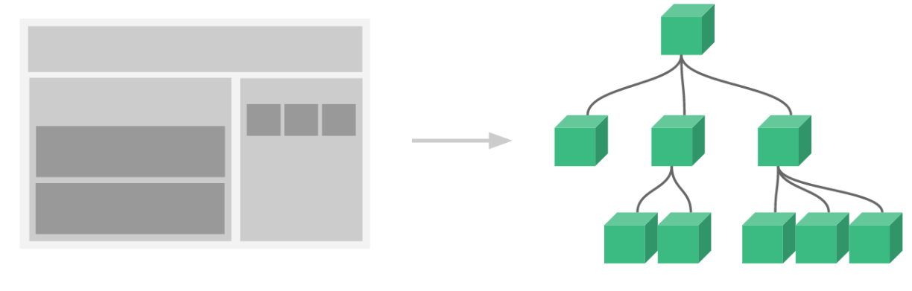

这个包含了所有标签对象的整个树形结构对象就是JavaScript中的一个**可以直接使用的内置对象**：**`document`**。

例如下面的结构：


会被解析为：


### 3.4.2 具体概述

#### 组成部分类型

整个文档中的一切都可以看做Node。各个具体组成部分的具体类型可以看做Node类型的子类。

> 其实严格来说，JavaScript并不支持真正意义上的『继承』，这里我们借用Java中的『继承』概念，从逻辑上来帮助我们理解各个类型之间的关系。

| 组成部分         | 节点类型 | 具体类型 |
| ---------------- | -------- | -------- |
| 整个文档         | 文档节点 | Document |
| HTML标签         | 元素节点 | Element  |
| HTML标签内的文本 | 文本节点 | Text     |
| HTML标签内的属性 | 属性节点 | Attr     |
| 注释             | 注释节点 | Comment  |

#### 父子关系


#### 先辈后代关系

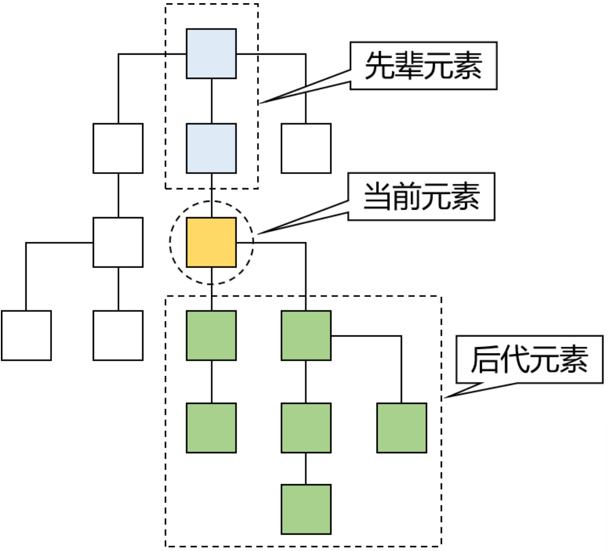

### 3.4.3 DOM操作

由于实际开发时基本上都是使用JavaScript的各种框架来操作，而框架中的操作方式和我们现在看到的原生操作完全不同，所以下面罗列的API仅供参考，不做要求。

#### 在整个文档范围内查询元素节点

| 功能               | API                                     | 返回值           |
| ------------------ | --------------------------------------- | ---------------- |
| 根据id值查询       | document.getElementById(“id值”)         | 一个具体的元素节 |
| 根据标签名查询     | document.getElementsByTagName(“标签名”) | 元素节点数组     |
| 根据name属性值查询 | document.getElementsByName(“name值”)    | 元素节点数组     |

#### 在具体元素节点范围内查找子节点

| 功能               | API                                            | 返回值   |
| ------------------ | ---------------------------------------------- | -------- |
| 查找全部子节点     | element.childNodes 【W3C考虑换行，IE≤8不考虑】 | 节点数组 |
| 查找第一个子节点   | element.firstChild 【W3C考虑换行，IE≤8不考虑】 | 节点对象 |
| 查找最后一个子节点 | element.lastChild 【W3C考虑换行，IE≤8不考虑】  | 节点对象 |

#### 查找指定元素节点的父节点

| 功能                     | API                | 返回值   |
| ------------------------ | ------------------ | -------- |
| 查找指定元素节点的父节点 | element.parentNode | 节点对象 |

#### 查找指定元素节点的兄弟节点

| 功能               | API                                              | 返回值   |
| ------------------ | ------------------------------------------------ | -------- |
| 查找前一个兄弟节点 | node.previousSibling 【W3C考虑换行，IE≤8不考虑】 | 节点对象 |
| 查找后一个兄弟节点 | node.nextSibling 【W3C考虑换行，IE≤8不考虑】     | 节点对象 |

#### 属性操作

| 需求       | 操作方式                     |
| ---------- | ---------------------------- |
| 读取属性值 | `元素对象.属性名`            |
| 修改属性值 | `元素对象.属性名=新的属性值` |

#### 文本操作

| 需求       | 操作方式                              |
| ---------- | ------------------------------------- |
| 读取文本值 | element.firstChild.nodeValue          |
| 修改文本值 | element.firstChild.nodeValue=新文本值 |

#### DOM增删改操作

| API                                      | 功能                                       |
| ---------------------------------------- | ------------------------------------------ |
| document.createElement(“标签名”)         | 创建元素节点并返回，但不会自动添加到文档中 |
| document.createTextNode(“文本值”)        | 创建文本节点并返回，但不会自动添加到文档中 |
| element.appendChild(ele)                 | 将ele添加到element所有子节点后面           |
| parentEle.insertBefore(newEle,targetEle) | 将newEle插入到targetEle前面                |
| parentEle.replaceChild(newEle, oldEle)   | 用新节点替换原有的旧子节点                 |
| parentEle.removeChild(childNode)         | 删除指定的子节点                           |
| element.innerHTML                        | 读写HTML代码                               |

## 3.5 JavaScript事件驱动

在`div`中移动鼠标，并实时显示鼠标坐标：

```html
<!DOCTYPE html>
<html>
	<head>
		<meta charset="utf-8">
		<title></title>
		<style type="text/css">
			#eventArea {
				border: 1px solid black;
				width: 100px;
				height: 100px;
			}
		</style>
	</head>
	<body>
		<!-- 用div作为鼠标移动区域 -->
		<div id="eventArea"></div>
		
		<!-- 在p标签内显示鼠标坐标 -->
		<p id="showData"></p>
	</body>
	<script type="text/javascript">
		
		// 根据id找到div标签对应的元素对象
		var divEle = document.getElementById("eventArea");
		
		// 根据id找到p标签对应的元素对象
		var pEle = document.getElementById("showData");
		
		// 声明事件响应函数
		function whenMouseMove(event){
			pEle.innerText = event.clientX + " " + event.clientY;
		}
		
		// 将事件响应函数赋值给对应的事件属性		
		// onmousemove表示在鼠标移动的时候
		divEle.onmousemove = whenMouseMove;
	</script>
</html>
```

# 4 Tomcat

## 4.1 配置文件

### 4.1.1 配置

#### 设置

所谓设置其实就是通过修改一个一个的**参数**，告诉**应用软件**它该**怎么工作**。

#### 配置

本质上配置和设置是一样的，只是对象和形式不同：

|      | 配置                       | 设置               |
| ---- | -------------------------- | ------------------ |
| 对象 | 开发中使用的应用程序或框架 | 应用软件           |
| 形式 | 特定格式的配置文件         | 应用软件的友好界面 |

### 4.1.2 配置文件

#### XML

```xml
<?xml version="1.0" encoding="UTF-8"?>
<web-app xmlns="http://xmlns.jcp.org/xml/ns/javaee"
         xmlns:xsi="http://www.w3.org/2001/XMLSchema-instance"
         xsi:schemaLocation="http://xmlns.jcp.org/xml/ns/javaee http://xmlns.jcp.org/xml/ns/javaee/web-app_4_0.xsd"
         version="4.0">
    <!-- 配置SpringMVC前端控制器 -->
    <servlet>
        <servlet-name>dispatcherServlet</servlet-name>
        <servlet-class>org.springframework.web.servlet.DispatcherServlet</servlet-class>
        <!-- 在初始化参数中指定SpringMVC配置文件位置 -->
        <init-param>
            <param-name>contextConfigLocation</param-name>
            <param-value>classpath:spring-mvc.xml</param-value>
        </init-param>
        <!-- 设置当前Servlet创建对象的时机是在Web应用启动时 -->
        <load-on-startup>1</load-on-startup>
    </servlet>
    <servlet-mapping>
        <servlet-name>dispatcherServlet</servlet-name>
        <!-- url-pattern配置斜杠表示匹配所有请求 -->
        <!-- 两种可选的配置方式：
                1、斜杠开头：/
                2、包含星号：*.atguigu
             不允许的配置方式：前面有斜杠，中间有星号
                /*.app
         -->
        <url-pattern>/</url-pattern>
    </servlet-mapping>
</web-app>
```

##### 名词介绍

**可扩展标记语言（eXtensible Markup Language，XML）**，XML和HTML一样都是标记语言，也就是说它们的基本语法都是标签。

##### 可扩展

**可扩展**三个字**表面上**的意思是XML允许**自定义格式**。但是**不代表** **可以随便写**。

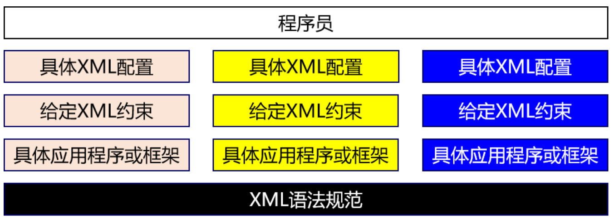

在XML基本语法规范的基础上，你使用的那些第三方应用程序、框架会通过设计**『XML约束』**的方式**『强制规定』**配置文件中可以写什么和怎么写，规定之外的都不可以写。

XML基本语法这个知识点的定位是：我们不需要从零开始，从头到尾的一行一行编写XML文档，而是在第三方应用程序、框架**已提供的配置文件**的基础上**修改**。要改成什么样取决于你的需求，而怎么改取决于**XML基本语法**和**具体的XML约束**。

##### XML基本语法

- **<u>XML声明</u>**

这部分基本上就是固定格式，大家知道就好

```xml
<?xml version="1.0" encoding="UTF-8"?>
```

- **<u>根标签</u>**

根标签有且只能有一个；

- **<u>标签关闭</u>**
  - 双标签：开始标签和结束标签必须成对出现；
  - 单标签：单标签在标签内关闭；
- **<u>标签嵌套</u>**
  - 可以嵌套，但是==**<u>不能交叉嵌套</u>**==；
- **<u>注释不能嵌套</u>**
- **<u>标签名、属性名建议使用小写字母</u>**
- **<u>属性</u>**
  - 属性必须有值；
  - 属性值必须加引号，单双都行；

看到这里大家一定会发现XML的基本语法和HTML的基本语法简直如出一辙。其实这不是偶然的，==**<u>XML基本语法+HTML约束=HTML语法</u>**==。在逻辑上HTML确实是XML的子集。

```html
<!DOCTYPE HTML PUBLIC "-//W3C//DTD HTML 4.01 Transitional//EN"
"http://www.w3.org/TR/html4/loose.dtd">
```

从HTML4.01版本的文档类型声明中可以看出，这里使用的DTD类型的XML约束。也就是说`http://www.w3.org/TR/html4/loose.dtd`这个文件定义了HTML文档中可以写哪些标签，标签内可以写哪些属性，某个标签可以有什么样的子标签。

##### XML约束

将来我们主要就是根据XML约束中的规定来编写XML配置文件。而XML约束主要包括DTD和Schema两种。如果XML配置文件使用的是DTD，那么对我们几乎没有影响。如果是Schema约束，需要我们稍微参与一点点。

- **<u>文档类型定义（Document Type Definition，DTD）</u>**

将来在IDEA中有代码提示的协助，在DTD文档的约束下进行配置非常简单。

```dtd
<!ENTITY % fontstyle
 "TT | I | B | U | S | STRIKE | BIG | SMALL">

<!ENTITY % phrase "EM | STRONG | DFN | CODE |
                   SAMP | KBD | VAR | CITE | ABBR | ACRONYM" >

<!ENTITY % special
   "A | IMG | APPLET | OBJECT | FONT | BASEFONT | BR | SCRIPT |
    MAP | Q | SUB | SUP | SPAN | BDO | IFRAME">

<!ENTITY % formctrl "INPUT | SELECT | TEXTAREA | LABEL | BUTTON">

<!-- %inline; covers inline or "text-level" elements -->
<!ENTITY % inline "#PCDATA | %fontstyle; | %phrase; | %special; | %formctrl;">

<!ELEMENT (%fontstyle;|%phrase;) - - (%inline;)*>
<!ATTLIST (%fontstyle;|%phrase;)
  %attrs;                              -- %coreattrs, %i18n, %events --
  >
```

- **<u>Schema</u>**

我们将来使用SSM框架中的`Spring`、`SpringMVC`框架时，会涉及到一点点对`Schema`约束的设置。不过不必紧张，有IDEA的支持操作会非常简单，我们现在只需要理解基本概念即可。

首先我们要理解一个概念：**『名称空间』**，英文：`name space`。

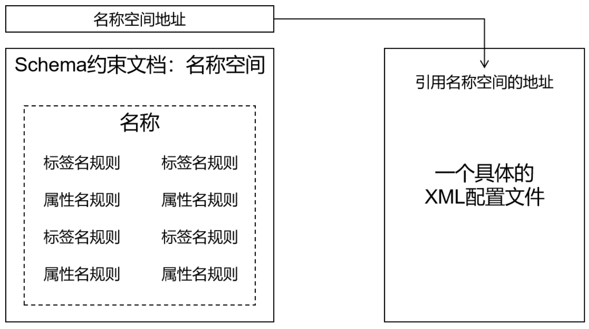

Schema约束要求我们一个XML文档中，所有标签，所有属性都必须在约束中有明确的定义。

下面我们以web.xml的约束声明为例来做个说明：

```xml
<web-app xmlns="http://xmlns.jcp.org/xml/ns/javaee"
         xmlns:xsi="http://www.w3.org/2001/XMLSchema-instance"
         xsi:schemaLocation="http://xmlns.jcp.org/xml/ns/javaee http://xmlns.jcp.org/xml/ns/javaee/web-app_4_0.xsd"
         version="4.0">
```

| 属性名             | 作用                                                         |
| ------------------ | ------------------------------------------------------------ |
| xmlns              | 指出当前XML文档约束规则的名称空间在哪里 我们就是通过这个属性来引用一个具体的名称空间 |
| xmlns:xsi          | 指出xmlns这个属性是在哪个约束文档中被定义的                  |
| xsi:schemaLocation | 语法格式：在xsi名称空间下引用schemaLocation属性 配置含义：指定当前XML文档中所用到的约束文档本身的文件的地址 |

`xmlns`和`xsi:schemaLocation`对应关系如下图：

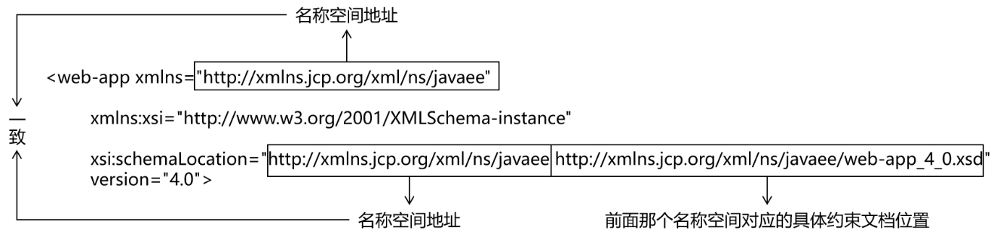

引入多个名称空间的例子如下：

```xml
<?xml version="1.0" encoding="UTF-8"?>
<beans xmlns="http://www.springframework.org/schema/beans"
	xmlns:xsi="http://www.w3.org/2001/XMLSchema-instance"
	xmlns:context="http://www.springframework.org/schema/context"
	xmlns:mvc="http://www.springframework.org/schema/mvc"
	xsi:schemaLocation="http://www.springframework.org/schema/mvc http://www.springframework.org/schema/mvc/spring-mvc-4.0.xsd
		http://www.springframework.org/schema/beans http://www.springframework.org/schema/beans/spring-beans.xsd
		http://www.springframework.org/schema/context http://www.springframework.org/schema/context/spring-context-4.0.xsd">

	<context:component-scan base-package="com.atguigu.crud.component"/>
	
	<bean id="viewResolver" class="org.springframework.web.servlet.view.InternalResourceViewResolver">
		<property name="prefix" value="/WEB-INF/pages/"/>
		<property name="suffix" value=".jsp"/>
	</bean>
	
	<mvc:default-servlet-handler/>
	<mvc:annotation-driven/>

</beans>
```

看到这么复杂，这么长的名称空间字符串，我们会觉得很担心，根本记不住。但是其实不需要记，在IDEA中编写配置文件时，IDEA会协助我们导入，会有提示。我们**理解各个部分的含义能够调整**即可。

#### 属性文件

以properties作为扩展名的文件。

```properties
atguigu.jdbc.url=jdbc:mysql://192.168.198.100:3306/mybatis1026
atguigu.jdbc.driver=com.mysql.jdbc.Driver
atguigu.jdbc.username=root
atguigu.jdbc.password=atguigu
```

- 由键值对组成；

- 键和值之间的符号是等号；
- 每一行都必须顶格写，==**<u>前面不能有空格之类</u>**==的其他符号；

#### 其他形式

- YAML语言的配置文件：在SpringBoot中使用；

```yaml
spring:
  profiles:
    active: fc
  datasource:
    name: mydb
    type: com.alibaba.druid.pool.DruidDataSource
    url: jdbc:mysql://192.168.41.100:3306/spring_boot?serverTimezone=UTC
    username: root
    password: atguigu
    driver-class-name: com.mysql.cj.jdbc.Driver
mybatis:
  mapper-locations: classpath*:/mybatis-mapper/*Mapper.xml
logging:
  level:
    com.atguigu.function.compute.mapper: debug
```

- JSON格式的配置文件：一般是前端使用；

## 4.2 Tomcat的部署和启动

### 4.2.1 Tomcat扮演的角色

#### 对外：Web服务器


#### 对内：Servlet

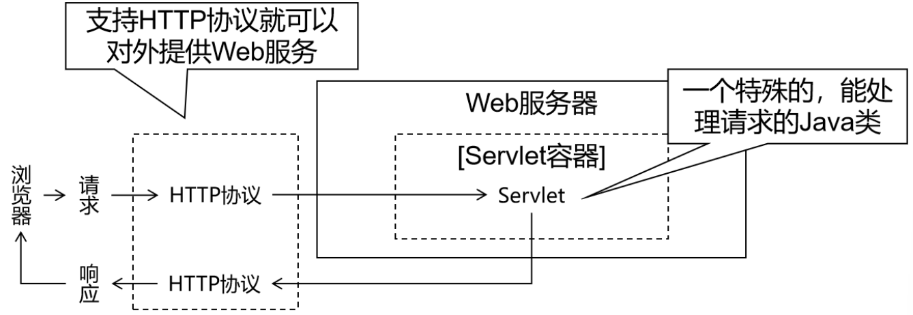

### 4.2.2 部署

#### 前提

Tomcat本身是一个Java程序，所以当前系统中必须正确配置了`JAVA_HOME`环境变量。

Tomcat支持的Java版本对照：


#### 启动关闭Tomcat

启动Tomcat：运行Tomcat解压后根目录下`\bin\startup.bat`即可。

```shell
PS D:\JavaWeb\apache-tomcat-10.1.7\bin> .\\startup.bat
```

Tomcat首页网址为：`localhost:8080`；

如果需要停止Tomcat，则运行`shutdown.bat`程序。

```shell
PS D:\JavaWeb\apache-tomcat-10.1.7\bin> .\\shutdown.bat
```

小提示：将来我们在IDEA中启动Tomcat，如果IDEA卡死强关，Tomcat不会正常退出。下次再启动Tomcat会因为残留进程仍然占用`8080`端口，导致新的进程无法启动。此时可以使用`shutdown.bat`结束残留进程。

具体部署过程可在IDEA中进行。

# 5 Servlet

## 5.1 概述

### 5.1.1 名字

`Servlet=Server+applet`

- `Server`：服务器；

- `applet`：小程序；

`Servlet`含义是服务器端的小程序

### 5.1.2 Servlet在Web中作用


在整个Web应用中，Servlet主要负责处理请求、协调调度功能。我们可以把Servlet称为Web应用中的**『控制器』**。

## 5.2 Servlet HelloWorld

### 5.2.1 HelloWorld分析

#### 目标

在页面上点击超链接，由`Servlet`处理这个请求，并返回一个响应字符串：`Hello,I am Servlet`。

#### 思路


### 5.2.2 具体步骤

1. 创建动态Web module；
2. 在`index.jsp`中创建超链接；

```html
<!-- /Web应用地址/Servlet地址 -->
<a href="/app/helloServlet">Servlet Hello World</a>
```

3. 创建`HelloServlet.java`；

```java
public class HelloServlet implements Servlet {
    @Override
    public void init(ServletConfig servletConfig) throws ServletException {

    }

    @Override
    public ServletConfig getServletConfig() {
        return null;
    }

    @Override
    public void service(ServletRequest servletRequest, ServletResponse servletResponse) throws ServletException, IOException {

        // 控制台打印，证明这个方法被调用了
        System.out.println("我是HelloServlet，我执行了！");

        // 返回响应字符串
        // 1、获取能够返回响应数据的字符流对象
        PrintWriter writer = servletResponse.getWriter();

        // 2、向字符流对象写入数据
        writer.write("Hello,I am Servlet");
    }

    @Override
    public String getServletInfo() {
        return null;
    }

    @Override
    public void destroy() {

    }
}
```

4. 在web.xml中配置HelloServlet

```xml
<!-- 配置Servlet本身 -->
<servlet>
    <!-- 全类名太长，给Servlet设置一个简短名称 -->
    <servlet-name>HelloServlet</servlet-name>

    <!-- 配置Servlet的全类名 -->
    <servlet-class>com.atguigu.servlet.HelloServlet</servlet-class>
</servlet>

<!-- 将Servlet和访问地址关联起来 -->
<servlet-mapping>
    <servlet-name>HelloServlet</servlet-name>
    <url-pattern>/helloServlet</url-pattern>
</servlet-mapping>
```

**『虚拟路径』**：Servlet并**不是**文件系统中**实际存在**的**目录或文件**，所以为了方便浏览器访问，我们创建了**虚拟**出来的路径来访问它。

### 5.2.3 梳理概念

#### 原生Tomcat

从官网下载的zip文件，可通过命令行shell运行；

#### IDEA中的Tomcat实例

在IDEA中对具体网络项目、网络模块进行Tomcat配置；

#### IDEA中的Web工程

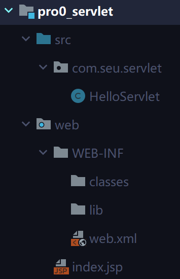

#### 访问资源的地址

1. **<u>静态资源</u>**
   - HTML文件；
   - CSS文件；
   - JavaScript文件；
   - 图片文件；

`/Web应用名称/静态资源本身的路径`

2. **<u>动态资源</u>**
   - Servlet

`/Web应用名称/虚拟路径`

#### 总体的逻辑结构


## 5.3 Servlet生命周期

### 5.3.1 Servlet接口


### 5.3.2 Servlet创建对象的时机

#### 验证方式

在HelloServlet的构造器中执行控制台打印：

```java
public HelloServlet(){
    System.out.println("我来了！HelloServlet对象创建！");
}
```

#### 结论

- 默认情况下：Servlet在**第一次接收到请求**的时候才创建对象
- 创建对象后，所有的URL地址匹配的请求都由这同一个对象来处理；
- Tomcat中，每一个请求会被分配一个线程来处理，所以可以说：Servlet是**单实例，多线程**方式运行的；
- 既然Servlet是多线程方式运行，所以有线程安全方面的可能性，所以不能在处理请求的方法中修改公共属性；

#### 修改创建对象的时机

修改`web.xml`中Servlet的配置：

```xml
<!-- 配置Servlet本身 -->
<servlet>
    <!-- 全类名太长，给Servlet设置一个简短名称 -->
    <servlet-name>HelloServlet</servlet-name>

    <!-- 配置Servlet的全类名 -->
    <servlet-class>com.atguigu.servlet.HelloServlet</servlet-class>

    <!-- 配置Servlet启动顺序 -->
    <load-on-startup>1</load-on-startup>
</servlet>
```

### 5.3.3 Servlet容器

#### 容器

在开发使用的各种技术中，经常会有很多对象会放在容器中；

#### 功能

容器会管理内部对象的整个生命周期。对象在容器中才能够正常的工作，得到来自容器的全方位的支持。

- 创建对象；
- 初始化；
- 工作；
- 清理；

#### 本身也是对象

- 特点1：往往是非常大的对象；
- 特点2：通常的单例的；

#### Servlet容器产品

- Tomcat
- jetty
- jboss
- Weblogic
- WebSphere
- glassfish

### 5.3.4 总结

| 名称       | 时机                                                         | 次数 |
| ---------- | ------------------------------------------------------------ | ---- |
| 创建对象   | 默认情况：接收到第一次请求 修改启动顺序后：Web应用启动过程中 | 一次 |
| 初始化操作 | 创建对象之后                                                 | 一次 |
| 处理请求   | 接收到请求                                                   | 多次 |
| 销毁操作   | Web应用卸载之前                                              | 一次 |

## 5.4 `ServletConfig`和`ServletContext`

### 5.4.1 类比

Servlet对象 → ServletConfig对象 → ServletContext对象

### 5.4.2 `ServletConfig`接口

| 方法名                  | 作用                                                         |
| ----------------------- | ------------------------------------------------------------ |
| getServletName()        | 获取`<servlet-name>HelloServlet</servlet-name>`定义的Servlet名称 |
| **getServletContext()** | 获取ServletContext对象                                       |
| getInitParameter()      | 获取配置Servlet时设置的『初始化参数』，根据名字获取值        |
| getInitParameterNames() | 获取所有初始化参数名组成的Enumeration对象                    |

#### 初始化参数举例

```xml
<!-- 配置Servlet本身 -->
<servlet>
    <!-- 全类名太长，给Servlet设置一个简短名称 -->
    <servlet-name>HelloServlet</servlet-name>
    <!-- 配置Servlet的全类名 -->
    <servlet-class>com.atguigu.servlet.HelloServlet</servlet-class>

    <!-- 配置初始化参数 -->
    <init-param>
        <param-name>goodMan</param-name>
        <param-value>me</param-value>
    </init-param>

    <!-- 配置Servlet启动顺序 -->
    <load-on-startup>1</load-on-startup>
</servlet>
```

#### 测试

```java
class HelloServlet implements Servlet {

    // 声明一个成员变量，用来接收init()方法传入的servletConfig对象
    private ServletConfig servletConfig;

    public HelloServlet(){
        System.out.println("我来了！HelloServlet对象创建！");
    }

    @Override
    public void init(ServletConfig servletConfig) throws ServletException {

        System.out.println("HelloServlet对象初始化");

        // 将Tomcat调用init()方法时传入的servletConfig对象赋值给成员变量
        this.servletConfig = servletConfig;

    }

    @Override
    public ServletConfig getServletConfig() {

        // 返回成员变量servletConfig，方便使用
        return this.servletConfig;
    }

    @Override
    public void service(ServletRequest servletRequest, ServletResponse servletResponse) throws ServletException, IOException {

        // 控制台打印，证明这个方法被调用了
        System.out.println("我是HelloServlet，我执行了！");

        // 返回响应字符串
        // 1、获取能够返回响应数据的字符流对象
        PrintWriter writer = servletResponse.getWriter();

        // 2、向字符流对象写入数据
        writer.write("Hello,I am Servlet");

        // =============分割线===============
        // 测试ServletConfig对象的使用
        // 1.获取ServletConfig对象：在init()方法中完成
        System.out.println("servletConfig = " + servletConfig.getClass().getName());

        // 2.通过servletConfig对象获取ServletContext对象
        ServletContext servletContext = this.servletConfig.getServletContext();
        System.out.println("servletContext = " + servletContext.getClass().getName());

        // 3.通过servletConfig对象获取初始化参数
        Enumeration<String> enumeration = this.servletConfig.getInitParameterNames();
        while (enumeration.hasMoreElements()) {
            String name = enumeration.nextElement();
            System.out.println("name = " + name);

            String value = this.servletConfig.getInitParameter(name);
            System.out.println("value = " + value);
        }
    }

    @Override
    public String getServletInfo() {
        return null;
    }

    @Override
    public void destroy() {
        System.out.println("HelloServlet对象即将销毁，现在执行清理操作");
    }
}
```

- 广义Servlet：`javax.servlet`包下的一系列接口定义的一组**Web开发标准**。遵循这一套标准，不同的Servlet容器提供了不同的实现。
- 狭义Servlet：`javax.servlet.Servlet`接口和它的实现类，也就是实际开发时使用的具体的Servlet。

Servlet标准和JDBC标准对比：

| Servlet标准                     | JDBC标准                             |
| ------------------------------- | ------------------------------------ |
| javax.servlet包下的一系列接口   | javax.sql包下的一系列接口            |
| Servlet容器厂商提供的具体实现类 | 数据库厂商提供的实现类（数据库驱动） |

同样都体现了**面向接口编程**的思想，同时也体现了**解耦**的思想：只要接口不变，下层方法有任何变化，都不会影响上层方法。

### 5.4.3 `ServletContext`接口

- 代表：整个Web应用
- 是否单例：是
- 典型的功能：
  - 获取某个资源的真实路径：getRealPath()
  - 获取整个Web应用级别的初始化参数：getInitParameter()
  - 作为Web应用范围的域对象
    - 存入数据：setAttribute()
    - 取出数据：getAttribute()

#### 配置Web应用级别的初始化参数

```xml
<!-- 配置Web应用的初始化参数 -->
<context-param>
    <param-name>handsomeMan</param-name>
    <param-value>alsoMe</param-value>
</context-param>
```

#### 获取参数

```java
String handsomeMan = servletContext.getInitParameter("handsomeMan");
System.out.println("handsomeMan = " + handsomeMan);
```

## 5.5 使用IDEA创建Servlet

在Web模块中的`src`文件右键可添加`Servlet`选项文件，取消勾选`创建Java EE注解类`，`web.xml`中会自动添加`servlet`标签，然后我们自己补充`servlet-mapping`标签。

IDEA生成的Servlet类会自动继承`HttpServlet`。

## 5.6 Servlet继承关系

### 5.6.1 类型关系


### 5.6.2 方法关系


## 5.7 动态Web工程内编写路径

### 5.7.1 为什么要写路径

- 整个系统要根据功能拆分成许许多多**独立**的**资源**；
- 资源之间既要完成自身的功能又要和其他资源**配合**；
- 写路径就是为了从一个资源**跳转**到下一个资源；

### 5.7.2 路径复杂

#### 先开发再部署

- **工程目录**：我们写代码的地方，但是在服务器上运行的不是这个；
- **部署目录**：经过Java源文件**编译**和**目录重组**后，IDEA就替我们准备好了可以在服务器上运行的部署目录；
- **区别**：因为从工程目录到部署目录经过了**目录重组**，所以它们的目录结构是**不同**的；
- **基准**：用户通过浏览器访问服务器，而服务器上运行的是部署目录，所以写路径的时候**参考部署目录**而不是工程目录；
- **对应关系**：**工程目录下的web目录对应部署目录的根目录**，同时部署目录的根目录也是路径中的**Web应用根目录**；

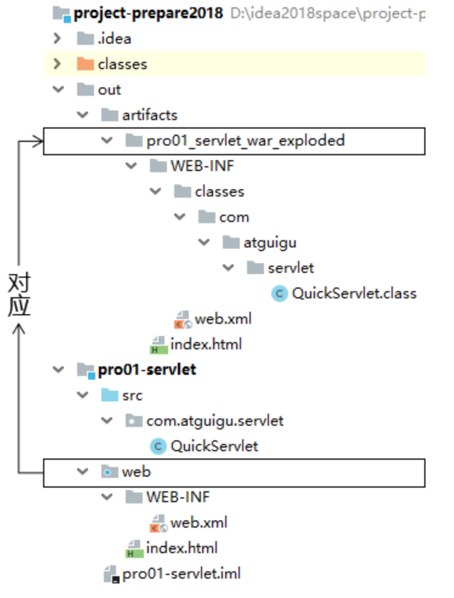

#### 路径的各个组成部分

从最前面一直到Web应用名称这里都是固定写法，到资源名这里要看具体是什么资源。

##### 具体文件

我们写代码的时候都是在工程目录下操作，所以参照工程目录来说最方便。按照工程目录的目录结构来说，从web目录开始按照实际目录结构写就好了（不包括web目录本身）。


##### Servlet

访问Servlet的路径是我们在`web.xml`中配置的，大家可能注意到了，`url-pattern`里面的路径我们也是**斜杠开头**的，但是这个开头的斜杠代表**Web应用根目录**。

同样是开头的斜杠，超链接路径中的开头斜杠代表服务器根目录，Servlet地址开头的斜杠，代表Web应用根目录。

### 5.7.3 准则

| 路径类型           | 解析方式                  |
| ------------------ | ------------------------- |
| 由浏览器解析的路径 | 开头斜杠代表服务器根目录  |
| 由服务器解析的路径 | 开头斜杠代表Web应用根目录 |

- 浏览器解析的路径举例：
  - 所有HTML标签中的路径
  - **重定向**过程中指定的路径
- 服务器解析的路径举例：
  - 所有web.xml中配置的路径
  - **请求转发**过程中指定的路径

### 5.7.4 写路径步骤


### 5.7.5 动态获取上下文步骤

#### 上下文路径的概念

**上下文路径（context path）**=/Web应用名称；

#### 动态获取

由于项目部署的时候，上下文路径是可以变化的，所以写死有可能发生错误。此时我们通过request对象动态获取上下文路径就不用担心这个问题了。调用下面这个方法，每一次获取的都是当前环境下实际的上下文路径的值。

```java
request.getContextPath()
```

## 5.8 请求转发和重定向

### 5.8.1 接力

发一个请求给Servlet，接力棒就传递到了Servlet手中。而绝大部分情况下，Servlet不能独自完成一切，需要把接力棒继续传递下去，此时我们就需要请求的**『转发』**或**『重定向』**。

### 5.8.2 转发

在请求的处理过程中，Servlet完成了自己的任务，需要把请求**转交给下一个资源**继续处理。


```java
request.getRequestDispatcher("/fruit/apple/red/sweet/big.html").forward(request, response);
```

关键：由于转发操作的核心部分是**在服务器端完成**的，所以浏览器感知不到，整个过程中浏览器**只发送一次请求**。

### 5.8.3 重定向

在请求的处理过程中，Servlet完成了自己的任务，然后以一个**响应**的方式告诉浏览器：“要完成这个任务还需要你另外**再访问下一个资源**”。


```java
response.sendRedirect("/app/fruit/apple/red/sweet/big.html");
```

关键：由于重定向操作的核心部分是**在浏览器端完成**的，所以整个过程中浏览器**共发送两次请求**。

### 5.8.4 对比

| 转发                                 | 重定向                               |
| ------------------------------------ | ------------------------------------ |
| **一次请求**                         | **两次请求**                         |
| 浏览器地址栏显示的是第一个资源的地址 | 浏览器地址栏显示的是第二个资源的地址 |
| 全程使用的是同一个request对象        | 全程使用的是不同的request对象        |
| 在服务器端完成                       | 在浏览器端完成                       |
| 目标资源地址由服务器解析             | 目标资源地址由浏览器解析             |
| 目标资源可以在WEB-INF目录下          | 目标资源不能在WEB-INF目录下          |
| 目标资源仅限于本应用内部             | 目标资源可以是外部资源               |

### 5.8.5 应用场景

可以简单的判断：能用转发的先用转发，如果转发不行，再使用重定向。

- 需要通过同一个request对象把数据携带到目标资源：只能用转发；
- 如果希望前往下一个资源之后，浏览器刷新访问的是第二个资源：只能用重定向；

## 5.9 获取请求参数

### 5.9.1 概念

浏览器在给服务器发送请求的同时，携带的参数数据。

### 5.9.2 基本形式

- URL地址后面附着的请求参数；

`/orange/CharacterServlet?username=汤姆`

- 表单；
- Ajax请求（将来会学到）；

### 5.9.3 服务器对请求参数的封装

总体上来说，服务器端将请求参数封装为**`Map<String, String[]>`**。

- 键：请求参数的名字；
- 值：请求参数的值组成的数组；

### 5.9.4 获取请求参数的方法

| 方法名                                       | 返回值类型            |
| -------------------------------------------- | --------------------- |
| request.getParameterMap()                    | Map<String, String[]> |
| request.getParameter("请求参数的名字")       | String                |
| request.getParameterValues("请求参数的名字") | String []             |
| request.getParameterNames()                  | Enumeration<String>   |

### 5.9.5 示例

#### HTML

```html
<!-- 测试请求参数的表单 -->
<form action="/orange/ParamServlet" method="post">

    <!-- 单行文本框 -->
    <!-- input标签配合type="text"属性生成单行文本框 -->
    <!-- name属性定义的是请求参数的名字 -->
    <!-- 如果设置了value属性，那么这个值就是单行文本框的默认值 -->
    个性签名：<input type="text" name="signal" value="单行文本框的默认值" /><br/>

    <!-- 密码框 -->
    <!-- input标签配合type="password"属性生成密码框 -->
    <!-- 用户在密码框中填写的内容不会被一明文形式显示 -->
    密码：<input type="password" name="secret" /><br/>

    <!-- 单选框 -->
    <!-- input标签配合type="radio"属性生成单选框 -->
    <!-- name属性一致的radio会被浏览器识别为同一组单选框，同一组内只能选择一个 -->
    <!-- 提交表单后，真正发送给服务器的是name属性和value属性的值 -->
    <!-- 使用checked="checked"属性设置默认被选中 -->
    请选择你最喜欢的季节：
    <input type="radio" name="season" value="spring" />春天
    <input type="radio" name="season" value="summer" checked="checked" />夏天
    <input type="radio" name="season" value="autumn" />秋天
    <input type="radio" name="season" value="winter" />冬天

    <br/><br/>

    你最喜欢的动物是：
    <input type="radio" name="animal" value="tiger" />路虎
    <input type="radio" name="animal" value="horse" checked="checked" />宝马
    <input type="radio" name="animal" value="cheetah" />捷豹

    <br/>

    <!-- 多选框 -->
    <!-- input标签和type="checkbox"配合生成多选框 -->
    <!-- 多选框被用户选择多个并提交表单后会产生『一个名字携带多个值』的情况 -->
    你最喜欢的球队是：
    <input type="checkbox" name="team" value="Brazil"/>巴西
    <input type="checkbox" name="team" value="German" checked="checked"/>德国
    <input type="checkbox" name="team" value="France"/>法国
    <input type="checkbox" name="team" value="China" checked="checked"/>中国
    <input type="checkbox" name="team" value="Italian"/>意大利

    <br/>

    <!-- 下拉列表 -->
    <!-- 使用select标签定义下拉列表整体，在select标签内设置name属性 -->
    你最喜欢的运动是：
    <select name="sport">
        <!-- 使用option属性定义下拉列表的列表项 -->
        <!-- 使用option标签的value属性设置提交给服务器的值，在option标签的标签体中设置给用户看的值 -->
        <option value="swimming">游泳</option>
        <option value="running">跑步</option>

        <!-- 使用option标签的selected="selected"属性设置这个列表项默认被选中 -->
        <option value="shooting" selected="selected">射击</option>
        <option value="skating">溜冰</option>
    </select>

    <br/>

    <br/><br/>

    <!-- 表单隐藏域 -->
    <!-- input标签和type="hidden"配合生成表单隐藏域 -->
    <!-- 表单隐藏域在页面上不会有任何显示，用来保存要提交到服务器但是又不想让用户看到的数据 -->
    <input type="hidden" name="userId" value="234654745" />

    <!-- 多行文本框 -->
    自我介绍：<textarea name="desc">多行文本框的默认值</textarea>

    <br/>

    <!-- 普通按钮 -->
    <button type="button">普通按钮</button>

    <!-- 重置按钮 -->
    <button type="reset">重置按钮</button>

    <!-- 表单提交按钮 -->
    <button type="submit">提交按钮</button>
</form>
```

#### Java

```java
// 获取包含全部请求参数的Map
    Map<String, String[]> parameterMap = request.getParameterMap();

    // 遍历这个包含全部请求参数的Map
    Set<String> keySet = parameterMap.keySet();

    for (String key : keySet) {

        String[] values = parameterMap.get(key);

        System.out.println(key + "=" + Arrays.asList(values));
    }

    System.out.println("---------------------------");

    // 根据请求参数名称获取指定的请求参数值
    // getParameter()方法：获取单选框的请求参数
    String season = request.getParameter("season");
    System.out.println("season = " + season);

    // getParameter()方法：获取多选框的请求参数
    // 只能获取到多个值中的第一个
    String team = request.getParameter("team");
    System.out.println("team = " + team);

    // getParameterValues()方法：取单选框的请求参数
    String[] seasons = request.getParameterValues("season");
    System.out.println("Arrays.asList(seasons) = " + Arrays.asList(seasons));

    // getParameterValues()方法：取多选框的请求参数
    String[] teams = request.getParameterValues("team");
    System.out.println("Arrays.asList(teams) = " + Arrays.asList(teams));
```

## 5.10 请求响应设置字符集

### 5.10.1 请求

#### GET请求

在`server.xml`的`Connector`标签中增加`URIEncoding`属性：

```xml
<Connector port="8080" protocol="HTTP/1.1"
		   connectionTimeout="20000"
		   redirectPort="8443" 
		   URIEncoding="UTF-8"
		   />
```

重启Tomcat实例即可。

#### POST请求

使用request对象设置字符集：

```java
// 使用request对象设置字符集
request.setCharacterEncoding("UTF-8");

// 获取请求参数
String username = request.getParameter("username");

System.out.println("username = " + username);
```

### 5.10.2 响应

编码字符集和解码字符集一致

```java
// 设置服务器端的编码字符集
response.setCharacterEncoding("UTF-8");

PrintWriter writer = response.getWriter();

writer.write("<!DOCTYPE html>                  ");
writer.write("<html>                           ");
writer.write("<head>                           ");
writer.write("<!-- 设置浏览器端的解码字符集 -->");
writer.write("    <meta charset='UTF-8'>       ");
writer.write("    <title>Title</title>         ");
writer.write("</head>                          ");
writer.write("<body>                           ");
writer.write("<p>志玲姐姐你好！</p>            ");
writer.write("</body>                          ");
writer.write("</html>                          ");
```

或者

设置response对象：

```java
response.setContentType("text/html;charset=UTF-8");
```

# 6 Thymeleaf

## 6.1 MVC

### 6.1.1 背景

我们对HTML的新的期待：既能够正常显示页面，又能在页面中包含动态数据部分。而动态数据单靠HTML本身是无法做到的，所以此时我们需要引入服务器端动态视图模板技术。

### 6.1.2 从三层结构到MVC

#### MVC概念

- M：Model模型；

- V：View视图；

- C：Controller控制器；

MVC是在表述层开发中运用的一种设计理念。主张把**封装数据的『模型』**、**显示用户界面的『视图』**、**协调调度的『控制器』**分开。

好处：

- 进一步实现各个组件之间的解耦；
- 让各个组件可以单独维护；
- 将视图分离出来以后，我们后端工程师和前端工程师的对接更方便；

#### MVC和三层架构之间的关系


### 6.1.3 前后端对接方式

- 服务器端渲染：前端工程师把前端页面一整套做好交给后端工程师；
- 前后端分离：开会商量JSON格式，然后分头开发。在后端程序尚不可用时，前端工程师会使用`Mock.js`生成假数据使用，在后端程序可用后再连接实际后端程序获取真实数据；


## 6.2 Thymeleaf简介

### 6.2.1 服务器模板技术

JSP、Freemarker、Velocity等等，它们有一个共同的名字：**服务器端模板技术**。

### 6.2.2 Thymeleaf介绍

Thymelaf是一个适用于web和独立环境的现代服务器端Java模板引擎，能够处理HTML、XML、JavaScript、CSS甚至纯文本。Thymelaf的主要目标是提供一种优雅且高度可维护的创建模板的方法。为了实现这一点，它建立在自然模板的概念之上，以一种不影响模板用作设计原型的方式将其逻辑注入模板文件。这改善了设计的沟通，并弥合了设计和开发团队之间的差距。Thymelaf也从一开始就考虑到了Web标准，尤其是HTML5，允许您在需要时创建完全验证的模板。

> Thymeleaf is a modern server-side Java template engine for both web and standalone environments, capable of processing HTML, XML, JavaScript, CSS and even plain text. The main goal of Thymeleaf is to provide an elegant and highly-maintainable way of creating templates. To achieve this, it builds on the concept of Natural Templates to inject its logic into template files in a way that doesn’t affect the template from being used as a design prototype. This improves communication of design and bridges the gap between design and development teams. Thymeleaf has also been designed from the beginning with Web Standards in mind – especially HTML5 – allowing you to create fully validating templates if that is a need for you.

### 6.2.3 Thymeleaf优势

- SpringBoot官方推荐使用的视图模板技术，和SpringBoot完美整合；
- 不经过服务器运算仍然可以直接查看原始值，对前端工程师更友好；

```html
<!DOCTYPE html>
<html lang="en" xmlns:th="http://www.thymeleaf.org">
<head>
    <meta charset="UTF-8">
    <title>Title</title>
</head>
<body>

    <p th:text="${hello}">Original Value</p>

</body>
</html>
```

### 6.2.4 物理视图和逻辑视图

#### 物理视图

在Servlet中，将请求转发到一个HTML页面文件时，使用的完整的转发路径就是**物理视图**。


`/pages/user/login_success.html`

如果我们把所有的HTML页面都放在某个统一的目录下，那么转发地址就会呈现出明显的规律：

- `/pages/user/login.html`；
- `/pages/user/login_success.html`；
- `/pages/user/regist.html`；
- `/pages/user/regist_success.html`；

路径的开头都是：`/pages/user/`

路径的结尾都是：`.html`

所以，路径开头的部分我们称之为**视图前缀**，路径结尾的部分我们称之为**视图后缀**。

#### 逻辑视图

==**<u>物理视图=视图前缀+逻辑视图+视图后缀</u>**==

上面的例子中：

| 视图前缀     | 逻辑视图      | 视图后缀 | 物理视图                       |
| ------------ | ------------- | -------- | ------------------------------ |
| /pages/user/ | login         | .html    | /pages/user/login.html         |
| /pages/user/ | login_success | .html    | /pages/user/login_success.html |

## 6.3 引入Thymeleaf环境

### 6.3.1 引入步骤

1. 加入Thymeleaf提供的jar包；
2. 配置上下文参数；

```xml
<!-- 在上下文参数中配置视图前缀和视图后缀 -->
<context-param>
    <param-name>view-prefix</param-name>
    <param-value>/WEB-INF/view/</param-value>
</context-param>
<context-param>
    <param-name>view-suffix</param-name>
    <param-value>.html</param-value>
</context-param>
```

> 为什么要放在WEB-INF目录下？
>
> 原因：WEB-INF目录不允许浏览器直接访问，所以我们的视图模板文件放在这个目录下，是一种保护。以免外界可以随意访问视图模板文件。
>
> 访问WEB-INF目录下的页面，都必须通过Servlet转发过来，简单说就是：不经过Servlet访问不了。
>
> 这样就方便我们在Servlet中检查当前用户是否有权限访问。
>
> 那放在WEB-INF目录下之后，重定向进不去怎么办？
>
> 重定向到Servlet，再通过Servlet转发到WEB-INF下。

3. 创建Servlet基类；

```java
import jakarta.servlet.*;
import jakarta.servlet.http.*;
import org.thymeleaf.TemplateEngine;
import org.thymeleaf.context.WebContext;
import org.thymeleaf.templatemode.TemplateMode;
import org.thymeleaf.templateresolver.WebApplicationTemplateResolver;
import org.thymeleaf.web.IWebExchange;
import org.thymeleaf.web.servlet.JakartaServletWebApplication;

import java.io.IOException;

public class ViewBaseServlet extends HttpServlet {
    private TemplateEngine templateEngine;

    @Override
    public void init() throws ServletException {

        // 1.获取ServletContext对象
        ServletContext servletContext = this.getServletContext();

        // 2.创建Thymeleaf解析器对象
        WebApplicationTemplateResolver templateResolver = new WebApplicationTemplateResolver(JakartaServletWebApplication.buildApplication(servletContext));

        // 3.给解析器对象设置参数
        // ①HTML是默认模式，明确设置是为了代码更容易理解
        templateResolver.setTemplateMode(TemplateMode.HTML);

        // ②设置前缀
        String viewPrefix = servletContext.getInitParameter("view-prefix");

        templateResolver.setPrefix(viewPrefix);

        // ③设置后缀
        String viewSuffix = servletContext.getInitParameter("view-suffix");

        templateResolver.setSuffix(viewSuffix);

        // ④设置缓存过期时间（毫秒）
        templateResolver.setCacheTTLMs(60000L);

        // ⑤设置是否缓存
        templateResolver.setCacheable(true);

        // ⑥设置服务器端编码方式
        templateResolver.setCharacterEncoding("utf-8");

        // 4.创建模板引擎对象
        templateEngine = new TemplateEngine();

        // 5.给模板引擎对象设置模板解析器
        templateEngine.setTemplateResolver(templateResolver);

    }

    protected void processTemplate(String templateName, HttpServletRequest req, HttpServletResponse resp) throws IOException {
        // 1.设置响应体内容类型和字符集
        resp.setContentType("text/html;charset=UTF-8");
        IWebExchange iServletWebExchange = JakartaServletWebApplication.buildApplication(this.getServletContext()).buildExchange(req, resp);
        // 2.创建WebContext对象
        WebContext webContext = new WebContext(iServletWebExchange);
        webContext.setVariable("url", getServletContext().getContextPath());

        // 3.处理模板数据
        templateEngine.process(templateName, webContext, resp.getWriter());
    }
}
```

### 6.3.2 HelloWorld

#### 创建TestThymeleafServlet.java

```java
import jakarta.servlet.ServletException;
import jakarta.servlet.http.HttpServletRequest;
import jakarta.servlet.http.HttpServletResponse;

import java.io.IOException;

public class TestThymeleafServlet extends ViewBaseServlet {
    @Override
    protected void doGet(HttpServletRequest request, HttpServletResponse response) throws ServletException, IOException {
        // 1.声明当前请求要前往的视图名称
        String viewName = "target";

        // 2.调用ViewBaseServlet父类中的解析视图模板的方法
        super.processTemplate(viewName, request, response);
    }

    @Override
    protected void doPost(HttpServletRequest request, HttpServletResponse response) throws ServletException, IOException {

    }
}
```

#### 添加web.xml

```xml
<servlet>
    <servlet-name>ViewBaseServlet</servlet-name>
    <servlet-class>com.seu.servlet.ViewBaseServlet</servlet-class>
</servlet>
<servlet>
    <servlet-name>TestThymeleafServlet</servlet-name>
    <servlet-class>com.seu.servlet.TestThymeleafServlet</servlet-class>
</servlet>
<servlet-mapping>
    <servlet-name>ViewBaseServlet</servlet-name>
    <url-pattern>/ViewBaseServlet</url-pattern>
</servlet-mapping>
<servlet-mapping>
    <servlet-name>TestThymeleafServlet</servlet-name>
    <url-pattern>/TestThymeleafServlet</url-pattern>
</servlet-mapping>
```

#### Thymeleaf页面target.html

```html
<!DOCTYPE html>
<html lang="en"  xmlns:th="http://www.thymeleaf.org">
<head>
    <meta charset="UTF-8">
    <title>Title</title>
</head>
<body>
<!-- 在p标签的基础上，使用Thymeleaf的表达式，解析了一个URL地址 -->
<p th:text="${url}">Thymeleaf将在这里显示一个Web应用地址</p>
<p th:text="@{'/aaa/bbb'}">Thymeleaf将在这里显示一个解析出来的URL地址</p>
</body>
</html>
```

## 6.4 表达式语法

### 6.4.1 修改标签文本值

```html
<p th:text="标签体新值">标签体原始值</p>
```

- 不经过服务器解析，直接用浏览器打开HTML文件，看到的是『标签体原始值』；
- 经过服务器解析，Thymeleaf引擎根据th:text属性指定的『标签体新值』去**替换**『标签体原始值』；

### 6.4.2 修改指定属性值

```html
<input type="text" name="username" th:value="文本框新值" value="文本框旧值" />
```

==**<u>语法：任何HTML标签原有的属性，前面加上`th:`就都可以通过Thymeleaf来设定新值</u>**==

### 6.4.3 解析URL地址

```html
<p th:text="@{/aaa/bbb/ccc}">标签体原始值</p>
```

解析结果为：

`/view/aaa/bbb/ccc`

所以`@{}`的作用是**在字符串前附加『上下文路径』**

如果我们直接访问index.html本身，那么index.html是不需要通过Servlet，当然也不经过模板引擎，所以index.html上的Thymeleaf的任何表达式都不会被解析。

解决办法：通过Servlet访问index.html，这样就可以让模板引擎渲染页面了：

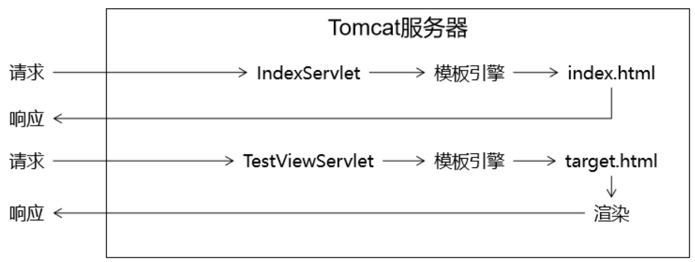

### 6.4.4 直接执行表达式

- Java Servlet

```java
request.setAttribute("reqAttrName", "<span>hello-value</span>");
```

- 页面代码

```html
<p>有转义效果：[[${reqAttrName}]]</p>
<p>无转义效果：[(${reqAttrName})]</p>
```

- 执行效果

```html
<p>有转义效果：&lt;span&gt;hello-value&lt;/span&gt;</p>
<p>无转义效果：<span>hello-value</span></p>
```

## 6.5 访问域对象

### 6.5.1 域对象

#### 请求域

在请求转发的场景下，我们可以借助`HttpServletRequest`对象内部给我们提供的存储空间，帮助我们携带数据，把数据发送给转发的目标资源。

请求域：`HttpServletRequest`对象内部给我们提供的存储空间


#### 会话域


#### 应用域


> PS：在我们使用的视图是JSP的时候，域对象有4个
>
> - pageContext
> - request：请求域
> - session：会话域
> - application：应用域
>
> 所以在JSP的使用背景下，我们可以说域对象有4个，现在使用Thymeleaf了，没有`pageContext`；

### 6.5.2 将数据存入属性域

#### 操作请求域

Servlet：

```java
String requestAttrName = "helloRequestAttr";
String requestAttrValue = "helloRequestAttr-VALUE";

request.setAttribute(requestAttrName, requestAttrValue);
```

Thymeleaf:

```html
<p th:text="${helloRequestAttr}">request field value</p>
```

#### 操作会话域

Servlet：

```java
// ①通过request对象获取session对象
HttpSession session = request.getSession();

// ②存入数据
session.setAttribute("helloSessionAttr", "helloSessionAttr-VALUE");
```

Thymeleaf:

```html
<p th:text="${session.helloSessionAttr}">这里显示会话域数据</p>
```

#### 操作应用域

Servlet：

```java
// ①通过调用父类的方法获取ServletContext对象
ServletContext servletContext = getServletContext();

// ②存入数据
servletContext.setAttribute("helloAppAttr", "helloAppAttr-VALUE");
```

Thymeleaf:

```html
<p th:text="${application.helloAppAttr}">这里显示应用域数据</p>
```

## 6.6 内置对象

### 6.6.1 概念

所谓内置对象其实就是在表达式中**可以直接使用**的对象。

### 6.6.2 基本内置对象

- `#ctx`: the context object;
- `#vars`: the context variables;
- `#locale`: the context locale;
- `#request`: the `HttpServletREquest` object;
- `#response`: the `HttpServletResponse` object;
- `#session`: the `HttpSession` object;
- `#servletContext`: the `ServletContext` object;

用法举例：

```html
<h3>表达式的基本内置对象</h3>
<p th:text="${#request.getClass().getName()}">这里显示#request对象的全类名</p>
<p th:text="${#request.getContextPath()}">调用#request对象的getContextPath()方法</p>
<p th:text="${#request.getAttribute('helloRequestAttr')}">调用#request对象的getAttribute()方法，读取属性域</p>
```

### 6.6.3 公共内置对象

- `#conversions`;
- `#dates`;
- `#calendars`;
- `#numbers`;
- `#string`;
- `#object`;
- `#bools`;
- `#arrays`;
- `#lists`;
- `#sets`;
- `#maps`;
- `#aggregates`;
- `#ids`;

Servlet中将List集合数据存入请求域：

```java
request.setAttribute("aNotEmptyList", Arrays.asList("aaa","bbb","ccc"));
request.setAttribute("anEmptyList", new ArrayList<>());
```

页面代码：

```html
<p>#list对象isEmpty方法判断集合整体是否为空aNotEmptyList：<span th:text="${#lists.isEmpty(aNotEmptyList)}">测试#lists</span></p>
<p>#list对象isEmpty方法判断集合整体是否为空anEmptyList：<span th:text="${#lists.isEmpty(anEmptyList)}">测试#lists</span></p>
```

## 6.7 `${}`中的表达式本质为OGNL

### 6.7.1 OGNL

**对象-图导航语言（Object-Graph Navigation Language，OGNL）**。

### 6.7.2 对象图

从根对象触发，通过特定的语法，逐层访问对象的各种属性。

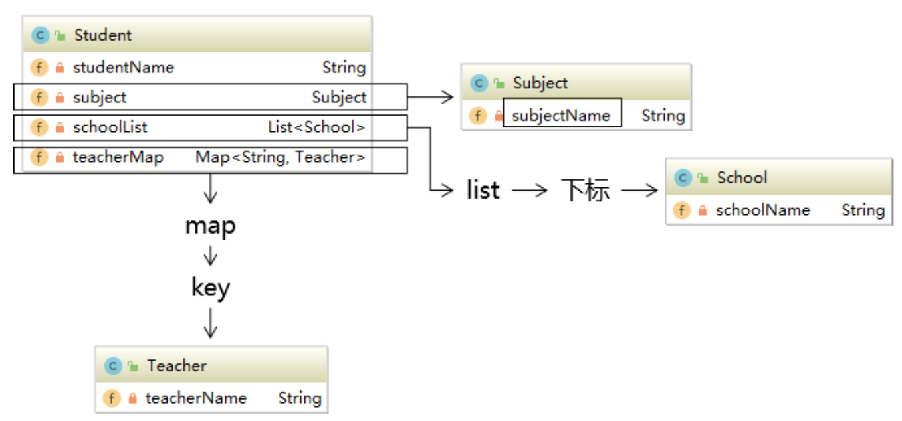

### 6.7.3 OGNL语法

#### 起点

在Thymeleaf环境下，`${}`中的表达式可以从下列元素开始：

- 访问属性域的起点
  - 请求域属性名；
  - `session`；
  - `application`；
- `param`
- 内置对象
  - `#request`；
  - `#session`；
  - ``#lists`；
  - `#strings`；

#### 属性访问语法

- 访问对象属性：使用`getXxx()`、`setXxx()`方法定义的属性
  - `对象.属性名`；
- 访问List集合或数组
  - `集合或数组[下标]`；
- 访问Map集合
  - `Map集合.key`；
  - `Map集合['key']`；


## 6.8 分支与迭代

### 6.8.1 分支

#### `if`和`unless`

让标记了`th:if`、`th:unless`的标签根据条件决定是否显示。

实体bean：

```java
public class Employee {
    private Integer empId;
    private String empName;
    private Double empSalary;

    public Employee(Integer empId, String empName, Double empSalary){
        this.empId = empId;
        this.empName = empName;
        this.empSalary = empSalary;
    }

    public void setEmpId(Integer empId) {
        this.empId = empId;
    }

    public void setEmpName(String empName) {
        this.empName = empName;
    }

    public void setEmpSalary(Double empSalary) {
        this.empSalary = empSalary;
    }

    public Integer getEmpId() {
        return empId;
    }

    public String getEmpName() {
        return empName;
    }

    public Double getEmpSalary() {
        return empSalary;
    }
}
```

Servlet代码：

```java
public class EmployeeServlet extends ViewBaseServlet {
    @Override
    protected void doGet(HttpServletRequest request, HttpServletResponse response) throws ServletException, IOException {
        List<Employee> employeeList = new ArrayList<>();
        employeeList.add(new Employee(100, "Wang", 300.0));
        employeeList.add(new Employee(1001, "Chen", 1000.0));
        employeeList.add(new Employee(1001, "Li", 888.8));

        request.setAttribute("employeeList", employeeList);
        super.processTemplate("list", request, response);
    }

    @Override
    protected void doPost(HttpServletRequest request, HttpServletResponse response) throws ServletException, IOException {

    }
}
```

list.html代码：

```html
<table>
    <tr>
        <th>员工编号</th>
        <th>员工姓名</th>
        <th>员工工资</th>
    </tr>
    <tr th:if="${#lists.isEmpty(employeeList)}">
        <td colspan="3">抱歉！没有查询到你搜索的数据！</td>
    </tr>
    <tr th:if="${not #lists.isEmpty(employeeList)}">
        <td colspan="3">有数据！</td>
    </tr>
    <tr th:unless="${#lists.isEmpty(employeeList)}">
        <td colspan="3">有数据！</td>
    </tr>
</table>
```

**<u>if配合not关键词和unless配合原表达式效果是一样的</u>**

#### switch

```html
<h3>测试switch</h3>
<div th:switch="${user.memberLevel}">
    <p th:case="level-1">银牌会员</p>
    <p th:case="level-2">金牌会员</p>
    <p th:case="level-3">白金会员</p>
    <p th:case="level-4">钻石会员</p>
</div>
```

### 6.8.2 迭代

```html
<h3>测试each</h3>
<table>
  <thead>
  <tr>
    <th>员工编号</th>
    <th>员工姓名</th>
    <th>员工工资</th>
    <th>序号</th>
  </tr>
  </thead>
  <tbody th:if="${#lists.isEmpty(employeeList)}">
  <tr>
    <td colspan="3">抱歉！没有查询到你搜索的数据！</td>
  </tr>
  </tbody>
  <tbody th:if="${not #lists.isEmpty(employeeList)}">
  <!-- 遍历出来的每一个元素的名字 : ${要遍历的集合} -->
  <tr th:each="employee, empStatus : ${employeeList}">
    <td th:text="${employee.empId}">empId</td>
    <td th:text="${employee.empName}">empName</td>
    <td th:text="${employee.empSalary}">empSalary</td>
    <td th:text="${empStatus.count}">count</td>
  </tr>
  </tbody>
</table>
```

## 6.9 包含其他模板文件

### 6.9.1 应用场景

抽取各个页面的公共部分：

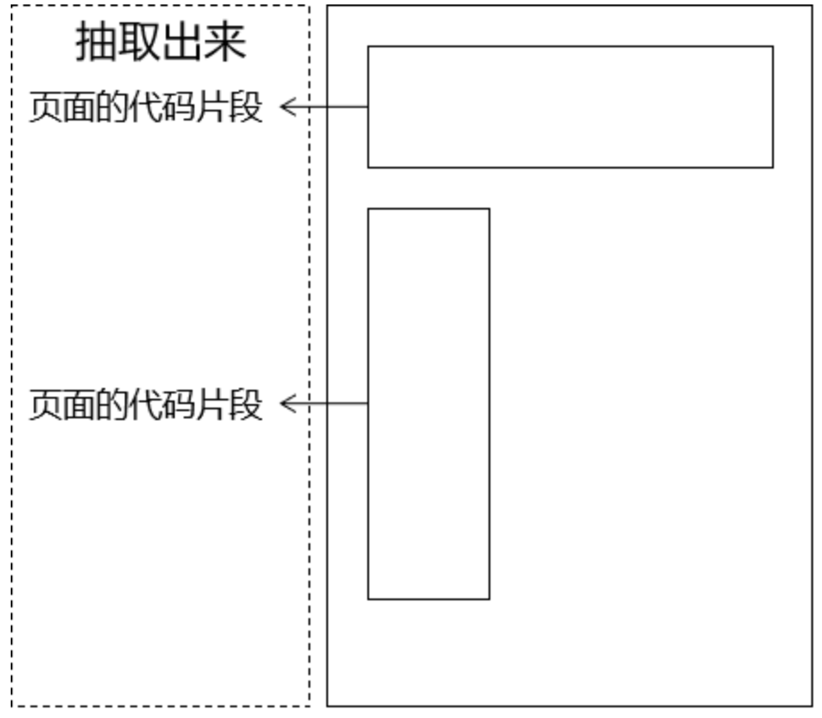

### 6.9.2 创建页面的代码片段

使用`th:fragment`来给这个片段命名：

```html
<div th:fragment="header">
    <p>被抽取出来的头部内容</p>
</div>
```

### 6.9.3 包含到有需要的页面

| 语法       | 效果                                                     |
| ---------- | -------------------------------------------------------- |
| th:insert  | 把目标的代码片段整个插入到当前标签内部                   |
| th:replace | 用目标的代码替换当前标签                                 |
| th:include | 把目标的代码片段去除最外层标签，然后再插入到当前标签内部 |

页面代码举例：

```html
<!-- 代码片段所在页面的逻辑视图 :: 代码片段的名称 -->
<div id="badBoy" th:insert="segment :: header">
    div标签的原始内容
</div>

<div id="worseBoy" th:replace="segment :: header">
    div标签的原始内容
</div>

<div id="worstBoy" th:include="segment :: header">
    div标签的原始内容
</div>
```

# 7 会话控制

## 7.1 数据存入会话域

### 7.1.1 保持登陆状态


保持用户登录状态，背后的底层逻辑是：服务器在接收到用户请求的时候，有办法判断这个请求来自于之前的某一个用户。所以保持登录状态，本质上是保持**『会话状态』**。

### 7.1.2 解决方法

使用HttpSession对象，将数据存入**会话域**就能保持会话状态。

```java
HttpSession session = request.getSession();
session.setAttribute("user", user);
```

## 7.2 Cookie的工作机制

### 7.2.1 HTTP协议和会话控制

HTTP协议本身是无状态的。单靠HTTP协议本身无法判断一个请求来自于哪一个浏览器，所以也就没法识别用户的身份状态。


### 7.2.2 Cookie介绍

#### 本质

- 在浏览器端临时存储数据；
- 键值对；
- 键和值都是字符串类型；
- 数据量很小；

#### Cookie在浏览器和服务器之间传递

**<u>没有Cookie的状态：</u>**

在服务器端没有创建Cookie并返回的情况下，浏览器端不会保存Cookie信息。双方在请求和响应的过程中也不会携带Cookie的数据。

**<u>创建Cookie对象并返回：</u>**

```java
// 1.创建Cookie对象
Cookie cookie = new Cookie("cookie-message", "hello-cookie");

// 2.将Cookie对象添加到响应中
response.addCookie(cookie);

// 3.返回响应
processTemplate("page-target", request, response);
```

**<u>浏览器拿到Cookie之后：</u>**

浏览器拿到Cookie之后，以后的每一个请求都会携带Cookie信息。

**<u>服务器读取Cookie信息：</u>**

```java
// 1.通过request对象获取Cookie的数组
Cookie[] cookies = request.getCookies();

// 2.遍历数组
for (Cookie cookie : cookies) {
    System.out.println("cookie.getName() = " + cookie.getName());
    System.out.println("cookie.getValue() = " + cookie.getValue());
    System.out.println();
}
```

#### Cookie的时效性

- 会话级Cookie
  - 服务器端并没有明确指定Cookie的存在时间；
  - 在浏览器端，Cookie数据存在于内存中；
  - 只要浏览器还开着，Cookie数据就一直都在；
  - 浏览器关闭，内存中的Cookie数据就会被释放；
- 持久化Cookie
  - 服务器端明确设置了Cookie的存在时间；
  - 在浏览器端，Cookie数据会被保存到硬盘上；
  - Cookie在硬盘上存在的时间根据服务器端限定的时间来管控，不受浏览器关闭的影响；
  - 持久化Cookie到达了预设的时间会被释放；

```java
// ※给Cookie设置过期时间
// 正数：Cookie的过期时间，以秒为单位
// 负数：表示这个Cookie是会话级的Cookie，浏览器关闭时释放
// 0：通知浏览器立即删除这个Cookie
cookie.setMaxAge(20);
```

#### Cookie的domain和path

上网时间长了，本地会保存很多Cookie。对浏览器来说，访问互联网资源时不能每次都把所有Cookie带上。浏览器会使用Cookie的domain和path属性值来和当前访问的地址进行比较，从而决定是否携带这个Cookie。

## 7.3 Session的工作机制

### 7.3.1 简介

前提：浏览器正常访问服务器

- 服务器端没调用`request.getSession()`方法：什么都不会发生；
- 服务器端调用了`request.getSession()`方法
  - 服务器端检查当前请求中是否携带了`JSESSIONID`的`Cookie`
    - 有：根据`JSESSIONID`在服务器端查找对应的`HttpSession`对象
      - 能找到：将找到的`HttpSession`对象作为`request.getSession()`方法的返回值返回
      - 找不到：服务器端新建一个`HttpSession`对象作为`request.getSession()`方法的返回值返回
    - 无：服务器端新建一个`HttpSession`对象作为`request.getSession()`方法的返回值返回

### 7.3.2 流程图表示

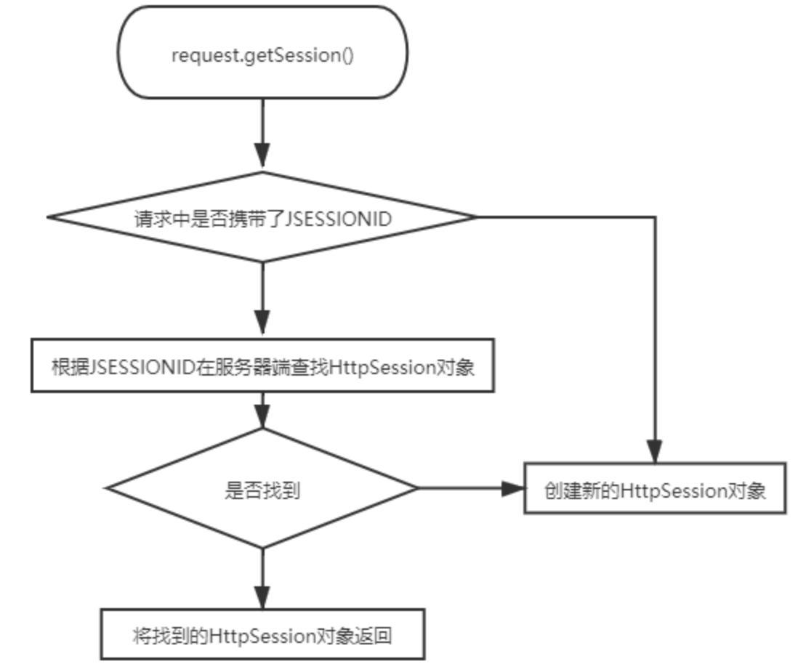

### 7.3.3 代码验证

```java
// 1.调用request对象的方法尝试获取HttpSession对象
HttpSession session = request.getSession();

// 2.调用HttpSession对象的isNew()方法
boolean wetherNew = session.isNew();

// 3.打印HttpSession对象是否为新对象
System.out.println("wetherNew = " + (wetherNew?"HttpSession对象是新的":"HttpSession对象是旧的"));

// 4.调用HttpSession对象的getId()方法
String id = session.getId();

// 5.打印JSESSIONID的值
System.out.println("JSESSIONID = " + id);
```

### 7.3.4 时效性

#### 设置原因

用户量很大之后，Session对象相应的也要创建很多。如果一味创建不释放，那么服务器端的内存迟早要被耗尽。

#### 设置难点

从服务器端的角度，很难精确得知类似浏览器关闭的动作。而且即使浏览器一直没有关闭，也不代表用户仍然在使用。

#### 设置最大闲置时间

- 默认值：`1800`秒；

最大闲置时间生效的机制如下：

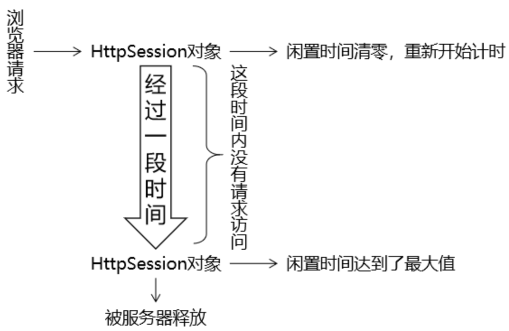

#### 代码验证

```java
// ※测试时效性
// 获取默认的最大闲置时间
int maxInactiveIntervalSecond = session.getMaxInactiveInterval();
System.out.println("maxInactiveIntervalSecond = " + maxInactiveIntervalSecond);

// 设置默认的最大闲置时间
session.setMaxInactiveInterval(15);
```

#### 强制失效

```java
session.invalidate();
```

# 8 过滤器

## 8.1 过滤器简介

### 8.1.1 登陆检查


### 8.1.2 过滤器三要素

#### 拦截

过滤器之所以能够对请求进行预处理，关键是对请求进行拦截，把请求拦截下来才能够做后续的操作。而且对于一个具体的过滤器，它必须明确它要拦截的请求，而不是所有请求都拦截。

#### 过滤

根据业务功能实际的需求，看看在把请求拦截到之后，需要做什么检查或什么操作，写对应的代码即可。

#### 放行

过滤器完成自己的任务或者是检测到当前请求符合过滤规则，那么可以将请求放行。所谓放行，就是让请求继续去访问它原本要访问的资源。

## 8.2 HelloWorld

### 8.2.1 思路

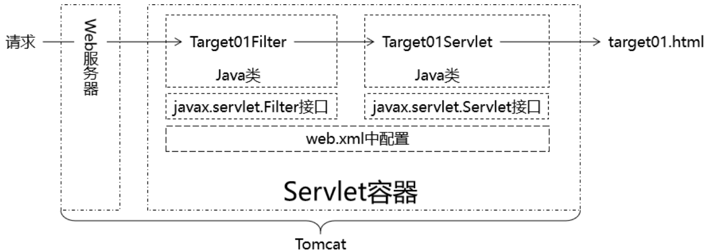

### 8.2.2 操作步骤

#### 准备工作

- 创建`module`；
- 加入`Thymeleaf`环境；
- 完成首页访问功能；
- 创建`Target01Servlet`以及`target01.html`；
- 创建`SpecialServlet`以及`special.html`；

**<u>创建TargetFilter类：</u>**

- 要点1：实现`javax.servlet.Filter`接口
- 要点2：在`doFilter()`方法中执行过滤
- 要点3：如果满足过滤条件使用 `chain.doFilter(request, response);`放行
- 要点4：如果不满足过滤条件转发或重定向请求
  - 附带问题：Thymeleaf模板渲染。这里我们选择的解决办法是跳转到一个Servlet，由Servlet负责执行模板渲染返回页面。

```java
public class Target01Filter implements Filter {
    @Override
    public void init(FilterConfig filterConfig) throws ServletException {

    }

    @Override
    public void doFilter(ServletRequest request, ServletResponse response, FilterChain chain) throws IOException, ServletException {

        // 1.打印一句话表明Filter执行了
        System.out.println("过滤器执行：Target01Filter");

        // 2.检查是否满足过滤条件
        // 人为设定一个过滤条件：请求参数message是否等于monster
        // 等于：放行
        // 不等于：将请求跳转到另外一个页面
        // ①获取请求参数
        String message = request.getParameter("message");

        // ②检查请求参数是否等于monster
        if ("monster".equals(message)) {

            // ③执行放行
            // FilterChain对象代表过滤器链
            // chain.doFilter(request, response)方法效果：将请求放行到下一个Filter，
            // 如果当前Filter已经是最后一个Filter了，那么就将请求放行到原本要访问的目标资源
            chain.doFilter(request, response);

        }else{

            // ④跳转页面
            request.getRequestDispatcher("/SpecialServlet?method=toSpecialPage").forward(request, response);

        }

    }

    @Override
    public void destroy() {

    }
}
```

**<u>配置TargetFilter类：</u>**

```xml
<!-- 配置Target01Filter -->
<filter>
    <!-- 配置Filter的名称 -->
    <filter-name>Target01Filter</filter-name>

    <!-- 配置Filter的全类名，便于Servlet容器创建Filter对象 -->
    <filter-class>com.atguigu.filter.filter.Target01Filter</filter-class>
</filter>

<!-- 配置Filter要拦截的目标资源 -->
<filter-mapping>
    <!-- 指定这个mapping对应的Filter名称 -->
    <filter-name>Target01Filter</filter-name>

    <!-- 通过请求地址模式来设置要拦截的资源 -->
    <url-pattern>/Target01Servlet</url-pattern>
</filter-mapping>
```

## 8.3 过滤器生命周期

和Servlet生命周期类比，Filter生命周期的关键区别是：**在Web应用启动时创建对象**

| 生命周期阶段 | 执行时机         | 执行次数 |
| ------------ | ---------------- | -------- |
| 创建对象     | Web应用启动时    | 一次     |
| 初始化       | 创建对象后       | 一次     |
| 拦截请求     | 接收到匹配的请求 | 多次     |
| 销毁         | Web应用卸载前    | 一次     |

## 8.4 过滤器匹配规则

### 8.4.1 精准匹配

指定被拦截资源的完整路径：

```xml
<!-- 配置Filter要拦截的目标资源 -->
<filter-mapping>
    <!-- 指定这个mapping对应的Filter名称 -->
    <filter-name>Target01Filter</filter-name>

    <!-- 通过请求地址模式来设置要拦截的资源 -->
    <url-pattern>/Target01Servlet</url-pattern>
</filter-mapping>
```

### 8.4.2 模糊匹配

相比较精确匹配，使用模糊匹配可以让我们创建一个Filter就能够覆盖很多目标资源，不必专门为每一个目标资源都创建Filter，提高开发效率。

#### 前杠后星

在我们配置了`url-pattern`为`/user/*`之后，请求地址只要是`/user`开头的那么就会被匹配。

```xml
<filter-mapping>
    <filter-name>Target02Filter</filter-name>

    <!-- 模糊匹配：前杠后星 -->
    <!--
        /user/Target02Servlet
        /user/Target03Servlet
        /user/Target04Servlet
    -->
    <url-pattern>/user/*</url-pattern>
</filter-mapping>
```

**极端情况：/\*匹配所有请求**

#### 前星后缀

```xml
<filter>
    <filter-name>Target04Filter</filter-name>
    <filter-class>com.atguigu.filter.filter.Target04Filter</filter-class>
</filter>
<filter-mapping>
    <filter-name>Target04Filter</filter-name>
    <url-pattern>*.png</url-pattern>
</filter-mapping>
```

### 8.4.3 匹配Servlet名称

```xml
<filter-mapping>
    <filter-name>Target05Filter</filter-name>

    <!-- 根据Servlet名称匹配 -->
    <servlet-name>Target01Servlet</servlet-name>
</filter-mapping>
```

## 8.5 过滤器链

### 8.5.1 概念

- 多个Filter的**拦截范围**如果存在**重合部分**，那么这些Filter会形成**Filter链**；
- 浏览器请求重合部分对应的目标资源时，会**依次经过**Filter链中的每一个Filter；
- Filter链中每一个Filter执行的**顺序是由web.xml中filter-mapping配置的顺序决定**的；

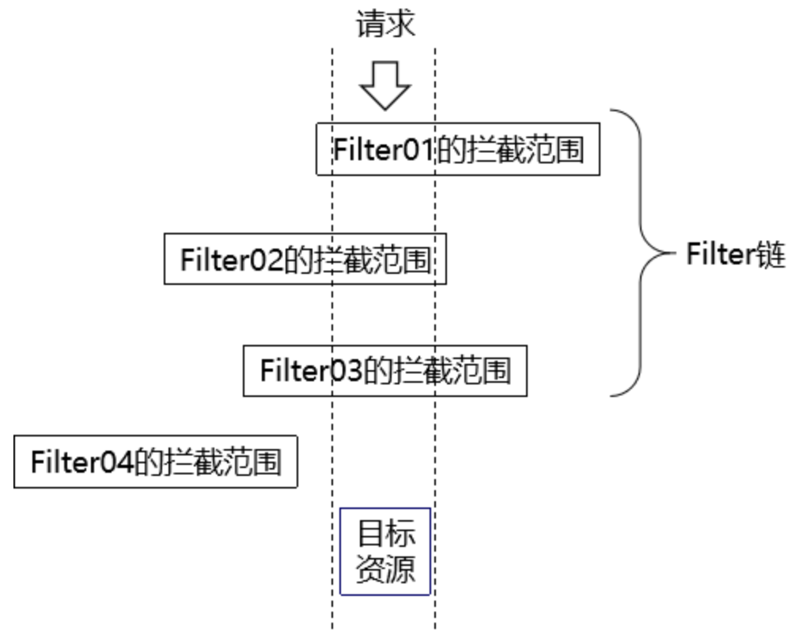

### 8.5.2 测试

```xml
<filter-mapping>
    <filter-name>TargetChain03Filter</filter-name>
    <url-pattern>/Target05Servlet</url-pattern>
</filter-mapping>
<filter-mapping>
    <filter-name>TargetChain02Filter</filter-name>
    <url-pattern>/Target05Servlet</url-pattern>
</filter-mapping>
<filter-mapping>
    <filter-name>TargetChain01Filter</filter-name>
    <url-pattern>/Target05Servlet</url-pattern>
</filter-mapping>
```

先执行TargetChain03Filter，然后执行TargetChain02Filter，最后执行TargetChain01Filter。

# 9 监听器

## 9.1 观察者模式

可见[Java设计模式](../Java入门/Java设计模式.md)中的观察者模式。

- 观察者：监控『被观察者』的行为，一旦发现『被观察者』触发了事件，就会调用事先准备好的方法执行操作；
- 被观察者：『被观察者』一旦触发了被监控的事件，就会被『观察者』发现；

## 9.2 监听器简介

### 9.2.1 概念

监听器：专门用于对其他对象身上发生的事件或状态改变进行监听和相应处理的对象，当被监视的对象发生情况时，立即采取相应的行动。 **Servlet监听器**：Servlet规范中定义的一种特殊类，它用于监听Web应用程序中的ServletContext，HttpSession 和HttpServletRequest等域对象的创建与销毁事件，以及监听这些域对象中的属性发生修改的事件。

### 9.2.2 分类


- 域对象监听器；
- 域对象的属性域监听器；
- Session域中数据的监听器；


### 9.2.3 监听器列表

#### `ServletContextListener`

作用：监听`ServletContext`对象的创建与销毁

| 方法名                                      | 作用                     |
| ------------------------------------------- | ------------------------ |
| contextInitialized(ServletContextEvent sce) | ServletContext创建时调用 |
| contextDestroyed(ServletContextEvent sce)   | ServletContext销毁时调用 |

`ServletContextEvent`对象代表从`ServletContext`对象身上捕获到的事件，通过这个事件对象我们可以获取到`ServletContext`对象。

#### `HttpSessionListener`

作用：监听`HttpSession`对象的创建与销毁

| 方法名                                 | 作用                      |
| -------------------------------------- | ------------------------- |
| sessionCreated(HttpSessionEvent hse)   | HttpSession对象创建时调用 |
| sessionDestroyed(HttpSessionEvent hse) | HttpSession对象销毁时调用 |

`HttpSessionEvent`对象代表从`HttpSession`对象身上捕获到的事件，通过这个事件对象我们可以获取到触发事件的`HttpSession`对象。

#### `ServletRequestListener`

作用：监听`ServletRequest`对象的创建与销毁

| 方法名                                      | 作用                         |
| ------------------------------------------- | ---------------------------- |
| requestInitialized(ServletRequestEvent sre) | ServletRequest对象创建时调用 |
| requestDestroyed(ServletRequestEvent sre)   | ServletRequest对象销毁时调用 |

`ServletRequestEvent`对象代表从`HttpServletRequest`对象身上捕获到的事件，通过这个事件对象我们可以获取到触发事件的`HttpServletRequest`对象。另外还有一个方法可以获取到当前Web应用的`ServletContext`对象。

#### `ServletContextAttributeListener`

作用：监听`ServletContext`中属性的创建、修改和销毁

| 方法名                                               | 作用                                 |
| ---------------------------------------------------- | ------------------------------------ |
| attributeAdded(ServletContextAttributeEvent scab)    | 向ServletContext中添加属性时调用     |
| attributeRemoved(ServletContextAttributeEvent scab)  | 从ServletContext中移除属性时调用     |
| attributeReplaced(ServletContextAttributeEvent scab) | 当ServletContext中的属性被修改时调用 |

`ServletContextAttributeEvent`对象代表属性变化事件，它包含的方法如下：

| 方法名              | 作用                     |
| ------------------- | ------------------------ |
| getName()           | 获取修改或添加的属性名   |
| getValue()          | 获取被修改或添加的属性值 |
| getServletContext() | 获取ServletContext对象   |

#### `HttpSessionAttributeListener`

作用：监听`ServletRequest`中属性的创建、修改和销毁

| 方法名                                               | 作用                                 |
| ---------------------------------------------------- | ------------------------------------ |
| attributeAdded(ServletRequestAttributeEvent srae)    | 向ServletRequest中添加属性时调用     |
| attributeRemoved(ServletRequestAttributeEvent srae)  | 从ServletRequest中移除属性时调用     |
| attributeReplaced(ServletRequestAttributeEvent srae) | 当ServletRequest中的属性被修改时调用 |

`ServletRequestAttributeEvent`对象代表属性变化事件，它包含的方法如下：

| 方法名               | 作用                             |
| -------------------- | -------------------------------- |
| getName()            | 获取修改或添加的属性名           |
| getValue()           | 获取被修改或添加的属性值         |
| getServletRequest () | 获取触发事件的ServletRequest对象 |

#### `HttpSessionBindingListener`

作用：监听某个对象在Session域中的创建与移除

| 方法名                                      | 作用                              |
| ------------------------------------------- | --------------------------------- |
| valueBound(HttpSessionBindingEvent event)   | 该类的实例被放到Session域中时调用 |
| valueUnbound(HttpSessionBindingEvent event) | 该类的实例从Session中移除时调用   |

`HttpSessionBindingEvent`对象代表属性变化事件，它包含的方法如下：

| 方法名       | 作用                          |
| ------------ | ----------------------------- |
| getName()    | 获取当前事件涉及的属性名      |
| getValue()   | 获取当前事件涉及的属性值      |
| getSession() | 获取触发事件的HttpSession对象 |

#### `HttpSessionActivationListener`

作用：监听某个对象在`Session`中的序列化与反序列化。

| 方法名                                    | 作用                                  |
| ----------------------------------------- | ------------------------------------- |
| sessionWillPassivate(HttpSessionEvent se) | 该类实例和Session一起钝化到硬盘时调用 |
| sessionDidActivate(HttpSessionEvent se)   | 该类实例和Session一起活化到内存时调用 |

`HttpSessionEvent`对象代表事件对象，通过`getSession()`方法获取事件涉及的`HttpSession`对象。

## 9.3 `ServletContextListener`

### 9.3.1 实用性

将来学习SpringMVC的时候，会用到一个`ContextLoaderListener`，这个监听器就实现了`ServletContextListener`接口，表示对`ServletContext`对象本身的生命周期进行监控。

### 9.3.2 具体用法

#### 创建监听器类

```java
public class AtguiguListener implements ServletContextListener {
    @Override
    public void contextInitialized(
            // Event对象代表本次事件，通过这个对象可以获取ServletContext对象本身
            ServletContextEvent sce) {
        System.out.println("Hello，我是ServletContext，我出生了！");

        ServletContext servletContext = sce.getServletContext();
        System.out.println("servletContext = " + servletContext);
    }

    @Override
    public void contextDestroyed(ServletContextEvent sce) {
        System.out.println("Hello，我是ServletContext，我打算去休息一会儿！");
    }
}
```

#### 注册监听器

```xml
<!-- 每一个listener标签对应一个监听器配置，若有多个监听器，则配置多个listener标签即可 -->
<listener>
    <!-- 配置监听器指定全类名即可 -->
    <listener-class>com.atguigu.listener.AtguiguListener</listener-class>
</listener>
```

# 10 Vue.js

## 10.1 Vue.js简介

### 10.1.1 框架

任何编程语言在最初的时候都是没有框架的，后来随着在实际开发过程中不断总结**『经验』**，积累**『最佳实践』**，慢慢的人们发现很多**『特定场景』**下的**『特定问题』**总是可以**『套用固定解决方案』**。

于是有人把成熟的**『固定解决方案』**收集起来，整合在一起，就成了**『框架』**。

在使用框架的过程中，我们往往只需要告诉框架**『做什么（声明）』**，而不需要关心框架**『怎么做（编程）』**。

对于Java程序来说，我们使用框架就是导入那些封装了**『固定解决方案』**的jar包，然后通过**『配置文件』**告诉框架做什么，就能够大大简化编码，提高开发效率。我们使用过的junit其实就是一款单元测试框架。

而对于JavaScript程序来说，我们使用框架就是导入那些封装了**『固定解决方案』**的**『js文件』**，然后在框架的基础上编码。

### 10.1.2 Vue.js

Vue (读音 /vjuː/，类似于**view**) 是一套用于构建用户界面的**渐进式框架**。与其它大型框架不同的是，Vue 被设计为可以自底向上逐层应用。Vue 的核心库只关注视图层，不仅易于上手，还便于与第三方库或既有项目整合。另一方面，当与[现代化的工具链](https://cn.vuejs.org/v2/guide/single-file-components.html)以及各种[支持类库](https://github.com/vuejs/awesome-vue#libraries--plugins)结合使用时，Vue 也完全能够为复杂的单页应用提供驱动。


## 10.2 Vue.js环境

### 10.2.1 开发中的最佳实践

『最佳实践』是实际开发中，针对特定问题提炼出来的最好的解决方案。把『最佳实践』抽取出来，封装到各自编程语言的程序包中，就是框架的基础。

- Java语言的程序包：jar包
- JavaScript语言的程序包：外部js文件

对于Java程序来说，框架=jar包+配置文件。对于Vue来说，导入**Vue的外部js文件**就能够使用Vue框架了。

### 10.2.2 创建Vue应用

#### 安装`Node.js`

网上有很多教程，直接在官网下载即可。

#### 项目创建

在自己的项目文件夹启动终端，或者`cd`到目标文件夹，然后运行以下命令：

```shell
> npm init vue@latest
```

这一指令将会安装并执行 [create-vue](https://github.com/vuejs/create-vue)，它是 Vue 官方的项目脚手架工具。你将会看到一些诸如 TypeScript 和测试支持之类的可选功能提示：

```shell
✔ Project name: … <your-project-name>
✔ Add TypeScript? … No / Yes
✔ Add JSX Support? … No / Yes
✔ Add Vue Router for Single Page Application development? … No / Yes
✔ Add Pinia for state management? … No / Yes
✔ Add Vitest for Unit testing? … No / Yes
✔ Add Cypress for both Unit and End-to-End testing? … No / Yes
✔ Add ESLint for code quality? … No / Yes
✔ Add Prettier for code formatting? … No / Yes

Scaffolding project in ./<your-project-name>...
Done.
```

如果不确定是否要开启某个功能，你可以直接按下回车键选择 `No`。在项目被创建后，通过以下步骤安装依赖并启动开发服务器：

```shell
> cd <your-project-name>
> npm install
> npm run dev
```

#### 通过CDN使用Vue

新手练习可以简单创建一个html文件，然后借助 script 标签直接通过 CDN 来使用 Vue：

```html
<script src="https://unpkg.com/vue@3/dist/vue.global.js"></script>
```

这里使用了 [unpkg](https://unpkg.com/)，但也可以使用任何提供 npm 包服务的 CDN，例如 [jsdelivr](https://www.jsdelivr.com/package/npm/vue) 或 [cdnjs](https://cdnjs.com/libraries/vue)。当然，你也可以下载此文件并自行提供服务。

通过 CDN 使用 Vue 时，不涉及“构建步骤”。这使得设置更加简单，并且可以用于增强静态的 HTML 或与后端框架集成。但是将无法使用单文件组件 (SFC) 语法。

## 10.3 声明式渲染

### 10.3.1 概念

#### 声明式

**『声明式』**是相对于**『编程式』**而言的。

- 声明式：告诉框架做什么，具体操作由框架完成；
- 编程式：自己编写代码完成具体操作；

#### 渲染

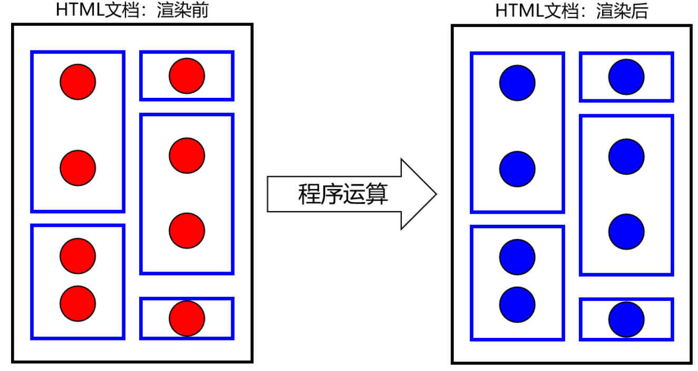

 上图含义解释：

- 蓝色方框：HTML标签；
- 红色圆形：动态、尚未确定的数据；
- 蓝色圆形：经过程序运算以后，计算得到的具体的，可以直接在页面上显示的数据；
- 渲染：程序计算动态数据得到具体数据的过程；

### 10.3.2 HelloVue

```html
<!DOCTYPE html>
<html lang="en">
<head>
    <meta charset="UTF-8">
    <title>Vue3 Test</title>
</head>
<body>
<!-- 使用{{}}格式，指定要被渲染的数据 -->
<script src="https://unpkg.com/vue@3/dist/vue.global.js"></script>
    
<div id="app">{{ message }}</div>
    
<script>
    const { createApp } = Vue
    createApp({
        data() {
            return {
                message: 'Hello Vue!'
            }
        }
    }).mount('#app')
</script>
</body>
</html>
```

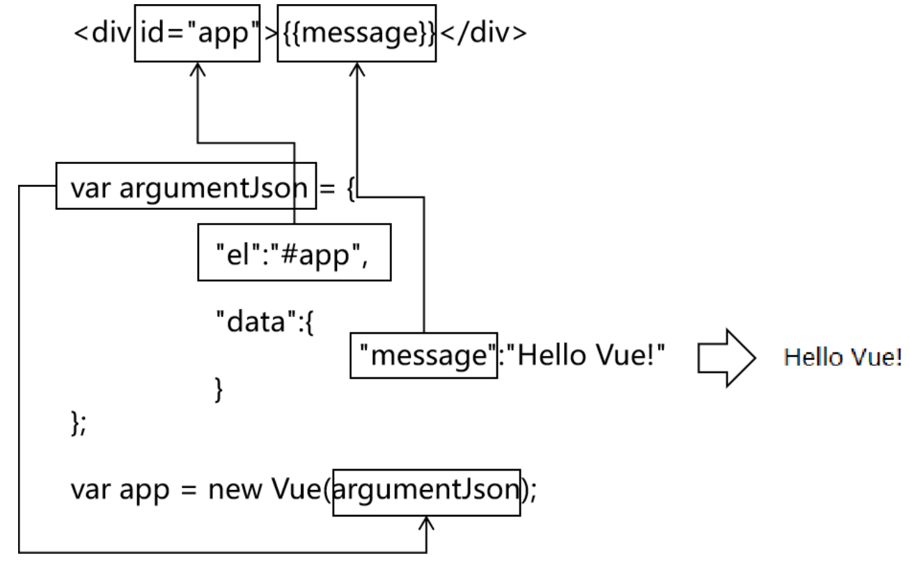

## 10.4 绑定元素属性

### 10.4.1 基本语法

`v-bind:HTML标签的原始属性名`。

### 10.4.2 测试

```html
<!DOCTYPE html>
<html lang="en">
<head>
    <meta charset="UTF-8">
    <title>Vue3 Test2</title>
</head>
<body>
<!-- 使用{{}}格式，指定要被渲染的数据 -->
<script src="https://unpkg.com/vue@3/dist/vue.global.js"></script>

<div id="app">
  <!-- v-bind:value表示将value属性交给Vue来进行管理，也就是绑定到Vue对象 -->
  <!-- vueValue是一个用来渲染属性值的表达式，相当于标签体中加{{}}的表达式 -->
  <input type="text" v-bind:value="vueValue" />

  <!-- 同样的表达式，在标签体内通过{{}}告诉Vue这里需要渲染； -->
  <!-- 在HTML标签的属性中，通过v-bind:属性名="表达式"的方式告诉Vue这里要渲染 -->
  <p>{{vueValue}}</p>
</div>

<script>
  const { createApp } = Vue
  const app = createApp({
    data(){
      return {
        vueValue: "太阳当空照"
      }
    }
  })
  app.mount("#app")
</script>
</body>
</html>
```

## 10.5 双向数据绑定

### 10.5.1 问题


而使用了双向绑定后，就可以实现：页面上数据被修改后，Vue对象中的数据属性也跟着被修改。

### 10.5.2 测试

```html
<!DOCTYPE html>
<html lang="en">
<head>
    <meta charset="UTF-8">
    <title>Vue3 Test3</title>
</head>
<body>
<!-- 使用{{}}格式，指定要被渲染的数据 -->
<script src="https://unpkg.com/vue@3/dist/vue.global.js"></script>
<h1>双向数据绑定</h1>
<div id="app">
  <!-- v-bind:属性名 效果是从Vue对象渲染到页面 -->
  <!-- v-model:属性名 效果不仅是从Vue对象渲染到页面，而且能够在页面上数据修改后反向修改Vue对象中的数据属性 -->
  <input type="text" v-model="vueValue"/>

  <p>{{vueValue}}</p>
</div>

<script>
  const {createApp} = Vue
  const app = createApp({
    data() {
      return {
        vueValue: "太阳当空照"
      }
    }
  })
  app.mount("#app")
</script>
</body>
</html>
```

`p`标签内的数据能够和文本框中的数据实现同步修改：

### 10.5.3 去除前后空格

#### `.trim`修饰符

实际开发中，要考虑到用户在输入数据时，有可能会包含前后空格。而这些前后的空格对我们程序运行来说都是干扰因素，要去掉。在v-model后面加上.trim修饰符即可实现。

```html
<input type="text" v-model.trim="vueValue" />
```

## 10.6 条件渲染

### 10.6.1 `v-if`与`v-else`

```html
<!DOCTYPE html>
<html lang="en">
<head>
    <meta charset="UTF-8">
    <title>Vue3 Test4</title>
</head>
<body>
<script src="https://unpkg.com/vue@3/dist/vue.global.js"></script>
    
<div id = "app">
    <button @click="awesome = !awesome">Toggle</button>
    <h1 v-if="awesome">Vue is awesome!</h1>
    <h1 v-else>Oh no 😢</h1>
</div>

<script>
    const {createApp} = Vue;
    const app = createApp({
        data(){
            return {
                awesome: true
            }
        }
    });
    app.mount("#app");
</script>
</body>
</html>
```

### 10.6.2 `v-show`

另一个可以用来按条件显示一个元素的指令是 `v-show`。其用法基本一样：

```html
<h1 v-show="ok">Hello!</h1>
```

不同之处在于 `v-show` 会在 DOM 渲染中保留该元素；`v-show` 仅切换了该元素上名为 `display` 的 CSS 属性。

`v-show` 不支持在 `<template>` 元素上使用，也不能和 `v-else` 搭配使用。


## 10.7 列表渲染

### 10.7.1 迭代数组

```html
<!DOCTYPE html>
<html lang="en">
<head>
    <meta charset="UTF-8">
    <title>Vue3 Test5</title>
</head>
<body>
<script src="https://unpkg.com/vue@3/dist/vue.global.js"></script>
<div id="app1">
  <li v-for="fruit in fruitList">{{fruit}}</li>
</div>
<script>
  const {createApp} = Vue;
  const app1 = createApp({
    data(){
      return {
        fruitList:[
                "apple",
                "banana",
                "orange",
                "grape"
        ]
      }
    }
  });
  app1.mount("#app1")
</script>
</body>
</html>
```

### 10.7.2 迭代对象列表

```html
<!DOCTYPE html>
<html lang="en">
<head>
    <meta charset="UTF-8">
    <title>Vue3 Test5</title>
</head>
<body>
<script src="https://unpkg.com/vue@3/dist/vue.global.js"></script>
<h1>渲染数组</h1>
<div id="app1">
  <li v-for="fruit in fruitList">{{fruit}}</li>
</div>
<h1>渲染对象列表</h1>
<div id="app2">
  <table>
    <tr>
      <th>编号</th>
      <th>姓名</th>
      <th>年龄</th>
      <th>专业</th>
    </tr>
    <tr v-for="employee in employeeList">
      <td>{{employee.empId}}</td>
      <td>{{employee.empName}}</td>
      <td>{{employee.empAge}}</td>
      <td>{{employee.empSubject}}</td>
    </tr>
  </table>
</div>
<script>
  const {createApp} = Vue;
  const app1 = createApp({
    data(){
      return {
        fruitList:[
                "apple",
                "banana",
                "orange",
                "grape"
        ]
      }
    }
  });
  app1.mount("#app1");

  const app2 = createApp({
    data(){
      return {
        "employeeList":[
          {
            "empId":11,
            "empName":"tom",
            "empAge":111,
            "empSubject":"java"
          },
          {
            "empId":22,
            "empName":"jerry",
            "empAge":222,
            "empSubject":"php"
          },
          {
            "empId":33,
            "empName":"bob",
            "empAge":333,
            "empSubject":"python"
          }
        ]
      }
    }
  });
  app2.mount("#app2")
</script>
</body>
</html>
```

## 10.8 事件驱动

### 10.8.1 字符串反转

```html
<!DOCTYPE html>
<html lang="en">
<head>
    <meta charset="UTF-8">
    <title>Vue3 Test6</title>
</head>
<body>
<script src="https://unpkg.com/vue@3/dist/vue.global.js"></script>
<div id="app">
  <p>{{message}}</p>

  <!-- v-on:事件类型="事件响应函数的函数名" -->
  <button v-on:click="reverseMessage">Click me,reverse message</button>
</div>
<script>
  const {createApp} = Vue;
  const app = createApp({
    data(){
      return {
        message: "Hello Vue!"
      }
    },
    methods:{
      reverseMessage(){
        this.message = this.message.split("").reverse().join("");
      }
    }
  });
  app.mount("#app");
</script>
</body>
</html>
```

### 10.8.2 获取鼠标位置信息

```html
<!DOCTYPE html>
<html lang="en">
<head>
    <meta charset="UTF-8">
    <title>Vue3 Test7</title>
</head>
<body>
<script src="https://unpkg.com/vue@3/dist/vue.global.js"></script>
<div id="app">
  <div id="area"
       v-on:mousemove="recordPosition"
       style="border: 1px solid black;width: 500px;height: 500px;">

  </div>
  <p id="showPosition">{{position}}</p>
</div>

<script>
  const {createApp} = Vue;
  const app = createApp({
    data(){
      return{
        position: "暂时没有获取鼠标位置信息"
      }
    },
    methods:{
      recordPosition(event){
        this.position = event.clientX + ", " + event.clientY;
      }
    }
  });
  app.mount("#app")
</script>
</body>
</html>
```

## 10.9 监听属性

### 10.9.1 需求

```html
<div id="app">
	<p>尊姓：{{firstName}}</p>
	<p>大名：{{lastName}}</p>
	尊姓：<input type="text" v-model="firstName" /><br/>
	大名：<input type="text" v-model="lastName" /><br/>
	<p>全名：{{fullName}}</p>
</div>
```

在上面代码的基础上，我们希望firstName或lastName属性发生变化时，修改fullName属性。此时需要对firstName或lastName属性进行**『侦听』**。

具体来说，所谓**『侦听』**就是对message属性进行监控，当firstName或lastName属性的值发生变化时，调用我们准备好的函数。

### 10.9.2 测试

```html
<!DOCTYPE html>
<html lang="en">
<head>
    <meta charset="UTF-8">
    <title>Vue3 Test9</title>
</head>
<body>
<script src="https://unpkg.com/vue@3/dist/vue.global.js"></script>
<div id="app">
  <p>尊姓：{{firstName}}</p>
  <p>大名：{{lastName}}</p>
  <label>
  尊姓：<input type="text" v-model="firstName" /><br/>
  大名：<input type="text" v-model="lastName" /><br/>
  </label>
  <p>全名：{{fullName}}</p>
</div>
<script>
    const {createApp} = Vue;
    const app = createApp({
        data(){
            return{
                firstName:"jim",
                lastName:"green",
                fullName:"jim green"
            }
        },
        watch:{
            firstName: function (inputValue){
                this.fullName = inputValue + " " + this.lastName;
            },
            lastName: function (inputValue){
                this.fullName = this.firstName + " " + inputValue;
            }
        }
    });
    app.mount("#app");
</script>
</body>
</html>
```

# 12 Axios Ajax

## 12.1 Ajax概述

### 12.1.1 服务器端渲染


### 12.1.2 Ajax渲染（局部更新）


### 12.1.3 前后端分离

彻底舍弃服务器端渲染，数据全部通过Ajax方式以JSON格式来传递。

### 12.1.4 同步与异步

Ajax本身就是Asynchronous JavaScript And XML的缩写，直译为：异步的JavaScript和XML。在实际应用中Ajax指的是：**不刷新浏览器窗口**，**不做页面跳转**，**局部更新页面内容**的技术。

**『同步』**和**『异步』**是一对相对的概念，那么什么是同步，什么是异步呢？

#### 同步

多个操作**按顺序执行**，前面的操作没有完成，后面的操作就必须**等待**。所以同步操作通常是**串行**的。


#### 异步

多个操作相继开始**并发执行**，即使开始的先后顺序不同，但是由于它们各自是**在自己独立的进程或线程中**完成，所以**互不干扰**，**谁也*不用等*谁**。


### 12.1.5 Axios简介

使用原生的JavaScript程序执行Ajax极其繁琐，所以一定要使用框架来完成。而Axios就是目前最流行的前端Ajax框架。

使用Axios和使用Vue一样，导入对应的*.js文件即可。官方提供的script标签引入方式为：

```html
<script src="https://unpkg.com/axios/dist/axios.min.js"></script>
```

我们可以把这个axios.min.js文件下载下来保存到本地来使用。

## 12.2 Axios基本用法

### 12.2.1 测试

#### 前端代码

```html
<html>
  <head>
    <title>Axios Test</title>
  </head>
  <body>
  <script src="https://unpkg.com/vue@3/dist/vue.global.js"></script>
  <script src="https://unpkg.com/axios/dist/axios.min.js"></script>

  <div id="app">
    <button @click="commonParam">普通请求参数</button>
  </div>

  <script>
    const { createApp } = Vue
    const app = createApp({
      data(){},
      methods:{
        commonParam:function (){
          axios({
            method:"post",
            url:"/pro4_axios/AjaxServlet?method=commonParam",
            data: {
              userName: "tom",
              userPwd: "123456"
            }
          }).then(function (response){
            console.log(response);
          }).catch(function (error){
            console.log(error);
          });
        }
      }
    });
    app.mount("#app");
  </script>
  </body>
</html>
```

#### 后端代码

```java
public class AjaxServlet extends ModelBaseServlet {
    protected void commonParam(HttpServletRequest request, HttpServletResponse response) throws IOException {
        String userName = request.getParameter("userName");
        String userPwd = request.getParameter("userPwd");

        System.out.println("userName = " + userName);
        System.out.println("userPwd = " + userPwd);

        response.setContentType("text/html;charset=UTF-8");
        response.getWriter().write("服务器返回普通文本字符串");
    }
}
```

#### axios程序接收到的响应对象结构

| 属性名     | 作用                                             |
| ---------- | ------------------------------------------------ |
| config     | 调用axios(config对象)方法时传入的JSON对象        |
| data       | 服务器端返回的响应体数据                         |
| headers    | 响应消息头                                       |
| request    | 原生JavaScript执行Ajax操作时使用的XMLHttpRequest |
| status     | 响应状态码                                       |
| statusText | 响应状态码的说明文本                             |

#### 服务器端处理请求失败后

```js
catch(function (error) {     // catch()服务器端处理请求出错后，会调用
    console.log(error);         // error就是出错时服务器端返回的响应数据
    console.log(error.response);        // 在服务器端处理请求失败后，获取axios封装的JSON格式的响应数据对象
    console.log(error.response.status); // 在服务器端处理请求失败后，获取响应状态码
    console.log(error.response.statusText); // 在服务器端处理请求失败后，获取响应状态说明文本
    console.log(error.response.data);   // 在服务器端处理请求失败后，获取响应体数据
});
```

response对象的结构还是和then()函数传入的回调函数中的response是一样的：

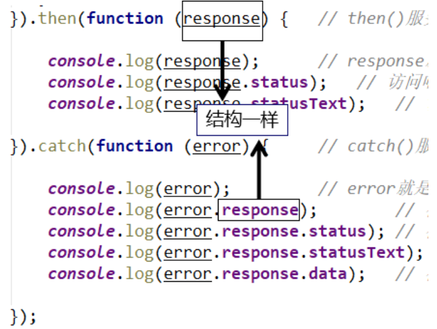

回调函数：开发人员声明，但是调用时交给系统来调用。像单击响应函数、then()、catch()里面传入的都是回调函数。回调函数是相对于普通函数来说的，普通函数就是开发人员自己声明，自己调用。

### 12.2.2 发送请求体JSON

#### 后端代码

Gson是Google研发的一款非常优秀的**JSON数据解析和生成工具**，它可以帮助我们将数据在JSON字符串和Java对象之间互相转换。

```java
protected void requestBodyJSON(HttpServletRequest request, HttpServletResponse response) throws ServletException, IOException {

    // 1.由于请求体数据有可能很大，所以Servlet标准在设计API的时候要求我们通过输入流来读取
    BufferedReader reader = request.getReader();

    // 2.创建StringBuilder对象来累加存储从请求体中读取到的每一行
    StringBuilder builder = new StringBuilder();

    // 3.声明临时变量
    String bufferStr = null;

    // 4.循环读取
    while((bufferStr = reader.readLine()) != null) {
        builder.append(bufferStr);
    }

    // 5.关闭流
    reader.close();

    // 6.累加的结果就是整个请求体
    String requestBody = builder.toString();

    // 7.创建Gson对象用于解析JSON字符串
    Gson gson = new Gson();

    // 8.将JSON字符串还原为Java对象
    Student student = gson.fromJson(requestBody, Student.class);
    System.out.println("student = " + student);

    System.out.println("requestBody = " + requestBody);

    response.setContentType("text/html;charset=UTF-8");
    response.getWriter().write("服务器端返回普通文本字符串作为响应");
}
```

### 12.2.3 服务器端返回JSON数据

```java
protected void responseBodyJSON(HttpServletRequest request, HttpServletResponse response) throws ServletException, IOException {

    // 1.准备数据对象
    Student student = new Student();
    student.setStuId(10);
    student.setStuName("tom");
    student.setSchool(new School(11,"atguigu"));
    student.setSubjectList(Arrays.asList(new Subject("java", 95.5), new Subject("php", 93.3)));

    Map<String, Teacher> teacherMap = new HashMap<>();
    teacherMap.put("t1", new Teacher("lili", 25));
    teacherMap.put("t2", new Teacher("mary", 26));
    teacherMap.put("t3", new Teacher("katty", 27));

    student.setTeacherMap(teacherMap);

    // 2.创建Gson对象
    Gson gson = new Gson();

    // 3.将Java对象转换为JSON对象
    String json = gson.toJson(student);
    
    // 4.设置响应体的内容类型
    response.setContentType("application/json;charset=UTF-8");
    response.getWriter().write(json);
}
```

