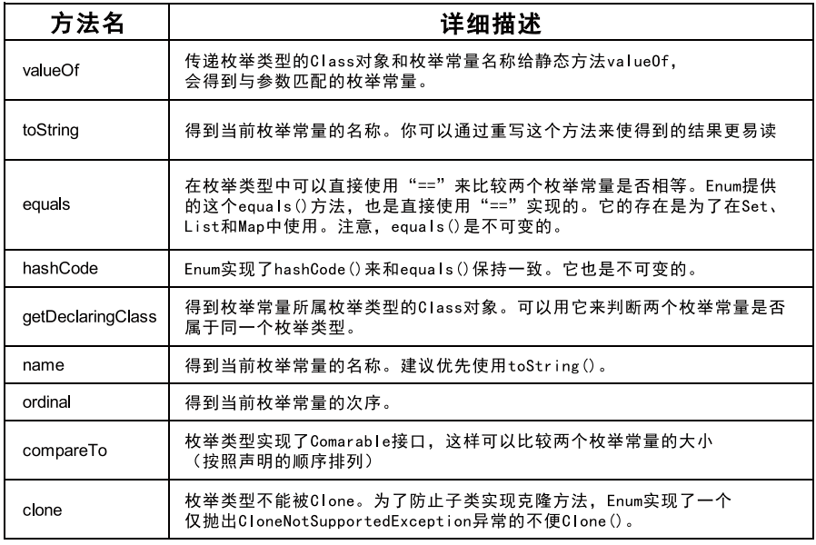

# 十 枚举类与注解


## 10.1 枚举类的使用


### 10.1.1 枚举类的理解

- 类的对象只有有限个，确定的。举例如下：
  - 星期：Monday( 星期一 )、…、Sunday( 星期天 )。
  - 性别：Man( 男 )、Woman( 女 )。
  - 季节：Spring( 春节 )…Winter( 冬天 )。
  - 支付方式：Cash（现金）、WeChatPay（微信）、Alipay( 支付宝 )、BankCard( 银行卡 )、CreditCard( 信用卡 )。
  - 就职状态：Busy、Free、Vocation、Dimission。
  - 订单状态：Nonpayment（未付款）、Paid（已付款）、Delivered（已发货）、Return（退货）、Checked（已确认）Fulfilled（已配货）。
  - 线程状态：创建、就绪、运行、阻塞、死亡。
- 当需要定义一组常量时，强烈建议使用枚举类。
- 枚举类的实现：
  - JDK1.5 之前需要自定义枚举类。
  - JDK1.5 新增的 enum 关键字用于定义枚举类。
- 若枚举只有一个对象，则可以作为一种单例模式的实现方式。  


### 10.1.2 自定义枚举类

枚举类的属性

- 枚举类对象的属性不应允许被改动 , 所以应该使用 private final 修饰。
- 枚举类的使用 private final 修饰的属性应该在构造器中为其赋值。
- 若枚举类显式的定义了带参数的构造器 , 则在列出枚举值时也必须对应的传入参数。

枚举类的使用

1. 枚举类的理解：类的对象只有有限个，确定的。我们称此类为枚举类。
2. 当需要定义一组常量时，强烈建议使用枚举类。
3. 若枚举只有一个对象 , 则可以作为一种单例模式的实现方式。  

```java
public class SeasonTest {
    public static void main(String[] args) {
        Season spring = Season.SPRING;
        System.out.println(spring);
    }
}

// 自定义枚举类
class Season {
    // 1. 声明 Season 对象的属性 :private final 修饰
    private final String seasonName;
    private final String seasonDesc;

    // 2. 私有化类的构造器 , 并给对象属性赋值
    private Season(String seasonName, String seasonDesc) {
        this.seasonName = seasonName;
        this.seasonDesc = seasonDesc;
    }

    // 3. 提供当前枚举类的多个对象
    public static final Season SPRING = new Season(" 春天 ", " 万物复苏 ");
    public static final Season SUMMER = new Season(" 夏天 ", " 烈日炎炎 ");
    public static final Season AUTUMN = new Season(" 秋天 ", " 金秋送爽 ");
    public static final Season WINTER = new Season(" 冬天 ", " 白雪皑皑 ");

    // 4. 其他诉求：获取枚举类对象的属性
    public String getSeasonName() {
        return seasonName;
    }

    public String getSeasonDesc() {
        return seasonDesc;
    }

    // 4. 其他诉求 1：提供 toString()
    @Override
    public String toString() {
        return "Season{" + "seasonName='" + seasonName + '\'' + ", seasonDesc='" + seasonDesc + '\'' + '}';
    }
}
```


### 10.1.3 使用enum关键字定义枚举类

使用说明：

- 使用 enum 定义的枚举类默认继承了 `java.lang.Enum` 类，因此不能再继承其他类。
- 枚举类的构造器**<u>只能使用</u>** private 权限修饰符。
- 枚举类的所有实例必须在枚举类中显式列出 (`,` 分隔 `;` 结尾 )。列出的实例系统会**<u>自动添加</u>** public static final 修饰。
- 必须在枚举类的第一行声明枚举类对象。

**JDK 1.5 中可以在 `switch 表达式`中使用 Enum 定义的枚举类的对象作为表达式 , case 子句可以直接使用枚举值的名字 , 无需添加枚举类作为限定。**

```java
public class SeasonTest1 {
    public static void main(String[] args) {
        Season1 summer = Season1.SUMMER;
        // toString():
        System.out.println(summer.toString());
        System.out.println(Season1.class.getSuperclass());
    }
}

// 使用 enum 关键字枚举类
enum Season1 {
    // 1. 提供当前枚举类的对象，多个对象之间用 "," 隔开，末尾对象 ";"结束
    SPRING(" 春 天 ", " 万 物 复 苏 "),
    SUMMER(" 夏 天 ", " 烈 日 炎 炎 "),
    AUTUMN(" 秋天 ", " 金秋送爽 "),
    WINTER(" 冬天 ", " 白雪皑皑 ");
    // 2. 声明 Season 对象的属性 :private final 修饰
    private final String seasonName;
    private final String seasonDesc;

    // 3. 私有化类的构造器 , 并给对象属性赋值
    private Season1(String seasonName, String seasonDesc) {
        this.seasonName = seasonName;
        this.seasonDesc = seasonDesc;
    }

    // 4. 其他诉求：获取枚举类对象的属性
    public String getSeasonName() {
        return seasonName;
    }

    public String getSeasonDesc() {
        return seasonDesc;
    }
    // 4. 其他诉求 1：提供 toString()
    // @Override
    // public String toString() {
    // return "Season{" + "seasonName='" + seasonName + '\'' +", seasonDesc='" + seasonDesc + '\'' + '}';
    // }
}
```


### 10.1.4 Enum类中的常用方法



- Enum类的主要方法：
  - `values()` 方法：返回枚举类型的对象数组。该方法可以很方便地遍历所有的枚举值。
  - `valueOf(String str)`：可以把一个字符串转为对应的枚举类对象。要求字符串必须是枚举类对象的“名字”。如不是，会有运行时异常：IllegalArgumentException。
  - `toString()`：返回当前枚举类对象常量的名称  

```java
public class SeasonTest1 {
    public static void main(String[] args) {
        Season1 summer = Season1.SUMMER;
        // toString():
        System.out.println(summer.toString());
        System.out.println(Season1.class.getSuperclass());
        System.out.println("**************************");
        // values(): 返回所有的枚举类对象构成的数组
        Season1[] values = Season1.values();
        for (Season1 value : values) {
            System.out.println(value);
        }
        System.out.println("****************************");
        Thread.State[] values1 = Thread.State.values();
        for (Thread.State state : values1) {
            System.out.println(state);
        }
        // valueOf(String objName): 返回枚举类中对象名是 objName的对象。
        Season1 winter = Season1.valueOf("WINTER");
        // 如果没有 objName 的枚举类对象，则抛异常：IllegalArgumentException
        // Season1 winter = Season1.valueOf("WINTER1");
        System.out.println(winter);
    }
}

// 使用 enum 关键字枚举类
enum Season1 {
    // 1. 提供当前枚举类的对象，多个对象之间用 "," 隔开，末尾对象 ";"结束
    SPRING(" 春 天 ", " 万 物 复 苏 "),
    SUMMER(" 夏 天 ", " 烈 日 炎 炎 "),
    AUTUMN(" 秋天 ", " 金秋送爽 "),
    WINTER(" 冬天 ", " 白雪皑皑 ");
    // 2. 声明 Season 对象的属性 :private final 修饰
    private final String seasonName;
    private final String seasonDesc;

    // 3. 私有化类的构造器 , 并给对象属性赋值
    private Season1(String seasonName, String seasonDesc) {
        this.seasonName = seasonName;
        this.seasonDesc = seasonDesc;
    }

    // 4. 其他诉求：获取枚举类对象的属性
    public String getSeasonName() {
        return seasonName;
    }

    public String getSeasonDesc() {
        return seasonDesc;
    }
    // 4. 其他诉求 1：提供 toString()
    // @Override
    // public String toString() {
    // return "Season{" + "seasonName='" + seasonName + '\'' +", seasonDesc='" + seasonDesc + '\'' + '}';
    // }
}
```


## 10.2 注解(Annotation)


### 10.2.1 注解的概述

从 JDK 5.0 开始， Java 增加了对元数据 (`MetaData`) 的支持，也就是Annotation( 注解 )。

Annotation 其实就是代码里的特殊标记，这些标记可以在**编译，类加载，运行时**被读取，并执行相应的处理。通过使用 Annotation，程序员可以在不改变原有逻辑的情况下，在源文件中嵌入一些补充信息。代码分析工具、开发工具和部署工具可以通过这些补充信息进行验证或者进行部署。

Annotation 可以像修饰符一样被使用，可用于修饰包、类、构造器、方法、成员变量、参数、局部变量的声明，这些信息被保存在 Annotation 的`“name=value”` 对中。

在 JavaSE 中，注解的使用目的比较简单，例如标记过时的功能，忽略警告等。在 JavaEE/Android 中注解占据了更重要的角色，例如用来**<u>配置应用程序的任何切面</u>**，代替 JavaEE 旧版中所遗留的繁冗代码和 XML 配置等。

未来的开发模式都是基于注解的，JPA 是基于注解的，Spring2.5 以上都是基于注解的，Hibernate3.x 以后也是基于注解的，现在的 Struts2 有一部分也是基于注解的了，注解是一种趋势，一定程度上可以说：==框架 = 注解 +反射 + 设计模式==。  


### 10.2.2 Annotation的使用示例

使用 Annotation 时要在其前面增加 @ 符号 , 并把该 Annotation 当成一个修饰符使用。用于修饰它支持的程序元素

- 示例一：生成文档相关的注解
  - @author 标明开发该类模块的作者，多个作者之间使用 `,` 分割；
  - @version 标明该类模块的版本；
  - @see 参考转向，也就是相关主题；
  - @since 从哪个版本开始增加的；
  - @param 对方法中某参数的说明，如果没有参数就不能写；
  - @return 对方法返回值的说明，如果方法的返回值类型是 void 就不能写；
  - @exception 对方法可能抛出的异常进行说明，如果方法没有用 throws显式抛出的异常就不能写其中；
  - @param @return 和 @exception 这三个标记都是只用于方法的；
  - @param 的格式要求：@param 形参名形参类型形参说明；
  - @return 的格式要求：@return 返回值类型返回值说明；
  - @exception 的格式要求：@exception 异常类型异常说明；
  - @param 和 @exception 可以并列多个。
- 示例二：在编译时进行格式检查 (JDK 内置的三个基本注解 )
  - @Override：限定重写父类方法 , 该注解只能用于方法，
  - @Deprecated：用于表示所修饰的元素 ( 类，方法等 ) 已过时。通常是因为所修饰的结构危险或存在更好的选择；
  - @SuppressWarnings：抑制编译器警告。
- 示例三：跟踪代码依赖性，实现替代配置文件功能
  - Servlet3.0 提供了注解 (annotation)，使得不再需要在 web.xml 文件中进行 Servlet 的部署；
  - spring 框架中关于“事务”的管理。  

```java
import java.util.ArrayList;
import java.util.Date;

public class AnnotationTest {
    public static void main(String[] args) {
        Person p = new Student();
        p.walk();
        Date date = new Date(2020, 10, 11);
        System.out.println(date);
        @SuppressWarnings("unused")
        int num = 10;
        // System.out.println(num);
        @SuppressWarnings({"unused", "rawtypes"})
        ArrayList list = new ArrayList();
    }
}

class Person {
    private String name;
    private int age;

    public Person() {
        super();
    }

    public Person(String name, int age) {
        this.name = name;
        this.age = age;
    }

    public void walk() {
        System.out.println(" 学习中……");
    }

    public void eat() {
        System.out.println(" 摸鱼中……");
    }
}

interface Info {
    void show();
}

class Student extends Person implements Info {
    @Override
    public void walk() {
        System.out.println(" 喷子走开 ");
    }

    @Override
    public void show() {
    }
}
```


### 10.2.3 如何自定义注解

- 定义新的 Annotation 类型使用 **`@interface`** 关键字。

- 自定义注解自动继承了 **java.lang.annotation.Annotation** 接口。

- Annotation 的成员变量在 Annotation 定义中以无参数方法的形式来声明。其方法名和返回值定义了该成员的名字和类型。我们称为配置参数。类型只能是八种基本数据类型、String 类型、Class 类型、enum 类型、Annotation 类型、以上所有类型的数组。

- 可以在定义 Annotation 的成员变量时为其指定初始值，指定成员变量的初始值可使用 **default** 关键字。

- 如果只有一个参数成员，建议使用参数名为 value。

- 如果定义的注解含有配置参数，那么使用时必须指定参数值，除非它有默认值。格式是“参数名 = 参数值”，如果只有一个参数成员，且名称为 value，可以省略“value=”。

- 没有成员定义的 Annotation 称为标记；包含成员变量的 Annotation称为元数据 Annotation。

  **<u>注意：自定义注解必须配上注解的信息处理流程才有意义。</u>**


### 10.2.4 jdk中4个基本的元注解的使用

JDK 的元 Annotation 用于修饰其他 Annotation 定义。

JDK5.0 提供了 4 个标准的meta-annotation类型，分别是：

- Retention
- Target
- Documented
- Inherited  

Retention: 指定所修饰的 Annotation 的生命周期：`SOURCE\CLASS`（默认行为）\`RUNTIME` 只有声明为 RUNTIME 生命周期的注解，才能通过反射获取。

Target: 用于指定被修饰的 Annotation 能用于修饰哪些程序元素。(出现的频率较低)

Documented: 表示所修饰的注解在被 javadoc 解析时，保留下来。

Inherited: 被它修饰的 Annotation 将具有继承性  

```java
import org.testng.annotations.Test;

import java.lang.annotation.*;

import static java.lang.annotation.ElementType.*;
import static java.lang.annotation.ElementType.TYPE_USE;

public class AnnotationTest {
    @Test
    public void testGetAnnotation() {
        Class clazz = Student.class;
        Annotation[] annotations = clazz.getAnnotations();
        for (Annotation annotation : annotations) {
            System.out.println(annotation);
        }
    }
}

@MyAnnotation(value = "hello")
class Person {
    private String name;
    private int age;

    public Person() {
        super();
    }

    @MyAnnotation
    public Person(String name, int age) {
        this.name = name;
        this.age = age;
    }

    @MyAnnotation
    public void walk() {
        System.out.println(" 学习中……");
    }

    public void eat() {
        System.out.println(" 摸鱼中……");
    }
}

interface Info {
    void show();
}

class Student extends Person implements Info {
    @Override
    public void walk() {
        System.out.println(" 喷子走开 ");
    }

    @Override
    public void show() {
    }
}

@Inherited
@Retention(RetentionPolicy.RUNTIME)
@Target({TYPE, FIELD, METHOD, PARAMETER, CONSTRUCTOR,
        LOCAL_VARIABLE, TYPE_PARAMETER, TYPE_USE})
@interface MyAnnotation {
    String value() default "book";
}
```


### 10.2.5 利用反射获取注解信息

JDK 5.0 在 `java.lang.reflect` 包下新增了 `AnnotatedElement` 接口，该接口代表程序中可以接受注解的程序元素；

当一个`Annotation` 类型被定义为运行时`Annotation` 后，该注解才是运行时可见，当class 文件被载入时保存在class 文件中的Annotation才会被虚拟机读取；

程序可以调用 AnnotatedElement 对象的如下方法来访问 Annotation 信息；


### 10.2.6 jdk8新特性：可重复注解/类型注解

Java 8 对注解处理提供了两点改进：可重复的注解及可用于类型的注解。此外，反射也得到了加强，在 Java8 中能够得到方法参数的名称。这会简化标注在方法参数上的注解 。


