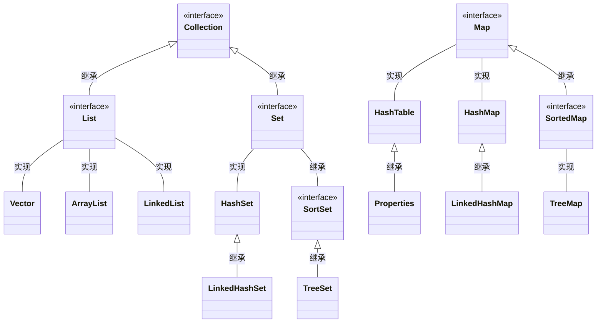

# 十一、Java集合


## 11.1 Java集合框架概述


### 11.1.1 集合框架与数组的对比及概述

集合、数组都是对多个数据进行存储操作的结构，简称 Java 容器。

- 说明；此时的存储，主要是指能存层面的存储，不涉及到持久化的存储（.txt,.jpg,.avi, 数据库中）。

数组在存储多个数据封面的特点：

- 一旦初始化以后，它的长度就确定了。

- 数组一旦定义好，它的数据类型也就确定了。我们就只能操作指定类型的数据了。比如：`String[] arr; int[] arr1; Object[] arr2`。

数组在存储多个数据方面的缺点：

- 一旦初始化以后，其长度就不可修改；
- 数组中提供的方法非常有限，对于添加、删除、插入数据等操作，非常不便，同时效率不高；
- 获取数组中实际元素的个数的需求，数组没有现成的属性或方法可用；
- 数组存储数据的特点：有序、可重复。对于无序、不可重复的需求，不能满足；


### 11.1.1 集合框架涉及到的API

Java 集合可分为 Collection 和 Map 两种体系：

- Collection 接口：单列数据，定义了存取一组对象的方法的集合。
  - List：元素有序、可重复的集合。
  - Set：元素无序、不可重复的集合。
- Map 接口：双列数据，保存具有映射关系“key-value 对”的集合。  


|---Collection 接口：单列集合，用来存储一个一个的对象

- |---List 接口：存储有序的、可重复的数据。 -->“动态”数组
  - |---ArrayList、LinkedList、Vector
- |---Set 接口：存储无序的、不可重复的数据 --> “集合”
  - |---HashSet、LinkedHashSet、TreeSet
- |---Map 接口：双列集合，用来存储一对 (key - value) 一对的数据 -->函数：y = f(x)
  - |---HashMap、LinkedHashMap、TreeMap、Hashtable、Properties  





## 11.2 Collection接口常用方法

1. 添加 `add(Objec tobj) addAll(Collection coll)`
2. 获取有效元素的个数 `int size()`
3. 清空集合 `void clear()`
4. 是否是空集合 `boolean isEmpty()`
5. 是否包含某个元素
   - ① `boolean contains(Object obj)`：是通过元素的 equals 方法来判断是否是同一个对象。
   - ② `boolean containsAll(Collection c)`：也是调用元素的 equals 方法来比较的。拿两个集合的元素挨个比较。
6. 删除
   - ① `boolean remove(Object obj)`：通过元素的 equals 方法判断是否是要删除的那个元素。只会删除找到的第一个元素。
   - ② `boolean removeAll(Collection coll)`：取当前集合的差集。
7. 取两个集合的交集：`boolean retainAll(Collection c)`：把交集的结果存在当前集合中，不影响 c。
8. 集合是否相等 `boolean equals(Object obj)`
9. 转成对象数组 `Object[] toArray()`
10. 获取集合对象的哈希值 `hashCode()`
11. 遍历 `iterator()`：返回迭代器对象，用于集合遍历  


```java
import org.testng.annotations.Test;
import java.util.*;

public class CollectionTest {

    @Test
    public void test1() {
        Collection coll = new ArrayList();
        // add(Object e): 将元素 e 添加到集合 coll 中
        coll.add("AA");
        coll.add("BB");
        coll.add(123); // 自动装箱
        coll.add(new Date());
        // size(): 获取添加的元素的个数
        System.out.println(coll.size()); // 4
        // addAll(Collection coll1): 将 coll1 集合中的元素添加到当前的集合中
        Collection coll1 = new ArrayList();
        coll1.add(456);
        coll1.add("CC");
        coll.addAll(coll1);
        System.out.println(coll.size()); // 6
        System.out.println(coll);
        // clear(): 清空集合元素
        coll.clear();
        // isEmpty(): 判断当前集合是否为空
        System.out.println(coll.isEmpty());
    }

    @Test
    public void test() {
        Collection coll = new ArrayList();
        coll.add(123);
        coll.add(456);
        // Person p = new Person("Jerry",20);
        // coll.add(p);
        coll.add(new Person("Jerry", 20));
        coll.add(new String("Tom"));
        coll.add(false);
        // 1.contains(Object obj): 判断当前集合中是否包含 obj
        // 我们在判断时会调用 obj 对象所在类的 equals()。
        boolean contains = coll.contains(123);
        System.out.println(contains);
        System.out.println(coll.contains(new String("Tam")));
        // System.out.println(coll.contains(p));//true
        System.out.println(coll.contains(new Person("Jerry", 20)));
        // false -->true
        // 2.containsAll(Collection coll1): 判断形参 coll1 中的所有元素是否都存在于当前集合中。
        Collection coll1 = Arrays.asList(123, 4567);
        System.out.println(coll.containsAll(coll1));
    }

    @Test
    public void test2() {
        // 3.remove(Object obj): 从当前集合中移除 obj 元素。
        Collection coll = new ArrayList();
        coll.add(123);
        coll.add(456);
        coll.add(new Person("Jerry", 20));
        coll.add(new String("Tom"));
        coll.add(false);
        coll.remove(1234);
        System.out.println(coll);
        coll.remove(new Person("Jerry", 20));
        System.out.println(coll);
        // 4. removeAll(Collection coll1): 差集：从当前集合中移除coll1 中所有的元素。
        Collection coll1 = Arrays.asList(123, 456);
        coll.removeAll(coll1);
        System.out.println(coll);
    }

    @Test
    public void test3() {
        Collection coll = new ArrayList();
        coll.add(123);
        coll.add(456);
        coll.add(new Person("Jerry", 20));
        coll.add(new String("Tom"));
        coll.add(false);
        // 5.retainAll(Collection coll1): 交集：获取当前集合和 coll1 集合的交集，并返回给当前集合
        // Collection coll1 = Arrays.asList(123,456,789);
        // coll.retainAll(coll1);
        // System.out.println(coll);
        // 6.equals(Object obj): 要想返回 true，需要当前集合和形参集合的元素都相同。
        Collection coll1 = new ArrayList();
        coll1.add(456);
        coll1.add(123);
        coll1.add(new Person("Jerry", 20));
        coll1.add(new String("Tom"));
        coll1.add(false);
        System.out.println(coll.equals(coll1));
    }

    @Test
    public void test4() {
        Collection coll = new ArrayList();
        coll.add(123);
        coll.add(456);
        coll.add(new Person("Jerry", 20));
        coll.add(new String("Tom"));
        coll.add(false);
        // 7.hashCode(): 返回当前对象的哈希值
        System.out.println(coll.hashCode());
        // 8. 集合 ---> 数组：toArray()
        Object[] arr = coll.toArray();
        for (int i = 0; i < arr.length; i++) {
            System.out.println(arr[i]);
        }
        // 拓展：数组 ---> 集合 : 调用 Arrays 类的静态方法 asList()
        List<String> list = Arrays.asList(new String[]{"AA", "BB", "CC"});
        System.out.println(list);
        List arr1 = Arrays.asList(123, 456);
        System.out.println(arr1);// [123, 456]
        List arr2 = Arrays.asList(new int[]{123, 456});
        System.out.println(arr2.size());// 1
        List arr3 = Arrays.asList(new Integer[]{123, 456});
        System.out.println(arr3.size());// 2
        // 9.iterator(): 返回 Iterator 接口的实例，用于遍历集合元素。放在 IteratorTest.java 中测试
    }
}

// 向 Collection 接口的实现类的对象中添加数据 obj 时，要求 obj 所在类要重写 equals().
class Person {
    private String name;
    private int age;
    public Person() {
        super();
    }
    public Person(String name, int age) {
        this.name = name;
        this.age = age;
    }
    public String getName() {
        return name;
    }
    public void setName(String name) {
        this.name = name;
    }
    public int getAge() {
        return age;
    }
    public void setAge(int age) {
        this.age = age;
    }
    @Override
    public String toString() {
        return "Person{" + "name='" + name + '\'' + ", age=" +
                age + '}';
    }
    @Override
    public boolean equals(Object o) {
        System.out.println("Person equals()....");
        if (this == o)
            return true;
        if (o == null || getClass() != o.getClass())
            return false;
        Person person = (Person) o;
        return age == person.age && Objects.equals(name, person.name);
    }
    @Override
    public int hashCode() {
        return Objects.hash(name, age);
    }
}
```


## 11.3 Iterator迭代器接口


### 11.3.1 迭代器Iterator的执行原理


### 11.3.2 使用Iterator遍历Collection

集合元素的遍历操作，使用迭代器 Iterator接口内部的方法：`hasNext()` 和`next()`  

```java
import org.testng.annotations.Test;
import java.util.ArrayList;
import java.util.Collection;
import java.util.Iterator;

public class IteratorTest {
    @Test
    public void test() {
        Collection coll = new ArrayList();
        coll.add(123);
        coll.add(456);
        coll.add(new Person("Jerry", 20));
        coll.add(new String("Tom"));
        coll.add(false);
        Iterator iterator = coll.iterator();
        // 方式一：
        // System.out.println(iterator.next());
        // System.out.println(iterator.next());
        // System.out.println(iterator.next());
        // System.out.println(iterator.next());
        // System.out.println(iterator.next());
        // // 报异常：NoSuchElementException
        // // 因 为： 在 调 用 it.next() 方 法 之 前 必 须 要 调 用 it.hasNext()进行检测。若不调用，且下一条记录无效，直接调用 it.next() 会抛出NoSuchElementException 异常。
        // System.out.println(iterator.next());
        // 方式二：不推荐
        // for(int i = 0; i < coll.size(); i++){
        // System.out.println(iterator.next());
        // }
        // 方式三：推荐
        while (iterator.hasNext()) {
            System.out.println(iterator.next());
        }
    }
}
```


### 11.3.3 Iterator遍历集合的两种错误写法

1. 内部的方法：hasNext() 和 next()；
2. 集合对象每次调用 iterator() 方法都得到一个全新的迭代器对象，默认游标都在集合的第一个元素之前；
3. 内部定义了 remove(), 可以在遍历的时候，删除集合中的元素。此方法不同于集合直接调用 remove()。  


```java
public class IteratorTest {
    @Test
    public void test2() {
        Collection coll = new ArrayList();
        coll.add(123);
        coll.add(456);
        coll.add(new Person("Jerry", 20));
        coll.add(new String("Tom"));
        coll.add(false);
        // 错误方式一：
        // Iterator iterator = coll.iterator();
        // while(iterator.next() != null){
        // System.out.println(iterator.next());
        // }
        // 错误方式二：
        // 集合对象每次调用 iterator() 方法都得到一个全新的迭代器对象，默认游标都在集合的第一个元素之前。
        while (coll.iterator().hasNext()) {
            System.out.println(coll.iterator().next());
        }
    }
}
```


### 11.3.4 Iterator迭代器remove()的使用

```java
public class IteratorTest {
    // 测试 Iterator 中的 remove() 方法
    @Test
    public void test3() {
        Collection coll = new ArrayList();
        coll.add(123);
        coll.add(456);
        coll.add(new Person("Jerry", 20));
        coll.add(new String("Tom"));
        coll.add(false);
        // 删除集合中“Tom”
        // 如果还未调用 next() 或在上一次调用 next 方法之后已经调用了 remove 方法，再调用 remove 都会报 IllegalStateException。
        Iterator iterator = coll.iterator();
        while (iterator.hasNext()) {
            // iterator.remove();
            Object obj = iterator.next();
            if ("Tom".equals(obj)) {
                iterator.remove();
                // iterator.remove();
            }
        }
        // 遍历集合
        iterator = coll.iterator();
        while (iterator.hasNext()) {
            System.out.println(iterator.next());
        }
    }
}
```


## 11.4 Collection子接口之一：List接口

- 鉴于 Java 中数组用来存储数据的局限性，我们通常使用 List 替代数组；
- List 集合类中元素有序、且可重复，集合中的每个元素都有其对应的顺序索引；
- List 容器中的元素都对应一个整数型的序号记载其在容器中的位置，可以根据序号存取容器中的元素；
- JDK API 中 List 接 口 的 实 现 类 常 用 的 有：ArrayList、LinkedList 和 Vector。  


### 11.4.1 List接口常用实现类的对比

|----Collection 接口：单列集合，用来存储一个一个的对象；

- |----List 接口：存储有序的、可重复的数据。 -->“动态”数组 ,替换原有的数组；
  - |----ArrayList：作为 List 接口的主要实现类；线程不安全的，效率高；底层使用 `Object[] elementData` 存储；
  - |----LinkedList：对于频繁的插入、删除操作，使用此类效率比 ArrayList 高；底层使用**<u>双向链表</u>**存储；
  - |----Vector：作为 List 接口的古老实现类；线程安全的，效率低；底层使用 `Object[] elementData` 存储。


面试题：比较 ArrayList、LinkedList、Vector 三者的异同？

- 同：三个类都是实现了 List 接口，存储数据的特点相同：存储有序的、可重复的数据

- 不同：见上  


### 11.4.2 List接口中常用方法测试

- `void add(intindex, Object ele)`：在 index 位置插入 ele 元素；
- `boolean addAll(int index, Collection eles)`：从 index 位置开始将 eles 中的所有元素添加进来；
- `Object get(int index)`：获取指定 index 位置的元素；
- `int indexOf(Object obj)`：返回 obj 在集合中首次出现的位置；
- `int lastIndexOf(Object obj)`：返回 obj 在当前集合中末次出现的位置；
- `Object remove(int index)`：移除指定 index 位置的元素，并返回此元素；
- `Object set(int index, Object ele)`：设置指定 index 位置的元素为 ele；
- `List subList(int fromIndex, int toIndex)`：返回从 fromIndex 到 toIndex 位置的子集合。  

```java
import org.testng.annotations.Test;

import java.util.ArrayList;
import java.util.Arrays;
import java.util.Iterator;
import java.util.List;

public class ListTest {

    @Test
    public void test3() {
        ArrayList list = new ArrayList();
        list.add(123);
        list.add(456);
        list.add("AA");
        // 方式一：Iterator 迭代器方式
        Iterator iterator = list.iterator();
        while (iterator.hasNext()) {
            System.out.println(iterator.next());
        }
        System.out.println("***************");
        // 方式二：增强 for 循环
        for (Object obj : list) {
            System.out.println(obj);
        }
        System.out.println("***************");
        // 方式三：普通 for 循环
        for (Object o : list) {
            System.out.println(o);
        }
    }

    @Test
    public void test2() {
        ArrayList list = new ArrayList();
        list.add(123);
        list.add(456);
        list.add("AA");
        list.add(new Person("Tom", 12));
        list.add(456);
        // int indexOf(Object obj): 返回 obj 在集合中首次出现的位置。如果不存在，返回 -1.
        int index = list.indexOf(4567);
        System.out.println(index);
        // int lastIndexOf(Object obj): 返回 obj 在当前集合中末次出现的位置。如果不存在，返回 -1.
        System.out.println(list.lastIndexOf(456));
        // Object remove(int index): 移除指定 index 位置的元素，并返回此元素
        Object obj = list.remove(0);
        System.out.println(obj);
        System.out.println(list);
        // Object set(int index, Object ele): 设置指定 index 位置的元素为 ele
        list.set(1, "CC");
        System.out.println(list);
        // List subList(int fromIndex, int toIndex): 返回从 fromIndex到 toIndex 位置的左闭右开区间的子集合
        List subList = list.subList(2, 4);
        System.out.println(subList);
        System.out.println(list);
    }
    
    @Test
    public void test() {
        ArrayList list = new ArrayList();
        list.add(123);
        list.add(456);
        list.add("AA");
        list.add(new Person("Tom", 12));
        list.add(456);
        System.out.println(list);
        //void add(int index, Object ele): 在 index 位置插入 ele 元素
        list.add(1, "BB");
        System.out.println(list);
        // boolean addAll(int index, Collection eles): 从 index 位置开始将 eles 中的所有元素添加进来
        List list1 = Arrays.asList(1, 2, 3);
        list.addAll(list1);
        // list.add(list1);
        System.out.println(list.size());// 9
        // Object get(int index): 获取指定 index 位置的元素
        System.out.println(list.get(2));
    }
}
```


## 11.5 Collection子接口之二：Set接口

Set 接口是 Collection 的子接口，set 接口没有提供额外的方法。

Set 集合不允许包含相同的元素，如果试把两个相同的元素加入同一个 Set 集合中，则添加操作失败。

Set 判断两个对象是否相同不是使用 == 运算符，而是根据 equals() 方法。  


### 11.5.1 Set接口实现类的对比

|----Collection 接口：单列集合，用来存储一个一个的对象；

- |----Set 接口：存储无序的、不可重复的数据--> “集合”；
  - |----HashSet：作为 Set 接口的主要实现类；线程不安全的；可以存储 null 值；
    - |----LinkedHashSet：作为 HashSet 的子类；遍历其内部数据时，可以按照添加的顺序遍历；对于频繁的遍历操作，LinkedHashSet 效率高于 HashSet。
  - |----SortSet：确保元素处于排列状态；
    - |----TreeSet：可以按照添加对象的指定属性，进行排序；


### 11.5.2 Set的无序性与不可重复性的理解

- Set 接口中没有定义额外的方法，使用的都是 Collection 中声明过的方法;
- 要求：向 Set( 主要指：HashSet、LinkedHashSet) 中添加的数据，其所在的类一定要重写 hashCode() 和 equals();
- 要求：重写的 hashCode() 和 equals() 尽可能保持一致性：相等的对象必须具有相等的**<u>散列码</u>**;
- 重写两个方法的小技巧：对象中用作 equals() 方法比较的 Field，都应该用来计算 hashCode()值  ;


<u>**存储无序的、不可重复的数据：**</u>

- 无序性：不等于随机性。存储的数据在底层数组中并非按照数组索引的顺序添加，**而是根据数据的哈希值决定的**；
- 不可重复性：保证添加的元素按照 `equals()` 判断时，不能返回 true. 即：相同的元素只能添加一个；


**<u>添加元素的过程：以HashSet为例：</u>**

我们向 HashSet 中添加元素 a，首先调用元素 a 所在类的 hashCode() 方法，计算元素 a 的哈希值，

此哈希值接着通过**某种算法**计算出在 HashSet 底层数组中的存放位置（即为：索引位置），判断：

- 数组此位置上是否已经有元素：
  - 如果此位置上没有其他元素，则元素 a 添加成功。 ---> ==情况 1==
  - 如果此位置上有其他元素 b( 或以链表形式存在的多个元素），则比较元素 a 与元素 b 的 hash 值：
    - 如果 hash 值不相同，则元素 a 添加成功。---> ==情况 2==
    - 如果 hash 值相同，进而需要调用元素a所在类 equals() 方法：
      - equals() 返回 true, 元素 a 添加失败；
      - equals() 返回 false, 则元素 a 添加成功。---> ==情况 3==

对于添加成功的情况 2 和情况 3 而言：元素 a 与已经存在指定索引位置上**<u>数据以链表的方式</u>**存储。  


**<u>HashSet底层：</u>**数组 + 链表的结构  


### 11.5.3 HashSet的使用

HashSet 是 Set 接口的典型实现，大多数时候使用 Set 集合时都使用这个实现类；

HashSet 按 Hash 算法来存储集合中的元素，因此具有很好的存取、查找、删除性能；

HashSet 具有以下特点：

- ①不能保证元素的排列顺序；
- ② HashSet 不是线程安全的；
- ③集合元素可以是 null；

底层也是数组，初始容量为 16，当如果使用率超过 0.75，（16*0.75=12）就会扩大容量为原来的 2 倍。（16 扩容为 32，依次为 64,128…等）；

HashSet 集合判断两个元素相等的标准：两个对象通过 `hashCode()` 方法比较相等，并且两个对象的 `equals()` 方法返回值也相等；

对 于 存 放 在 Set 容 器 中 的 对 象， 对 应 的 类 一 定 要 重 写 `equals()` 和`hashCode(Object obj)` 方法，以实现对象相等规则。即：“相等的对象必须具有相等的散列码”；

```java
public class SetTest {

    @Test
    public void test() {
        Set set = new HashSet();
        set.add(123);
        set.add(456);
        set.add("fgd");
        set.add("book");
        set.add(new User("Tom", 12));
        set.add(new User("Tom", 12));
        set.add(129);
        Iterator iterator = set.iterator();
        while (iterator.hasNext()) {
            System.out.println(iterator.next());
        }
    }

}

class User {
    private String name;
    private int age;

    public User() {
    }

    public User(String name, int age) {
        this.name = name;
        this.age = age;
    }

    public String getName() {
        return name;
    }

    public void setName(String name) {
        this.name = name;
    }

    public int getAge() {
        return age;
    }

    public void setAge(int age) {
        this.age = age;
    }

    @Override
    public String toString() {
        return "User{" + "name='" + name + '\'' + ", age=" + age
                + '}';
    }

    @Override
    public boolean equals(Object o) {
        System.out.println("User equals()....");
        if (this == o)
            return true;
        if (o == null || getClass() != o.getClass())
            return false;
        User user = (User) o;
        if (age != user.age)
            return false;
        return name != null ? name.equals(user.name) : user.name == null;
    }

    @Override
    public int hashCode() {
        int result = name != null ? name.hashCode() : 0;
        result = 31 * result + age;
        return result;
    }
}
```


### 11.5.4 关于hashCode()和equals()的重写

- 重写 hashCode() 方法的基本原则：
  - 在程序运行时，同一个对象多次调用 hashCode() 方法应该返回相同的值。
  - 当两个对象的 equals() 方法比较返回 true 时，这两个对象的 hashCode()方法的返回值也应相等。
  - 对象中用作 equals() 方法比较的 Field，都应该用来计算 hashCode 值。
- 重写 equals() 方法的基本原则：
  - 以自定义的 User 类为例，何时需要重写 equals() ？
  - 当一个类有自己特有的**“逻辑相等”**概念 , 当改写 equals() 的时候，总是要改写 hashCode()，根据一个类的 equals 方法（改写后），两个截然不同的实例有可能在逻辑上是相等的，但是，根据 Object.hashCode() 方法，它们仅仅是两个对象。
  - 因此，违反了“相等的对象必须具有相等的散列码”。
  - 结论：**<u>复写 equals 方法的时候一般都需要同时复写 hashCode 方法</u>**。通常参与计算 hashCode 的对象的属性也应该参与到 equals() 中进行计算。  

- Eclipse/IDEA 工具里 hashCode() 的重写：
  - 以 Eclipse/IDEA 为例，在自定义类中可以调用工具自动重写 equals 和hashCode。问题：为什么用 Eclipse/IDEA 复写 hashCode 方法，有 31 这个数字？
  - 选择系数的时候要选择尽量大的系数。因为如果计算出来的 hash 地址越大，所谓的“冲突”就越少，查找起来效率也会提高。（**减少冲突**）并且 31 只占用 5bits, 相乘造成数据溢出的概率较小。
  - 31可以由i*31== (i<<5)-1来表示,现在很多虚拟机里面都有做相关优化。（提高算法效率）
  - 31 是一个素数，**素数作用就是如果我用一个数字来乘以这个素数，那么最终出来的结果只能被素数本身和被乘数还有 1 来整除**！ ( 减少冲突 )  


### 11.5.5 LinkedHashSet的使用

- LinkedHashSet 是 HashSet 的子类
- LinkedHashSet 根据元素的 hashCode 值来决定元素的存储位置，但它同时使用**<u>双向链表维护元素的次序</u>**，这使得元素看起来是以插入顺序保存的。
- LinkedHashSet **插入性能略低**于 HashSet，但在迭代访问 Set 里的全部元素时有很好的性能。
- LinkedHashSet 不允许集合元素重复。  


### 11.5.6 TreeSet的自然排序与定制排序

TreeSet 是 SortedSet 接口的实现类，TreeSet 可以确保集合元素处于排序状态。

TreeSet 底层使用红黑树结构存储数据。

- 新增的方法如下：( 了解 )
  - Comparator comparator()
  - Object first()
  - Object last()
  - Object lower(Object e)
  - Object higher(Object e)
  - SortedSet subSet(fromElement, toElement)
  - SortedSet headSet(toElement)
  - SortedSet tailSet(fromElement)
- TreeSet 两种排序方法：**自然排序和定制排序**。默认情况下，TreeSet 采用自然排序。
  - TreeSet 和后面要讲的 TreeMap 采用红黑树的存储结构。
- 特点：有序，查询速度比 List 快。
- 自然排序：TreeSet 会调用集合元素的 compareTo(Object obj) 方法来比较元素之间的大小关系，然后将集合元素按升序 ( 默认情况 ) 排列。
- 如 果 试 图 把 一 个 对 象 添 加 到 TreeSet 时， 则 该 对 象 的 类 **<u>必 须 实 现Comparable 接口</u>**。
  - 实现 Comparable 的类必须实现 compareTo(Object obj) 方法，两个对象即通过 compareTo(Object obj) 方法的返回值来比较大小。
- Comparable 的典型实现：
  - BigDecimal、BigInteger 以及所有的数值型对应的包装类：按它们对应的数值大小进行比较。
  - Character：按字符的 unicode 值来进行比较。
  - Boolean：true 对应的包装类实例大于 false 对应的包装类实例。
  - String：按字符串中字符的 unicode 值进行比较。
  - Date、Time：后边的时间、日期比前面的时间、日期大。  


向 TreeSet 中添加元素时，只有第一个元素无须比较 compareTo() 方法，后面添加的所有元素都会调用 compareTo() 方法进行比较。

因为只有相同类的两个实例才会比较大小，所以向 TreeSet 中添加的应该是同一个类的对象。

对于 TreeSet 集合而言，它判断两个对象是否相等的唯一标准是：两个对象通过 compareTo(Object obj) 方法比较返回值。

当需要把一个对象放入 TreeSet 中，重写该对象对应的 equals() 方法时，应保证该方法与 compareTo(Object obj) 方法有一致的结果：如果两个对象通过equals() 方法比较返回 true，则通过 compareTo(Object obj) 方法比较应返回 0。否则，让人难以理解。

```java
import org.testng.annotations.Test;

import java.util.Comparator;
import java.util.Iterator;
import java.util.Objects;
import java.util.TreeSet;

public class TreeSetTest {
    @Test
    public void test() {
        TreeSet set = new TreeSet();
        // 失败：不能添加不同类的对象
        // set.add(123);
        // set.add(456);
        // set.add("AA");
        // set.add(new User("Tom", 12));
        // 举例一：
        // set.add(34);
        // set.add(-34);
        // set.add(43);
        // set.add(11);
        // set.add(8);
        // 举例二：
        set.add(new User1("Tom", 12));
        set.add(new User1("Jerry", 32));
        set.add(new User1("Jim", 2));
        set.add(new User1("Mike", 65));
        set.add(new User1("Jack", 33));
        set.add(new User1("Jack", 56));
        Iterator iterator = set.iterator();
        while (iterator.hasNext()) {
            System.out.println(iterator.next());
        }
    }

    @Test
    public void test2() {
        Comparator com = new Comparator() {
            // 按照年龄从小到大排列
            @Override
            public int compare(Object o1, Object o2) {
                if (o1 instanceof User1 && o2 instanceof User1) {
                    User1 u1 = (User1) o1;
                    User1 u2 = (User1) o2;
                    return Integer.compare(u1.getAge(),
                            u2.getAge());
                } else {
                    throw new RuntimeException(" 输入的数据类型不匹配 ");
                }
            }
        };
        TreeSet set = new TreeSet(com);
        set.add(new User1("Tom", 12));
        set.add(new User1("Jerry", 32));
        set.add(new User1("Jim", 2));
        set.add(new User1("Mike", 65));
        set.add(new User1("Mary", 33));
        set.add(new User1("Jack", 33));
        set.add(new User1("Jack", 56));
        Iterator iterator = set.iterator();
        while (iterator.hasNext()) {
            System.out.println(iterator.next());
        }
    }
}

class User1 implements Comparable {
    private String name;
    private int age;

    public User1() {
    }

    public User1(String name, int age) {
        this.name = name;
        this.age = age;
    }

    public String getName() {
        return name;
    }

    public void setName(String name) {
        this.name = name;
    }

    public int getAge() {
        return age;
    }

    public void setAge(int age) {
        this.age = age;
    }

    @Override
    public String toString() {
        return "User{" + "name='" + name + '\'' + ", age=" + age
                + '}';
    }

    @Override
    public boolean equals(Object o) {
        System.out.println("User equals()....");
        if (this == o)
            return true;
        if (o == null || getClass() != o.getClass())
            return false;
        User1 user = (User1) o;
        if (age != user.age)
            return false;
        return Objects.equals(name, user.name);
    }

    @Override
    public int hashCode() { // return name.hashCode() + age;
        int result = name != null ? name.hashCode() : 0;
        result = 31 * result + age;
        return result;
    }

    // 按照姓名从大到小排列 , 年龄从小到大排列
    @Override
    public int compareTo(Object o) {
        if (o instanceof User1) {
            User1 user = (User1) o;
            // return this.name.compareTo(user.name);
            // 按照姓名从小到大排列
            // return -this.name.compareTo(user.name);
            // 按照姓名从大到小排列
            int compare = -this.name.compareTo(user.name);
            // 按照姓名从大到小排列
            if (compare != 0) { // 年龄从小到大排列
                return compare;
            } else {
                return Integer.compare(this.age, user.age);
            }
        } else {
            throw new RuntimeException(" 输入的类型不匹配 ");
        }
    }
}
```


## 11.6 Map接口


### 11.6.1 Map接口及其多个实现类的对比


**<u>Map的实现类的结构：</u>**

|----Map：双列数据，存储 key-value 对的数据 --- 函数：y = f(x)；

- |----HashMap：作为 Map 的主要实现类；线程不安全的，效率高；可存储 null 的 key 和 value；
  - |----LinkedHashMap: 保证在遍历 map 元素时，可以按照添加的顺序实现遍历。原因：在原有的 HashMap 底层结构基础上，添加了一对指针，指向前一个和后一个元素。对于频繁的遍历操作，此类执行效率高于HashMap。
- SortedMap接口
  - |----TreeMap：保证按照添加的 key-value 对进行排序，实现排序遍历。此时考虑 key 的自然排序或定制排序底层使用红黑树；
- |----Hashtable：作为古老的实现类；线程安全的，效率低；不能存储 null 的 key 和 value；
  - |----Properties：常用来处理配置文件。***key 和 value 都是 String类型***。  


**<u>Map结构的理解：</u>**

- Map 中的 key：无序的、不可重复的，使用 Set 存储所有的 key --->key 所在的类要重写 `equals()` 和 `hashCode()` （以 HashMap 为例）。
- Map 中的 value：无序的、可重复的，使用 Collection 存储所有的 value--->value 所在的类要重写 equals()。
- 一个键值对：key-value 构成了一个 Entry 对象。
- Map 中的 entry: 无序的、不可重复的，使用 Set 存储所有的 entry。  


**<u>HashMap的底层实现原理：</u>**

在实例化以后，底层创建了长度是 16 的一维数组 `Entry[] table`。

*可能已经执行过多次 put*

map.put(key1,value1)：

首先，调用 key1 所在类的 hashCode() 计算 key1 哈希值，此哈希值经过某种算法计算以后，得到在 Entry 数组中的存放位置。

- 如果此位置上的数据为空，此时的 key1-value1 添加成功。-- **情况 1**
- 如果此位置上的数据不为空，( 意味着此位置上存在一个或多个数据 ( 以链表形式存在 )), 比较 key1 和已经存在的一个或多个数据的哈希值：
  - 如果 key1 的哈希值与已经存在的数据的哈希值都不相同，此时key1-value1 添加成功。-- **情况 2**
  - 如果 key1 的哈希值和已经存在的某一个数据 (key2-value2) 的哈希值相同，继续比较：调用 key1 所在类的 equals(key2) 方法，比较：
    - 如果 equals() 返回 false：此时 key1-value1 添加成功。-- **情况 3**
    - 如果 equals() 返回 true：使用 value1 **替换** value2。

补充：关于情况 2 和情况 3：此时 **key1-value1 和原来的数据以链表的方式存储**。

在不断的添加过程中，会涉及到扩容问题，当超出临界值 ( 且要存放的位置非空 ) 时，扩容。默认的扩容方式：扩容为原来容量的 2 倍，并将原有的数据复制过来。  


**<u>HashMap 的扩容：</u>**

当 HashMap 中的元素越来越多的时候，hash 冲突的几率也就越来越高，因为数组的长度是固定的。所以为了提高查询的效率，就要对 HashMap的数组进行扩容，而在 HashMap 数组扩容之后，最消耗性能的点就出现了：原数组中的数据必须重新计算其在新数组中的位置，并放进去，这就是resize。


**<u>那么 HashMap 什么时候进行扩容：</u>**

当 HashMap 中的元素个数超过数组大小 ( 数组总大小 length, 不是数组中个数 size)*loadFactor 时，就 会 进 行 数 组 扩 容，loadFactor 的默认值(DEFAULT_LOAD_FACTOR) 为 0.75，这是一个折中的取值。也就是说，默认情况下，数组大小 (DEFAULT_INITIAL_CAPACITY) 为 16，那么当HashMap 中元素个数超过 16*0.75=12（这个值就是代码中的 threshold 值，也叫做临界值）的时候，就把数组的大小扩展为 2*16=32，即扩大一倍，然后重新计算每个元素在数组中的位置，而这是一个非常消耗性能的操作，所以如果我们已经预知 HashMap 中元素的个数，那么预设元素的个数能够有效的提高 HashMap 的性能。  


**<u>LinkedHashMap的底层实现原理：</u>**

```java
//源码
static class Entity<K, V> extends HashMap.Node<K, V>{
    Entity<K, V> before, after;//记录添加元素的前后顺序
    
    Entity(int hash, K key, V value, Node<K, V> next){
        super(hash, key, value, next);
    }
}
```


**<u>Map中定义的方法：</u>**

添加、删除、修改操作：

- `Object put(Object key,Object value)`：将指定 key-value 添加到 ( 或修改 ) 当前 map 对象中；
- `void putAll(Map m)`: 将 m 中的所有 key-value 对存放到当前 map 中；
- `Object remove(Object key)`：移除指定 key 的 key-value 对，并返回 value；
- `void clear()`：清空当前 map 中的所有数据。

元素查询的操作：

- `Object get(Object key)`：获取指定 key 对应的 value；
- `boolean containsKey(Object key)`：是否包含指定的 key；
- `boolean containsValue(Object value)`：是否包含指定的 value；
- `int size()`：返回 map 中 key-value 对的个数；
- `boolean isEmpty()`：判断当前 map 是否为空；
- `boolean equals(Object obj)`：判断当前 map 和参数对象 obj 是否相等。

元视图操作的方法：

- `Set keySet()`：返回所有 key 构成的 Set 集合；
- `Collection values()`：返回所有 value 构成的 Collection 集合；
- `Set entrySet()`：返回所有 key-value 对构成的 Set 集  


### 11.6.2 Map中存储的key-value的特点


- Map 与 Collection 并列存在。用于保存具有映射关系的数据：key-value。
- Map 中的 key 和 value 都可以是任何引用类型的数据。
- Map 中的 key 用 Set 来存放，不允许重复，即同一个 Map 对象所对应的类，须重写 hashCode() 和 equals() 方法。
- 常用 String 类作为 Map 的“键”：
  - key 和 value 之间存在单向一对一关系，即通过指定的 key 总能找到唯一的、确定的 value。
  - Map 接 口 的 常 用 实 现 类：HashMap、TreeMap、LinkedHashMap 和Properties。其中，HashMap 是 Map 接口使用频率最高的实现类。  


### 11.6.3 Map实现类之一：HashMap

- `HashMap` 是 `Map` 接口使用频率最高的实现类；
- 允许使用 `null` 键和 `null` 值，与 `HashSet` 一样，不保证映射的顺序；
- 所有的 key 构成的集合是 Set：无序的、不可重复的。所以，key 所在的类要重写：`equals() 和 hashCode()`；
- 所有的 value 构成的集合是 Collection：无序的、可以重复的。所以，value 所在的类要重写：`equals()`；
- 一个 key-value 构成一个 entry；
- 所有的 entry 构成的集合是 Set：无序的、不可重复的；
- HashMap 判断两个 key 相等的标准是：两个 key 通过 equals() 方法返回 true，hashCode 值也相等；
- HashMap 判断两个 value 相等的标准是：两个 value 通过 equals() 方法返回 true；


**<u>*HashMap源码中的重要常量：*</u>**

- `DEFAULT_INITIAL_CAPACITY`：HashMap 的默认容量，16；
- `MAXIMUM_CAPACITY`：HashMap 的最大支持容量，2^30；
- `DEFAULT_LOAD_FACTOR`：HashMap 的默认加载因子；
- `TREEIFY_THRESHOLD`：Bucket 中链表长度大于该默认值，转化为红黑树；
- `UNTREEIFY_THRESHOLD`：Bucket 中红黑树储存的 Node 小于该默认值，转化为链表；
- `MIN_TREEIFY_CAPACITY`：同种的 Node 树被化时的最小的 hash表容量。（当桶中 Node 的；
- 数量大到需要变红黑树时，若 hash 表容量小于 `MIN_TREEIFY_CAPACITY` 时，此时应执行；
- `resize` 扩 容 操 作 这 个 `MIN_TREEIFY_CAPACITY` 的 值 至 少 是`TREEIFY_THRESHOLD` 的 4 倍。）；
- `table`：储存元素的数组，总是 2 的 n 次幂；
- `entrySet`：储存具体元素的集；
- `size`：HashMap 中储存的键值对的数量；
- `modCount`：HashMap 扩容和结构改变的次数；
- `threshold`：扩容的临界值，= 容量 * 填充因子；
- `loadFactor`：填充因子。  


### 11.6.4 HashMap的底层实现原理

**<u>*在JDK7中：*</u>**

HashMap 的内部存储结构其实是数组和链表的结合。当实例化一个HashMap 时，系统会创建一个长度为 Capacity 的 Entry 数组，这个长度在哈希表中被称为容量 (Capacity)，在这个数组中可以存放元素的位置我们称之为“桶”(bucket)，每个 bucket 都有自己的索引，系统可以根据索引快速的查找 bucket 中的元素。

每个 bucket 中存储一个元素，即一个 Entry 对象，但每一个 Entry 对象可以带一个引用变量，用于指向下一个元素，因此，在一个桶中，就有可能生成一个 Entry 链。而且新添加的元素作为链表的 head。

添加元素的过程：

向 HashMap 中添加 entry1(key，value)，需要首先计算 entry1 中 key 的哈希值 ( 根据 key 所在类的 hashCode() 计算得到 )，此哈希值经过处理以后，得到在底层 Entry[] 数组中要存储的位置 i。

如果位置 i 上没有元素，则 entry1 直接添加成功。

如果位置 i 上已经存在 entry2( 或还有链表存在的 entry3，entry4)，则需要通过循环的方法，依次比较 entry1 中 key 的 hash 值和其他的 entry 的 hash 值。

如果彼此 hash 值不同，则直接添加成功。

如果 hash 值相同，继续比较二者是否 equals。如果返回值为 true，则使用 entry1 的 value 去替换 equals 为 true 的 entry 的value。

如果遍历一遍以后，发现所有的 equals 返回都为 false, 则 entry1 仍可添加成功。entry1 指向原有的 entry 元素。  


***<u>在JDK8中：</u>***

HashMap 的内部存储结构其实是数组 + 链表 + 红黑树的结合。当实例化一个 HashMap 时，会初始化 initialCapacity 和 loadFactor，在 put 第一对映射关系时，系统会创建一个长度为 initialCapacity 的 Node 数组，这个长度在哈希表中被称为容量 (Capacity)，在这个数组中可以存放元素的位置我们称之为“桶”(bucket)，每个 bucket 都有自己的索引，系统可以根据索引快速的查找 bucket 中的元素。

每个 bucket 中存储一个元素，即一个 Node 对象，但每一个 Node 对象可以带一个引用变量 next，用于指向下一个元素，因此，在一个桶中，就有可能生成一个 Node 链。也可能是一个一个 TreeNode 对象，每一个TreeNode 对象可以有两个叶子结点 left 和 right，因此，在一个桶中，就有可能生成一个 TreeNode 树。而新添加的元素作为链表的 last，或树的叶子结点。  


**<u>*HashMap什么时候进行扩容和树形化：*</u>**

当 HashMap 中的元素个数超过数组大小 ( 数组总大小 length, 不是数组中个数 size)\*loadFactor 时，就会进行数组扩容，loadFactor 的默认值(`DEFAULT_LOAD_FACTOR`) 为 0.75，这是一个折中的取值。也就是说，默认情况下，数组大小( `DEFAULT_INITIAL_CAPACITY` ) 为 16，那么当HashMap 中元素个数超过 16\*0.75=12（这个值就是代码中的 threshold 值，也叫做临界值）的时候，就把数组的大小扩展为 2*16=32，即扩大一倍，然后重新计算每个元素在数组中的位置，而这是一个非常消耗性能的操作，所以如果我们已经预知 HashMap 中元素的个数，那么预设元素的个数能够有效的提高 HashMap 的性能。

当 HashMap 中的其中一个链的对象个数如果达到了 8 个，此时如果capacity 没有达到 64，那么 HashMap 会先扩容解决，如果已经达到了 64，那么这个链会变成红黑树，结点类型由 Node 变成 TreeNode 类型。当然，如果当映射关系被移除后，下次 resize 方法时判断树的结点个数低于 6 个，也会把红黑树再转为链表。  


**<u>*关于映射关系的key是否可以修改？==不要修改==*</u>**

映射关系存储到 HashMap 中会存储 key 的 hash 值，这样就不用在每次查找时重新计算每一个 Entry 或 Node（TreeNode）的 hash 值了，因此如果已经 put 到 Map 中的映射关系，再修改 key 的属性，而这个属性又参与hashcode 值的计算，那么会导致匹配不上。  


### 11.6.5 Map实现之二：LinkedHashMap

LinkedHashMap 是 HashMap 的子类。

在 HashMap 存储结构的基础上，使用了一对双向链表来记录添加元素的顺序。

与 LinkedHashSet 类似，LinkedHashMap 可以维护 Map 的迭代顺序：迭代顺序与 Key-Value 对的插入顺序一致。

- HashMap 中的内部类：Node

```java
static class Node<K, V> implements Map.Entry<K, V> {
    final int hash;
    final K key;
    V value;
    Node<K, V> next;
}
```


- LinkedHashMap 中的内部类：Entry  

```java
static class Entry<K, V> extends HashMap.Node<K, V> {
    Entry<K, V> before, after;
    
    Entry(int hash, K key, V value, Node<K, V> next) {
    	super(hash, key, value, next);
    }
}
```


### 11.6.6 Map中的常用方法

```java
import org.testng.annotations.Test;
import java.util.*;

public class MapTest {

    @Test
    public void test() {
        Map map = new HashMap();
        // map = new Hashtable();
        map.put(null, 123);
    }

    /**
     * 添加、删除、修改操作：
     * Object put(Object key,Object value)：将指定 key-value 添加到 ( 或修改 )
     * 当前 map 对象中；
     * void putAll(Map m): 将 m 中的所有 key-value 对存放到当前 map 中
     * Object remove(Object key)： 移 除 指 定 key 的 key-value 对， 并 返 回
     * value
     * void clear()：清空当前 map 中的所有数据
     */
    @Test
    public void test2() {
        Map map = new HashMap();
        // 添加
        map.put("AA", 123);
        map.put(45, 123);
        map.put("BB", 56);
        // 修改
        map.put("AA", 87);
        System.out.println(map);
        Map map1 = new HashMap();
        map1.put("CC", 123);
        map1.put("DD", 456);
        map.putAll(map1);
        System.out.println(map);
        // remove(Object key)
        Object value = map.remove("CC");
        System.out.println(value);
        System.out.println(map);
        // clear()
        map.clear();// 与 map = null 操作不同
        System.out.println(map.size());
        System.out.println(map);
    }

    /**
     * 元素查询的操作：
     * Object get(Object key)：获取指定 key 对应的 value ；
     * boolean containsKey(Object key)：是否包含指定的 key ；
     * boolean containsValue(Object value)：是否包含指定的 value ；
     * int size()：返回 map 中 key-value 对的个数 ；
     * boolean isEmpty()：判断当前 map 是否为空；
     * boolean equals(Object obj)：判断当前 map 和参数对象 obj 是否相等。
     */
    @Test
    public void test3() {
        Map map = new HashMap();
        map.put("AA", 123);
        map.put(45, 123);
        map.put("BB", 56);
        // Object get(Object key)
        System.out.println(map.get(45));
        // containsKey(Object key)
        boolean isExist = map.containsKey("BB");
        System.out.println(isExist);
        isExist = map.containsValue(123);
        System.out.println(isExist);
        map.clear();
        System.out.println(map.isEmpty());
    }

    /**
     * 元视图操作的方法： Set keySet()：返回所有 key 构成的 Set 集合
     * Collection values()：返回所有 value 构成的 Collection 集合
     * Set entrySet()：返回所有 key-value 对构成的 Set 集合
     */
    @Test
    public void test5() {
        Map map = new HashMap();
        map.put("AA", 123);
        map.put(45, 1234);
        map.put("BB", 56);
        // 遍历所有的 key 集：keySet()
        Set set = map.keySet();
        Iterator iterator = set.iterator();
        while (iterator.hasNext()) {
            System.out.println(iterator.next());
        }
        System.out.println("*****************");
        // 遍历所有的 values 集：values()
        Collection values = map.values();
        for (Object obj : values) {
            System.out.println(obj);
        }
        System.out.println("***************");
        // 遍历所有的 key-values
        // 方式一：
        Set entrySet = map.entrySet();
        Iterator iterator1 = entrySet.iterator();
        while (iterator1.hasNext()) {
            Object obj = iterator1.next();
            // entrySet 集合中的元素都是 entry
            Map.Entry entry = (Map.Entry) obj;
            System.out.println(entry.getKey() + "---->" + entry.
                    getValue());
        }
        System.out.println("/");
        // 方式二：
        Set keySet = map.keySet();
        Iterator iterator2 = keySet.iterator();
        while (iterator2.hasNext()) {
            Object key = iterator2.next();
            Object value = map.get(key);
            System.out.println(key + "=====" + value);
        }
    }
}

```


### 11.6.7 Map 实现类之三：TreeMap

- TreeMap 存 储 Key-Value 对 时， 需 要 根 据 key-value 对进行排序。TreeMap 可以保证所有的 Key-Value对处于有序状态。
- TreeSet 底层使用红黑树结构存储数据。
- TreeMap 的 Key 的排序：
  - 自然排序：TreeMap 的所有的 Key 必须实现Comparable接口，而且所有的Key应该是同一个类的对象，否则将会抛出 ClasssCastException。
  - 定 制 排 序： 创 建 TreeMap 时， 传 入 一 个Comparator 对象，该对象负责对 TreeMap 中的所有 key进行排序。此时不需要 Map 的 Key 实现 Comparable 接口。
- TreeMap 判断两个 key 相等的标准：两个 key 通过compareTo() 方法或者 compare() 方法返回 0;


### 11.6.8 Map实现类之四：Hashtable

- Hashtable 是个古老的 Map 实现类，JDK1.0 就提供了。不同于 HashMap，Hashtable 是线程安全的；
- Hashtable 实现原理和 HashMap 相同，功能相同。底层都使用哈希表结构，查询速度快，很多情况下可以互用；
- 与 HashMap 不同，Hashtable 不允许使用 null 作为key 和 value；
- 与 HashMap 一样，Hashtable 也不能保证其中 KeyValue 对的顺序；
- Hashtable判断两个key相等、两个value相等的标准，与 HashMap 一致；


### 11.6.9 Map实现类之五：Properties

- Properties 类是 Hashtable 的子类，该对象用于处理属性文件；
- 由于属性文件里的 key、value 都是字符串类型，所以 Properties 里的 key 和 value 都是字符串类型；
- 存取数据时，建议使用 `setProperty(String key,String value)` 方法和 `getProperty(String key)` 方法。  

```java
Properties pros = new Properties();
pros.load(new FileInputStream("jdbc.properties"));
String user = pros.getProperty("user");
System.out.println(user);
```


## 11.7 Collections工具类

操作数组的工具类：Arrays；

Collections 是一个操作 Set、List 和 Map 等集合的工具类；

Collections 中提供了一系列静态的方法对集合元素进行排序、查询和修改等操作，还提供了对集合对象设置不可变、对集合对象实现同步控制等方法。

排序操作：（**<u>*均为 static 方法*</u>**）

- `reverse(List)`：反转 List 中元素的顺序；
- `shuffle(List)`：对 List 集合元素进行随机排序；
- `sort(List)`：根据元素的自然顺序对指定 List 集合元素按升序排序；
- `sort(List，Comparator)`： 根 据 指 定 的 Comparator产生的顺序对 List 集合元素进行排序；
- `swap(List，int，int)`：将指定 list 集合中的 i 处元素和 j 处元素进行交换；

其他常用操作：

- `Object max(Collection)`：根据元素的自然顺序，返回给定集合中的最大元素；
- `Object max(Collection，Comparator)`：根据 Comparator 指定的顺序，返回给定集合中的最大元素；
- `Object min(Collection)`；
- `Object min(Collection，Comparator)`；
- `int frequency(Collection，Object)`：返回指定集合中指定元素的出现次数；
- `void copy(List dest,List src)`：将 src 中的内容复制到 dest 中；
- `boolean replaceAll(List list，Object oldVal，Object newVal)`：使用新值替换List 对象的所有旧值；

  ```java
  import org.testng.annotations.Test;
  
  import java.util.ArrayList;
  import java.util.Arrays;
  import java.util.Collections;
  import java.util.List;
  
  public class CollectionTest1 {
  
      @Test
      public void test() {
          List list = new ArrayList();
          list.add(123);
          list.add(43);
          list.add(765);
          list.add(765);
          list.add(765);
          list.add(-97);
          list.add(0);
          System.out.println(list);
          // Collections.reverse(list);
          // Collections.shuffle(list);
          // Collections.sort(list);
          // Collections.swap(list,1,2);
          int frequency = Collections.frequency(list, 123);
          System.out.println(list);
          System.out.println(frequency);
      }
  
      @Test
      public void test2() {
          List list = new ArrayList();
          list.add(123);
          list.add(43);
          list.add(765);
          list.add(-97);
          list.add(0);
          // 报异常：IndexOutOfBoundsException("Source does notfit in dest")
          // List dest = new ArrayList();
          // Collections.copy(dest,list);
          // 正确的：
          List dest = Arrays.asList(new Object[list.size()]);
          System.out.println(dest.size());// list.size();
          Collections.copy(dest, list);
          System.out.println(dest);
          // 返回的 list1 即为线程安全的 List
          List list1 = Collections.synchronizedList(list);
      }
  }
  ```


