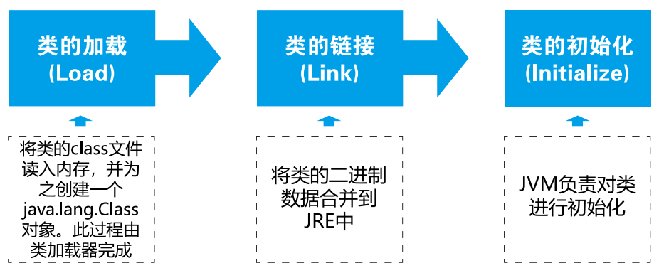
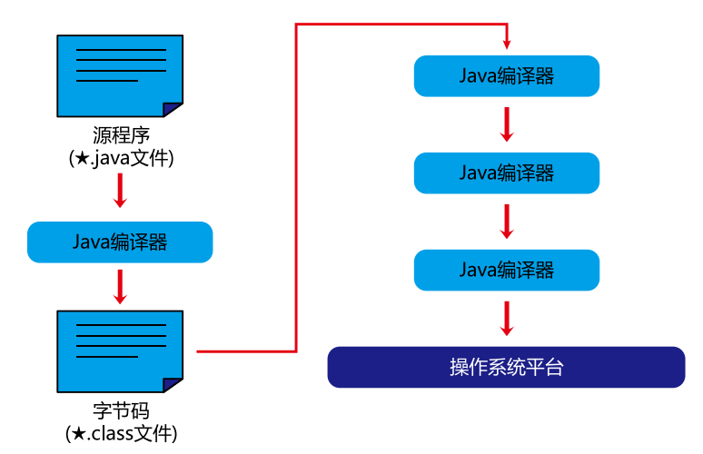
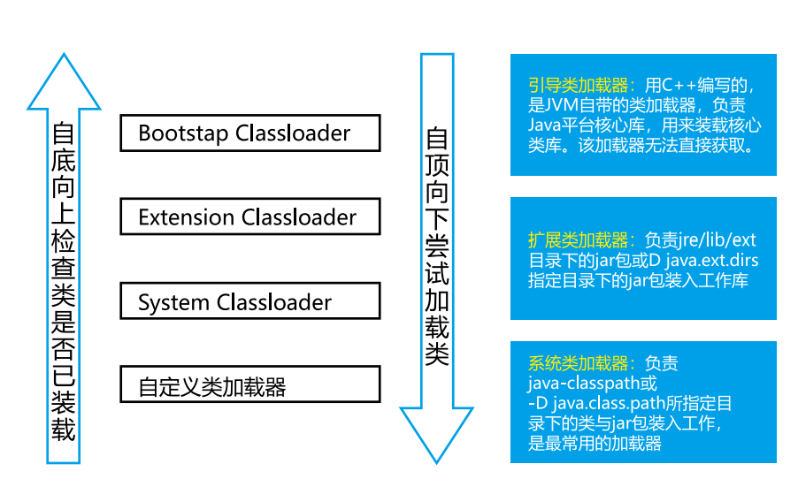

# 十五、反射与动态代理


## 15.1 Java反射机制概述

Ref lection（反射）是被视为动态语言的关键，反射机制允许程序在执行期借助于 Ref lection API 取得任何类的内部信息，并能直接操作任意对象的内部属性及方法。

加载完类之后，在堆内存的方法区中就产生了一个Class 类型的对象（一个类只有一个 Class 对象），这个对象就包含了完整的类的结构信息。我们可以通过这个对象看到类的结构。这个对象就像一面镜子，透过这个镜子看到类的结构，所以，我们形象的称之为：反射。

**<u>*动态语言：*</u>**

是一类在运行时可以改变其结构的语言：例如新的函数、对象、甚至代码可以被引进，已有的函数可以被删除或是其他结构上的变化。通俗点说就是在运行时代码可以根据某些条件改变自身结构。主要动态语言：Object-C、C#、JavaScript、PHP、Python、Erlang。

**<u>静态语言：</u>**

与动态语言相对应的，运行时结构不可变的语言就是静态语言。如 Java、C、C++。

Java 不是动态语言，但 Java 可以称之为“准动态语言”。即 Java 有一定的动态性，我们可以利用反射机制、字节码操作获得类似动态语言的特性。Java 的动态性让编程的时候更加灵活！  

**<u>*Java 反射机制提供的功能：*</u>**

- 在运行时判断任意一个对象所属的类
- 在运行时构造任意一个类的对象
- 在运行时判断任意一个类所具有的成员变量和方法
- 在运行时获取泛型信息
- 在运行时调用任意一个对象的成员变量和方法
- 在运行时处理注解
- 生成动态代理

**<u>*反射相关的主要 API：*</u>**

- `java.lang.Class`: 代表一个类
- `java.lang.reflect.Method`: 代表类的方法
- `java.lang.reflect.Field`: 代表类的成员变量
- `java.lang.reflect.Constructor`: 代表类的构造器 


### 15.1.1 反射示例

```java
public class Person {
    private String name;
    public int age;

    public String getName() {
        return name;
    }

    public void setName(String name) {
        this.name = name;
    }

    public int getAge() {
        return age;
    }

    public void setAge(int age) {
        this.age = age;
    }

    public Person() {
    }

    public Person(String name, int age) {
        this.name = name;
        this.age = age;
    }

    private Person(String name) {
        this.name = name;
    }

    @Override
    public String toString() {
        return "Person{" + "name='" + name + '\'' + ", age=" + age + '}';
    }

    public void show() {
        System.out.println(" 你好，我是" + name);
    }

    private String showNation(String nation) {
        System.out.println(" 喷子实在太多了！！！ " + nation);
        return nation;
    }
}
```

```java
import org.testng.annotations.Test;
import java.lang.reflect.Constructor;
import java.lang.reflect.Field;
import java.lang.reflect.InvocationTargetException;
import java.lang.reflect.Method;

public class ReflectionTest {
    // 反射之前，对于 Person 的操作
    @Test
    public void test() {
        // 1. 创建类的对象
        Person p1 = new Person("jay", 21);
        // 2. 调用对象 , 调用其内部的属性和方法
        p1.age = 15;
        System.out.println(p1.toString());
        p1.show();
        // 在 Person 类的外部，不可以通过 Person 类的对象调用其内部私有的结构。
        // 比如：name、showNation 以及私有的构造器。
    }

    // 反射之后 ，堆与 Person 的操作
    @Test
    public void test2() throws NoSuchMethodException, IllegalAccessException,
            InvocationTargetException, InstantiationException, NoSuchFieldException {
        Class clazz = Person.class;
        // 1. 通过反射，创建 Person 类的对象
        Constructor cons = clazz.getConstructor(String.class, int.
                class);
        Object obj = cons.newInstance("Jon", 18);
        Person p = (Person) obj;
        System.out.println(p.toString());
        // 2. 通过反射，调用对象指定的属性和方法
        // 调用属性
        Field age = clazz.getDeclaredField("age");
        age.set(p, 10);
        System.out.println(p.toString());
        // 调用方法
        Method show = clazz.getDeclaredMethod("show");
        show.invoke(p);
    }
}
```


### 15.1.2 调用类的私有结构

```java
public class ReflectionTest {
    // 反射之后 ，堆与 Person 的操作
    @Test
    public void test2() throws NoSuchMethodException, IllegalAccessException,
            InvocationTargetException, InstantiationException, NoSuchFieldException {
        Class clazz = Person.class;
        // 1. 通过反射，创建 Person 类的对象
        Constructor cons = clazz.getConstructor(String.class, int.
                class);
        Object obj = cons.newInstance("Jon", 18);
        Person p = (Person) obj;
        System.out.println(p.toString());
        // 2. 通过反射，调用对象指定的属性和方法
        // 调用属性
        Field age = clazz.getDeclaredField("age");
        age.set(p, 10);
        System.out.println(p.toString());
        // 调用方法
        Method show = clazz.getDeclaredMethod("show");
        show.invoke(p);

        System.out.println("+++++++++++++++++++++++");
        // 通过反射，是可以调用 Person 类的私有结构的。比如：私有的构造器、方法、属性
        // 调用私有的构造器
        Constructor cons2 = clazz.getDeclaredConstructor(String.class);
        cons2.setAccessible(true);
        Person p1 = (Person) cons2.newInstance("kalo");
        System.out.println(p1);
        // 调用私有的属性
        Field name = clazz.getDeclaredField("name");
        name.setAccessible(true);
        name.set(p1, "Taoyao");
        System.out.println(p1);
        // 调用私有的方法
        Method showNation = clazz.getDeclaredMethod("LiNin",
                String.class);
        showNation.setAccessible(true);
        String nation = (String) showNation.invoke(p1, "FaceBook");
        // 相当于 String nation = p1.showNation("FaceBook")
        System.out.println(nation);
    }
}
```


## 15.2 理解Class类并获取Class示例


### 15.2.1 Class类的理解

关于 java.lang.Class 类的理解

1. 类的加载过程：
   - 程序经过 Javac.exe 命令后，会生成一个或多个字节码文件(.class 结尾 )；
   - 接着我们使用 java.exe 命令对某个字节码文件进行解释运行；
   - 相当于将某个字节码文件加载到内存中。此过程就称为类的加载。加载到内存中的类，我们就称为运行时类，此运行时类，就作为 Class 的一个实例。
2. 换句话说，Class 的实例就对应着一个运行时类。
3. 加载到内存中的运行时类，会缓存一定的时间。**<u>在此时间之内，我们可以通过不同的方式来获取此运行时类</u>**；

  


### 15.2.2 获取Class实例的4种方式

```java
@Test
public void test3() throws ClassNotFoundException {
    // 方式一：
    Class c1 = Person.class;
    System.out.println(c1);
    // 方式二：通过运行时类的对象 , 调用 getClass()
    Person p1 = new Person();
    Class c2 = p1.getClass();
    System.out.println(c2);
    // 方式三：调用 Class 的静态方法：forName(String classPath)
    Class c3 = Class.forName("www.gh110.com");
    // c3 = Class.forName("www.123.com");
    System.out.println(c3);
    System.out.println(c1 == c2);
    System.out.println(c1 == c3);
    // 方式四：使用类的加载器：ClassLoader ( 了解 )
    ClassLoader classLoader = ReflectionTest.class.getClassLoader();
    Class c4 = classLoader.loadClass("www.gh110.com");
    System.out.println(c4);
    System.out.println(c1 == c4);
}
```


### 15.2.3 Class实例对应的结构的说明

- `class`：外部类，成员 ( 成员内部类，静态内部类 )，局部内部类，匿名内部类；
- `interface`：接口；
- `[]`：数组；
- `enum`：枚举；
- `annotation`：注解 `@interface`；
- `primitivetype`：基本数据类型；
- `void`  ；

```java
// Class 实例可以是哪些结构的说明：
@Test
public void test4() {
    Class s1 = Object.class;
    Class s2 = Comparable.class;
    Class s3 = String[].class;
    Class s4 = int[][].class;
    Class s5 = ElementType.class;
    Class s6 = Override.class;
    Class s7 = int.class;
    Class s8 = void.class;
    Class s9 = Class.class;
    int[] a = new int[10];
    int[] b = new int[100];
    Class s10 = a.getClass();
    Class s11 = b.getClass();
    // 只要数组的元素类型与维度一样，就是同一个 Class
    System.out.println(s10 == s11);
}
```


## 15.3 类的加载与ClassLoader的理解


### 15.3.1 类的加载过程

当程序主动使用某个类时，如果该类还未被加载到内存中，则系统会通过如下三个步骤来对该类进行初始化。  



- 加载：将 `class` 文件字节码内容加载到内存中，并将这些静态数据转换成方法区的运行时数据结构，然后生成一个代表这个类的 `java.lang.Class` 对象，作为方法区中类数据的访问入口（即引用地址）。所有需要访问和使用类数据只能通过这个 Class 对象。这个加载的过程需要类加载器参与；
- 链接：将 Java 类的二进制代码合并到 JVM 的运行状态之中的过程；
  - 验证：确保加载的类信息符合 JVM 规范，例如：以 cafe 开头，没有安全方面的问题；
  - 准备：正式为类变量（static）分配内存并设置类变量默认初始值的阶段，这些内存都将在方法区中进行分配；
  - 解析：虚拟机常量池内的符号引用（常量名）替换为直接引用（地址）的过程；
- 初始化：
  - 执行类构造器 () 方法的过程。类构造器 () 方法是由编译期自动收集类中所有类变量的赋值动作和静态代码块中的语句合并产生的。（类构造器是构造类信息的，不是构造该类对象的构造器）；
  - 当初始化一个类的时候，如果发现其父类还没有进行初始化，则需要先触发其父类的初始化；
  - 虚拟机会保证一个类的 () 方法在多线程环境中被正确加锁和同步；


### 15.3.2 什么时候会发生类初始化

- 类的主动引用（一定会发生类的初始化）
  - 当虚拟机启动，先初始化 main 方法所在的类；
  - new 一个类的对象；
  - 调用类的静态成员（除了 final 常量）和静态方法；
  - 使用 java.lang.reflect 包的方法对类进行反射调用；
  - 当初始化一个类，如果其父类没有被初始化，则先会初始化它的父类；
- 类的被动引用（不会发生类的初始化）
  - 当访问一个静态域时，只有真正声明这个域的类才会被初始化；
  - 当通过子类引用父类的静态变量，不会导致子类初始化；
  - 通过数组定义类引用，不会触发此类的初始化；
  - 引用常量不会触发此类的初始化（常量在链接阶段就存入调用类的常量池中了）；


### 15.3.3 ClassLoader的理解



- 类加载器的作用：
  - 类加载的作用：将 class 文件字节码内容加载到内存中，并将这些静态数据转换成方法区的运行时数据结构，然后在堆中生成一个代表这个类java.lang.Class 对象，作为方法区中类数据的访问入口；
  - 类缓存：标准的 JavaSE 类加载器可以按要求查找类，但一旦某个类被加载到类加载器中，它将维持加载（缓存）一段时间。不过 JVM 垃圾回收机制可以回收这些 Class 对象；
- 类加载器作用是用来把类 (class) 装载进内存的。JVM规范定义了如下类型的类的加载器 ；



 ```java
 import org.testng.annotations.Test;
 
 public class ClassLoaderTest {
     @Test
     public void test1() {
         // 对于自定义类，使用系统类加载器进行加载
         ClassLoader classLoader = ClassLoaderTest.class.getClassLoader();
         System.out.println(classLoader);
         // 调用系统类加载器的 getParent()：获取扩展类加载器
         ClassLoader classLoader1 = classLoader.getParent();
         System.out.println(classLoader1);
         // 调用扩展类加载器的 getParent()：无法获取引导类加载器
         // 引导类加载器主要负责加载 java 的核心类库，无法加载自定义类的。
         ClassLoader classLoader2 = classLoader1.getParent();
         System.out.println(classLoader2);
         ClassLoader classLoader3 = String.class.getClassLoader();
         System.out.println(classLoader3);
     }
 }
 ```


### 15.3.4 使用ClassLoader加载配置文件

```java
import org.testng.annotations.Test;

import java.io.InputStream;
import java.util.Properties;

public class ClassLoaderTest {
    // Properties：用来读取配置文件。
    @Test
    public void test2() throws Exception {
        Properties pros = new Properties();
        // 此时的文件默认在当前的 module 下。
        // 读取配置文件的方式一：
        // FileInputStream fis = new FileInputStream("jdbc.properties");
        // pros.load(fis);
        // 读取配置文件的方式二：使用 ClassLoader
        // 配置文件默认识别为：当前 module 的 src 下
        ClassLoader classLoader = ClassLoaderTest.class.getClassLoader();
        InputStream is = classLoader.getResourceAsStream("jdbc1.properties");
        pros.load(is);
        String user = pros.getProperty("user");
        String password = pros.getProperty("password");
        System.out.println("user = " + user + ",password = "+password);
    }
}
```


## 15.4 创建运行时类的对象

`newInstance()`：调用此方法，创建对应的运行时类的对象。内部调用了运行时类的空参的构造器。

- 要想此方法正常的创建运行时类的对象，要求：
  - 运行时类必须提供空参的构造器；
  - 空参的构造器的访问权限得够。通常，设置为 public；
- 在 javabean 中要求提供一个 public 的空参构造器。原因：
  - 便于通过反射，创建运行时类的对象；
  - 便于子类继承此运行时类时，默认调用 super() 时，保证父类有此构造器；  

```java
import org.testng.annotations.Test;

import java.util.Random;

public class NewInstanceTest {
    @Test
    public void test() throws Exception {
        Class<Person> clazz = Person.class;
        Person obj = clazz.newInstance();
        System.out.println(obj);
    }

    @Test
    public void test2() {
        for (int i = 0; i < 100; i++) {
            int num = new Random().nextInt(3);// 0,1,2
            String classPath = "";
            switch (num) {
                case 0:
                    classPath = "java.util.Date";
                    break;
                case 1:
                    classPath = "java.lang.Object";
                    break;
                case 2:
                    classPath = "www.java.Person";
                    break;
            }
            try {
                Object obj = getInstance(classPath);
                System.out.println(obj);
            } catch (Exception e) {
                e.printStackTrace();
            }
        }
    }
    
    // 创建一个指定类的对象。 classPath: 指定类的全类名
    public Object getInstance(String classPath) throws Exception {
        Class clazz = Class.forName(classPath);
        return clazz.newInstance();
    }
}
```


## 15.5 获取运行时类的完整结构

抽象Creature类

```java
import java.io.Serializable;

public abstract class Creature implements Serializable {
    private char gender;
    public double weight;

    private void breath() {
        System.out.println(" 太阳系 ");
    }
    public void eat() {
        System.out.println(" 银河系 ");
    }
}
```

接口MyInterface

```java
public interface MyInterface {
    void info();
}
```

注解MyAnnotation

```java
import java.lang.annotation.Retention;
import java.lang.annotation.RetentionPolicy;
import java.lang.annotation.Target;

import static java.lang.annotation.ElementType.*;

@Target({ TYPE, FIELD, METHOD, PARAMETER, CONSTRUCTOR, LOCAL_VARIABLE })
@Retention(RetentionPolicy.RUNTIME)

public @interface MyAnnotation {
    String value() default "hello world";
}
```

Person类

```java
@MyAnnotation(value = "java")
public class Person extends Creature<String> implements
        Comparable<String>, MyInterface {
    private String name;
    int age;
    public int id;
    public Person() {
    }
    @MyAnnotation(value = "C++")
    Person(String name) {
        this.name = name;
    }
    private Person(String name, int age) {
        this.name = name;
        this.age = age;
    }
    @MyAnnotation
    private String show(String nation) {
        System.out.println(" 我来自 " + nation + " 星系 ");
        return nation;
    }
    @Override
    public void info() {
        System.out.println(" 火星喷子 ");
    }
    public String display(String play) {
        return play;
    }
    @Override
    public int compareTo(String o) {
        return 0;
    }
}
```

### 15.5.2 获取运行时类的属性结构及其内部结构

```java
import org.testng.annotations.Test;

import java.lang.reflect.Field;
import java.lang.reflect.Modifier;

public class FieldTest {
    @Test
    public void test() {
        Class clazz = Person.class;
        // 获取属性结构
        // getFields(): 获取当前运行时类及其父类中声明为 public 访问权限的属性
        Field[] fields = clazz.getFields();
        for (Field f : fields) {
            System.out.println(f);
        }
        System.out.println("++++++++++++++++++");
        // getDeclaredFields(): 获取当前运行时类中声明的所有属性。（不包含父类中声明的属性）
        Field[] declaredFields = clazz.getDeclaredFields();
        for (Field f : declaredFields) {
            System.out.println(f);
        }
    }
    
    @Test // 权限修饰符 数据类型 变量名
    public void test2() {
        Class clazz = Person.class;
        Field[] declaredFields = clazz.getDeclaredFields();
        for (Field f : declaredFields) {
            // 1. 权限修饰符
            int modifier = f.getModifiers();
            System.out.print(Modifier.toString(modifier) + "\t");
            System.out.println("++++++++++++++++++++");
            // 2. 数据类型
            Class type = f.getType();
            System.out.print(type.getName() + "\t");
            System.out.println("***************************");
            // 3. 变量名
            String fName = f.getName();
            System.out.print(fName);
        }
    }
}
```

### 15.5.3 获取运行时类的方法结构和内部结构

```java
import org.testng.annotations.Test;

import java.lang.annotation.Annotation;
import java.lang.reflect.Method;
import java.lang.reflect.Modifier;

public class MethodTest {
    @Test
    public void test() {
        Class clazz = Person.class;
        // getMethods(): 获取当前运行时类及其所有父类中声明为public 权限的方法
        Method[] methods = clazz.getMethods();
        for (Method m : methods) {
            System.out.println(m + "****");
        }
        System.out.println("++++++++++++++++++++++++");
        // getDeclaredMethods(): 获取当前运行时类中声明的所有方法。（不包含父类中声明的方法）
        Method[] declaredMethods = clazz.getDeclaredMethods();
        for (Method m : declaredMethods) {
            System.out.println(m);
        }
    }

    // 权限修饰符 返回值类型 方法名 ( 参数类型 1 形参名 1,...) throws XxxException{}
    @Test
    public void test2() {
        Class clazz = Person.class;
        Method[] declaredMethods = clazz.getDeclaredMethods();
        for (Method m : declaredMethods) {
            // 1. 获取方法声明的注解
            Annotation[] annos = m.getAnnotations();
            for (Annotation a : annos) {
                System.out.println(a + "KKKK");
            }
            // 2. 权限修饰符
            System.out.print(Modifier.toString(m.getModifiers()) + "\t");
            // 3. 返回值类型
            System.out.print(m.getReturnType().getName() + "\t");
            // 4. 方法名
            System.out.print(m.getName());
            System.out.print("(");
            // 5. 形参列表
            Class[] pTs = m.getParameterTypes();
            if (!(pTs == null && pTs.length == 0)) {
                for (int i = 0; i < pTs.length; i++) {
                    if (i == pTs.length - 1) {
                        System.out.print(pTs[i].getName() + "args_" + i);
                        break;
                    }
                    System.out.print(pTs[i].getName() + " args_"
                            + i + ",");
                }
            }
            System.out.print(")");
            // 6. 抛出的异常
            Class[] eTs = m.getExceptionTypes();
            if (eTs.length > 0) {
                System.out.print("throws ");
                for (int i = 0; i < eTs.length; i++) {
                    if (i == eTs.length - 1) {
                        System.out.print(eTs[i].getName());
                        break;
                    }
                    System.out.print(eTs[i].getName() + ",");
                }
            }
            System.out.println("TQA");
        }
    }
}
```


### 15.5.4 获取运行时类的其他内容

```java
import org.testng.annotations.Test;

import java.lang.annotation.Annotation;
import java.lang.reflect.Constructor;
import java.lang.reflect.ParameterizedType;
import java.lang.reflect.Type;

public class OtherTest {
    //获取构造器
    @Test
    public void test() {
        Class clazz = Person.class;
        // getConstructors(): 获取当前运行时类中声明为 public 的构造器
        Constructor[] constructors = clazz.getConstructors();
        for (Constructor c : constructors) {
            System.out.println(c);
        }
        System.out.println("************************");
        // getDeclaredConstructors(): 获取当前运行时类中声明的所有的构造器
        Constructor[] declaredConstructors = clazz.getDeclaredConstructors();
        for (Constructor c : declaredConstructors) {
            System.out.println(c);
        }
    }

    // 获取运行时类的父类
    @Test
    public void test2() {
        Class clazz = Person.class;
        Class superclass = clazz.getSuperclass();
        System.out.println(superclass);
    }

    // 获取运行时类的带泛型的父类
    @Test
    public void test3() {
        Class clazz = Person.class;
        Type genericSuperclass = clazz.getGenericSuperclass();
        System.out.println(genericSuperclass);
    }

    // 获取运行时类的带泛型的父类的泛型
    @Test
    public void test4() {
        Class clazz = Person.class;
        Type genericSuperclass = clazz.getGenericSuperclass();
        ParameterizedType paramType = (ParameterizedType) genericSuperclass;
        // 获取泛型类型
        Type[] actualTypeArguments = paramType.
                getActualTypeArguments();
        // System.out.println(actualTypeArguments[0].getTypeName());
        System.out.println(((Class) actualTypeArguments[0]).getName());
    }

    // 获取运行时类实现的接口
    @Test
    public void test5() {
        Class clazz = Person.class;
        Class[] interfaces = clazz.getInterfaces();
        for (Class c : interfaces) {
            System.out.println(c);
        }
        System.out.println("++++++++++++++++++++++");
// 获取运行时类的父类实现的接口
        Class[] interfaces1 = clazz.getSuperclass().getInterfaces();
        for (Class c : interfaces1) {
            System.out.println(c);
        }
    }

    // 获取运行时类所在的包
    @Test
    public void test6() {
        Class clazz = Person.class;
        Package pack = clazz.getPackage();
        System.out.println(pack);
    }

    // 获取运行时类声明的注解
    @Test
    public void test7() {
        Class clazz = Person.class;
        Annotation[] annotations = clazz.getAnnotations();
        for (Annotation annos : annotations) {
            System.out.println(annos);
        }
    }
}
```


## 15.6 调用运行时类的指定结构


### 15.6.1 调用运行时类中的指定属性

```java
public class ReflectionTest {
    @Test
    public void testField() throws Exception {
        Class clazz = Person.class;
        // 创建运行时类的对象
        Person p = (Person) clazz.newInstance();
        // 获取指定的属性：要求运行时类中属性声明为 public
        // 通常不采用此方法
        Field id = clazz.getField("id");
        // 设置当前属性的值
        // set(): 参数 1：指明设置哪个对象的属性 参数 2：将此属性值设置为多少
        id.set(p, 1001);
        // 获取当前属性的值
        // get(): 参数 1：获取哪个对象的当前属性值
        int pId = (int) id.get(p);
        System.out.println(pId);
    }
    
    // 如何操作运行时类中的指定的属性 -- 需要掌握
    @Test
    public void testField1() throws Exception {
        Class clazz = Person.class;
        // 创建运行时类的对象
        Person p = (Person) clazz.newInstance();
        // 1. getDeclaredField(String fieldName): 获取运行时类中指定变量名的属性
        Field name = clazz.getDeclaredField("name");
        // 2. 保证当前属性是可访问的
        name.setAccessible(true);
        // 3. 获取、设置指定对象的此属性值
        name.set(p, "Jam");
        System.out.println(name.get(p));
    }
}
```


### 15.6.2 调用运行时类中的指定方法

```java
public class ReflectionTest {
    // 如何操作运行时类中的指定的方法 -- 需要掌握
    @Test
    public void testMethod() throws Exception {
        Class clazz = Person.class;
        // 创建运行时类的对象
        Person p = (Person) clazz.newInstance();
        // 1. 获取指定的某个方法
        // getDeclaredMethod(): 参数 1 ：指明获取的方法的名称 参数 2：指明获取的方法的形参列表
        Method show = clazz.getDeclaredMethod("show", String.class);
        // 2. 保证当前方法是可访问的
        show.setAccessible(true);
        // 3. 调用方法的 invoke(): 参数 1：方法的调用者 参数 2：给方法形参赋值的实参
        // invoke() 的返回值即为对应类中调用的方法的返回值。
        Object returnValue = show.invoke(p, "CCA");
        // String nation = p.show("CCA");
        System.out.println(returnValue);
        System.out.println("+++++++++ 如 何 调 用 静 态 方 法+++++++++++");
        // private static void showDesc()
        Method showDesc = clazz.getDeclaredMethod("showDown");
        showDesc.setAccessible(true);
        // 如果调用的运行时类中的方法没有返回值，则此 invoke() 返回 null
        // Object returnVal = showDesc.invoke(null);
        Object returnVal = showDesc.invoke(Person.class);
        System.out.println(returnVal); // null
    }
}
```

### 15.6.3 调用运行时类中的指定构造器

```java
public class ReflectionTest {
    // 如何调用运行时类中的指定的构造器
    @Test
    public void testConstructor() throws Exception {
        Class clazz = Person.class;
        // private Person(String name)
        // 1. 获取指定的构造器
        // getDeclaredConstructor(): 参数：指明构造器的参数列表
        Constructor constructor = clazz.getDeclaredConstructor(String.class);
        // 2. 保证此构造器是可访问的
        constructor.setAccessible(true);
        // 3. 调用此构造器创建运行时类的对象
        Person per = (Person) constructor.newInstance("Tom");
        System.out.println(per);
    }
}
```


