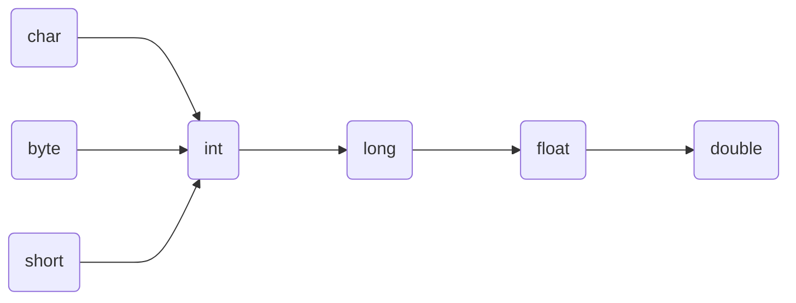

# 二、JAVA基本语法


## 2.1 关键词与保留字


### 2.1.1 关键字


### 2.1.2 保留字

- 现有Java版本尚未使用，自己命名标识符避免使用保留字`goto`、`const`


## 2.2 标识符

- Java对各种变量、方法和类等要素命名时使用的字符序列称为标识符；
- **凡是自己可以起名字的地方都叫标识符**


## 2.3 变量


### 2.3.1 概念&声明

1. 概念
   - 内存中的一个存储区域；该区域数据可以在一定范围内不断变化；变量是程序中最基本的存储单元。


2. 声明
   - `<数据类型> <变量名称>`


### 2.3.2 基本数据类型

$$
\text{数据类型}
\begin{cases}
{基本数据类型\\(primitive\ type)}{
\begin{cases}
数值型{
\begin{cases}
整数类型(byte,short,int,long)\\
\\
浮点类型(float,double)
\end{cases}
}\\
\\
字符型(char)\\
\\
布尔型(boolean)
\end{cases}
}\\
\\
引用数据类型(reference\ type){
\begin{cases}
类(class)\\
\\
接口(interface)\\
\\
数组([\ ])
\end{cases}
}\\
\end{cases}
$$


#### 1.整数类型

- `byte, short, int, long`；
- 整数默认为`int`型，`long`声明须后加`'l'或'L'`；

| 类型  |   占用空间   |        表数范围        |
| :---: | :----------: | :--------------------: |
| byte  | 1字节=8bit位 |       -128 ~ 127       |
| short |    2字节     |     -2^15 ~ 2^15-1     |
|  int  |    4字节     | -2^31 ~ 2^31-1(约21亿) |
| long  |    8字节     |     -2^63 ~ 2^63-1     |


#### 2.浮点类型

- `float, double`；
- 浮点数默认为`double`型，`float`声明须后加`'f'或'F'`；

|  类型  | 占用空间 |        表数范围        |
| :----: | :------: | :--------------------: |
| float  |  4字节   |  -3.403E38 ~ 3.403E38  |
| double |  8字节   | -1.798E308 ~ 1.798E308 |


#### 3.字符类型

- `char`
- 2字节


#### 4.布尔类型

- `boolean`
- **不可用`0`和非`0`的整数数代替`true`和`flase`**；


### 2.3.3 基本数据类型转换

- 容量小的类型自动转换位容量大的数据类型；




### 2.3.4 强制类型转换

- 自动类型转换的逆过程，将容量大的数据类型转换为容量小的数据类型。使用时要加上强制转换符：`(<数据类型>)`，但可能造成精度降低或溢出, 格外要注意。


## 2.4 进制

- 所有数字在计算机底层都以二进制形式存在；
- 对于整数，有四种表示方式：
  - 二进制(binary)：0,1 ，满2 进1. 以0b 或0B 开头；
  - 十进制(decimal)：0-9 ，满10 进1；
  - 八进制(octal)：0-7 ，满8 进1. 以数字0 开头表示；
  - 十六进制(hex)：0-9及A-F，满16 进1. 以0x 或0X开头表示。此处的A-F，不区分大小写。如：0x21AF +1= 0X21B0；


## 2.5 运算符


### 2.5.1 算数运算符


### 2.5.2 赋值运算符

- 当`=`两侧数据类型不一致时，可以使用自动类型转换或使用强制类型转换原则进行处理；


### 2.5.3 比较运算符


### 2.5.4 逻辑运算符

- `&`—逻辑与
- `|`—逻辑或
- `！`—逻辑非
- `&&` —短路与
- `||`—短路或
- `^` —逻辑异或


### 2.5.5 位运算符


### 2.5.6 三元运算符

- `( 条件表达式) ？表达式1 : 表达式2`


## 2.6 运算符的优先级


## 2.7 程序流程控制

- 流程控制语句是用来控制程序中各语句执行顺序的语句，可以把语句组合成能完成一定功能的小逻辑模块；


## 2.8 分支语句

### if-else 结构

```java
if(条件表达式1){
    执行1;
}else if(条件表达式2){
    执行2;
}
......
 else{
    执行n;
}
```


### switch-case结构

```java
switch(表达式1){
    case 常量1:
        语句1;
        //break;
    case 常量2:
        语句2;
        //break;
    ......
    case 常量n:
        语句n;
        //break;
    default:
        语句;
        //break;
            
}
```


## 2.9 循环结构


### for循环

```java
for( ①初始化部分; ②循环条件部分; ④迭代部分)｛
③循环体部分;
｝
```


- 执行过程：① - ② - ③ - ④ - ② - ③ - ④ - ② - ③ - ④ -.....- ②


### while 循环

```java
①初始化部分
while( ②循环条件部分){
③循环体部分;
④迭代部分;
}
```

- 执行过程：① - ② - ③ - ④ - ② - ③ - ④ - ② - ③ - ④ -⋯- ②


### do-while 循环

```java
①初始化条件;
do{
③循环体;
④迭代条件;
}while(②循环条件);
```

- 执行过程：① - ③ - ④ - ② - ① - ③ - ④ - ... - ②


### 嵌套循环结构

- 将一个循环放在另一个循环体内，就形成了嵌套循环；


## 2.10 break & continue & return


### break

```java
{
......
break;
......
}
```


### continue

- continue **只能使用**在循环结构中；

 - continue 语句用于跳过其所在循环语句块的一次执行，继续下一次循环；
 - continue 语句出现在多层嵌套的循环语句体中时，可以通过标签指明要跳过的是哪一层循环；


### return

- 并非专门用于结束循环的，它的功能是结束一个方法。当一个方法执行到一个return 语句时，这个方法将被结束；


