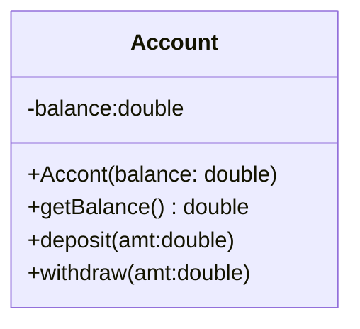

# 四、面向对象——类及类的成员


## 4.1 面向过程（POP）与面向对象（OOP）

- 面向过程：Procedure Oriented Programming
  - 强调的是功能行为，以函数为最小单位，考虑怎么做；
- 面向对象：Object Oriented Programming
  - 强调具备了功能的对象，以类/ 对象为最小单位，考虑谁来做；


## 4.2 类和对象

- 类：对一类事物的描述，是抽象的，概念上的定义；
- 对象：是实际存在的该类事物的每个个体，因而也称为实例（instance）；


### 4.2.1 Java类及类的成员

- 属性：对应类中的成员变量；
- 行为：对应类中的成员方法；


### 4.2.2 类与对象的创建及使用

- 设计类，就是设计类的成员
  - 属性 == 成员变量 == field == 域、字段；
  - 方法 == 成员方法 == 函数 == method；
  - 创建类的对象 == 类的实例化 == 实例化类；
- 类和对象的使用（面向对象思想落地的实现）
  - 创建类，设计类成员；
  - 创建类的对象；
  - 通过“对象·属性”或“对象·方法”调用对象的结构；
- 如果创建了一个类的多个对象，则每个对象都独立拥有一套类的属性（非static）
  - 意味着：如果我们修改一个对象的属性a，则不影响另外一个对象属性a 的值；


### 4.2.3 内存解析

- **堆（Heap）**：此内存区域的***唯一目的***就是存放对象实例，几乎所有的对象实例都在这里分配内存。这一点在 Java 虚拟机规范中的描述是：所有的对象实例以及数组都要在堆上分配；
- **栈（Stack）**：是指虚拟机栈。虚拟机栈用于存储局部变量等。局部变量表存放了编译期可知长度的各种基本数据类型（boolean、byte、char、short、int、float、long、double）、对象引用（reference 类型，它不等同于对象本身，是对象在堆内存的首地址）。方法执行完，自动释放；
- **方法区（MethodArea）**：用于存储已被虚拟机加载的类信息、常量、**静态变量**、即时编译器编译后的代码等数据。


## 4.3 类成员之一：属性

***属性（成员变量） VS 局部变量***

1. 相同点

   ① 定义变量的格式：数据类型 变量名 = 变量值；
   ② 先声明，后使用；
   ③ 变量都有其对应的作用域；

2. 不同点

   **① 在类中声明的位置不同：**
   属性：直接定义在类的一对{} 内；

   局部变量：声明在方法内、方法形参、代码块内、构造器内部的变量；

   

   **② 关于权限修饰符的不同：**

   属性：可以在声明属性是，指明其权限，使用权限修饰符。常用的权限修饰符：private、public、缺省、protected -> 封装性
   目前声明属性是都可以使用缺省；
   局部变量：不可以使用权限修饰符；

   

   **③ 默认初始化值的情况：**
   属性：类的属性，根据其类型都有默认初始化值：
   	整形（byte / short / int / long）：0
   	浮点型（float / double ）：0.0
   	字符型（char）：0 或（' /u0000 '）
   	布尔型（boolean）：false
   	引用数据类型（类、数组、接口）：null
   局部变量：没有默认初始化值。
   	意味着：我们在调用局部变量之前，一定要显示赋值；
   	引用地：形参在调用时，赋值即可。

   

   **④ 在内存加载中的位置：**
   属性：加载到堆空间中（非static）；
   局部变量：加载到栈空间中。


## 4.4 类成员之二：方法


### 4.4.1 类方法的声明和使用

- ***声明***
  - `<(权限修饰符)> <返回值类型> <方法名(形参列表)>{方法体;}`
- ***使用***

```java
public class CustomerTest {
    public static void main(String[] args) {
        Customer cust1 = new Customer();
        cust1.eat();
        // 测试形参是否需要设置的问题
        // int[] arr = new int[]{3,4,5,2,5};
        // cust1.sort();
        cust1.sleep(8);
        }
}

// 客户类
class Customer{
    // 属性
    String name;
    int age;
    boolean isMale;
    // 方法
    public void eat(){
        System.out.println(" 客户吃饭");
        return;
        //return 后不可以声明表达式
        // System.out.println("hello");
    }
    public void sleep(int hour){
        System.out.println(" 休息了" + hour + " 个小时");
        eat();
        // sleep(10);
    }
    public String getName(){
        if(age > 18){
            return name;
        }else{
            return "Tom";
        }
    }
    public String getNation(String nation){
        String info = " 我的国籍是：" + nation;
        return info;
    }
    public void info(){
        // 错误的
        // public void swim(){
        // }
    }
}
```


### 4.4.2 万事万物皆对象

1. 在Java 语言范畴中，我们都将功能、结构等封装到类中，通过类的实例化，来调用具体的功能结构：
- Scanner，String 等；
- 文件：File；
- 网络资源URL；
2. 涉及到Java 语言前段Html，后端的数据库交互时，前后端的结构在Java 层面交互时，都体现为类，对象。


### 4.4.3 内存解析的说明

- 引用类型的变量，只能储存两类值：null 或地址值（含变量的类型）；


### 4.4.4 匿名对象的使用

- 理解：我们创建对象，没有显示的赋值给一个变量名，即为匿名对象；
- 匿名对象只能使用一次。


### 4.4.5 方法重载 (Over load)

- 在同一类中，允许存在一个以上的同名方法，只要他们的参数个数或者参数类型不同即可；
- 跟方法的权限修饰符、返回值类型、形参变量名、方法体都没有关系！

```java
// 如下4 个方法构成了重载
public int getSum(int i , int j ){
}
public double getSum(double d1 , double d2 ){
}
private void getSum(String s , int i ){
}
public void getSum(int i , String s ){
}
```


### 4.4.6 可变个数的形参

- JavaSE 5.0 中提供了Varargs(variable number of arguments) 机制，允许直接定义能和多个实参相匹配的形参。从而，可以用一种更简单的方式，来传递个数可变的实参；

```java
public class MethodArgs {
    public static void main(String[] args) {
        MethodArgs test = new MethodArgs();
        test.show(12);
        // test.show("hell0");
        // test.show("hello","world");
        // test.show();
        test.show(new String[] { "AA", "BB", "CC" });
    }
    
    public void show(int i) {
    }
    
    // public void show(String s){
    // System.out.println("show(String)");
    // }
    public void show(String... strs) {
        System.out.println("show(String ...strs)");
        for (int i = 0; i < strs.length; i++) {
        	System.out.println(strs[i]);
        }
    }
    
    // 此方法与上一方法不可共存
    // public void show(String[] strs){
    // }
    
    public void show(int i, String... strs) {
    }
}
```


### 4.4.7 方法参数值的传递机制

- 针对基本数据类型
  - 值传递机制：如果参数是基本数据类型，此时实参赋值给形参的是实参真是存储的数据值；
- 针对引用数据类型
  - 如果参数是引用数据类型，此时实参赋值给形参的是实参存储数据的地址值；


## 4.5 面向对象特征之一：封装与隐蔽


### 4.5.1 四种权限修饰符

|  修饰符   | 类内部 | 同一个包 | 不同包的子类 | 同一个工程 |
| :-------: | :----: | :------: | :----------: | :--------: |
|  private  |   ✓    |          |              |            |
|  (缺省)   |   ✓    |    ✓     |              |            |
| protected |   ✓    |    ✓     |      ✓       |            |
|  public   |   ✓    |    ✓     |      ✓       |     ✓      |


## 4.6 类成员之三：构造器


### 4.6.1 构造器的使用

```java
public class PersonTest {
public static void main(String[] args) {
    // 创建类的对象:new + 构造器
    Person p = new Person(); //Person() 这就是构造器
    p.eat();
    Person p1 = new Person("Tom");
    System.out.println(p1.name);
    }
}
class Person{
    // 属性
    String name;
    int age;
    
    // 构造器
    public Person(){
    	System.out.println("Person()......");
    }
    public Person(String n){
    	name = n;
    }
    public Person(String n,int a){
        name = n;
        age = a;
    }
    
    // 方法
    public void eat(){
    	System.out.println(" 人吃饭");
    }
    public void study(){
    	System.out.println(" 人学习");
    }
}
```


### 4.6.2 属性复制的过程

属性赋值的先后顺序
**① 默认初始化值；**
**② 显式初始化；**
**③ 构造器中赋值；**
**④ 通过" 对象. 方法" 或 “对象. 属性”的方式，赋值；**


### 4.6.3 JavaBean的使用

JavaBean 是一种 Java 语言写成的可重用组件。所谓 javaBean，是指符合如下标准的 Java 类：

- 类是公共的；
- 有一个无参的公共的构造器；
- 有属性，且有对应的 get、set 方法；


### 4.6.4 UML类图

- `+`表示 public 类型，`-` 表示 private 类型，`#` 表示 protected 类型；
- 方法的写法: 方法的类型(+、-) 方法名( 参数名：参数类型)：返回值类型；



## 4.7 关键字：this

- this 用来修饰、调用：属性、方法、构造器
- this 修饰属性和方法:
  - this 理解为：当前对象, 或当前正在创建的对象;
  - 在类的方法中，我们可以使用"this. 属性" 或"this. 方法" 的方式，
    调用当前对象属性或方法;
  - 通常情况下，我们都选择省略“this.”。特殊情况下，如果方法的形参和类的属性同名，我们必须显式的使用"this. 变量" 的方式，表明此变量是属性，而非形参；
  - 在类的构造器中，我们可以使用"this. 属性" 或"this. 方法" 的方式，调用正在创建的对象属性和方法；
  - 但是，通常情况下，我们都选择省略“this.”。特殊情况下，如果构造器的形参和类的属性同名，我们必须显式的使用"this. 变量" 的方式，表明此变量是属性，而非形参；
- **this 调用构造器**
  ① 我们可以在类的构造器中，显式的使用`this( 形参列表) ` 的方式，调用本类中重载的其他的构造器！
  ② 构造器中不能通过`this( 形参列表) ` 的方式调用自己；
  ③ 如果一个类中有n 个构造器，则最多有n -1 个构造器中使用了`this( 形参列表) `；
  ④ 规定：`this( 形参列表) ` 必须声明在类的构造器的首行！
  ⑤ 在类的一个构造器中，最多只能声明一个`this( 形参列表) `，用来调用其他构造器；


## 4.8 关键字：package、import


### 4.8.1 关键字—package

- 为了更好的实现项目中类的管理，提供包的概念；
- 使用 package 声明类或接口所属的包，声明在源文件的首行；
- 包：属于标识符，遵循标识符的命名规则、规范" 见名知意"；
- 每“.”一次, 就代表一层文件目录；

补充: 同一个包下，不能命名同名接口或同名类。不同包下，可以命名同名的接口、类。


***JDK 中主要的包介绍***

1. java.lang---- 包含一些 Java 语言的核心类， 如 String、Math、Integer、System 和 Thread，提供常用功能；
2. java.net---- 包含执行与网络相关的操作的类和接口；
3. java.io---- 包含能提供多种输入/ 输出功能的类；
4. java.util---- 包含一些实用工具类，如定义系统特性、接口的集合框架类、使用与日期日历相关的函数；
5. java.text---- 包含了一些 java 格式化相关的类；
6. java.sql---- 包含了 java 进行 JDBC 数据库编程的相关类/ 接口；
7. java.awt---- 包含了构成抽象窗口工具集（abstractwindowtoolkits）的多个类，这些类被用来构建和管理应用程序的图形用户界面(GUI)。B/S C/S；


### 4.8.2 MVC设计模式

- MVC 是常用的设计模式之一，将整个程序分为三个层次：***视图模型层，控制器层，数据模型层***。这种将程序输入输出、数据处理，以及数据的展示分离开来的设计模式使程序结构变的灵活而且清晰，同时也描述了程序各个对象间的通信方式，降低了程序的耦合性。


### 4.8.3 关键字——import

1. 在源文件中显式的使用import 结构导入指定包下的类、接口；
2. 声明在包的声明和类的声明之间；
3. 如果需要导入多个结构，则并列写出即可；
4. 可以使用"xxx.*" 的方式, 表示可以导入xxx 包下的所有结构；
5. 如果导入的类或接口是java.lang 包下的，或者是当前包下的，则可以省略此import 语句；
6. 如果在代码中使用不同包下的同名的类。那么就需要使用类的全类名的方式指明调用的是哪个类；
7. 如果已经导入java.a 包下的类。那么如果需要使用a 包的子包下的类的话，仍然需要导入；
8. import static 组合的使用：调用指定类或接口下的静态的属性或方法；


