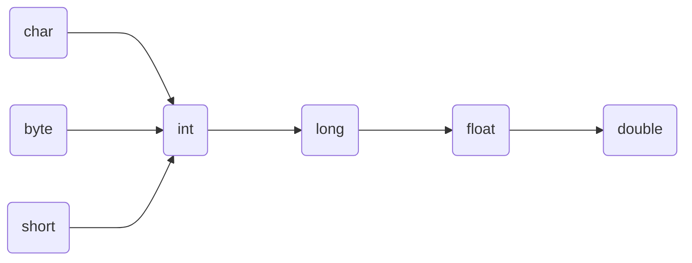
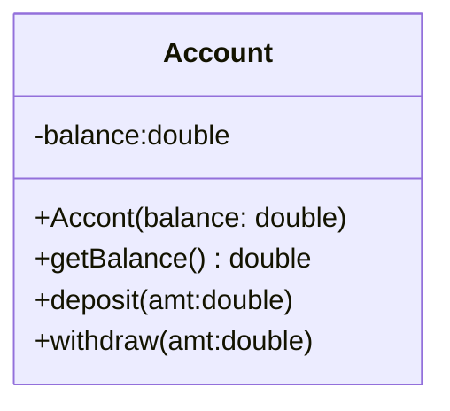
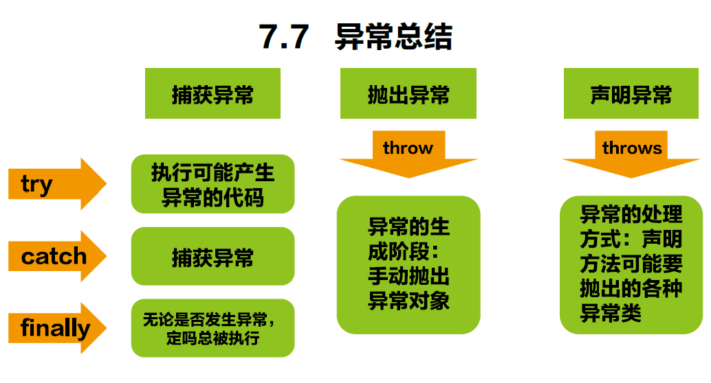

- **author: Shuxin_Wang**
- **time    :2022.07.11**

------

***目录***

- [一、JAVA语言概述](#一、JAVA语言概述)
	- [1.1 诞生](#1.1-诞生)
	- [1.2 特征](#1.2-特征)
	- [1.3 运行机制](#1.3-运行机制)
	- [1.4 JDK&JRE](#1.4-JDK&JRE)
	- [1.5 注释](#1.5-注释)
- [二、JAVA基本语法](#二、JAVA基本语法)
	- [2.1 关键词与保留字](#2.1-关键词与保留字)
		- [2.1.1 关键字](#2.1.1-关键字)
		- [2.1.2 保留字](#2.1.2-保留字)
	- [2.2 标识符](#2.2-标识符)
	- [2.3 变量](#2.3-变量)
		- [2.3.1 概念&声明](#2.3.1-概念&声明)
		- [2.3.2 基本数据类型](#2.3.2-基本数据类型)
			- [1.整数类型](#1.整数类型)
			- [2.浮点类型](#2.浮点类型)
			- [3.字符类型](#3.字符类型)
			- [4.布尔类型](#4.布尔类型)
		- [2.3.3 基本数据类型转换](#2.3.3-基本数据类型转换)
		- [2.3.4 强制类型转换](#2.3.4-强制类型转换)
	- [2.4 进制](#2.4-进制)
	- [2.5 运算符](#2.5-运算符)
		- [2.5.1 算数运算符](#2.5.1-算数运算符)
		- [2.5.2 赋值运算符](#2.5.2-赋值运算符)
		- [2.5.3 比较运算符](#2.5.3-比较运算符)
		- [2.5.4 逻辑运算符](#2.5.4-逻辑运算符)
		- [2.5.5 位运算符](#2.5.5-位运算符)
		- [2.5.6 三元运算符](#2.5.6-三元运算符)
	- [2.6 运算符的优先级](#2.6-运算符的优先级)
	- [2.7 程序流程控制](#2.7-程序流程控制)
	- [2.8 分支语句](#2.8-分支语句)
		- [if-else 结构](#if-else-结构)
		- [switch-case结构](#switch-case结构)
	- [2.9 循环结构](#2.9-循环结构)
		- [for循环](#for循环)
		- [while 循环](#while-循环)
		- [do-while 循环](#do-while-循环)
		- [嵌套循环结构](#嵌套循环结构)
	- [2.10 break & continue & return](#2.10-break-&-continue-&-return)
		- [break](#break)
		- [continue](#continue)
		- [return](#return)
- [三、数组](#三、数组)
	- [3.1 数组的概述](#3.1-数组的概述)
	- [3.2 一维数组的使用](#3.2-一维数组的使用)
	- [3.3 多维数组的使用](#3.3-多维数组的使用)
	- [3.4 数组中常见算法](#3.4-数组中常见算法)
	- [3.5 Arrays 工具类的使用](#3.5-Arrays-工具类的使用)
	- [3.6 数组使用常见异常](#3.6-数组使用常见异常)
- [四、面向对象——类及类的成员](#四、面向对象——类及类的成员)
	- [4.1 面向过程（POP）与面向对象（OOP）](#4.1-面向过程（POP）与面向对象（OOP）)
	- [4.2 类和对象](#4.2-类和对象)
		- [4.2.1 Java类及类的成员](#4.2.1-Java类及类的成员)
		- [4.2.2 类与对象的创建及使用](#4.2.2-类与对象的创建及使用)
		- [4.2.3 内存解析](#4.2.3-内存解析)
	- [4.3 类成员之一：属性](#4.3-类成员之一：属性)
	- [4.4 类成员之二：方法](#4.4-类成员之二：方法)
		- [4.4.1 类方法的声明和使用](#4.4.1-类方法的声明和使用)
		- [4.4.2 万事万物皆对象](#4.4.2-万事万物皆对象)
		- [4.4.3 内存解析的说明](#4.4.3-内存解析的说明)
		- [4.4.4 匿名对象的使用](#4.4.4-匿名对象的使用)
		- [4.4.5 方法重载 (Over load)](#4.4.5-方法重载-(Over-load))
		- [4.4.6 可变个数的形参](#4.4.6-可变个数的形参)
		- [4.4.7 方法参数值的传递机制](#4.4.7-方法参数值的传递机制)
	- [4.5 面向对象特征之一：封装与隐蔽](#4.5-面向对象特征之一：封装与隐蔽)
		- [4.5.1 四种权限修饰符](#4.5.1-四种权限修饰符)
	- [4.6 类成员之三：构造器](#4.6-类成员之三：构造器)
		- [4.6.1 构造器的使用](#4.6.1-构造器的使用)
		- [4.6.2 属性复制的过程](#4.6.2-属性复制的过程)
		- [4.6.3 JavaBean的使用](#4.6.3-JavaBean的使用)
		- [4.6.4 UML类图](#4.6.4-UML类图)
	- [4.7 关键字：this](#4.7-关键字：this)
	- [4.8 关键字：package、import](#4.8-关键字：package、import)
		- [4.8.1 关键字—package](#4.8.1-关键字—package)
		- [4.8.2 MVC设计模式](#4.8.2-MVC设计模式)
		- [4.8.3 关键字——import](#4.8.3-关键字——import)
- [五、面向对象——封装性，继承性，多态性](#五、面向对象——封装性，继承性，多态性)
	- [5.1 面向对象特征之二：继承性 （inheritance）](#5.1-面向对象特征之二：继承性-（inheritance）)
		- [5.1.1 继承性的好处](#5.1.1-继承性的好处)
		- [5.1.2 继承性的格式](#5.1.2-继承性的格式)
		- [5.1.3 继承型的规定](#5.1.3-继承型的规定)
	- [5.2 方法的重写（override/overwrite）](#5.2-方法的重写（override/overwrite）)
		- [5.2.1 定义](#5.2.1-定义)
		- [5.2.2 应用](#5.2.2-应用)
		- [5.2.3 规定](#5.2.3-规定)
	- [5.3 关键字——Super](#5.3-关键字——Super)
	- [5.4 子类对象实例化过程](#5.4-子类对象实例化过程)
	- [5.5 面向对象特征之三——多态性](#5.5-面向对象特征之三——多态性)
		- [5.5.1 虚拟方法补充](#5.5.1-虚拟方法补充)
		- [5.5.2 向下转型的使用](#5.5.2-向下转型的使用)
	- [5.6 Object 类的使用](#5.6-Object-类的使用)
		- [5.6.1 Object 类中的主要结构](#5.6.1-Object-类中的主要结构)
		- [5.6.2 `==`操作符与`equals()`方法](#5.6.2-`==`操作符与`equals()`方法)
		- [5.6.3 重写`equals()`方法的原则](#5.6.3-重写`equals()`方法的原则)
		- [5.6.4 `toString` 的使用](#5.6.4-`toString`-的使用)
	- [5.7 包装类（Wrapper）的使用](#5.7-包装类（Wrapper）的使用)
		- [5.7.1 单元测试方法的使用](#5.7.1-单元测试方法的使用)
		- [5.7.2 包装类的使用](#5.7.2-包装类的使用)
		- [5.7.3 包装类与基本数据类型相互转换](#5.7.3-包装类与基本数据类型相互转换)
- [六、面向对象——其他关键字](#六、面向对象——其他关键字)
	- [6.1 关键字——static](#6.1-关键字——static)
		- [6.1.1 static 的使用](#6.1.1-static-的使用)
		- [6.1.2 类变量 VS 实例变量内存解析](#6.1.2-类变量-VS-实例变量内存解析)
		- [6.1.3 static 应用](#6.1.3-static-应用)
		- [6.1.4 单例（Singleton）设计模式](#6.1.4-单例（Singleton）设计模式)
	- [6.2 理解`mian`方法的语法](#6.2-理解`mian`方法的语法)
	- [6.3 类成员之四：代码块](#6.3-类成员之四：代码块)
	- [6.4 关键字——final](#6.4-关键字——final)
	- [6.5 抽象类与抽象方法](#6.5-抽象类与抽象方法)
		- [6.5.1 抽象类应用](#6.5.1-抽象类应用)
		- [6.5.2 练习](#6.5.2-练习)
		- [6.5.3 创建抽象类的匿名子类==对象==](#6.5.3-创建抽象类的匿名子类==对象==)
		- [6.5.4 多态的应用——模板方法设计模式](#6.5.4-多态的应用——模板方法设计模式)
	- [6.6 接口（interface）](#6.6-接口（interface）)
		- [6.6.1 概述](#6.6.1-概述)
		- [6.6.2 举例](#6.6.2-举例)
		- [6.6.3 接口的应用：代理模式（Proxy）](#6.6.3-接口的应用：代理模式（Proxy）)
		- [6.6.4 接口的应用：工厂模式](#6.6.4-接口的应用：工厂模式)
	- [6.7 Java 8 中关于接口的改进](#6.7-Java-8-中关于接口的改进)
- [七、异常](#七、异常)
	- [7.1 异常概述与异常体系结构](#7.1-异常概述与异常体系结构)
	- [7.2 常见异常](#7.2-常见异常)
	- [7.3 异常处理机制一：try-catch-finally](#7.3-异常处理机制一：try-catch-finally)
	- [7.4 异常处理机制二：throws](#7.4-异常处理机制二：throws)
	- [7.5 手动抛出异常](#7.5-手动抛出异常)
	- [7.6 用户自定义异常类](#7.6-用户自定义异常类)
	- [7.7 异常总结](#7.7-异常总结)


# 一、JAVA语言概述

## 1.1 诞生

- 类C语言发展和衍生的产物；
- 纯粹的面向对象；
- 舍弃C语言中的容易引起错误的指针；
- 增加垃圾回收器功能；


## 1.2 特征

- 易学的；
- 强制面向对象的；
- 分布式的；
- 健壮的；
- 安全的；
- 体系结构中立的；
- 解释性的；
- 性能略高的；
- 原生支持多线程的；


## 1.3 运行机制

- JAVA虚拟机（JAVA Virtal Machine）；
- 垃圾回收机制（Garbage Collection）；


## 1.4 JDK&JRE

- JDK（Java Development Kit  Java开发工具包），包括Java的开发工具（编译工具javac.exe，打包工具jar.exe），**也包括JRE**；
- JRE（Java Runtime Environment  Java运行环境），包括Java虚拟机和Java程序所需的核心类库；


## 1.5 注释

- 单行/多行注释

```java
//单行注释

/*
多行注释
1行
2行
多行注释:禁止套娃
*/

```

- 文档注释

```java
/**
@author: A big Tree
@version: v1.0
*/
```


# 二、JAVA基本语法


## 2.1 关键词与保留字


### 2.1.1 关键字


### 2.1.2 保留字

- 现有Java版本尚未使用，自己命名标识符避免使用保留字`goto`、`const`


## 2.2 标识符

- Java对各种变量、方法和类等要素命名时使用的字符序列称为标识符；
- **凡是自己可以起名字的地方都叫标识符**


## 2.3 变量


### 2.3.1 概念&声明

1. 概念
   - 内存中的一个存储区域；该区域数据可以在一定范围内不断变化；变量是程序中最基本的存储单元。


2. 声明
   - `<数据类型> <变量名称>`


### 2.3.2 基本数据类型

$$
\text{数据类型}
\begin{cases}
{基本数据类型\\(primitive\ type)}{
\begin{cases}
数值型{
\begin{cases}
整数类型(byte,short,int,long)\\
\\
浮点类型(float,double)
\end{cases}
}\\
\\
字符型(char)\\
\\
布尔型(boolean)
\end{cases}
}\\
\\
引用数据类型(reference\ type){
\begin{cases}
类(class)\\
\\
接口(interface)\\
\\
数组([\ ])
\end{cases}
}\\
\end{cases}
$$


#### 1.整数类型

- `byte, short, int, long`；
- 整数默认为`int`型，`long`声明须后加`'l'或'L'`；

| 类型  |   占用空间   |        表数范围        |
| :---: | :----------: | :--------------------: |
| byte  | 1字节=8bit位 |       -128 ~ 127       |
| short |    2字节     |     -2^15 ~ 2^15-1     |
|  int  |    4字节     | -2^31 ~ 2^31-1(约21亿) |
| long  |    8字节     |     -2^63 ~ 2^63-1     |


#### 2.浮点类型

- `float, double`；
- 浮点数默认为`double`型，`float`声明须后加`'f'或'F'`；

|  类型  | 占用空间 |        表数范围        |
| :----: | :------: | :--------------------: |
| float  |  4字节   |  -3.403E38 ~ 3.403E38  |
| double |  8字节   | -1.798E308 ~ 1.798E308 |


#### 3.字符类型

- `char`
- 2字节


#### 4.布尔类型

- `boolean`
- **不可用`0`和非`0`的整数数代替`true`和`flase`**；


### 2.3.3 基本数据类型转换

- 容量小的类型自动转换位容量大的数据类型；




### 2.3.4 强制类型转换

- 自动类型转换的逆过程，将容量大的数据类型转换为容量小的数据类型。使用时要加上强制转换符：`(<数据类型>)`，但可能造成精度降低或溢出, 格外要注意。


## 2.4 进制

- 所有数字在计算机底层都以二进制形式存在；
- 对于整数，有四种表示方式：
  - 二进制(binary)：0,1 ，满2 进1. 以0b 或0B 开头；
  - 十进制(decimal)：0-9 ，满10 进1；
  - 八进制(octal)：0-7 ，满8 进1. 以数字0 开头表示；
  - 十六进制(hex)：0-9及A-F，满16 进1. 以0x 或0X开头表示。此处的A-F，不区分大小写。如：0x21AF +1= 0X21B0；


## 2.5 运算符


### 2.5.1 算数运算符


### 2.5.2 赋值运算符

- 当`=`两侧数据类型不一致时，可以使用自动类型转换或使用强制类型转换原则进行处理；


### 2.5.3 比较运算符


### 2.5.4 逻辑运算符

- `&`—逻辑与
- `|`—逻辑或
- `！`—逻辑非
- `&&` —短路与
- `||`—短路或
- `^` —逻辑异或


### 2.5.5 位运算符


### 2.5.6 三元运算符

- `( 条件表达式) ？表达式1 : 表达式2`


## 2.6 运算符的优先级


## 2.7 程序流程控制

- 流程控制语句是用来控制程序中各语句执行顺序的语句，可以把语句组合成能完成一定功能的小逻辑模块；


## 2.8 分支语句

### if-else 结构

```java
if(条件表达式1){
    执行1;
}else if(条件表达式2){
    执行2;
}
......
 else{
    执行n;
}
```


### switch-case结构

```java
switch(表达式1){
    case 常量1:
        语句1;
        //break;
    case 常量2:
        语句2;
        //break;
    ......
    case 常量n:
        语句n;
        //break;
    default:
        语句;
        //break;
            
}
```


## 2.9 循环结构


### for循环

```java
for( ①初始化部分; ②循环条件部分; ④迭代部分)｛
③循环体部分;
｝
```


- 执行过程：① - ② - ③ - ④ - ② - ③ - ④ - ② - ③ - ④ -.....- ②


### while 循环

```java
①初始化部分
while( ②循环条件部分){
③循环体部分;
④迭代部分;
}
```

- 执行过程：① - ② - ③ - ④ - ② - ③ - ④ - ② - ③ - ④ -⋯- ②


### do-while 循环

```java
①初始化条件;
do{
③循环体;
④迭代条件;
}while(②循环条件);
```

- 执行过程：① - ③ - ④ - ② - ① - ③ - ④ - ... - ②


### 嵌套循环结构

- 将一个循环放在另一个循环体内，就形成了嵌套循环；


## 2.10 break & continue & return


### break

```java
{
......
break;
......
}
```


### continue

- continue **只能使用**在循环结构中；

 - continue 语句用于跳过其所在循环语句块的一次执行，继续下一次循环；
 - continue 语句出现在多层嵌套的循环语句体中时，可以通过标签指明要跳过的是哪一层循环；


### return

- 并非专门用于结束循环的，它的功能是结束一个方法。当一个方法执行到一个return 语句时，这个方法将被结束；


# 三、数组


## 3.1 数组的概述

- 数组(Array)，是多个相同类型数据按一定顺序排列的集合，并使用一个名字命名，并通过编号的方式对这些数据进行统一管理；


## 3.2 一维数组的使用

```java
// 1. 一维数组的声明和初始化
int[] ids; // 声明
//1.1 静态初始化: 数组的初始化和数组元素的赋值操作同时进行
ids = new int[]{1001,1002,1003,1004};
// 也是正确的写法：
int[] arr7 = {1,2,3,5,4}; // 类型推断
//1.2 动态初始化: 数组的初始化和数组元素的赋值操作分开进行
String[] names = new String[5];

// 属性：length
System.out.println(names.length); //5
```


## 3.3 多维数组的使用

```java
//1. 二维数组的声明和初始化
int[] arr = new int[]{1,2,3};
// 静态初始化
int[][] arr1 = new int[][]{{1,2,3},{4,5,6},{7,8,9}};
// 动态初始化1
String[][] arr2 = new String[3][2];
// 动态初始化2
String[][] arr3 = new String[3][];
```


## 3.4 数组中常见算法

1. 数组元素的赋值；
2. 求数值型数组中元素的最大值、最小值、平均数、总和等；
3. 数组的复制、反转、查找（线性查找、二分查找）；
4. 数组元素的排序算法；


## 3.5 Arrays 工具类的使用


## 3.6 数组使用常见异常

- `ArrayIndexOutOfBoundsException` & `NullPointerException`


```java
public class ArrayExceptionTest {
public static void main(String[] args) {
    //1. 数组角标越界的异常:ArrayIndexOutOfBoundsException
    int[] arr = new int[]{1,2,3,4,5,6};
    // 错误1：
    // for(int i = 0;i <= arr.length;i++){
    // System.out.println(arr[i]);
    // }
    // 错误2：
    // System.out.println(arr[-2]);
    // 错误3
    // System.out.println("hello");
    
    
    //2. 空指针异常:NullPointerException
    // 情况一:
    // int[] arr2= new int[]{1,2,3};
    // arr2 = null;
    // System.out.println(arr2[0]);
    // 情况二:
    // int[][] arr2 = new int[4][];
    // System.out.println(arr2[0][0]);
    // 情况三:
    // String[] arr3 = new String[]{"AA","QQ","YY","XX","TT","KK"};
    // arr3[0] = null;
    // System.out.println(arr3[0].toString());
    }
}
```


# 四、面向对象——类及类的成员


## 4.1 面向过程（POP）与面向对象（OOP）

- 面向过程：Procedure Oriented Programming
  - 强调的是功能行为，以函数为最小单位，考虑怎么做；
- 面向对象：Object Oriented Programming
  - 强调具备了功能的对象，以类/ 对象为最小单位，考虑谁来做；


## 4.2 类和对象

- 类：对一类事物的描述，是抽象的，概念上的定义；
- 对象：是实际存在的该类事物的每个个体，因而也称为实例（instance）；


### 4.2.1 Java类及类的成员

- 属性：对应类中的成员变量；
- 行为：对应类中的成员方法；


### 4.2.2 类与对象的创建及使用

- 设计类，就是设计类的成员
  - 属性 == 成员变量 == field == 域、字段；
  - 方法 == 成员方法 == 函数 == method；
  - 创建类的对象 == 类的实例化 == 实例化类；
- 类和对象的使用（面向对象思想落地的实现）
  - 创建类，设计类成员；
  - 创建类的对象；
  - 通过“对象·属性”或“对象·方法”调用对象的结构；
- 如果创建了一个类的多个对象，则每个对象都独立拥有一套类的属性（非static）
  - 意味着：如果我们修改一个对象的属性a，则不影响另外一个对象属性a 的值；


### 4.2.3 内存解析

- **堆（Heap）**：此内存区域的***唯一目的***就是存放对象实例，几乎所有的对象实例都在这里分配内存。这一点在 Java 虚拟机规范中的描述是：所有的对象实例以及数组都要在堆上分配；
- **栈（Stack）**：是指虚拟机栈。虚拟机栈用于存储局部变量等。局部变量表存放了编译期可知长度的各种基本数据类型（boolean、byte、char、short、int、float、long、double）、对象引用（reference 类型，它不等同于对象本身，是对象在堆内存的首地址）。方法执行完，自动释放；
- **方法区（MethodArea）**：用于存储已被虚拟机加载的类信息、常量、**静态变量**、即时编译器编译后的代码等数据。


## 4.3 类成员之一：属性

***属性（成员变量） VS 局部变量***

1. 相同点

   ① 定义变量的格式：数据类型 变量名 = 变量值；
   ② 先声明，后使用；
   ③ 变量都有其对应的作用域；

2. 不同点

   **① 在类中声明的位置不同：**
   属性：直接定义在类的一对{} 内；

   局部变量：声明在方法内、方法形参、代码块内、构造器内部的变量；

   

   **② 关于权限修饰符的不同：**

   属性：可以在声明属性是，指明其权限，使用权限修饰符。常用的权限修饰符：private、public、缺省、protected -> 封装性
   目前声明属性是都可以使用缺省；
   局部变量：不可以使用权限修饰符；

   

   **③ 默认初始化值的情况：**
   属性：类的属性，根据其类型都有默认初始化值：
   	整形（byte / short / int / long）：0
   	浮点型（float / double ）：0.0
   	字符型（char）：0 或（' /u0000 '）
   	布尔型（boolean）：false
   	引用数据类型（类、数组、接口）：null
   局部变量：没有默认初始化值。
   	意味着：我们在调用局部变量之前，一定要显示赋值；
   	引用地：形参在调用时，赋值即可。

   

   **④ 在内存加载中的位置：**
   属性：加载到堆空间中（非static）；
   局部变量：加载到栈空间中。


## 4.4 类成员之二：方法


### 4.4.1 类方法的声明和使用

- ***声明***
  - `<(权限修饰符)> <返回值类型> <方法名(形参列表)>{方法体;}`
- ***使用***

```java
public class CustomerTest {
    public static void main(String[] args) {
        Customer cust1 = new Customer();
        cust1.eat();
        // 测试形参是否需要设置的问题
        // int[] arr = new int[]{3,4,5,2,5};
        // cust1.sort();
        cust1.sleep(8);
        }
}

// 客户类
class Customer{
    // 属性
    String name;
    int age;
    boolean isMale;
    // 方法
    public void eat(){
        System.out.println(" 客户吃饭");
        return;
        //return 后不可以声明表达式
        // System.out.println("hello");
    }
    public void sleep(int hour){
        System.out.println(" 休息了" + hour + " 个小时");
        eat();
        // sleep(10);
    }
    public String getName(){
        if(age > 18){
            return name;
        }else{
            return "Tom";
        }
    }
    public String getNation(String nation){
        String info = " 我的国籍是：" + nation;
        return info;
    }
    public void info(){
        // 错误的
        // public void swim(){
        // }
    }
}
```


### 4.4.2 万事万物皆对象

1. 在Java 语言范畴中，我们都将功能、结构等封装到类中，通过类的实例化，来调用具体的功能结构：
- Scanner，String 等；
- 文件：File；
- 网络资源URL；
2. 涉及到Java 语言前段Html，后端的数据库交互时，前后端的结构在Java 层面交互时，都体现为类，对象。


### 4.4.3 内存解析的说明

- 引用类型的变量，只能储存两类值：null 或地址值（含变量的类型）；


### 4.4.4 匿名对象的使用

- 理解：我们创建对象，没有显示的赋值给一个变量名，即为匿名对象；
- 匿名对象只能使用一次。


### 4.4.5 方法重载 (Over load)

- 在同一类中，允许存在一个以上的同名方法，只要他们的参数个数或者参数类型不同即可；
- 跟方法的权限修饰符、返回值类型、形参变量名、方法体都没有关系！

```java
// 如下4 个方法构成了重载
public int getSum(int i , int j ){
}
public double getSum(double d1 , double d2 ){
}
private void getSum(String s , int i ){
}
public void getSum(int i , String s ){
}
```


### 4.4.6 可变个数的形参

- JavaSE 5.0 中提供了Varargs(variable number of arguments) 机制，允许直接定义能和多个实参相匹配的形参。从而，可以用一种更简单的方式，来传递个数可变的实参；

```java
public class MethodArgs {
    public static void main(String[] args) {
        MethodArgs test = new MethodArgs();
        test.show(12);
        // test.show("hell0");
        // test.show("hello","world");
        // test.show();
        test.show(new String[] { "AA", "BB", "CC" });
    }
    
    public void show(int i) {
    }
    
    // public void show(String s){
    // System.out.println("show(String)");
    // }
    public void show(String... strs) {
        System.out.println("show(String ...strs)");
        for (int i = 0; i < strs.length; i++) {
        	System.out.println(strs[i]);
        }
    }
    
    // 此方法与上一方法不可共存
    // public void show(String[] strs){
    // }
    
    public void show(int i, String... strs) {
    }
}
```


### 4.4.7 方法参数值的传递机制

- 针对基本数据类型
  - 值传递机制：如果参数是基本数据类型，此时实参赋值给形参的是实参真是存储的数据值；
- 针对引用数据类型
  - 如果参数是引用数据类型，此时实参赋值给形参的是实参存储数据的地址值；


## 4.5 面向对象特征之一：封装与隐蔽


### 4.5.1 四种权限修饰符

|  修饰符   | 类内部 | 同一个包 | 不同包的子类 | 同一个工程 |
| :-------: | :----: | :------: | :----------: | :--------: |
|  private  |   ✓    |          |              |            |
|  (缺省)   |   ✓    |    ✓     |              |            |
| protected |   ✓    |    ✓     |      ✓       |            |
|  public   |   ✓    |    ✓     |      ✓       |     ✓      |


## 4.6 类成员之三：构造器


### 4.6.1 构造器的使用

```java
public class PersonTest {
public static void main(String[] args) {
    // 创建类的对象:new + 构造器
    Person p = new Person(); //Person() 这就是构造器
    p.eat();
    Person p1 = new Person("Tom");
    System.out.println(p1.name);
    }
}
class Person{
    // 属性
    String name;
    int age;
    
    // 构造器
    public Person(){
    	System.out.println("Person()......");
    }
    public Person(String n){
    	name = n;
    }
    public Person(String n,int a){
        name = n;
        age = a;
    }
    
    // 方法
    public void eat(){
    	System.out.println(" 人吃饭");
    }
    public void study(){
    	System.out.println(" 人学习");
    }
}
```


### 4.6.2 属性复制的过程

属性赋值的先后顺序
**① 默认初始化值；**
**② 显式初始化；**
**③ 构造器中赋值；**
**④ 通过" 对象. 方法" 或 “对象. 属性”的方式，赋值；**


### 4.6.3 JavaBean的使用

JavaBean 是一种 Java 语言写成的可重用组件。所谓 javaBean，是指符合如下标准的 Java 类：

- 类是公共的；
- 有一个无参的公共的构造器；
- 有属性，且有对应的 get、set 方法；


### 4.6.4 UML类图

- `+`表示 public 类型，`-` 表示 private 类型，`#` 表示 protected 类型；
- 方法的写法: 方法的类型(+、-) 方法名( 参数名：参数类型)：返回值类型；



## 4.7 关键字：this

- this 用来修饰、调用：属性、方法、构造器
- this 修饰属性和方法:
  - this 理解为：当前对象, 或当前正在创建的对象;
  - 在类的方法中，我们可以使用"this. 属性" 或"this. 方法" 的方式，
    调用当前对象属性或方法;
  - 通常情况下，我们都选择省略“this.”。特殊情况下，如果方法的形参和类的属性同名，我们必须显式的使用"this. 变量" 的方式，表明此变量是属性，而非形参；
  - 在类的构造器中，我们可以使用"this. 属性" 或"this. 方法" 的方式，调用正在创建的对象属性和方法；
  - 但是，通常情况下，我们都选择省略“this.”。特殊情况下，如果构造器的形参和类的属性同名，我们必须显式的使用"this. 变量" 的方式，表明此变量是属性，而非形参；
- **this 调用构造器**
  ① 我们可以在类的构造器中，显式的使用`this( 形参列表) ` 的方式，调用本类中重载的其他的构造器！
  ② 构造器中不能通过`this( 形参列表) ` 的方式调用自己；
  ③ 如果一个类中有n 个构造器，则最多有n -1 个构造器中使用了`this( 形参列表) `；
  ④ 规定：`this( 形参列表) ` 必须声明在类的构造器的首行！
  ⑤ 在类的一个构造器中，最多只能声明一个`this( 形参列表) `，用来调用其他构造器；


## 4.8 关键字：package、import


### 4.8.1 关键字—package

- 为了更好的实现项目中类的管理，提供包的概念；
- 使用 package 声明类或接口所属的包，声明在源文件的首行；
- 包：属于标识符，遵循标识符的命名规则、规范" 见名知意"；
- 每“.”一次, 就代表一层文件目录；

补充: 同一个包下，不能命名同名接口或同名类。不同包下，可以命名同名的接口、类。


***JDK 中主要的包介绍***

1. java.lang---- 包含一些 Java 语言的核心类， 如 String、Math、Integer、System 和 Thread，提供常用功能；
2. java.net---- 包含执行与网络相关的操作的类和接口；
3. java.io---- 包含能提供多种输入/ 输出功能的类；
4. java.util---- 包含一些实用工具类，如定义系统特性、接口的集合框架类、使用与日期日历相关的函数；
5. java.text---- 包含了一些 java 格式化相关的类；
6. java.sql---- 包含了 java 进行 JDBC 数据库编程的相关类/ 接口；
7. java.awt---- 包含了构成抽象窗口工具集（abstractwindowtoolkits）的多个类，这些类被用来构建和管理应用程序的图形用户界面(GUI)。B/S C/S；


### 4.8.2 MVC设计模式

- MVC 是常用的设计模式之一，将整个程序分为三个层次：***视图模型层，控制器层，数据模型层***。这种将程序输入输出、数据处理，以及数据的展示分离开来的设计模式使程序结构变的灵活而且清晰，同时也描述了程序各个对象间的通信方式，降低了程序的耦合性。


### 4.8.3 关键字——import

1. 在源文件中显式的使用import 结构导入指定包下的类、接口；
2. 声明在包的声明和类的声明之间；
3. 如果需要导入多个结构，则并列写出即可；
4. 可以使用"xxx.*" 的方式, 表示可以导入xxx 包下的所有结构；
5. 如果导入的类或接口是java.lang 包下的，或者是当前包下的，则可以省略此import 语句；
6. 如果在代码中使用不同包下的同名的类。那么就需要使用类的全类名的方式指明调用的是哪个类；
7. 如果已经导入java.a 包下的类。那么如果需要使用a 包的子包下的类的话，仍然需要导入；
8. import static 组合的使用：调用指定类或接口下的静态的属性或方法；


# 五、面向对象——封装性，继承性，多态性


## 5.1 面向对象特征之二：继承性 （inheritance）


### 5.1.1 继承性的好处

1. 减少了代码的冗余，提高的代码的复用性；
2. 便于功能扩展；
3. 为之后多态性的使用，提供了前提；


### 5.1.2 继承性的格式

`class A extends B{  }`

- A：子类、派生类、subclass;
- B：父类、超类、基类、superclass;


- 一旦子类A 继承父类B 以后，子类A 就获取了父类B 中声明的所有属性和方法。**特别的，父类中声明为private 的属性或方法，子类继承父类以后，仍然认为获取了父类中私有的结构。只是因为封装性的影响，使得子类不能直接调用父类的结构而已**；
- 子类继承父类之后，还可以声明自己特有的属性或方法：实现功能拓展。子类和父类的关系，不同于子集和集合的关系；
- Java 只支持单继承和多层继承，不允许多重继承；

```java
class SubDemo extends Demo{} // ok
class SubDemo extends Demo1，Demo2...{} // error
```


### 5.1.3 继承型的规定

1. 一个类可以被多个子类继承；
2.  Java 中类的单继承性：**一个类只能有一个父类**；
3. 子父类是相对的概念；
4. 子类直接继承的父类，称为：直接父类；间接继承的父类称为：间接父类；
5. 子类继承父类以后，就**获取了直接父类以及所有间接父类中声明的属性和方法**；


- 未声明父类的话，继承于`Java.lang.Object类`；


## 5.2 方法的重写（override/overwrite）


### 5.2.1 定义

- 子类继承父类以后，可以对**父类中同名同参数**的方法，进行覆盖操作；


### 5.2.2 应用

- 重写以后，当创建子类对象以后，通过子类对象调用子父类中的同名同参数的方法时，实际执行的是子类重写父类的方法；


### 5.2.3 规定

- 声明：`<权限修饰符> <返回值类型> <方法名(形参列表)> <throws 异常的类型>{方法体;}`


约定俗称：子类中的叫**重写**的方法，父类中的叫**被重写**的方法。

1. 子类重写的方法的方法名和形参列表与父类被重写的方法的**方法名和形参列表相同**；
2. 子类重写的方法的**权限修饰符不小于父类被重写的方法的权限修饰符**；特殊情况：子类不能重写父类中声明为private 权限的方法；
3. 返回值类型：
   - 父类被重写的方法的返回值类型是void，则子类重写的方法的返回值类型只能是void;
   - 父类被重写的方法的返回值类型是A 类型，则字方法重写的方法的返回值类型可是是**A 类或A 类的子类**;
   - 父类被重写的方法的返回值类型是**基本数据类型**（比如double），则子类重写的方法的返回值类型**必须是基本数据类型**（也必须是double）；

4. 子类重写的方法跑出的异常类型不大于父类被重写的方法抛出的异常类型；
5. 子类和父类中的同名同参数的方法要么都声明为非static 的（考虑重写），要么都声明为static 的（**不是重写**）。


## 5.3 关键字——Super

1. super 理解为：父类的；
2. super 可以用来调用：属性、方法、构造器 ；
3. super 的使用：
   - 3.1 我们可以在子类的方法或构造器中，通过"super. 属性" 或"super.方法" 的方式，显式的调用父类中声明的属性或方法。但是，通常情况下，我们习惯去省略这个"super."；
   - 3.2 特殊情况：当子类和父类中定义了**同名的属性**时，我们要想在子类中调用父类中声明的属性，则必须显示的 使用"super. 属性" 的方式，表明调用的是父类中声明的属性；
   - 3.3 特殊情况：当子类重写了父类中的方法后，我们想在子类的方法中**调用父类中被重写的方法**时，必须显示的使用"super. 方法" 的方式，表明调用的是父类中被重写的方法；
4. super 调用构造器
   - 4.1 我们可以在子类的构造器中显示的使用`super( 形参列表)`"的方式,调用父类中声明的指定的构造器；
   - 4.2 `super( 形参列表)`的使用，必须声明在子类构造器的首行！
   - 4.3 我们在类的构造器中，针对于`this( 形参列表)` 或`super( 形参列表)`**只能二选一**，不能同时出现；
   - 4.4 在构造器的首行，既没有显式的声明"this( 形参列表)" 或"super( 形参列表)"，则默认的调用的是父类中的空参构造器。`super()`；
   - 4.5 在类的多个构造器中，至少有一个类的构造器使用了`super( 形参列表)`, 调用父类中的构造器。


## 5.4 子类对象实例化过程

1. 从**结果上**看:
  - 子类继承父类以后，就获取了父类中声明的属性或方法。创建子类的对象中，在堆空间中，就会加载所有父类中声明的属性；
2. 从**过程上**看:
- 当我们通过子类的构造器创建子类对象时, 我们一定会直接或间接的调用其父类构造器，直到调用了java.lang.Object 类中空参的构造器为止。正因为加载过所有的父类结构，所以才可以看到内存中有父类中的结构，子类对象可以考虑进行调用。
- 明确: 虽然创建子类对象时，调用了父类的构造器，但自始至终就创建过一个对象，即为new 的子类对象。


## 5.5 面向对象特征之三——多态性

1. 理解多态性：可以理解为一个事物的多种态性。
2. 何为多态性：
  - 对象的多态性：父类的引用指向子类的对象( 或子类的对象赋值给父类的引用)。
3. 多态的使用：虚拟方法调用
  - 有了对象多态性以后，我们在编译期，只能调用父类声明的方法，但在执行期实际执行的是子类重写父类的方法。简称：编译时，看左边；运行时，看右边；
  - 若编译时类型和运行时类型不一致， 就出现了对象的多态性
    (Polymorphism)；
  - 多态情况下，
    “看左边”：看的是父类的引用（父类中不具备子类特有的方法）；
    “看右边”：看的是子类的对象（实际运行的是子类重写父类的方法）。
4. 多态性的使用前提：
    ① 类的继承关系；
    ② 方法的***重写***。
5. 对象的多态性：**只适用于方法，不适用于属性**( 编译和运行都看左边)；

- ***应用***

```java
public class AnimalTest {
    public static void main(String[] args) {
        AnimalTest test = new AnimalTest();
        test.func(new Dog());
        test.func(new Cat());
    }
    
    public void func(Animal animal){//Animal animal = new Dog();
        animal.eat();
        animal.shout();
    }
    // 如果没有多态性，就会写很多如下的方法，去调用
    public void func(Dog dog){
        dog.eat();
        dog.shout();
    }
    public void func(Cat cat){
        cat.eat();
        cat.shout();
    }
}

class Animal{
    public void eat(){
    	System.out.println(" 动物，进食");
    }
    public void shout(){
    	System.out.println(" 动物：叫");
    }
}

class Dog extends Animal{
    public void eat(){
    	System.out.println(" 狗吃骨头");
    }
    public void shout() {
    	System.out.println(" 汪！汪！汪！ ");
    }
}

class Cat extends Animal{
    public void eat(){
    	System.out.println(" 猫吃鱼");
    }
    public void shout() {
    	System.out.println(" 喵！喵！喵！ ");
    }
}
```


### 5.5.1 虚拟方法补充

- 重载，是指允许存在多个同名方法，而这些方法的参数不同。编译器根据方法不同的参数表，对同名方法的名称做修饰。对于编译器而言，这些**同名方法就成了不同的方法**；
- 它们的调用地址在编译期就绑定了。Java 的重载是可以包括父类和子类的，即子类可以重载父类的同名不同参数的方法。所以：
  - 对于重载而言，在方法调用之前，编译器就已经确定了所要调用的方法，这称为**“早绑定”或“静态绑定”**；
  - 而对于多态，只有等到方法调用的那一刻，解释运行器才会确定所要调用的具体方法，这称为**“晚绑定”或“动态绑定”**。


### 5.5.2 向下转型的使用

- Person类&Woman类&Man类

```java
public class Person {
    String name;
    int age;
    
    public void eat(){
    	System.out.println(" 人，吃饭");
    }
    public void walk(){
    	System.out.println(" 人，走路");
    }
}

public class Woman extends Person{
    boolean isBeauty;
    
    public void goShopping(){
    	System.out.println(" 女人喜欢购物");
    }
    public void eat(){
    	System.out.println(" 女人少吃，为了减肥。");
    }
    public void walk(){
    	System.out.println(" 女人，窈窕的走路。");
    }
}

public class Man extends Person{
    boolean isSmoking;
    
    public void earnMoney(){
    	System.out.println(" 男人负责工作养家");
    }
    public void eat() {
    	System.out.println(" 男人多吃肉，长肌肉");
    }
    public void walk() {
    	System.out.println(" 男人霸气的走路");
    }
}
```


- PersonTest类

```java
public class PersonTest {
    
    public static void main(String[] args) {
    Person p1 = new Person();
    p1.eat();
        
    Man man = new Man();
    man.eat();
    man.age = 25;
    man.earnMoney();
        
    // ************************************
    System.out.println("************************");
    // 对象的多态性，父类的引用指向子类的对象
    Person p2 = new Man();
    // Person p3 = new Woman();
    // 多态的使用: 当调用子父类同名同参数方法时，实际调用的是子类重写父类的方法--- 虚拟方法调用
    p2.eat();
    p2.walk();
    // p2.earnMoney();
    System.out.println("**************************");
    // 不能调用子类所特有的方法、属性，编译时，p2 是Person类型，

    p2.name = "Tom";
    // p2.isSmoking = true;
    // 有了对象的多态性以后，内存中实际上是加载了子类特有的属性和方法，但是由于变量声明
   	// 为父类类型，导致编译时，只能调用父类中声明的属性和方法。子类的属性和方法不能调用。
    // 如何才能调用子类所特有的属性和方法？
    // 使用强制类型转换符，也可称为: 向下转型
    Man m1 = (Man) p2;
    m1.earnMoney();
    m1.isSmoking = true;
    // 使用强转时，可能出现ClassCastException 异常
    // Woman w1 = (Woman)p2;
    // w1.goShopping();
        
    /*
    * instanceof 关键字的使用
    * a instanceof A：判断对象a 是否是类A 的实例。如果是，
    返回true，如果不是，返回false;
    * 使用情境：为了避免在向下转型时出现ClassCastException
    异常，我们在进行向下转型之前，先进行instanceof 的判断, 一旦返回
    true, 就进行向下转型。如果返回false，不进行向下转型。
    * 如果a instanceof A 返回true, 则a instanceof B 也返回
    true。 其中类B 是类A 的父类。
    */
    if (p2 instanceof Woman) {
        Woman w1 = (Woman) p2;
        w1.goShopping();
        System.out.println("**********Woman*********");
    }
    if (p2 instanceof Man) {
        Man m2 = (Man) p2;
        m2.earnMoney();
        System.out.println("*********Man************");
    }
        
    if (p2 instanceof Person) {
    	System.out.println("***********Person************");
    }
    if (p2 instanceof Object) {
    	System.out.println("***********object************");
    }
    // 向下转型的常见问题
    // 练习
    // 问题1: 编译时通过，运行时不通过
    // 举例一
    // Person p3 = new Woman();
    // Man m3 = (Man)p3;  
    // 举例二
    Person p4 = new Person();
    Man m4 = (Man)p4;
        
    // 问题二: 编译通过，运行时也通过
    Object obj = new Woman();
    Person p = (Person)obj;
        
    // 问题三: 编译不通过
    // Man m5 = new woman();
    // String str = new Date();
    // Object o = new Date();
    // String str1 = (String)o;
    }
}
```


## 5.6 Object 类的使用

1. Object 类是所有Java 类的根父类;
2. 如果在类的声明中未使用extends 关键字指明其父类，则默认父类为java.lang.Object 类；
3. Object 类中的功能( 属性、方法) 就具有通用性。


### 5.6.1 Object 类中的主要结构

| N0.  |                           方法声明                           |                描述                |
| :--: | :----------------------------------------------------------: | :--------------------------------: |
|  1   |                      `public Object()`                       |               构造器               |
|  2   |             `public boolean equals(Object obj)`              |              对象比较              |
|  3   |                   `public int hashCode()`                    |             取得Hash码             |
|  4   |                  `public String toString()`                  |            对象打印调用            |
|  5   |          `protected void finalize() throw Trowable`          |              释放资源              |
|  6   | `public final void wait(long timeout) throws InterruptedException` |      使当前线程等待该对象的锁      |
|  7   |             `public final native void notify()`              | 该方法唤醒在该对象上等待的某个线程 |
|  8   | `protected native Object clone() throws CloneNotSupportedException` |   保护方法，实现对象的==浅复制==   |


### 5.6.2 `==`操作符与`equals()`方法

> **`==`的使用**

可以使用在基本数据类型变量和引用数据类型变量中；

- 如果比较的是基本数据类型变量：比较两个变量保存的数据是否相等。( 不一定类型要相同)
- 如果比较的是引用数据类型变量：比较两个对象的地址值是否相同，即两个引用是否指向同一个对象实体；

***补充： == 符号使用时，必须保证符号左右两边的变量类型一致。***


> `equals()方法`

1. 是一个方法，而非运算符；

2. 只能适用于引用数据类型；

3. Object 类中equals() 的定义：

  ```java
  public boolean equals(Object obj){
  	return (this == obj);
  }
  ```

  - 说明：Object 类中定义的equals() 和== 的作用是相同的，比较两个对象的地址值是否相同，即两个引用是否指向同一个对象实体。

4. 像String、Date、File、包装类等都重写了Object 类中的equals() 方法。不是两个引用的地址是否相同，而是比较两个对象的“实体内容”是否相同。

5. 通常情况下，我们自定义的类如果使用equals() 的话，也通常是比较两个对象的" 实体内容" 是否相同。那么，我们就需要对Object 类中的equals() 进行重写。

- ***重写的原则：比较两个对象的实体内容是否相同。***


### 5.6.3 重写`equals()`方法的原则

- 对称性：如果`x.equals(y)` 返回是`true`，那么`y.equals(x)` 也应该返回是`true`；
- 自反性：`x.equals(x)` 必须返回是`true`；
- 传递性：如果`x.equals(y)` 返回是`true`，而且`y.equals(z)` 返回是`true`，那么`z.equals(x)` 也应该返回是`true`；
- 一致性：如果`x.equals(y)` 返回是`true`，只要`x` 和`y` 内容一直不变，不管你重复`x.equals(y)` 多少次，返回都是`true`；
- 任何情况下，`x.equals(null)`，永远返回是`false`；`x.equals( 和x 不同类型的对象)` 永远返回是`false`；


### 5.6.4 `toString` 的使用

1. 当我们输出一个引用对象时，实际上就是调用当前对象的toString()；

2. Object 类中`toString` 的定义方法；

  ```java
  public String toString() {
  	return getClass().getName() + "@" + Integer.toHexString(hashCode());
  }
  ```

3. 像String、Date、File、包装类等都重写了Object 类中的`toString()` 方法。使得在调用`toString()` 时，返回" 实体内容" 信息；

4. 自定义类如果重写`toString()` 方法，当调用此方法时，返回对象的"实体内容"；


## 5.7 包装类（Wrapper）的使用


### 5.7.1 单元测试方法的使用

1. 选中当前项目工程 --> 右键：build path --> add libraries -->JUnit 4 --> 下一步；

2. 创建一个Java 类进行单元测试。此时的Java 类要求：①此类是公共的 ②此类提供一个公共的无参构造器；

3. 此类中声明单元测试方法。此时的单元测试方法：方法的权限是public, 没有返回值，没有形参；

4. 此单元测试方法上需要声明注解：@Test 并在单元测试类中调用：`org.testng.annotations.Test`；

5. 声明好单元测试方法以后，就可以在方法体内测试代码；

6. 写好代码后，左键双击单元测试方法名：右键 --> run as -->JUnit Test；

  说明：***如果执行结果无错误，则显示是一个绿色进度条，反之，错误即为红色进度条***。

```java
import org.testng.annotations.Test;

public class JUnit {
    int num = 10;
    // 第一个单元测试方法
    @Test
    public void testEquals(){
        String s1 = "MM";
        String s2 = "MM";
        System.out.println(s1.equals(s2));
//ClassCastException 的异常
// Object obj = new String("GG");
// Date date = (Date)obj;
        System.out.println(num);
        show();
    }
    public void show(){
        num = 20;
        System.out.println("show()...");
    }
    // 第二个单元测试方法
    @Test
    public void testToString(){
        String s2 = "MM";
        System.out.println(s2.toString());
    }
}

```


### 5.7.2 包装类的使用

- java 提供了8 种基本数据类型对应的包装类，使得基本数据类型的变
  量具有类的特征。

```mermaid
graph TB
    subgraph 基本数据类型
    a1(byte)
    a2(short)
    a3(int)
    a4(long)
    a5(float)
    a6(double)
    a7(boolean)
    a8(char)
    end
    subgraph 包装类
        subgraph 父类为Number
        b1(Byte)
        b2(Short)
        b3(Integer)
        b4(Long)
        b5(Float)
        b6(Double)
        end
    b7(Boolean)
    b8(Character)

	end
	a1.->b1
	a2.->b2
	a3.->b3
	a4.->b4
	a5.->b5
	a6.->b6
	a7.->b7
	a8.->b8
	
```

- 注意: 其中`Byte、Short、Integer、Long、Float、Double` 的父类是:`Number`


### 5.7.3 包装类与基本数据类型相互转换


```java
import org.testng.annotations.Test;

public class WrapperTest {
    //String 类型---> 基本数据类型、包装类, 调用包装类的parseXxx()
    @Test
    public void test5() {
        String str1 = "123";
// String str1 = "123a";
// 错误的情况，可能会报错
// int num1 = (int)str1;
// Integer in1 = (Integer)str1;
        int num2 = Integer.parseInt(str1);
        System.out.println(num2 + 1); //124
        String str2 = "true";
        Boolean b1 = Boolean.parseBoolean(str2);
        System.out.println(b1); //true
    }

    // 基本数据类型、包装类---》String 类型， 调用String 重载的valueOf(Xxx xxx)
    @Test
    public void test4() {
        int num1 = 10;
// 方式1: 连接运算
        String str1 = num1 + "";
        System.out.println(str1);
// 方式2: 调用String 的valueOf(Xxx xxx)
        float f1 = 12.3f;
        String str2 = String.valueOf(f1); //"12.3"
        Double d1 = new Double(12.4);
        String str3 = String.valueOf(d1);
        System.out.println(str2);
        System.out.println(str3); //"12.4"
    }

    /*
     * JDK 5.0 新特性: 自动装箱与自动拆箱
     */
    @Test
    public void test3() {
        // int num1 = 10;
        // // 基本数据类型 --》 包装类的对象
        // method(num1); //Object obj = num1
        // 自动装箱: 基本数据类型 --》 包装类
        int num2 = 10;
        Integer in1 = num2;// 自动装箱
        boolean b1 = true;
        Boolean b2 = b1;// 自动装箱
        // 自动拆箱：包装类 --》 基本数据类型
        System.out.println(in1.toString());
        int num3 = in1;
    }

    public void method(Object obj) {
        System.out.println(obj);
    }

    // 包装类 --》 基本数据类型: 调用包装类的xxxValue()
    @Test
    public void test2() {
        Integer in1 = new Integer(12);
        int i1 = in1.intValue();
        System.out.println(i1 + 1);
        Float f1 = new Float(12.3f);
        float f2 = f1.floatValue();
        System.out.println(f2 + 1);
    }

    // 基本数据类型--》包装类, 调用包装类的构造器
    @Test
    public void test1() {
        int num1 = 10;
        // System.out.println(num1.toString());
        Integer in1 = new Integer(num1);
        System.out.println(in1.toString());
        Integer in2 = new Integer("123");
        System.out.println(in2.toString());
        // 报异常
        // Integer in3 = new Integer("123abc");
        // System.out.println(in3.toString());
        Float f1 = new Float(12.3f);
        Float f2 = new Float("12.3");
        System.out.println(f1);
        System.out.println(f2);
        Boolean b1 = new Boolean(true);
        Boolean b2 = new Boolean("true");
        Boolean b3 = new Boolean("true123");
        System.out.println(b3); //false
        Order order = new Order();
        System.out.println(order.isMale); //false
        System.out.println(order.isFemale); //null
    }
}

class Order {
    boolean isMale;
    Boolean isFemale;
}
```


# 六、面向对象——其他关键字


## 6.1 关键字——static


### 6.1.1 static 的使用

当我们编写一个类时，其实就是在描述其对象的属性和行为，而并没有产生实质上的对象，只有通过 new 关键字才会产生出对象，这时系统才会分配内存空间给对象，其方法才可以供外部调用。

我们有时候希望无论**是否产生了对象或无论产生了多少对象的情况下，某些特定的数据在内存空间里只有一份**。

例如所有的中国人都有个国家名称，每一个中国人都共享这个国家名称，不必在每一个中国人的实例对象中都单独分配一个用于代表国家名称的变量。


***`static`关键词使用***

1. static：静态的；
2. static 可以用来修饰：属性、方法、代码块、内部类；

3. 使用 static 修饰属性：静态变量( 或类变量）；

   - 属性：是否使用 static 修饰，又分为：静态属性 VS 非静态属性( 实例变量）
     - 实例变量：我们创建了类的多个对象，每个对象都独立的拥有了一套类中的非静态属性。当修改其中一个非静态属性时，不会导致其他对象中同样的属性值的修饰；
     - 静态变量：我们创建了类的多个对象，多个对象共享同一个静态变量。当通过静态变量去修改某一个变量时，会导致其他对象调用此静态变量时，是修改过的；
   - static 修饰属性的其他说明：
     - ① 静态变量随着类的加载而加载。可以通过`类. 静态变量`的方式进行调用；
     - ② 静态变量的**加载要早于对象的创建**；
     - ③ 由于类只会加载一次，则静态变量在内存中也只会存在一次。**存在方法区的静态域**中；

   - 3.3 静态属性举例：`System.out.Math.PI`；

4. 使用 static 修饰方法：静态方法：

  - ① 随着类的加载而加载，可以通过 `类. 静态方法`的方式调用；
  - ② **静态方法中，只能调用静态的方法或属性。非静态的方法中，可以调用所有的方法或属性**；

5. static 注意点：

   - 在静态的方法内，**不能使用 this 关键字、super 关键字**；
   - 关于静态属性和静态方法的使用，大家从生命周期的角度去理解；

6. 开发中，如何确定一个属性是否需要声明 static 的？

  - ---> 属性是可以被多个对象所共享的，不会随着对象的不同而不同的；

  - ---> 类中的常量也常常声明为 static；

    开发中，如何确定一个方法是否要声明为 static 的？

  - ---> 操作静态属性的方法，通常设置为 static 的；

  - ---> **工具类中的方法，习惯上声明为 static 的**；


```java
public class StaticTest {
    public static void main(String[] args) {
        Chinese.nation = " 中国";
        Chinese c1 = new Chinese();
        // 编译不通过
        // Chinese.name = " 张继科";
        c1.eat();
        Chinese.show();
        // 编译不通过
        // chinese.eat(); // Chinese.info();
    }
}

// 中国人
class Chinese{
    String name;
    int age;
    static String nation;
    public void eat(){
        System.out.println(" 中国人吃中餐");
        // 调用非静态结构
        this.info();
        System.out.println("name : " + name);
        // 调用静态结构
        walk();
        System.out.println("nation : " + Chinese.nation);
    }
    public static void show(){
        System.out.println(" 我是一个中国人！ ");
        // eat();
        // name = "Tom";
        // 可以调用静态的结构
        System.out.println(Chinese.nation);
        walk();
    }
    public void info(){
        System.out.println("name : " + name + ",age : " + age);
    }
    public static void walk(){
    }
}
```


### 6.1.2 类变量 VS 实例变量内存解析


### 6.1.3 static 应用

```java
//static 关键字的应用
public class CircleTest {
    public static void main(String[] args) {
        Circle c1 = new Circle();
        Circle c2 = new Circle();
        Circle c3 = new Circle();
        System.out.println("c1 的 ID:" + c1.getId());
        System.out.println("c2 的 ID:" + c2.getId());
        System.out.println("c3 的 ID:" + c3.getId());
        System.out.println(" 创建圆的个数: " + Circle.getTotal());
    }
}

class Circle {
    private double radius;
    private int id; // 需要自动赋值

    public Circle() {
        id = init++;
        total++;
    }

    public Circle(double radius) {
        this();
        //或
        // id = init++;
        // total++;
        this.radius = radius;
    }

    private static int total;// 记录创建圆的个数
    private static int init = 1001;//static 声明的属性被所有对象所共享

    public double findArea() {
        return 3.14 * radius * radius;
    }

    public double getRadius() {
        return radius;
    }

    public void setRadius(double radius) {
        this.radius = radius;
    }

    public int getId() {
        return id;
    }

    public static int getTotal() {
        return total;
    }
}
```


### 6.1.4 单例（Singleton）设计模式

设计模式是在大量的实践中总结和理论化之后优选的代码结构、编程风格、以及解决问题的思考方式。*设计模免去我们自己再思考和摸索。就像是经典的棋谱，不同的棋局，我们用不同的棋谱、“套路”。

所谓类的单例设计模式，就是采取一定的方法保证在整个的软件系统中，对某个类**只能存在一个对象实例**。并且该类只提供一个取得其对象实例的方法。如果我们要让类在一个虚拟机中只能产生一个对象，我们首先必须**将类的构造器的访问权限设置为 private**，这样，就不能用 new 操作符在类的外部产生类的对象了，但在类内部仍可以产生该类的对象。因为在类的外部开始还无法得到类的对象，只能调用该类的某个静态方法以返回类内部创建的对象，静态方法只能访问类中的静态成员变量，所以，**指向类内部产生的该类对象的变量也必须定义成静态的**。

- **饿汉式 VS懒汉式**

- 饿汉式
  - 坏处：对象加载时间过长；
  - 好处：饿汉式是线程安全的；

- 懒汉式：
  - 好处：延迟对象的创建；
  - 坏处：目前的写法，会线程不安全。--->到多线程内容时，再修改。


- **饿汉式**

```java
public class SingletonTest {
    public static void main(String[] args) {
        // Bank bank1 = new Bank();
        // Bank bank2 = new Bank();
        Bank bank1 = Bank.getInstance();
        Bank bank2 = Bank.getInstance();
        System.out.println(bank1 == bank2);
    }
}

// 单例的饿汉式
class Bank{
    //1. 私有化类的构造器
    private Bank(){
    }
    //2. 内部创见类的对象
    //4. 要求此对象也必须声明为静态的
    private static Bank instance = new Bank();
    //3. 提供公共的静态的方法，返回类的对象。
    public static Bank getInstance(){
        return instance;
    }
}
```

- **懒汉式**

```java
public class SingletonTest2 {
    public static void main(String[] args) {
        Order order1 = Order.getInstance();
        Order order2 = Order.getInstance();
        System.out.println(order1 == order2);
    }
}
class Order{
    //1. 私有化类的构造器
    private Order(){
    }
    //2. 声明当前类对象，没有初始化。
    // 此对象也必须声明为 static 的
    private static Order instance = null;
    //3. 声明 public、static 的返回当前类对象的方法
    public static Order getInstance(){
        if(instance == null){
            instance = new Order();
        }
        return instance;
    }
}
```


- **单例模式的优点**

由于单例模式只生成一个实例，减少了系统性能开销，当一个对象的产生需要比较多的资源时，如读取配置、产生其他依赖对象时，则可以通过在应用启动时直接产生一个单例对象，然后永久驻留内存的方式来解决。


- **单例模式应用场景**

1. 网站的计数器，一般也是单例模式实现，否则难以同步。
2. 应用程序的日志应用，一般都使用单例模式实现，这一般是由于共享的日志文件一直处于打开状态，因为只能有一个实例去操作，否则内容不好追加。
3. 数据库连接池的设计一般也是采用单例模式，因为数据库连接是一种数据库资源。
4. 项目中，读取配置文件的类，一般也只有一个对象。没有必要每次使用配置文件数据，都生成一个对象去读取。
5. Application 也是单例的典型应用。
6. Windows 的 **Task Manager ( 任务管理器)** 就是很典型的单例模式。
7. Windows 的 **Recycle Bin( 回收站)** 也是典型的单例应用。在整个系统运行过程中，回收站一直维护着仅有的一个实例。


## 6.2 理解`mian`方法的语法

由于Java 虚拟机需要调用类的main() 方法，所以该方法的访问权限必须是public，又因为Java 虚拟机在执行main() 方法时不必创建对象，所以该方法必须是static 的，该方法接收一个String 类型的数组参数，该数组中保存执行Java 命令时传递给所运行的类的参数。

又因为 main() 方法是静态的，我们不能直接访问该类中的非静态成员，必须创建该类的一个实例对象后，才能通过这个对象去访问类中的非静态成员，这种情况，我们在之前的例子中多次碰到。

- ***使用说明***

1. main () 方法作为程序的入口；
2. main () 方法也是一个普通的静态方法；
3. main () 方法也可以作为我们与控制台交互的方式。


```java
public class MainTest {
    public static void main(String[] args) { // 入口
        Main.main(new String[100]);
        MainTest test = new MainTest();
        test.show();
    }
    public void show(){
    }
}
class Main{
    public static void main(String[] args) {
        args = new String[100];
        for(int i = 0;i < args.length;i++){
            args[i] = "args_" + i;
            System.out.println(args[i]);
        }
    }
}
```


## 6.3 类成员之四：代码块

1. 代码块的作用：用来初始化类、对象的。
2. ***代码块如果有修饰的话，只能使用 static***。
3. 分类：静态代码块 vs 非静态代码块。
4. 静态代码块：
   - 内部可以有输出语句
   - **随着类的加载而==执行==，而且只执行一次**
   - 作用：初始化类的信息
   - **如果一个类中，定义了多个静态代码块，则按照*声明的先后顺序*执行**
   - 静态代码块的执行，优先于非静态代码块的执行
   - 静态代码块内只能调用静态的属性、静态的方法，***不能调用非静态***
     ***的结构。***

5. 非静态代码块：
   - 内部可以有输出语句
   - 随着对象的创建而执行
   - **每创建一个对象，就执行一次非静态代码块**
   - 作用：可以在创建对象时，对对象的属性等进行初始化
   - **如果一个类中，定义了多个非静态代码块，则按照*声明的先后顺序*执行**
   - 非静态代码块内可以调用静态的属性、静态的方法，或非静态的属性、非静态的方法。

- 对属性可以赋值的位置：
  - ①默认初始化；
  - ②显式初始化；
  - ③构造器中初始化；
  - ④有了对象以后，可以通过" 对象. 属性" 或" 对象. 方法" 的方式，进行赋值。
  - ⑤在代码块中赋值。

```java
public class LeafTest {
    public static void main(String[] args) {
        new Leaf();
        //new Leaf();
    }
}

class Root {
    static {
        System.out.println("Root 的静态初始化块");
    }

    {
        System.out.println("Root 的普通初始化块");
    }

    public Root() {
        System.out.println("Root 的无参数的构造器");
    }
}

class Mid extends Root {
    static {
        System.out.println("Mid 的静态初始化块");
    }

    {
        System.out.println("Mid 的普通初始化块");
    }

    public Mid() {
        System.out.println("Mid 的无参数的构造器");
    }

    public Mid(String msg) {
        // 通过 this 调用同一类中重载的构造器
        this();
        System.out.println("Mid 的带参数构造器，其参数值："
                + msg);
    }
}

class Leaf extends Mid {
    static {
        System.out.println("Leaf 的静态初始化块");
    }

    {
        System.out.println("Leaf 的普通初始化块");
    }

    public Leaf() {
        // 通过 super 调用父类中有一个字符串参数的构造器
        super(" 尚硅谷");
        System.out.println("Leaf 的构造器");
    }
}
```


- ***程序中成员变量赋值的执行顺序***

对属性可以赋值的位置：

- ①默认初始化
- ②显式初始化/ ⑤在代码块中赋值
- ③构造器中初始化
- ④有了对象以后，可以通过" 对象. 属性" 或" 对象. 方法" 的方式，进行赋值。

***执行的先后顺序：① - ② / ⑤ - ③ - ④***


## 6.4 关键字——final

1. `final` 可以用来修饰的结构：类、方法、变量。
2. `final` 用来修饰一个类：此类不能被其他类所继承。比如：`String` 类、`System` 类、`StringBuffer` 类。
3. `final` 修饰一个方法：final 标记的方法不能被子类重写。比如：`Object` 类中的`getClass()`。
4. `final` 用来修饰变量：此时的" 变量"( 成员变量或局部变量) 就是一个常量。**名称大写，且只能被赋值一次。**
   - `final` 修饰属性，可以考虑赋值的位置有：**显式初始化、代码块中初始化、构造器中初始化**；
   - `final` 修饰局部变量：尤其是使用final 修饰形参时，***表明此形参是一个常量***。当我们调用此方法时，给常量形参赋一个实参。一旦赋值以后，就**只能在方法体内使用此形参，但不能进行重新赋值**。

**`static final` 用来修饰：全局常量。**

```java
public class FinalTest {
    final int WIDTH = 0;
    final int LEFT;
    final int RIGHT;

    // final int DOWN;
    {
        LEFT = 1;
    }

    public FinalTest() {
        RIGHT = 2;
    }

    public FinalTest(int n) {
        RIGHT = n;
    }

    // public void setDown(int down){
    // this.DOWN = down;
    // }
    public void dowidth() {
        // width = 20; //width cannot be resolved to a variable
    }

    public void show() {
        final int NUM = 10; // 常量
        // num += 20;
    }

    public void show(final int num) {
        System.out.println(num);
    }

    public static void main(String[] args) {
        int num = 10;
        num = num + 5;
        FinalTest test = new FinalTest();
        // test.setDown(5);
        test.show(10);
    }
}

final class FianlA {
}

//class B extends FinalA{ // 错误，不能被继承。
//
//}
//class C extends String{
//
//}
class AA {
    public final void show() {
    }
}
```


## 6.5 抽象类与抽象方法

- 随着继承层次中一个个新子类的定义，类变得越来越具体，而父类则更一般，更通用。类的设计应该保证父类和子类能够共享特征。有时**将一个父类设计得非常抽象，以至于它没有具体的实例，这样的类叫做*<u>抽象类</u>***。

***`abstract`关键字使用***

1. abstract：抽象的；

2. abstract：可以用来修饰的结构：**类、方法**；

3. abstract：修饰类：抽象类：

   - **此类不能实例化**；
   - **抽象类中一定有构造器**，便于子类实例化时调用( 涉及：子类对象实例化全过程)；
   - 开发中，都会提供抽象类的子类，让子类对象实例化，实现相关的操作。

4. abstract 修饰方法：抽象方法：

   - 抽象方法，**只有方法的声明，没有方法体**；
   - **包含抽象方法的类，一定是一个抽象类。反之，<u>抽象类中可以没有抽象方法</u>**；
   - 若子类重写了父类中所有的抽象方法后，此子类方可实例化；
   - **若子类*没有重写父类中的<u>所有</u>抽象方法*，则此子类也是一个抽象类，<u>需要使用`abstract `修饰</u>**；

   ***`abstract` 使用上的注意点：***

   - abstract 不能用来修饰变量、代码块、构造器；
   - abstract 不能用来修饰私有方法、静态方法、final 的方法、final的类。

```java
public class AbstractTest {
    public static void main(String[] args) {
        // 一旦 Person 类抽象了，就不可实例化
        // Person p1 = new Person(); // p1.eat();
    }
}

abstract class Creature {
    public abstract void breath();
}

abstract class Person extends Creature {
    String name;
    int age;

    public Person() {
    }

    public Person(String name, int age) {
        this.name = name;
        this.age = age;
    }

    // 不是抽象方法
    // public void eat(){
    // System.out.println(" 人吃饭");
    // }
    // 抽象方法
    public abstract void eat();

    public void walk() {
        System.out.println(" 人走路");
    }
}

class Student extends Person {
    public Student(String name, int age) {
        super(name, age);
    }

    public void eat() {
        System.out.println(" 学生应该多吃有营养的。");
    }

    @Override
    public void breath() {
        System.out.println(" 学生应该呼吸新鲜的无雾霾空气");
    }
}
```


### 6.5.1 抽象类应用

- ***抽象类***是用来模型化那些父类无法确定全部实现，而是由其子类提供具体实现的对象的类。


### 6.5.2 练习

编写一个 `Employee` 类，声明为***抽象类***，

- 包含如下三个属性：`name`，`id`，`salary`。
  - 提供必要的构造器和抽象方法：`work()`；
  - 对于 `Manager` 类来说，他既是员工，还具有奖金(`bonus`) 的属性。
  - 请使用继承的思想，设计 `CommonEmployee` 类和 `Manager` 类，要求类中提供必要的方法进行属性访问。

```java
public abstract class Employee {
    private String name;
    private int id;
    private double salary;

    public Employee() {
    }

    public Employee(String name, int id, double salary) {
        this.name = name;
        this.id = id;
        this.salary = salary;
    }

    public abstract void work();

}

class Manager extends Employee {

    private double bonus; //奖金

    public Manager() {
        super();
    }

    public Manager(String name, int id, double salary, double bonus) {
        super(name, id, salary);
        this.bonus = bonus;
    }

    @Override
    public void work() {
        System.out.println("管理员工，提高公司效率。");
    }
}

class CommonEmployee extends Employee {
    
    @Override
    public void work() {
        System.out.println("员工在一线车间生产产品");
    }
}
```


### 6.5.3 创建抽象类的匿名子类==对象==

```java
// 生物父类
abstract class Creature {
    public abstract void breath();
}

abstract class Person extends Creature {
    String name;
    int age;

    public Person() {
    }

    public Person(String name, int age) {
        this.name = name;
        this.age = age;
    }

    // 不是抽象方法
    // public void eat(){
    // System.out.println(" 人吃饭");
    // }
    // 抽象方法
    public abstract void eat();

    public void walk() {
        System.out.println(" 人走路");
    }
}

class Student extends Person {
    public Student(String name, int age) {
        super(name, age);
    }

    public Student() {
    }

    @Override
    public void eat() {
        System.out.println(" 学生应该多吃有营养的。");
    }

    @Override
    public void breath() {
        System.out.println(" 学生应该呼吸新鲜的无雾霾空气");
    }
}

class Worker extends Person {
    @Override
    public void eat() {
        System.out.println("吃大锅饭");
    }

    @Override
    public void breath() {
    }
}

public class PersonTest {
    public static void main(String[] args) {
        method(new Student()); // 匿名对象
        Worker worker = new Worker();
        method1(worker); // 非匿名的类非匿名的对象
        method1(new Worker()); // 非匿名的类匿名的对象
        System.out.println("*********************");
        // 创建了一个匿名子类的对象:p
        Person p = new Person() {
            @Override
            public void eat() {
                System.out.println(" 吃东西");
            }

            @Override
            public void breath() {
                System.out.println(" 呼吸空气");
            }
        };
        method1(p);
        System.out.println("**********************");
        // 创建匿名子类的匿名对象
        method1(new Person() {
            @Override
            public void eat() {
                System.out.println(" 吃零食");
            }

            @Override
            public void breath() {
                System.out.println(" 云南的空气");
            }
        });
    }

    public static void method1(Person p) {
        p.eat();
        p.walk();
    }

    public static void method(Student s) {

    }
}
```


### 6.5.4 多态的应用——模板方法设计模式

- 抽象类体现的就是一种模板模式的设计，抽象类作为多个子类的通用模板，子类在抽象类的基础上进行扩展、改造，但子类总体上会保留抽象类的行为方式。


***解决的问题***：

- 当功能内部一部分实现是确定的，一部分实现是不确定的。这时可以把不确定的部分暴露出去，让子类去实现。

- 换句话说，在软件开发中实现一个算法时，**整体步骤很固定、通用，这些步骤已经在父类中写好了**。但是**某些部分易变，<u>易变部分</u>可以抽象出来**，供不同子类实现。这就是一种模板模式。


***抽象类的应用：模板方法的设计模式***

```java
public class TemplateMethodTest {
    public static void main(String[] args) {
        BankTemplateMethod btm = new DrawMoney();
        btm.process();
        BankTemplateMethod btm2 = new ManageMoney();
        btm2.process();
    }
}

abstract class BankTemplateMethod {
    // 具体方法
    public void takeNumber() {
        System.out.println(" 取号排队");
    }

    public abstract void transact(); // 办理具体的业务 // 钩子方法

    public void evaluate() {
        System.out.println(" 反馈评分");
    }

    // 模板方法，把基本操作组合到一起，子类一般不能重写
    public final void process() {
        this.takeNumber();
        this.transact();
        // 像个钩子，具体执行时，挂哪个子类，就执行哪个子类的实现代码
        this.evaluate();
    }
}

class DrawMoney extends BankTemplateMethod {
    @Override
    public void transact() {
        System.out.println(" 我要取款！！！ ");
    }
}

class ManageMoney extends BankTemplateMethod {
    @Override
    public void transact() {
        System.out.println(" 我要理财！我这里有 2000 万美元!!");
    }
}
```


## 6.6 接口（interface）


### 6.6.1 概述

***接口的使用：***

1. 接口使用`interface` 来定义；

2. 在 Java 中：接口和类是**并列**的两个结构；

3. 如何去定义两个接口：定义接口中的成员；

   - JDK7及以前：只能定义全局常量和抽象方法。

     全局常量：`public static final` 的，但是书写中，可以省略不写。抽象方法：`public abstract` 的；

   - JDK8：除了全局常量和抽象方法之外，还可以定义静态方法、默认方法( 略)；

4. ***<u>接口中不能定义构造器！</u>***意味着接口不可以实例化；
5. Java 开发中，接口通过让类去实现(`implements`) 的方式来使用；
  - 如果实现类覆盖了接口中所有的抽象方法，则此实现类就可以实例化；**如果实现类没有覆盖接口中<u>所有</u>的抽象方法，则此实现类仍为一个<u>抽象类</u>**；
6. Java 类可以***实现多个接口*** ---> 弥补了 Java 单继承性的局限性，格式：`class AA extends BB implements CC,DD,EE`；
7. 接口与接口之间是继承，而且可以***<u>多继承</u>***；
8. 接口的具体使用，体现多态性。接口的主要用途就是被实现类实现。（面向接口编程）；
9. 接口，实际可以看作是一种规范；

```java
public class InterfaceTest {
    public static void main(String[] args) {
        System.out.println(Flayable.MAX_SPEED);
        System.out.println(Flayable.MIN_SPEED);
    }
}

interface Flayable {
    // 全局变量
    public static final int MAX_SPEED = 7900;
    int MIN_SPEED = 1; // 省略了 public static final

    // 抽象方法
    public abstract void fly();

    void stop(); // 省略了 public abstract
    //Interfaces cannot have constructors
    // public Flayable(){
    //
    // }
}

interface Aa {
    void method1();
}

interface BB {
    void method2();
}

interface CC extends Aa, BB {
}

interface Attackable {
    void attack();
}

class Plane implements Flayable {
    @Override
    public void fly() {
        System.out.println(" 飞机通过引擎起飞");
    }

    @Override
    public void stop() {
        System.out.println(" 驾驶员减速停止");
    }
}

abstract class Kite implements Flayable {
    @Override
    public void fly() {
    }
}

class Bullet extends Object implements Flayable, Attackable, CC {
    @Override
    public void attack() {
        // TODO Auto-generated method stub
    }

    @Override
    public void fly() {
        // TODO Auto-generated method stub
    }

    @Override
    public void stop() {
        // TODO Auto-generated method stub
    }

    @Override
    public void method1() {
        // TODO Auto-generated method stub
    }

    @Override
    public void method2() {
        // TODO Auto-generated method stub
    }
}
```


### 6.6.2 举例

```java
public class USBTest {
    public static void main(String[] args) {
        Computer com = new Computer();
        //1. 创建了接口的非匿名实现类的非匿名对象
        Flash flash = new Flash();
        com.transferData(flash);
        //2. 创建了接口的非匿名实现类的匿名对象
        com.transferData(new Printer());
        //3. 创建了接口的匿名实现类的非匿名对象
        USB phone = new USB(){
            @Override
            public void start() {
                System.out.println(" 手机开始工作");
            }
            @Override
            public void stop() {
                System.out.println(" 手机结束工作");
            }
        };
        com.transferData(phone);
        //4. 创建了接口的匿名实现类的匿名对象
        com.transferData(new USB(){
            @Override
            public void start() {
                System.out.println("mp3 开始工作");
            }
            @Override
            public void stop() {
                System.out.println("mp3 结束工作");
            }
        });
    }
}

class Computer{
    public void transferData(USB usb){ //USB usb = new Flash();
        usb.start();
        System.out.println(" 具体传输数据的细节");
        usb.stop();
    }
}
interface USB{
    // 常量：定义了长、宽、最大、最小的传输速度等
    void start();
    void stop();
}
class Flash implements USB{
    @Override
    public void start() {
        System.out.println("U 盘开始工作");
    }
    @Override
    public void stop() {
        System.out.println("U 盘结束工作");
    }
}
class Printer implements USB{
    @Override
    public void start() {
        System.out.println(" 打印机开启工作");
    }
    @Override
    public void stop() {
        System.out.println(" 打印机结束工作");
    }
}
```


### 6.6.3 接口的应用：代理模式（Proxy）

- 代理模式是 Java 开发中使用较多的一种设计模式。代理设计就是为其他对象***提供一种代理以控制对这个对象的访问***。

```java
public class NetWorkTest {
    public static void main(String[] args) {
        Server server = new Server();
        server.browse();
        ProxyServer proxyServer = new ProxyServer(server);
        proxyServer.browse();
    }
}

interface NetWork {
    public void browse();
}

// 被代理类
class Server implements NetWork {
    @Override
    public void browse() {
        System.out.println(" 真实的服务器来访问网络");
    }
}

// 代理类
class ProxyServer implements NetWork {
    private NetWork work;

    public ProxyServer(NetWork work) {
        this.work = work;
    }

    public void check() {
        System.out.println(" 联网前的检查工作");
    }

    @Override
    public void browse() {
        check();
        work.browse();
    }
}

```


***应用场景：***

- 安全代理：屏蔽对真实角色的直接访问；
- 远程代理：通过代理类处理远程方法调用（RMI）；
- 延迟加载：先加载轻量级的代理对象，真正需要再加载真实对象；


### 6.6.4 接口的应用：工厂模式


## 6.7 Java 8 中关于接口的改进

Java 8 中，你可以为接口添加***静态方法和默认方法***。从技术角度来说，这是完全合法的，只是它看起来违反了接口作为一个抽象定义的理念。

- 静态方法：

  使用 `static` 关键字修饰。可以通过接口***直接调用静态方法，并执行其方法体***。我们经常在相互一起使用的类中使用静态方法。你可以在标准库中找到像 `Collection/Collections` 或者 `Path/Paths` 这样成对的接口和类。

- 默认方法：

  默认方法使用 `default` 关键字修饰。可以通过实现类对象来调用。我们在已有的接口中***提供新方法的同时，还保持了与旧版本代码的兼容性***。比如：`java 8 API` 中对`Collection、List、Comparator` 等接口提供了丰富的默认方法。


# 七、异常


## 7.1 异常概述与异常体系结构

- 在使用计算机语言进行项目开发的过程中，即使程序员把代码写得尽善尽美，在系统的运行过程中仍然会遇到一些问题，因为很多问题不是靠代码能够避免的，比如：客户输入数据的格式，读取文件是否存在，网络是否始终保持通畅等等。


***异常：***

- 在Java 语言中，将***<u>程序执行中发生的不正常情况</u>***称为“异常”。( 开发过程中的**语法错误和逻辑错误<u>不是异常</u>**）


***异常事件分为两类：***

- `Error`：***Java 虚拟机无法解决的<u>严重问题</u>***。如：`JVM` 系统内部错误、资源耗尽等严重情况。比如：`StackOverflowError` 和`OOM`。**一般不编写针对性的代码进行处理。**

  - Java 虚拟机无法解决的严重问题。如：`JVM` 系统内部错误、资源耗尽等严重情况。比如：`StackOverflowError` 和`OOM`。一般不编写针对性的代码进行处理。

  ```java
  public class ErrorTest {
      public static void main(String[] args) {
          //1. 栈溢出：java.lang.StackOverflowError
          // main(args);
          //2. 堆溢出：java.lang.OutOfMemoryError
          // Integer[] arr = new Integer[1024*1024*1024];
      }
  }
  ```

  

- `Exception`：其它因编程错误或偶然的外在因素导致的一般性问题，***可以使用<u>针对性的代码</u>进行处理***。例如：

  - 空指针访问；
  - 试图读取不存在的文件；
  - 网络连接中断；
  - 数组角标越界；


***两种解决方法：***

- **一是**遇到错误就终止程序的运行。
- **另一种**方法是由程序员在编写程序时，就考虑到错误的检测、错误消息的提示，以及错误的处理。
- ***捕获错误最理想的是在编译期间，但有的错误只有在运行时才会发生***。比如：除数为0，数组下标越界等


***异常分类：编译时异常和运行时异常：***

- 运行时异常：
  - 是指***编译器不要求强制处置的异常***。一般是指编程时的逻辑错误，是程序员应该积极避免其出现的异常。`java.lang.RuntimeException` 类及它的子类都是运行时异常。
  - 对于这类异常，可以不作处理，因为这类异常很普遍，若全处理可能会对程序的可读性和运行效率产生影响。
- 编译时异常：
  - 是指***编译器要求必须处置***的异常。即程序在运行时由于外界因素造成的一般性异常。编译器要求Java 程序必须捕获或声明所有编译时异常。
  - 对于这类异常，如果程序不处理，可能会带来意想不到的结果。


## 7.2 常见异常

```python
java.lang.Throwable
	|----java.lang.Error: 一般不编写针对性的代码进行处理
	|----java.lang.Exception: 可以进行异常处理
		|---- 编译时异常(checked)
			|----IOEXception
				|----FileNotFoundException
    		|----ClassNotFoundException
		|---- 运行时异常(unchecked, runtimeException)
			|----NullPointerException
			|----ArrayIndexOutOfBoundsException
			|----ClassCaseException
			|----NumberFormatException
			|----InputMismatchException
			|----ArithmaticException
```


***举例：***

```java
public class ExceptionTest {
    // ****************** 以下是编译时异常***************************
    @Test
    public void test7() {
        // File file = new File("hello.txt");
        // FileInputStream fis = new FileInputStream(file);
        //
        // int data = fis.read();
        // while(data != -1){
        // System.out.print((char)data);
        // data = fis.read();
        // }
        //
        // fis.close();
    }

    // ****************** 以下是运行时异常***************************
    // ArithmeticException
    @Test
    public void test6() {
        int a = 10;
        int b = 0;
        System.out.println(a / b);
    }

    // InputMismatchException
    @Test
    public void test5() {
        Scanner scanner = new Scanner(System.in);
        int score = scanner.nextInt();
        System.out.println(score);
        scanner.close();
    }

    // NumberFormatException
    @Test
    public void test4() {
        String str = "123";
        str = "abc";
        int num = Integer.parseInt(str);
    }

    // ClassCaseException
    @Test
    public void test3() {
        Object obj = new Date();
        String str = (String) obj;
    }

    // ArrayIndexOutOfBoundsException
    @Test
    public void test2() {
        // int[] arr = new int[10];
        // System.out.println(arr[10]);
        // String str = "abc";
        // System.out.println(str.charAt(3));
    }

    // NullPointerException
    @Test
    public void test1() {
        // int[] arr = null;
        // System.out.println(arr[3]);
        // String str = "abc";
        // str = null;
        // System.out.println(str.charAt(0));
    }
}
```


## 7.3 异常处理机制一：try-catch-finally

- 在编写程序时，经常要在可能出现错误的地方加上检测的代码，如进行 x/y 运算时，要检测分母为0，数据为空，输入的不是数据而是字符等。过多的`if-else` 分支会导致程序的***代码加长、臃肿，可读性差***。因此采用异常处理机制；
- Java 采用的异常处理机制，是将异常处理的程序代码集中在一起，与正常的程序代码分开，使得程序简洁、优雅，并易于维护；


***异常处理机制一：try-catch-finally：***

- `try`：

  捕获异常的第一步是用`try{⋯}` 语句块选定捕获异常的范围，将可能出现异常的代码放在try 语句块中。

- `catch(Exceptiontypee)`：

  - 在`catch` 语句块中是对异常对象进行处理的代码。***每个`try` 语句块可以伴随<u>一个或多个</u>catch 语句***，用于处理可能产生的不同类型的异常对象。
  - 捕获异常的有关信息：与其它对象一样，可以访问一个异常对象的成员变量或调用它的方法。
  - `getMessage()` 获取异常信息，返回字符串。
  - `printStackTrace()` 获取异常类名和异常信息，以及异常出现在程序中的位置。返回值`void`。

- `finally`：

  - 捕获异常的最后一步是通过finally 语句为异常处理提供一个统一的出口，使得在控制流转到程序的其它部分以前，能够对程序的状态作统一的管理。
  - 不论在`try` 代码块中是否发生了异常事件，`catch` 语句是否执行，`catch`语句是否有异常，***<u>`try`或`catch` 语句中是否有`return`</u>***，`finally` 块中的语句***<u>都会被执行</u>***。
  - finally 语句和catch 语句是任选的。

```java
import java.io.File;
import java.io.FileInputStream;
import java.io.FileNotFoundException;
import java.io.IOException;

public class ExceptionTest1 {
    @Test
    public void test2() {
        try {
            File file = new File("hello.txt");
            FileInputStream fis = new FileInputStream(file);
            int data = fis.read();
            while (data != -1) {
                System.out.print((char) data);
                data = fis.read();
            }
            fis.close();
        } catch (FileNotFoundException e) {
            e.printStackTrace();
        } catch (IOException e) {
            e.printStackTrace();
        }
    }

    @Test
    public void test1() {
        String str = "123";
        str = "abc";
        try {
            int num = Integer.parseInt(str);
            System.out.println("hello-----1");
        } catch (NumberFormatException e) {
            // System.out.println(" 出现数值转换异常了，不要着急....");
            //String getMessage():
            // System.out.println(e.getMessage());
            //printStackTrace():
            e.printStackTrace();
        } catch (NullPointerException e) {
            System.out.println(" 出现空指针异常了，不要着急....");
        } catch (Exception e) {
            System.out.println(" 出现异常了，不要着急....");
        }
        // System.out.println(num);
        System.out.println("hello----2");
    }
}
```


***`finally`的使用：***

1. `finally` 是可选的。
2. `finally` 中声明的是一定会被执行的代码。即使`catch` 中又出现异常了，`try`中有`return` 语句，`catch` 中有`return` 语句等情况。

3. 像数据库连接、输入输出流、网络编程`Socket` 等资源，`JVM` 是不能自动的回收的，我们***<u>需要自己手动的进行资源的释放</u>***。此时的资源释放，就需要声明在`finally` 中。

```java
import org.testng.annotations.Test;
import java.io.File;
import java.io.FileInputStream;
import java.io.FileNotFoundException;
import java.io.IOException;

public class FinallyTest {
    @Test
    public void test2() {
        FileInputStream fis = null;
        try {
            File file = new File("hello1.txt");
// 文件可能不存在，而出现异常
            fis = new FileInputStream(file);
            int data = fis.read();
            while (data != -1) {
                System.out.print((char) data);
                data = fis.read();
            }
        } catch (FileNotFoundException e) {
            e.printStackTrace();
        } catch (IOException e) {
            e.printStackTrace();
        } finally {
            try {
                if (fis != null)
                    fis.close();
            } catch (IOException e) {
                e.printStackTrace();
            }
        }
    }

    @Test
    public void testMethod() {
        int num = method();
        System.out.println(num);
    }

    public int method() {
        try {
            int[] arr = new int[10];
            System.out.println(arr[10]);
            return 1;
        } catch (ArrayIndexOutOfBoundsException e) {
            e.printStackTrace();
            return 2;
        } finally {
            System.out.println(" 我一定会被执行");
            return 3;
        }
    }

    @Test
    public void test1() {
        try {
            int a = 10;
            int b = 0;
            System.out.println(a / b);
        } catch (ArithmeticException e) {
// e.printStackTrace();
            int[] arr = new int[10];
            System.out.println(arr[10]);
        } catch (Exception e) {
            e.printStackTrace();
        }
// System.out.println(" 我好慢呀~~~");
        finally {
            System.out.println(" 我好慢呀~~~");
        }
    }
}
```


## 7.4 异常处理机制二：throws

如果一个方法( 中的语句执行时) 可能生成某种异常，但是并不能确定如何处理这种异常，则此方法应显示地声明抛出异常，表明该方法将不对这些异常进行处理，而由该方法的调用者负责处理。

在方法声明中用throws 语句可以声明抛出异常的列表，`throws` 后面的异常类型***可以是方法中产生的异常类型，也可以是它的<u>父类</u>***。

1. `throws + 异常类型`"写在***<u>方法的声明处</u>***。指明此方法执行时，可能会抛出的异常类型。
   - 一旦当方法体执行时，出现异常，仍会在异常代码处生成一个异常类的对象，此对象满足`throws` 后异常类型时，就会被抛出。***异常代码后续的代码，就<u>不再执行</u>！***
   - 关于异常对象的产生： ① 系统**自动生成**的异常对象；② **手动生成**一个异常对象，并抛出(`throw`)
2. 体会：`try-catch-finally`：真正的将异常给处理掉了。`throws` 的方式只是将异常抛给了方法的调用者。并没有真正将异常处理掉。
3. 开发中如何选择使用try-catch-finally 还是使用throws ？
   - 如果父类中被重写的方法没有throws 方式处理异常，则子类重写的方法也不能使用throws，意味着如果子类重写的方法中有异常，必须使用try-catch-finally 方式处理。
   - 执行的方法a 中，先后又调用了另外的几个方法，这几个方法是递进关系执行的。我们建议这几个方法使用throws 的方式进行处理。而执行的方法a 可以考虑使用try-catch-finally 方式进行处理。

```java
import java.io.File;
import java.io.FileInputStream;
import java.io.FileNotFoundException;
import java.io.IOException;

public class ExceptionTest2 {
    public static void main(String[] args) {
        try {
            method2();
        } catch (IOException e) {
            e.printStackTrace();
        }
        method3();
    }

    public static void method3() {
        try {
            method2();
        } catch (IOException e) {
            e.printStackTrace();
            System.out.println("error.");
        }
    }

    public static void method2() throws IOException {
        method1();
    }

    public static void method1() throws FileNotFoundException, IOException {
        File file = new File("hello1.txt");
        FileInputStream fis = new FileInputStream(file);
        int data = fis.read();
        while (data != -1) {
            System.out.print((char) data);
            data = fis.read();
        }
        fis.close();
        System.out.println("hahaha!");
    }
}
```


***重写方法声明抛出异常：***

- ***子类重写的方法抛出的异常类型==<u>不大于</u>==父类被重写的方法抛出***的异常类型

```java
import java.io.FileNotFoundException;
import java.io.IOException;

public class OverrideTest {
    public static void main(String[] args) {
        OverrideTest test = new OverrideTest();
        test.display(new SubClass());
    }
    public void display(SuperClass s){
        try {
            s.method();
        } catch (IOException e) {
            e.printStackTrace();
        }
    }
}
class SuperClass{
    public void method() throws IOException{
    }
}
class SubClass extends SuperClass{
    public void method()throws FileNotFoundException {
    }
}
```


## 7.5 手动抛出异常

Java 异常类对象除在程序执行过程中出现异常时由系统自动生成并抛出，也可根据需要***使用人工创建并抛出***。

首先要生成异常类对象，然后通过throw 语句实现抛出操作( 提交给Java 运行环境)。

可以抛出的异常必须是`Throwable` 或其子类的实例。下面的语句在编译时将会产生语法错误：

```java
public class StudentTest {
    public static void main(String[] args) {
        try {
            Student s = new Student();
            // s.regist(1001);
            s.regist(-1001);
            System.out.println(s);
        } catch (Exception e) {
            // e.printStackTrace();
            System.out.println(e.getMessage());
        }
    }
}
class Student{
    private int id;
    public void regist(int id) throws Exception{
        if(id > 0){
            this.id = id;
        }else{
            // System.out.println(" 您输入的数据非法！ ");
            // 手动抛出异常
            // throw new RuntimeException(" 您输入的数据非法！ ");
            throw new Exception(" 您输入的数据非法！ ");
        }
    }
    @Override
    public String toString() {
        return "Student [id=" + id + "]";
    }
}
```


## 7.6 用户自定义异常类

一般地，用户自定义异常类都是`RuntimeException`的子类。

- 自定义异常类通常***需要编写几个重载的<u>构造器</u>***。
- 自定义异常需要提供`serialVersionUID`。
- 自定义的异常通过`throw` 抛出。
- 自定义异常最重要的是异常类的名字，当异常出现时，可以***根据名字判断异常***类型。

```java
public class MyException extends RuntimeException {
    static final long serialVersionUID = -7034897193246939L;

    public MyException() {
    }

    public MyException(String msg) {
        super(msg);
    }
}
```


## 7.7 异常总结



