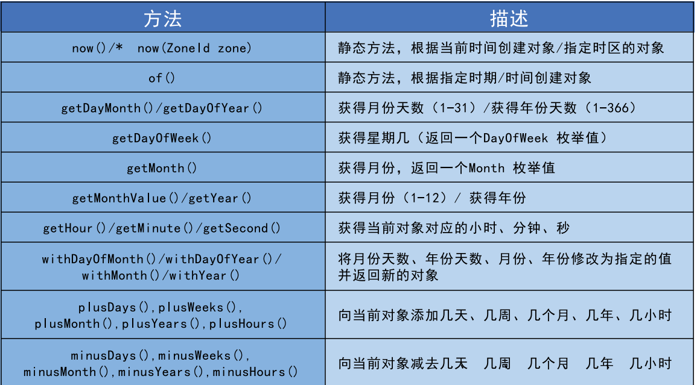
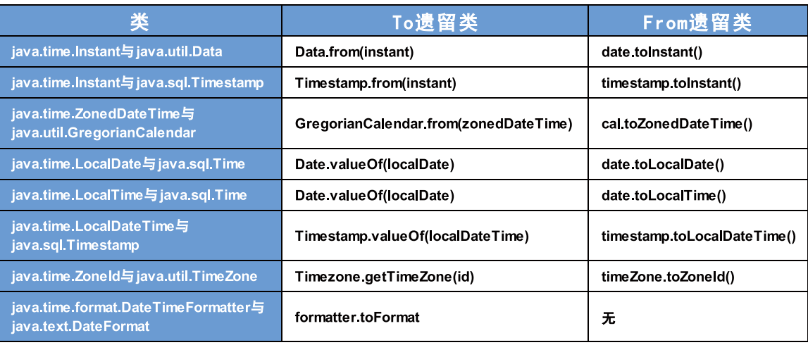
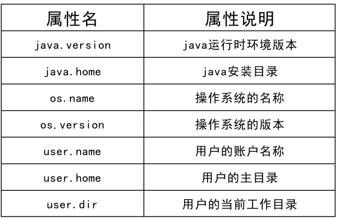
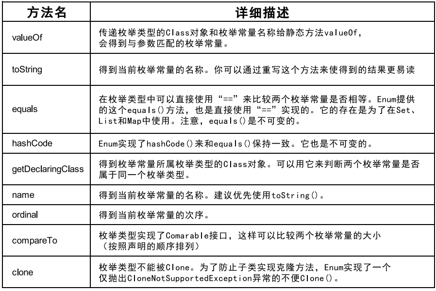
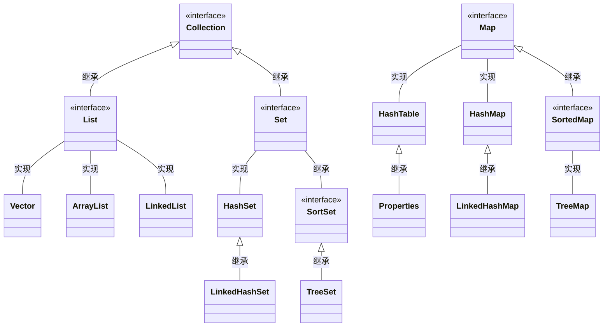
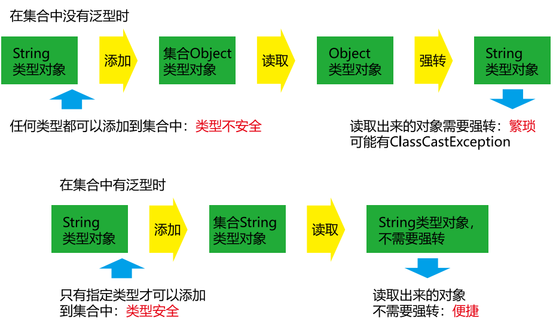
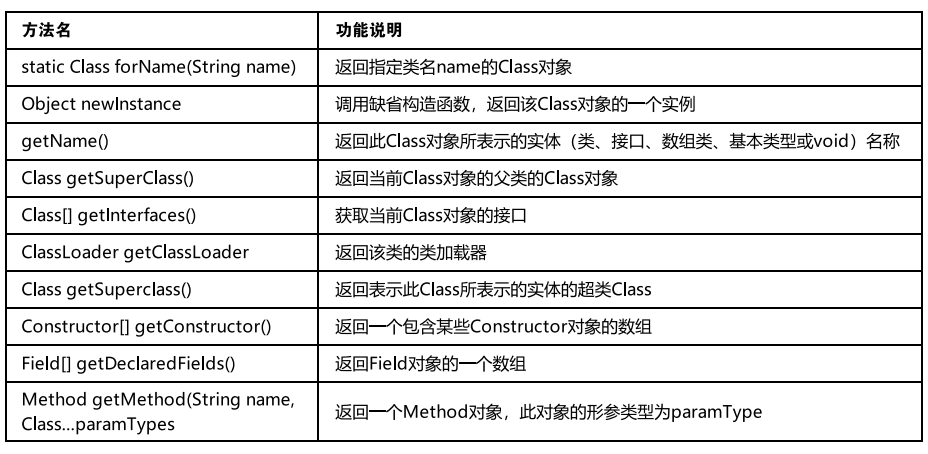
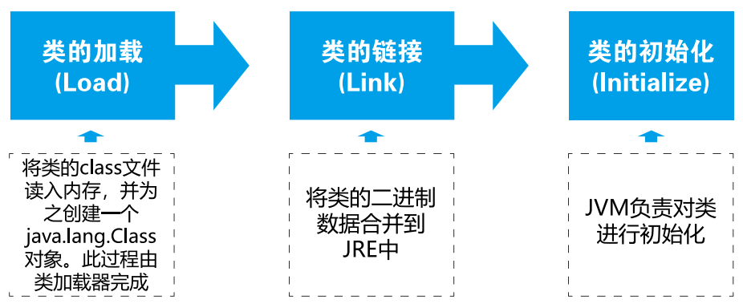
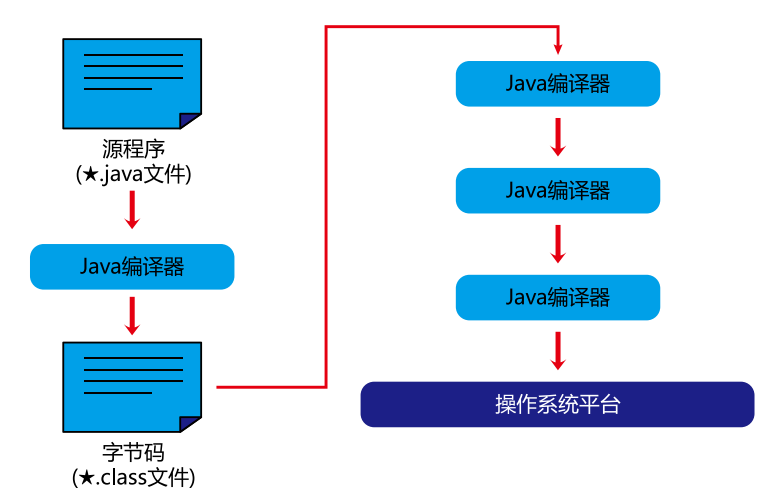
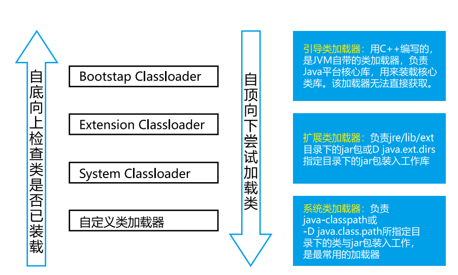

- **author: Shuxin_Wang**
- **time: 2022.07.17**

------

***目录***

- [八、多线程](#八、多线程)
  - [8.1 基本概念：程序、进程、线程](#8.1-基本概念：程序、进程、线程)
  	- [8.1.1 进程与线程](#8.1.1-进程与线程)
  	- [8.1.2 使用多线程的优点](#8.1.2-使用多线程的优点)
  	- [8.1.3 何时需要多线程](#8.1.3-何时需要多线程)
  - [8.2 线程的创建和使用](#8.2-线程的创建和使用)
  	- [8.2.1 线程的创建和启动](#8.2.1-线程的创建和启动)
  	- [8.2.2 Thread 类](#8.2.2-Thread-类)
  	- [8.2.3 API中创建线程的两种方式](#8.2.3-API中创建线程的两种方式)
  		- [继承Thread类](#继承Thread类)
  		- [线程的调度](#线程的调度)
  		- [线程的优先级](#线程的优先级)
  		- [两种方式的联系与区别](#两种方式的联系与区别)
  - [8.3 线程的生命周期](#8.3-线程的生命周期)
  - [8.4 线程的同步](#8.4-线程的同步)
  	- [8.4.3 同步方法处理Runnable](#8.4.3-同步方法处理Runnable)
  	- [8.4.5 线程安全的单例模式之懒汉式](#8.4.5-线程安全的单例模式之懒汉式)
  - [8.5 线程的通信](#8.5-线程的通信)
  - [8.6 新增线程创建方式](#8.6-新增线程创建方式)
  	- [8.6.1 实现Callable接口](#8.6.1-实现Callable接口)
- [九、常见类](#九、常见类)
  - [9.1 字符串相关类](#9.1-字符串相关类)
  	- [9.1.1 String的使用](#9.1.1-String的使用)
  	- [9.1.2 String的不可变性](#9.1.2-String的不可变性)
  	- [9.1.5 String的一道面试题](#9.1.5-String的一道面试题)
  	- [9.1.8 String 的常用方法2](#9.1.8-String-的常用方法2)
  	- [9.1.10 String 与基本数据类型包装的转换](#9.1.10-String-与基本数据类型包装的转换)
  	- [9.1.12 String 与 byte[] 之间的转换](#9.1.12-String-与-byte[]-之间的转换)
  	- [9.1.14 StringBuffer 和 StringBuilder 的介绍](#9.1.14-StringBuffer-和-StringBuilder-的介绍)
  	- [9.1.15 StringBuffer中的常用方法](#9.1.15-StringBuffer中的常用方法)
  	- [9.1.16 String、StringBuffer、StringBuilder 效率低比](#9.1.16-String、StringBuffer、StringBuilder-效率低比)
  - [9.3 JDK 8 之前的日期时间API](#9.3-JDK-8-之前的日期时间API)
  	- [9.3.1 SimpleDataFormat 的使用](#9.3.1-SimpleDataFormat-的使用)
  	- [9.3.2 Calendar 日历类的使用](#9.3.2-Calendar-日历类的使用)
  	- [9.3.3 练习](#9.3.3-练习)
  	- [9.4.1 LocalDate、LocalTime、LocalDateTime的使用](#9.4.1-LocalDate、LocalTime、LocalDateTime的使用)
  	- [9.4.3 DateTimeFormatter的使用](#9.4.3-DateTimeFormatter的使用)
  	- [9.5.3 自定义实现Comparable自然排序](#9.5.3-自定义实现Comparable自然排序)
  - [9.6 System类、Math类、BigInteger与BigDecimal](#9.6-System类、Math类、BigInteger与BigDecimal)
  	- [9.6.1 System类](#9.6.1-System类)
- [十 枚举类与注解](#十-枚举类与注解)
  - [10.1 枚举类的使用](#10.1-枚举类的使用)
  	- [10.1.1 枚举类的理解](#10.1.1-枚举类的理解)
  	- [10.1.2 自定义枚举类](#10.1.2-自定义枚举类)
  	- [10.1.4 Enum类中的常用方法](#10.1.4-Enum类中的常用方法)
  	- [10.2.3 如何自定义注解](#10.2.3-如何自定义注解)
  	- [10.2.4 jdk中4个基本的元注解的使用](#10.2.4-jdk中4个基本的元注解的使用)
  - [11.2 Collection接口常用方法](#11.2-Collection接口常用方法)
  	- [11.3.3 Iterator遍历集合的两种错误写法](#11.3.3-Iterator遍历集合的两种错误写法)
  - [11.4 Collection子接口之一：List接口](#11.4-Collection子接口之一：List接口)
  	- [11.4.1 List接口常用实现类的对比](#11.4.1-List接口常用实现类的对比)
  	- [11.4.2 List接口中常用方法测试](#11.4.2-List接口中常用方法测试)
  	- [11.5.4 关于hashCode()和equals()的重写](#11.5.4-关于hashCode()和equals()的重写)
  	- [11.5.5 LinkedHashSet的使用](#11.5.5-LinkedHashSet的使用)
  	- [11.5.6 TreeSet的自然排序与定制排序](#11.5.6-TreeSet的自然排序与定制排序)
  	- [11.6.2 Map中存储的key-value的特点](#11.6.2-Map中存储的key-value的特点)
  	- [11.6.3 Map实现类之一：HashMap](#11.6.3-Map实现类之一：HashMap)
  	- [11.6.4 HashMap的底层实现原理](#11.6.4-HashMap的底层实现原理)
  	- [11.6.5 Map实现之二：LinkedHashMap](#11.6.5-Map实现之二：LinkedHashMap)
  	- [11.6.6 Map中的常用方法](#11.6.6-Map中的常用方法)
  - [11.7 Collections工具类](#11.7-Collections工具类)
  - [12.3 自定义泛型结构](#12.3-自定义泛型结构)
  	- [12.3.1 自定义泛型类举例](#12.3.1-自定义泛型类举例)
  	- [12.3.2 自定义泛型结构：泛型类、泛型接口](#12.3.2-自定义泛型结构：泛型类、泛型接口)
  	- [12.4.1 通配符数据的读取与写入要求](#12.4.1-通配符数据的读取与写入要求)
- [十三、 I/O流](#十三、-I/O流)
  - [13.1 File类的使用](#13.1-File类的使用)
  	- [13.1.1 File类的实例化](#13.1.1-File类的实例化)
  	- [13.1.2 File类常用方法1](#13.1.2-File类常用方法1)
  	- [13.1.3 File类的常用方法2](#13.1.3-File类的常用方法2)
  - [13.2 I/O流原理及分类](#13.2-I/O流原理及分类)
  	- [13.2.1 I/O流原理](#13.2.1-I/O流原理)
  	- [13.2.2 I/O流分类](#13.2.2-I/O流分类)
  	- [13.2.3 流体系结构](#13.2.3-流体系结构)
  - [13.3 节点流（文件流）](#13.3-节点流（文件流）)
  	- [13.3.1 FileReader读入数据的基本操作](#13.3.1-FileReader读入数据的基本操作)
  	- [13.3.2 FileReader中使用read(char[]cbuf)读入数据](#13.3.2-FileReader中使用read(char[]cbuf)读入数据)
  	- [13.3.4 使用FileInputStream和FileOutputStream读写非文本文件](#13.3.4-使用FileInputStream和FileOutputStream读写非文本文件)
  	- [13.4.1 非文本文件复制](#13.4.1-非文本文件复制)
  - [13.6 标准输入、输出流、打印流、数据流](#13.6-标准输入、输出流、打印流、数据流)
  	- [13.6.1 标准输入、输出流](#13.6.1-标准输入、输出流)
  - [13.7 对象流](#13.7-对象流)
  	- [13.7.1 对象序列化机制的理解](#13.7.1-对象序列化机制的理解)
  	- [13.7.2 自定义类实现序列化与反序列化操作](#13.7.2-自定义类实现序列化与反序列化操作)
  	- [13.7.3 serialVersionUID 的理解](#13.7.3-serialVersionUID-的理解)
  - [13.8 随机存取文件流](#13.8-随机存取文件流)
  - [13.9 NIO.2 中 Path、Paths、Files 类的使用](#13.9-NIO.2-中-Path、Paths、Files-类的使用)
- [十四、网络编程](#十四、网络编程)
  - [14.1 网络编程概述](#14.1-网络编程概述)
  - [14.2 网络通信要素概述](#14.2-网络通信要素概述)
  - [14.3 通信要素1：IP和端口号](#14.3-通信要素1：IP和端口号)
    - [14.3.1 IP的理解与InetAddress类的实例化](#14.3.1-IP的理解与InetAddress类的实例化)
    - [14.3.2 端口号的理解](#14.3.2-端口号的理解)
  - [14.4 通信要素](14.4-通信要素)
  - [14.5 TCP网络编程](#14.5-TCP网络编程)
  - [14.6 UDP网络编程](#14.6-UDP网络编程)
  - [14.7 URL网络编程](#14.7-URL网络编程)
- [十五、反射与动态代理](#十五-反射与动态代理)
  - [15.1 Java反射机制概述](#15.1-Java反射机制概述)
  - [15.2 理解Class类并获取Class示例](#15.2-理解Class类并获取Class示例)
    - [15.2.1 Class类的理解](#15.2.1-Class类的理解)
    - [15.2.2 获取Class实例的4种方式](#15.2.2-获取Class实例的4种方式)
  - [15.3 类的加载与ClassLoader的理解](#15.3-类的加载与ClassLoader的理解)
    - [15.3.1 类的加载过程](#15.3.1-类的加载过程)
    - [15.3.2 什么时候会发生类初始化](#15.3.2-什么时候会发生类初始化)
    - [15.3.3 ClassLoader的理解](#15.3.3-ClassLoader的理解)
  - [15.4 创建运行时类的对象](#15.4-创建运行时类的对象)
  - [15.5 获取运行时类的完整结构](#15.5-获取运行时类的完整结构)
  - [15.6 调用运行时类的指定结构](#15.6-调用运行时类的指定结构)


# 八、多线程


## 8.1 基本概念：程序、进程、线程


- ***程序(program)***：为完成特定任务、用某种语言编写的一组指令的集合。即指一段静态的代码，静态对象。
- ***进程(process)***：程序的一次执行过程，或是正在运行的一个程序。是一个动态的过程：有它自身的产生、存在和消亡的过程。——生命周期。
  - 如：运行中的QQ，运行中的MP3 播放器程序是静态的，进程是动态的。
  - 进程作为资源分配的单位，***<u>系统在运行时会为每个进程分配不同的内存区域</u>***。
- ***线程(thread)***：进程可进一步细化为线程，是一个程序内部的一条执行路径。
  - 若一个进程同一时间并行执行多个线程，就是支持多线程的。
  - 线程是调度和执行的单位，***<u>每个线程拥有独立的运行栈和程序计数器(`pc`)，线程切换的开销小</u>***。
  - 一个进程中的***<u>多个线程共享相同的内存单元/ 内存地址空间</u>*** —>它们从同一堆中分配对象，可以访问相同的变量和对象。这就使得线程间通信更简便、高效。但多个线程操作共享的系统资源可能就会带来安全的隐患。


### 8.1.1 进程与线程


***单核CPU 和多核CPU 的理解：***

- **单核CPU**，其实是一种**<u>假的多线程</u>**，因为在一个时间单元内，也只能执行一个线程的任务。例如：虽然有多车道，但是收费站只有一个工作人员在收费，只有收了费才能通过，那么CPU 就好比收费人员。如果有某个人不想交钱，那么收费人员可以把他“挂起”（晾着他，等他想通了，准备好了钱，再去收费）。但是因为CPU 时间单元特别短，因此感觉不出来。

- 如果是**多核**的话，才能更好的发挥多线程的效率。（现在的服务器都是多核的）。

一个Java 应用程序`java.exe`，其实至少有三个线程：`main()` 主线程，`gc()` 垃圾回收线程，异常处理线程。当然如果发生异常，会影响主线程。

***并行与并发：***

- 并行：**<u>多个CPU 同时执行多个任务</u>**。比如：多个人同时做不同的事。
- 并发：**一个CPU（<u>采用时间片</u>）同时执行多个任务**。比如：秒杀、多个人做同一件事。


### 8.1.2 使用多线程的优点

1. 提高应用程序的响应。对图形化界面更有意义，可增强用户体验；
2. 提高计算机系统CPU 的利用率；
3. 改善程序结构。将既长又复杂的进程分为多个线程，独立运行，利于理解和修改；


### 8.1.3 何时需要多线程

- 程序需要同时执行两个或多个任务；
- 程序需要实现一些需要等待的任务时，如用户输入、文件读写操作、网络操作、搜索等；
- 需要一些后台运行的程序时；


## 8.2 线程的创建和使用


### 8.2.1 线程的创建和启动

Java 语言的`JVM` 允许程序运行多个线程，它通过`java.lang.Thread` 类来体现。


***Thread类的特征：***

- 每个线程都是通过某个特定`Thread` 对象的`run()` 方法来完成操作的，经常把`run()` 方法的主体称为线程体；
- 通过该Thread 对象的`start()` 方法来启动这个线程，而非直接调用`run()`；


### 8.2.2 Thread 类

- `Thread()`：创建新的`Thread` 对象；
- `Thread(String threadname)`：创建线程并指定线程实例名；
- `Thread(Runnabletarget)`：指定创建线程的目标对象，它实现了`Runnable`接口中的`run` 方法；
- `Thread(Runnable target, String name)`：创建新的`Thread` 对象；


### 8.2.3 API中创建线程的两种方式

- 继承`Thread` 类的方式；
- 实现`Runnable` 接口的方式；


#### 继承Thread类

1. 创建一个继承于`Thread` 类的子类；
2. 重写`Thread` 类的`run()` 方法 ---> 将此线程的方法声明在run() 中；
3. 创建`Thread` 类的子对象；
4. 通过此对象调用`start()`。


```java
// 例子: 遍历100 以内的所有的偶数
// 1. 创建一个继承于Thread 类的子类
class MyThread extends Thread {
    // 2. 重写Thread 类的run()
    @Override
    public void run() {
        for (int i = 1; i < 100; i++) {
            if (i % 2 == 0) {
                System.out.println(i);
            }
        }
    }
}

public class ThreadTest {
    public static void main(String[] args) {
        // 3. 创建Thread 类的子对象
        MyThread t1 = new MyThread();
        // 4.通过此对象调用start(): ①启动当前线程 ②调用当前线程的run()
        t1.start();
        // 问题一: 我们不能通过直接调用run() 的方式启动线程。
        // t1.run();
        // 问题二: 再启动一个线程，遍历100 以内的偶数。不可以还让已经start() 的线程去执行。会报IllegalThreadStateException
        // t1.start();
        // 我们需要重现创建一个线程的对象，去start().
        MyThread t2 = new MyThread();
        t2.start();
        // 如下操作仍在main 线程中执行的
        for (int i = 1; i < 100; i++) {
            if (i % 2 == 0) {
                System.out.println(Thread.currentThread().
                        getName() + ":" + i + "***main()***");
            }
        }
    }
}
```


#### Thread 类的有关方法

1. `start()`：启动当前线程，执行当前线程的`run()`；
2. `run()`：通常需要重写`Thread` 类中的此方法，将创建的线程要执行的操作声明在此方法中；
3. `currentThread()`：静态方法，***返回当前代码执行的线程***；
4. `getName()`：获取当前线程的名字；
5. `setName()`：设置当前线程的名字；
6. `yield()`：释放当前CPU 的执行权；
7. `join()`：在线程`a`中调用线程`b`的``join()`, 此时线程`a`就进入阻塞状态，直到线程`b` 完全执行完以后，线程`a`才结束阻塞状态；
8. `stop()`：已过时。当执行此方法时，强制结束当前线程；
9. `sleep(long millitime)`：让当前线程“睡眠”指定时间的`millitime` ***<u>毫秒</u>***。在指定的`millitime` 毫秒时间内，当前线程是阻塞状态的；
10. `isAlive()`：返回`boolean`，判断线程是否还活着；


```java
class HelloThread extends Thread {
    @Override
    public void run() {
        for (int i = 0; i < 100; i++) {
            try {
                sleep(10);
            } catch (InterruptedException e) {
                e.printStackTrace();
            }
            if (i % 2 == 0) {
                System.out.println(Thread.currentThread().getName() + ":" + i);
            }
            // if(i % 20 == 0){
            // yield();
            // }
        }
    }

    public HelloThread(String name) {
        super(name);
    }
}

public class ThreadModeTest {
    public static void main(String[] args) {
        HelloThread h1 = new HelloThread("Thread : 1");
        // h1.setName(" 线程一");
        h1.start();
        // 给主线程命名
        Thread.currentThread().setName(" 主线程");
        for (int i = 0; i < 100; i++) {
            if (i % 2 == 0) {
                System.out.println(Thread.currentThread().getName() + ":" + i);
            }
            if (i == 20) {
                try {
                    h1.join();
                } catch (InterruptedException e) {
                    e.printStackTrace();
                }
            }
        }
        System.out.println(h1.isAlive());
    }
}
```


#### 线程的调度

***调度策略：***

- 时间片；
- 抢占式：高优先级的线程抢占CPU；


***Java的调度方法：***

- ***<u>同优先级</u>线程组成先进先出队列（<u>先到先服务</u>）***，使用***时间片策略***；
- 对高优先级，使用***优先调度的<u>抢占式</u>策略***；


#### 线程的优先级

***线程的优先级等级：***

- `MAX_PRIORITY`：`10`
- `MIN _PRIORITY`：`1`
- `NORM_PRIORITY`：`5` ---> 默认优先级


***涉及的方法：***

- `getPriority()` ：返回线程优先值；
- `setPriority(intnewPriority)` ：改变线程的优先级；

***<u>说明</u>：***高优先级的线程要抢占低优先级线程`cpu` 的执行权。但是***<u>只是从概率上讲</u>***，高优先级的线程***<u>高概率</u>***的情况下被执行。并不意味着只有当高优先级的线程执行完以后，低优先级的线程才会被执行。

```java
class HelloThread1 extends Thread {
    @Override
    public void run() {
        for (int j = 0; j < 100; j++) {
            // try {
            // sleep(10);
            // } catch (InterruptedException e) {
            // e.printStackTrace();
            // }
            if (j % 2 == 0) {
                System.out.println(getName() + ":" + getPriority()
                        + ":" + j);
            }
        }
    }

    public HelloThread1(String name) {
        super(name);
    }
}

public class ThreadModeTest1 {
    public static void main(String[] args) {
        HelloThread1 h2 = new HelloThread1("Thread : 1");
        h2.start();
        // 设置分线程的优先级
        h2.setPriority(Thread.MAX_PRIORITY);
        // 给主线程命名
        Thread.currentThread().setName(" 主线程");
        Thread.currentThread().setPriority((Thread.MIN_PRIORITY));
        for (int j = 0; j < 100; j++) {
            if (j % 2 == 0) {
                System.out.println(
                        Thread.currentThread().getName() + ":" +
                                Thread.currentThread().getPriority() + ":" + j);
            }
            // if( j == 20){
            // try {
            // h2.join();
            // } catch (InterruptedException e) {
            // e.printStackTrace();
            // }
            // }
        }
        System.out.println(h2.isAlive());
    }
}
```


#### 实现Runnable接口

1. 创建一个实现了`Runnable` 接口的类；
2. 实现类去实现`Runnable` 中的抽象方法:`run()`；
3. 创建实现类的对象；
4. 将此对象作为参数传递到`Thread`类的构造器中，创建`Thread`类的对象；
5. 通过`Thread`类的对象调用`start()`；

```java
// 1. 创建一个实现了Runnable 接口的类
class MThread implements Runnable {
    // 2. 实现类去实现Runnable 中的抽象方法:run()
    @Override
    public void run() {
        for (int i = 0; i < 100; i++) {
            if (i % 2 == 0) {
                System.out.println(Thread.currentThread().
                        getName() + ":" + i);
            }
        }
    }
}

public class ThreadTest1 {
    public static void main(String[] args) {
        // 3. 创建实现类的对象
        MThread m1 = new MThread();
        // 4. 将此对象作为参数传递到Thread 类的构造器中，创建Thread 类的对象
        Thread t1 = new Thread(m1);
        // 5. 通过Thread 类的对象调用start(): ①启动线程 ②调用当前线程的run() --> 调用了Runnable 类型的target 的run()
        t1.start();
        // 再启动一个线程，遍历100 以内的偶数
        Thread t2 = new Thread(m1);
        t2.setName(" 线程2");
        t2.start();
    }
}
```


#### 两种方式的联系与区别

开发中：***优先选择*** 实现`Runnable` 接口的方式。

1. 实现的方式***没有类的<u>单继承性</u>的局限性***；

2. 实现的方式更适合来处理***多个线程有<u>共享数据</u>***的情况；

***相同点：***

- 两种方式都需要重写`run()`, 将线程要执行的逻辑声明在`run()`中；


***线程的分类：***

Java 中的线程分为两类：一种是**守护线程**，一种是**用户线程**；

- 它们在几乎每个方面都是相同的，唯一的区别是***判断`JVM` 何时离开***；
- 守护线程是用来服务用户线程的，通过在`start()` 方法前调用`thread.setDaemon(true)` 可以把一个***用户线程<u>变成</u>一个守护线程***；
- ***Java 垃圾回收就是一个典型的守护线程***；
- 若`JVM` 中都是守护线程，当前`JVM` 将退出；
- 形象理解：***<u>兔死狗烹，鸟尽弓藏</u>***；


## 8.3 线程的生命周期


***`JDK` 中用`Thread.State` 类定义了线程的几种状态：***

- **新建**：当一个`Thread` 类或其子类的对象被声明并创建时，新生的线程对象处于新建状态；
- **就绪**：处于新建状态的线程被`start()` 后，将进入线程队列等待CPU 时间片，此时它已具备了运行的条件，只是没分配到CPU 资源；
- **运行**：当就绪的线程被调度并获得CPU 资源时, 便进入运行状态，`run()` 方法定义了线程的操作和功能；
- **阻塞**：在某种特殊情况下，被人为挂起或执行输入输出操作时，让出CPU 并临时中止自己的执行，进入阻塞状态；
- **死亡**：线程完成了它的全部工作或线程被提前强制性地中止或出现异常导致结束；


## 8.4 线程的同步

- 多个线程执行的不确定性引起执行结果的不稳定；

```java
class Windows1 implements Runnable {
    private int ticket = 100;

    @Override
    public void run() {
        while (true) {
            if (ticket > 0) {
                System.out.println(Thread.currentThread().getName() + ": 卖票，票号为: " + ticket);
                ticket--;
            } else {
                break;
            }
        }
    }
}

public class WindowsTest1 {
    public static void main(String[] args) {
        Windows1 w = new Windows1();
        Thread t1 = new Thread(w);
        Thread t2 = new Thread(w);
        Thread t3 = new Thread(w);
        t1.setName(" 窗口1");
        t2.setName(" 窗口2");
        t3.setName(" 窗口3");
        t1.start();
        t2.start();
        t3.start();
    }
}
```


### 8.4.1 同步代码块处理Runnable

***同步代码块：***

```java
synchronized(同步监视器){
    // 需要被同步的代码
}
```

***说明：***

1. **操作共享数据的代码**，即为需要被同步的代码 ---> 不能包含代码多了，也不能包含代码少了；
2. **共享数据**：多个线程共同操作的变量。比如：ticket 就是共享数据；
3. **同步监视器**，俗称：***<u>锁</u>***。任何一个类的对象，都可以来充当锁；

***要求：* 多个线程必须要<u>共用</u>同一把锁**；

***补充：***在实现`Runnable` 接口创建多线程的方式中，我们可以考虑***<u>使用`this`充当同步监视器</u>***。

```java
class Windows1 implements Runnable {
    private int ticket = 100;

    // Object obj = new Object();
    // Dog dog = new Dog();
    @Override
    public void run() {
        while (true) {
            synchronized (this) {
                // 此时的this: 唯一的windows1 的对象 // 方式二:synchronized (dog) {
                if (ticket > 0) {
                    try {
                        Thread.sleep(100);
                    } catch (InterruptedException e) {
                        e.printStackTrace();
                    }
                    System.out.println(Thread.currentThread().
                            getName() + ": 卖票，票号为: " + ticket);
                    ticket--;
                } else {
                    break;
                }
            }
        }
    }
}

public class WindowsTest1 {
    public static void main(String[] args) {
        Windows1 w = new Windows1();
        Thread t1 = new Thread(w);
        Thread t2 = new Thread(w);
        Thread t3 = new Thread(w);
        t1.setName(" 窗口1");
        t2.setName(" 窗口2");
        t3.setName(" 窗口3");
        t1.start();
        t2.start();
        t3.start();
    }
}

class Dog {
}
```


### 8.4.2 同步代码块处理 Thread 类

- 如果操作共享数据的代码完整的声明在一个方法中，我们不妨将此方法声明同步的；

```java
class Windows extends Thread {
    private static int ticket = 100;
    private static Object obj = new Object();

    @Override
    public void run() {
        while (true) {
            // 正确的
            // synchronized (obj) {
            synchronized (Windows.class) {
            // Class class = Windows.class
            // 错误的，因为此时this 表示的是t1,t2,t3 三个对象
            // synchronized (this) {
                if (ticket > 0) {
                    try {
                        Thread.sleep(100);
                    } catch (InterruptedException e) {
                        e.printStackTrace();
                    }
                    System.out.println(getName() + ": 卖票， 票号为: " + ticket);
                    ticket--;
                } else {
                    break;
                }
            }
        }
    }
}

public class WindowsTest2 {
    public static void main(String[] args) {
        Windows t1 = new Windows();
        Windows t2 = new Windows();
        Windows t3 = new Windows();
        t1.setName(" 窗口1");
        t2.setName(" 窗口2");
        t3.setName(" 窗口3");
        t1.start();
        t2.start();
        t3.start();
    }
}
```


### 8.4.3 同步方法处理Runnable

***同步方法总结：***

1. 同步方法仍然涉及到同步监视器，只是不需要我们显式的声明；
2. ***非静态***的同步方法，同步监视器是：this；***静态的同步方法***，同步监视器是：当前类本身。

```java
class Windows3 implements Runnable {
    private int ticket = 100;

    @Override
    public void run() {
        while (true) {
            show();
        }
    }

    public synchronized void show() { // 同步监视器：this
        // synchronized (this){
        if (ticket > 0) {
            try {
                Thread.sleep(100);
            } catch (InterruptedException e) {
                e.printStackTrace();
            }
            System.out.println(Thread.currentThread().getName()
                    + ": 卖票，票号为: " + ticket);
            ticket--;
        }
        // }
    }
}

public class WindowsTest3 {
    public static void main(String[] args) {
        Windows3 w3 = new Windows3();
        Thread t1 = new Thread(w3);
        Thread t2 = new Thread(w3);
        Thread t3 = new Thread(w3);
        t1.setName(" 窗口1");
        t2.setName(" 窗口2");
        t3.setName(" 窗口3");
        t1.start();
        t2.start();
        t3.start();
    }
}
```


### 8.4.4 同步方法处理 Thread 类


```java
class Windows4 extends Thread {
    private static int ticket = 100;

    @Override
    public void run() {
        while (true) {
            show();
        }
    }

    private static synchronized void show() {
        // 同步监视器：Window4.class
        // private synchronized void show(){
        // 同步监视器：t1,t2,t3。此种解决方式是错误的
        if (ticket > 0) {
            try {
                Thread.sleep(100);
            } catch (InterruptedException e) {
                e.printStackTrace();
            }
            System.out.println(Thread.currentThread().getName() + "：卖票，票号为：" + ticket);
            ticket--;
        }
    }
}

public class WindowsTest4 {
    public static void main(String[] args) {
        Windows4 t1 = new Windows4();
        Windows4 t2 = new Windows4();
        Windows4 t3 = new Windows4();
        t1.setName(" 窗口1");
        t2.setName(" 窗口2");
        t3.setName(" 窗口3");
        t1.start();
        t2.start();
        t3.start();
    }
}
```


### 8.4.5 线程安全的单例模式之懒汉式

```java
public class BankTest {
}

class Bank {
    private Bank() {
    }

    private static Bank instance = null;

    public static Bank getInstance() {
        // 方式一：效率稍差
        // synchronized (Bank.class) {
        // if(instance == null){
            // instance = new Bank();
        // }
        // return instance;
        // }
        // 方式二：效率较高
        if (instance == null) {
            synchronized (Bank.class) {
                if (instance == null) {
                    instance = new Bank();
                }
            }
        }
        return instance;
    }
}
```


### 8.4.6 死锁的问题

1. 死锁的理解：不同的线程分别占用对方需要的同步资源不放弃，都在等待对方放弃自己需要的同步资源，就形成了线程的死锁；
2. 说明：
- 出现死锁后，不会出现异常，不会出现提示，只是所有的线程都处于阻塞状态，无法继续；
- 我们使用同步时，要避免出现死锁；


### 8.4.7 Lock锁方式

`java.util.concurrent.locks.Lock` 接口是控制多个线程对共享资源进行访问的工具。锁提供了对共享资源的独占访问，每次只能有***<u>一个线程</u>***对`Lock` 对象加锁，***线程开始访问共享资源之前应先获得`Lock` 对象***。

`ReentrantLock` 类实现了`Lock` ，它拥有与`synchronized`相同的并发性和内存语义，在实现线程安全的控制中，比较常用的是`ReentrantLock`，***<u>可以显式加锁、释放锁</u>***。

从`JDK 5.0` 开始，Java 提供了更强大的线程同步机制——通过***显式定义同步锁对象***来实现同步。同步锁使用Lock 对象充当。


***注意：***如果同步代码有异常，要将`unlock()` 写入`finally` 语句块；


1. 面试题：synchronized 与 Lock 的异同？
- 相同：二者都可以解决线程安全问题；
- 不同：`synchronized` 机制在执行完相应的同步代码以后，***<u>自动的释放</u>***同步监视器。
  Lock 需要***<u>手动的启动</u>***同步（`lock()`），同时结束同步也需要***<u>手动的实现</u>***（`unlock()`）。
2. ***优先使用顺序：***
  - Lock
  - 同步代码块（已经进入了方法体，分配了相应资源）
  - 同步方法（在方法体之外）


```java
import java.util.concurrent.locks.ReentrantLock;

class Windows_ implements Runnable {
    private int ticket = 100;
    // 1. 实例化ReentrantLock
    private ReentrantLock lock = new ReentrantLock();

    @Override
    public void run() {
        while (true) {
            try {
                // 2. 调用锁定方法：lock()
                lock.lock();
                if (ticket > 0) {
                    try {
                        Thread.sleep(100);
                    } catch (InterruptedException e) {
                        e.printStackTrace();
                    }
                    System.out.println(Thread.currentThread().
                            getName() + ": 售票，票号为: " + ticket);
                    ticket--;
                } else {
                    break;
                }
            } finally {
                // 3. 调用解锁方法：unlock()
                lock.unlock();
            }
        }
    }
}

public class LockTest {
    public static void main(String[] args) {
        Windows_ w = new Windows_();
        Thread t1 = new Thread(w);
        Thread t2 = new Thread(w);
        Thread t3 = new Thread(w);
        t1.setName(" 窗口1");
        t2.setName(" 窗口2");
        t3.setName(" 窗口3");
        t1.start();
        t2.start();
        t3.start();
    }
}
```


## 8.5 线程的通信


***涉及方法：***

- `wait()`：一旦执行此方法，当前线程就进入阻塞状态，并***释放同步监视器***；
- `notify()`：一旦执行此方法，就会唤醒被wait 的一个线程。如果有多个线程被wait，就***<u>唤醒优先级高</u>***的那个；
- `notifyAll()`：一旦执行此方法，就会唤醒***<u>所有</u>被wait的线程***；

***说明：***

1. `wait()，notify()，notifyAll()` 三个方法***必须使用在<u>同步代码块或同步方法</u>中***；
2. `wait()，notify()，notifyAll()` 三个方法的***<u>调用者</u>必须是同步代码块或同步方法中的同步监视器***。否则，会出现`IllegalMonitorStateException` 异常；
3. `wait()，notify()，notifyAll()` 三个方法是定义在`java.lang.Object` 类中；

```java
class Number implements Runnable {
    private int number = 1;
    public Object obj = new Object();

    @Override
    public void run() {
        while (true) {
            synchronized (obj) {
                obj.notify();
                if (number <= 100) {
                    try {
                        Thread.sleep(10);
                    } catch (InterruptedException e) {
                        e.printStackTrace();
                    }
                    System.out.println(Thread.currentThread().
                            getName() + ":" + number);
                    number++;
                    try {
                        // 使得调用如下wait() 方法的线程进入阻塞状态
                        obj.wait();
                    } catch (InterruptedException e) {
                        e.printStackTrace();
                    }
                } else {
                    break;
                }
            }
        }
    }
}

public class CommunicationTest {
    public static void main(String[] args) {
        Number number = new Number();
        Thread t1 = new Thread(number);
        Thread t2 = new Thread(number);
        t1.setName(" 线程1");
        t2.setName(" 线程2");
        t1.start();
        t2.start();
    }
}
```


### 8.5.1 sleep() 和 wait() 的异同

***面试题：sleep() 和 wait() 的异同？***

1. 相同点：一旦执行方法，都可以使得当前的***线程进入阻塞***状态。
2. 不同点：
   - ***两个方法声明的位置不同***：`Thread` 类中声明`sleep()`；`Object` 类中声明`wait()`；
   - ***调用的要求不同***：`sleep()` 可以在任何需要的场景下调用；`wait()` 必须使用在同步代码块或同步方法中；
   - ***关于是否释放同步监视器***：如果两个方法都使用在同步代码块或同步方法中，`sleep()` 不会释放锁，`wait()` 会释放锁；


### 8.5.2 生产者/消费者问题

```java
class Clerk {
    private int productCount = 0;

    // 生产产品
    public synchronized void produceProduct() {
        if (productCount < 20) {
            productCount++;
            System.out.println(Thread.currentThread().getName() + ": 开始生产第" + productCount + " 个产品");
            notify();
        } else {
// 等待
            try {
                wait();
            } catch (InterruptedException e) {
                e.printStackTrace();
            }
        }
    }

    // 消费产品
    public synchronized void consumeProduct() {
        if (productCount > 0) {
            System.out.println(Thread.currentThread().getName() + ":开始消费第 " + productCount + "个产品 ");
            productCount--;
            notify();
        } else {
// 等待
            try {
                wait();
            } catch (InterruptedException e) {
                e.printStackTrace();
            }
        }
    }
}

class Producer extends Thread { // 生产者
    private Clerk clerk;

    public Producer(Clerk clerk) {
        this.clerk = clerk;
    }

    @Override
    public void run() {
        System.out.println(getName() + ": 开始生产产品......");
        while (true) {
            try {
                Thread.sleep(10);
            } catch (InterruptedException e) {
                e.printStackTrace();
            }
            clerk.produceProduct();
        }
    }
}

class Consumer extends Thread { // 消费者
    private Clerk clerk;

    public Consumer(Clerk clerk) {
        this.clerk = clerk;
    }

    @Override
    public void run() {
        System.out.println(getName() + ": 开始消费产品......");
        while (true) {
            try {
                Thread.sleep(20);
            } catch (InterruptedException e) {
                e.printStackTrace();
            }
            clerk.consumeProduct();
        }
    }
}

public class ProductTest {
    public static void main(String[] args) {
        Clerk clerk = new Clerk();
        Producer p1 = new Producer(clerk);
        p1.setName(" 生产者1");
        Consumer c1 = new Consumer(clerk);
        c1.setName(" 消费者1");
        Consumer c2 = new Consumer(clerk);
        c2.setName(" 消费者2");
        p1.start();
        c1.start();
        c2.start();
    }
}
```


## 8.6 新增线程创建方式


### 8.6.1 实现Callable接口

1. `call()` 可以***有返回值***的；
2. `call()` 可以***抛出异常***，被外面的操作捕获，获取异常的信息；
3. `Callable` 是***支持泛型***的；
4. 需要借助`FutureTask` 类，比如***获取返回结果***；


***Future接口：***

- 可以对具体`Runnable`、`Callable` 任务的执行结果进行取消、查询是否完成、获取结果等；
- `FutrueTask` 是`Futrue` 接口的***<u>唯一的</u>实现类***；
- `FutureTask` 同时实现了`Runnable`, `Future` 接口。它既可以作为`Runnable` ***<u>被线程执行</u>***，又可以作为`Future` 得到`Callable` 的***<u>返回值</u>***；


```java
import java.util.concurrent.Callable;
import java.util.concurrent.ExecutionException;
import java.util.concurrent.FutureTask;

//1. 创建一个实现Callable 的实现类
class NumThread implements Callable {
    // 2. 实现call 方法，将此线程需要执行的操作声明在call() 中
    @Override
    public Object call() throws Exception {
        int sum = 0;
        for (int i = 1; i <= 100; i++) {
            if (i % 2 == 0) {
                System.out.println(i);
                sum += i;
            }
        }
        return sum;
    }
}

public class ThreadNew {
    public static void main(String[] args) {
        // 3. 创建Callable 接口实现类的对象
        NumThread numThread = new NumThread();
        // 4. 将此Callable 接口实现类的对象作为传递到FutureTask 构造器中，创建FutureTask 的对象
        FutureTask futureTask = new FutureTask(numThread);
        // 5. 将FutureTask 的对象作为参数传递到Thread 类的构造器中，创建Thread 对象，并调用start()
        new Thread(futureTask).start();
        try {
            // 6. 获取Callable 中call 方法的返回值
            // get() 返回值即为FutureTask 构造器参数Callable 实现类重写的call() 的返回值。
            Object sum = futureTask.get();
            System.out.println(" 总和为:" + sum);
        } catch (InterruptedException | ExecutionException e) {
            e.printStackTrace();
        }
    }
}
```


### 8.6.2 使用线程池

1. 背景：
   ***经常创建和销毁、使用量特别大的资源***，比如并发情况下的线程，对性能影响很大。
2. 思路：
   ***提前创建好多个线程，放入线程池中***，使用时直接获取，使用完放回池中。可以避免频繁创建销毁、实现重复利用。类似生活中的公共交通工具。
3. 好处：
   - 提高响应速度（减少了创建新线程的时间）；
   - 降低资源消耗（重复利用线程池中线程，不需要每次都创建）；
   - 便于线程管理；
     - `corePoolSize`：核心池的大小；
     - `maximumPoolSize`：最大线程数；
     - `keepAliveTime`：线程没有任务时最多保持多长时间后会终止；

```java
import java.util.concurrent.ExecutorService;
import java.util.concurrent.Executors;
import java.util.concurrent.ThreadPoolExecutor;

class NumberThread implements Runnable {
    @Override
    public void run() {
        for (int i = 0; i <= 100; i++) {
            if (i % 2 == 0) {
                System.out.println(Thread.currentThread().
                        getName() + ":" + i);
            }
        }
    }
}

class NumberThread1 implements Runnable {
    @Override
    public void run() {
        for (int i = 0; i <= 100; i++) {
            if (i % 2 != 0) {
                System.out.println(Thread.currentThread().
                        getName() + ":" + i);
            }
        }
    }
}

public class ThreadPool {
    public static void main(String[] args) {
        // 1. 提供指定线程数量的线程池
        ExecutorService service = Executors.newFixedThreadPool(10);
        ThreadPoolExecutor service1 = (ThreadPoolExecutor) service;
        // 设置线程池的属性
        // System.out.println(service.getClass());
        // service1.setCorePoolSize(15);
        // service1.setKeepAliveTime();
        // 2. 执行指定的线程的操作。需要提供实现Runnable 接口或Callable 接口实现类的对象
        service.execute(new NumberThread());
        // 适合适用于Runnable
        service.execute(new NumberThread1());
        // 适合适用于Runnable
        // service.submit(Callable callable); // 适合适用于Callable
        // 3. 关闭连接池
        service.shutdown();
    }
}
```


***线程池相关API：***

`JDK 5.0` 起提供了线程池相关API：`ExecutorService` 和`Executors`

- `ExecutorService`：***<u>真正的线程池接口</u>***。常见子类`ThreadPoolExecutor`；
  - `void execute(Runnable command)` ：执行任务/ 命令，没有返回值，一般用来执行`Runnable`；
  - `Future submit(Callable task)`：执行任务，有返回值，一般又来执行`Callable`；
  - `void shutdown()`：关闭连接池；
- `Executors`：工具类、线程池的工厂类，***用于创建并返回<u>不同类型的线程池</u>***；
  - `Executors.newCachedThreadPool()`：创建一个可根据需要创建新线程的线程池；
  - `Executors.newFixedThreadPool(n)`; 创建一个可重用固定线程数的线程池；
  - `Executors.newSingleThreadExecutor()`：创建一个只有一个线程的线程池；
  - `Executors.newScheduledThreadPool(n)`：创建一个线程池，它可安排在给定延迟后运行命令或者定期地执行；


# 九、常见类


## 9.1 字符串相关类


### 9.1.1 String的使用

***String 的特征：***

- `String` 类：代表字符串。Java 程序中的所有字符串字面值（如`"abc"`）都作为此类的实例实现。
- `String` 是一个`final` 类，代表***不可变的字符序列***。
- 字符串是常量，用双引号引起来表示。他们的值在创建之后不可更改。
- `String` 对象的字符内容是储存在一个字符数组`value[]` 中的。


### 9.1.2 String的不可变性

1. `String` 声明为`final` 的，***不可被继承***；
2. `String` 实现了`Serializable` 接口：表示字符串是支持序列化的；实现了`Comparable` 接口：表示`String` 可以比较大小；
3. `String` 内部定义了`final char[] value` 用于存储字符串数据；
4. `String`: 代表不可变的字符序列。简称：不可变性；
   体现：
   -  当对字符串重新赋值时，需要***<u>重写指定内存区域赋值</u>***，不能使用原有的`value` 进行赋值；
   - 当对现有的字符串进行连接操作时，也需要***<u>重新指定内存区域赋值</u>***，不能使用原有的`value` 进行赋值；
   - 当调用`String` 的`replace()` 方法***修改指定字符或字符串***时，***<u>也需要重新指定内存区域赋值</u>***，不能使用原有的`value`进行赋值；
5. 通过***<u>字面量的方式</u>***（区别于`new`）给一个字符串赋值，此时的字符串值***声明在字符串常量池中***；
6. ***字符串常量池中是<u>不会</u>存储相同内容的字符串的***；

```java
import org.testng.annotations.Test;

public class StringTest {
    @Test
    public void Test1() {
        String s1 = "abc"; // 字面量的定义方式
        String s2 = "abc";
        s1 = "hello";
        System.out.println(s1 == s2); // 比较s1 和s2 的地址值
        System.out.println(s1); // hello
        System.out.println(s2); // abc
        System.out.println("*********************");
        String s3 = "abc";
        s3 += "def";
        System.out.println(s3); // abcdef
        System.out.println("**********************");
        String s4 = "abc";
        String s5 = s4.replace('a', 'm');
        System.out.println(s4); // abc
        System.out.println(s5); // mbc
    }
}
```


### 9.1.3 String不同实例化方式的对比

```java
String str = "hello";

// 本质上this.value = new char[0];
String s1 = new String();

//this.value = original.value;
String s2 = new String(String original);

//this.value = Arrays.copyOf(value, value.length);
String s3 = new String(char[] a);

String s4 = new String(char[] a,int startIndex,int count);
```

***String 的实例化方式：***

- 方式一：通过字面量定义的方式
- 方式二：通过new + 构造器的方式

面试题：`String s = new String("abc")；`方式创建对象，在内存中创建了几个对象？
***<u>两个</u>***：一个是堆空间中**<u>new 结构</u>**，另一个是char[] 对应的**<u>常量池中的数据</u>**：`"abc"`；


```java
import org.testng.annotations.Test;

public class StringTest {
    @Test
    public void test2() {
        // 通过字面量定义的方式：此时的s1 和s2 的数据javaEE 声明在方法区中的字符串常量池中。
        String s1 = "javaEE";
        String s2 = "javaEE";
        // 通过new + 构造器的方式：此时的s3 和s4 保存的地址值，是数据在堆空间中开辟空间以后对应的地址值。
        String s3 = new String("javaEE");
        String s4 = new String("javaEE");
        System.out.println(s1 == s2); // true
        System.out.println(s1 == s3); // false
        System.out.println(s1 == s4); // false
        System.out.println(s3 == s4); // false
        System.out.println("***********************");
        Person p1 = new Person("Tom", 12);
        Person p2 = new Person("Tom", 12);
        System.out.println(p1.name.equals(p2.name)); // true
        System.out.println(p1.name == p2.name); // true
        System.out.println("***********************");
        Person p3 = new Person("Tom");
        Person p4 = new Person("Tom");
        System.out.println(p3.name == p4.name); // false
    }
}

class Person {
    public String name;
    int age;

    public Person(String name, int age) {
        this.name = name;
        this.age = age;
    }

    public Person(String name) {
        this.name = new String(name);
    }

    public Person() {
    }
}
```


### 9.1.4 String不同拼接对比

1. ***<u>常量与常量</u>的拼接结果在常量池***。且***常量池中不会存在相同内容的常量***；
2. 只要***其中有<u>一个是变量</u>***，结果就**在堆中**；
3. 如果拼接的结果调用`intern()` 方法，返回值就在常量池中；

```java
import org.testng.annotations.Test;

public class StringTest {
    @Test
    public void test3() {
        String s1 = "javaEE";
        String s2 = "hadoop";
        String s3 = "javaEEhadoop";
        String s4 = "javaEE" + "hadoop";
        String s5 = s1 + "hadoop";
        String s6 = "javaEE" + s2;
        String s7 = s1 + s2;
        System.out.println(s3 == s4); // true
        System.out.println(s3 == s5); // false
        System.out.println(s3 == s6); // false
        System.out.println(s5 == s6); // false
        System.out.println(s3 == s7); // false
        System.out.println(s5 == s6); // false
        System.out.println(s5 == s7); // false
        System.out.println(s6 == s7); // false
        String s8 = s5.intern(); // 返回值得到的s8 使用的常量值中已经存在的“javaEEhadoop”
        System.out.println(s3 == s8); // true
    }
    
    @Test
    public void test4() {
        String s1 = "javaEEhadoop";
        String s2 = "javaEE";
        String s3 = s2 + "hadoop";
        System.out.println(s1 == s3); // false
        final String s4 = "javaEE"; // s4:常量
        String s5 = s4 + "hadoop";
        System.out.println(s1 == s5); // true
    }
}
```


***String 使用陷阱：***

1. `String s1 = “a”`;
   说明：在字符串常量池中创建了一个字面量为"a" 的字符串。
2. `s1 = s1 + “b”`;
   说明：实际上原来的`“a”`字符串对象已经丢弃了，现在在堆空间中产生了一个字符串`s1+“b”`（也就是"ab")。如果多次执行这些改变串内容的操作，会导致大量副本字符串对象存留在内存中，降低效率。如果这样的操作放到循环中，会极大影响程序的性能。
3. `String s2 = “ab”`;
   说明：直接在字符串常量池中创建一个字面量为"ab" 的字符串。
4. `String s3 = “a” + “b”`;
   说明：s3 指向字符串常量池中已经创建的"ab" 的字符串。
5. `String s4 = s1.intern()`;
   说明：堆空间的`s1` 对象在调用`intern()` 之后，会将常量池中已经存在的`"ab"` 字符串赋值给`s4`。


### 9.1.5 String的一道面试题

```java
public class StringTest {

    String str = new String("good");
    char[] ch = {'t', 'e', 's', 't'};

    public void change(String str, char[] ch) {
        str = "test ok";
        ch[0] = 'b';
    }

    public static void main(String[] args) {
        StringTest ex = new StringTest();
        ex.change(ex.str, ex.ch);
        System.out.println(ex.str); // good
        System.out.println(ex.ch); // best
    }
}
```


### 9.1.6 JVM中涉及字符串内存结构


***Heap 堆：***
一个`JVM` 实例只存在一 个堆内存，堆内存的大小是可以调节的。类加载器读取了类文件后: 需要把类方法常变量放到堆内存中，保存所有引用类型的真实信息，以方便执行器执行，堆内存分为三部分:

- `Young Generation Space 新生区` *Young*
- `Tenure Generation Space 养老区` *Old*
- `Permanent Space 永久存储区` *Perm*  ----->  `方法区`

实际而言，***方法区(Method Area) 和堆一样，是<u>各个线程共享的内存区域</u>***，它用于存储虚拟机加载的：类信息+ 普通常量+ 静态变量+ 编译器编译后的代码等等，虽然`JVM` 规范将方法区描述为堆的一个逻辑部分，但它却还有一个别名叫做Non-Heap( 非堆)， 目的就是要和堆分开。

对于`HotSpot` 虚拟机， 很多开发者习惯将方法区称之为*" 永久代(Permanent Gen)"*，但严格本质上说两者不同，或者说使用永久代来实现方法区而已，永久代是方法区的一个实现，`jdk1.7` 的版本中，已经将原本放在永久代的字符串常量池移走。

常量池(Constant Pool) 是方法区的一部分， Class 文件除了有类的版本、字段、方法、接口等描述信息外，还有一项信息就是常量池，这部分内容将在类加载后进入方法区的运行时常量池中存放。


***新生区：***
新生区是类的诞生、成长、消亡的区域，一个类在这里产生，应用, 最后被垃圾回收器收集, 结束生命。新生区又分为两部分：`伊甸区(Eden space)`和`幸存者区(Survivor space)`， 所有的***类都是在伊甸区被new 出来***的。幸存区有两个: `0 区( Survivor 0 space ) 和1 区( Suvivor 1 space )`。***当伊甸园的空间用完时***, 程序又需要创建对象，`JVM` 的垃圾回收器将对伊甸园区进行垃圾回收`(Minor GC)`，将伊甸园区中的不再被其他对象所引用的对象进行销毁。然后将伊甸园中的剩余对象移动到幸存0 区。若幸存0 区也满了，再对该区进行垃圾回收，然后移动到1 区。那如果1 区也满了呢？再移动到养老区。若养老区也满了, 那么这个时候将产生`Major GC (FullGC)`，进行养老区的内存清理。若养老区执行了`Full GC` 之后发现依然无法进行对象的保存，就会产生`OOM` 异常`OutOfMemoryError`。

如果出现`java.lang.OutOfMemoryError: Java heap space` 异常，说明Java虚拟机的堆内存不够。原因有二：

- Java 虚拟机的堆内存设置不够，可以通过参数`-Xms、-Xmx`来调整；
- 代码中创建了大量大对象，并且长时间不能被垃圾收集器收集( 存在被引用）--->***内存溢出; 内存泄漏***；


***永久区：***

永久存储区是一个***常驻内存区域***，用于存放`JDK` 自身所携带的`Class,Interface` 的元数据，也就是说它存储的是运行环境必须的类信息，***被装载进此区域的数据是不会被垃圾回收器回收掉的***，关闭`JVM` 才会释放此区域所占用的内存。

如果出现`java.lang.OutOfMemoryError: PermGen space`，说明是Java 虚拟机对`永久代Perm`内存设置不够。一般出现这种情况，都是程序启动需要加载大量的第三方jar 包。例如：在一个Tomcat下部署了太多的应用。或者大量动态反射生成的类不断被加载，最终导致Perm 区被占满。

- `Jdk1.6` 及之前：常量池分配在永久代，1.6 在方法区；
- `Jdk1.7` : 有，但已经逐步“去永久代”，1.7 在堆；
- `Jdk1.8` 及之后：无，1.8 在元空间；


### 9.1.7 String的常用方法1

- `int length()`：返回字符串的长度：`return value.length`；
- `char charAt(intindex)`：返回某索引处的字符`return value[index]`； 
- `boolean isEmpty()`：判断是否是空字符串：`returnvalue.length==0`；
- `String toLowerCase()`：使用默认语言环境，将`String` 中的所有字符转换为小写；
- `String toUpperCase()`：使用默认语言环境，将`String` 中的所有字符转换为大写；
- `String trim()`：返回字符串的副本，***忽略前导空白和尾部空白***；
- `boolean equals(Object obj)`：比较字符串的内容是否相同；
- `boolean equals IgnoreCase(String anotherString)`：与`equals` 方法类似，***<u>忽略大小写</u>***；
- `String concat(Stringstr)`：将指定字符串连接到此字符串的结尾。等价于用`“+”`；
- `int compareTo(String anotherString)`：比较两个字符串的大小；
- `String substring(int beginIndex)`：返回一个新的字符串，它是此字符串的从`beginIndex` 开始截取到最后的一个子字符串；
- `String substring(int beginIndex,intendIndex)`：返回一个新字符串，它是此字符串从`beginIndex` 开始截取到`endIndex`***( 不包含）*** 的一个子字符串；

```java
import org.testng.annotations.Test;

public class StringMethodTest {
    @Test
    public void Test1() {
        String s1 = "helloworld";
        System.out.println(s1.length());
        System.out.println(s1.length());
        System.out.println(s1.charAt(0));
        System.out.println(s1.charAt(9));
        // System.out.println(s1.charAt(10));
        // s1 = "";
        System.out.println(s1.isEmpty());
        String s2 = s1.toLowerCase();
        System.out.println(s1);// s1 不可变的，仍然为原来的字符串
        System.out.println(s2);// 改成小写以后的字符串
        String s3 = " he llo world ";
        String s4 = s3.trim();
        System.out.println("-----" + s3 + "-----");
        System.out.println("-----" + s4 + "-----");
    }
    
    @Test
    public void test2() {
        String s1 = "HelloWorld";
        String s2 = "helloworld";
        System.out.println(s1.equals(s2)); // false
        System.out.println(s1.equalsIgnoreCase(s2));// true
        String s3 = "abc";
        String s4 = s3.concat("def");
        System.out.println(s4);// abcdef
        String s5 = "abc";
        String s6 = new String("abe");
        System.out.println(s5.compareTo(s6)); // -2
        // 涉及到字符串的排序
        String s7 = "周围好吵啊";
        String s8 = s7.substring(2);
        System.out.println(s7);
        System.out.println(s8);
        String s9 = s7.substring(0, 2);
        System.out.println(s9);
    }
}
```


### 9.1.8 String 的常用方法2

- `boolean endsWith(String suffix)`：测试此字符串是否以指定的后缀结束。

- `boolean startsWith(String prefix)`：测试此字符串是否以指定的前缀开始。

- `boolean startsWith(String prefix, int toffset)`：测试此字符串从指定索引开始的子字符串是否以指定前缀开始。

- `boolean contains(CharSequence s)`：当且仅当此字符串包含指定的char值序列时，返回 true

- `int indexOf(String str)`：返回指定子字符串在此字符串中第一次出现处的索引。

- `int indexOf(String str, int fromIndex)`：返回指定子字符串在此字符串中第一次出现处的索引，***从指定的索引开始***。

- `int lastIndexOf(String str)`：返回指定子字符串在此字符串中最右边出现处的索引。

- `int lastIndexOf(String str, int fromIndex)`：返回指定子字符串在此字符串中最后一次出现处的索引，***从指定的索引开始<u>反向搜索</u>***。

  **注：`indexOf` 和`lastIndexOf` 方法如果未找到都是返回`-1`。**

```java
import org.testng.annotations.Test;

public class StringMethodTest {
    @Test
    public void test3() {
        String str1 = "helloworld";
        boolean b1 = str1.endsWith("rld");
        System.out.println(b1);
        boolean b2 = str1.startsWith("He");
        System.out.println(b2);
        boolean b3 = str1.startsWith("ll", 2);
        System.out.println(b3);
        String str2 = "wor";
        System.out.println(str1.contains(str2));
        System.out.println(str1.indexOf("lo"));
        System.out.println(str1.indexOf("lo", 5));
        String str3 = "hellorworld";
        System.out.println(str3.lastIndexOf("or"));
        System.out.println(str3.lastIndexOf("or", 6));
        // 什么情况下，indexOf(str) 和lastIndexOf(str) 返回值相同？
        // 情况一：存在唯一的一个str。情况二：不存在str
    }
}
```


### 9.1.9 String的常用方法3

***替换：***

- `String replace(char oldChar, char newChar)`：返回一个新的字符串，它是通过用 `newChar` ***替换此字符串中出现的<u>所有</u>*** `oldChar` 得到的。
- `String replace(CharSequence target, CharSequence replacement)`：使用指定的字面值替换序列替换此字符串所有匹配字面值目标序列的子字符串。
- `String replaceAll(String regex, String replacement)`：使用给定的 `replacement`替换此字符串***<u>所有</u>***匹配给定的***正则表达式的子字符串***。
- `String replaceFirst(String regex, String replacement)`：使用给定replacement 替换此字符串匹配给定的正则表达式的***<u>第一个</u>***子字符串。

***匹配：***

- `boolean matches(String regex)`：告知此字符串是否匹配给定的正则表达式。

***切片：***

- `String[] split(String regex)`：根据给定正则表达式的匹配拆分此字符串。
- `String[] split(String regex, int limit)`：根据匹配给定的正则表达式来拆分此字符串，最多***不超过***`limit`个，如果超过了，剩下的全部都放到最后一个元素中。

```java
public class StringMethodTest {
     @Test
    public void test4() {
        String str1 = " 西藏布达拉宫欢迎您";
        String str2 = str1.replace('西', '东');
        System.out.println(str1);
        System.out.println(str2);
        String str3 = str1.replace("西藏", "南京");
        System.out.println(str3);
        System.out.println("*************************");
        String str = "12hello34world5java7891mysql456";
        // 把字符串中的数字替换成','，如果结果中开头和结尾有，的话去掉
        String string = str.replaceAll("\\d+", ",").replaceAll("^,|,$", "");
        System.out.println(string);
        System.out.println("*************************");
        str = "12345";
        // 判断str 字符串中是否全部有数字组成，即有1-n 个数字组成
        boolean matches = str.matches("\\d+");
        System.out.println(matches);
        String tel = "0571-4534289";
        // 判断这是否是一个杭州的固定电话
        boolean result = tel.matches("0571-\\d{7,8}");
        System.out.println(result);
        System.out.println("*************************");
        str = "hello|world|java";
        String[] strs = str.split("\\|");
        for (int i = 0; i < strs.length; i++) {
            System.out.println(strs[i]);
        }
        System.out.println();
        str2 = "hello.world.java";
        String[] strs2 = str2.split("\\.");
        for (int i = 0; i < strs2.length; i++) {
            System.out.println(strs2[i]);
        }
    }
}
```


### 9.1.10 String 与基本数据类型包装的转换

- `String` --> 基本数据类型、包装类：调用包装类的静态方法：`parseXxx(str)`；
- 基本数据类型、包装类 --> `String`: 调用`String` 重载的`valueOf(xxx)`；

```java
import org.testng.annotations.Test;

public class StringTest1 {
    @Test
    public void test1() {
        String str1 = "123";
        // int num = (int)str1; // 错误的
        int num = Integer.parseInt(str1);
        String str2 = String.valueOf(num); // "123
        String str3 = num + "";
        System.out.println(str1 == str3); // false
    }
}
```


### 9.1.11 String 与 char[] 之间的转换

- `String` --> char[]: 调用`String` 的`toCharArray()`；
- `char[]` --> `String`: 调用`String` 的构造器；


```java
import org.testng.annotations.Test;

public class StringTest1 {
    @Test
    public void test2() {
        String str1 = "abc123"; // 题目：a21cb3
        char[] charArray = str1.toCharArray();
        for (int i = 0; i < charArray.length; i++) {
            System.out.println(charArray[i]);
        }
        char[] arr = new char[]{'h', 'e', 'l', 'l', 'o'};
        String str2 = new String(arr);
        System.out.println(str2);
    }
}
```


### 9.1.12 String 与 byte[] 之间的转换


- 编码：`String` --> `byte[]`: 调用`String` 的`getBytes()`

- 解码：`byte[]` --> `String`: 调用`String` 的构造器

- 编码：字符串 --> 字节 ( 看得懂 ---> 看不懂的二进制数据)

- 解码：编码的逆过程，字节 --> 字符串 （看不懂的二进制数据 ---> 看得懂）

  说明：***解码时，要求解码使用的字符集必须与编码时使用的<u>字符集一致</u>，否则会出现乱码。***

```java
import org.testng.annotations.Test;
import java.io.UnsupportedEncodingException;
import java.util.Arrays;

public class StringTest1 {
    @Test
    public void test3() throws UnsupportedEncodingException {
        String str1 = "abc123 重工";
        byte[] bytes = str1.getBytes();
        // 使用默认的字符编码集, 进行转换
        System.out.println(Arrays.toString(bytes));
        byte[] gbks = str1.getBytes("gbk");
        // 使用gbk 字符集进行编码。
        System.out.println(Arrays.toString(gbks));
        System.out.println("*****************************");
        String str2 = new String(bytes);
        // 使用默认的字符集，进行解码。
        System.out.println(str2);
        String str3 = new String(gbks);
        System.out.println(str3);
        // 出现乱码。原因：编码集和解码集不一致！
        String str4 = new String(gbks, "gbk");
        System.out.println(str4);
        // 没有出现乱码。原因：编码集和解码集一致！
    }
}
```


### 9.1.13 面试例题

***获取两个字符串中最大相同字串：***

```java
import org.testng.annotations.Test;

import java.util.Arrays;

public class StringDemo {

    // 前提：两个字符串中只有一个最大相同子串
    public String getMaxSameString(String str1, String str2) {
        if (str1 != null && str2 != null) {
            String maxStr = (str1.length() >= str2.length()) ? str1 :
                    str2;
            String minStr = (str1.length() < str2.length()) ? str1 :
                    str2;
            int length = minStr.length();
            for (int i = 0; i < length; i++) {
                for (int x = 0, y = length - i; y <= length; x++,
                        y++) {
                    String subStr = minStr.substring(x, y);
                    if (maxStr.contains(subStr)) {
                        return subStr;
                    }
                }
            }
        }
        return null;
    }

    // 如果存在多个长度相同的最大相同子串
    // 此时先返回String[]，后面可以用集合中的ArrayList 替换，较方便
    public String[] getMaxSameString1(String str1, String str2) {
        if (str1 != null && str2 != null) {
            StringBuffer sBuffer = new StringBuffer();
            String maxString = (str1.length() > str2.length()) ? str1 : str2;
            String minString = (str1.length() > str2.length()) ? str2 : str1;
            int len = minString.length();
            for (int i = 0; i < len; i++) {
                for (int x = 0, y = len - i; y <= len; x++, y++) {
                    String subString = minString.substring(x, y);
                    if (maxString.contains(subString)) {
                        sBuffer.append(subString + ",");
                    }
                }
                //System.out.println(sBuffer);
                if (sBuffer.length() != 0) {
                    break;
                }
            }
            String[] split = sBuffer.toString().replaceAll(",$", "").
                    split("\\,");
            return split;
        }
        return null;
    }

    @Test
    public void testGetMaxSameString() {
        String str1 = "abcwerthello1yuiodefabcdef";
        String str2 = "cvhello1bnmabcdef";
        String[] maxSameStrings = getMaxSameString1(str1, str2);
        System.out.println(Arrays.toString(maxSameStrings));
    }
}
```


### 9.1.14 StringBuffer 和 StringBuilder 的介绍

- `String`：***不可变***的字符序列；底层使用`char[]` 存储；
- `StringBuffer`：可变的字符序列；***线程安全的，<u>效率低</u>***；底层使用`char[]`存储；
- `StringBuilder`：可变的字符序列；`jdk5.0` 新增的，***<u>线程不安全</u>的，效率高***；底层使用`char[]` 存储；


默认情况下，扩容为原来容量的2 倍 + 2，同时将原有数组中的元素复制到新的数组中；

***意义***：开发中建议大家使用：`StringBuffer(int capacity)` 或`StringBuilder(int capacity)`；


### 9.1.15 StringBuffer中的常用方法

- `StringBuffer append(xxx)`：提供了很多的`append()` 方法，用于进行字符串拼接；
- `StringBuffer delete(int start,int end)`：删除指定位置的内容；
- `StringBuffer replace(int start,int end,String str)`：把[start,end)位置替换为str；
- `StringBuffer insert(int offset, xxx)`：在指定位置插入xxx；
- `StringBuffer reverse()` ：把当前字符序列逆转；
- `public int indexOf(String str)`；
- `public String substring(int start,int end)`: 返回一个从`start` 开始到`end` 索引结束的左闭右开区间的子字符串；
- `public int length()`；
- `public char charAt(int n )`；
- `public void setCharAt(int n ,char ch)`；

***总结：***

- 增：`append(xxx)`
- 删：`delete(int start,int end)`
- 改：`setCharAt(int n ,char ch) / replace(int start, int end, String str)`
- 查：`charAt(int n )`
- 插：`insert(int offset, xxx)`
- 长度：`length()`
- 遍历：`for() + charAt() / toString()`


### 9.1.16 String、StringBuffer、StringBuilder 效率低比

- 从高到低排列：`StringBuilder` > `StringBuffer` > `String`

```java
import org.testng.annotations.Test;

public class StringBufferBuilderTest {
    @Test
    public void test1() {
        StringBuffer sb1 = new StringBuffer("abc");
        sb1.setCharAt(0, 'm');
        System.out.println(sb1);
        StringBuffer sb2 = new StringBuffer();
        System.out.println(sb2.length()); // 0
    }

    @Test
    public void test2() {
        StringBuffer s1 = new StringBuffer("abc");
        s1.append(1);
        s1.append('1');
        System.out.println(s1);
        // s1.delete(2,4);
        // s1.replace(2,4,"hello");
        // s1.insert(2,false);
        // s1.reverse();
        String s2 = s1.substring(1, 3);
        System.out.println(s1);
        System.out.println(s1.length());
        System.out.println(s2);
    }

    @Test
    public void test3() {
        // 初始设置
        long startTime = 0L;
        long endTime = 0L;
        String text = "";
        StringBuffer buffer = new StringBuffer("");
        StringBuilder builder = new StringBuilder("");
        // 开始对比
        startTime = System.currentTimeMillis();
        for (int i = 0; i < 20000; i++) {
            buffer.append(String.valueOf(i));
        }
        endTime = System.currentTimeMillis();
        System.out.println("StringBuffer 的执行时间：" + (endTime - startTime));
        startTime = System.currentTimeMillis();
        for (int i = 0; i < 20000; i++) {
            builder.append(String.valueOf(i));
        }
        endTime = System.currentTimeMillis();
        System.out.println("StringBuilder 的执行时间：" + (endTime - startTime));
        startTime = System.currentTimeMillis();
        for (int i = 0; i < 20000; i++) {
            text = text + i;
        }
        endTime = System.currentTimeMillis();
        System.out.println("String 的执行时间：" + (endTime - startTime));
    }

}
```


## 9.2 时间获取


### 9.2.1 System 类中获取时间戳的方法

`System` 类提供的`public static long currentTimeMillis()`用来返回当前时间与`1970 年1 月1 日0 时0 分0 秒`之间以毫秒为单位的时间差。

***此方法适于计算时间差***。


***计算世界时间的主要标准有：***

- `UTC(Coordinated Universal Time)`
- `GMT(Greenwich Mean Time)`
- `CST(Central Standard Time)`


### 9.2.2 两个 Data 类的使用

`java.util.Date` 类 ---> 表示特定的瞬间，精确到毫秒 。

​		|---`java.sql.Date` 类


1. 两个构造器的使用
> 构造器一：Date()：创建一个对应当前时间的Date 对象；
> 构造器二：创建指定毫秒数的Date 对象 。
2. 两个方法的使用
> `toString()`: 显示当前的年、月、日、时、分、秒 ；
> `getTime()`: 获取当前Date 对象对应的毫秒数。**（时间戳）**。
3. `java.sql.Date` 对应着数据库中的日期类型的变量
> 如何实例化 ；
> 如何将`java.util.Date` 对象转换为`java.sql.Date` 对象。

```java
import org.testng.annotations.Test;
import java.util.Date;

public class DataTimeTest {

    // System 类中的currentTimeMillis()
    @Test
    public void test1() {
        long time = System.currentTimeMillis();
        // 返回当前时间与1970 年1 月1 日0 时0 分0 秒之间以毫秒为单位的时间差。
        // 称为时间戳
        System.out.println(time);
    }

    @Test
    public void test2() {
        // 构造器一：Date()：创建一个对应当前时间的Date 对象
        Date date1 = new Date();
        System.out.println(date1.toString());
        // Sat May 09 20:09:11 CST 2020
        System.out.println(date1.getTime()); // 1589026216998
        // 构造器二：创建指定毫秒数的Date 对象
        Date date2 = new Date(1589026216998L);
        System.out.println(date2.toString());
        // 创建java.sql.Date 对象
        java.sql.Date date3 = new java.sql.Date(35235325345L);
        System.out.println(date3); // 1971-02-13
        // 如何将java.util.Date 对象转换为java.sql.Date 对象
        // 情况一：
        // Date date4 = new java.sql.Date(2343243242323L);
        // java.sql.Date date5 = ( java.sql.Date) date4;
        // 情况二：
        Date date6 = new Date();
        java.sql.Date date7 = new java.sql.Date(date6.getTime());
    }
}

```


## 9.3 JDK 8 之前的日期时间API


### 9.3.1 SimpleDataFormat 的使用

`Date` 类的API 不易于国际化，大部分被废弃了，`java.text.SimpleDateFormat`类是一个不与语言环境有关的方式来格式化和解析日期的具体类。

- 格式化：日期 —> 文本
- 解析：文本 —> 日期
- `SimpleDataFormat`的实例化


### 9.3.2 Calendar 日历类的使用

`Calendar` 是一个抽象基类，主用用于完成日期字段之间相互操作的功能。

***获取`Calendar` 实例的方法：***

- 使用`Calendar.getInstance()` 方法；
- 调用它的子类`GregorianCalendar` 的构造器。

一个Calendar 的实例是***系统时间的抽象表示***，通过`get(int field)` 方法来取得想要的时间信息。比如`YEAR、MONTH、DAY_OF_WEEK、HOUR_OF_、DAY 、MINUTE、SECOND`

- `public void set(int field,int value)`；
- `public void add(int field,int amount)`；
- `public final Date getTime()`；
- `public final void setTime(Date date)`。

***注意：***

- 获取月份时：一月是0，二月是1，以此类推，12 月是11；
- 获取星期时：周日是1，周二是2，。。。。周六是7；


### 9.3.3 练习

```java
import org.testng.annotations.Test;
import java.text.ParseException;
import java.text.SimpleDateFormat;
import java.util.Calendar;
import java.util.Date;

public class DateTime {

    @Test
    public void testSimpleDateFormat() throws ParseException {
        // 实例化SimpleDateFormat
        SimpleDateFormat sdf = new SimpleDateFormat();
        // 格式化：日期---》字符串
        Date date = new Date();
        System.out.println(date); // Sun May 10 16:34:30 CST 2020
        String format = sdf.format(date);
        System.out.println(format); // 20-5-10 下午4:34
        // 解析：格式化的逆过程，字符串---》日期
        String str = "19-12-18 上午11:43";
        Date date1 = sdf.parse(str);
        System.out.println(date1);
        // Wed Dec 18 11:43:00 CST 2019
        // ************* 按照指定的方式格式化和解析：调用带参的构造器*****************
        // SimpleDateFormat sdf1 = new SimpleDateFormat("yyyyy.MMMMM.dd GGG hh:mm aaa");
        SimpleDateFormat sdf1 = new SimpleDateFormat("yyyyy. MMMMM.dd GGG hh:mm aaa");
        // 格式化
        String format1 = sdf1.format(date);
        System.out.println(format1);
        // 02020. 五月.10 公元 04:32 下午
        // 解析: 要求字符串必须是符合SimpleDateFormat 识别的格式(通过构造器参数体现),
        // 否则，抛异常
        Date date2 = sdf1.parse("02020. 五月.10 公元 04:32 下午");
        System.out.println(date2);
        // Sun May 10 16:32:00 CST 2020
    }

    // 练习1：字符串"2020-09-08" 转换为java.sql.Date
    @Test
    public void testExer() throws ParseException {
        String birth = "2020-09-08";
        SimpleDateFormat sdf1 = new SimpleDateFormat("yyyy- MM-dd");
        Date date = sdf1.parse(birth);
        // System.out.println(date);
        java.sql.Date birthDate = new java.sql.Date(date.getTime());
        System.out.println(birthDate);
    }

    //Calendar 日历类的使用
    @Test
    public void testCalendar() {
        // 1. 实例化
        // 方式一：创建其子类（GregorianCalendar）的对象
        // 方式二：调用其静态方法getInstance()
        Calendar calendar = Calendar.getInstance();
        // System.out.println(calendar.getClass());
        //class java.util.GregorianCalendar
        // 2. 常用方法
        // get()
        int days = calendar.get(Calendar.DAY_OF_MONTH);
        System.out.println(days); // 10
        System.out.println(calendar.get(Calendar.DAY_OF_YEAR));
        // 131, 今天是这一年的131 天
        // set()
        // calendar 可变性
        calendar.set(Calendar.DAY_OF_MONTH, 22);
        days = calendar.get(Calendar.DAY_OF_MONTH);
        System.out.println(days); // 22
        // add()
        calendar.add(Calendar.DAY_OF_MONTH, -3);
        days = calendar.get(Calendar.DAY_OF_MONTH);
        System.out.println(days); // 22-3 --》19
        // getTime():日历类---> Date
        Date date = calendar.getTime();
        System.out.println(date); // Tue May 19 17:12:06 CST 2020
        // setTime():Date ---> 日历类
        Date date1 = new Date();
        calendar.setTime(date1);
        days = calendar.get(Calendar.DAY_OF_MONTH);
        System.out.println(days); // 10
    }
}
```


## 9.4 JDK 8 中的日期时间API

如果我们可以跟别人说：“我们在 1502643933071 见面，别晚了！” 那么就再简单不过了。但是我们希望时间与昼夜和四季有关，于是事情就变复杂了。JDK 1.0 中包含了一个 java.util.Date 类，但是它的大多数方法已经在 JDK 1.1 引入 Calendar 类之后被弃用了。而 Calendar 并不比 Date 好多少。它们面临的问题是：

- 可变性：像日期和时间这样的类应该是不可变的。
- 偏移性：Date 中的年份是从 1900 开始的，而月份都从 0 开始。
- 格式化：格式化只对 Date 有用，Calendar 则不行。
- 此外，它们也不是线程安全的；不能处理闰秒等。  

```java
import org.testng.annotations.Test;
import java.util.Date;

public class JDK8DateTimeTest {
        @Test
        public void testDate() {
            // 偏移量
            Date date1 = new Date(2020, 9, 8);
            System.out.println(date1); // Fri Oct 08 00:00:00 CST 3920
            Date date2 = new Date(2020 - 1900, 9 - 1, 8);
            System.out.println(date2); // Tue Sep 08 00:00:00 CST 2020
        }
}
```


### 9.4.1 LocalDate、LocalTime、LocalDateTime的使用

LocalDate、LocalTime、LocalDateTime 类是其中较重要的几个类，它们的实例是不可变的对象，分别表示使用 ISO-8601 日历系统的日期、时间、日期和时间。它们提供了简单的本地日期或时间，并不包含当前的时间信息，也不包含与时区相关的信息。

- LocalDate 代表 IOS 格式（yyyy-MM-dd）的日期 , 可以存储生日、纪念日等日期。

- LocalTime 表示一个时间，而不是日期。

- LocalDateTime 是用来表示日期和时间的，这是一个最常用的类之一。

***注：ISO-8601 日历系统是国际标准化组织制定的现代公民的日期和时间的表示法，也就是公历***  

```java
public class JDK8DateTimeTest {
    
    @Test
    public void test1() {
        // now(): 获取当前的日期、时间、日期 + 时间
        LocalDate localDate = LocalDate.now();
        LocalTime localTime = LocalTime.now();
        LocalDateTime localDateTime = LocalDateTime.now();
        System.out.println(localDate);
        System.out.println(localTime);
        System.out.println(localDateTime);
        // of(): 设置指定的年、月、日、时、分、秒。没有偏移量
        LocalDateTime localDateTime1 = LocalDateTime.of(2020, 10, 6, 13, 23, 43);
        System.out.println(localDateTime1);
        // getXxx()：获取相关的属性
        System.out.println(localDateTime.getDayOfMonth());
        System.out.println(localDateTime.getDayOfWeek());
        System.out.println(localDateTime.getMonth());
        System.out.println(localDateTime.getMonthValue());
        System.out.println(localDateTime.getMinute());
        // 体现不可变性
        // withXxx(): 设置相关的属性
        LocalDate localDate1 = localDate.withDayOfMonth(22);
        System.out.println(localDate);
        System.out.println(localDate1);
        LocalDateTime localDateTime2 = localDateTime.withHour(4);
        System.out.println(localDateTime);
        System.out.println(localDateTime2);
        // 不可变性
        LocalDateTime localDateTime3 = localDateTime.plusMonths(3);
        System.out.println(localDateTime);
        System.out.println(localDateTime3);
        LocalDateTime localDateTime4 = localDateTime.minusDays(6);
        System.out.println(localDateTime);
        System.out.println(localDateTime4);
    } 
}
```




### 9.4.2 Instant类的使用

Instant：时间线上的一个瞬时点。这可能被用来记录应用程序中的事件时间戳。

在处理时间和日期的时候，我们通常会想到年 , 月 , 日 , 时 , 分 , 秒。然而，这只是时间的一个模型，是面向人类的。第二种通用模型是面向机器的，或者说是连续的。在此模型中，时间线中的一个点表示为一个很大的数，这有利于计算机处理。在 UNIX 中，这个数从 1970 年开始，以秒为的单位；同样的，在 Java 中，也是从 1970 年开始，但以毫秒为单位。

java.time 包通过值类型 Instant 提供机器视图，不提供处理人类意义上的时间单位。Instant 表示时间线上的一点，而不需要任何上下文信息，例如，时区。概念上讲，它只是简单的表示自 1970 年 1 月 1 日 0 时 0 分 0 秒（UTC）开始的秒数。因为 java.time 包是基于纳秒计算的，所以 Instant 的精度可以达到***<u>纳秒级</u>***  

```java
public class JDK8DateTimeTest {
	@Test
    public void test2() {
        // now(): 获取本初子午线对应的标准时间
        Instant instant = Instant.now();
        System.out.println(instant);
        // 添加时间的偏移量
        OffsetDateTime offsetDateTime = instant.atOffset(ZoneOffset.ofHours(8));// 东八区
        System.out.println(offsetDateTime);
        // toEpochMilli(): 获取自 1970 年 1 月 1 日 0 时 0 分 0 秒（UTC）开始的毫秒数 --> Date 类的 getTime()
        long milli = instant.toEpochMilli();
        System.out.println(milli); // 1589104867591
        // ofEpochMilli(): 通 过 给 定 的 毫 秒 数， 获 取 Instant 实例-->Date(long millis)
        Instant instant1 = Instant.ofEpochMilli(1550475314878L);
        System.out.println(instant1); // 2019-02-18T07:35:14.878Z
    }
}
```


### 9.4.3 DateTimeFormatter的使用

`java.time.format.DateTimeFormatter` 类：该类提供了三种格式化方法：

- 预定义的标准格式。如：`ISO_LOCAL_DATE_TIME;ISO_LOCAL_DATE;ISO_LOCAL_TIME`;
- 本地化相关的格式。如：`ofLocalizedDateTime(FormatStyle.LONG)`;
- 自定义的格式。如：`ofPattern(“yyyy-MM-dd hh:mm:ss”)`;

```java
public class JDK8DateTimeTest {
	@Test
    public void test3() {
        // 方式一：预定义的标准格式。如：ISO_LOCAL_DATE_TIME;ISO_LOCAL_DATE;ISO_LOCAL_TIME
        DateTimeFormatter formatter = DateTimeFormatter.ISO_LOCAL_DATE_TIME;
        // 格式化 : 日期 --> 字符串
        LocalDateTime localDateTime = LocalDateTime.now();
        String str1 = formatter.format(localDateTime);
        System.out.println(localDateTime);
        System.out.println(str1);
        // 解析：字符串 --> 日期
        TemporalAccessor parse = formatter.parse("2020-05-10T18:26:40.234");
        System.out.println(parse);
        // 方式二：
        // 本地化相关的格式。如：ofLocalizedDateTime()
        // FormatStyle.LONG / FormatStyle.MEDIUM / FormatStyle.SHORT : 适用于 LocalDateTime
        DateTimeFormatter formatter1 = DateTimeFormatter.ofLocalizedDateTime(FormatStyle.LONG);
        // 格式化
        String str2 = formatter1.format(localDateTime);
        System.out.println(str2);
        // 本地化相关的格式。如：ofLocalizedDate()
        // FormatStyle.FULL / FormatStyle.LONG / FormatStyle.MEDIUM / FormatStyle.SHORT: 适用于 LocalDate
        DateTimeFormatter formatter2 = DateTimeFormatter.ofLocalizedDate(FormatStyle.MEDIUM);
        // 格式化
        String str3 = formatter2.format(LocalDate.now());
        System.out.println(str3);
        // 重点：方式三：自定义的格式。如：ofPattern(“yyyy-MMdd hh:mm:ss”)
        DateTimeFormatter formatter3 = DateTimeFormatter.ofPattern("yyyy-MM-dd hh:mm:ss");
        // 格式化
        String str4 = formatter3.format(LocalDateTime.now());
        System.out.println(str4);
        // 解析
        TemporalAccessor accessor = formatter3.parse("2020-05-10 06:26:40");
        System.out.println(accessor);
    }
}
```


### 9.4.4 其他日期时间相关API的使用

- `ZoneId`：该类中包含了所有的时区信息，一个时区的 ID，如 `Europe/Paris`。
- `ZonedDateTime`：一个在 ISO-8601 日历系统时区的日期时间，如 `2007-12-03T10:15:30+01:00Europe/Paris`。
- 其中每个时区都对应着 ID，地区 ID 都为“{ 区域 }/{ 城市 }”的格式，例如：`Asia/Shanghai` 等。  

- `Clock`：使用时区提供对当前即时、日期和时间的访问的时钟。
- 持续时间：`Duration`，用于计算两个“时间”间隔。
- 日期间隔：`Period`，用于计算两个“日期”间隔。
- `TemporalAdjuster` : 时间校正器。有时我们可能需要获取例如：将日期调整到“下一个工作日”等操作。
- `TemporalAdjusters` : 该类通过静态方法 (`firstDayOfXxx()/lastDayOfXxx()/nextXxx()`) 提供了大量的常用 `TemporalAdjuster` 的实现。  



## 9.5 Java比较器


### 9.5.1 概述

Java 中的对象，正常情况下，只能进行比较：`==` 或 `!=` 。不能使用 `>`或 `<` 的，但是在开发场景中，我们需要对多个对象进行排序，言外之意，就需要比较对象的大小。 如何实现？使用两个接口中的任何一个：`Comparable`或 `Comparator`。

Java 实现对象排序的方式有两种：

- 自然排序：`java.lang.Comparable`
- 定制排序：`java.util.Comparator`  


### 9.5.2 Comparable自然排序举例

Comparable 接口的使用举例：自然排序

1. 像 String、包装类等实现了 Comparable 接口，重写了 compareTo(obj) 方法，给出了比较两个对象大小的方式。
2. 像 String、包装类重写 compareTo() 方法以后，进行了从小到大的排列
3. 重写 compareTo(obj) 的规则：
   - 如果当前对象 this 大于形参对象 obj，则返回正整数，
   - 如果当前对象 this 小于形参对象 obj，则返回负整数，
   - 如果当前对象 this 等于形参对象 obj，则返回零。
4. 对于自定义类来说，如果需要排序，我们可以让自定义类实现 Comparable
   接口，重写 compareTo(obj) 方法。在 compareTo(obj) 方法中指明如何排序。  

 ```java
 public class ComparableTest {
     @Test
     public void test1() {
         String[] arr = new String[] { "AA", "CC", "KK", "MM", "GG", "JJ", "DD" };
         Arrays.sort(arr);
         System.out.println(Arrays.toString(arr));
     }
 }
 ```


### 9.5.3 自定义实现Comparable自然排序

```java
public class ComparableTest {

    @Test
    public void test2() {
        Goods[] arr = new Goods[5];
        arr[0] = new Goods("lenovoMouse", 34);
        arr[1] = new Goods("dellMouse", 43);
        arr[2] = new Goods("xiaomiMouse", 12);
        arr[3] = new Goods("huaweiMouse", 65);
        arr[4] = new Goods("microsoftMouse", 43);
        Arrays.sort(arr);
        System.out.println(Arrays.toString(arr));
    }
}

class Goods implements Comparable {
    private String name;
    private double price;

    public Goods() {
    }

    public Goods(String name, double price) {
        this.name = name;
        this.price = price;
    }

    public String getName() {
        return name;
    }

    public void setName(String name) {
        this.name = name;
    }

    public double getPrice() {
        return price;
    }
    public void setPrice(double price) {
        this.price = price;
    }

    @Override
    public String toString() {
        return "Goods{" + "name='" + name + '\'' + ", price=" +
                price + '}';
    }

    // 指明商品比较大小的方式 : 按照价格从低到高排序 , 再按照产品名称从高到低排序
    @Override
    public int compareTo(Object o) {
        if (o instanceof Goods) {
            Goods goods = (Goods) o;
            // 方式一：
            if (this.price > goods.price) {
                return 1;
            } else if (this.price < goods.price) {
                return -1;
            } else {
                return -this.name.compareTo(goods.name);
            }
            /*
            //方式2
            if(this.price!=goods.price){
                return Double.compare(this.price,goods.price);
            }else {
                return -this.name.compareTo(goods.name);
            }*/
        }
        throw new RuntimeException("数据类型不一致！");
    }
}
```


### 9.5.4 使用Comparator实现定制排序

Comparable 接口与 Comparator 的使用的对比：

Comparable 接口的方式一旦一定，保证 Comparable 接口实现类的对象在任何位置都可以比较大小。Comparator 接口属于临时性的比较。

Comparator 接口的使用：定制排序

1. 背景：当元素的类型没有实现java.lang.Comparable接口而又不方便修改代码，或者实现了 java.lang.Comparable 接口的排序规则不适合当前的操作，那么可以考虑使用 Comparator 的对象来排序
2. 重写 compare(Object o1,Object o2) 方法，比较 o1 和 o2 的大小：如果方法返回正整数，则表示 o1 大于 o2；如果返回 0，表示相等；返回负整数，表示 o1 小于 o2。  

```java
public class ComparableTest {
    @Test
    public void test3() {
        String[] arr = new String[]{"AA", "CC", "KK", "MM", "GG", "JJ", "DD"};
        Arrays.sort(arr, new Comparator() {
            // 按照字符串从大到小的顺序排列
            @Override
            public int compare(Object o1, Object o2) {
                if (o1 instanceof String && o2 instanceof String) {
                    String s1 = (String) o1;
                    String s2 = (String) o2;
                    return -s1.compareTo(s2);
                }
                throw new RuntimeException(" 输入的数据类型不一致 ");
            }
        });
        System.out.println(Arrays.toString(arr));
    }

    @Test
    public void test4() {
        Goods[] arr = new Goods[6];
        arr[0] = new Goods("lenovoMouse", 34);
        arr[1] = new Goods("dellMouse", 43);
        arr[2] = new Goods("xiaomiMouse", 12);
        arr[3] = new Goods("huaweiMouse", 65);
        arr[4] = new Goods("huaweiMouse", 224);
        arr[5] = new Goods("microsoftMouse", 43);
        Arrays.sort(arr, new Comparator() {
            // 指明商品比较大小的方式 : 按照产品名称从低到高排序 ,再按照价格从高到低排序
            @Override
            public int compare(Object o1, Object o2) {
                if (o1 instanceof Goods && o2 instanceof Goods) {
                    Goods g1 = (Goods) o1;
                    Goods g2 = (Goods) o2;
                    if (g1.getName().equals(g2.getName())) {
                        return -Double.compare(g1.getPrice(), g2.getPrice());
                    } else {
                        return g1.getName().compareTo(g2.getName());
                    }
                }
                throw new RuntimeException(" 输入的数据类型不一致 ");
            }
        });
        System.out.println(Arrays.toString(arr));
    }
}
```


## 9.6 System类、Math类、BigInteger与BigDecimal


### 9.6.1 System类

System 类代表系统，系统级的很多属性和控制方法都放置在该类的内部。该类位于 java.lang 包。

由于该类的构造器是 private 的，所以无法创建该类的对象，也就是无法实例化该类。其内部的成员变量和成员方法都是 static 的，所以也可以很方便的进行调用。

成员变量

System 类内部包含 in、out 和 err 三个成员变量，分别代表标准输入流 ( 键盘输入 )，标准输出流 ( 显示器 ) 和标准错误输出流 ( 显示器 )。

成员方法

- `native long currentTimeMillis()`：该方法的作用是返回当前的计算机时间，时间的表达格式为当前计算机时间和 GMT 时间 ( 格林威治时间 )1970 年 1 月 1 号 0 时 0 分 0 秒所差的毫秒数。
- `void exit(int status)`：该方法的作用是退出程序。其中 status 的值为 0 代表正常退出，非零代表异常退出。使用该方法可以在图形界面编程中实现程序的退出功能等。
- `void gc()`：该方法的作用是请求系统进行垃圾回收。至于系统是否立刻回收，则取决于系统中垃圾回收算法的实现以及系统执行时的情况
- `getProperty(String key)`：该方法的作用是获得系统中属性名为 key 的属性对应的值。系统中常见的属性名以及属性的作用如下表所示：  



```java
public class OtherClassTest {
    @Test
    public void test1() {
        String javaVersion = System.getProperty("java.version");
        System.out.println("java 的 version:" + javaVersion);

        String javaHome = System.getProperty("java.home");
        System.out.println("java 的 home:" + javaHome);

        String osName = System.getProperty("os.name");
        System.out.println("os 的 name:" + osName);

        String osVersion = System.getProperty("os.version");
        System.out.println("os 的 version:" + osVersion);

        String userName = System.getProperty("user.name");
        System.out.println("user 的 name:" + userName);

        String userHome = System.getProperty("user.home");
        System.out.println("user 的 home:" + userHome);
        
        String userDir = System.getProperty("user.dir");
        System.out.println("user 的 dir:" + userDir);
    }
}
```


### 9.6.2 Math类

java.lang.Math 提供了一系列静态方法用于科学计算。其方法的参数和返回值类型一般为 double 型。

|            方法            |                    功能                    |
| :------------------------: | :----------------------------------------: |
|            abs             |                   绝对值                   |
| acos,asin,atan,cos,sin,tan |                  三角函数                  |
|            sqrt            |                   平方根                   |
|   pow(double a,doble b)    |                a 的 b 次幂                 |
|            log             |                  自然对数                  |
|            exp             |                 e为底指数                  |
|   max(double a,double b)   |                   最大值                   |
|   min(double a,double b)   |                   最小值                   |
|          random()          |          返回 0.0 到 1.0 的随机数          |
|    long round(double a)    | double 型数据 a 转换为 long 型（四舍五入） |
|  toDegrees(double angrad)  |                弧度—> 角度                 |
|  toRadians(double angdeg)  |                角度—> 弧度                 |


### 9.6.3 BigInteger与BigDecimal

Integer 类作为 int 的包装类，能存储的最大整型值为 2^31 -1，Long 类也是有限的，最大为 2^63 -1。如果要表示再大的整数，不管是基本数据类型还是他们的包装类都无能为力，更不用说进行运算了。

java.math 包的 BigInteger 可以表示不可变的任意精度的整数。BigInteger提供所有 Java 的基本整数操作符的对应物，并提供 java.lang.Math 的所有相关方法。另外，BigInteger 还提供以下运算：模算术、GCD 计算、质数测试、素数生成、位操作以及一些其他操作。

构造器：

- `BigInteger(String val)`：根据字符串构建 BigInteger 对象。

常用方法：

- `Public BigInteger abs()`：返回此 BigIntger 的绝对值的 BigInteger。
- `BigInteger add(BigInteger val)`：返回其值为 ($this + val$) 的 Biglnteger。
- `BigInteger subtract(BigInteger val)`：返回其值为 ($this - val$) 的 BigInteger。
- `BigInteger multiply(BigInteger val)` ：返回其值为 ($this * val$) 的 Biglnteger。
- `BigInteger divide(BigInteger val)` ：返回其值为 ($this / val$) 的 Biglntegero 整数相除只保留整数部分。
- `BigInteger remainder(BigInteger val)`：返回其值为 ($this\%val$) 的 BigInteger。
- `BigIntegerD divideAndRemainder(BigInteger val)`：返回包含 ($this/val$) 后跟(this%val) 的两个 BigInteger 的数组。
- `BigInteger pow(int exponent)`：返回其值为 ($this^{expoment}$ ) 的 BigIntege。

一般的 Float 类和 Double 类可以用来做科学计算或工程计算，但在商业计算中，要求数字精度比较高，故用到 java.math.BigDecimal 类。BigDecimal 类支持**<u>*不可变的、任意精度*</u>**的有符号十进制定点数。  

构造器：

- `public BigDecimal(double val)`
- `public BigDecimal(String val)`

常用方法：

- `public BigDecimal add(BigDecimal augend)`
- `public BigDecimal subtract(BigDecimal subtrahend)`
- `public BigDecimal multiply(BigDecimal multiplicand)`
- `public BigDecimal divide(BigDecimal divisor, int scale, int roundingMode)`

```java
public class OtherClassTest {
   
    @Test
    public void test2() {
        BigInteger bi = new BigInteger("1243324112234324324325235245346567657653");
        BigDecimal bd = new BigDecimal("12435.351");
        BigDecimal bd2 = new BigDecimal("11");
        System.out.println(bi);
        // System.out.println(bd.divide(bd2));
        System.out.println(bd.divide(bd2, RoundingMode.HALF_UP));
        System.out.println(bd.divide(bd2, 25, RoundingMode.HALF_UP));
    }
    
}
```


# 十 枚举类与注解


## 10.1 枚举类的使用


### 10.1.1 枚举类的理解

- 类的对象只有有限个，确定的。举例如下：
  - 星期：Monday( 星期一 )、…、Sunday( 星期天 )。
  - 性别：Man( 男 )、Woman( 女 )。
  - 季节：Spring( 春节 )…Winter( 冬天 )。
  - 支付方式：Cash（现金）、WeChatPay（微信）、Alipay( 支付宝 )、BankCard( 银行卡 )、CreditCard( 信用卡 )。
  - 就职状态：Busy、Free、Vocation、Dimission。
  - 订单状态：Nonpayment（未付款）、Paid（已付款）、Delivered（已发货）、Return（退货）、Checked（已确认）Fulfilled（已配货）。
  - 线程状态：创建、就绪、运行、阻塞、死亡。
- 当需要定义一组常量时，强烈建议使用枚举类。
- 枚举类的实现：
  - JDK1.5 之前需要自定义枚举类。
  - JDK1.5 新增的 enum 关键字用于定义枚举类。
- 若枚举只有一个对象，则可以作为一种单例模式的实现方式。  


### 10.1.2 自定义枚举类

枚举类的属性

- 枚举类对象的属性不应允许被改动 , 所以应该使用 private final 修饰。
- 枚举类的使用 private final 修饰的属性应该在构造器中为其赋值。
- 若枚举类显式的定义了带参数的构造器 , 则在列出枚举值时也必须对应的传入参数。

枚举类的使用

1. 枚举类的理解：类的对象只有有限个，确定的。我们称此类为枚举类。
2. 当需要定义一组常量时，强烈建议使用枚举类。
3. 若枚举只有一个对象 , 则可以作为一种单例模式的实现方式。  

```java
public class SeasonTest {
    public static void main(String[] args) {
        Season spring = Season.SPRING;
        System.out.println(spring);
    }
}

// 自定义枚举类
class Season {
    // 1. 声明 Season 对象的属性 :private final 修饰
    private final String seasonName;
    private final String seasonDesc;

    // 2. 私有化类的构造器 , 并给对象属性赋值
    private Season(String seasonName, String seasonDesc) {
        this.seasonName = seasonName;
        this.seasonDesc = seasonDesc;
    }

    // 3. 提供当前枚举类的多个对象
    public static final Season SPRING = new Season(" 春天 ", " 万物复苏 ");
    public static final Season SUMMER = new Season(" 夏天 ", " 烈日炎炎 ");
    public static final Season AUTUMN = new Season(" 秋天 ", " 金秋送爽 ");
    public static final Season WINTER = new Season(" 冬天 ", " 白雪皑皑 ");

    // 4. 其他诉求：获取枚举类对象的属性
    public String getSeasonName() {
        return seasonName;
    }

    public String getSeasonDesc() {
        return seasonDesc;
    }

    // 4. 其他诉求 1：提供 toString()
    @Override
    public String toString() {
        return "Season{" + "seasonName='" + seasonName + '\'' + ", seasonDesc='" + seasonDesc + '\'' + '}';
    }
}
```


### 10.1.3 使用enum关键字定义枚举类

使用说明：

- 使用 enum 定义的枚举类默认继承了 `java.lang.Enum` 类，因此不能再继承其他类。
- 枚举类的构造器**<u>只能使用</u>** private 权限修饰符。
- 枚举类的所有实例必须在枚举类中显式列出 (`,` 分隔 `;` 结尾 )。列出的实例系统会**<u>自动添加</u>** public static final 修饰。
- 必须在枚举类的第一行声明枚举类对象。

**JDK 1.5 中可以在 `switch 表达式`中使用 Enum 定义的枚举类的对象作为表达式 , case 子句可以直接使用枚举值的名字 , 无需添加枚举类作为限定。**

```java
public class SeasonTest1 {
    public static void main(String[] args) {
        Season1 summer = Season1.SUMMER;
        // toString():
        System.out.println(summer.toString());
        System.out.println(Season1.class.getSuperclass());
    }
}

// 使用 enum 关键字枚举类
enum Season1 {
    // 1. 提供当前枚举类的对象，多个对象之间用 "," 隔开，末尾对象 ";"结束
    SPRING(" 春 天 ", " 万 物 复 苏 "),
    SUMMER(" 夏 天 ", " 烈 日 炎 炎 "),
    AUTUMN(" 秋天 ", " 金秋送爽 "),
    WINTER(" 冬天 ", " 白雪皑皑 ");
    // 2. 声明 Season 对象的属性 :private final 修饰
    private final String seasonName;
    private final String seasonDesc;

    // 3. 私有化类的构造器 , 并给对象属性赋值
    private Season1(String seasonName, String seasonDesc) {
        this.seasonName = seasonName;
        this.seasonDesc = seasonDesc;
    }

    // 4. 其他诉求：获取枚举类对象的属性
    public String getSeasonName() {
        return seasonName;
    }

    public String getSeasonDesc() {
        return seasonDesc;
    }
    // 4. 其他诉求 1：提供 toString()
    // @Override
    // public String toString() {
    // return "Season{" + "seasonName='" + seasonName + '\'' +", seasonDesc='" + seasonDesc + '\'' + '}';
    // }
}
```


### 10.1.4 Enum类中的常用方法



- Enum类的主要方法：
  - `values()` 方法：返回枚举类型的对象数组。该方法可以很方便地遍历所有的枚举值。
  - `valueOf(String str)`：可以把一个字符串转为对应的枚举类对象。要求字符串必须是枚举类对象的“名字”。如不是，会有运行时异常：IllegalArgumentException。
  - `toString()`：返回当前枚举类对象常量的名称  

```java
public class SeasonTest1 {
    public static void main(String[] args) {
        Season1 summer = Season1.SUMMER;
        // toString():
        System.out.println(summer.toString());
        System.out.println(Season1.class.getSuperclass());
        System.out.println("**************************");
        // values(): 返回所有的枚举类对象构成的数组
        Season1[] values = Season1.values();
        for (Season1 value : values) {
            System.out.println(value);
        }
        System.out.println("****************************");
        Thread.State[] values1 = Thread.State.values();
        for (Thread.State state : values1) {
            System.out.println(state);
        }
        // valueOf(String objName): 返回枚举类中对象名是 objName的对象。
        Season1 winter = Season1.valueOf("WINTER");
        // 如果没有 objName 的枚举类对象，则抛异常：IllegalArgumentException
        // Season1 winter = Season1.valueOf("WINTER1");
        System.out.println(winter);
    }
}

// 使用 enum 关键字枚举类
enum Season1 {
    // 1. 提供当前枚举类的对象，多个对象之间用 "," 隔开，末尾对象 ";"结束
    SPRING(" 春 天 ", " 万 物 复 苏 "),
    SUMMER(" 夏 天 ", " 烈 日 炎 炎 "),
    AUTUMN(" 秋天 ", " 金秋送爽 "),
    WINTER(" 冬天 ", " 白雪皑皑 ");
    // 2. 声明 Season 对象的属性 :private final 修饰
    private final String seasonName;
    private final String seasonDesc;

    // 3. 私有化类的构造器 , 并给对象属性赋值
    private Season1(String seasonName, String seasonDesc) {
        this.seasonName = seasonName;
        this.seasonDesc = seasonDesc;
    }

    // 4. 其他诉求：获取枚举类对象的属性
    public String getSeasonName() {
        return seasonName;
    }

    public String getSeasonDesc() {
        return seasonDesc;
    }
    // 4. 其他诉求 1：提供 toString()
    // @Override
    // public String toString() {
    // return "Season{" + "seasonName='" + seasonName + '\'' +", seasonDesc='" + seasonDesc + '\'' + '}';
    // }
}
```


## 10.2 注解(Annotation)


### 10.2.1 注解的概述

从 JDK 5.0 开始， Java 增加了对元数据 (`MetaData`) 的支持，也就是Annotation( 注解 )。

Annotation 其实就是代码里的特殊标记，这些标记可以在**编译，类加载，运行时**被读取，并执行相应的处理。通过使用 Annotation，程序员可以在不改变原有逻辑的情况下，在源文件中嵌入一些补充信息。代码分析工具、开发工具和部署工具可以通过这些补充信息进行验证或者进行部署。

Annotation 可以像修饰符一样被使用，可用于修饰包、类、构造器、方法、成员变量、参数、局部变量的声明，这些信息被保存在 Annotation 的`“name=value”` 对中。

在 JavaSE 中，注解的使用目的比较简单，例如标记过时的功能，忽略警告等。在 JavaEE/Android 中注解占据了更重要的角色，例如用来**<u>配置应用程序的任何切面</u>**，代替 JavaEE 旧版中所遗留的繁冗代码和 XML 配置等。

未来的开发模式都是基于注解的，JPA 是基于注解的，Spring2.5 以上都是基于注解的，Hibernate3.x 以后也是基于注解的，现在的 Struts2 有一部分也是基于注解的了，注解是一种趋势，一定程度上可以说：==框架 = 注解 +反射 + 设计模式==。  


### 10.2.2 Annotation的使用示例

使用 Annotation 时要在其前面增加 @ 符号 , 并把该 Annotation 当成一个修饰符使用。用于修饰它支持的程序元素

- 示例一：生成文档相关的注解
  - @author 标明开发该类模块的作者，多个作者之间使用 `,` 分割；
  - @version 标明该类模块的版本；
  - @see 参考转向，也就是相关主题；
  - @since 从哪个版本开始增加的；
  - @param 对方法中某参数的说明，如果没有参数就不能写；
  - @return 对方法返回值的说明，如果方法的返回值类型是 void 就不能写；
  - @exception 对方法可能抛出的异常进行说明，如果方法没有用 throws显式抛出的异常就不能写其中；
  - @param @return 和 @exception 这三个标记都是只用于方法的；
  - @param 的格式要求：@param 形参名形参类型形参说明；
  - @return 的格式要求：@return 返回值类型返回值说明；
  - @exception 的格式要求：@exception 异常类型异常说明；
  - @param 和 @exception 可以并列多个。
- 示例二：在编译时进行格式检查 (JDK 内置的三个基本注解 )
  - @Override：限定重写父类方法 , 该注解只能用于方法，
  - @Deprecated：用于表示所修饰的元素 ( 类，方法等 ) 已过时。通常是因为所修饰的结构危险或存在更好的选择；
  - @SuppressWarnings：抑制编译器警告。
- 示例三：跟踪代码依赖性，实现替代配置文件功能
  - Servlet3.0 提供了注解 (annotation)，使得不再需要在 web.xml 文件中进行 Servlet 的部署；
  - spring 框架中关于“事务”的管理。  

```java
import java.util.ArrayList;
import java.util.Date;

public class AnnotationTest {
    public static void main(String[] args) {
        Person p = new Student();
        p.walk();
        Date date = new Date(2020, 10, 11);
        System.out.println(date);
        @SuppressWarnings("unused")
        int num = 10;
        // System.out.println(num);
        @SuppressWarnings({"unused", "rawtypes"})
        ArrayList list = new ArrayList();
    }
}

class Person {
    private String name;
    private int age;

    public Person() {
        super();
    }

    public Person(String name, int age) {
        this.name = name;
        this.age = age;
    }

    public void walk() {
        System.out.println(" 学习中……");
    }

    public void eat() {
        System.out.println(" 摸鱼中……");
    }
}

interface Info {
    void show();
}

class Student extends Person implements Info {
    @Override
    public void walk() {
        System.out.println(" 喷子走开 ");
    }

    @Override
    public void show() {
    }
}
```


### 10.2.3 如何自定义注解

- 定义新的 Annotation 类型使用 **`@interface`** 关键字。

- 自定义注解自动继承了 **java.lang.annotation.Annotation** 接口。

- Annotation 的成员变量在 Annotation 定义中以无参数方法的形式来声明。其方法名和返回值定义了该成员的名字和类型。我们称为配置参数。类型只能是八种基本数据类型、String 类型、Class 类型、enum 类型、Annotation 类型、以上所有类型的数组。

- 可以在定义 Annotation 的成员变量时为其指定初始值，指定成员变量的初始值可使用 **default** 关键字。

- 如果只有一个参数成员，建议使用参数名为 value。

- 如果定义的注解含有配置参数，那么使用时必须指定参数值，除非它有默认值。格式是“参数名 = 参数值”，如果只有一个参数成员，且名称为 value，可以省略“value=”。

- 没有成员定义的 Annotation 称为标记；包含成员变量的 Annotation称为元数据 Annotation。

  **<u>注意：自定义注解必须配上注解的信息处理流程才有意义。</u>**


### 10.2.4 jdk中4个基本的元注解的使用

JDK 的元 Annotation 用于修饰其他 Annotation 定义。

JDK5.0 提供了 4 个标准的meta-annotation类型，分别是：

- Retention
- Target
- Documented
- Inherited  

Retention: 指定所修饰的 Annotation 的生命周期：`SOURCE\CLASS`（默认行为）\`RUNTIME` 只有声明为 RUNTIME 生命周期的注解，才能通过反射获取。

Target: 用于指定被修饰的 Annotation 能用于修饰哪些程序元素。(出现的频率较低)

Documented: 表示所修饰的注解在被 javadoc 解析时，保留下来。

Inherited: 被它修饰的 Annotation 将具有继承性  

```java
import org.testng.annotations.Test;

import java.lang.annotation.*;

import static java.lang.annotation.ElementType.*;
import static java.lang.annotation.ElementType.TYPE_USE;

public class AnnotationTest {
    @Test
    public void testGetAnnotation() {
        Class clazz = Student.class;
        Annotation[] annotations = clazz.getAnnotations();
        for (Annotation annotation : annotations) {
            System.out.println(annotation);
        }
    }
}

@MyAnnotation(value = "hello")
class Person {
    private String name;
    private int age;

    public Person() {
        super();
    }

    @MyAnnotation
    public Person(String name, int age) {
        this.name = name;
        this.age = age;
    }

    @MyAnnotation
    public void walk() {
        System.out.println(" 学习中……");
    }

    public void eat() {
        System.out.println(" 摸鱼中……");
    }
}

interface Info {
    void show();
}

class Student extends Person implements Info {
    @Override
    public void walk() {
        System.out.println(" 喷子走开 ");
    }

    @Override
    public void show() {
    }
}

@Inherited
@Retention(RetentionPolicy.RUNTIME)
@Target({TYPE, FIELD, METHOD, PARAMETER, CONSTRUCTOR,
        LOCAL_VARIABLE, TYPE_PARAMETER, TYPE_USE})
@interface MyAnnotation {
    String value() default "book";
}
```


### 10.2.5 利用反射获取注解信息

JDK 5.0 在 `java.lang.reflect` 包下新增了 `AnnotatedElement` 接口，该接口代表程序中可以接受注解的程序元素；

当一个`Annotation` 类型被定义为运行时`Annotation` 后，该注解才是运行时可见，当class 文件被载入时保存在class 文件中的Annotation才会被虚拟机读取；

程序可以调用 AnnotatedElement 对象的如下方法来访问 Annotation 信息；


### 10.2.6 jdk8新特性：可重复注解/类型注解

Java 8 对注解处理提供了两点改进：可重复的注解及可用于类型的注解。此外，反射也得到了加强，在 Java8 中能够得到方法参数的名称。这会简化标注在方法参数上的注解 。


# 十一、Java集合


## 11.1 Java集合框架概述


### 11.1.1 集合框架与数组的对比及概述

集合、数组都是对多个数据进行存储操作的结构，简称 Java 容器。

- 说明；此时的存储，主要是指能存层面的存储，不涉及到持久化的存储（.txt,.jpg,.avi, 数据库中）。

数组在存储多个数据封面的特点：

- 一旦初始化以后，它的长度就确定了。

- 数组一旦定义好，它的数据类型也就确定了。我们就只能操作指定类型的数据了。比如：`String[] arr; int[] arr1; Object[] arr2`。

数组在存储多个数据方面的缺点：

- 一旦初始化以后，其长度就不可修改；
- 数组中提供的方法非常有限，对于添加、删除、插入数据等操作，非常不便，同时效率不高；
- 获取数组中实际元素的个数的需求，数组没有现成的属性或方法可用；
- 数组存储数据的特点：有序、可重复。对于无序、不可重复的需求，不能满足；


### 11.1.1 集合框架涉及到的API

Java 集合可分为 Collection 和 Map 两种体系：

- Collection 接口：单列数据，定义了存取一组对象的方法的集合。
  - List：元素有序、可重复的集合。
  - Set：元素无序、不可重复的集合。
- Map 接口：双列数据，保存具有映射关系“key-value 对”的集合。  


|---Collection 接口：单列集合，用来存储一个一个的对象

- |---List 接口：存储有序的、可重复的数据。 -->“动态”数组
  - |---ArrayList、LinkedList、Vector
- |---Set 接口：存储无序的、不可重复的数据 --> “集合”
  - |---HashSet、LinkedHashSet、TreeSet
- |---Map 接口：双列集合，用来存储一对 (key - value) 一对的数据 -->函数：y = f(x)
  - |---HashMap、LinkedHashMap、TreeMap、Hashtable、Properties  





## 11.2 Collection接口常用方法

1. 添加 `add(Objec tobj) addAll(Collection coll)`
2. 获取有效元素的个数 `int size()`
3. 清空集合 `void clear()`
4. 是否是空集合 `boolean isEmpty()`
5. 是否包含某个元素
   - ① `boolean contains(Object obj)`：是通过元素的 equals 方法来判断是否是同一个对象。
   - ② `boolean containsAll(Collection c)`：也是调用元素的 equals 方法来比较的。拿两个集合的元素挨个比较。
6. 删除
   - ① `boolean remove(Object obj)`：通过元素的 equals 方法判断是否是要删除的那个元素。只会删除找到的第一个元素。
   - ② `boolean removeAll(Collection coll)`：取当前集合的差集。
7. 取两个集合的交集：`boolean retainAll(Collection c)`：把交集的结果存在当前集合中，不影响 c。
8. 集合是否相等 `boolean equals(Object obj)`
9. 转成对象数组 `Object[] toArray()`
10. 获取集合对象的哈希值 `hashCode()`
11. 遍历 `iterator()`：返回迭代器对象，用于集合遍历  


```java
import org.testng.annotations.Test;
import java.util.*;

public class CollectionTest {

    @Test
    public void test1() {
        Collection coll = new ArrayList();
        // add(Object e): 将元素 e 添加到集合 coll 中
        coll.add("AA");
        coll.add("BB");
        coll.add(123); // 自动装箱
        coll.add(new Date());
        // size(): 获取添加的元素的个数
        System.out.println(coll.size()); // 4
        // addAll(Collection coll1): 将 coll1 集合中的元素添加到当前的集合中
        Collection coll1 = new ArrayList();
        coll1.add(456);
        coll1.add("CC");
        coll.addAll(coll1);
        System.out.println(coll.size()); // 6
        System.out.println(coll);
        // clear(): 清空集合元素
        coll.clear();
        // isEmpty(): 判断当前集合是否为空
        System.out.println(coll.isEmpty());
    }

    @Test
    public void test() {
        Collection coll = new ArrayList();
        coll.add(123);
        coll.add(456);
        // Person p = new Person("Jerry",20);
        // coll.add(p);
        coll.add(new Person("Jerry", 20));
        coll.add(new String("Tom"));
        coll.add(false);
        // 1.contains(Object obj): 判断当前集合中是否包含 obj
        // 我们在判断时会调用 obj 对象所在类的 equals()。
        boolean contains = coll.contains(123);
        System.out.println(contains);
        System.out.println(coll.contains(new String("Tam")));
        // System.out.println(coll.contains(p));//true
        System.out.println(coll.contains(new Person("Jerry", 20)));
        // false -->true
        // 2.containsAll(Collection coll1): 判断形参 coll1 中的所有元素是否都存在于当前集合中。
        Collection coll1 = Arrays.asList(123, 4567);
        System.out.println(coll.containsAll(coll1));
    }

    @Test
    public void test2() {
        // 3.remove(Object obj): 从当前集合中移除 obj 元素。
        Collection coll = new ArrayList();
        coll.add(123);
        coll.add(456);
        coll.add(new Person("Jerry", 20));
        coll.add(new String("Tom"));
        coll.add(false);
        coll.remove(1234);
        System.out.println(coll);
        coll.remove(new Person("Jerry", 20));
        System.out.println(coll);
        // 4. removeAll(Collection coll1): 差集：从当前集合中移除coll1 中所有的元素。
        Collection coll1 = Arrays.asList(123, 456);
        coll.removeAll(coll1);
        System.out.println(coll);
    }

    @Test
    public void test3() {
        Collection coll = new ArrayList();
        coll.add(123);
        coll.add(456);
        coll.add(new Person("Jerry", 20));
        coll.add(new String("Tom"));
        coll.add(false);
        // 5.retainAll(Collection coll1): 交集：获取当前集合和 coll1 集合的交集，并返回给当前集合
        // Collection coll1 = Arrays.asList(123,456,789);
        // coll.retainAll(coll1);
        // System.out.println(coll);
        // 6.equals(Object obj): 要想返回 true，需要当前集合和形参集合的元素都相同。
        Collection coll1 = new ArrayList();
        coll1.add(456);
        coll1.add(123);
        coll1.add(new Person("Jerry", 20));
        coll1.add(new String("Tom"));
        coll1.add(false);
        System.out.println(coll.equals(coll1));
    }

    @Test
    public void test4() {
        Collection coll = new ArrayList();
        coll.add(123);
        coll.add(456);
        coll.add(new Person("Jerry", 20));
        coll.add(new String("Tom"));
        coll.add(false);
        // 7.hashCode(): 返回当前对象的哈希值
        System.out.println(coll.hashCode());
        // 8. 集合 ---> 数组：toArray()
        Object[] arr = coll.toArray();
        for (int i = 0; i < arr.length; i++) {
            System.out.println(arr[i]);
        }
        // 拓展：数组 ---> 集合 : 调用 Arrays 类的静态方法 asList()
        List<String> list = Arrays.asList(new String[]{"AA", "BB", "CC"});
        System.out.println(list);
        List arr1 = Arrays.asList(123, 456);
        System.out.println(arr1);// [123, 456]
        List arr2 = Arrays.asList(new int[]{123, 456});
        System.out.println(arr2.size());// 1
        List arr3 = Arrays.asList(new Integer[]{123, 456});
        System.out.println(arr3.size());// 2
        // 9.iterator(): 返回 Iterator 接口的实例，用于遍历集合元素。放在 IteratorTest.java 中测试
    }
}

// 向 Collection 接口的实现类的对象中添加数据 obj 时，要求 obj 所在类要重写 equals().
class Person {
    private String name;
    private int age;
    public Person() {
        super();
    }
    public Person(String name, int age) {
        this.name = name;
        this.age = age;
    }
    public String getName() {
        return name;
    }
    public void setName(String name) {
        this.name = name;
    }
    public int getAge() {
        return age;
    }
    public void setAge(int age) {
        this.age = age;
    }
    @Override
    public String toString() {
        return "Person{" + "name='" + name + '\'' + ", age=" +
                age + '}';
    }
    @Override
    public boolean equals(Object o) {
        System.out.println("Person equals()....");
        if (this == o)
            return true;
        if (o == null || getClass() != o.getClass())
            return false;
        Person person = (Person) o;
        return age == person.age && Objects.equals(name, person.name);
    }
    @Override
    public int hashCode() {
        return Objects.hash(name, age);
    }
}
```


## 11.3 Iterator迭代器接口


### 11.3.1 迭代器Iterator的执行原理


### 11.3.2 使用Iterator遍历Collection

集合元素的遍历操作，使用迭代器 Iterator接口内部的方法：`hasNext()` 和`next()`  

```java
import org.testng.annotations.Test;
import java.util.ArrayList;
import java.util.Collection;
import java.util.Iterator;

public class IteratorTest {
    @Test
    public void test() {
        Collection coll = new ArrayList();
        coll.add(123);
        coll.add(456);
        coll.add(new Person("Jerry", 20));
        coll.add(new String("Tom"));
        coll.add(false);
        Iterator iterator = coll.iterator();
        // 方式一：
        // System.out.println(iterator.next());
        // System.out.println(iterator.next());
        // System.out.println(iterator.next());
        // System.out.println(iterator.next());
        // System.out.println(iterator.next());
        // // 报异常：NoSuchElementException
        // // 因 为： 在 调 用 it.next() 方 法 之 前 必 须 要 调 用 it.hasNext()进行检测。若不调用，且下一条记录无效，直接调用 it.next() 会抛出NoSuchElementException 异常。
        // System.out.println(iterator.next());
        // 方式二：不推荐
        // for(int i = 0; i < coll.size(); i++){
        // System.out.println(iterator.next());
        // }
        // 方式三：推荐
        while (iterator.hasNext()) {
            System.out.println(iterator.next());
        }
    }
}
```


### 11.3.3 Iterator遍历集合的两种错误写法

1. 内部的方法：hasNext() 和 next()；
2. 集合对象每次调用 iterator() 方法都得到一个全新的迭代器对象，默认游标都在集合的第一个元素之前；
3. 内部定义了 remove(), 可以在遍历的时候，删除集合中的元素。此方法不同于集合直接调用 remove()。  


```java
public class IteratorTest {
    @Test
    public void test2() {
        Collection coll = new ArrayList();
        coll.add(123);
        coll.add(456);
        coll.add(new Person("Jerry", 20));
        coll.add(new String("Tom"));
        coll.add(false);
        // 错误方式一：
        // Iterator iterator = coll.iterator();
        // while(iterator.next() != null){
        // System.out.println(iterator.next());
        // }
        // 错误方式二：
        // 集合对象每次调用 iterator() 方法都得到一个全新的迭代器对象，默认游标都在集合的第一个元素之前。
        while (coll.iterator().hasNext()) {
            System.out.println(coll.iterator().next());
        }
    }
}
```


### 11.3.4 Iterator迭代器remove()的使用

```java
public class IteratorTest {
    // 测试 Iterator 中的 remove() 方法
    @Test
    public void test3() {
        Collection coll = new ArrayList();
        coll.add(123);
        coll.add(456);
        coll.add(new Person("Jerry", 20));
        coll.add(new String("Tom"));
        coll.add(false);
        // 删除集合中“Tom”
        // 如果还未调用 next() 或在上一次调用 next 方法之后已经调用了 remove 方法，再调用 remove 都会报 IllegalStateException。
        Iterator iterator = coll.iterator();
        while (iterator.hasNext()) {
            // iterator.remove();
            Object obj = iterator.next();
            if ("Tom".equals(obj)) {
                iterator.remove();
                // iterator.remove();
            }
        }
        // 遍历集合
        iterator = coll.iterator();
        while (iterator.hasNext()) {
            System.out.println(iterator.next());
        }
    }
}
```


## 11.4 Collection子接口之一：List接口

- 鉴于 Java 中数组用来存储数据的局限性，我们通常使用 List 替代数组；
- List 集合类中元素有序、且可重复，集合中的每个元素都有其对应的顺序索引；
- List 容器中的元素都对应一个整数型的序号记载其在容器中的位置，可以根据序号存取容器中的元素；
- JDK API 中 List 接 口 的 实 现 类 常 用 的 有：ArrayList、LinkedList 和 Vector。  


### 11.4.1 List接口常用实现类的对比

|----Collection 接口：单列集合，用来存储一个一个的对象；

- |----List 接口：存储有序的、可重复的数据。 -->“动态”数组 ,替换原有的数组；
  - |----ArrayList：作为 List 接口的主要实现类；线程不安全的，效率高；底层使用 `Object[] elementData` 存储；
  - |----LinkedList：对于频繁的插入、删除操作，使用此类效率比 ArrayList 高；底层使用**<u>双向链表</u>**存储；
  - |----Vector：作为 List 接口的古老实现类；线程安全的，效率低；底层使用 `Object[] elementData` 存储。


面试题：比较 ArrayList、LinkedList、Vector 三者的异同？

- 同：三个类都是实现了 List 接口，存储数据的特点相同：存储有序的、可重复的数据

- 不同：见上  


### 11.4.2 List接口中常用方法测试

- `void add(intindex, Object ele)`：在 index 位置插入 ele 元素；
- `boolean addAll(int index, Collection eles)`：从 index 位置开始将 eles 中的所有元素添加进来；
- `Object get(int index)`：获取指定 index 位置的元素；
- `int indexOf(Object obj)`：返回 obj 在集合中首次出现的位置；
- `int lastIndexOf(Object obj)`：返回 obj 在当前集合中末次出现的位置；
- `Object remove(int index)`：移除指定 index 位置的元素，并返回此元素；
- `Object set(int index, Object ele)`：设置指定 index 位置的元素为 ele；
- `List subList(int fromIndex, int toIndex)`：返回从 fromIndex 到 toIndex 位置的子集合。  

```java
import org.testng.annotations.Test;

import java.util.ArrayList;
import java.util.Arrays;
import java.util.Iterator;
import java.util.List;

public class ListTest {

    @Test
    public void test3() {
        ArrayList list = new ArrayList();
        list.add(123);
        list.add(456);
        list.add("AA");
        // 方式一：Iterator 迭代器方式
        Iterator iterator = list.iterator();
        while (iterator.hasNext()) {
            System.out.println(iterator.next());
        }
        System.out.println("***************");
        // 方式二：增强 for 循环
        for (Object obj : list) {
            System.out.println(obj);
        }
        System.out.println("***************");
        // 方式三：普通 for 循环
        for (Object o : list) {
            System.out.println(o);
        }
    }

    @Test
    public void test2() {
        ArrayList list = new ArrayList();
        list.add(123);
        list.add(456);
        list.add("AA");
        list.add(new Person("Tom", 12));
        list.add(456);
        // int indexOf(Object obj): 返回 obj 在集合中首次出现的位置。如果不存在，返回 -1.
        int index = list.indexOf(4567);
        System.out.println(index);
        // int lastIndexOf(Object obj): 返回 obj 在当前集合中末次出现的位置。如果不存在，返回 -1.
        System.out.println(list.lastIndexOf(456));
        // Object remove(int index): 移除指定 index 位置的元素，并返回此元素
        Object obj = list.remove(0);
        System.out.println(obj);
        System.out.println(list);
        // Object set(int index, Object ele): 设置指定 index 位置的元素为 ele
        list.set(1, "CC");
        System.out.println(list);
        // List subList(int fromIndex, int toIndex): 返回从 fromIndex到 toIndex 位置的左闭右开区间的子集合
        List subList = list.subList(2, 4);
        System.out.println(subList);
        System.out.println(list);
    }
    
    @Test
    public void test() {
        ArrayList list = new ArrayList();
        list.add(123);
        list.add(456);
        list.add("AA");
        list.add(new Person("Tom", 12));
        list.add(456);
        System.out.println(list);
        //void add(int index, Object ele): 在 index 位置插入 ele 元素
        list.add(1, "BB");
        System.out.println(list);
        // boolean addAll(int index, Collection eles): 从 index 位置开始将 eles 中的所有元素添加进来
        List list1 = Arrays.asList(1, 2, 3);
        list.addAll(list1);
        // list.add(list1);
        System.out.println(list.size());// 9
        // Object get(int index): 获取指定 index 位置的元素
        System.out.println(list.get(2));
    }
}
```


## 11.5 Collection子接口之二：Set接口

Set 接口是 Collection 的子接口，set 接口没有提供额外的方法。

Set 集合不允许包含相同的元素，如果试把两个相同的元素加入同一个 Set 集合中，则添加操作失败。

Set 判断两个对象是否相同不是使用 == 运算符，而是根据 equals() 方法。  


### 11.5.1 Set接口实现类的对比

|----Collection 接口：单列集合，用来存储一个一个的对象；

- |----Set 接口：存储无序的、不可重复的数据--> “集合”；
  - |----HashSet：作为 Set 接口的主要实现类；线程不安全的；可以存储 null 值；
    - |----LinkedHashSet：作为 HashSet 的子类；遍历其内部数据时，可以按照添加的顺序遍历；对于频繁的遍历操作，LinkedHashSet 效率高于 HashSet。
  - |----SortSet：确保元素处于排列状态；
    - |----TreeSet：可以按照添加对象的指定属性，进行排序；


### 11.5.2 Set的无序性与不可重复性的理解

- Set 接口中没有定义额外的方法，使用的都是 Collection 中声明过的方法;
- 要求：向 Set( 主要指：HashSet、LinkedHashSet) 中添加的数据，其所在的类一定要重写 hashCode() 和 equals();
- 要求：重写的 hashCode() 和 equals() 尽可能保持一致性：相等的对象必须具有相等的**<u>散列码</u>**;
- 重写两个方法的小技巧：对象中用作 equals() 方法比较的 Field，都应该用来计算 hashCode()值  ;


<u>**存储无序的、不可重复的数据：**</u>

- 无序性：不等于随机性。存储的数据在底层数组中并非按照数组索引的顺序添加，**而是根据数据的哈希值决定的**；
- 不可重复性：保证添加的元素按照 `equals()` 判断时，不能返回 true. 即：相同的元素只能添加一个；


**<u>添加元素的过程：以HashSet为例：</u>**

我们向 HashSet 中添加元素 a，首先调用元素 a 所在类的 hashCode() 方法，计算元素 a 的哈希值，

此哈希值接着通过**某种算法**计算出在 HashSet 底层数组中的存放位置（即为：索引位置），判断：

- 数组此位置上是否已经有元素：
  - 如果此位置上没有其他元素，则元素 a 添加成功。 ---> ==情况 1==
  - 如果此位置上有其他元素 b( 或以链表形式存在的多个元素），则比较元素 a 与元素 b 的 hash 值：
    - 如果 hash 值不相同，则元素 a 添加成功。---> ==情况 2==
    - 如果 hash 值相同，进而需要调用元素a所在类 equals() 方法：
      - equals() 返回 true, 元素 a 添加失败；
      - equals() 返回 false, 则元素 a 添加成功。---> ==情况 3==

对于添加成功的情况 2 和情况 3 而言：元素 a 与已经存在指定索引位置上**<u>数据以链表的方式</u>**存储。  


**<u>HashSet底层：</u>**数组 + 链表的结构  


### 11.5.3 HashSet的使用

HashSet 是 Set 接口的典型实现，大多数时候使用 Set 集合时都使用这个实现类；

HashSet 按 Hash 算法来存储集合中的元素，因此具有很好的存取、查找、删除性能；

HashSet 具有以下特点：

- ①不能保证元素的排列顺序；
- ② HashSet 不是线程安全的；
- ③集合元素可以是 null；

底层也是数组，初始容量为 16，当如果使用率超过 0.75，（16*0.75=12）就会扩大容量为原来的 2 倍。（16 扩容为 32，依次为 64,128…等）；

HashSet 集合判断两个元素相等的标准：两个对象通过 `hashCode()` 方法比较相等，并且两个对象的 `equals()` 方法返回值也相等；

对 于 存 放 在 Set 容 器 中 的 对 象， 对 应 的 类 一 定 要 重 写 `equals()` 和`hashCode(Object obj)` 方法，以实现对象相等规则。即：“相等的对象必须具有相等的散列码”；

```java
public class SetTest {

    @Test
    public void test() {
        Set set = new HashSet();
        set.add(123);
        set.add(456);
        set.add("fgd");
        set.add("book");
        set.add(new User("Tom", 12));
        set.add(new User("Tom", 12));
        set.add(129);
        Iterator iterator = set.iterator();
        while (iterator.hasNext()) {
            System.out.println(iterator.next());
        }
    }

}

class User {
    private String name;
    private int age;

    public User() {
    }

    public User(String name, int age) {
        this.name = name;
        this.age = age;
    }

    public String getName() {
        return name;
    }

    public void setName(String name) {
        this.name = name;
    }

    public int getAge() {
        return age;
    }

    public void setAge(int age) {
        this.age = age;
    }

    @Override
    public String toString() {
        return "User{" + "name='" + name + '\'' + ", age=" + age
                + '}';
    }

    @Override
    public boolean equals(Object o) {
        System.out.println("User equals()....");
        if (this == o)
            return true;
        if (o == null || getClass() != o.getClass())
            return false;
        User user = (User) o;
        if (age != user.age)
            return false;
        return name != null ? name.equals(user.name) : user.name == null;
    }

    @Override
    public int hashCode() {
        int result = name != null ? name.hashCode() : 0;
        result = 31 * result + age;
        return result;
    }
}
```


### 11.5.4 关于hashCode()和equals()的重写

- 重写 hashCode() 方法的基本原则：
  - 在程序运行时，同一个对象多次调用 hashCode() 方法应该返回相同的值。
  - 当两个对象的 equals() 方法比较返回 true 时，这两个对象的 hashCode()方法的返回值也应相等。
  - 对象中用作 equals() 方法比较的 Field，都应该用来计算 hashCode 值。
- 重写 equals() 方法的基本原则：
  - 以自定义的 User 类为例，何时需要重写 equals() ？
  - 当一个类有自己特有的**“逻辑相等”**概念 , 当改写 equals() 的时候，总是要改写 hashCode()，根据一个类的 equals 方法（改写后），两个截然不同的实例有可能在逻辑上是相等的，但是，根据 Object.hashCode() 方法，它们仅仅是两个对象。
  - 因此，违反了“相等的对象必须具有相等的散列码”。
  - 结论：**<u>复写 equals 方法的时候一般都需要同时复写 hashCode 方法</u>**。通常参与计算 hashCode 的对象的属性也应该参与到 equals() 中进行计算。  

- Eclipse/IDEA 工具里 hashCode() 的重写：
  - 以 Eclipse/IDEA 为例，在自定义类中可以调用工具自动重写 equals 和hashCode。问题：为什么用 Eclipse/IDEA 复写 hashCode 方法，有 31 这个数字？
  - 选择系数的时候要选择尽量大的系数。因为如果计算出来的 hash 地址越大，所谓的“冲突”就越少，查找起来效率也会提高。（**减少冲突**）并且 31 只占用 5bits, 相乘造成数据溢出的概率较小。
  - 31可以由i*31== (i<<5)-1来表示,现在很多虚拟机里面都有做相关优化。（提高算法效率）
  - 31 是一个素数，**素数作用就是如果我用一个数字来乘以这个素数，那么最终出来的结果只能被素数本身和被乘数还有 1 来整除**！ ( 减少冲突 )  


### 11.5.5 LinkedHashSet的使用

- LinkedHashSet 是 HashSet 的子类
- LinkedHashSet 根据元素的 hashCode 值来决定元素的存储位置，但它同时使用**<u>双向链表维护元素的次序</u>**，这使得元素看起来是以插入顺序保存的。
- LinkedHashSet **插入性能略低**于 HashSet，但在迭代访问 Set 里的全部元素时有很好的性能。
- LinkedHashSet 不允许集合元素重复。  


### 11.5.6 TreeSet的自然排序与定制排序

TreeSet 是 SortedSet 接口的实现类，TreeSet 可以确保集合元素处于排序状态。

TreeSet 底层使用红黑树结构存储数据。

- 新增的方法如下：( 了解 )
  - Comparator comparator()
  - Object first()
  - Object last()
  - Object lower(Object e)
  - Object higher(Object e)
  - SortedSet subSet(fromElement, toElement)
  - SortedSet headSet(toElement)
  - SortedSet tailSet(fromElement)
- TreeSet 两种排序方法：**自然排序和定制排序**。默认情况下，TreeSet 采用自然排序。
  - TreeSet 和后面要讲的 TreeMap 采用红黑树的存储结构。
- 特点：有序，查询速度比 List 快。
- 自然排序：TreeSet 会调用集合元素的 compareTo(Object obj) 方法来比较元素之间的大小关系，然后将集合元素按升序 ( 默认情况 ) 排列。
- 如 果 试 图 把 一 个 对 象 添 加 到 TreeSet 时， 则 该 对 象 的 类 **<u>必 须 实 现Comparable 接口</u>**。
  - 实现 Comparable 的类必须实现 compareTo(Object obj) 方法，两个对象即通过 compareTo(Object obj) 方法的返回值来比较大小。
- Comparable 的典型实现：
  - BigDecimal、BigInteger 以及所有的数值型对应的包装类：按它们对应的数值大小进行比较。
  - Character：按字符的 unicode 值来进行比较。
  - Boolean：true 对应的包装类实例大于 false 对应的包装类实例。
  - String：按字符串中字符的 unicode 值进行比较。
  - Date、Time：后边的时间、日期比前面的时间、日期大。  


向 TreeSet 中添加元素时，只有第一个元素无须比较 compareTo() 方法，后面添加的所有元素都会调用 compareTo() 方法进行比较。

因为只有相同类的两个实例才会比较大小，所以向 TreeSet 中添加的应该是同一个类的对象。

对于 TreeSet 集合而言，它判断两个对象是否相等的唯一标准是：两个对象通过 compareTo(Object obj) 方法比较返回值。

当需要把一个对象放入 TreeSet 中，重写该对象对应的 equals() 方法时，应保证该方法与 compareTo(Object obj) 方法有一致的结果：如果两个对象通过equals() 方法比较返回 true，则通过 compareTo(Object obj) 方法比较应返回 0。否则，让人难以理解。

```java
import org.testng.annotations.Test;

import java.util.Comparator;
import java.util.Iterator;
import java.util.Objects;
import java.util.TreeSet;

public class TreeSetTest {
    @Test
    public void test() {
        TreeSet set = new TreeSet();
        // 失败：不能添加不同类的对象
        // set.add(123);
        // set.add(456);
        // set.add("AA");
        // set.add(new User("Tom", 12));
        // 举例一：
        // set.add(34);
        // set.add(-34);
        // set.add(43);
        // set.add(11);
        // set.add(8);
        // 举例二：
        set.add(new User1("Tom", 12));
        set.add(new User1("Jerry", 32));
        set.add(new User1("Jim", 2));
        set.add(new User1("Mike", 65));
        set.add(new User1("Jack", 33));
        set.add(new User1("Jack", 56));
        Iterator iterator = set.iterator();
        while (iterator.hasNext()) {
            System.out.println(iterator.next());
        }
    }

    @Test
    public void test2() {
        Comparator com = new Comparator() {
            // 按照年龄从小到大排列
            @Override
            public int compare(Object o1, Object o2) {
                if (o1 instanceof User1 && o2 instanceof User1) {
                    User1 u1 = (User1) o1;
                    User1 u2 = (User1) o2;
                    return Integer.compare(u1.getAge(),
                            u2.getAge());
                } else {
                    throw new RuntimeException(" 输入的数据类型不匹配 ");
                }
            }
        };
        TreeSet set = new TreeSet(com);
        set.add(new User1("Tom", 12));
        set.add(new User1("Jerry", 32));
        set.add(new User1("Jim", 2));
        set.add(new User1("Mike", 65));
        set.add(new User1("Mary", 33));
        set.add(new User1("Jack", 33));
        set.add(new User1("Jack", 56));
        Iterator iterator = set.iterator();
        while (iterator.hasNext()) {
            System.out.println(iterator.next());
        }
    }
}

class User1 implements Comparable {
    private String name;
    private int age;

    public User1() {
    }

    public User1(String name, int age) {
        this.name = name;
        this.age = age;
    }

    public String getName() {
        return name;
    }

    public void setName(String name) {
        this.name = name;
    }

    public int getAge() {
        return age;
    }

    public void setAge(int age) {
        this.age = age;
    }

    @Override
    public String toString() {
        return "User{" + "name='" + name + '\'' + ", age=" + age
                + '}';
    }

    @Override
    public boolean equals(Object o) {
        System.out.println("User equals()....");
        if (this == o)
            return true;
        if (o == null || getClass() != o.getClass())
            return false;
        User1 user = (User1) o;
        if (age != user.age)
            return false;
        return Objects.equals(name, user.name);
    }

    @Override
    public int hashCode() { // return name.hashCode() + age;
        int result = name != null ? name.hashCode() : 0;
        result = 31 * result + age;
        return result;
    }

    // 按照姓名从大到小排列 , 年龄从小到大排列
    @Override
    public int compareTo(Object o) {
        if (o instanceof User1) {
            User1 user = (User1) o;
            // return this.name.compareTo(user.name);
            // 按照姓名从小到大排列
            // return -this.name.compareTo(user.name);
            // 按照姓名从大到小排列
            int compare = -this.name.compareTo(user.name);
            // 按照姓名从大到小排列
            if (compare != 0) { // 年龄从小到大排列
                return compare;
            } else {
                return Integer.compare(this.age, user.age);
            }
        } else {
            throw new RuntimeException(" 输入的类型不匹配 ");
        }
    }
}
```


## 11.6 Map接口


### 11.6.1 Map接口及其多个实现类的对比


**<u>Map的实现类的结构：</u>**

|----Map：双列数据，存储 key-value 对的数据 --- 函数：y = f(x)；

- |----HashMap：作为 Map 的主要实现类；线程不安全的，效率高；可存储 null 的 key 和 value；
  - |----LinkedHashMap: 保证在遍历 map 元素时，可以按照添加的顺序实现遍历。原因：在原有的 HashMap 底层结构基础上，添加了一对指针，指向前一个和后一个元素。对于频繁的遍历操作，此类执行效率高于HashMap。
- SortedMap接口
  - |----TreeMap：保证按照添加的 key-value 对进行排序，实现排序遍历。此时考虑 key 的自然排序或定制排序底层使用红黑树；
- |----Hashtable：作为古老的实现类；线程安全的，效率低；不能存储 null 的 key 和 value；
  - |----Properties：常用来处理配置文件。***key 和 value 都是 String类型***。  


**<u>Map结构的理解：</u>**

- Map 中的 key：无序的、不可重复的，使用 Set 存储所有的 key --->key 所在的类要重写 `equals()` 和 `hashCode()` （以 HashMap 为例）。
- Map 中的 value：无序的、可重复的，使用 Collection 存储所有的 value--->value 所在的类要重写 equals()。
- 一个键值对：key-value 构成了一个 Entry 对象。
- Map 中的 entry: 无序的、不可重复的，使用 Set 存储所有的 entry。  


**<u>HashMap的底层实现原理：</u>**

在实例化以后，底层创建了长度是 16 的一维数组 `Entry[] table`。

*可能已经执行过多次 put*

map.put(key1,value1)：

首先，调用 key1 所在类的 hashCode() 计算 key1 哈希值，此哈希值经过某种算法计算以后，得到在 Entry 数组中的存放位置。

- 如果此位置上的数据为空，此时的 key1-value1 添加成功。-- **情况 1**
- 如果此位置上的数据不为空，( 意味着此位置上存在一个或多个数据 ( 以链表形式存在 )), 比较 key1 和已经存在的一个或多个数据的哈希值：
  - 如果 key1 的哈希值与已经存在的数据的哈希值都不相同，此时key1-value1 添加成功。-- **情况 2**
  - 如果 key1 的哈希值和已经存在的某一个数据 (key2-value2) 的哈希值相同，继续比较：调用 key1 所在类的 equals(key2) 方法，比较：
    - 如果 equals() 返回 false：此时 key1-value1 添加成功。-- **情况 3**
    - 如果 equals() 返回 true：使用 value1 **替换** value2。

补充：关于情况 2 和情况 3：此时 **key1-value1 和原来的数据以链表的方式存储**。

在不断的添加过程中，会涉及到扩容问题，当超出临界值 ( 且要存放的位置非空 ) 时，扩容。默认的扩容方式：扩容为原来容量的 2 倍，并将原有的数据复制过来。  


**<u>HashMap 的扩容：</u>**

当 HashMap 中的元素越来越多的时候，hash 冲突的几率也就越来越高，因为数组的长度是固定的。所以为了提高查询的效率，就要对 HashMap的数组进行扩容，而在 HashMap 数组扩容之后，最消耗性能的点就出现了：原数组中的数据必须重新计算其在新数组中的位置，并放进去，这就是resize。


**<u>那么 HashMap 什么时候进行扩容：</u>**

当 HashMap 中的元素个数超过数组大小 ( 数组总大小 length, 不是数组中个数 size)*loadFactor 时，就 会 进 行 数 组 扩 容，loadFactor 的默认值(DEFAULT_LOAD_FACTOR) 为 0.75，这是一个折中的取值。也就是说，默认情况下，数组大小 (DEFAULT_INITIAL_CAPACITY) 为 16，那么当HashMap 中元素个数超过 16*0.75=12（这个值就是代码中的 threshold 值，也叫做临界值）的时候，就把数组的大小扩展为 2*16=32，即扩大一倍，然后重新计算每个元素在数组中的位置，而这是一个非常消耗性能的操作，所以如果我们已经预知 HashMap 中元素的个数，那么预设元素的个数能够有效的提高 HashMap 的性能。  


**<u>LinkedHashMap的底层实现原理：</u>**

```java
//源码
static class Entity<K, V> extends HashMap.Node<K, V>{
    Entity<K, V> before, after;//记录添加元素的前后顺序
    
    Entity(int hash, K key, V value, Node<K, V> next){
        super(hash, key, value, next);
    }
}
```


**<u>Map中定义的方法：</u>**

添加、删除、修改操作：

- `Object put(Object key,Object value)`：将指定 key-value 添加到 ( 或修改 ) 当前 map 对象中；
- `void putAll(Map m)`: 将 m 中的所有 key-value 对存放到当前 map 中；
- `Object remove(Object key)`：移除指定 key 的 key-value 对，并返回 value；
- `void clear()`：清空当前 map 中的所有数据。

元素查询的操作：

- `Object get(Object key)`：获取指定 key 对应的 value；
- `boolean containsKey(Object key)`：是否包含指定的 key；
- `boolean containsValue(Object value)`：是否包含指定的 value；
- `int size()`：返回 map 中 key-value 对的个数；
- `boolean isEmpty()`：判断当前 map 是否为空；
- `boolean equals(Object obj)`：判断当前 map 和参数对象 obj 是否相等。

元视图操作的方法：

- `Set keySet()`：返回所有 key 构成的 Set 集合；
- `Collection values()`：返回所有 value 构成的 Collection 集合；
- `Set entrySet()`：返回所有 key-value 对构成的 Set 集  


### 11.6.2 Map中存储的key-value的特点


- Map 与 Collection 并列存在。用于保存具有映射关系的数据：key-value。
- Map 中的 key 和 value 都可以是任何引用类型的数据。
- Map 中的 key 用 Set 来存放，不允许重复，即同一个 Map 对象所对应的类，须重写 hashCode() 和 equals() 方法。
- 常用 String 类作为 Map 的“键”：
  - key 和 value 之间存在单向一对一关系，即通过指定的 key 总能找到唯一的、确定的 value。
  - Map 接 口 的 常 用 实 现 类：HashMap、TreeMap、LinkedHashMap 和Properties。其中，HashMap 是 Map 接口使用频率最高的实现类。  


### 11.6.3 Map实现类之一：HashMap

- `HashMap` 是 `Map` 接口使用频率最高的实现类；
- 允许使用 `null` 键和 `null` 值，与 `HashSet` 一样，不保证映射的顺序；
- 所有的 key 构成的集合是 Set：无序的、不可重复的。所以，key 所在的类要重写：`equals() 和 hashCode()`；
- 所有的 value 构成的集合是 Collection：无序的、可以重复的。所以，value 所在的类要重写：`equals()`；
- 一个 key-value 构成一个 entry；
- 所有的 entry 构成的集合是 Set：无序的、不可重复的；
- HashMap 判断两个 key 相等的标准是：两个 key 通过 equals() 方法返回 true，hashCode 值也相等；
- HashMap 判断两个 value 相等的标准是：两个 value 通过 equals() 方法返回 true；


**<u>*HashMap源码中的重要常量：*</u>**

- `DEFAULT_INITIAL_CAPACITY`：HashMap 的默认容量，16；
- `MAXIMUM_CAPACITY`：HashMap 的最大支持容量，2^30；
- `DEFAULT_LOAD_FACTOR`：HashMap 的默认加载因子；
- `TREEIFY_THRESHOLD`：Bucket 中链表长度大于该默认值，转化为红黑树；
- `UNTREEIFY_THRESHOLD`：Bucket 中红黑树储存的 Node 小于该默认值，转化为链表；
- `MIN_TREEIFY_CAPACITY`：同种的 Node 树被化时的最小的 hash表容量。（当桶中 Node 的；
- 数量大到需要变红黑树时，若 hash 表容量小于 `MIN_TREEIFY_CAPACITY` 时，此时应执行；
- `resize` 扩 容 操 作 这 个 `MIN_TREEIFY_CAPACITY` 的 值 至 少 是`TREEIFY_THRESHOLD` 的 4 倍。）；
- `table`：储存元素的数组，总是 2 的 n 次幂；
- `entrySet`：储存具体元素的集；
- `size`：HashMap 中储存的键值对的数量；
- `modCount`：HashMap 扩容和结构改变的次数；
- `threshold`：扩容的临界值，= 容量 * 填充因子；
- `loadFactor`：填充因子。  


### 11.6.4 HashMap的底层实现原理

**<u>*在JDK7中：*</u>**

HashMap 的内部存储结构其实是数组和链表的结合。当实例化一个HashMap 时，系统会创建一个长度为 Capacity 的 Entry 数组，这个长度在哈希表中被称为容量 (Capacity)，在这个数组中可以存放元素的位置我们称之为“桶”(bucket)，每个 bucket 都有自己的索引，系统可以根据索引快速的查找 bucket 中的元素。

每个 bucket 中存储一个元素，即一个 Entry 对象，但每一个 Entry 对象可以带一个引用变量，用于指向下一个元素，因此，在一个桶中，就有可能生成一个 Entry 链。而且新添加的元素作为链表的 head。

添加元素的过程：

向 HashMap 中添加 entry1(key，value)，需要首先计算 entry1 中 key 的哈希值 ( 根据 key 所在类的 hashCode() 计算得到 )，此哈希值经过处理以后，得到在底层 Entry[] 数组中要存储的位置 i。

如果位置 i 上没有元素，则 entry1 直接添加成功。

如果位置 i 上已经存在 entry2( 或还有链表存在的 entry3，entry4)，则需要通过循环的方法，依次比较 entry1 中 key 的 hash 值和其他的 entry 的 hash 值。

如果彼此 hash 值不同，则直接添加成功。

如果 hash 值相同，继续比较二者是否 equals。如果返回值为 true，则使用 entry1 的 value 去替换 equals 为 true 的 entry 的value。

如果遍历一遍以后，发现所有的 equals 返回都为 false, 则 entry1 仍可添加成功。entry1 指向原有的 entry 元素。  


***<u>在JDK8中：</u>***

HashMap 的内部存储结构其实是数组 + 链表 + 红黑树的结合。当实例化一个 HashMap 时，会初始化 initialCapacity 和 loadFactor，在 put 第一对映射关系时，系统会创建一个长度为 initialCapacity 的 Node 数组，这个长度在哈希表中被称为容量 (Capacity)，在这个数组中可以存放元素的位置我们称之为“桶”(bucket)，每个 bucket 都有自己的索引，系统可以根据索引快速的查找 bucket 中的元素。

每个 bucket 中存储一个元素，即一个 Node 对象，但每一个 Node 对象可以带一个引用变量 next，用于指向下一个元素，因此，在一个桶中，就有可能生成一个 Node 链。也可能是一个一个 TreeNode 对象，每一个TreeNode 对象可以有两个叶子结点 left 和 right，因此，在一个桶中，就有可能生成一个 TreeNode 树。而新添加的元素作为链表的 last，或树的叶子结点。  


**<u>*HashMap什么时候进行扩容和树形化：*</u>**

当 HashMap 中的元素个数超过数组大小 ( 数组总大小 length, 不是数组中个数 size)\*loadFactor 时，就会进行数组扩容，loadFactor 的默认值(`DEFAULT_LOAD_FACTOR`) 为 0.75，这是一个折中的取值。也就是说，默认情况下，数组大小( `DEFAULT_INITIAL_CAPACITY` ) 为 16，那么当HashMap 中元素个数超过 16\*0.75=12（这个值就是代码中的 threshold 值，也叫做临界值）的时候，就把数组的大小扩展为 2*16=32，即扩大一倍，然后重新计算每个元素在数组中的位置，而这是一个非常消耗性能的操作，所以如果我们已经预知 HashMap 中元素的个数，那么预设元素的个数能够有效的提高 HashMap 的性能。

当 HashMap 中的其中一个链的对象个数如果达到了 8 个，此时如果capacity 没有达到 64，那么 HashMap 会先扩容解决，如果已经达到了 64，那么这个链会变成红黑树，结点类型由 Node 变成 TreeNode 类型。当然，如果当映射关系被移除后，下次 resize 方法时判断树的结点个数低于 6 个，也会把红黑树再转为链表。  


**<u>*关于映射关系的key是否可以修改？==不要修改==*</u>**

映射关系存储到 HashMap 中会存储 key 的 hash 值，这样就不用在每次查找时重新计算每一个 Entry 或 Node（TreeNode）的 hash 值了，因此如果已经 put 到 Map 中的映射关系，再修改 key 的属性，而这个属性又参与hashcode 值的计算，那么会导致匹配不上。  


### 11.6.5 Map实现之二：LinkedHashMap

LinkedHashMap 是 HashMap 的子类。

在 HashMap 存储结构的基础上，使用了一对双向链表来记录添加元素的顺序。

与 LinkedHashSet 类似，LinkedHashMap 可以维护 Map 的迭代顺序：迭代顺序与 Key-Value 对的插入顺序一致。

- HashMap 中的内部类：Node

```java
static class Node<K, V> implements Map.Entry<K, V> {
    final int hash;
    final K key;
    V value;
    Node<K, V> next;
}
```


- LinkedHashMap 中的内部类：Entry  

```java
static class Entry<K, V> extends HashMap.Node<K, V> {
    Entry<K, V> before, after;
    
    Entry(int hash, K key, V value, Node<K, V> next) {
    	super(hash, key, value, next);
    }
}
```


### 11.6.6 Map中的常用方法

```java
import org.testng.annotations.Test;
import java.util.*;

public class MapTest {

    @Test
    public void test() {
        Map map = new HashMap();
        // map = new Hashtable();
        map.put(null, 123);
    }

    /**
     * 添加、删除、修改操作：
     * Object put(Object key,Object value)：将指定 key-value 添加到 ( 或修改 )
     * 当前 map 对象中；
     * void putAll(Map m): 将 m 中的所有 key-value 对存放到当前 map 中
     * Object remove(Object key)： 移 除 指 定 key 的 key-value 对， 并 返 回
     * value
     * void clear()：清空当前 map 中的所有数据
     */
    @Test
    public void test2() {
        Map map = new HashMap();
        // 添加
        map.put("AA", 123);
        map.put(45, 123);
        map.put("BB", 56);
        // 修改
        map.put("AA", 87);
        System.out.println(map);
        Map map1 = new HashMap();
        map1.put("CC", 123);
        map1.put("DD", 456);
        map.putAll(map1);
        System.out.println(map);
        // remove(Object key)
        Object value = map.remove("CC");
        System.out.println(value);
        System.out.println(map);
        // clear()
        map.clear();// 与 map = null 操作不同
        System.out.println(map.size());
        System.out.println(map);
    }

    /**
     * 元素查询的操作：
     * Object get(Object key)：获取指定 key 对应的 value ；
     * boolean containsKey(Object key)：是否包含指定的 key ；
     * boolean containsValue(Object value)：是否包含指定的 value ；
     * int size()：返回 map 中 key-value 对的个数 ；
     * boolean isEmpty()：判断当前 map 是否为空；
     * boolean equals(Object obj)：判断当前 map 和参数对象 obj 是否相等。
     */
    @Test
    public void test3() {
        Map map = new HashMap();
        map.put("AA", 123);
        map.put(45, 123);
        map.put("BB", 56);
        // Object get(Object key)
        System.out.println(map.get(45));
        // containsKey(Object key)
        boolean isExist = map.containsKey("BB");
        System.out.println(isExist);
        isExist = map.containsValue(123);
        System.out.println(isExist);
        map.clear();
        System.out.println(map.isEmpty());
    }

    /**
     * 元视图操作的方法： Set keySet()：返回所有 key 构成的 Set 集合
     * Collection values()：返回所有 value 构成的 Collection 集合
     * Set entrySet()：返回所有 key-value 对构成的 Set 集合
     */
    @Test
    public void test5() {
        Map map = new HashMap();
        map.put("AA", 123);
        map.put(45, 1234);
        map.put("BB", 56);
        // 遍历所有的 key 集：keySet()
        Set set = map.keySet();
        Iterator iterator = set.iterator();
        while (iterator.hasNext()) {
            System.out.println(iterator.next());
        }
        System.out.println("*****************");
        // 遍历所有的 values 集：values()
        Collection values = map.values();
        for (Object obj : values) {
            System.out.println(obj);
        }
        System.out.println("***************");
        // 遍历所有的 key-values
        // 方式一：
        Set entrySet = map.entrySet();
        Iterator iterator1 = entrySet.iterator();
        while (iterator1.hasNext()) {
            Object obj = iterator1.next();
            // entrySet 集合中的元素都是 entry
            Map.Entry entry = (Map.Entry) obj;
            System.out.println(entry.getKey() + "---->" + entry.
                    getValue());
        }
        System.out.println("/");
        // 方式二：
        Set keySet = map.keySet();
        Iterator iterator2 = keySet.iterator();
        while (iterator2.hasNext()) {
            Object key = iterator2.next();
            Object value = map.get(key);
            System.out.println(key + "=====" + value);
        }
    }
}

```


### 11.6.7 Map 实现类之三：TreeMap

- TreeMap 存 储 Key-Value 对 时， 需 要 根 据 key-value 对进行排序。TreeMap 可以保证所有的 Key-Value对处于有序状态。
- TreeSet 底层使用红黑树结构存储数据。
- TreeMap 的 Key 的排序：
  - 自然排序：TreeMap 的所有的 Key 必须实现Comparable接口，而且所有的Key应该是同一个类的对象，否则将会抛出 ClasssCastException。
  - 定 制 排 序： 创 建 TreeMap 时， 传 入 一 个Comparator 对象，该对象负责对 TreeMap 中的所有 key进行排序。此时不需要 Map 的 Key 实现 Comparable 接口。
- TreeMap 判断两个 key 相等的标准：两个 key 通过compareTo() 方法或者 compare() 方法返回 0;


### 11.6.8 Map实现类之四：Hashtable

- Hashtable 是个古老的 Map 实现类，JDK1.0 就提供了。不同于 HashMap，Hashtable 是线程安全的；
- Hashtable 实现原理和 HashMap 相同，功能相同。底层都使用哈希表结构，查询速度快，很多情况下可以互用；
- 与 HashMap 不同，Hashtable 不允许使用 null 作为key 和 value；
- 与 HashMap 一样，Hashtable 也不能保证其中 KeyValue 对的顺序；
- Hashtable判断两个key相等、两个value相等的标准，与 HashMap 一致；


### 11.6.9 Map实现类之五：Properties

- Properties 类是 Hashtable 的子类，该对象用于处理属性文件；
- 由于属性文件里的 key、value 都是字符串类型，所以 Properties 里的 key 和 value 都是字符串类型；
- 存取数据时，建议使用 `setProperty(String key,String value)` 方法和 `getProperty(String key)` 方法。  

```java
Properties pros = new Properties();
pros.load(new FileInputStream("jdbc.properties"));
String user = pros.getProperty("user");
System.out.println(user);
```


## 11.7 Collections工具类

操作数组的工具类：Arrays；

Collections 是一个操作 Set、List 和 Map 等集合的工具类；

Collections 中提供了一系列静态的方法对集合元素进行排序、查询和修改等操作，还提供了对集合对象设置不可变、对集合对象实现同步控制等方法。

排序操作：（**<u>*均为 static 方法*</u>**）

- `reverse(List)`：反转 List 中元素的顺序；
- `shuffle(List)`：对 List 集合元素进行随机排序；
- `sort(List)`：根据元素的自然顺序对指定 List 集合元素按升序排序；
- `sort(List，Comparator)`： 根 据 指 定 的 Comparator产生的顺序对 List 集合元素进行排序；
- `swap(List，int，int)`：将指定 list 集合中的 i 处元素和 j 处元素进行交换；

其他常用操作：

- `Object max(Collection)`：根据元素的自然顺序，返回给定集合中的最大元素；
- `Object max(Collection，Comparator)`：根据 Comparator 指定的顺序，返回给定集合中的最大元素；
- `Object min(Collection)`；
- `Object min(Collection，Comparator)`；
- `int frequency(Collection，Object)`：返回指定集合中指定元素的出现次数；
- `void copy(List dest,List src)`：将 src 中的内容复制到 dest 中；
- `boolean replaceAll(List list，Object oldVal，Object newVal)`：使用新值替换List 对象的所有旧值；

  ```java
  import org.testng.annotations.Test;
  
  import java.util.ArrayList;
  import java.util.Arrays;
  import java.util.Collections;
  import java.util.List;
  
  public class CollectionTest1 {
  
      @Test
      public void test() {
          List list = new ArrayList();
          list.add(123);
          list.add(43);
          list.add(765);
          list.add(765);
          list.add(765);
          list.add(-97);
          list.add(0);
          System.out.println(list);
          // Collections.reverse(list);
          // Collections.shuffle(list);
          // Collections.sort(list);
          // Collections.swap(list,1,2);
          int frequency = Collections.frequency(list, 123);
          System.out.println(list);
          System.out.println(frequency);
      }
  
      @Test
      public void test2() {
          List list = new ArrayList();
          list.add(123);
          list.add(43);
          list.add(765);
          list.add(-97);
          list.add(0);
          // 报异常：IndexOutOfBoundsException("Source does notfit in dest")
          // List dest = new ArrayList();
          // Collections.copy(dest,list);
          // 正确的：
          List dest = Arrays.asList(new Object[list.size()]);
          System.out.println(dest.size());// list.size();
          Collections.copy(dest, list);
          System.out.println(dest);
          // 返回的 list1 即为线程安全的 List
          List list1 = Collections.synchronizedList(list);
      }
  }
  ```


# 十二、泛型


## 12.1 为什么要有泛型


### 12.1.1 泛型的设计背景

集合容器类在设计阶段 / 声明阶段不能确定这个容器到底实际存的是什么类型的对象，所以在 JDK1.5 之前只能把元素类型设计为 `Object`，JDK1.5 之后使用泛型来解决。因为这个时候除了元素的类型不确定，其他的部分是确定的，例如关于这个元素如何保存，如何管理等是确定的，因此此时把元素的类型设计成一个参数，这个类型参数叫做泛型。`Collection，List，ArrayList` 这个就是类型参数，即泛型。  


### 12.1.2 其他说明

所谓泛型，就是允许在定义类、接口时通过一个标识表示类中某个属性的类型或者是某个方法的返回值及参数类型。这个类型参数将在使用时（例如，继承或实现这个接口，用这个类型声明变量、创建对象时）确定（即传入实际的类型参数，也称为类型实参）。

从 JDK1.5 以 后，Java 引 入 了“ **参 数 化 类 型（Parameterizedtype）**”的概念，允许我们在创建集合时再指定集合元素的类型，正如：`List<String>`，这表明该 List 只能保存字符串类型的对象。  

JDK1.5 改写了集合框架中的全部接口和类，为这些接口、类增加了泛型支持，从而可以在声明集合变量、创建集合对象时传入类型实参。  


### 12.1.3 那么为什么要有泛型呢

那么为什么要有泛型呢，直接 Object 不是也可以存储数据吗？  



1. 解决元素存储的安全性问题，好比商品、药品标签，不会弄错；

2. 解决获取数据元素时，需要类型强制转换的问题，好比不用每回拿商品、药品都要辨别；

   Java 泛型可以保证如果程序在编译时没有发出警告，运行时就不会产生 ClassCastException 异常。同时，代码更加简洁、健壮。  


## 12.2 在集合中使用泛型


泛型的使用：  

①集合接口或集合类在 jdk5.0 时都修改为带泛型的结构。

②在实例化集合类时，可以指明具体的泛型类型。

③指明完以后，在集合类或接口中凡是定义类或接口时，内部结构（比如：方法、构造器、属性等）使用到类的泛型的位置，都指定为实例化的泛型类型。比如：add(E e) ---> 实例化以后：add(Integer e)。

④注意点：泛型的类型必须是类，不能是基本数据类型。需要用到基本数据类型的位置，**拿包装类替换**。

⑤如果实例化时，没有指明泛型的类型。默认类型为 `java.lang.Object`类型。  

```java
import org.testng.annotations.Test;

import java.util.*;

public class GenericTest {

    // 在集合中使用泛型的情况：以 HashMap 为例
    @Test
    public void test3() {
        // Map<String,Integer> map = new HashMap<String,Integer> ();
        // jdk7 新特性：类型推断
        Map<String, Integer> map = new HashMap<>();
        map.put("Tom", 87);
        map.put("Tone", 81);
        map.put("Jack", 64);
        // map.put(123,"ABC");
        // 泛型的嵌套
        Set<Map.Entry<String, Integer>> entry = map.entrySet();
        for (Map.Entry<String, Integer> e : entry) {
            String key = e.getKey();
            Integer value = e.getValue();
            System.out.println(key + "----" + value);
        }
    }

    // 在集合中使用泛型的情况：以 ArrayList 为例
    @Test
    public void test2() {
        ArrayList<Integer> list = new ArrayList<Integer>();
        list.add(78);
        list.add(49);
        list.add(72);
        list.add(81);
        list.add(89);
        // 编译时，就会进行类型检查，保证数据的安全
        // list.add("Tom");
        // 方式一：
        // for(Integer score :list){
        // 避免了强转的操作
        // int stuScore = score;
        //
        // System.out.println(stuScore);
        // }
        // 方式二：
        for (int stuScore : list) {
            System.out.println(stuScore);
        }
    }

}
```


## 12.3 自定义泛型结构


### 12.3.1 自定义泛型类举例

```java
import java.util.ArrayList;
import java.util.Collections;
import java.util.List;

public class OrderTest<T> {
    String orderName;
    int orderId;
    // 类的内部结构就可以使用类的泛型
    T orderT;

    public OrderTest() {
    }

    public OrderTest(String orderName, int orderId, T orderT) {
        this.orderName = orderName;
        this.orderId = orderId;
        this.orderT = orderT;
    }

    // 如下的三个方法都不是泛型方法
    public T getOrderT() {
        return orderT;
    }

    public void setOrderT(T orderT) {
        this.orderT = orderT;
    }

    @Override
    public String toString() {
        return "Order{" + "orderName='" + orderName + '\'' + ", orderId=" + orderId + ", orderT=" + orderT + '}';
    }

    // 泛型方法：在方法中出现了泛型的结构，泛型参数与类的泛型参数没有任何关系。
    // 换句话说，泛型方法所属的类是不是泛型类都没有关系。
    // 泛型方法，可以声明为静态的。原因：泛型参数是在调用方法时确定的。并非在实例化类时确定。
    public static <E> List<E> copyFromArrayToList(E[] arr) {
        ArrayList<E> list = new ArrayList<>();
        Collections.addAll(list, arr);
        return list;
    }
}
```


```java
//SubOrder类
public class SubOrder extends OrderTest<Integer>{
    //SubOrder:不是泛型类
}

//SubOrder1类
public class SubOrder1<T> extends OrderTest<T>{
    //SubOrder1<T>:仍然是泛型类
}
```


### 12.3.2 自定义泛型结构：泛型类、泛型接口

注意点：

泛型类可能有多个参数，此时应将多个参数一起放在尖括号内。比如：`<E1,E2,E3>`；

泛型类的构造器如下：`public GenericClass(){}`。而下面是错误的：`public GenericClass<T>(){}`；

实例化后，操作原来泛型位置的结构必须与指定的泛型类型一致；

泛型不同的引用不能相互赋值。尽管在编译时 ArrayList 和 ArrayList 是两种类型，但是，在运行时只有一个 ArrayList 被加载到 JVM 中；

泛型如果不指定，将被擦除，泛型对应的类型均按照 Object 处理，但不等价于 Object；

- 经验：泛型要使用一路都用。要不用，一路都不要用；

如果泛型结构是一个接口或抽象类，则不可创建泛型类的对象；

jdk1.7，泛型的简化操作：ArrayList flist = new ArrayList<>()；

泛型的指定中不能使用基本数据类型，可以使用包装类替换；

在类 / 接口上声明的泛型，在本类或本接口中即代表某种类型，可以作为非静态属性的类型、非静态方法的参数类型、非静态方法的返回值类型。但在静态方法中不能使用类的泛型；

异常类不能是泛型的；

不能使用 new E[]。但是可以：`E[] elements = (E[])new Object[capacity]`；参考：ArrayList 源码中声明：`Object[] elementData`，而非泛型参数类型数组；

父类有泛型，子类可以选择保留泛型也可以选择指定泛型类型：

- 子类不保留父类的泛型：按需实现
  - 没有类型擦除
  - 具体类型
- 子类保留父类的泛型：泛型子类
  - 全部保留
  - 部分保留

结论：子类必须是“富二代”，子类除了指定或保留父类的泛型，还可以增加自己的泛型。  

```java
class Father<T1, T2> {
    
}

// 子类不保留父类的泛型
// 1) 没有类型擦除
class Son1 extends Father {
// 等价于 class Son extends Father<Object,Object>{}
}

// 2) 具体类型
class Son2 extends Father<Integer, String> {
}

// 子类保留父类的泛型
// 1) 全部保留
class Son3<T1, T2> extends Father<T1, T2> {
}
// 2) 部分保留
class Son4<T2> extends Father<Integer, T2> {
}
```


### 12.3.3 自定义泛型方法举例

方法，也可以被泛型化，不管此时定义在其中的类是不是泛型类。在泛型方法中可以定义泛型参数，此时，参数的类型就是传入数据的类型。

泛型方法的格式：
`[ 访问权限 ] < 泛型 > 返回类型 方法名 ([ 泛型标识参数名称 ]) 抛出的异常`。

- 如：`public static <E> List<E> copyFromArrayToList(E[] arr)　throws Exception{ }`。

泛型方法：在方法中出现了泛型的结构，泛型参数与类的泛型参数没有任何关系。

换句话说，泛型方法所属的类是不是泛型类都没有关系。

泛型方法，可以声明为静态的。原因：泛型参数是在调用方法时确定的。并非在实例化类时确定。  


## 12.4 通配符的使用

1. 泛型在继承方面的体现：
   虽然类 A 是类 B 的父类，但是 `G<A> 和 G<B>` 二者不具备子父类关系，二者是并列关系。

   - 补充：类 A 是类 B 的父类，A<G> 是 B<G> 的父类。

2. 通配符的使用：
   类 A 是类 B 的父类，`G<A> 和 G<B>` 是没有关系的，二者共同的父类是：`G<?>`。

   说明：
   通配符：`？`
   比如：`List<?> ，Map<?,?>`
   `List<?>` 是 List、List 等各种泛型 List 的父类。

   **<u>读取</u>** `List<?>` 的对象 list 中的元素时，永远是安全的，因为不管 list 的真实类型是什么，它包含的都是 Object。

   **<u>写入</u>** list 中的元素时，不行。因为我们不知道 c 的元素类型，我们不能向其中添加对象。

   唯一的例外是 null，它是所有类型的成员。将任意元素加入到其中不是类型安全的：  

```java
Collection<?> c = new ArrayList();
c.add(new Object()); 
// 编译时错误因为我们不知道 c 的元素类型，我们不能向其中添加对象。add 方法有类型参数 E 作为集合的元素类型。我们传给 add 的任何参数都必须是一个未知类型的子类。因为我们不知道那是什么类型，所以我们无法传任何东西进去；
```


### 12.4.1 通配符数据的读取与写入要求

```java
@Test
public void test3() {
    List<Object> list1 = null;
    List<String> list2 = null;
    List<?> list = null;
    list = list1;
    list = list2;
    // 编译通过
    // print(list1);
    // print(list2);
    List<String> list3 = new ArrayList<>();
    list3.add("AA");
    list3.add("BB");
    list3.add("CC");
    list = list3;
    // 添加 ( 写入 )：对于 List<?> 就不能向其内部添加数据。
    // 除了添加 null 之外。
    // list.add("DD");
    // list.add('?');
    list.add(null);
    // 获取 ( 读取 )：允许读取数据，读取的数据类型为 Object。
    Object o = list.get(0);
    System.out.println(o);
}
```


### 12.4.2 有限制条件的通配符的使用

说明：`<?>`

允许所有泛型的引用调用

通配符指定上限上限

- extends：使用时指定的类型必须是继承某个类，或者实现某个接口，即 <=。

通配符指定下限

- 下限 super：使用时指定的类型不能小于操作的类，即 >=。

举例：

- `<?extends Number>` ( 无穷小 , Number ]，只允许泛型为 Number 及 Number 子类的引用调用。
- `<? super Number>` [ Number , 无穷大 )只允许泛型为 Number 及 Number 父类的引用调用。
- `<? extends Comparable>`只允许泛型为实现 Comparable 接口的实现类的引用调用。

 有限制条件的通配符的使用

`G<? extends A>` 可以作为 `G<A> 和 G<B>` 的父类，其中 B 是 A 的**子类**。

`G<? super A>` 可以作为 `G<A> 和 G<B>` 的父类，其中 B 是 A 的**父类**。  

```java
@Test
public void test4() {
    List<? extends Person> list1 = null;
    List<? super Person> list2 = null;
    // List<Student> list3 = null;
    // List<Student> list4 = null;
    // List<Student> list5 = null;
    List<Student> list3 = new ArrayList<Student>();
    List<Person> list4 = new ArrayList<Person>();
    List<Object> list5 = new ArrayList<Object>();
    list1 = list3;
    list1 = list4;
    // list1 = list5;
    // list2 = list3;
    list2 = list4;
    list2 = list5;
    // 读取数据：
    list1 = list3;
    Person p = list1.get(0);
    // 编译不通过
    // Student s = list1.get(0);
    list2 = list4;
    Object obj = list2.get(0);
    // 编译不通过
    // Person obj = list2.get(0);
    // 写入数据：
    // 编译不通过
    // list1.add(new Student());
    // 编译通过
    list2.add(new Person());
    list2.add(new Student());
}
```


# 十三、 I/O流


## 13.1 File类的使用


### 13.1.1 File类的实例化

- java.io.File 类：文件和文件目录路径的抽象表示形式，与平台无关；

- File 能新建、删除、重命名文件和目录，但 File 不能访问文件内容本身。如果需要访问文件内容本身，则需要使用输入 / 输出流；

- 想要在 Java 程序中表示一个真实存在的文件或目录，那么必须有一个 File 对象，但是 Java 程序中的一个File 对象，可能没有一个真实存在的文件或目录；

- File 对象可以作为参数传递给流的构造器；


**<u>*File类的使用：*</u>**

1. File 类的一个对象，代表一个文件或一个文件目录( 俗称：文件夹 )；
2. File 类声明在 java.io 包下；
3. File 类中涉及到关于文件或文件目录的**创建、删除、重命名、修改时间、文件大小**等方法，并未涉及到写入或读取文件内容的操作。如果需要读取或写入文件内容必须使用 IO 流来完成；
4. 后续 File 类的对象常会作为参数传递到流的构造器中，指明读取或写入的 " 终点 "；


- 如何创建 file 类的实例
  - File(String filePath)：以 filePath 为路径创建 File 对象，可以是绝对路径或者相对路径
  - File(String parentPath,String childPath): 以 parentPath 为父路径，childPath为子路径创建 File 对象。
  - File(File parentFile,String childPath)：根据一个父 File 对象和子文件路径创建 File 对象
-  路径分隔符
  - windows:`'\\'`
  - unix:`'/'`
-  Java 程序支持跨平台运行，因此路径分隔符要慎用。
- 为了解决这个隐患，File 类提供了一个常量：`public static final String separator`，根据操作系统，动态的提供分隔符。


```java
File file1= new File("d:\\Work\\info.txt");
File file2= new File("d:"+ File.separator+ "Work"+ File.separator+ "info.txt");
File file3= new File("d:/Work");
```

```java
public class FileTest {
    @Test
    public void test() {
        // 构造器 1：
        File file1 = new File("hello.txt"); // 相对于当前 module
        File file2 = new File("F:\\java\\Work2\\JavaSenior\\day08\\num.txt");
        System.out.println(file1);
        System.out.println(file2);
        // 构造器 2：
        File file3 = new File("D:\\workspace_idea1", "JavaSenior");
        System.out.println(file3);
        // 构造器 3：
        File file4 = new File(file3, "hi.txt");
        System.out.println(file4);
    }
}
```


### 13.1.2 File类常用方法1

- `public String getAbsolutePath()`：获取绝对路径
- `public String getPath()`：获取路径
- `public String getName()`：获取名称
- `public String getParent()`：获取上层文件目录路径。若无，返回 null
- `public long length()`：获取文件长度（即：字节数）。不能获取目录的长度。
- `public long lastModified()`：获取最后一次的修改时间，毫秒值

如下的两个方法适用于文件目录：

- `public String[] list()`：获取指定目录下的所有文件或者文件目录的名称数组
- `public File[] listFiles()`：获取指定目录下的所有文件或者文件目录的 File 数组  


### 13.1.3 File类的常用方法2

- `public boolean isDirectory()`：判断是否是文件目录
- `public boolean isFile()`：判断是否是文件
- `public boolean exists()`：判断是否存在
- `public boolean canRead()`：判断是否可读
- `public boolean canWrite()`：判断是否可写
- `public boolean isHidden()`：判断是否隐藏  


**<u>*创建硬盘中对应的文件或文件目录：*</u>**

- `public boolean createNewFile()`： 创建文件。若文件存在，则不创建，返回 false；
- `public boolean mkdir()`： 创建文件目录。如果此文件目录存在，就不创建了。如果此文件目录的上层目录不存在，也不创建。
- `public boolean mkdirs()`： 创建文件目录。如果上层文件目录不存在，一并创建。

**<u>*删除磁盘中的文件或文件目录：*</u>**

- public boolean delete()： 删除文件或者文件夹。**删除注意事项：Java 中的删除不走回收站**。  


## 13.2 I/O流原理及分类


### 13.2.1 I/O流原理

I/O 是 Input/Output 的缩写，I/O 技术是非常实用的技术，用于处理设备之间的数据传输。如读 / 写文件，
网络通讯等。

Java 程 序 中， 对 于 数 据 的 输 入 / 输 出 操 作 以“ 流(stream)”的方式进行。

java.io 包下提供了各种“流”类和接口，用以获取不同种类的数据，并通过标准的方法输入或输出数据。

- 输入 input：读取外部数据（磁盘、光盘等存储设备的数据）到程序（内存）中。

- 输出 output：将程序（内存）数据输出到磁盘、光盘等存储设备中。  


### 13.2.2 I/O流分类

按操作数据单位不同分为：字节流 (8 bit)，字符流 (16 bit)

按数据流的流向不同分为：输入流，输出流

按流的角色的不同分为：节点流，处理流

Java 的 IO 流共涉及 40 多个类，实际上非常规则，都是从如下 4 个抽象基类派生的。

由这四个类派生出来的子类名称都是以其父类名作为子类名后缀。  

| 抽象基类 |    字节流    | 字符流 |
| :------: | :----------: | :----: |
|  输入流  | InputStream  | Reader |
|  输出流  | OutputStream | Writer |


### 13.2.3 流体系结构


## 13.3 节点流（文件流）


### 13.3.1 FileReader读入数据的基本操作

|   抽象基类   |                     节点流                     |
| :----------: | :--------------------------------------------: |
| InputStream  |      FileInputStream(read(byte[]buffer))       |
| OutputStream | FileOutputStream(write(byte[] buffer, 0, len)) |
|    Reader    |        FileReader(read(char[]cbuffer))         |
|    Writer    |   FileWriter(write(char[] cbuffer, 0, len))    |

**<u>*读取文件步骤：*</u>**

1. 建立一个流对象，将已存在的一个文件加载进流； 

`FileReader fr = new FileReader(new File("test.txt"));`

2. 创建一个临时存放数据的数组；

`char[] ch = new char[1024];`

3. 调用流对象的读取方法将流中的数据读入到数组中；

`fr.read(ch);`

4. 关闭资源；

`fr.close();`


**<u>*说明点：*</u>**

1. `read()`的理解：返回读入的一个字符。如果达到文件末尾，返回`-1`；
2. 异常的处理：为了保证流资源一定可以执行关闭操作。需要使用`try-catch-finally`处理；
3. 读入的文件一定要存在，否则会报`FileNotFoundException`；


### 13.3.2 FileReader中使用read(char[]cbuf)读入数据

```java
import org.testng.annotations.Test;

import java.io.File;
import java.io.FileReader;
import java.io.IOException;

public class FileReaderWriterTest {

    @Test
    public void test1() {
        FileReader fr = null;
        try {
            // 实例化 File 对象，指明要操作的文件
            File file = new File("hello.txt");// 相较于当前的 Module
            // 2. 提供具体的流
            fr = new FileReader(file);
            // 3. 数据的读入过程
            // read():返回读入的一个字符。如果达到文件末尾，返回-1.
            // 方式一：
            // int data = fr.read();
            // while (data != -1) {
            // System.out.print((char) data);
            // data = fr.read();
            // }
            // 方式二：语法上针对于方式一的修改
            int data;
            while ((data = fr.read()) != -1) {
                System.out.print((char) data);
            }
        } catch (IOException e) {
            e.printStackTrace();
        } finally {
            // 4. 流的关闭操作
            // try {
            // if (fr != null)
            // fr.close();
            // } catch (IOException e) {
            // e.printStackTrace();
            // }
            // 或
            if (fr != null) {
                try {
                    fr.close();
                } catch (IOException e) {
                    e.printStackTrace();
                }
            }
        }
    }

    // 对 read() 操作升级：使用 read 的重载方法
    @Test
    public void test2() {
        FileReader fr = null;
        try {
            // 1.File 类的实例化
            File file = new File("hello.txt");
            // 2.FileReader 流的实例化
            fr = new FileReader(file);
            // 3. 读入的操作
            // read(char[] cbuf): 返回每次读入 cbuf 数组中的字符的个数。如果达到文件末尾，返回 -1
            char[] cbuf = new char[5];
            int len;
            while ((len = fr.read(cbuf)) != -1) {
                // 方式一：
                // 错误的写法
                // for (int i = 0; i < cbuf.length; i++) {
                // System.out.print(cbuf[i]);
                // }
                // // 正确的写法
                // for (int i = 0; i < len; i++) {
                // System.out.print(cbuf[i]);
                // }
                // 方式二：
                // 错误的写法 , 对应着方式一的错误的写法
                // String str = new String(cbuf);
                // System.out.print(str);
                // 正确的写法
                String str = new String(cbuf, 0, len);
                System.out.print(str);
            }
        } catch (IOException e) {
            e.printStackTrace();
        } finally {
            if (fr != null) {
                // 4. 资源的关闭
                try {
                    fr.close();
                } catch (IOException e) {
                    e.printStackTrace();
                }
            }
        }
    }
    
}
```


### 13.3.3 FileWriter写出操作

**<u>*具体步骤：*</u>**

1. 创建流对象，建立数据存放文件；

`FileWriter fw = new FileWriter(new File("test.txt"));`

2. 调用流对象的写入方法，将数据写入流；

`fw.write(".....");`

3. 关闭流资源，并将流中的数据清空到文件中；

`fw.close();`


**<u>*说明：*</u>**

1. . 输出操作，对应的 File 可以不存在的，并不会报异常；

2. .File 对应的硬盘中的文件如果不存在，在输出的过程中，会自动创建此文件。

   File 对应的硬盘中的文件如果存在：

   - 如果流使用的构造器是：`FileWriter(file,false) / FileWriter(file)`: 对原有文件的覆盖。
   - 如果流使用的构造器是：`FileWriter(file,true)`: 不会对原有文件覆盖，而是在原有文件基础上追加内容。  

```java
@Test
public void test3() {
    FileWriter fw = null;
    try {
        // 1. 提供 File 类的对象，指明写出到的文件
        File file = new File("hello1.txt");
        // 2. 提供 FileWriter 的对象，用于数据的写出
        fw = new FileWriter(file, false);
        // 3. 写出的操作
        fw.write("I have a dream!\n");
        fw.write("you need to have a dream!");
    } catch (IOException e) {
        e.printStackTrace();
    } finally {
        // 4. 流资源的关闭
        if (fw != null) {
            try {
                fw.close();
            } catch (IOException e) {
                e.printStackTrace();
            }
        }
	}
}
```

### 13.3.4 使用FileInputStream和FileOutputStream读写非文本文件

```java
import org.testng.annotations.Test;

import java.io.*;

public class FileIOTest {
    @Test
    public void testFileInputOutputStream() {
        FileInputStream fis = null;
        FileOutputStream fos = null;
        try {
            // 1. 造文件
            File srcFile = new File(" 爱情与友情.jpg");
            File destFile = new File(" 爱情与友情2.jpg");
            // 2. 造流
            fis = new FileInputStream(srcFile);
            fos = new FileOutputStream(destFile);
            // 3. 复制的过程
            byte[] buffer = new byte[5];
            int len;
            // 4. 读数据
            while ((len = fis.read(buffer)) != -1) {
                fos.write(buffer, 0, len);
            }
            System.out.println(" 复制成功 ");
        } catch (IOException e) {
            e.printStackTrace();
        } finally {
            if (fos != null) {
                // 5. 关闭资源
                try {
                    fos.close();
                } catch (IOException e) {
                    e.printStackTrace();
                }
                try {
                    fis.close();
                } catch (IOException e) {
                    e.printStackTrace();
                }
            }
        }
    }
}
```


## 13.4 缓冲流

 为了提高数据读写的速度，JAVA API提供了带缓冲区功能的流类，在使用这些流类时，会创建一个内部缓冲区数组，缺省使用8192个字节（8kb）的缓冲区。

```java
public class bufferedInputStreamStream extends FileInputStream{
    private static int DEFAULT_BUFFER_SIZE = 8192;
}
```

缓冲流要“套接”在相应的节点流之上，根据数据操作单位可以把缓冲流分为：

- `BufferedInputStream 和 BufferedOutputStream；`
- `BufferedReader 和 BufferedWriter；`

当读取数据时，数据按块读入缓冲区，其后的读操作则直接访问缓冲区。

当使用 BufferedInputStream 读取字节文件时，BufferedInputStream 会一次性从文件中读取 8192 个 (8Kb)，存在缓冲区中，直到缓冲区装满了，才重新从文件中读取下一个 8192 个字节数组。

向流中写入字节时，不会直接写到文件，先写到缓冲区中直到缓冲区写满，BufferedOutputStream 才会把缓冲区中的数据一次性写到文件里。使用方法 flush() 可以强制将缓冲区的内容全部写入输出流。

关闭流的顺序和打开流的顺序相反。只要关闭最外层流即可，关闭最外层流也会相应关闭内层节点流。

flush() 方法的使用：手动将 buffer 中内容写入文件。

如果是带缓冲区的流对象的 close() 方法，不但会关闭流，还会在关闭流之前刷新缓冲区，关闭后不能再写出。  


### 13.4.1 非文本文件复制

```java
import org.testng.annotations.Test;
import java.io.*;

public class BufferedTest {
    // 实现非文本文件的复制
    @Test
    public void BufferedStreamTest() {
        BufferedInputStream bis = null;
        BufferedOutputStream bos = null;
        try {
            // 1. 造文件
            File srcFile = new File(" 爱情与友情 .jpg");
            File destFile = new File(" 爱情与友情 3.jpg");
            // 2. 造流
            // 2.1 造节点流
            FileInputStream fis = new FileInputStream((srcFile));
            FileOutputStream fos = new
                    FileOutputStream(destFile);
            // 2.2 造缓冲流
            bis = new BufferedInputStream(fis);
            bos = new BufferedOutputStream(fos);
            // 3. 复制的细节：读取、写入
            byte[] buffer = new byte[10];
            int len;
            while ((len = bis.read(buffer)) != -1) {
                bos.write(buffer, 0, len);
            //bos.flush();// 刷新缓冲区
            }
        } catch (IOException e) {
            e.printStackTrace();
        } finally {
            // 4. 资源关闭
            // 要求：先关闭外层的流，再关闭内层的流
            if (bos != null) {
                try {
                    bos.close();
                } catch (IOException e) {
                    e.printStackTrace();
                }
            }
            if (bis != null) {
                try {
                    bis.close();
                } catch (IOException e) {
                    e.printStackTrace();
                }
            }
            // 说明：关闭外层流的同时，内层流也会自动进行关闭。关于内层流的关闭，我们可以省略.
            // fos.close();
            // fis.close();
        }
    }
}
```


## 13.5 转换流

转换流提供了在字节流和字符流之间的转换

Java API 提供了两个转换流：

`InputStreamReader`：将 InputStream 转换为 Reader实现将字节的输入流按指定字符集转换为字符的输入流。需要和 InputStream“套接”。

构造器：

- `public InputStreamReader(InputStream in)`
- `public InputSreamReader(InputStream in,String charsetName)`
- 如：`Reader isr= new InputStreamReader(System.in,”gbk”);`

`OutputStreamWriter`：将 Writer 转换为 OutputStream实现将字符的输出流按指定字符集转换为字节的输出流。需要和 OutputStream“套接”。

构造器：

- `public OutputStreamWriter(OutputStream out)`
- `public OutputSreamWriter(OutputStream out,String charsetName)`

字节流中的数据都是字符时，转成字符流操作更高效。很多时候我们使用转换流来处理文件乱码问题，实现编码和解码的功能  


**<u>*字符集：*</u>**

|    名称    |                            描述                            |       字节表示        |
| :--------: | :--------------------------------------------------------: | :-------------------: |
|   ASCII    |                     美国标准信息交换码                     |   一个字节的7位表示   |
| ISO 8859-1 |                     拉丁码表。欧洲码表                     |   一个字节的8位标识   |
|  GB 2312   |                      中国的中文编码表                      |   最多两个字节编码    |
|    GBK     |                    中国的中文编码表升级                    |   最多两个字节编码    |
|  Unicode   | 融合了目前人类使用的所有字符。为每个字符分配唯一的字符码。 |  都使用两个字节表示   |
|   UTF-8    |                       变长的编码方式                       | 1-4个字节表示一个字符 |

Unicode 不完美，这里就有三个问题，一个是，我们已经知道，英文字母只用一个字节表示就够了，第二个问题是如何才能区别 Unicode 和ASCII ？计算机怎么知道两个字节表示一个符号，而不是分别表示两个符号呢？第三个，如果和 GBK 等双字节编码方式一样，用最高位是 1 或 0 表示两个字节和一个字节，就少了很多值无法用于表示字符，不够表示所有字符。

Unicode 在很长一段时间内无法推广，直到互联网的出现。面向传输的众多 UTF（UCS Transfer Format）标准出现了，顾名思义，
**UTF-8 就是每次 8 个位传输数据，而 UTF-16 就是每次 16 个位。** 这是为传输而设计的编码，并使编码无国界，这样就可以显示全世界上所有文化的字符了。

Unicode 只是定义了一个庞大的、全球通用的字符集，并为每个字符规定了唯一确定的编号，具体存储成什么样的字节流，取决于字符编码方案。推荐的 Unicode 编码是 UTF-8 和 UTF-16。

```java
import org.testng.annotations.Test;

import java.io.FileInputStream;
import java.io.IOException;
import java.io.InputStreamReader;

public class InputStreamReaderTest {
    // 此时处理异常的话，仍然应该使用 try-catch-finally InputStreamReader的使用，实现字节的输入流到字符的输入流的转换
    @Test
    public void test() throws IOException {
        FileInputStream fis = new FileInputStream("dbcp.txt");
        // InputStreamReader isr = new InputStreamReader(fis);
        // 使用系统默认的字符集
        // 参数 2 指明了字符集，具体使用哪个字符集，取决于文件 dbcp.txt 保存时使用的字符集
        InputStreamReader isr = new InputStreamReader(fis, "UTF-8"); // 使用系统默认的字符集
        char[] cbuf = new char[20];
        int len;
        while ((len = isr.read(cbuf)) != -1) {
            String str = new String(cbuf, 0, len);
            System.out.print(str);
        }
        isr.close();
    }
}
```


## 13.6 标准输入、输出流、打印流、数据流


### 13.6.1 标准输入、输出流

`System.in` 和 `System.out` 分别代表了系统标准的输入和输出设备；

默认输入设备是：键盘，输出设备是：显示器；

`System.in` 的类型是 `InputStream`；

`System.out` 的类型是 `PrintStream`，其是 `OutputStream`的子类 `FileOutputStream` 的子类；

重定向：通过 `System` 类的 `setIn`，`setOut` 方法对默认设备进行改变。

- `public static void setIn(InputStream in);`
- `public static void setOut(PrintStream out);`  

```java
import org.testng.annotations.Test;

import java.io.BufferedReader;
import java.io.IOException;
import java.io.InputStreamReader;

public class OtherStreamTest {
    @Test
    public void test() {
        BufferedReader br = null;
        try {
            InputStreamReader isr = new InputStreamReader(System.in);
            br = new BufferedReader(isr);
            while (true) {
                System.out.println(" 请输入字符串：");
                String data = br.readLine();
                if ("e".equalsIgnoreCase(data) || "exit".
                        equalsIgnoreCase(data)) {
                    System.out.println(" 程序结束 ");
                    break;
                }
                String upperCase = data.toUpperCase();
                System.out.println(upperCase);
            }
        } catch (IOException e) {
            e.printStackTrace();
        } finally {
            if (br != null) {
                try {
                    br.close();
                } catch (IOException e) {
                    e.printStackTrace();
                }
            }
        }
    }
}
```


### 13.6.2 打印流、数据流

**<u>*打印流：*</u>**

实现将基本数据类型的数据格式转化为字符串输出；

打印流：PrintStream 和 PrintWriter；

- 提供了一系列重载的 print() 和 println() 方法，用于多种数据类型的输出；
- `PrintStream` 和 `PrintWriter` 的 输 出 不 会 抛 出`IOException` 异常；
- `PrintStream` 和 `PrintWriter` 有自动 flush 功能；
- `PrintStream` 打印的所有字符都使用平台的默认字符编码转换为字节。在需要写入字符而不是写入字节的情况下，应该使用 `PrintWriter` 类；
- `System.out` 返回的是 `PrintStream` 的实例；


**<u>*数据流：*</u>**

 为了方便地操作 Java 语言的基本数据类型和 String 的数据，可以使用数据流。

数据流有两个类：( 用于读取和写出基本数据类型、String 类的数据）

- `DataInputStream` 和 `DataOutputStream`；
-  分 别“ 套接” 在 `InputStream` 和 `OutputStream`子类的流上；


`DataInputStream`中的方法：

- `boolean readBoolean()`
- `byte readByte()`
- `char readChar()`
- `float readFloat()`
- `double readDouble()`
- `short readShort()`
- `long readLong()`
- `int readInt()`
- `String readUTF()`
- `void readFully(byte[] b)`

`DataOutputStream`将上述方法的read改为相应的write即可

```java
@Test
public void test2() {
    PrintStream ps = null;
    try {
        FileOutputStream fos = new FileOutputStream(new File("D:\\IO\\text.txt"));
        // 创建打印输出流 , 设置为自动刷新模式 ( 写入换行符或字节 '\n' 时都会刷新输出缓冲区 )
        ps = new PrintStream(fos, true);
        // 把标准输出流 ( 控制台输出 ) 改成文件
        System.setOut(ps);
        for (int i = 0; i <= 255; i++) { // 输出 ASCII 字符
            System.out.print((char) i);
            if (i % 50 == 0) { // 每 50 个数据一行
                System.out.println(); // 换行
            }
        }
    } catch (FileNotFoundException e) {
        e.printStackTrace();
    } finally {
        if (ps != null) {
            ps.close();
        }
    }
}

@Test
public void test3() throws IOException {
    // 1.
    DataOutputStream dos = new DataOutputStream(new FileOutputStream("data.txt"));
    // 2.
    dos.writeUTF(" 刘刚 ");
    dos.flush(); // 刷新操作，将内存中的数据写入文件
    dos.writeInt(23);
    dos.flush();
    dos.writeBoolean(true);
    dos.flush();
    // 3.
    dos.close();
}

// 将文件中存储的基本数据类型变量和字符串读取到内存中，保存在变量中。
// 注意点：读取不同类型的数据的顺序要与当初写入文件时，保存的数据的顺序一致！
@Test
public void test4() throws IOException {
    // 1.
    DataInputStream dis = new DataInputStream(new FileInputStream("data.txt"));
    // 2.
    String name = dis.readUTF();
    int age = dis.readInt();
    boolean isMale = dis.readBoolean();
    System.out.println("name = " + name);
    System.out.println("age = " + age);
    System.out.println("isMale = " + isMale);
    // 3.
    dis.close();
}
```


## 13.7 对象流


### 13.7.1 对象序列化机制的理解

`ObjectInputStream` 和 `OjbectOutputSteam`。

- 用于存储和读取基本数据类型数据或对象的处理流。它的强大之处就是可以把 Java 中的对象写入到数据源中，也能把对象从数据源中还原回来。
- 序列化：用 `ObjectOutputStream` 类保存基本类型数据或对象的机制。
- 反序列化：用 `ObjectInputStream` 类读取基本类型数据或对象的机制。
- `ObjectOutputStream` 和 `ObjectInputStream` 不能序列化 `static` 和 `transient`修饰的成员变量。
- 对象序列化机制允许把内存中的 Java 对象转换成平台无关的二进制流，从而允许把这种二进制流持久地保存在磁盘上，或通过网络将这种二进制流传输到另一个网络节点。当其它程序获取了这种二进制流，就可以恢复成原来的 Java 对象。
- 序列化的好处在于可将任何实现了 `Serializable` 接口的对象转化为字节数据，使其在保存和传输时可被还原。
- 序列化是 RMI（Remote Method Invoke - 远程方法调用）过程的参数和返回值都必须实现的机制，而 RMI 是 JavaEE 的基础。因此序列化机制是 JavaEE 平台的基础。
- 如果需要让某个对象支持序列化机制，则必须让对象所属的类及其属性是可序列化的，为了让某个类是可序列化的，该类必须实现如下两个接口之一。否则，会抛出 `NotSerializableException` 异常。
  - `Serializable`
  - `Externalizable`  

### 13.7.2 自定义类实现序列化与反序列化操作

若某个类实现了 Serializable 接口，该类的对象就是可序列化的：

- 创建一个 `ObjectOutputStream`。
- 调用 `ObjectOutputStream` 对象的 `writeObject(Object)`方法输出可序列化对象。
- 注意写出一次，操作 `flush()` 一次。

反序列化

- 创建一个 `ObjectInputStream` 对象调用 `readObject()`方法读取流中的对象。

强调：如果某个类的属性不是基本数据类型或 String类型，而是另一个引用类型，那么这个引用类型必须是可序列化的，否则拥有该类型的 Field 的类也不能序列化。

对象流的使用：

1. ObjectInputStream 和 ObjectOutputStream。

2. 作用：用于存储和读取基本数据类型数据或对象的处理流。它的强大之处就是可以把 Java 中的对象写入到数据源中，也能把对象从数据源中还原回来。

3. 要想一个 java 对象是可序列化的，需要满足相应的要求。

4. 序列化机制：

   对象序列化机制允许把内存中的 Java 对象转换成平台无关的二进制流，从而允许把这种。二进制流持久地保存在磁盘上，或通过网络将这种二进制流传输到另一个网络节点。当其它程序获取了这种二进制流，就可以恢复成原来的 Java 对象  


### 13.7.3 serialVersionUID 的理解

凡是实现 `Serializable` 接口的类都有一个表示序列化版本标识符的静态变量：

- `private static final long serialVersionUID`；
- `serialVersionUID` 用来表明类的不同版本间的兼容性。简言之，其目的是以序列化对象进行版本控制，有关各版本反序列化时是否兼容。
- **如果类<u>没有显示定义</u>这个静态常量，它的值是Java 运行时环境根据类的<u>内部细节自动生成</u>的。**若类的实例变量做了修改，serialVersionUID 可能发生变化。**<u>*故建议，显式声明*</u>**。

简单来说，Java 的序列化机制是通过在运行时判断类的 serialVersionUID 来验证版本一致性的。在进行反序列化时，JVM 会把传来的字节流中的 serialVersionUID 与本地相应实体类的 serialVersionUID 进行比较，如果相同就认为是一致的，可以进行反序列化，否则就会出现序列化版本不一致的异常。(`InvalidCastException`)  


**<u>*自定义类需要满足如下的要求，方可序列化：*</u>**

1. 需要实现接口：`Serializable`；
2. 当前类提供一个全局常量：`serialVersionUID`；
3.  除了当前类需要实现 `Serializable` 接口之外，还必须保证其内部所有属性。也必须是可序列化的。（默认情况下，基本数据类型可序列化）  


## 13.8 随机存取文件流

`RandomAccessFile` 声明在 java.io 包下，但直接继承于 java.lang.Object 类。并且它实现了 `DataInput`、`DataOutput` 这
两个接口，也就意味着这个类既可以读也可以写。

`RandomAccessFile` 类支持“随机访问” 的方式，程序可以直接跳到文件的任意地方来读、写文件：

- 支持只访问文件的部分内容
- 可以向已存在的文件后追加内容

`RandomAccessFile` 对象包含一个记录指针，用以标示当前读写处的位置。`RandomAccessFile` 类对象可以自由移动记录指针：

- `long getFilePointer()`：获取文件记录指针的当前位置。
- `void seek(long pos)`：将文件记录指针定位到pos位置。

构造器：

- `public RandomAccessFile(Filefile, Stringmode)`
- `public RandomAccessFile(Stringname, Stringmode)`

创建 `RandomAccessFile` 类实例需要指定一个 mode 参数，该参数指定 `RandomAccessFile` 的访问模式：

- `r`: 以只读方式打开
- `rw`：打开以便读取和写入
- `rwd`: 打开以便读取和写入；同步文件内容的更新
- `rws`: 打开以便读取和写入；同步文件内容和元数据的更新。

如果模式为只读 r。则不会创建文件，而是会去读取一个已经存在的文件，如果读取的文件不存在则会出现异常。如果模式为 rw 读写。如果文件不存在则会去创建文件，如果存在则不会创建。  

```java
import org.testng.annotations.Test;

import java.io.File;
import java.io.IOException;
import java.io.RandomAccessFile;

public class RandomAccessFileTest {
    @Test
    public void test() {
        RandomAccessFile raf1 = null;
        RandomAccessFile raf2 = null;
        try {
            raf1 = new RandomAccessFile(new File("爱情与友情.jpg"), "r");
            raf2 = new RandomAccessFile(new File("爱情与友情1.jpg"), "rw");
            byte[] buffer = new byte[1024];
            int len;
            while ((len = raf1.read(buffer)) != -1) {
                raf2.write(buffer, 0, len);
            }
        } catch (IOException e) {
            e.printStackTrace();
        } finally {
            if (raf1 != null) {
                try {
                    raf1.close();
                } catch (IOException e) {
                    e.printStackTrace();
                }
            }
            if (raf2 != null) {
                try {
                    raf2.close();
                } catch (IOException e) {
                    e.printStackTrace();
                }
            }
        }
    }

    @Test
    public void test2() throws IOException {
        RandomAccessFile raf1 = new RandomAccessFile("hello.txt", "rw");
        raf1.write("xyz".getBytes());
        raf1.close();
    }
}
```


### 13.8.1 RandomAccessFile 实现数据的插入操作  

```java
// 使用 RandomAccessFile 实现数据的插入效果
@Test
public void test3() throws IOException {
    RandomAccessFile raf1 = new RandomAccessFile("hello.txt", "rw");
    raf1.seek(3); // 将指针调到角标为 3 的位置
    // 保存指针 3 后面的所有数据到 StringBuilder 中
    StringBuilder builder = new StringBuilder((int) new File("hello.txt").length());
    byte[] buffer = new byte[20];
    int len;
    while ((len = raf1.read(buffer)) != -1) {
        builder.append(new String(buffer, 0, len));
    }
    // 调回指针，写入“xyz”
    raf1.seek(3);
    raf1.write("xyz".getBytes());
    // 将 StringBuilder 中的数据写入到文件中
    raf1.write(builder.toString().getBytes());
    raf1.close();
}
```


## 13.9 NIO.2 中 Path、Paths、Files 类的使用

Java NIO (New IO，Non-Blocking IO) 是 从 Java 1.4版本开始引入的一套新的 IO API，可以替代标准的 Java IO API。NIO 与原来的 IO 有同样的作用和目的，但是使用的方式完全不同，NIO 支持面向缓冲区的 (IO 是面向流的 )、基于通道的 IO 操作。NIO 将以更加高效的方式进行文件的读写操作。

Java API 中提供了两套 NIO，一套是针对标准输入输出 NIO，另一套就是网络编程 NIO。  

- |---`java.nio.channels.Channel`
  - |---`FileChannel`: 处理本地文件；
  - |---`SocketChannel`：TCP 网络编程的客户端的 Channel；
  - |---`ServerSocketChannel`:TCP 网络编程的服务器端的 Channel；
  - |---`DatagramChannel`:UDP 网络编程中发送端和接收端的 Channel。  

随着 JDK 7 的发布，Java 对 NIO 进行了极大的扩展，增强了对文件处理和文件系统特性的支持，以至于我们称他们为 NIO.2。因为 NIO 提供的一些功能，NIO 已经成为文件处理中越来越重要的部分。

早期的 Java 只提供了一个 File 类来访问文件系统，但File 类的功能比较有限，所提供的方法性能也不高。而且，
大多数方法在出错时仅返回失败，并不会提供异常信息。

NIO. 2 为了弥补这种不足，引入了 Path 接口，代表一个平台无关的平台路径，描述了目录结构中文件的位置。Path 可以看成是 File 类的升级版本，实际引用的资源也可以不存在。  

在以前 IO 操作都是这样写的：

```java
import java.io.File;
File file = new File(“index.html”);
```

但在 Java7 中，我们可以这样写：

```java
import java.nio.file.Path;
import java.nio.file.Paths;
Path path = Paths.get(“index.html”);
```

同时，NIO.2 在 java.nio.file 包下还提供了 Files、Paths 工具类，Files 包含了大量静态的工具方法来操作文件；Paths 则包含了两个返回 Path 的静态工厂方法。

Paths 类提供的静态 get() 方法用来获取 Path 对象：

- static Pathget(String first, String … more)：用于将多个字符串串连成路径。
- static Path get(URI uri)：返回指定 uri 对应的 Path 路径  


**<u>*Path接口：*</u>**

- `String toString()`：返回调用 Path 对象的字符串表示形式；
- `boolean startsWith(String path)`： 判断是否以 path 路径开始；
- `boolean endsWith(String path)`：判断是否以 path 路径结束；
- `boolean isAbsolute()`：判断是否是绝对路径；
- `Path getParent()`：返回 Path 对象包含整个路径，不包含 Path 对象指定的文件路径；
- `Path getRoot()`：返回调用 Path 对象的根路径；
- `Path getFileName()`：返回与调用 Path 对象关联的文件名；
- `int getNameCount()`：返回 Path 根目录后面元素的数量；
- `Path getName(int idx)`：返回指定索引位置 idx 的路径名称；
- `Path toAbsolutePath()`：作为绝对路径返回调用 Path 对象；
- `Path resolve(Path p)`：合并两个路径， 返回合并后的路径对应的 Path 对象；
- `File toFile()`：将 Path 转化为 File 类的对象。  


**<u>*Files 类:*</u>**

Files 常用方法：用于判断

- `boolean exist(Path path, LinkOption .. opts)`：判断文件是否存在
- `boolean isDirectory(Path path, LinkOption .. opts)`：判断是否是目录
- `boolean isRegularFile(Path path, LinkOption .. opts)`：判断是否是文件
- `boolean isHidden(Path path)`：判断是否是隐藏文件
- `boolean isReadable(Path path)`：判断文件是否可读
- `boolean isWritable(Path path)`：判断文件是否可写
- `boolean notExists(Path path, LinkOption .. opts)`：判断文件是否不存在

Files 常用方法 : 用于操作内容

- `SeekableByteChannel newByteChannel(Path path, OpenOption..how)`：获取与指定文件的连接，how 指定打开方式。
- `DirectoryStream<Path> newDirectoryStream(Path path)`：打开 path 指定的目录。
- `InputStream newlnputStream(Path path, OpenOption..how)`：获取InputStream 对象。
- `OutputStream newOutputStream(Path path, OpenOptin...how)`：获取OutputStream 对象。

javano.file.Files 用于操作文件或目录的工具类。

Files 常用方法：

- `Path copy(Path src, Path dest, CopyOption ... how)`：文件的复制；
- `Path createDirectory(Path path, FileAttribute<?> .... attr)`：创建一个目录；
- `Path createFile(Path path, FileAttribute<?> ... arr)`：创建一个文件；
- `void delete(Path path)`：删除一个文件 / 目录，如果不存在，执行报错；
- `void deletelfExists(Path path)`：Path 对应的文件 / 目录如果存在，执行删除；
- `Path move(Path sre, Path dest, CopyOption.. .how)`：将 src 移动到 dest 位置；
- `long size(Path path)`：返回 path 指定文件的大小。  


# 十四、网络编程


## 14.1 网络编程概述

Java 是 Internet 上的语言，它从语言级上提供了对网络应用程序的支持，程序员能够很容易开发常见的网络应用程序。

Java 提供的网络类库，可以实现无痛的网络连接，联网的底层细节被隐藏在 Java 的本机安装系统里，由 JVM进行控制。并且 Java 实现了一个跨平台的网络库，程序员面对的是一个统一的网络编程环境。

**<u>*计算机网络：*</u>**

把分布在不同地理区域的计算机与专门的外部设备用通信线路互连成一个规模大、功能强的网络系统，从而
使众多的计算机可以方便地互相传递信息、共享硬件、软件、数据信息等资源。

**<u>*网络编程的目的：*</u>**

直接或间接地通过网络协议与其它计算机实现数据交换，进行通讯。

**<u>*网络编程中有两个主要的问题：*</u>**

- 如何准确地定位网络上一台或多台主机；定位主机上的特定的应用；
- 找到主机后如何可靠高效地进行数据传输。  


## 14.2 网络通信要素概述

通信双方地址：

- IP
- 端口号

一定的规则（即：网络通信协议。有两套参考模型）

- OSI 参考模型：模型过于理想化，未能在因特网上进行广泛推广；
- TCP/IP 参考模型 ( 或 TCP/IP 协议 )：事实上的国际标准；


**<u>*网络通信协议：*</u>**


## 14.3 通信要素1：IP和端口号


### 14.3.1 IP的理解与InetAddress类的实例化

- IP 地址：InetAddress
  - 唯一的标识 Internet 上的计算机（通信实体）；
  - 本地回环地址 (hostAddress)：
    - 127.0.0.1 主机名 (hostName)：localhost；
  - IP 地址分类方式 1：IPV4 和 IPV6；
    - IPV4：4 个字节组成，4 个 0-255。大概 42 亿，30 亿都在北美，亚洲4 亿。2011 年初已经用尽。以点分十进制表示，如 192.168.0.1
    - IPV6：128 位（16 个字节），写成 8 个无符号整数，每个整数用四个十六进制位表示，数之间用冒号（：）分开，如：`3ffe:3201:1401:1280:c8ff:fe4d:db39:1984`。
  - IP 地址分类方式 2：公网地址 ( 万维网使用 ) 和私有地址 ( 局域网使用 )。192.168. 开头的就是私有地址，范围即为 `192.168.0.0`-`192.168.255.255`，专门为组织机构内部使用。
  - 特点：不易记忆  

- Internet 上的主机有两种方式表示地址：
  - 域名 (hostName)：`www.atguigu.com`。
  - IP 地址 (hostAddress)：`202.108.35.210`。
- InetAddress 类主要表示 IP 地址，两个子类：
  - `Inet4Address`；
  - `Inet6Address`。  

- InetAddress 类对象含有一个 Internet 主机地址的域名和IP 地址：`www.atguigu.com` 和 `202.108.35.210`。  
- 域名容易记忆，当在连接网络时输入一个主机的域名后，域名服务器 (`DNS`) 负责将域名转化成 IP 地址，这样才能和主机建立连接。------- **域名解析**  


***<u>一、网络编程中有两个主要的问题：</u>***

1. 如何准确地定位网络上一台或多台主机；定位主机上的特定的应用；
2. 找到主机后如何可靠高效地进行数据传输。

**<u>*二、网络编程中的两个要素：*</u>**

1. 对应问题一：IP 和端口号；
2. 对应问题二：提供网络通信协议：TCP/IP 参考模型（应用层、传输层、网络层、物理 + 数据链路层）。

**<u>*三、通信要素一：IP 和端口号*</u>**

1. IP: 唯一的标识 Internet 上的计算机（通信实体）
2. 在 Java 中使用 InetAddress 类代表 IP
3. IP 分类：IPv4 和 IPv6 ; 万维网 和 局域网
4. 域名：`www.baidu.com，www.mi.com，www.sina.com，www.jd.com，www.vip.com`
5. 本地回路地址：127.0.0.1 对应着：localhost。
6. 如何实例化 `InetAddress`: 两个方法：`getByName(String host)` 、`getLocalHost()`。两个常用方法：`getHostName() / getHostAddress()`。
7. 端口号：正在计算机上运行的进程。
   要求：不同的进程有不同的端口号；
   范围：被规定为一个 16 位的整数 0~65535。
8. 端口号与 IP 地址的组合得出一个网络套接字：`Sock`  

```java
import java.net.InetAddress;
import java.net.UnknownHostException;

public class InetAddressTest {
    public static void main(String[] args) {
        try {
            InetAddress inet1 = InetAddress.getByName("192.168.10.14");
            System.out.println(inet1);
            InetAddress inet2 = InetAddress.getByName("www.atguigu.com");
            System.out.println(inet2);
            InetAddress inet3 = InetAddress.getByName("127.0.0.1");
            System.out.println(inet3);
            // 获取本地 ip
            InetAddress inet4 = InetAddress.getLocalHost();
            System.out.println(inet4);
            // getHostName()
            System.out.println(inet2.getHostName());
            // getHostAddress()
            System.out.println(inet2.getHostAddress());
        } catch (UnknownHostException e) {
            e.printStackTrace();
        }
    }
}
```


### 14.3.2 端口号的理解

- 端口号标识正在计算机上运行的进程（程序）：
  - 不同的进程有不同的端口号；
  - 被规定为一个 16 位的整数 0~65535。
  - 端口分类：
    - 公认端口：0~1023。被预先定义的服务通信占用（如：HTTP 占用端口 80，FTP 占用端口 21，Telnet占用端口 23）。
    - 注册端口：1024~49151。分配给用户进程或应用程序。（如：Tomcat 占用端口 8080，MySQL 占用端口 3306，Oracle 占用端口 1521 等）。
    - 动态 / 私有端口：49152~65535。  
- 端口号与 IP 地址的组合得出一个网络套接字：
  - Socket；


## 14.4 通信要素2：网络协议

**<u>*网络通信协议：*</u>**

计算机网络中实现通信必须有一些约定，即通信协议，对速率、传输代码、代码结构、传输控制步骤、出错控制等制定标准。

**<u>*问题：网络协议太复杂：*</u>**

计算机网络通信涉及内容很多，比如指定源地址和目标地址，加密解密，压缩解压缩，差错控制，流量控制，路由控制，如何实现如此复杂的网络协议呢？

**<u>*通信协议分层的思想：*</u>**

在制定协议时，把复杂成份分解成一些简单的成份，再将它们复合起来。最常用的复合方式是层次方式，即同层间可以通信、上一层可以调用下一层，而与再下一层不发生关系。各层互不影响，利于系统的开发和扩展。  

### 14.4.1 TCP和UDP网络通信协议的对比

- 传输层协议中有两个非常重要的协议：
  - 传输控制协议 TCP(Transmission Control Protocol)。
  - 用户数据报协议 UDP(User Datagram Protocol)。
- TCP/IP 以其两个主要协议：传输控制协议 (TCP) 和网络互联协议 (IP) 而得名，实际上是一组协议，包括多个具有不同功能且互为关联的协议。
- IP(Internet Protocol) 协议是网络层的主要协议，支持网间互连的数据通信。  

- TCP/IP 协议模型从更实用的角度出发，形成了高效的四层体系结构，即物理链路层、IP 层、传输层和应用层。

- TCP 协议：

  - 使用 TCP 协议前，须先建立 TCP 连接，形成传输数据通道。
  - 传输前，采用“三次握手”方式，点对点通信，是可靠的。
  - TCP 协议进行通信的两个应用进程：客户端、服务端。
  - 在连接中可进行大数据量的传输 - 传输完毕，需释放已建立的连接，效率低。

- UDP 协议：

  - 将数据、源、目的封装成数据包，不需要建立连接；
  - 每个数据报的大小限制在 64K 内；
  - 发送不管对方是否准备好，接收方收到也不确认，故是不可靠的；
  - 可以广播发送；
  - 发送数据结束时无需释放资源，开销小，速度快  

  

## 14.5 TCP网络编程

例子1：客户端发送信息给服务端，服务端将数据显示在控制台上。  

```java
import org.testng.annotations.Test;

import java.io.ByteArrayOutputStream;
import java.io.IOException;
import java.io.InputStream;
import java.io.OutputStream;
import java.net.InetAddress;
import java.net.ServerSocket;
import java.net.Socket;

public class TCPTest {
    // 客户端
    @Test
    public void client() {
        Socket socket = null;
        OutputStream os = null;
        try {
            // 1. 创建 Socket 对象，指明服务器端的 ip 和端口号
            InetAddress inet = InetAddress.getByName("192.168.14.100");
            socket = new Socket(inet, 8899);
            // 2. 获取一个输出流，用于输出数据
            os = socket.getOutputStream();
            // 3. 写出数据的操作
            os.write(" 你好，我是客户端 HH".getBytes());
        } catch (IOException e) {
            e.printStackTrace();
        } finally {
            // 4. 资源的关闭
            if (os != null) {
                try {
                    os.close();
                } catch (IOException e) {
                    e.printStackTrace();
                }
            }
            if (socket != null) {
                try {
                    socket.close();
                } catch (IOException e) {
                    e.printStackTrace();
                }
            }
        }
    }

    // 服务端
    @Test
    public void server() {
        ServerSocket ss = null;
        Socket socket = null;
        InputStream is = null;
        ByteArrayOutputStream baos = null;
        try {
            // 1. 创建服务器端的 ServerSocket，指明自己的端口号
            ss = new ServerSocket(8899);
            // 2. 调用 accept() 表示接收来自于客户端的 socket
            socket = ss.accept();
            // 3. 获取输入流
            is = socket.getInputStream();
            // 不建议这样写，可能会有乱码
            // byte[] buffer = new byte[1024];
            // int len;
            // while ((len = is.read(buffer)) != -1) {
            // String str = new String(buffer, 0, len);
            // System.out.print(str);
            // }
            // 4. 读取输入流中的数据
            baos = new ByteArrayOutputStream();
            byte[] buffer = new byte[5];
            int len;
            while ((len = ((InputStream) is).read(buffer)) != -1) {
                baos.write(buffer, 0, len);
            }
            System.out.println(baos.toString());
            System.out.println(" 收到了来自于：" + socket.getInetAddress().getHostAddress() + " 的数据 ");
        } catch (IOException e) {
            e.printStackTrace();
        } finally {
            if (baos != null) {
                // 5. 关闭资源
                try {
                    baos.close();
                } catch (IOException e) {
                    e.printStackTrace();
                }
            }
            if (is != null) {
                try {
                    is.close();
                } catch (IOException e) {
                    e.printStackTrace();
                }
            }
            if (socket != null) {
                try {
                    socket.close();
                } catch (IOException e) {
                    e.printStackTrace();
                }
            }
            if (ss != null) {
                try {
                    ss.close();
                } catch (IOException e) {
                    e.printStackTrace();
                }
            }
        }
    }
}
```


例2：客户端发送文件给服务端，服务端将文件保存在本地。

```java
import org.testng.annotations.Test;

import java.io.*;
import java.net.InetAddress;
import java.net.ServerSocket;
import java.net.Socket;

public class TCPTest2 {
    // 这里涉及到的异常，应该使用 try-catch-finally 处理
    @Test
    public void test() throws IOException {
        Socket socket = new Socket(InetAddress.getByName("127.0.0.1"), 9090);
        OutputStream os = socket.getOutputStream();
        FileInputStream fis = new FileInputStream(new File("164.jpg"));
        byte[] buffer = new byte[1024];
        int len;
        while ((len = fis.read(buffer)) != -1) {
            os.write(buffer, 0, len);
        }
        fis.close();
        os.close();
        socket.close();
    }
    // 这里涉及到的异常，应该使用 try-catch-finally 处理
    @Test
    public void test2() throws IOException {
        ServerSocket ss = new ServerSocket(9090);
        Socket socket = ss.accept();
        InputStream is = socket.getInputStream();
        FileOutputStream fos = new FileOutputStream(new File("1641.jpg"));
        byte[] buffer = new byte[1024];
        int len;
        while ((len = is.read(buffer)) != -1) {
            fos.write(buffer, 0, len);
        }
        fos.close();
        is.close();
        socket.close();
        ss.close();
    }
}
```


例3：从客户端发送文件给服务端，服务端保存到本地。并返回“发送成功”给客户端并关闭相应的连接。

```java
import org.testng.annotations.Test;

import java.io.*;
import java.net.InetAddress;
import java.net.ServerSocket;
import java.net.Socket;

public class TCPTest3 {
    // 这里涉及到的异常，应该使用 try-catch-finally 处理
    @Test
    public void test() throws IOException {
        Socket socket = new Socket(InetAddress.getByName("127.0.0.1"), 9090);
        OutputStream os = socket.getOutputStream();
        FileInputStream fis = new FileInputStream(new File("164.jpg"));
        byte[] buffer = new byte[1024];
        int len;
        while ((len = fis.read(buffer)) != -1) {
            os.write(buffer, 0, len);
        }
        // 关闭数据的输出
        socket.shutdownOutput();
        // 5. 接收来自于服务器端的数据，并显示到控制台上
        InputStream is = socket.getInputStream();
        ByteArrayOutputStream baos = new ByteArrayOutputStream();
        int len1;
        while ((len1 = is.read(buffer)) != -1) {
            baos.write(buffer, 0, len1);
        }
        System.out.println(baos.toString());
        fis.close();
        os.close();
        socket.close();
        baos.close();
    }

    // 这里涉及到的异常，应该使用 try-catch-finally 处理
    @Test
    public void test2() throws IOException {
        ServerSocket ss = new ServerSocket(9090);
        Socket socket = ss.accept();
        InputStream is = socket.getInputStream();
        FileOutputStream fos = new FileOutputStream(new File("1642.jpg"));
        byte[] buffer = new byte[1024];
        int len;
        while ((len = is.read(buffer)) != -1) {
            fos.write(buffer, 0, len);
        }
        System.out.println(" 图片传输完成 ");
        // 6. 服务器端给予客户端反馈
        OutputStream os = socket.getOutputStream();
        os.write("你好，照片我已收到，风景不错！".getBytes());
        fos.close();
        is.close();
        socket.close();
        ss.close();
        os.close();
    }
}
```


## 14.6 UDP网络编程

- 类 `DatagramSocket` 和 `DatagramPacket` 实 现 了 基 于UDP 协议网络程序。
- UDP 数据报通过数据报套接字 `DatagramSocket` 发送和接收，系统不保证 UDP 数据报一定能够安全送到目的地，也不能确定什么时候可以抵达。
- `DatagramPacket` 对象封装了 UDP 数据报，在数据报中包含了发送端的 IP 地址和端口号以及接收端的 IP 地址和端口号。
- UDP协议中每个数据报都给出了完整的地址信息，因此无须建立发送方和接收方的连接。如同发快递包裹一样。
- 流程：
  - `DatagramSocket` 与 `DatagramPacket`
  - 建立发送端，接收端
  - 建立数据包
  - 调用 `Socke`t 的发送、接收方法
  - 关闭 `Socket`  


发送端与接收端是两个独立的运行程序。

```java
import org.testng.annotations.Test;

import java.io.IOException;
import java.net.DatagramPacket;
import java.net.DatagramSocket;
import java.net.InetAddress;

public class UDPTest {
    
    // 发送端
    @Test
    public void sender() throws IOException {
        DatagramSocket socket = new DatagramSocket();
        String str = " 我是 UDP 发送端 ";
        byte[] data = str.getBytes();
        InetAddress inet = InetAddress.getLocalHost();
        DatagramPacket packet = new DatagramPacket(data, 0,data.length, inet, 9090);
        socket.send(packet);
        socket.close();
    }

    // 接收端
    @Test
    public void receiver() throws IOException {
        DatagramSocket socket = new DatagramSocket(9090);
        byte[] buffer = new byte[100];
        DatagramPacket packet = new DatagramPacket(buffer, 0, buffer.length);
        socket.receive(packet);
        System.out.println(new String(packet.getData(), 0, packet.getLength()));
        socket.close();
    }
}
```


## 14.7 URL编程


### 14.7.1 URL的理解与实例化

URL 网络编程

1. URL：统一资源定位符，对应着互联网的某一资源地址。
2. 格式：`http://127.0.0.1:8080/work/164.jpg?username=subei`
   - `http:`->协议 
   - `//127.0.0.1`->主机名 
   - `:8080`->端口号 
   - `/work/164.jpg`->资源地址  
   - `?username=subei`->参数列表

```java
import java.net.MalformedURLException;
import java.net.URL;

public class URLTest {
    public static void main(String[] args) {
        try {
            URL url = new URL("http://127.0.0.1:8080/work/164.jpg?username=subei");
            // public String getProtocol( ) 获取该 URL 的协议名
            System.out.println(url.getProtocol());
            // public String getHost( ) 获取该 URL 的主机名
            System.out.println(url.getHost());
            // public String getPort( ) 获取该 URL 的端口号
            System.out.println(url.getPort());
            // public String getPath( ) 获取该 URL 的文件路径
            System.out.println(url.getPath());
            // public String getFile( ) 获取该 URL 的文件名
            System.out.println(url.getFile());
            // public String getQuery( ) 获取该 URL 的查询名
            System.out.println(url.getQuery());
        } catch (MalformedURLException e) {
            e.printStackTrace();
        }
    }
}
```


### 14.7.2 URL网络编程实现Tomcat服务端数据下载

```java
import java.io.FileOutputStream;
import java.io.IOException;
import java.io.InputStream;
import java.net.HttpURLConnection;
import java.net.URL;

public class URLTest1 {
    public static void main(String[] args) {
        HttpURLConnection urlConnection = null;
        InputStream is = null;
        FileOutputStream fos = null;
        try {
            URL url = new URL("http://127.0.0.1:8080/work/164.jpg");
            urlConnection = (HttpURLConnection) url.openConnection();
            urlConnection.connect();
            is = urlConnection.getInputStream();
            fos = new FileOutputStream("day10\\1643.jpg");
            byte[] buffer = new byte[1024];
            int len;
            while ((len = is.read(buffer)) != -1) {
                fos.write(buffer, 0, len);
            }
            System.out.println(" 下载完成 ");
        } catch (IOException e) {
            e.printStackTrace();
        } finally {
            // 关闭资源
            if (is != null) {
                try {
                    is.close();
                } catch (IOException e) {
                    e.printStackTrace();
                }
            }
            if (fos != null) {
                try {
                    fos.close();
                } catch (IOException e) {
                    e.printStackTrace();
                }
            }
            if (urlConnection != null) {
                urlConnection.disconnect();
            }
        }
    }     
}
```


### 14.7.3 URI、URL和URN的区别

URI，是 uniform resource identifier，统一资源标识符，用来唯一的标识一个资源。而 URL 是 uniform resource locator，统一资源定位符，它是一种具体的 URI，即URL 可以用来标识一个资源，而且还指明了如何 locate这个资源。而 URN，uniform resource name，统一资源命
名，是通过名字来标识资源，比如` mailto:java-net@java.sun.com`。也就是说，URI 是以一种抽象的，高层次概念定义统一资源标识，而 URL 和 URN 则是具体的资源标识的方式。URL 和 URN 都是一种 URI。在 Java 的 URI 中，一个 URI 实例可以代表绝对的，也可以是相对的，只要它符合 URI 的语法规则。而 URL类则不仅符合语义，还包含了定位该资源的信息，因此它不能是相对的。 


# 十五、反射与动态代理


## 15.1 Java反射机制概述

Ref lection（反射）是被视为动态语言的关键，反射机制允许程序在执行期借助于 Ref lection API 取得任何类的内部信息，并能直接操作任意对象的内部属性及方法。

加载完类之后，在堆内存的方法区中就产生了一个Class 类型的对象（一个类只有一个 Class 对象），这个对象就包含了完整的类的结构信息。我们可以通过这个对象看到类的结构。这个对象就像一面镜子，透过这个镜子看到类的结构，所以，我们形象的称之为：反射。

**<u>*动态语言：*</u>**

是一类在运行时可以改变其结构的语言：例如新的函数、对象、甚至代码可以被引进，已有的函数可以被删除或是其他结构上的变化。通俗点说就是在运行时代码可以根据某些条件改变自身结构。主要动态语言：Object-C、C#、JavaScript、PHP、Python、Erlang。

**<u>静态语言：</u>**

与动态语言相对应的，运行时结构不可变的语言就是静态语言。如 Java、C、C++。

Java 不是动态语言，但 Java 可以称之为“准动态语言”。即 Java 有一定的动态性，我们可以利用反射机制、字节码操作获得类似动态语言的特性。Java 的动态性让编程的时候更加灵活！  

**<u>*Java 反射机制提供的功能：*</u>**

- 在运行时判断任意一个对象所属的类
- 在运行时构造任意一个类的对象
- 在运行时判断任意一个类所具有的成员变量和方法
- 在运行时获取泛型信息
- 在运行时调用任意一个对象的成员变量和方法
- 在运行时处理注解
- 生成动态代理

**<u>*反射相关的主要 API：*</u>**

- `java.lang.Class`: 代表一个类
- `java.lang.reflect.Method`: 代表类的方法
- `java.lang.reflect.Field`: 代表类的成员变量
- `java.lang.reflect.Constructor`: 代表类的构造器 


### 15.1.1 反射示例

```java
public class Person {
    private String name;
    public int age;

    public String getName() {
        return name;
    }

    public void setName(String name) {
        this.name = name;
    }

    public int getAge() {
        return age;
    }

    public void setAge(int age) {
        this.age = age;
    }

    public Person() {
    }

    public Person(String name, int age) {
        this.name = name;
        this.age = age;
    }

    private Person(String name) {
        this.name = name;
    }

    @Override
    public String toString() {
        return "Person{" + "name='" + name + '\'' + ", age=" + age + '}';
    }

    public void show() {
        System.out.println(" 你好，我是" + name);
    }

    private String showNation(String nation) {
        System.out.println(" 喷子实在太多了！！！ " + nation);
        return nation;
    }
}
```

```java
import org.testng.annotations.Test;
import java.lang.reflect.Constructor;
import java.lang.reflect.Field;
import java.lang.reflect.InvocationTargetException;
import java.lang.reflect.Method;

public class ReflectionTest {
    // 反射之前，对于 Person 的操作
    @Test
    public void test() {
        // 1. 创建类的对象
        Person p1 = new Person("jay", 21);
        // 2. 调用对象 , 调用其内部的属性和方法
        p1.age = 15;
        System.out.println(p1.toString());
        p1.show();
        // 在 Person 类的外部，不可以通过 Person 类的对象调用其内部私有的结构。
        // 比如：name、showNation 以及私有的构造器。
    }

    // 反射之后 ，堆与 Person 的操作
    @Test
    public void test2() throws NoSuchMethodException, IllegalAccessException,
            InvocationTargetException, InstantiationException, NoSuchFieldException {
        Class clazz = Person.class;
        // 1. 通过反射，创建 Person 类的对象
        Constructor cons = clazz.getConstructor(String.class, int.
                class);
        Object obj = cons.newInstance("Jon", 18);
        Person p = (Person) obj;
        System.out.println(p.toString());
        // 2. 通过反射，调用对象指定的属性和方法
        // 调用属性
        Field age = clazz.getDeclaredField("age");
        age.set(p, 10);
        System.out.println(p.toString());
        // 调用方法
        Method show = clazz.getDeclaredMethod("show");
        show.invoke(p);
    }
}
```


### 15.1.2 调用类的私有结构

```java
public class ReflectionTest {
    // 反射之后 ，堆与 Person 的操作
    @Test
    public void test2() throws NoSuchMethodException, IllegalAccessException,
            InvocationTargetException, InstantiationException, NoSuchFieldException {
        Class clazz = Person.class;
        // 1. 通过反射，创建 Person 类的对象
        Constructor cons = clazz.getConstructor(String.class, int.
                class);
        Object obj = cons.newInstance("Jon", 18);
        Person p = (Person) obj;
        System.out.println(p.toString());
        // 2. 通过反射，调用对象指定的属性和方法
        // 调用属性
        Field age = clazz.getDeclaredField("age");
        age.set(p, 10);
        System.out.println(p.toString());
        // 调用方法
        Method show = clazz.getDeclaredMethod("show");
        show.invoke(p);

        System.out.println("+++++++++++++++++++++++");
        // 通过反射，是可以调用 Person 类的私有结构的。比如：私有的构造器、方法、属性
        // 调用私有的构造器
        Constructor cons2 = clazz.getDeclaredConstructor(String.class);
        cons2.setAccessible(true);
        Person p1 = (Person) cons2.newInstance("kalo");
        System.out.println(p1);
        // 调用私有的属性
        Field name = clazz.getDeclaredField("name");
        name.setAccessible(true);
        name.set(p1, "Taoyao");
        System.out.println(p1);
        // 调用私有的方法
        Method showNation = clazz.getDeclaredMethod("LiNin",
                String.class);
        showNation.setAccessible(true);
        String nation = (String) showNation.invoke(p1, "FaceBook");
        // 相当于 String nation = p1.showNation("FaceBook")
        System.out.println(nation);
    }
}
```


## 15.2 理解Class类并获取Class示例


### 15.2.1 Class类的理解

关于 java.lang.Class 类的理解

1. 类的加载过程：
   - 程序经过 Javac.exe 命令后，会生成一个或多个字节码文件(.class 结尾 )；
   - 接着我们使用 java.exe 命令对某个字节码文件进行解释运行；
   - 相当于将某个字节码文件加载到内存中。此过程就称为类的加载。加载到内存中的类，我们就称为运行时类，此运行时类，就作为 Class 的一个实例。
2. 换句话说，Class 的实例就对应着一个运行时类。
3. 加载到内存中的运行时类，会缓存一定的时间。**<u>在此时间之内，我们可以通过不同的方式来获取此运行时类</u>**；

  


### 15.2.2 获取Class实例的4种方式

```java
@Test
public void test3() throws ClassNotFoundException {
    // 方式一：
    Class c1 = Person.class;
    System.out.println(c1);
    // 方式二：通过运行时类的对象 , 调用 getClass()
    Person p1 = new Person();
    Class c2 = p1.getClass();
    System.out.println(c2);
    // 方式三：调用 Class 的静态方法：forName(String classPath)
    Class c3 = Class.forName("www.gh110.com");
    // c3 = Class.forName("www.123.com");
    System.out.println(c3);
    System.out.println(c1 == c2);
    System.out.println(c1 == c3);
    // 方式四：使用类的加载器：ClassLoader ( 了解 )
    ClassLoader classLoader = ReflectionTest.class.getClassLoader();
    Class c4 = classLoader.loadClass("www.gh110.com");
    System.out.println(c4);
    System.out.println(c1 == c4);
}
```


### 15.2.3 Class实例对应的结构的说明

- `class`：外部类，成员 ( 成员内部类，静态内部类 )，局部内部类，匿名内部类；
- `interface`：接口；
- `[]`：数组；
- `enum`：枚举；
- `annotation`：注解 `@interface`；
- `primitivetype`：基本数据类型；
- `void`  ；

```java
// Class 实例可以是哪些结构的说明：
@Test
public void test4() {
    Class s1 = Object.class;
    Class s2 = Comparable.class;
    Class s3 = String[].class;
    Class s4 = int[][].class;
    Class s5 = ElementType.class;
    Class s6 = Override.class;
    Class s7 = int.class;
    Class s8 = void.class;
    Class s9 = Class.class;
    int[] a = new int[10];
    int[] b = new int[100];
    Class s10 = a.getClass();
    Class s11 = b.getClass();
    // 只要数组的元素类型与维度一样，就是同一个 Class
    System.out.println(s10 == s11);
}
```


## 15.3 类的加载与ClassLoader的理解


### 15.3.1 类的加载过程

当程序主动使用某个类时，如果该类还未被加载到内存中，则系统会通过如下三个步骤来对该类进行初始化。  



- 加载：将 `class` 文件字节码内容加载到内存中，并将这些静态数据转换成方法区的运行时数据结构，然后生成一个代表这个类的 `java.lang.Class` 对象，作为方法区中类数据的访问入口（即引用地址）。所有需要访问和使用类数据只能通过这个 Class 对象。这个加载的过程需要类加载器参与；
- 链接：将 Java 类的二进制代码合并到 JVM 的运行状态之中的过程；
  - 验证：确保加载的类信息符合 JVM 规范，例如：以 cafe 开头，没有安全方面的问题；
  - 准备：正式为类变量（static）分配内存并设置类变量默认初始值的阶段，这些内存都将在方法区中进行分配；
  - 解析：虚拟机常量池内的符号引用（常量名）替换为直接引用（地址）的过程；
- 初始化：
  - 执行类构造器 () 方法的过程。类构造器 () 方法是由编译期自动收集类中所有类变量的赋值动作和静态代码块中的语句合并产生的。（类构造器是构造类信息的，不是构造该类对象的构造器）；
  - 当初始化一个类的时候，如果发现其父类还没有进行初始化，则需要先触发其父类的初始化；
  - 虚拟机会保证一个类的 () 方法在多线程环境中被正确加锁和同步；


### 15.3.2 什么时候会发生类初始化

- 类的主动引用（一定会发生类的初始化）
  - 当虚拟机启动，先初始化 main 方法所在的类；
  - new 一个类的对象；
  - 调用类的静态成员（除了 final 常量）和静态方法；
  - 使用 java.lang.reflect 包的方法对类进行反射调用；
  - 当初始化一个类，如果其父类没有被初始化，则先会初始化它的父类；
- 类的被动引用（不会发生类的初始化）
  - 当访问一个静态域时，只有真正声明这个域的类才会被初始化；
  - 当通过子类引用父类的静态变量，不会导致子类初始化；
  - 通过数组定义类引用，不会触发此类的初始化；
  - 引用常量不会触发此类的初始化（常量在链接阶段就存入调用类的常量池中了）；


### 15.3.3 ClassLoader的理解



- 类加载器的作用：
  - 类加载的作用：将 class 文件字节码内容加载到内存中，并将这些静态数据转换成方法区的运行时数据结构，然后在堆中生成一个代表这个类java.lang.Class 对象，作为方法区中类数据的访问入口；
  - 类缓存：标准的 JavaSE 类加载器可以按要求查找类，但一旦某个类被加载到类加载器中，它将维持加载（缓存）一段时间。不过 JVM 垃圾回收机制可以回收这些 Class 对象；
- 类加载器作用是用来把类 (class) 装载进内存的。JVM规范定义了如下类型的类的加载器 ；



 ```java
 import org.testng.annotations.Test;
 
 public class ClassLoaderTest {
     @Test
     public void test1() {
         // 对于自定义类，使用系统类加载器进行加载
         ClassLoader classLoader = ClassLoaderTest.class.getClassLoader();
         System.out.println(classLoader);
         // 调用系统类加载器的 getParent()：获取扩展类加载器
         ClassLoader classLoader1 = classLoader.getParent();
         System.out.println(classLoader1);
         // 调用扩展类加载器的 getParent()：无法获取引导类加载器
         // 引导类加载器主要负责加载 java 的核心类库，无法加载自定义类的。
         ClassLoader classLoader2 = classLoader1.getParent();
         System.out.println(classLoader2);
         ClassLoader classLoader3 = String.class.getClassLoader();
         System.out.println(classLoader3);
     }
 }
 ```


### 15.3.4 使用ClassLoader加载配置文件

```java
import org.testng.annotations.Test;

import java.io.InputStream;
import java.util.Properties;

public class ClassLoaderTest {
    // Properties：用来读取配置文件。
    @Test
    public void test2() throws Exception {
        Properties pros = new Properties();
        // 此时的文件默认在当前的 module 下。
        // 读取配置文件的方式一：
        // FileInputStream fis = new FileInputStream("jdbc.properties");
        // pros.load(fis);
        // 读取配置文件的方式二：使用 ClassLoader
        // 配置文件默认识别为：当前 module 的 src 下
        ClassLoader classLoader = ClassLoaderTest.class.getClassLoader();
        InputStream is = classLoader.getResourceAsStream("jdbc1.properties");
        pros.load(is);
        String user = pros.getProperty("user");
        String password = pros.getProperty("password");
        System.out.println("user = " + user + ",password = "+password);
    }
}
```


## 15.4 创建运行时类的对象

`newInstance()`：调用此方法，创建对应的运行时类的对象。内部调用了运行时类的空参的构造器。

- 要想此方法正常的创建运行时类的对象，要求：
  - 运行时类必须提供空参的构造器；
  - 空参的构造器的访问权限得够。通常，设置为 public；
- 在 javabean 中要求提供一个 public 的空参构造器。原因：
  - 便于通过反射，创建运行时类的对象；
  - 便于子类继承此运行时类时，默认调用 super() 时，保证父类有此构造器；  

```java
import org.testng.annotations.Test;

import java.util.Random;

public class NewInstanceTest {
    @Test
    public void test() throws Exception {
        Class<Person> clazz = Person.class;
        Person obj = clazz.newInstance();
        System.out.println(obj);
    }

    @Test
    public void test2() {
        for (int i = 0; i < 100; i++) {
            int num = new Random().nextInt(3);// 0,1,2
            String classPath = "";
            switch (num) {
                case 0:
                    classPath = "java.util.Date";
                    break;
                case 1:
                    classPath = "java.lang.Object";
                    break;
                case 2:
                    classPath = "www.java.Person";
                    break;
            }
            try {
                Object obj = getInstance(classPath);
                System.out.println(obj);
            } catch (Exception e) {
                e.printStackTrace();
            }
        }
    }
    
    // 创建一个指定类的对象。 classPath: 指定类的全类名
    public Object getInstance(String classPath) throws Exception {
        Class clazz = Class.forName(classPath);
        return clazz.newInstance();
    }
}
```


## 15.5 获取运行时类的完整结构

抽象Creature类

```java
import java.io.Serializable;

public abstract class Creature implements Serializable {
    private char gender;
    public double weight;

    private void breath() {
        System.out.println(" 太阳系 ");
    }
    public void eat() {
        System.out.println(" 银河系 ");
    }
}
```

接口MyInterface

```java
public interface MyInterface {
    void info();
}
```

注解MyAnnotation

```java
import java.lang.annotation.Retention;
import java.lang.annotation.RetentionPolicy;
import java.lang.annotation.Target;

import static java.lang.annotation.ElementType.*;

@Target({ TYPE, FIELD, METHOD, PARAMETER, CONSTRUCTOR, LOCAL_VARIABLE })
@Retention(RetentionPolicy.RUNTIME)

public @interface MyAnnotation {
    String value() default "hello world";
}
```

Person类

```java
@MyAnnotation(value = "java")
public class Person extends Creature<String> implements
        Comparable<String>, MyInterface {
    private String name;
    int age;
    public int id;
    public Person() {
    }
    @MyAnnotation(value = "C++")
    Person(String name) {
        this.name = name;
    }
    private Person(String name, int age) {
        this.name = name;
        this.age = age;
    }
    @MyAnnotation
    private String show(String nation) {
        System.out.println(" 我来自 " + nation + " 星系 ");
        return nation;
    }
    @Override
    public void info() {
        System.out.println(" 火星喷子 ");
    }
    public String display(String play) {
        return play;
    }
    @Override
    public int compareTo(String o) {
        return 0;
    }
}
```

### 15.5.2 获取运行时类的属性结构及其内部结构

```java
import org.testng.annotations.Test;

import java.lang.reflect.Field;
import java.lang.reflect.Modifier;

public class FieldTest {
    @Test
    public void test() {
        Class clazz = Person.class;
        // 获取属性结构
        // getFields(): 获取当前运行时类及其父类中声明为 public 访问权限的属性
        Field[] fields = clazz.getFields();
        for (Field f : fields) {
            System.out.println(f);
        }
        System.out.println("++++++++++++++++++");
        // getDeclaredFields(): 获取当前运行时类中声明的所有属性。（不包含父类中声明的属性）
        Field[] declaredFields = clazz.getDeclaredFields();
        for (Field f : declaredFields) {
            System.out.println(f);
        }
    }
    
    @Test // 权限修饰符 数据类型 变量名
    public void test2() {
        Class clazz = Person.class;
        Field[] declaredFields = clazz.getDeclaredFields();
        for (Field f : declaredFields) {
            // 1. 权限修饰符
            int modifier = f.getModifiers();
            System.out.print(Modifier.toString(modifier) + "\t");
            System.out.println("++++++++++++++++++++");
            // 2. 数据类型
            Class type = f.getType();
            System.out.print(type.getName() + "\t");
            System.out.println("***************************");
            // 3. 变量名
            String fName = f.getName();
            System.out.print(fName);
        }
    }
}
```

### 15.5.3 获取运行时类的方法结构和内部结构

```java
import org.testng.annotations.Test;

import java.lang.annotation.Annotation;
import java.lang.reflect.Method;
import java.lang.reflect.Modifier;

public class MethodTest {
    @Test
    public void test() {
        Class clazz = Person.class;
        // getMethods(): 获取当前运行时类及其所有父类中声明为public 权限的方法
        Method[] methods = clazz.getMethods();
        for (Method m : methods) {
            System.out.println(m + "****");
        }
        System.out.println("++++++++++++++++++++++++");
        // getDeclaredMethods(): 获取当前运行时类中声明的所有方法。（不包含父类中声明的方法）
        Method[] declaredMethods = clazz.getDeclaredMethods();
        for (Method m : declaredMethods) {
            System.out.println(m);
        }
    }

    // 权限修饰符 返回值类型 方法名 ( 参数类型 1 形参名 1,...) throws XxxException{}
    @Test
    public void test2() {
        Class clazz = Person.class;
        Method[] declaredMethods = clazz.getDeclaredMethods();
        for (Method m : declaredMethods) {
            // 1. 获取方法声明的注解
            Annotation[] annos = m.getAnnotations();
            for (Annotation a : annos) {
                System.out.println(a + "KKKK");
            }
            // 2. 权限修饰符
            System.out.print(Modifier.toString(m.getModifiers()) + "\t");
            // 3. 返回值类型
            System.out.print(m.getReturnType().getName() + "\t");
            // 4. 方法名
            System.out.print(m.getName());
            System.out.print("(");
            // 5. 形参列表
            Class[] pTs = m.getParameterTypes();
            if (!(pTs == null && pTs.length == 0)) {
                for (int i = 0; i < pTs.length; i++) {
                    if (i == pTs.length - 1) {
                        System.out.print(pTs[i].getName() + "args_" + i);
                        break;
                    }
                    System.out.print(pTs[i].getName() + " args_"
                            + i + ",");
                }
            }
            System.out.print(")");
            // 6. 抛出的异常
            Class[] eTs = m.getExceptionTypes();
            if (eTs.length > 0) {
                System.out.print("throws ");
                for (int i = 0; i < eTs.length; i++) {
                    if (i == eTs.length - 1) {
                        System.out.print(eTs[i].getName());
                        break;
                    }
                    System.out.print(eTs[i].getName() + ",");
                }
            }
            System.out.println("TQA");
        }
    }
}
```


### 15.5.4 获取运行时类的其他内容

```java
import org.testng.annotations.Test;

import java.lang.annotation.Annotation;
import java.lang.reflect.Constructor;
import java.lang.reflect.ParameterizedType;
import java.lang.reflect.Type;

public class OtherTest {
    //获取构造器
    @Test
    public void test() {
        Class clazz = Person.class;
        // getConstructors(): 获取当前运行时类中声明为 public 的构造器
        Constructor[] constructors = clazz.getConstructors();
        for (Constructor c : constructors) {
            System.out.println(c);
        }
        System.out.println("************************");
        // getDeclaredConstructors(): 获取当前运行时类中声明的所有的构造器
        Constructor[] declaredConstructors = clazz.getDeclaredConstructors();
        for (Constructor c : declaredConstructors) {
            System.out.println(c);
        }
    }

    // 获取运行时类的父类
    @Test
    public void test2() {
        Class clazz = Person.class;
        Class superclass = clazz.getSuperclass();
        System.out.println(superclass);
    }

    // 获取运行时类的带泛型的父类
    @Test
    public void test3() {
        Class clazz = Person.class;
        Type genericSuperclass = clazz.getGenericSuperclass();
        System.out.println(genericSuperclass);
    }

    // 获取运行时类的带泛型的父类的泛型
    @Test
    public void test4() {
        Class clazz = Person.class;
        Type genericSuperclass = clazz.getGenericSuperclass();
        ParameterizedType paramType = (ParameterizedType) genericSuperclass;
        // 获取泛型类型
        Type[] actualTypeArguments = paramType.
                getActualTypeArguments();
        // System.out.println(actualTypeArguments[0].getTypeName());
        System.out.println(((Class) actualTypeArguments[0]).getName());
    }

    // 获取运行时类实现的接口
    @Test
    public void test5() {
        Class clazz = Person.class;
        Class[] interfaces = clazz.getInterfaces();
        for (Class c : interfaces) {
            System.out.println(c);
        }
        System.out.println("++++++++++++++++++++++");
// 获取运行时类的父类实现的接口
        Class[] interfaces1 = clazz.getSuperclass().getInterfaces();
        for (Class c : interfaces1) {
            System.out.println(c);
        }
    }

    // 获取运行时类所在的包
    @Test
    public void test6() {
        Class clazz = Person.class;
        Package pack = clazz.getPackage();
        System.out.println(pack);
    }

    // 获取运行时类声明的注解
    @Test
    public void test7() {
        Class clazz = Person.class;
        Annotation[] annotations = clazz.getAnnotations();
        for (Annotation annos : annotations) {
            System.out.println(annos);
        }
    }
}
```


## 15.6 调用运行时类的指定结构


### 15.6.1 调用运行时类中的指定属性

```java
public class ReflectionTest {
    @Test
    public void testField() throws Exception {
        Class clazz = Person.class;
        // 创建运行时类的对象
        Person p = (Person) clazz.newInstance();
        // 获取指定的属性：要求运行时类中属性声明为 public
        // 通常不采用此方法
        Field id = clazz.getField("id");
        // 设置当前属性的值
        // set(): 参数 1：指明设置哪个对象的属性 参数 2：将此属性值设置为多少
        id.set(p, 1001);
        // 获取当前属性的值
        // get(): 参数 1：获取哪个对象的当前属性值
        int pId = (int) id.get(p);
        System.out.println(pId);
    }
    
    // 如何操作运行时类中的指定的属性 -- 需要掌握
    @Test
    public void testField1() throws Exception {
        Class clazz = Person.class;
        // 创建运行时类的对象
        Person p = (Person) clazz.newInstance();
        // 1. getDeclaredField(String fieldName): 获取运行时类中指定变量名的属性
        Field name = clazz.getDeclaredField("name");
        // 2. 保证当前属性是可访问的
        name.setAccessible(true);
        // 3. 获取、设置指定对象的此属性值
        name.set(p, "Jam");
        System.out.println(name.get(p));
    }
}
```


### 15.6.2 调用运行时类中的指定方法

```java
public class ReflectionTest {
    // 如何操作运行时类中的指定的方法 -- 需要掌握
    @Test
    public void testMethod() throws Exception {
        Class clazz = Person.class;
        // 创建运行时类的对象
        Person p = (Person) clazz.newInstance();
        // 1. 获取指定的某个方法
        // getDeclaredMethod(): 参数 1 ：指明获取的方法的名称 参数 2：指明获取的方法的形参列表
        Method show = clazz.getDeclaredMethod("show", String.class);
        // 2. 保证当前方法是可访问的
        show.setAccessible(true);
        // 3. 调用方法的 invoke(): 参数 1：方法的调用者 参数 2：给方法形参赋值的实参
        // invoke() 的返回值即为对应类中调用的方法的返回值。
        Object returnValue = show.invoke(p, "CCA");
        // String nation = p.show("CCA");
        System.out.println(returnValue);
        System.out.println("+++++++++ 如 何 调 用 静 态 方 法+++++++++++");
        // private static void showDesc()
        Method showDesc = clazz.getDeclaredMethod("showDown");
        showDesc.setAccessible(true);
        // 如果调用的运行时类中的方法没有返回值，则此 invoke() 返回 null
        // Object returnVal = showDesc.invoke(null);
        Object returnVal = showDesc.invoke(Person.class);
        System.out.println(returnVal); // null
    }
}
```

### 15.6.3 调用运行时类中的指定构造器

```java
public class ReflectionTest {
    // 如何调用运行时类中的指定的构造器
    @Test
    public void testConstructor() throws Exception {
        Class clazz = Person.class;
        // private Person(String name)
        // 1. 获取指定的构造器
        // getDeclaredConstructor(): 参数：指明构造器的参数列表
        Constructor constructor = clazz.getDeclaredConstructor(String.class);
        // 2. 保证此构造器是可访问的
        constructor.setAccessible(true);
        // 3. 调用此构造器创建运行时类的对象
        Person per = (Person) constructor.newInstance("Tom");
        System.out.println(per);
    }
}
```


