- **author: Shuxin_Wang**
- **time    :2022.10.04**

# 1 适配器模式

## 1.0 结构型模式概述

- 结构型模式(Structural Pattern)描述**如何将类或者对象结合在一起形成更大的结构**，就像搭积木，可以通过简单积木的组合形成复杂的、功能更为强大的结构。
- 结构型模式可以分为**类结构型模式**和**对象结构型模式**：
  - **类结构型模式关心类的组合**，由多个类可以组合成一个；
  - 更大的系统，在类结构型模式中一般只存在继承关系和实现关系；
  - **对象结构型模式关心类与对象的组合，通过关联关系使得在一个类中定义另一个类的实例对象，然后通过该对象调用其方法**。根据“合成复用原则”，在系统中尽量使用关联关系来替代继承关系，因此大部分结构型模式都是**对象结构型模式**。

**<u>*结构型模式简介：*</u>**

- 适配器模式（Adapter）
- 桥接模式（Bridge）
- 组合模式（Composite）
- 装饰模式（Decorator）
- 外观模式（Facade）
- 享元模式（Flyweight）
- 代理模式（Proxy）

## 1.1 模式动机

- 在软件开发中采用类似于电源适配器的设计和编码技巧被称为适配器模式；
- 通常情况下，**客户端可以通过目标类的接口访问它所提供的服务**。有时，现有的类可以满足客户类的功能需要，但是它所提供的接口不一定是客户类所期望的，这可能是因为现有类中方法名与目标类中定义的方法名不一致等原因所导致的；
- 在这种情况下，现有的接口需要转化为客户类期望的接口，这样保证了对现有类的重用。如果不进行这样的转化，客户类就不能利用现有类所提供的功能，适配器模式可以完成这样的转化；
- 在适配器模式中可以定义一个包装类，包装不兼容接口的对象，这个包装类指的就是**适配器(Adapter)**，它所包装的对象就是**适配者(Adaptee)**，即被适配的类；
- 适配器提供客户类需要的接口，**适配器的实现就是把客户类的请求转化为对适配者的相应接口的调用**。也就是说：**当客户类调用适配器的方法时，在适配器类的内部将调用适配者类的方法，而这个过程对客户类是透明的，客户类并不直接访问适配者类**。因此，**适配器可以使由于接口不兼容而不能交互的类可以一起工作**。这就是适配器模式的模式动机。

## 1.2 模式定义

适配器模式(Adapter Pattern) ：**将一个接口转换成客户希望的另一个接口**，适配器模式**使接口不兼容的那些类可以一起工作**，其别名为**包装器(Wrapper)**。适配器模式既可以作为类结构型模式，也可以作为对象结构型模式。

## 1.3 模式结构

- 类适配器

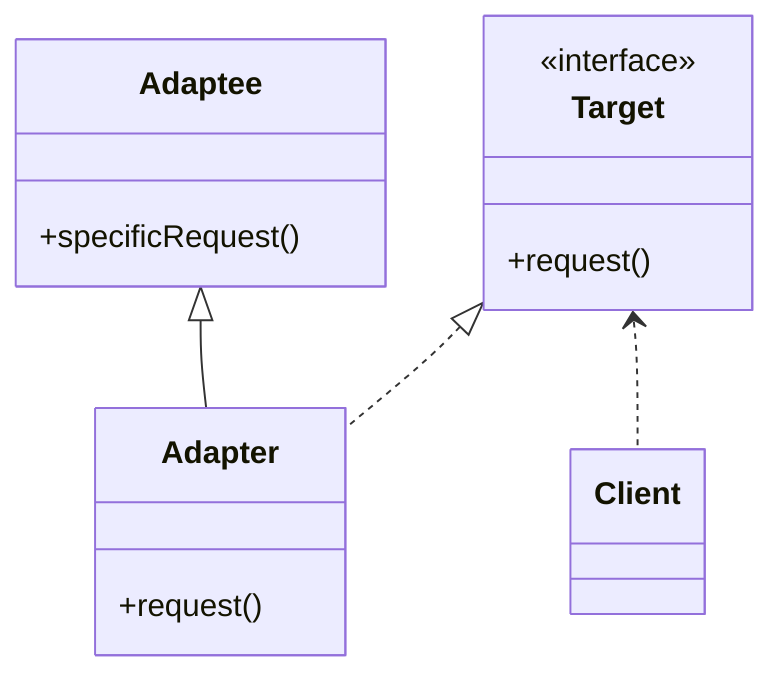
```mermaid
classDiagram

Target <|.. Adapter
Adaptee <|-- Adapter
Target <.. Client


class Target{
<<interface>>
+request()
}

class Adapter{
+request()
}

class Adaptee{
+specificRequest()
}
```

- 对象适配器

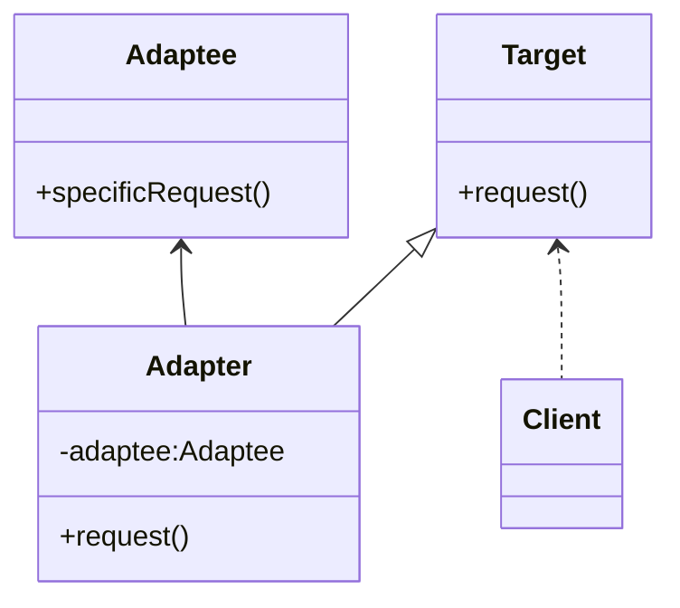
```mermaid
classDiagram

Target <|-- Adapter
Adaptee <-- Adapter
Target <.. Client


class Target{
+request()
}

class Adapter{
-adaptee:Adaptee
+request()
}

class Adaptee{
+specificRequest()
}
```

- `Target`：目标抽象类
- `Adapter`：适配器类
- `Adaptee`：适配者类
- `Client`：客户类

# 2 外观模式

## 2.1 模式动机

- 引入外观角色之后，**用户只需要直接与外观角色交互，用户与子系统之间的复杂关系由外观角色来实现**，从而降低了系统的耦合度。

## 2.2 模式定义

外观模式(Facade Pattern)：外部与一个子系统的通信必须通过一个**统一的外观对象**进行，为子系统中的一组接口**提供一个一致的界面**，外观模式定义了一个高层接口，这个接口**使得这一子系统更加容易使用**。外观模式又称为**门面模式**，它是一种**对象结构型模式**。

## 2.3 模式结构

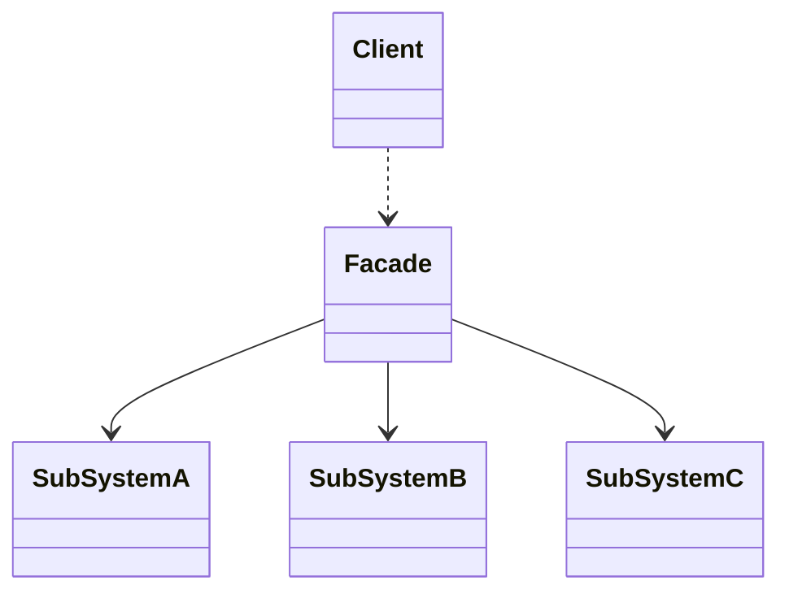
```mermaid
classDiagram

Client ..> Facade
Facade --> SubSystemA
Facade --> SubSystemB
Facade --> SubSystemC

class Facade

class SubSystemA

class SubSystemB

class SubSystemC

```

- `Facade`: 外观角色
- `SubSystem`:子系统角色

# 3 组合模式

## 3.1 模式动机

- 对于**树形结构**，当容器对象（如文件夹）的某一个方法被调用时，将遍历整个树形结构，寻找也包含这个方法的成员对象（可以是容器对象，也可以是叶子对象，如子文件夹和文件）并调用执行。**（递归调用）**；
- 由于容器对象和叶子对象在功能上的区别，在使用这些对象的客户端代码中必须**有区别地对待容器对象和叶子对象，而实际上大多数情况下客户端希望一致地处理它们，因为对于这些对象的区别对待将会使得程序非常复杂**；
- 组合模式描述了**如何将容器对象和叶子对象进行递归组合，使得用户在使用时无须对它们进行区分**，可以**一致地对待容器对象和叶子对象**，这就是组合模式的模式动机；

## 3.2 模式定义

- 组合模式(Composite Pattern)：组合多个对象形成**树形结构**以**表示“整体-部分”的结构层次**。组合模式对**单个对象（即叶子对象）和组合对象（即容器对象）的使用具有一致性**;
- 组合模式又可以称为“**整体-部分”(Part-Whole)模式**，属于对象的结构模式，它**将对象组织到树结构中，可以用来描述整体与部分的关系**。

## 3.3 模式结构

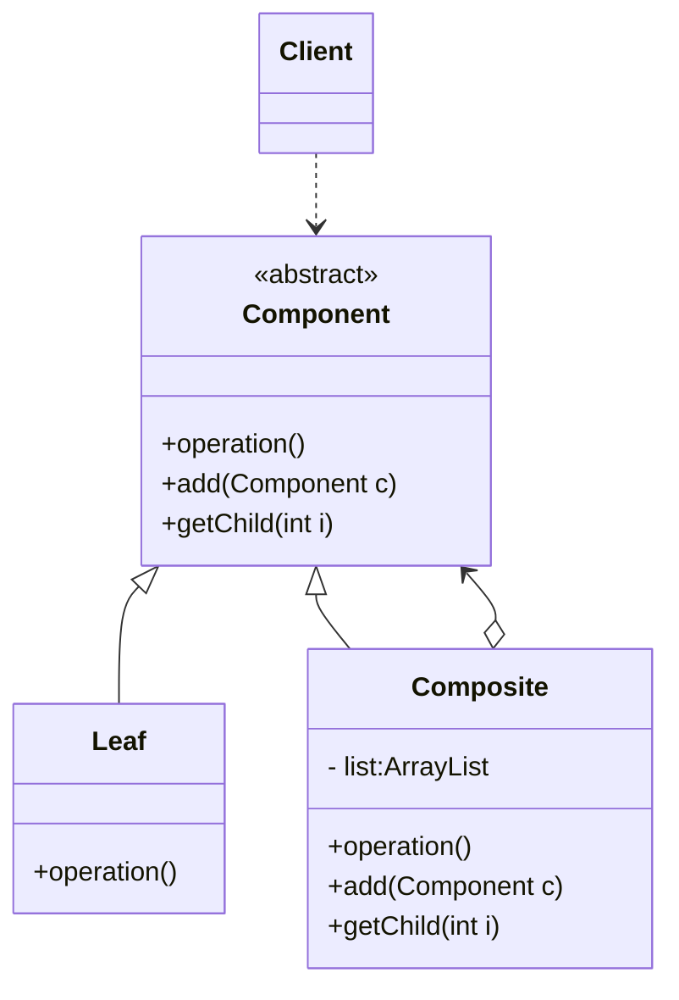
```mermaid
classDiagram

Client ..> Component
Component <|-- Leaf
Component <|-- Composite
Component <--o Composite

class Component{
<<abstract>>
+operation()
+add(Component c)
+getChild(int i)
}

class Leaf{
+operation()
}

class Composite{
- list:ArrayList<Component>
+operation()
+add(Component c)
+getChild(int i)
}

```

- `Component`: 抽象构件
- `Leaf`: 叶子构件
- `Composite`: 容器构件
- `Client`: 客户类

# 4 桥接模式

## 4.1 模式动机

- 设想如果要绘制矩形、圆形、椭圆、正方形，我们至少需要4个形状类，但是如果绘制的图形需要具有不同的颜色，如红色、绿色、蓝色等，此时至少有如下两种设计方案：
  - 第一种设计方案是为每一种形状都提供一套各种颜色的版本；
  - 第二种设计方案是根据实际需要对形状和颜色进行组合；
- 对于有**两个变化维度**（即两个变化的原因）的系统，采用**方案二**来进行设计系统中类的个数更少，且系统扩展更为方便。设计方案二即是桥接模式的应用。桥接模式**将继承关系转换为关联关系**，从而**降低了类与类之间的耦合，减少了代码编写量**；

## 4.2 模式定义

桥接模式(Bridge Pattern)：**将抽象部分与它的实现部分分离，使它们都可以独立地变化**。它是一种对象结构型模式，又称为柄体(Handle and Body)模式或接口(Interface)模式。

## 4.3 模式结构

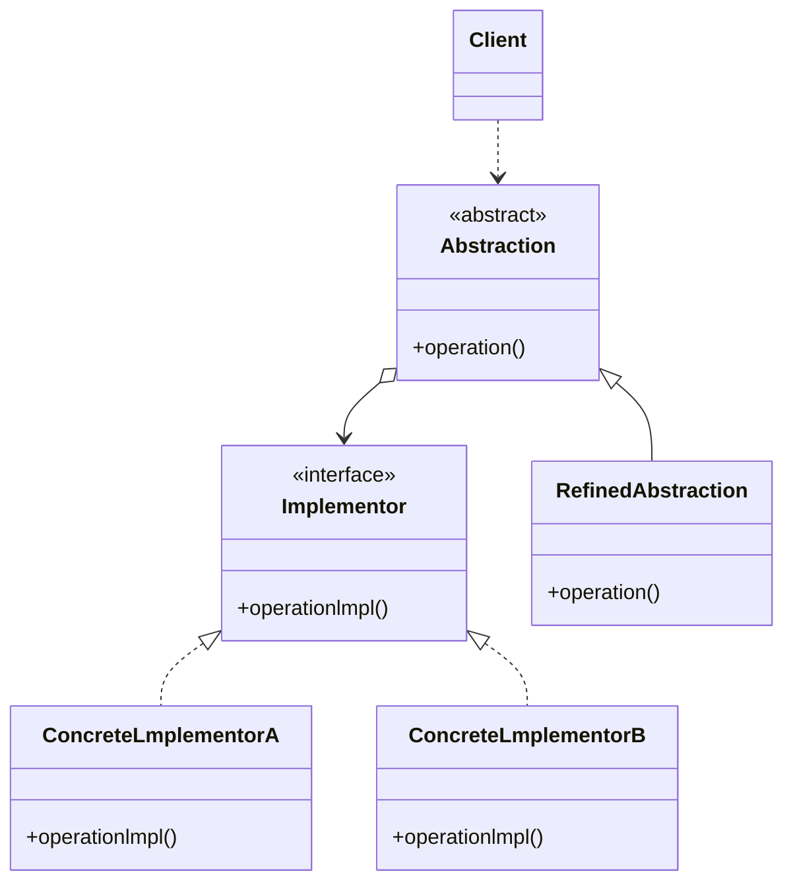
```mermaid
classDiagram

Abstraction o--> Implementor
Abstraction <|-- RefinedAbstraction
Implementor <|.. ConcreteLmplementorA
Implementor <|.. ConcreteLmplementorB
Client ..> Abstraction

class Abstraction{
<<abstract>>
+operation()
}

class Implementor{
<<interface>>
+operationlmpl()
}

class RefinedAbstraction{
+operation()
}

class ConcreteLmplementorA{
+operationlmpl()
}

class ConcreteLmplementorB{
+operationlmpl()
}
```

- `Abstraction`：抽象类
- `RefinedAbstraction`：扩充抽象类
- `Implementor`：实现类接口
- `ConcreteImplementor`：具体实现类

# 5 单例模式

## 5.1 模式动机

- **对于系统中的某些类来说，只有一个实例很重要**，例如，一个系统中可以存在多个打印任务，但是只能有一个正在工作的任务；一个系统只能有一个窗口管理器或文件系统；一个系统只能有一个计时工具或ID（序号）生成器；
- 如何保证一个类只有一个实例并且这个实例易于被访问呢？**定义一个全局变量可以确保对象随时都可以被访问，但不能防止我们实例化多个对象**；
- 一个更好的解决办法是**让类自身负责保存它的唯一实例**。这个类可以保证没有其他实例被创建，并且它可以提供一个访问该实例的方法。这就是单例模式的模式动机；

## 5.2 模式定义

- 单例模式(Singleton Pattern)：单例模式**确保某一个类只有一个实例，而且自行实例化并向整个系统提供这个实例**，这个类称为单例类，它提供全局访问的方法；
- 单例模式的要点有三个：一是某个**类只能有一个实例**；二是**它必须<u>自行</u>创建这个实例**；三是**它必须自行向整个系统提供这个实例**。单例模式是一种对象创建型模式。单例模式又名单件模式或单态模式。

## 5.3 模式结构

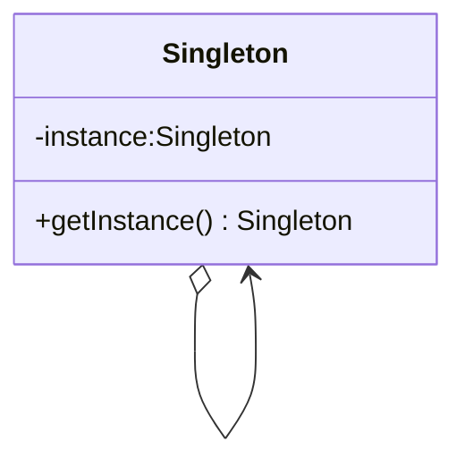
```mermaid
classDiagram

Singleton o--> Singleton

class Singleton{
-instance:Singleton
+getInstance()Singleton
}
```

- `Singleton`：单例

# 6 观察者模式

## 6.1 模式动机

- 建立一种**对象与对象之间的依赖关系，一个对象发生改变时将自动通知其他对象，其他对象将相应做出反应**。在此，发生改变的对象称为**观察目标**，而被通知的对象称为**观察者**，**一个观察目标可以对应多个观察者**，而且这些观察者之间没有相互联系，**可以根据需要增加和删除观察者，使得系统更易于扩展**，这就是观察者模式的模式动机；

## 6.2 模式定义

观察者模式(Observer Pattern)：定义对象间的一种**一对多依赖关系**，使得**每当一个对象状态发生改变**时，其**相关依赖对象皆得到通知并被自动更新**。观察者模式又叫做发布-订阅（Publish/Subscribe）模式、**模型-视图**（Model/View）模式、源-监听器（Source/Listener）模式或**从属者**（Dependents）模式。观察者模式是一种*<u>对象行为型</u>*模式。

## 6.3 模式结构

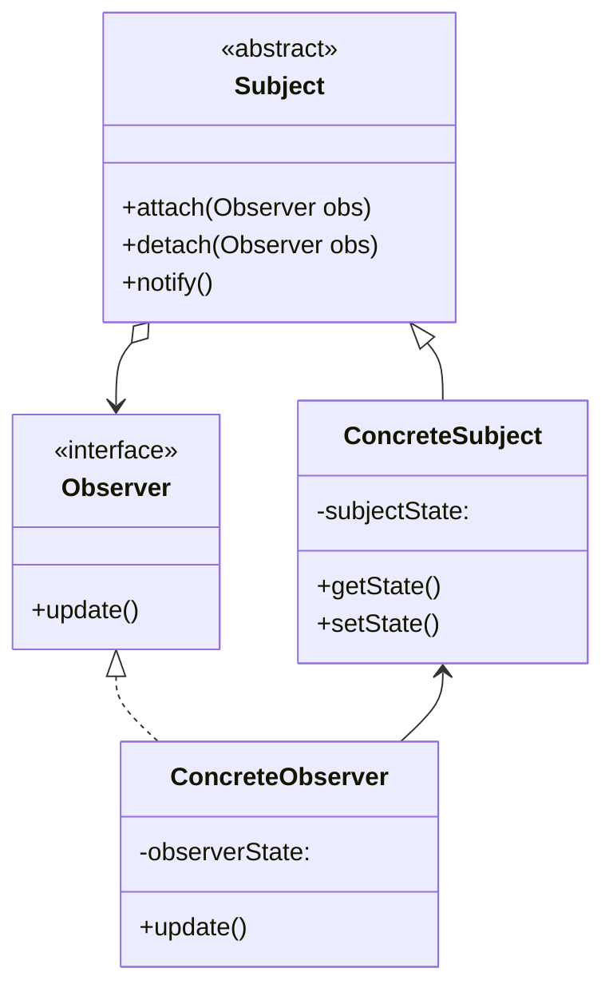
```mermaid
classDiagram

Subject o--> Observer
Subject <|-- ConcreteSubject
Observer <|.. ConcreteObserver
ConcreteSubject <-- ConcreteObserver


class Subject{
<<abstract>>
+attach(Observer obs)
+detach(Observer obs)
+notify()
}

class Observer{
<<interface>>
+update()
}

class ConcreteSubject{
-subjectState:
+getState()
+setState()
}

class ConcreteObserver{
-observerState:
+update()
}
```

- `Subject`: 目标
- `ConcreteSubject`: 具体目标
- `Observer`: 观察者
- `ConcreteObserver`: 具体观察者

# 7 中介者模式

## 7.1 模式动机

- 在用户与用户直接聊天的设计方案中，用户对象之间存在很强的关联性，将导致系统出现如下问题：
  - **系统结构复杂**：对象之间存在大量的相互关联和调用，若有一个对象发生变化，则需要跟踪和该对象关联的其他所有对象，并进行适当处理；
  - **对象可重用性差**：由于一个对象和其他对象具有很强的关联，若没有其他对象的支持，一个对象很难被另一个系统或模块重用，这些对象表现出来更像一个不可分割的整体，职责较为混乱；
  - **系统扩展性低**：增加一个新的对象需要在原有相关对象上增加引用，增加新的引用关系也需要调整原有对象，系统耦合度很高，对象操作很不灵活，扩展性差。
- 在面向对象的软件设计与开发过程中，根据“单一职责原则”，我们**应该尽量将对象细化，使其只负责或呈现单一的职责**；
- 对于一个模块，可能由很多对象构成，而且这些对象之间可能存在相互的引用，**为了减少对象两两之间复杂的引用关系，使之成为一个松耦合的系统，我们需要使用中介者模式**，这就是中介者模式的模式动机；

## 7.2 模式定义

中介者模式(Mediator Pattern)定义：用一个中介对象来**封装一系列的对象交互**，中介者使各对象不需要显式地相互引用，从而使其**耦合松散**，而且可以独立地改变它们之间的交互。中介者模式又称为**调停者模式**，它是一种**对象行为型模式**。

## 7.3 模式结构

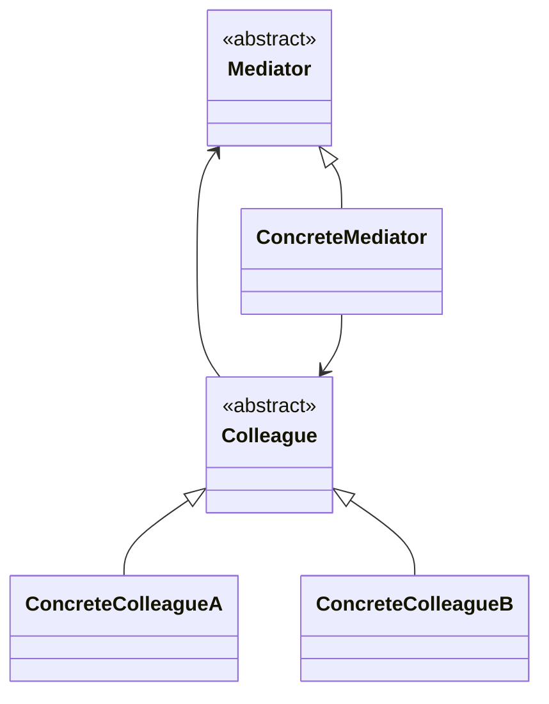
```mermaid
classDiagram

Mediator <|-- ConcreteMediator
Mediator <-- Colleague
ConcreteMediator --> Colleague
Colleague <|-- ConcreteColleagueA
Colleague <|-- ConcreteColleagueB

class Mediator{
<<abstract>>
}

class Colleague{
<<abstract>>
}

```

- `Mediator`: 抽象中介者
- `ConcreteMediator`: 具体中介者
- `Colleague`: 抽象同事类
- `ConcreteColleague`: 具体同事类

# 8 代理模式

## 8.1 模式动机

- 在某些情况下，**一个客户不想或者不能直接引用一个对象，此时可以通过一个称之为“代理”的第三者来实现间接引用**。代理对象可以**在客户端和目标对象之间起到中介的作用**，并且可以**通过代理对象去掉客户不能看到的内容和服务或者添加客户需要的额外服务**；
- 通过**引入一个新的对象**（如小图片和远程代理对象）**来实现对真实对象的操作或者将新的对象作为真实对象的一个替身**，这种实现机制即为代理模式，**通过引入代理对象来间接访问一个对象**，这就是代理模式的模式动机。

## 8.2 模式定义

代理模式(Proxy Pattern) ：给某一个对象**提供一个代理**，并**由代理对象控制对原对象的引用**。代理模式的英文叫做**Proxy**或**Surrogate**，它是一种**对象结构型模式**。

## 8.3 模式结构

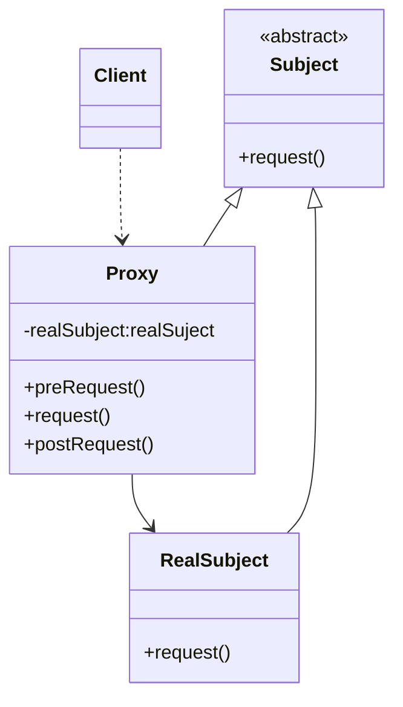
```mermaid
classDiagram

Client ..> Proxy
Subject <|-- Proxy
Subject <|-- RealSubject
Proxy --> RealSubject

class Subject{
<<abstract>>
+request()
}

class Proxy{
-realSubject:realSuject
+preRequest()
+request()
+postRequest()
}

class RealSubject{
+request()
}
```

- `Subject`: 抽象主题角色
- `Proxy`: 代理主题角色
- `RealSubject`: 真实主题角色

# 9 责任链模式

## 9.0 行为型模式

- **行为型模式(Behavioral Pattern)**是对**在不同的对象之间划分责任和算法的抽象化**；
- 行为型模式不仅仅关注类和对象的结构，而且**重点关注它们之间的相互作用**；
- 通过行为型模式，可以更加清晰地**划分类与对象的职责**，并**研究系统在运行时实例对象之间的交互**。在系统运行时，对象并不是孤立的，它们可以通过相互通信与协作完成某些复杂功能，一个对象在运行时也将影响到其他对象的运行；
- 行为型模式分为**类行为型模式**和**对象行为型模式**两种：
  - 类行为型模式：类的行为型模式**使用继承关系在几个类之间分配行为**，类行为型模式主要通过多态等方式来分配父类与子类的职责；
  - **对象行为型模式**：对象的行为型模式则**使用对象的聚合关联关系来分配行为**，对象行为型模式主要是通过对象关联等方式来分配两个或多个类的职责。根据“合成复用原则”，系统中要尽量使用关联关系来取代继承关系，因此大部分行为型设计模式都属于对象行为型设计模式；

**<u>*行为型模式简介：*</u>**

- 职责链模式(Chain of Responsibility)

- 命令模式(Command)

- 解释器模式(Interpreter)

- 迭代器模式(Iterator)

- 中介者模式(Mediator)

- 备忘录模式(Memento)

- 观察者模式(Observer)

- 状态模式(State)

- 策略模式(Strategy)

- 模板方法模式(Template Method)

- 访问者模式(Visitor)

## 9.1 模式动机

- 职责链可以是**一条直线、一个环或者一个树形结构**，最常见的职责链是**直线型**，即沿着**一条单向的链**来传递请求；
- 链上的每一个对象都是请求处理者，职责链模式可以**将请求的处理者组织成一条链**，并使请求沿着链传递，由链上的处理者对请求进行相应的处理，客户端无须关心请求的处理细节以及请求的传递，只需将请求发送到链上即可，**将请求的发送者和请求的处理者解耦**。这就是职责链模式的模式动机。

## 9.2 模式定义

职责链模式(Chain of Responsibility Pattern)：避免请求发送者与接收者耦合在一起，**让多个对象都有可能接收请求，将这些对象连接成一条链**，并且沿着这条链传递请求，直到有对象处理它为止。由于英文翻译的不同，职责链模式又称为责任链模式，它是一种**对象行为型模式**。

## 9.3 模式结构

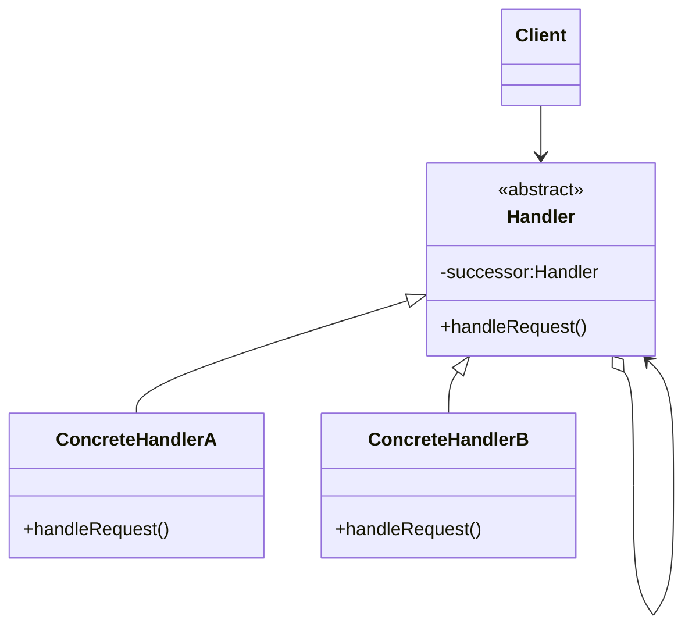
```mermaid
classDiagram

Handler <|-- ConcreteHandlerA
Handler <|-- ConcreteHandlerB
Handler o--> Handler
Client --> Handler

class Handler{
<<abstract>>
-successor:Handler
+handleRequest()
}

class ConcreteHandlerA{
+handleRequest()
}

class ConcreteHandlerB{
+handleRequest()
}
```

- `Handler`: 抽象处理者

- `ConcreteHandler`: 具体处理者

- `Client`: 客户类

# 10 享元模式

## 10.1 模式动机

- **面向对象技术可以很好地解决一些灵活性或可扩展性问题，但在很多情况下需要在系统中增加类和对象的个数。**当对象数量太多时，将导致运行代价过高，带来性能下降等问题；
- **享元模式**正是为解决这一类问题而诞生的。**享元模式通过共享技术实现相同或相似对象的重用**；
- 在享元模式中**可以共享的相同内容称为内部状态(Intrinsic State)**，而那些**需要外部环境来设置的不能共享的内容称为外部状态(Extrinsic State)**，由于区分了内部状态和外部状态，因此可以通过设置不同的外部状态使得相同的对象可以具有一些不同的特征，而相同的内部状态是可以共享的；
- 在享元模式中通常会出现工厂模式，需要**创建一个享元工厂来维护一个享元池(Flyweight Pool)用于存储具有相同内部状态的享元对象**；
- 在享元模式中共享的是享元对象的内部状态，外部状态需要通过环境来设置。在实际使用中，能够共享的内部状态是有限的，因此**享元对象一般都设计为较小的对象，它所包含的内部状态较少，这种对象也称为细粒度对象。享元模式的<u>目的</u>就是使用共享技术来实现大量细粒度对象的复用**；

## 10.2 模式定义

享元模式(Flyweight Pattern)：运用**共享技术**有效地支持大量**细粒度对象**的复用。系统只使用少量的对象，**而这些对象都很相似，状态变化很小**，可以实现对象的多次复用。由于享元模式要求能够共享的对象必须是细粒度对象，因此它又称为**轻量级模式**，它是一种**对象结构型模式**。

## 10.3 模式结构

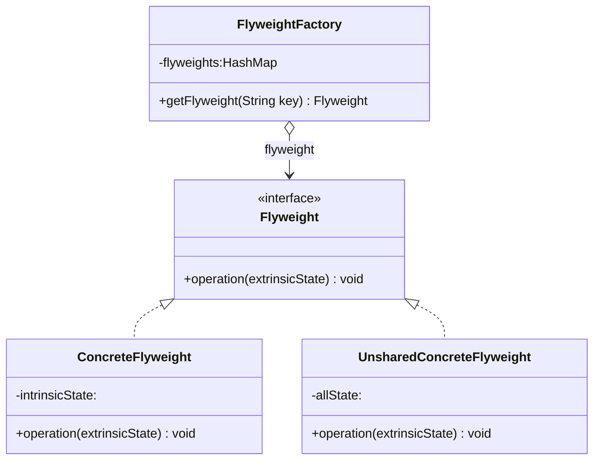
```mermaid
classDiagram

FlyweightFactory o--> Flyweight:flyweight
Flyweight <|.. ConcreteFlyweight
Flyweight <|.. UnsharedConcreteFlyweight

class FlyweightFactory{
-flyweights:HashMap
+getFlyweight(String key)Flyweight
}

class Flyweight{
<<interface>>
+operation(extrinsicState)void
}

class ConcreteFlyweight{
-intrinsicState:
+operation(extrinsicState)void
}

class UnsharedConcreteFlyweight{
-allState:
+operation(extrinsicState)void
}
```

- `Flyweight`: 抽象享元类
- `ConcreteFlyweight`: 具体享元类
- `UnsharedConcreteFlyweight`: 非共享具体享元类
- `FlyweightFactory`: 享元工厂类

# 11 建造者模式

## 11.1 模式动机

- 无论是在现实世界中还是在软件系统中，都存在一些复杂的对象，它们拥有多个组成部分，如汽车，它包括车轮、方向盘、发送机等各种部件。而对于大多数用户而言，无须知道这些部件的装配细节，也几乎不会使用单独某个部件，而是使用一辆完整的汽车，可以通过建造者模式对其进行设计与描述，**建造者模式可以将部件和其组装过程分开，一步一步创建一个复杂的对象**。用户只需要指定复杂对象的类型就可以得到该对象，而无须知道其内部的具体构造细节；
- 在软件开发中，也存在大量类似汽车一样的复杂对象，**它们拥有一系列成员属性，这些成员属性中有些是引用类型的成员对象**。而且在这些复杂对象中，还可能存在一些限制条件，如某些属性没有赋值则复杂对象不能作为一个完整的产品使用；有些属性的赋值必须按照某个顺序，一个属性没有赋值之前，另一个属性可能无法赋值等；
- **复杂对象相当于一辆有待建造的汽车，而对象的属性相当于汽车的部件**，建造产品的过程就相当于组合部件的过程。由于组合部件的过程很复杂，因此，这些部件的组合过程往往被“外部化”到一个称作建造者的对象里，**建造者返还给客户端的是一个已经建造完毕的完整产品对象，而用户无须关心该对象所包含的属性以及它们的组装方式**，这就是建造者模式的模式动机；

## 11.2 模式定义

- 建造者模式(Builder Pattern)：将**一个复杂对象的构建与它的表示分离**，使得**同样的构建过程可以创建不同的表示**；
- 建造者模式是**一步一步创建一个复杂的对象**，它允许用户只通过指定复杂对象的类型和内容就可以构建它们，用户不需要知道内部的具体构建细节。建造者模式属于对象创建型模式。根据中文翻译的不同，建造者模式又可以称为生成器模式；

## 11.3 模式结构

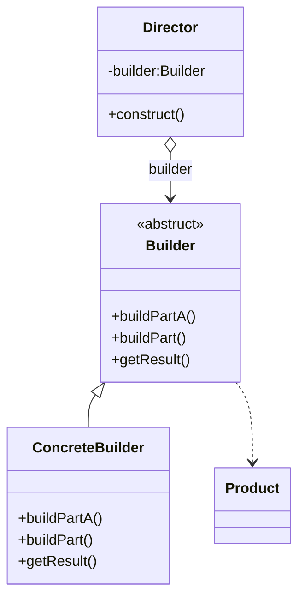
```mermaid
classDiagram

Director o--> Builder:builder
Builder <|-- ConcreteBuilder
Builder..>Product

class Director{
-builder:Builder
+construct()
}

class Builder{
<<abstruct>>
+buildPartA()
+buildPart()
+getResult()
}

class ConcreteBuilder{
+buildPartA()
+buildPart()
+getResult()
}

class Product
```

- `Builder`：抽象建造者
- `ConcreteBuilder`：具体建造者
- `Director`：指挥者
- `Product`：产品角色

# 12 简单工厂模式

## 12.0 创建型模式概述

- **创建型模式(Creational Pattern)**对类的实例化过程进行了抽象，能够**将软件模块中对象的<u>创建</u>和对象的<u>使用</u>分离**。为了使软件的结构更加清晰，外界对于这些对象只需要知道它们共同的接口，而不清楚其具体的实现细节，使整个系统的设计更加符合单一职责原则；
- 创建型模式在**创建什么(What)，由谁创建(Who)，何时创建(When)**等方面都为软件设计者提供了尽可能大的灵活性。创建型模式**隐藏了类的实例的创建细节，通过隐藏对象如何被创建和组合在一起达到使整个系统独立的目的**;

**<u>*创建性模式简介：*</u>**

- 简单工厂模式（Simple Factory）
- 工厂方法模式（Factory Method）
- 抽象工厂模式（Abstract Factory）
- 建造者模式（Builder）
- 原型模式（Prototype）
- 单例模式（Singleton）

## 12.1 模式动机

- 考虑一个简单的软件应用场景，一个软件系统可以提供多个外观不同的按钮（如圆形按钮、矩形按钮、菱形按钮等），**这些按钮都源自同一个基类**，不过在继承基类后不同的子类修改了部分属性从而使得它们可以呈现不同的外观，如果我们希望在使用这些按钮时，**不需要知道这些具体按钮类的名字，只需要知道表示该按钮类的一个参数，并提供一个调用方便的方法，把该参数传入方法即可返回一个相应的按钮对象**，此时，就可以使用简单工厂模式；

## 12.2 模式定义

简单工厂模式(Simple Factory Pattern)：又称为**静态工厂方法(Static Factory Method)模式**，它属于类创建型模式。在简单工厂模式中，可以**根据参数的不同返回不同类的实例**。简单工厂模式**专门定义一个类来负责创建其他类的实例，被创建的实例通常都具有共同的父类**；

## 12.3 模式结构

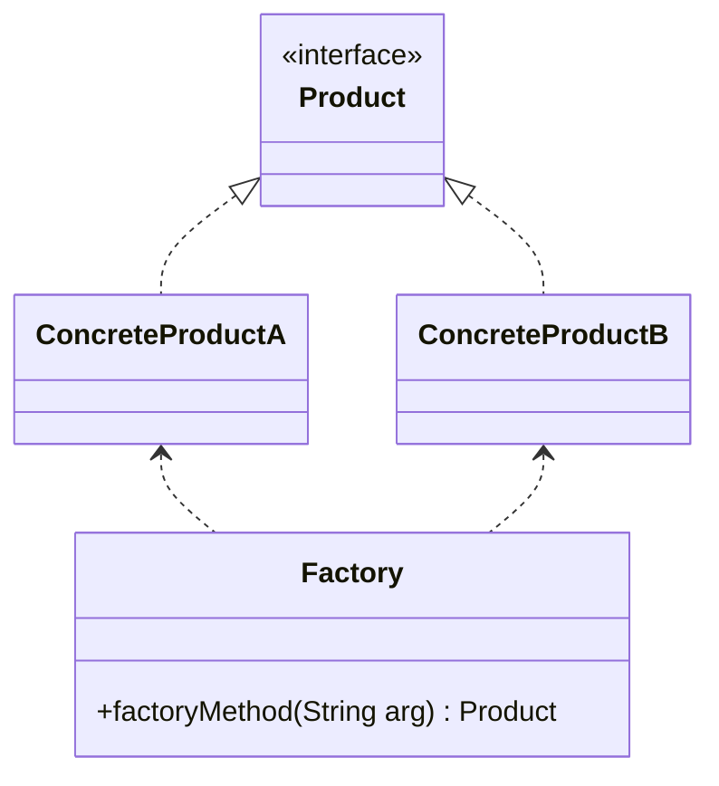
```mermaid
classDiagram

Product <|.. ConcreteProductA
Product <|.. ConcreteProductB
ConcreteProductA <.. Factory
ConcreteProductB <.. Factory

class Product{
<<interface>>
}

class ConcreteProductA

class ConcreteProductB

class Factory{
+factoryMethod(String arg)Product
}
```

- `Factory`：工厂角色
- `Product`：抽象产品角色
- `ConcreteProduct`：具体产品角色

# 13 工厂模式

## 13.0 简单工厂的不足

在简单工厂模式中，只提供了一个工厂类，该工厂类处于对产品类进行实例化的中心位置，它知道每一个产品对象的创建细节，并决定何时实例化哪一个产品类。**简单工厂模式最大的缺点是当有新产品要加入到系统中时，必须修改工厂类，加入必要的处理逻辑，这违背了“开闭原则”**。在简单工厂模式中，所有的产品都是由同一个工厂创建，工厂类职责较重，业务逻辑较为复杂，具体产品与工厂类之间的耦合度高，严重影响了系统的灵活性和扩展性，而工厂方法模式则可以很好地解决这一问题

## 13.1 模式动机

- 考虑这样一个系统，按钮工厂类可以返回一个具体的按钮实例，如圆形按钮、矩形按钮、菱形按钮等。在这个系统中，如果需要增加一种新类型的按钮，如椭圆形按钮，那么**除了增加一个新的具体产品类之外，还需要修改工厂类的代码，这就使得整个设计在一定程度上违反了“开闭原则”**；
- 现在对该系统进行修改，不再设计一个按钮工厂类来统一负责所有产品的创建，而是**将具体按钮的创建过程交给专门的工厂子类去完成，我们先定义一个抽象的按钮工厂类，再定义具体的工厂类来生成圆形按钮、矩形按钮、菱形按钮等**，它们实现在抽象按钮工厂类中定义的方法。这种抽象化的结果使这种结构**可以在不修改具体工厂类的情况下引进新的产品**，如果出现新的按钮类型，只需要为这种新类型的按钮创建一个具体的工厂类就可以获得该新按钮的实例，这一特点无疑使得工厂方法模式具有超越简单工厂模式的优越性，**更加符合“开闭原则”**。

## 13.2 模式定义

工厂方法模式(Factory Method Pattern)又称为工厂模式，也叫**虚拟构造器(Virtual Constructor)模式**或者**多态工厂(Polymorphic Factory)模式**，它属于类创建型模式。在工厂方法模式中，工厂父类负责定义创建产品对象的公共接口，而工厂子类则负责生成具体的产品对象，这样做的目的是将产品类的实例化操作延迟到工厂子类中完成，即通过工厂子类来确定究竟应该实例化哪一个具体产品类。

## 13.3 模式结构

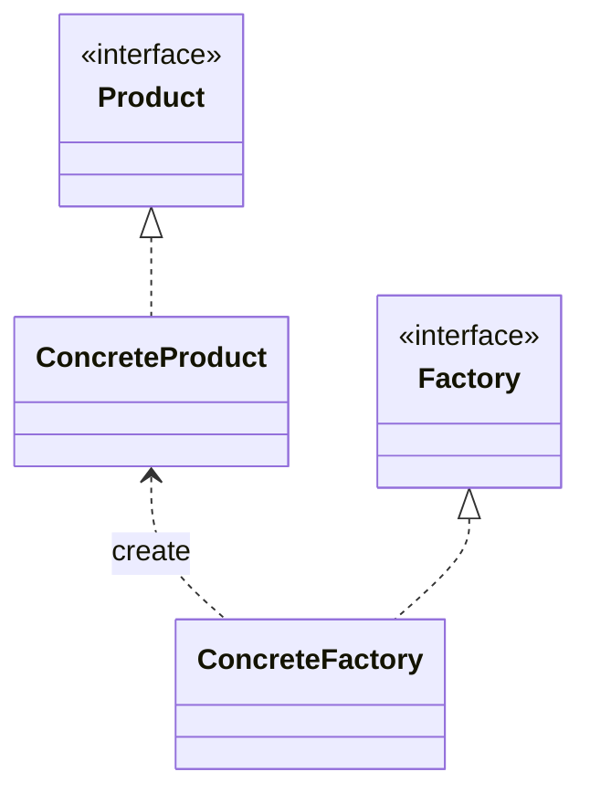
```mermaid
classDiagram

Product <|.. ConcreteProduct
ConcreteProduct <.. ConcreteFactory:create
Factory <|.. ConcreteFactory

class Product{
<<interface>>
}

class Factory{
<<interface>>
}

class ConcreteProduct

class ConcreteFactory
```

- `Product`：抽象产品
- `ConcreteProduct`：具体产品
- `Factory`：抽象工厂
- `ConcreteFactory`：具体工厂

# 14 抽象工厂模式

## 14.1 模式动机

- 在工厂方法模式中具体工厂负责生产具体的产品，每一个具体工厂对应一种具体产品，工厂方法也具有唯一性，一般情况下，一个具体工厂中只有一个工厂方法或者一组重载的工厂方法。但是有时候**我们需要一个工厂可以提供多个产品对象，而不是单一的产品对象**；
- 为了更清晰地理解工厂方法模式，需要先引入两个概念：
  - **产品等级结构：产品等级结构即产品的继承结构**，如一个抽象类是电视机，其子类有海尔电视机、海信电视机、TCL电视机，则抽象电视机与具体品牌的电视机之间构成了一个产品等级结构，抽象电视机是父类，而具体品牌的电视机是其子类；
  - **产品族**：在抽象工厂模式中，**产品族是指由同一个工厂生产的，位于不同产品等级结构中的一组产品**，如海尔电器工厂生产的海尔电视机、海尔电冰箱，海尔电视机位于电视机产品等级结构中，海尔电冰箱位于电冰箱产品等级结构中；
- 当系统所提供的工厂所需生产的具体产品并不是一个简单的对象，而是**多个位于不同产品等级结构中属于不同类型的具体产品时**需要使用抽象工厂模式；
- 抽象工厂模式是所有形式的工厂模式中**最为抽象和最具一般性的一种形态**；
- 抽象工厂模式与工厂方法模式最大的区别在于，**工厂方法模式针对的是一个产品等级结构，而抽象工厂模式则需要面对多个产品等级结构**，一个工厂等级结构可以负责多个不同产品等级结构中的产品对象的创建 。当一个工厂等级结构可以创建出分属于不同产品等级结构的一个产品族中的所有对象时，抽象工厂模式比工厂方法模式更为简单、有效率；

## 14.2 模式定义

抽象工厂模式(Abstract Factory Pattern)：提供一个**创建一系列相关或相互依赖对象的接口**，而**无须指定它们具体的类**。抽象工厂模式又称为**Kit模式**，属于对象创建型模式。

## 14.3 模式结构

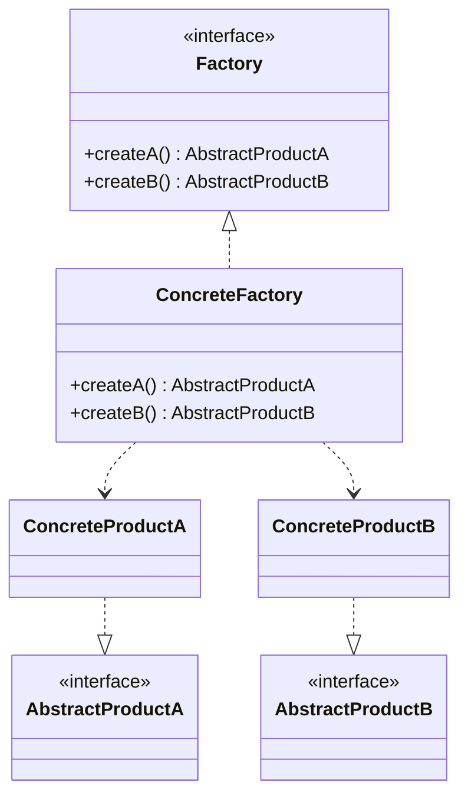
```mermaid
classDiagram

Factory <|.. ConcreteFactory
ConcreteFactory ..> ConcreteProductA
ConcreteFactory ..> ConcreteProductB
ConcreteProductA ..|> AbstractProductA
ConcreteProductB ..|> AbstractProductB

class Factory{
<<interface>>
+createA()AbstractProductA
+createB()AbstractProductB
}

class AbstractProductA{
<<interface>>
}

class AbstractProductB{
<<interface>>
}

class ConcreteFactory{
+createA()AbstractProductA
+createB()AbstractProductB
}

class ConcreteProductA

class ConcreteProductB
```

- `AbstractFactory`：抽象工厂
- `ConcreteFactory`：具体工厂
- `AbstractProduct`：抽象产品
- `Product`：具体产品

# 15 原型模式

## 15.1 模式动机

- 在面向对象系统中，使用原型模式来复制一个对象自身，从而**克隆出多个与原型对象一模一样的对象**；
- 在软件系统中，有些对象的创建过程较为复杂，而且有时候需要频繁创建，**原型模式通过给出一个原型对象来指明所要创建的对象的类型，然后用复制这个原型对象的办法创建出更多同类型的对象**，这就是原型模式的意图所在；

## 15.2 模式定义

- 原型模式(Prototype Pattern)：原型模式是一种对象创建型模式，**用原型实例指定创建对象的种类，并且通过复制这些原型创建新的对象。**原型模式允许一个对象再创建另外一个可定制的对象，无须知道任何创建的细节；
- 原型模式的基本工作原理是通过将一个原型对象传给那个要发动创建的对象，这个要发动创建的对象通过请求原型对象拷贝原型自己来实现创建过程；

## 15.3 模式结构

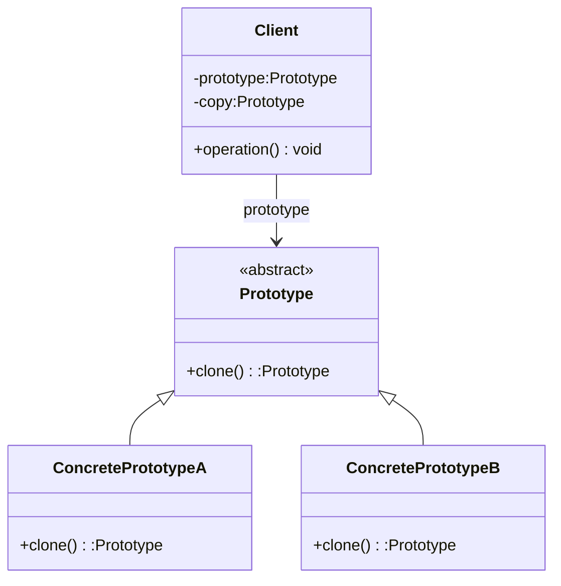
```mermaid
classDiagram

Client --> Prototype:prototype
Prototype <|-- ConcretePrototypeA
Prototype <|-- ConcretePrototypeB

class Client{
-prototype:Prototype
-copy:Prototype
+operation()void
}

class Prototype{
<<abstract>>
+clone():Prototype
}

class ConcretePrototypeA{
+clone():Prototype
}

class ConcretePrototypeB{
+clone():Prototype
}

```

- `Prototype`：抽象原型类
- `ConcretePrototype`：具体原型类
- `Client`：客户类

# 16 备忘录模式

## 16.1 模式动机

- 为了使软件的使用更加人性化，对于误操作，我们需要提供一种类似“**后悔药**”的机制，让软件系统可以回到误操作前的状态，因此需要保存用户每一次操作时系统的状态，**一旦出现误操作，可以把存储的历史状态取出即可回到之前的状态**；
- 现在大多数软件都有**撤销(Undo)**的功能，快捷键一般都是**Ctrl+Z**，目的就是为了解决这个后悔的问题；
- 在应用软件的开发过程中，很多时候我们都需要**记录一个对象的内部状态**；
- 在具体实现过程中，为了允许用户取消不确定的操作或从错误中恢复过来，需要**实现备份点和撤销机制**，而要实现这些机制，必须**事先将状态信息保存在某处**，这样才能将对象恢复到它们原先的状态；
- 备忘录模式是一种**给我们的软件提供后悔药的机制**，通过它可以**使系统恢复到某一特定的历史状态**。

## 16.2 模式定义

备忘录模式(Memento Pattern)：在**不破坏封装**的前提下，**捕获一个对象的内部状态**，并**在该对象之外保存这个状态**，这样可以在以后**将对象恢复到原先保存的状态**。它是一种*<u>对象行为型模式</u>*，其别名为Token。

## 16.3 模式结构

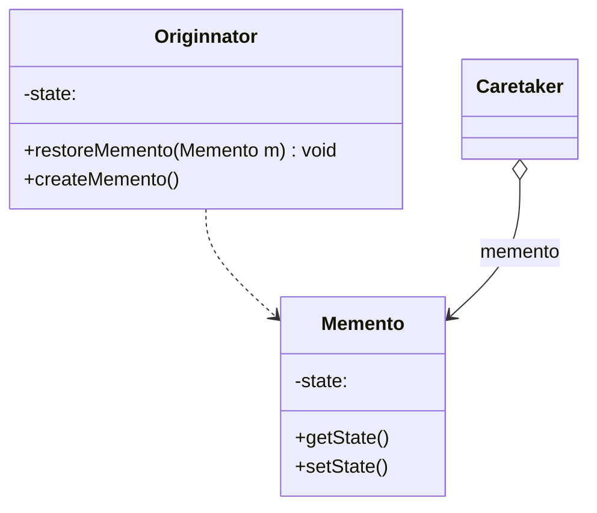
```mermaid
classDiagram

Originnator ..> Memento
Caretaker o--> Memento:memento

class Originnator{
-state:
+restoreMemento(Memento m)void
+createMemento()
}

class Memento{
-state:
+getState()
+setState()
}

class Caretaker
```

- `Originator`: 原发器
- `Memento`: 备忘录
- `Caretaker`: 负责人

# 17 模板方法模式

## 17.1 模式动机

- 模板方法模式是**基于继承**的代码复用基本技术，模板方法模式的结构和用法也是面向对象设计的核心之一。在模板方法模式中，可以**将相同的代码放在父类中，而将不同的方法实现放在不同的子类中**；
- 在模板方法模式中，我们需要准备一个抽象类，**将部分逻辑以具体方法以及具体构造函数的形式实现**，然后**声明一些抽象方法来让子类实现剩余的逻辑。不同的子类可以以不同的方式实现这些抽象方法，从而对剩余的逻辑有不同的实现**，这就是模板方法模式的用意。模板方法模式体现了面向对象的诸多重要思想，是一种使用频率较高的模式；

## 17.2 模式定义

模板方法模式(Template Method Pattern)：定义一个操作中**算法的骨架**，而将一些步骤**延迟到子类**中，模板方法使得子类**可以不改变一个算法的结构即可重定义该算法的某些特定步骤**。模板方法是一种*<u>类行为型</u>*模式。

## 17.3 模式结构

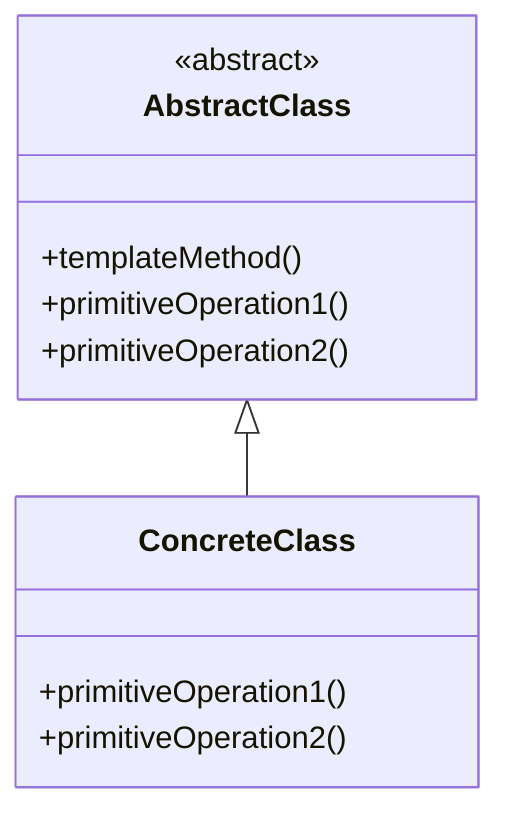
```mermaid
classDiagram

AbstractClass <|-- ConcreteClass

class AbstractClass{
<<abstract>>
+templateMethod()
+primitiveOperation1()
+primitiveOperation2()
}

class ConcreteClass{
+primitiveOperation1()
+primitiveOperation2()
}
```

- `AbstractClass`**:** **抽象类** 
- `ConcreteClass`**:** **具体子类** 

# 18 状态模式

## 18.1 模式动机

- 在很多情况下，**一个对象的行为取决于一个或多个动态变化的属性**，这样的属性叫做**状态**，这样的对象叫做**有状态的 (stateful)对象**，这样的对象状态是从事先定义好的一系列值中取出的。当一个这样的对象与外部事件产生互动时，其内部状态就会改变，从而使得系统的行为也随之发生变化；
- 在UML中可以使用**状态图**来描述对象状态的变化；

## 18.2 模式定义

状态模式(State Pattern) ：允许一个对象**在其内部状态改变时改变它的行为，对象看起来似乎修改了它的类**。其别名为**状态对象(Objects for States)**，状态模式是一种**对象行为型**模式。

## 18.3 模式结构

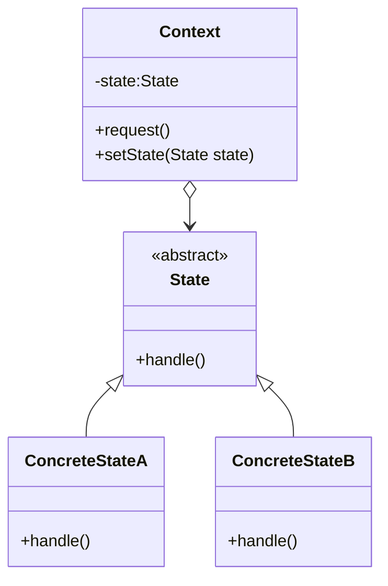
```mermaid
classDiagram

Context o--> State
State <|-- ConcreteStateA
State <|-- ConcreteStateB

class Context{
-state:State
+request()
+setState(State state)
}

class State{
<<abstract>>
+handle()
}

class ConcreteStateA{
+handle()
}

class ConcreteStateB{
+handle()
}
```

- `Context`: 环境类
- `State`: 抽象状态类
- `ConcreteState`: 具体状态类

# 19 策略模式

## 19.1 模式动机

- 完成一项任务，往往可以有多种不同的方式，**每一种方式称为一个策略**，我们**可以根据环境或者条件的不同选择不同的策略来完成该项任务**；
- 在软件开发中也常常遇到类似的情况，实现某一个功能有多个途径，此时可以使用一种设计模式来使得系统可以灵活地选择解决途径，也能够方便地增加新的解决途径；
- 在软件系统中，有许多算法可以实现某一功能，如查找、排序等，一种常用的方法是**硬编码(Hard Coding)**在一个类中，如需要提供多种查找算法，可以**将这些算法写到一个类中**，在该类中提供多个方法，**每一个方法对应一个具体的查找算法；当然也可以将这些查找算法封装在一个统一的方法中，通过if…else…等条件判断语句来进行选择**。这两种实现方法我们都可以称之为硬编码，**如果需要增加一种新的查找算法，需要修改封装算法类的源代码**；更换查找算法，也需要修改客户端调用代码。**在这个算法类中封装了大量查找算法，该类代码将较复杂，维护较为困难**；
- 除了提供专门的查找算法类之外，还可以在客户端程序中直接包含算法代码，这种做法更不可取，将导致客户端程序庞大而且难以维护，如果存在大量可供选择的算法时问题将变得更加严重；
- 为了解决这些问题，**可以定义一些独立的类来封装不同的算法，每一个类封装一个具体的算法**，在这里，**每一个封装算法的类我们都可以称之为策略(Strategy)**，为了保证这些策略的一致性，一般会用一个**抽象的策略类来做算法的定义，而具体每种算法则对应于一个具体策略类**。

## 19.2 模式定义

策略模式(Strategy Pattern)：定义**一系列算法**，将**每一个算法封装起来**，并让它们可以**相互替换**。策略模式**让算法独立于使用它的客户而变化**，也称为**政策模式(Policy)**。策略模式是一种*<u>对象行为型</u>*模式。

## 19.2 模式结构

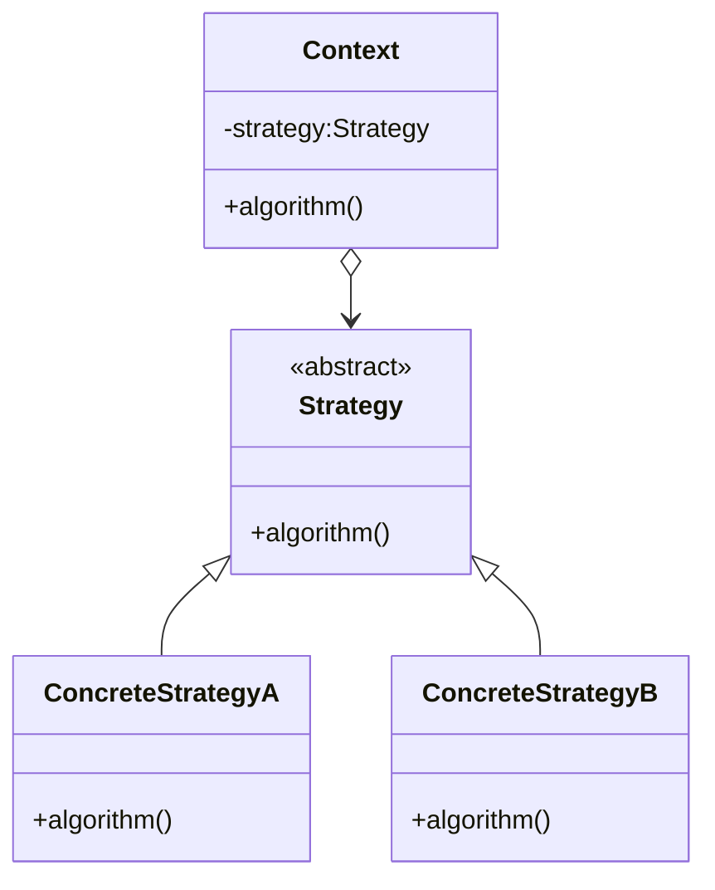
```mermaid
classDiagram

Context o--> Strategy
Strategy <|-- ConcreteStrategyA
Strategy <|-- ConcreteStrategyB

class Context{
-strategy:Strategy
+algorithm()
}

class Strategy{
<<abstract>>
+algorithm()
}

class ConcreteStrategyA{
+algorithm()
}

class ConcreteStrategyB{
+algorithm()
}
```

- `Context`: 环境类
- `Strategy`: 抽象策略类
- `ConcreteStrategy`: 具体策略类

# 20 命令模式

## 20.1 模式动机

- 在软件设计中，我们经常**需要向某些对象发送请求**，但是并**不知道请求的接收者是谁，也不知道被请求的操作是哪个**，我们**只需在程序运行时指定具体的请求接收者即可**，此时，可以使用命令模式来进行设计，使得**请求发送者与请求接收者消除彼此之间的耦合**，让对象之间的调用关系更加灵活；
- 命令模式可**以对发送者和接收者完全解耦**，发送者与接收者之间**没有直接引用关系，发送请求的对象只需要知道如何发送请求，而不必知道如何完成请求**。这就是命令模式的模式动机；

## 20.2 模式定义

命令模式(Command Pattern)：**将一个请求封装为一个对象**，从而使我们**可用不同的请求对客户进行参数化；对请求排队或者记录请求日志**，以及**支持可撤销的操作**。命令模式是一种*<u>对象行为型模式</u>*，其别名为动作(Action)模式或事务(Transaction)模式。

## 20.3 模式结构

```mermaid
classDiagram

Invoker o--> Command
Command <|-- ConcreteCommand
ConcreteCommand --> Receiver
Receiver <-- Client
ConcreteCommand <.. Client

class Command{
<<abstract>>
+excute()
}

class ConcreteCommand{
-state:
-receiver:Receiver
+excute()
}

class Receiver{
+action()
}
```

- `Command`: 抽象命令类
- `ConcreteCommand`: 具体命令类
- `Invoker`: 调用者
- `Receiver`: 接收者
- `Client`:客户类

# 21 解释器模式

## 21.1 模式动机

- 如果在系统中**某一特定类型的问题发生的频率很高**，此时可以考虑**将这些问题的实例表述为一个语言中的句子**，因此**可以构建一个解释器**，该解释器**通过解释这些句子来解决这些问题**；
- 解释器模式描述了**如何构成一个简单的语言解释器**，主要应用在使用面向对象语言开发的编译器中；

## 21.2 模式定义

解释器模式(Interpreter Pattern) ：**定义语言的文法**，并且**建立一个解释器来解释该语言中的句子**，这里的“语言”意思是使用规定格式和语法的代码，它是一种**类行为型模式**。

## 21.3 模式结构

```mermaid
classDiagram

Client--> Context
Client-->AbstractExpression
AbstractExpression <|-- TerminalExpression
AbstractExpression <|-- NonterminalExpression
AbstractExpression <--o NonterminalExpression

class AbstractExpression{
+interpret(Context ctx)
}

class TerminalExpression{
+interpret(Context ctx)
}

class NonterminalExpression{
+interpret(Context ctx)
}

```

- `AbstractExpression`: 抽象表达式；
- `TerminalExpression`: 终结符表达式；
- `NonterminalExpression`: 非终结符表达式；
- `Context`: 环境类；
- `Client`: 客户类；

# 22 装饰模式

## 22.1 模式动机

- 一般有两种方式可以实现给一个类或对象**增加行为**：
  - **继承机制**，使用继承机制是给现有类添加功能的一种有效途径，通过继承一个现有类可以使得子类在拥有自身方法的同时还拥有父类的方法。但是这种方法是**静态的**，用户不能控制增加行为的方式和时机；
  - **关联机制**，即将一个类的对象嵌入另一个对象中，由另一个对象来决定是否调用嵌入对象的行为以便扩展自己的行为，我们称这个嵌入的对象为装饰器(Decorator)；
- 装饰模式以**对客户透明的方式==动态地==给一个对象附加上更多的责任**，换言之，客户端并不会觉得对象在装饰前和装饰后有什么不同。装饰模式可以**在不需要创造更多子类的情况下，将对象的功能加以扩展**。这就是装饰模式的模式动机；

## 22.2 模式定义

装饰模式(Decorator Pattern) ：**动态地给一个对象增加一些额外的职责(Responsibility)**，就增加对象功能来说，装饰模式比生成子类实现更为灵活。其别名也可以称为**包装器(Wrapper)**，与适配器模式的别名相同，但它们适用于不同的场合。根据翻译的不同，装饰模式也有人称之为“油漆工模式”，它是一种**对象结构型模式**。

## 22.3 模式结构

```mermaid
classDiagram

Component <|-- ConcreteComponent
Component <|-- Decorator
Component <--o Decorator
Decorator <|-- ConcreteDecoratorA
Decorator <|-- ConcreteDecoratorB

class Component{
+operation()
}

class ConcreteComponent{
+operation()
}

class Decorator{
-component:Component
+operation()
}

class ConcreteDecoratorA{
-addedState
+operation()
}

class ConcreteDecoratorB{
+operation()
+addedBehaivor()
}
```

- `Component`: 抽象构件

- `ConcreteComponent`: 具体构件

- `Decorator`: 抽象装饰类

- `ConcreteDecorator`: 具体装饰类

# 23 迭代器模式

## 23.1 模式动机

- 一个聚合对象，如一个列表(List)或者一个集合(Set)，应该**提供一种方法来让别人可以访问它的元素，而又不需要暴露它的内部结构**；
- 针对不同的需要，可能还要**以不同的方式遍历整个聚合对象，但是我们并不希望在聚合对象的抽象层接口中充斥着各种不同遍历的操作**；
- 怎样遍历一个聚合对象，又不需要了解聚合对象的内部结构，还能够提供多种不同的遍历方式，这就是迭代器模式所要解决的问题；
- 在迭代器模式中，提供一个**外部的迭代器**来对聚合对象进行访问和遍历，**迭代器定义了一个访问该聚合元素的接口，并且可以跟踪当前遍历的元素，了解哪些元素已经遍历过而哪些没有**；
- 有了迭代器模式，我们会发现对一个复杂的聚合对象的操作会变得如此简单

## 23.2 模式定义

迭代器模式(Iterator Pattern) ：提供一种方法来**访问聚合对象**，而**不用暴露这个对象的内部表示**，其别名为**游标(Cursor)**。迭代器模式是一种**对象行为型**模式。

## 23.3 模式结构

```mermaid
classDiagram

Aggregate <|.. ConcreteAggregate
Iterator <|.. ConcreteIterator
ConcreteAggregate ..> ConcreteIterator
ConcreteIterator --> ConcreteAggregate

class Aggregate{
<<Interface>>
+Iterator createIterator()
}

class ConcreteAggregate{
+Iterator createIterator()
}

class Iterator{
<<Interface>>
+first()
+next()
+hasNest()
+currentItem()
}

class ConcreteIterator{
+first()
+next()
+hasNest()
+currentItem()
}
```

- `Iterator`: 抽象迭代器

- `ConcreteIterator`: 具体迭代器

- `Aggregate`: 抽象聚合类

- `ConcreteAggregate`: 具体聚合类

# 24 访问者模式

## 24.1 模式动机

- 对于系统中的某些对象，它们存储在同一个集合中，且**具有不同的类型**，而且对于该集合中的对象，可以接受一类称为访问者的对象来访问，而且**不同的访问者其访问方式有所不同**，访问者模式为解决这类问题而诞生；
- 在实际使用时，对同一集合对象的操作并不是唯一的，**对相同的元素对象可能存在多种不同的操作方式**；
- 而且这些**操作方式并不稳定，可能还需要增加新的操作**，以满足新的业务需求；
- 此时，访问者模式就是一个值得考虑的解决方案；
- 访问者模式的目的是**封装一些施加于某种数据结构元素之上的操作，一旦这些操作需要修改的话，接受这个操作的数据结构可以保持不变。为不同类型的元素提供多种访问操作方式，且可以在不修改原有系统的情况下增加新的操作方式**，这就是访问者模式的模式动机；

## 24.2 模式定义

访问者模式(Visitor Pattern)：表示一个**作用于某对象结构中的各元素的操作**，它使我们可以**在不改变各元素的类的前提下定义作用于这些元素的新操作**。访问者模式是一种对象行为型模式。

## 24.3 模式结构

```mermaid
classDiagram

Client --> Visitor
Client --> ObjectStructure
ObjectStructure --> Element
Element <|.. ConcreteElementA
Element <|.. ConcreteElementB
Visitor <|.. ConcreteVisitorA
Visitor <|.. ConcreteVisitorB

class Visitor{
<<Interface>>
+visitConcreteElementA(ConcreteElementA elementA)
+visitConcreteElementB(ConcreteElementB elementB)
}

class ConcreteVisitorA{
+visitConcreteElementA(ConcreteElementA elementA)
+visitConcreteElementB(ConcreteElementB elementB)
}

class ConcreteVisitorB{
+visitConcreteElementA(ConcreteElementA elementA)
+visitConcreteElementB(ConcreteElementB elementB)
}

class Element{
<<Interface>>
+accept(Visitor visitor)
}

class ConcreteElementA{
+accept(Visitor visitor)
+operationA()
}

class ConcreteElementB{
+accept(Visitor visitor)
+operationB()
}
```

- `Vistor`: 抽象访问者

- `ConcreteVisitor`: 具体访问者

- `Element`: 抽象元素

- `ConcreteElement`: 具体元素 

- `ObjectStructure`: 对象结构
