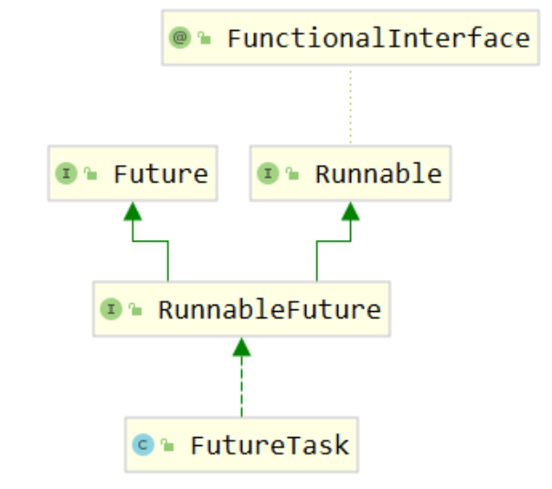

# 1 多线程知识回顾

## 1.1 基础概念

### 1.1.1 程序、进程、线程

#### 程序

- 程序从开发到发布的过程：源程序（源代码） → 打包封装 → 应用软件 ；

- 笼统的来说，源程序、应用软件都可以称之为『程序』；

- 相对于进程、线程来说，程序是一个**静态**的概念；

#### 进程

- 内部视角：程序运行起来就是一个进程。所以相对于程序来说，进程是一个**动态**的概念；
- 外部视角：站在操作系统的层次上来说，现代的大型操作系统都是支持多进程模式运行的，这样操作系统就可以同时执行很多个任务；

#### 线程

在一个进程中，需要同时处理多个不同任务，每一个任务由一个线程来执行。从这个意义上来说，可以把进程看做是线程的容器。


### 1.1.2 串行、并行、并发

#### 串行

多个操作**在同一个线程内**按顺序执行。这种情况下的工作模式我们往往也称之为：**同步**。按照同步模式执行的多个操作，当前操作没有结束时，下一个操作就必须等待。处于等待中的状态往往也称为：阻塞（block）。

#### 并行和并发

并行和并发都是以异步的模式来执行操作的。**异步**工作模式下不同线程内的操作互相不需要等待。

- 并行：多个 CPU（或 CPU 核心）同时执行多个任务
- 并发：一个 CPU（或 CPU 核心）同时执行多个任务

### 1.1.3 sleep()和wait()

二者最关键的区别是下面两点：

- `sleep()` 会让线程**拿着锁**去睡；
- `wait()` 会让线程**放开锁**去睡；

#### `sleep()`进入等待状态不释放锁

```java
// 1、创建一个对象，作为锁对象
Object lockObj = new Object();

// 2、创建执行 sleep 的线程
new Thread(()->{

    System.out.println(Thread.currentThread().getName() + " begin");
    // ※ 两个线程使用同一个锁对象，就会存在竞争关系
    synchronized (lockObj) {
        System.out.println(Thread.currentThread().getName() + " get lock");
        try {

            // ※ sleep() 方法拿着锁去睡
            TimeUnit.SECONDS.sleep(5);
        } catch (InterruptedException e) {
            e.printStackTrace();
        }
        System.out.println(Thread.currentThread().getName() + " release lock");

    }
    System.out.println(Thread.currentThread().getName() + " end");

}, "thread-a").start();

// ※ 让主线程睡一会儿，确保 a 线程先启动
try {TimeUnit.SECONDS.sleep(1);} catch (InterruptedException e) {}

// 3、创建竞争锁的线程
new Thread(()->{

    System.out.println(Thread.currentThread().getName() + " begin");
    // ※ 两个线程使用同一个锁对象，就会存在竞争关系
    synchronized (lockObj) {
        System.out.println(Thread.currentThread().getName() + " get lock");
    }

    System.out.println(Thread.currentThread().getName() + " end");
}, "thread-b").start();
```

打印结果：

>thread-a begin 
>
>thread-a get lock 
>
>thread-b begin 
>
>thread-a release lock 
>
>thread-b get lock 
>
>thread-b end 
>
>thread-a end

#### `wait()`进入等待状态释放锁

```java
// 1、创建一个对象，作为锁对象
Object lockObj = new Object();

// 2、创建执行 sleep 的线程
new Thread(()->{

    System.out.println(Thread.currentThread().getName() + " begin");
    // ※ 两个线程使用同一个锁对象，就会存在竞争关系
    synchronized (lockObj) {
        System.out.println(Thread.currentThread().getName() + " get lock");
        try {

            // ※ wait() 方法放开锁去睡
            lockObj.wait(5000);

        } catch (InterruptedException e) {
            e.printStackTrace();
        }
        System.out.println(Thread.currentThread().getName() + " release lock");

    }
    System.out.println(Thread.currentThread().getName() + " end");

}, "thread-a").start();

// ※ 让主线程睡一会儿，确保 a 线程先启动
try {TimeUnit.SECONDS.sleep(1);} catch (InterruptedException e) {}

// 3、创建竞争锁的线程
new Thread(()->{

    System.out.println(Thread.currentThread().getName() + " begin");
    // ※ 两个线程使用同一个锁对象，就会存在竞争关系
    synchronized (lockObj) {
        System.out.println(Thread.currentThread().getName() + " get lock");
    }

    System.out.println(Thread.currentThread().getName() + " end");
}, "thread-b").start();
```

打印结果：

> thread-a begin
>
> thread-a get lock
>
> thread-b begin
>
> thread-b get lock
>
> thread-b end
>
> thread-a release lock
>
> thread-a end

#### 小结

|                | wait()                               | sleep()                |
| -------------- | ------------------------------------ | ---------------------- |
| 声明位置       | Object 类                            | Thread 类              |
| 影响线程的方式 | 通过调用 wait() 方法的对象影响到线程 | 直接影响当前线程       |
| 性质           | 非静态方法                           | 静态方法               |
| 释放锁资源     | **放开锁进入等待**                   | **不释放锁进入等待**   |
| 同步要求       | 必须在同步上下文中使用               | 不要求在同步上下文中   |
| 应用场景       | 用于线程间通信                       | 用来让线程暂停一段时间 |

### 1.1.4 同步方法和同步代码块

#### 相同点

都会用到`synchronized`关键字

#### 区别

|            | 锁对象                           | 锁定范围             |
| ---------- | -------------------------------- | -------------------- |
| 同步代码块 | 由程序员指定                     | 代码块的范围（灵活） |
| 同步方法   | 静态：类.class  <br>非静态：this | 整个方法体           |

#### 小结

- 结论1：静态同步方法使用类.class作为锁对象；非静态同步方法使用this作为锁对象；
- 结论2：多个线程如果使用同一个锁对象就会有竞争关系；否则没有竞争关系；


## 1.2 创建多线程

无论有多少种形式，创建多线程的真正的方法，其实只有两种： 

> 继承 Thread 类 
>
>  实现 Runnable 接口 

**<u>其它形式都是这两种方式的变体</u>**

### 1.2.1 继承Thread类

#### 实现方法

- 第一步：继承 Thread 类；
- 第二步：重写 run() 方法；
- 第三步：创建 Thread 子类对象；
- 第四步：调用 start() 方法启动线程；

```java
public class CreateThread01Extends {

    public static void main(String[] args) {
        DemoThread demo = new DemoThread("AAA");
        demo.start();
    }

}

class DemoThread extends Thread {

    public DemoThread(String threadName) {
        super(threadName);
    }

    @Override
    public void run() {
        System.out.println(Thread.currentThread().getName() + " thread working ...");
    }
}
```

#### `start()` 方法和 `run()` 方法区别

调用 run() 方法仅仅只是调用了一个子类中重写的父类方法，并没有真正开启一个新的线程，还是在当前线程运行，也就是 main 线程。

#### 评价

因为 Java 是单继承的，一个类继承了 Thread 类就不能继承其它类，所以通常不采用这个办法创建多线程。

### 1.2.2 实现Runnable接口

#### 实现接口形式

```java
public class CreateThread02Impl {

    public static void main(String[] args) {

        // 第四步：创建实现了 Runnable 接口的类的对象
        MyRunnableThread runnable = new MyRunnableThread();

        // 第五步：创建 Thread 类对象
        // 参数1：runnable 对象
        // 参数2：线程名称
        Thread thread = new Thread(runnable, "thread 002");

        // 第六步：调用 Thread 对象的 start() 方法启动线程
        thread.start();
    }

}

// 第一步：实现 Runnable 接口
class MyRunnableThread implements Runnable {

    // 第二步：实现 run() 方法
    @Override
    public void run() {

        // 第三步：编写线程中的逻辑代码
        System.out.println(Thread.currentThread().getName() + " is working");
    }
}
```

#### 匿名内部类形式

```java
// 第一步：以匿名内部类的方式创建 Runnable 接口类型的对象
Runnable runnable = new Runnable() {
    @Override
    public void run() {
        // 第二步：编写线程中的逻辑代码
        System.out.println(Thread.currentThread().getName() + " is working");
    }
};

// 第三步：创建 Thread 类对象
// 参数1：runnable 对象
// 参数2：线程名称
Thread thread = new Thread(runnable, "thread 003");

// 第四步：调用 Thread 对象的 start() 方法启动线程
thread.start();
```

#### Lambda表达式

**声明变量：**

```java
// 编写 Lambda 表达式的口诀：
// 复制小括号
// 写死右箭头
// 落地大括号

// 第一步：以匿名内部类的方式创建 Runnable 接口类型的对象
Runnable runnable = () -> {
    // 第二步：编写线程中的逻辑代码
    System.out.println(Thread.currentThread().getName() + " is working");
};

// 第三步：创建 Thread 类对象
// 参数1：runnable 对象
// 参数2：线程名称
Thread thread = new Thread(runnable, "thread 004");

// 第四步：调用 Thread 对象的 start() 方法启动线程
thread.start();
```

**不声明变量：**

```java
// 第一步：创建 Thread 类对象并调用 start() 方法启动线程
// 参数1：以Lambda 表达式形式创建的 runnable 对象
// 参数2：线程名称
new Thread(() -> {
    // 第二步：编写线程中的逻辑代码
    System.out.println(Thread.currentThread().getName() + " is working");
}, "thread 005").start();
```

### 1.2.3 使用Callable接口配合FutureTask

该方案最核心的价值是：使用 Callable 接口限定的功能 + Future 接口限定的功能 = 汇总各个线程执行结果 最终执行汇总操作的这一步会被阻塞，直到前面各个线程完成了计算。

#### `FutureTask`类和`Runnable`接口的关系



从继承关系能够看到，`FutureTask`本身也间接实现了`Runnable`接口。`FutureTask`类的对象也是`Runnable`接口的实例，可以用于在创建`Thread`对象时，传入Thread构造器。

#### Future接口

**停止任务：**

```java
boolean cancel(boolean mayInterruptIfRunning);
```

如果尚未启动，它将停止任务。如果已启动，则仅在 mayInterrupt 为 true 时才会中断任务。

**获取任务的结果：**

```java
V get() throws InterruptedException, ExecutionException;
```

如果任务完成，它将立即返回结果，否则将等待任务完成，然后返回结果。

**判断任务是否完成：**

```java
boolean isDone();
```

如果任务完成，则返回true，否则返回false。

#### `FutureTask`类的构造器

**介绍：**

`FutureTask` 类兼具 `Runnable` 和 `Future` 接口的功能，并方便地将两种功能组合在一起。关于 `FutureTask` 类的使用有如下建议：

- 在主线程中需要执行比较耗时的操作时，但又不想阻塞主线程时，可以把这些作业交给 Future 对象在后台完成；
- 当主线程将来需要时，就可以通过 Future 对象获得后台作业的计算结果或者执行状态；
- 一般 FutureTask 多用于耗时的计算，主线程可以在完成自己的任务后，再去获取结果；
- 仅在计算完成时才能检索结果；如果计算尚未完成，则阻塞 get() 方法；
- 一旦计算完成，就不能再重新开始或取消计算；
- get() 方法而获取结果只有在计算完成时获取，否则会一直阻塞直到任务转入完成状态，然后会返回结果或者抛出异常；
- get() **<u>只执行一次</u>**，因此get() 方法放到最后；

**可以使用的构造器：**

```java
    public FutureTask(Callable<V> callable) {
        if (callable == null)
            throw new NullPointerException();
        this.callable = callable;
        this.state = NEW;       // ensure visibility of callable
    }
```

根据这个构造器，我们知道，创建 FutureTask 对象时，传入一个 Callable 类型的对象即可。

#### Callable接口

```java
@FunctionalInterface
public interface Callable<V> {
    /**
     * Computes a result, or throws an exception if unable to do so.
     *
     * @return computed result
     * @throws Exception if unable to compute a result
     */
    V call() throws Exception;
}
```

从 call() 方法的声明我们可以看出，它有一个返回值。这个返回值可以将当前线程内计算结果返回。

#### 测试代码

```java
// 1.创建三个FutureTask对象，封装三个线程的执行逻辑
FutureTask<Integer> task01 = new FutureTask<>(() -> {

    int result = (int) (Math.random() * Math.random() * 100);

    System.out.println(Thread.currentThread().getName());

    return result;
});
FutureTask<Integer> task02 = new FutureTask<>(() -> {

    int result = (int) (Math.random() * Math.random() * 1000);

    System.out.println(Thread.currentThread().getName());

    return result;
});
FutureTask<Integer> task03 = new FutureTask<>(() -> {

    int result = (int) (Math.random() * Math.random() * 10000);

    System.out.println(Thread.currentThread().getName());

    return result;
});

// 2.创建三个线程对象，然后启动线程
new Thread(task01, "thread01").start();
new Thread(task02, "thread02").start();
new Thread(task03, "thread03").start();

// 3.上面三个线程执行完成后，可以收集它们各自运算的结果
Integer task01Result = task01.get();
Integer task02Result = task02.get();
Integer task03Result = task03.get();

System.out.println("task01Result = " + task01Result);
System.out.println("task02Result = " + task02Result);
System.out.println("task03Result = " + task03Result);
```

#### callable和Runnable对比

| Runnable接口               | Callable接口             |
| -------------------------- | ------------------------ |
| 重写run()方法              | 重写call()方法           |
| run()没有返回值            | call()有返回值           |
| run()没有声明抛出异常      | call()声明抛出Exception  |
| 没有汇总各个线程结果的机制 | 有汇总各个线程结果的机制 |

### 1.2.4 线程池

#### 参考代码

```java
// 1.创建线程池对象
ExecutorService pool = Executors.newFixedThreadPool(5);

// 2.给线程池对象分配任务，每一个任务是一个线程
pool.execute(() -> {
    System.out.println(Thread.currentThread().getName() + " " + new Date());
});

pool.execute(() -> {
    System.out.println(Thread.currentThread().getName() + " " + new Date());
});

pool.execute(() -> {
    System.out.println(Thread.currentThread().getName() + " " + new Date());
});
```

### 1.2.5 并行计算

```java
List<String> list = Arrays.asList("a", "b", "c", "d", "e");

// 串行计算
list.stream().forEach(System.out::print);

System.out.println();

// 并行计算
list.parallelStream().forEach(System.out::print);
```

### 1.2.6 Timer定时任务

```java
// 1、创建 Timer 对象封装定时任务中要执行的操作
// 每一个 Timer 对象会使用一个线程来执行定时任务
Timer timer01 = new Timer();

// 2、调用 schedule() 指定任务和执行周期
// 参数1：timerTask 封装具体任务操作
// 参数2：delay 指定定时任务延迟多久后开始执行
// 参数3：period 指定定时任务执行的时间间隔
timer01.schedule(new TimerTask() {
    @Override
    public void run() {
        System.out.println(Thread.currentThread().getName() +" is working");
    }
}, 0, 1000);

Timer timer02 = new Timer();

timer02.schedule(new TimerTask() {
    @Override
    public void run() {
        System.out.println(Thread.currentThread().getName() +" is working");
    }
}, 0, 1000);
```

### 1.2.7 Spring异步方法

在 Spring 环境下，如果组件 A（假设是 ControllerA）要调用组件 B（假设是 ServiceB）的多个方法，而且希望这些方法能够异步执行。

#### 准备SpringBoot环境

**引入依赖：**

```xml
<dependencies>
    <dependency>
        <groupId>org.springframework.boot</groupId>
        <artifactId>spring-boot-starter-web</artifactId>
        <version>2.5.2</version>
    </dependency>
</dependencies>
```

**创建主启动类：**

```java
@SpringBootApplication
public class Application {

    public static void main(String[] args) {
        SpringApplication.run(Application.class, args);
    }

}
```

**创建Service：**

```java
@Service
public class DemoService {
    
    public void doSth() {
        System.out.println("Demo Service " + Thread.currentThread().getName());
    }

}
```

**创建Controller：**

```java
@RestController
public class DemoController {

    @Autowired
    private DemoService demoService;

    @RequestMapping("/demo/test/async")
    public String callServiceMethod() {

        demoService.doSth();
        demoService.doSth();
        demoService.doSth();
        demoService.doSth();
        demoService.doSth();

        return "success";
    }

}
```

#### 使用异步方法

**开启异步功能：**

在主启动类使用 @EnableAsync 注解：

```java
// 开启支持异步方法调用功能
@EnableAsync
@SpringBootApplication
public class Application {

    public static void main(String[] args) {
        SpringApplication.run(Application.class, args);
    }

}
```

**标记异步方法：**

在想要异步调用的方法上使用 @Async 注解：

```java
@Service
public class DemoService {

    // 在想要实现异步调用的方法上加 @Async注解
    @Async
    public void doSth() {
        System.out.println("Demo Service " + Thread.currentThread().getName());
    }

}
```


## 1.3 线程状态与生命周期

### 1.3.1 线程状态枚举类

#### 源代码

```java
    public enum State {
        /**
         * Thread state for a thread which has not yet started.
         */
        NEW,

        /**
         * Thread state for a runnable thread.  A thread in the runnable
         * state is executing in the Java virtual machine but it may
         * be waiting for other resources from the operating system
         * such as processor.
         */
        RUNNABLE,

        /**
         * Thread state for a thread blocked waiting for a monitor lock.
         * A thread in the blocked state is waiting for a monitor lock
         * to enter a synchronized block/method or
         * reenter a synchronized block/method after calling
         * {@link Object#wait() Object.wait}.
         */
        BLOCKED,

        /**
         * Thread state for a waiting thread.
         * A thread is in the waiting state due to calling one of the
         * following methods:
         * <ul>
         *   <li>{@link Object#wait() Object.wait} with no timeout</li>
         *   <li>{@link #join() Thread.join} with no timeout</li>
         *   <li>{@link LockSupport#park() LockSupport.park}</li>
         * </ul>
         *
         * <p>A thread in the waiting state is waiting for another thread to
         * perform a particular action.
         *
         * For example, a thread that has called <tt>Object.wait()</tt>
         * on an object is waiting for another thread to call
         * <tt>Object.notify()</tt> or <tt>Object.notifyAll()</tt> on
         * that object. A thread that has called <tt>Thread.join()</tt>
         * is waiting for a specified thread to terminate.
         */
        WAITING,

        /**
         * Thread state for a waiting thread with a specified waiting time.
         * A thread is in the timed waiting state due to calling one of
         * the following methods with a specified positive waiting time:
         * <ul>
         *   <li>{@link #sleep Thread.sleep}</li>
         *   <li>{@link Object#wait(long) Object.wait} with timeout</li>
         *   <li>{@link #join(long) Thread.join} with timeout</li>
         *   <li>{@link LockSupport#parkNanos LockSupport.parkNanos}</li>
         *   <li>{@link LockSupport#parkUntil LockSupport.parkUntil}</li>
         * </ul>
         */
        TIMED_WAITING,

        /**
         * Thread state for a terminated thread.
         * The thread has completed execution.
         */
        TERMINATED;
    }

```

#### 说明

| 英文名称      | 中文名称 | 含义                                                     |
| ------------- | -------- | -------------------------------------------------------- |
| NEW           | 新建     | 线程对象刚创建                                           |
| RUNNABLE      | 就绪     | 等待 CPU 时间片                                          |
| RUNNING       | 运行     | 得到了 CPU 时间片，正在执行                              |
| BLOCKED       | 阻塞     | 等待同步锁                                               |
| WAITING       | 等待     | 等待被唤醒                                               |
| TIMED_WAITING | 限时等待 | 在进入等待状态时设定了等待时间。时间一到自动回到就绪状态 |
| TERMINATED    | 终止     | 线程因为代码执行完成或抛异常而停止执行                   |

### 1.3.2 线程的生命周期


## 1.4 线程间通信

在多线程模式下进行工作，除了要考虑各个线程之间是否同步、如何竞争锁等问题，还要考虑这样一个问题：线程之间有的时候需要相互配合来共同完成一件事情。 把一个大的任务拆分成多个不同的任务线，每个任务线中都有更小的执行步骤。各个线程之间需要彼此配合：A 线程执行一步唤醒 B 线程，自己等待；B 线程执行一步，唤醒 A 线程，自己等待……

### 1.4.1 核心语法

#### `Object` 类的 `wait()` 方法

> Causes the current thread to wait until another thread invokes the `java.lang.Object`#notify() method or the `java.lang.Object`#notifyAll() method for this object.

- `wait()` 方法会导致当前线程进入等待状态；
- **必须**是**另外一个线程**调用 `notify()` 或 `notifyAll()` 方法来**唤醒**；
- “for this object” 表示还是要使用**<u>同一个对象</u>**分别调用 `wait()`、`notify()`、`notifyAll()` 这些方法；

#### `Object` 类的 `notify()` 方法

> Wakes up a single thread that is waiting on this object's monitor. If any threads are waiting on this object, one of them is chosen to be awakened.

- `notify()` 方法只唤醒一个线程；
- 处于等待状态的线程会被存放在对象监视器中的一个数组中；
- 如果在这个对象的监视器中维护的处于等待状态的线程是多个，那么 `notify()` 方法会**随机**唤醒一个；
- `notfiy()` 方法无法精确唤醒一个指定的线程，这个需求可以通过 Lock + Condition 方式实现（定制化通信）；

#### `Object` 类的 `notifyAll()` 方法

> Wakes up all threads that are waiting on this object's monitor.

唤醒当前对象监视器上等待的**<u>所有</u>**线程。

### 1.4.2 虚假唤醒


这种情况，我们称之为：虚假唤醒。

要解决虚假唤醒问题，就需要对线程间通信时的判断条件使用 `while` 循环结构来执行，而不是 if 分支判断。


