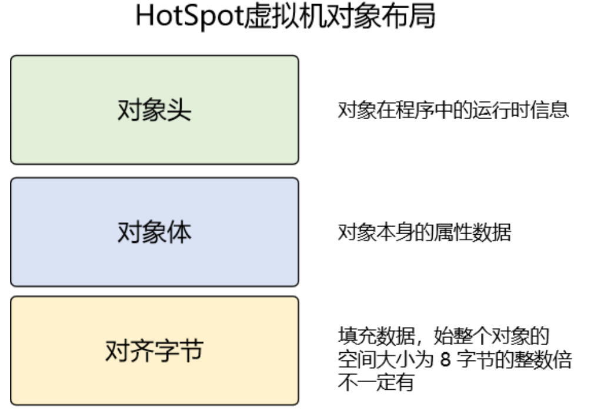
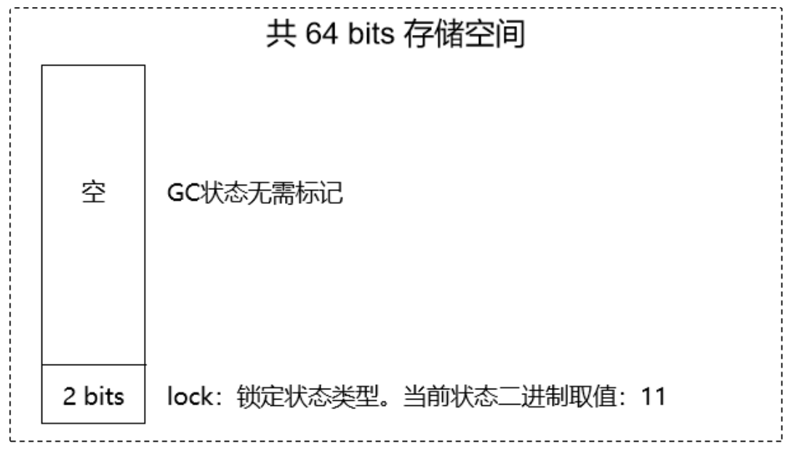
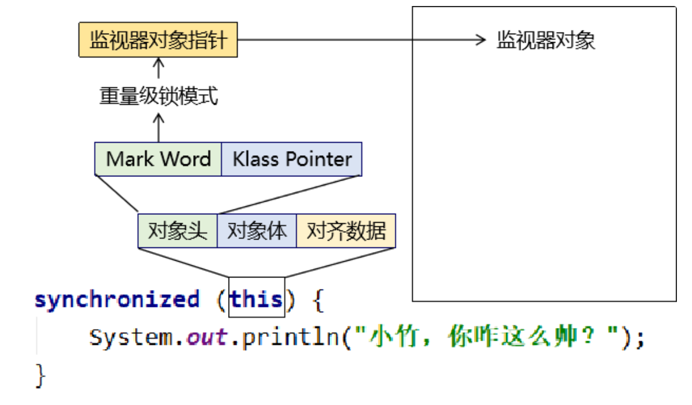
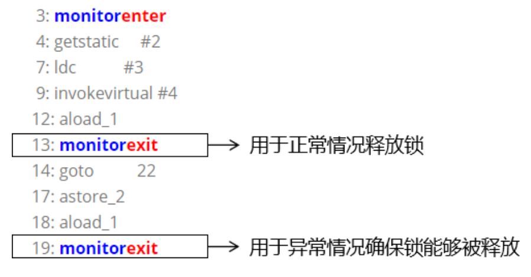

# 2 synchronized底层原理

为了方便大家理解，我们先说结论：synchronized底层的锁机制并不是『用钥匙开锁』这样的模型，而是『小狗撒尿』。 

- 小狗：线程 ；
- 电线杆子：锁对象关联的监视器对象 ；
- 小狗撒的尿：成功拿到锁的线程在监视器对象身上留下的痕迹；

## 2.1 锁膨胀机制

### 2.1.1 JDK 1.6分水岭

在 JDK 1.6 之前，synchronized 的底层工作机制只有『重量级锁』这一种模式。从 JDK 1.6 开始，官方对synchronized 的底层工作机制做了重大调整。

之所以要做这个调整是考虑到线程访问锁时，如果没有竞争，那么加锁和解锁的操作就显得有点浪费性能。

为了减少获得锁和释放锁带来的性能消耗，引入了『偏向锁』和『轻量级锁』的概念。升级后锁一共有 4 种状态，级别从低到高依次是：无锁状态、偏向锁状态、轻量级锁状态和重量级锁状态。锁可以升级但不能降级，也称为膨胀过程**不可逆**。

### 2.1.2 锁膨胀

#### 无锁

对象（用来作为锁对象的那个）刚创建出来，没有线程来申请锁——没有线程准备执行同步代码块。

#### 偏向锁

只有一个线程访问对象。此时没有必要执行获得锁和释放锁的操作，我们只需要在对象中记录当前偏向的线程的 ID，只要是这个线程来访问对象，则无需获得锁，直接可以开始操作。

如果一个线程获得了锁，那么锁就进入偏向模式，此时 *Mark Word* 的结构也就变为偏向锁结构，当该线程再次请求锁时，无需再做任何同步操作（同步操作就是加锁、解锁操作的总称），即获取锁的过程只需要检查 *Mark Word* 的锁标记位为偏向锁以及当前线程 ID 等于 Mark Word 的 Thread ID 即可，这样就省去了大量有关锁申请的操作。

#### 轻量级锁

轻量级锁是由偏向锁升级而来，当存在第二个线程申请同一个锁对象时，偏向锁就会立即升级为轻量级锁。注意这里的第二个线程只是申请锁，**<u>不存在两个线程同时竞争锁，可以是一前一后地交替执行同步块</u>**。

#### 重量级锁

重量级锁是由轻量级锁升级而来。当同一时间有多个线程竞争锁时，锁就会被升级成重量级锁，此时其申请锁带来的开销也就变大。此时各个线程之间存在竞争关系。

重量级锁一般用在不追求吞吐量，同步块或者同步方法执行时间较长的场景。

### 2.1.3 锁消除

占用锁的线程把同步代码执行完释放了锁，并且没有其它线程来申请锁，锁对象就会从重量级锁状态回到无锁状态。

### 2.1.4 自旋锁

轻量级锁失败后，虚拟机为了避免线程真实地在操作系统层面挂起，还会进行一项称为自旋锁的优化手段。大致相当于：在遇到 synchronized 时，没有拿到锁，但是并不乖乖去阻塞，而是继续执行一些无意义代码。执行完这些代码再看看别人把锁释放没有。如果还是没有释放，那就只好去阻塞了。

- 适合的场景：锁定时间较短，通过自旋有较大几率获得锁。
- 不适合的场景：锁定时间长，自旋操作本身浪费了 CPU 性能。
    - 通俗来说就是：“旋”了半天没等到，白“旋”了。

### 2.1.5 自适应自旋锁

这种相当于是对上面自旋锁优化方式的进一步优化，它的自旋的次数不再固定，其自旋的次数由前一次在同一个锁上的自旋时间及锁的拥有者的状态来决定，这就解决了自旋锁带来的缺点。


## 2.2 对象存储结构

学习本节内容是为了搞清楚当线程在申请锁时，底层具体是如何工作的。

### 2.2.1 对象存储结构

现在我们都知道了对象（包括数组）都是放在堆内存中，那么对象在堆内存中保存时的数据结构是什么样子的呢？



#### 对象头

- 非数组对象
    - Mark Word
    - 类型指针
- 数组
    - Mark Word
    - 类型指针
    - 数组长度


#### 对象体

这一部分也称为：实例数据。也就是对象中实际包含的属性数据。

#### 对齐字节

为了寻址方便，JVM 要求每一个对象起始地址必须是 8 字节的整数倍，也就是要求每一个对象的存储空间都是 8 字节的整数倍。所以对于占空间不满足这一要求的对象会进行填充。所以这一部分是不一定存在的。

### 2.2.2 Mark Word

Mark Word 部分用于存储对象自身运行时数据，如哈希码、GC分代年龄等，这部分数据的长度在 32 位和 64 位的虚拟机中分别为 32 位和 64 位。

由于对象头的信息是与对象自身定义的数据没有关系的额外存储成本，因此考虑到 JVM 的空间效率，Mark Word 被设计成为一个非固定的数据结构，以便存储更多有效的数据，它会根据对象本身的状态复用自己的存储空间。

在 Mark Word 各种状态下的数据结构中，我们首先要关注一个数据：锁标识位。

| 锁标识位数值 | 是否偏向 | 锁标识位含义 |
| ------------ | -------- | ------------ |
| 01           | 0        | 无锁状态     |
| 01           | 1        | 偏向锁状态   |
| 00           | ——       | 轻量级锁状态 |
| 10           | ——       | 重量级锁状态 |
| 11           | ——       | GC状态       |

#### 无锁状态


#### 偏向锁状态


#### 轻量级锁状态


#### 重量级锁状态


#### GC状态



锁状态膨胀到**『重量级锁』**的时候，就会有一个指向**『对象监视器』**的指针。

### 2.2.3 对象监视器

从上面的介绍中我们发现：当锁状态膨胀为『重量级锁』时，Mark Word 中有一个指针指向一个特殊的对象——对象监视器。这个对象是由C++开发的，原名ObjectMonitor。

#### 锁对象和对象监视器之间的关系



其中 this 就是我们这里所说的锁对象。而就是通过这个锁对象的对象头，我们一步一步找到了它关联的 ObjectMonitor 对象监视器对象。

#### 监视器对象结构

```c++
ObjectMonitor() {
    _header       = NULL;
    _count        = 0;  // 锁计数器
    _waiters      = 0;
    _recursions   = 0; // 锁的重入次数
    _object       = NULL;
    _owner        = NULL; // 指向持有 ObjectMonitor 对象的线程
    _WaitSet      = NULL; // 处于 wait 状态的线程，会被加入到 _WaitSet（等待队列）
    _WaitSetLock  = 0 ;
    _Responsible  = NULL ;
    _succ         = NULL ;
    _cxq          = NULL ;
    FreeNext      = NULL ;
    _EntryList    = NULL ; // 处于等待锁 block 状态的线程，会被加入到该列表（阻塞队列）
    _SpinFreq     = 0 ;
    _SpinClock    = 0 ;
    OwnerIsThread = 0 ;
  }
```

## 2.3 加锁和解锁流程

### 2.3.1 `monitorenter`指令和`monitorexit`指令

#### 字节码指令分析

代码如下：

```java
public class Demo06CodeTest {
    
    public void doSth() {

        synchronized (this) {
            System.out.println("Hello");
        }
        
    }

}
```

编译并javap分析

```shell
> javac Demo06CodeTest.java
> javap -c Demo06CodeTest.class
```

分析结果如下：

```java
Compiled from "Demo06CodeTest.java"  
public class com.atguigu.thread.demo.Demo06CodeTest {  
public com.atguigu.thread.demo.Demo06CodeTest();  
Code:  
0: aload_0  
1: invokespecial #1 // Method java/lang/Object."<init>": ()V
4: return  

public void doSth();  
Code:  
0: aload_0  
1: dup  
2: astore_1  
3: monitorenter  
4: getstatic #2 // Field java/lang/System.out:Ljava/io/PrintStream;  
7: ldc #3 // String Hello  
9: invokevirtual #4 // Method java/io/PrintStream.println:(Ljava/lang/String;)V  
12: aload_1  
13: monitorexit  
14: goto 22  
17: astore_2  
18: aload_1  
19: monitorexit  
20: aload_2  
21: athrow  
22: return  
Exception table:  
from to target type  
4 14 17 any  
17 20 17 any  
}
```

#### 对应关系


#### 执行过程

**根据锁对象找到对象监视器：**


**加锁或阻塞：**


### 2.3.2 可重入性

从一个同步代码块又进入下一个同步代码块，这种现象我们称之为：『重入』。而多线程执行过程中如果不支持∶『可重入』，那将会发生死锁的问题。

所谓可重入性就是指：一个线程在获得锁之后如果再次进入同步代码，那么对于由它自己锁定的对象可以直接获得锁。具体来说就是：

- _owner 保持指向当前线程不变
- _count 继续 + 1
- _recursions 继续 + 1

而当内层的 synchronized 需要释放锁时执行：

- _owner 保持指向当前线程不变
- _count - 1
- _recursions - 1

当最外层的 synchronized 需要释放锁时执行：

- _owner 擦除
- _count - 1，让 _count 回到 0
- _recursions - 1，让 _recursions 回到 0

结论：可重入性就是指一个线程可以直接获得它自己加的锁。

### 2.3.3 为什么monitorexit出现两次



### 2.3.4 小结


