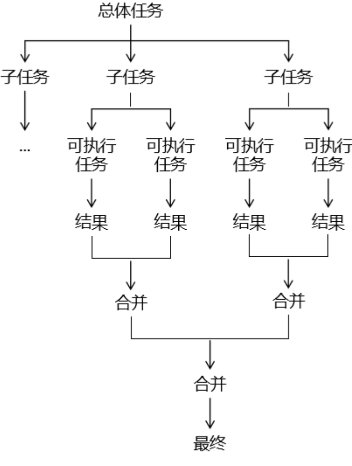
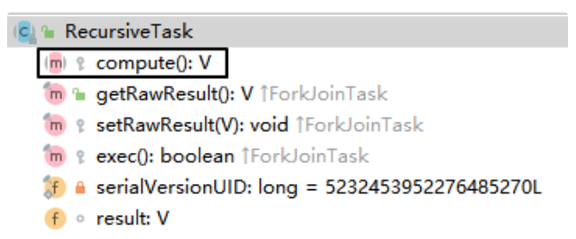
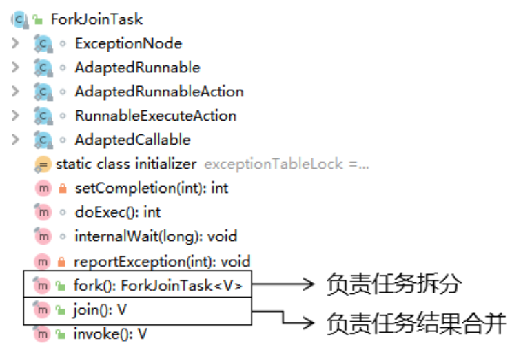

# 4 特定场景解决方法

## 4.1 `CountDownLatch`

效果：指定一个操作步骤数量，在各个子线程中，每完成一个任务就给步骤数量 - 1；在步骤数量减到0之前，CountDownLatch 可以帮我们把最后一步操作抑制住（阻塞），让最后一步操作一直等到步骤被减到 0 的时候执行。

### 实例

有六名同学在值日，班长负责锁门。班长必须确保所有同学都离开教室再锁门。

```java
// 声明一个变量，用来保存同学的数量
int stuNum = 6;

// 创建CountDownLatch对象
CountDownLatch countDownLatch = new CountDownLatch(stuNum);

// 创建和同学数量相等的线程
for (int i = 0; i < stuNum; i++) {

    String num = String.valueOf(i + 1);

    new Thread(()->{

        // 完成一次操作
        System.out.println(Thread.currentThread().getName() + " " + num + "号同学离开教室");

        // 让countDownLatch管理的数量-1
        countDownLatch.countDown();

    }).start();

}

// 让countDownLatch负责将最后一步操作抑制住
countDownLatch.await();

System.out.println("班长锁门");
```

## 4.2 `CyclicBarrier`

支持多线程在执行各自任务的时候，到达某个状态点就等待，等所有线程都到达这个状态点再继续执行后步骤。

### 实例

```java
public class DemoO19CyclicBarrierTest {

    private static List<List<String>> matrix = new ArrayList<>();

    static {
        matrix.add(Arrays.asList("normal","special","end"));
        matrix.add(Arrays.asList("normal","normal","special","end"));
        matrix.add(Arrays.asList("normal","normal","normal","special","end"));
    }

    public static void main(String[] args) {


        // 1.创建CyclicBarrier对象
        CyclicBarrier barrier = new CyclicBarrier(3);

        // 2.创建3个线程分别执行各自的任务
        new Thread(()->{

            try {
                List<String> list = matrix.get(0);

                for (String value : list) {

                    TimeUnit.SECONDS.sleep(1);

                    System.out.println(Thread.currentThread().getName() + " value = " + value);

                    if ("special".equals(value)) {

                        // 遇到特殊任务标记，就让当前线程等一下
                        barrier.await();
                    }

                }

            } catch (InterruptedException e) {
                e.printStackTrace();
            } catch (BrokenBarrierException e) {
                e.printStackTrace();
            }

        }, "thread01").start();

        new Thread(()->{

            try {
                List<String> list = matrix.get(1);

                for (String value : list) {

                    TimeUnit.SECONDS.sleep(1);

                    System.out.println(Thread.currentThread().getName() + " value = " + value);

                    if ("special".equals(value)) {

                        // 遇到特殊任务标记，就让当前线程等一下
                        barrier.await();
                    }

                }

            } catch (InterruptedException e) {
                e.printStackTrace();
            } catch (BrokenBarrierException e) {
                e.printStackTrace();
            }

        }, "thread02").start();
        new Thread(()->{

            try {
                List<String> list = matrix.get(2);

                for (String value : list) {

                    TimeUnit.SECONDS.sleep(1);

                    System.out.println(Thread.currentThread().getName() + " value = " + value);

                    if ("special".equals(value)) {

                        // 遇到特殊任务标记，就让当前线程等一下
                        barrier.await();
                    }

                }

            } catch (InterruptedException e) {
                e.printStackTrace();
            } catch (BrokenBarrierException e) {
                e.printStackTrace();
            }

        }, "thread03").start();
    }

}
```

## 4.3 `Semaphore`

### 4.3.1 常规方式使用

使用 Semaphore 可以帮助我们管理资源位；当某个线程申请资源时，由 Semaphore 检查这个资源是否可用；如果其他线程释放了这个资源，那么申请资源的线程就可以使用。

```java
// 1、创建 Semaphore 对象，指定资源数量为 3
Semaphore semaphore = new Semaphore(3);

// 2、创建 10 个线程争夺这 3 个资源
for (int i = 0; i < 10; i++) {

    new Thread(() -> {

        try {
            // 申请资源
            semaphore.acquire();

            // 拿到资源执行操作
            System.out.println("【" + Thread.currentThread().getName() + "】号车辆【驶入】车位");

            TimeUnit.SECONDS.sleep(3);

            System.out.println("【" + Thread.currentThread().getName() + "】号车辆【驶出】车位");

        } catch (InterruptedException e) {
            e.printStackTrace();
        } finally {

            // 操作完成释放资源
            semaphore.release();
        }

    }, i + "").start();
}
```

### 4.3.2 引入超时机制

```java
// 1、设定车位数量
int carPositionCount = 3;

// 2、创建 Semaphore 对象
Semaphore semaphore = new Semaphore(carPositionCount);

// 3、创建 50 个线程抢车位
for (int i = 0; i < 50; i++) {

    int carNum = i;

    new Thread(()->{

        boolean acquireResult = false;

        try {

            // 线程开始时先申请资源，申请不到会进入等待状态
            // 申请资源方式一：不见不散，等不到资源就一直等
            // semaphore.acquire();

            // 申请资源方式二：过时不候
            acquireResult = semaphore.tryAcquire(3, TimeUnit.SECONDS);

            if (acquireResult) {
                // 申请到资源时，线程会继续执行
                System.out.println(carNum + "号车辆驶入车位");

                // 车辆在车位停放一段时间
                TimeUnit.SECONDS.sleep(2);

                // 停放完成离开车位
                System.out.println(carNum + "号车辆驶出车位");

            } else {

                System.out.println(carNum + "号车辆放弃等待");

            }


        } catch (Exception e) {

            e.printStackTrace();

        } finally {

            // 判断当前线程释放拿到了资源
            if (acquireResult) {
                // 任务执行完成释放资源
                semaphore.release();

            }

        }

    }).start();

}    
```

### 4.3.3 应用场景举例

借助Semaphore实现『限流』操作。

- 当前服务器实例能够承受多大的访问量——设置为资源的数量。
- 根据资源的数量创建Semaphore对象。
- 服务器实例接收到请求通过Semaphore对象管理处理请求数量。
    - 在能力范围内：处理请求。
    - 超过能力范围：设定等待时间，看是否能够得到别的请求处理完成释放资源。

## 4.4 `Fork Join`

### 4.4.1 介绍

使用 Fork Join 框架能够帮助我们把一个大型任务，根据一定规律，拆分成小任务执行。如果拆分后的任务还不够小，可以以递归模式继续拆分，直到拆分到可以执行的程度。然后再把各个子任务执行的结果汇总到一起。

- Fork：拆分：把大任务拆分成小任务。
- Join：合并：把小任务执行的结果合并到一起。



### 4.4.2 API介绍

#### `RescursiveTask`



我们使用 Fork Join 框架只需要继承 RecursiveTask，然后重写 compute() 方法即可。在 compute() 方法中需要包含：

- 任务拆分的逻辑
- 任务拆分的操作：调用 fork() 方法
- 已拆分任务的合并：调用 join() 方法
- 子任务结果的合并：将 join() 方法的返回值合并起来

#### `ForkJoinTask`

ForkJoinTask 类是 RecursiveTask 的父类。



### 4.4.3 案例

#### 需求

完成从 1~100 的累加。

#### 代码

```java
// 任务类
class MyTask extends RecursiveTask {

    // 区间开始位置
    private int begin;

    // 区间结束位置
    private int end;

    // 区间调整值：要通过拆分任务将区间调整到 10 以内
    public static final int ADJUST_VALUE = 10;

    // 保存当前任务的结果
    private int result = 0;

    // 声明构造器，设定当前任务的开始和结束位置
    public MyTask(int begin, int end) {
        this.begin = begin;
        this.end = end;
    }

    @Override
    protected Object compute() {

        // 1、判断当前区间是否是原子任务中可以执行计算的范围
        if (end - begin <= ADJUST_VALUE) {

            for (int i = begin; i <= end ; i++) {
                result  = result + i;
            }

        } else {

            // 2、计算新拆分任务的区间范围
            int leftBegin = begin;
            int leftEnd = (begin + end) / 2;

            int rightBegin = leftEnd + 1;
            int rightEnd = end;

            // 3、创建两个新的任务（子任务）
            MyTask myTaskLeft = new MyTask(leftBegin, leftEnd);
            MyTask myTaskRight = new MyTask(rightBegin, rightEnd);

            // 4、调用框架提供的 fork() 进一步拆分任务
            myTaskLeft.fork();
            myTaskRight.fork();

            // 5、调用框架提供的 join() 获取子任务计算的结果
            int leftResult = (int) myTaskLeft.join();
            int rightResult = (int) myTaskRight.join();

            // 6、把子任务的结果合并到一起
            result = leftResult + rightResult;
        }

        return result;
    }

}

// 测试代码
// 1、创建 Fork Join 任务池
ForkJoinPool pool = new ForkJoinPool();

// 2、创建任务对象
MyTask myTask = new MyTask(1, 100);

// 3、将任务对象提交到任务池
ForkJoinTask forkJoinTask = pool.submit(myTask);

// 4、获取任务执行结果
int finalResult = (int) forkJoinTask.get();

System.out.println("finalResult = " + finalResult);
```


