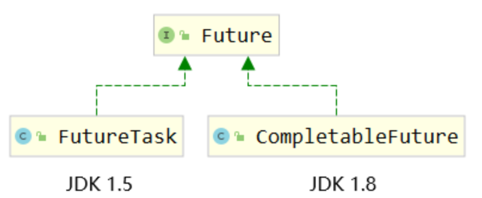

# 8 `CompletableFuture`

## 8.1 Future接口的局限性

从实现类的版本情况能看出，`CompletableFuture`是`FutureTask`的升级版。

### 8.1.1 Future接口回顾

`java.util.concurrent.Future`

|                                               |                                                              |
| --------------------------------------------- | ------------------------------------------------------------ |
| 方法名                                        | 功能                                                         |
| V get()                                       | 调用get()方法获取任务结果，但是会阻塞当前线程，直到目标任务返回 |
| V get(timeout)                                | 调用get()方法获取任务结果，同样会阻塞当前线程，但是如果超过预设时间则放弃获取 |
| boolean isDone()                              | 判断目标任务是否完成 返回true：目标任务完成 返回false：目标任务未完成 注：正常完成、被取消、抛异常结束都算完成 |
| boolean cancel(boolean mayInterruptIfRunning) | 尝试取消当前任务。 如果当前任务已经结束或被取消或由于某些原因无法取消，则取消失败。 返回true：取消成功 返回false：取消失败，无法取消 |
| boolean isCancelled()                         | 判断当前任务是否被取消 返回true：已取消 返回false：未取消 |

### 8.1.2 局限性

#### 任务结果获取方式

在Future接口下，我们只能通过调用get()方法来获取任务计算结果，但是只要目标任务没有执行完，get()方法会被阻塞——阻塞方式又回到了同步调用，这就和异步操作的初衷相违背了。

