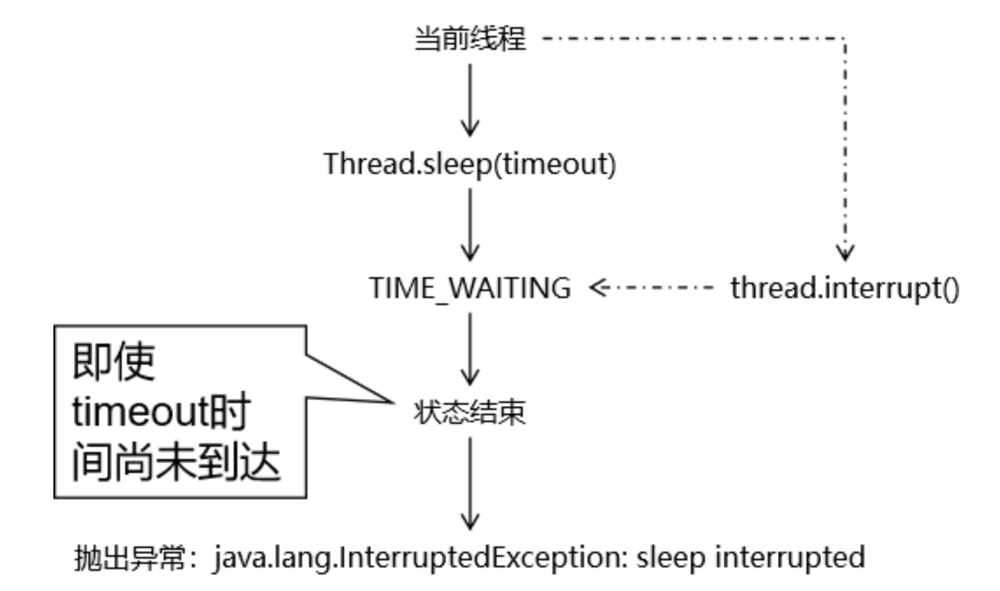
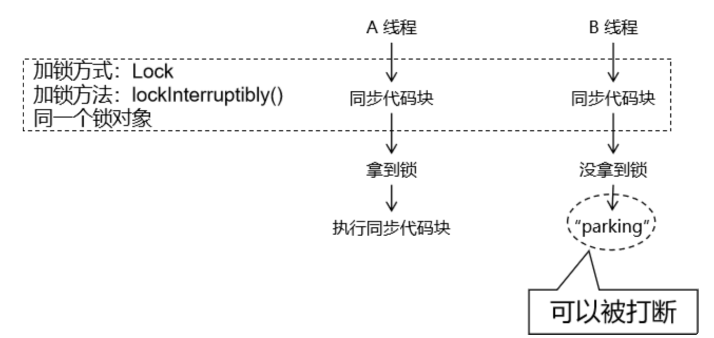

# 3 Lock API控制多线程

## 3.1 HelloWorld

### 3.1.1 买票

```java
public class Demo01HelloWorld {

    // 声明成员变量维护票库存
    private int stock = 100;

    // 创建锁对象
    // 变量类型：java.util.concurrent.locks.Lock 接口
    // 对象类型：Lock 接口的最常用的实现类 ReentrantLock
    private Lock lock = new ReentrantLock();

    // 声明卖票的方法
    public void saleTicket() {
        try {

            // 加锁
            lock.lock(); // synchronized (this) {

            if (stock > 0) {
                // 卖票的核心操作
                System.out.println(Thread.currentThread().getName() + " 卖了一张，还剩 " + --stock + " 张票。");

            } else {

                System.out.println(Thread.currentThread().getName() + " 卖完了。");

            }

        } catch (Exception e) {
            e.printStackTrace();
        } finally {

            // 解锁
            lock.unlock(); // }

        }
    }

    public static void main(String[] args) {

        // 1、创建当前类对象
        Demo01HelloWorld demo = new Demo01HelloWorld();

        // 2、开启三个线程调用卖票方法
        new Thread(()->{
            for (int i = 0; i < 40; i++) {
                demo.saleTicket();
                try {
                    TimeUnit.SECONDS.sleep(1);} catch (InterruptedException e) {}
            }
        }, "thread-01").start();

        new Thread(()->{
            for (int i = 0; i < 40; i++) {
                demo.saleTicket();
                try {
                    TimeUnit.SECONDS.sleep(1);} catch (InterruptedException e) {}
            }
        }, "thread-02").start();

        new Thread(()->{
            for (int i = 0; i < 40; i++) {
                demo.saleTicket();
                try {
                    TimeUnit.SECONDS.sleep(1);} catch (InterruptedException e) {}
            }
        }, "thread-03").start();
    }

}
```

### 3.1.2 需要注意的点

#### 确保锁被释放

使用 Lock API 实现同步操作，是一种面向对象的编码风格。这种风格有很大的灵活性，同时可以在常规操作的基础上附加更强大的功能。但是也要求编写代码更加谨慎：如果忘记调用 `lock.unlock()` 方法则锁不会被释放，从而造成程序运行出错。

#### 加锁和解锁操作对称执行

不管同步操作是一层还是多层，有多少个加锁操作，就应该相应的有多少个解锁操作。

#### 避免锁对象的线程私有化

锁对象如果是线程内部自己创建的，是自己独占的，其它线程访问不到这个对象，那么这个锁将无法实现**『排他』**效果，说白了就是：锁不住。


## 3.2 Lock接口

全类名：`java.util.concurrent.locks.Lock`

方法功能说明：

| 方法名                                    | 功能                                                         |
| ----------------------------------------- | ------------------------------------------------------------ |
| void lock()                               | 加同步锁，如果没有得到锁会一直等                             |
| void unlock()                             | 解除同步锁                                                   |
| boolean tryLock()                         | 尝试获取锁。如果没有获取到则立即返回，不做任何等待<br>返回 true：表示获取成功  <br>返回 false：表示获取失败 |
| boolean tryLock(long time, TimeUnit unit) | 尝试获取锁，且等待指定时间<br>返回 true：表示获取成功  <br>返回 false：表示获取失败 |
| void lockInterruptibly()                  | 以『支持响应中断』的模式获取锁                               |
| Condition newCondition()                  | 获取用于线程间通信的 Condition 对象                          |

## 3.3 可重入锁

全类名：`java.util.concurrent.locks.ReentrantLock`

这是 Lock 接口最典型、最常用的一个实现类。

### 3.3.1 基本用法

基本要求1：将解锁操作放在 `finally` 块中，确保解锁操作能够被执行到。

基本要求2：加锁和解锁操作要对称。

```java
try {
    // 加锁
    lock.lock();
    
    // 同步代码部分
} catch(Exception e) {
    // ...
} finally {
    // 解锁
    lock.unlock();
}
```

### 3.3.2 验证可重入性

```java
// 测试目标：验证可重入性
// 测试方式：在同一个线程内，嵌套使用 try ... catch ... finally 结构
// 由于可重入性的大前提就是已经加了一个锁，然后再加一个锁，所以不可能有多个线程，就在 main 线程里测试即可
// 测试标准：线程不会被自己锁住，不会陷入死锁就证明当前使用的 API 支持可重入
// 创建锁对象
Lock lock = new ReentrantLock();

try {
    // 外层加锁操作
    lock.lock();
    System.out.println(Thread.currentThread().getName() + " 外层加锁成功。");

    try {
        // 内层加锁操作
        lock.lock();
        System.out.println(Thread.currentThread().getName() + " 内层加锁成功。");
    } finally {
        // 内层解锁操作
        lock.unlock();
        System.out.println(Thread.currentThread().getName() + " 内层解锁成功。");
    }

} finally {
    // 外层解锁操作
    lock.unlock();
    System.out.println(Thread.currentThread().getName() + " 外层解锁成功。");
}
```


### 3.3.3 `tryLock()`

```java
public class Demo03TryLock {

    private Lock lock = new ReentrantLock();

    public void showMessage() {

        boolean lockResult = false;

        try {

            // 尝试获取锁
            // 返回true：获取成功
            // 返回false：获取失败
            lockResult = lock.tryLock();

            if (lockResult) {
                try {
                    TimeUnit.SECONDS.sleep(1);} catch (InterruptedException e) {}
                System.out.println(Thread.currentThread().getName() + " 得到了锁，正在工作");
            } else {
                System.out.println(Thread.currentThread().getName() + " 没有得到锁");
            }

        }catch (Exception e){
            e.printStackTrace();
        }finally {

            // 如果曾经得到了锁，那么就解锁
            if (lockResult) {
                lock.unlock();
            }

        }

    }

    public static void main(String[] args) {

        // 1、创建多个线程共同操作的对象
        Demo03TryLock demo = new Demo03TryLock();

        // 2、创建三个线程
        new Thread(()->{

            for(int i = 0; i < 20; i++) {
                try {TimeUnit.SECONDS.sleep(1);} catch (InterruptedException e) {}
                demo.showMessage();
            }

        }, "thread-01").start();

        new Thread(()->{

            for(int i = 0; i < 20; i++) {
                try {TimeUnit.SECONDS.sleep(1);} catch (InterruptedException e) {}
                demo.showMessage();
            }

        }, "thread-02").start();

        new Thread(()->{

            for(int i = 0; i < 20; i++) {
                try {TimeUnit.SECONDS.sleep(1);} catch (InterruptedException e) {}
                demo.showMessage();
            }

        }, "thread-03").start();
    }

}
```

### 3.3.4 `tryLock(time,timeUnit)`

```java
public class Demo04TryLockWithTime {

    private Lock lock = new ReentrantLock();

    // 得到锁之后占用 5 秒
    public void useLock() {

        try {

            lock.lock();

            System.out.println(Thread.currentThread().getName() + " 开始工作");
            try {TimeUnit.SECONDS.sleep(5);} catch (InterruptedException e) {}
            System.out.println(Thread.currentThread().getName() + " 结束工作");

        } catch (Exception e) {
            e.printStackTrace();
        } finally {

            lock.unlock();

        }

    }

    // 在尝试获取锁的过程中，可以等待一定时间
    public void waitLock() {

        boolean lockResult = false;

        try {

            // 尝试获取锁，并指定了等待时间
            lockResult = lock.tryLock(3, TimeUnit.SECONDS);

            if (lockResult) {
                System.out.println(Thread.currentThread().getName() + " 得到了锁，开始工作");
            } else {
                System.out.println(Thread.currentThread().getName() + " 没有得到锁");
            }

        }catch (Exception e){
            e.printStackTrace();
        }finally {
            if (lockResult) {
                lock.unlock();
            }
        }

    }

    public static void main(String[] args) {

        // 1、创建当前类对象
        Demo04TryLockWithTime demo = new Demo04TryLockWithTime();

        // 2、创建 A 线程占用锁
        new Thread(()->{

            demo.useLock();

        }, "thread-a").start();

        // 3、创建 B 线程尝试获取锁
        new Thread(()->{

            demo.waitLock();

        }, "thread-b").start();
    }

}
```

### 3.3.5 公平锁

#### 概念

在 `ReentrantLock` 构造器中传入 boolean 类型的参数：

- true：创建公平锁（在锁上等待最长时间的线程有最高优先级）；
- false：创建非公平锁；

#### 代码

```java
public class Demo05FairLock {

    private Lock lock = new ReentrantLock(true);

    public void printMessage() {

        try {

            lock.lock();

            System.out.println(Thread.currentThread().getName() + " say hello to you");

            try {TimeUnit.SECONDS.sleep(1);} catch (InterruptedException e) {}

        }catch (Exception e) {
            e.printStackTrace();
        }finally {
            lock.unlock();
        }

    }

    public static void main(String[] args) {

        // 1、创建当前类的对象
        Demo05FairLock demo = new Demo05FairLock();

        // 2、创建三个线程，每个线程内调用 printMessage() 方法十次
        new Thread(()->{

            for (int i = 0; i < 10; i++) {
                demo.printMessage();
            }

        }, "thread-a").start();

        new Thread(()->{

            for (int i = 0; i < 10; i++) {
                demo.printMessage();
            }

        }, "thread-b").start();

        new Thread(()->{

            for (int i = 0; i < 10; i++) {
                demo.printMessage();
            }

        }, "thread-c").start();


    }

}
```

#### 使用建议

- 公平锁对线程操作的吞吐量有限制，效率上不如非公平锁；
- 如果没有特殊需要还是建议使用默认的非公平锁。

### 3.3.6 `lockInterruptibly()`

`lock`：动词，加锁的动作 

`Interruptibly`：修饰动词的副词，表示可以被打断 组合起来的含义：以可以被打断的方式加锁。 

具体来说就是如果线程是被 `lockInterruptibly()` 加的锁给阻塞的，那么这个阻塞状态可以被打断。

#### 相应中断



#### synchronized方式下的阻塞状态无法打断

`synchronized` 导致的 `blocked` 状态不支持响应中断。


#### `lockInterruptibly()`



```java
public class Demo07LockInterruptibly {

    private Lock lock = new ReentrantLock();

    // 小强：持续占用锁。
    public void useLock() {
        try {

            lock.lock();

            while (true) {
                System.out.println(Thread.currentThread().getName() + " 正在占用锁");
                try {TimeUnit.SECONDS.sleep(1);} catch (InterruptedException e) {}
            }

        }catch (Exception e) {
            e.printStackTrace();
        }finally {
            lock.unlock();
        }
    }

    // 小明：痴痴地等待小强释放锁
    public void waitLock() {

        System.out.println(Thread.currentThread().getName() + " 线程启动了");

        try {

            // 通过 lockInterruptibly() 方法获取锁，在没有获取到锁的阻塞过程中可以被打断
            lock.lockInterruptibly();

            // ...

        }catch (Exception e) {
            e.printStackTrace();
        }finally {
            lock.unlock();
        }

        System.out.println(Thread.currentThread().getName() + " 线程结束了");

    }

    public static void main(String[] args) {

        // 1、创建当前类对象
        Demo07LockInterruptibly demo = new Demo07LockInterruptibly();

        // 2、创建占用锁的线程（小强）
        new Thread(()->{

            demo.useLock();

        }, "thread-qiang").start();

        Thread thread = new Thread(() -> {

            demo.waitLock();

        }, "thread-ming");

        thread.start();

        try {
            TimeUnit.SECONDS.sleep(3);} catch (InterruptedException e) {}

        // 打断小明线程的阻塞状态
        thread.interrupt();
    }
}
```

在`lockInterruptibly()`模式下，被打断的线程，如果希望在被打断之后继续执行某些逻辑，那么可以在catch块编写。

## 3.4 读写锁

### 3.4.1 读写锁介绍

#### 概念

在实际场景中，读操作不会改变数据，所以应该允许多个线程同时读取共享资源；但是如果一个线程想去写这些共享资源，就不应该允许其他线程对该资源进行读和写的操作了。

针对这种场景，Java 的并发包提供了读写锁 `ReentrantReadWriteLock`，它表示两个锁，一个是读操作相关的锁，称为读锁，这是一种共享锁；一个是写相关的锁，称为写锁，这是一种排他锁，也叫独占锁、互斥锁。

#### 进入条件

**进入读锁条件：**

- 同一个线程内（可重入性角度）：
    - 目前无锁：可以进入
    - 已经有读锁：可以进入
    - 已经有写锁：可以进入（锁可以降级，权限可以收缩）
- 不同线程之间（排他性角度）：
    - 其他线程已经加了读锁：可以进入
    - 其他线程已经加了写锁：不能进入

**进入写锁条件：**

- 同一个线程内（可重入性角度）：
    - 目前无锁：可以进入
    - 已经有读锁：不能进入（锁不能升级，权限不能扩大）
    - 已经有写锁：可以进入
- 不同线程之间（排他性角度）：
    - 其他线程已经加了读锁：不能进入
    - 其他线程已经加了写锁：不能进入

#### 重要特征

**公平选择性：**

支持非公平（默认）和公平的锁获取方式，吞吐量还是非公平优于公平。

**重进入：**

读锁和写锁都支持线程重进入：

- 同一个线程：加读锁后再加读锁
- 同一个线程：加写锁后再加写锁

**锁降级：**

在同一个线程内：读锁不能升级为写锁，但是写锁可以降级为读锁。

### 3.4.2 `ReadWriteLock`接口

全类名：`java.util.concurrent.locks.ReadWriteLock`

源码如下：

```java
public interface ReadWriteLock {
    /**
     * Returns the lock used for reading.
     *
     * @return the lock used for reading.
     */
    Lock readLock();
 
    /**
     * Returns the lock used for writing.
     *
     * @return the lock used for writing.
     */
    Lock writeLock();
}
```

readLock() 方法用来获取读锁，writeLock() 方法用来获取写锁。也就是说将文件的读写操作分开，分成两种不同的锁来分配给线程，从而使得多个线程可以同时进行读操作。

该接口下我们常用的实现类是：`java.util.concurrent.locks.ReentrantReadWriteLock`

### 3.4.3 `ReentrantReadWriteLock`类结构

```java
public class ReentrantReadWriteLock implements ReadWriteLock, java.io.Serializable {

    /** 读锁 */
    private final ReentrantReadWriteLock.ReadLock readerLock;

    /** 写锁 */
    private final ReentrantReadWriteLock.WriteLock writerLock;

    final Sync sync;
    
    /** 使用默认（非公平）的排序属性创建一个新的 ReentrantReadWriteLock */
    public ReentrantReadWriteLock() {
        this(false);
    }

    /** 使用给定的公平策略创建一个新的 ReentrantReadWriteLock */
    public ReentrantReadWriteLock(boolean fair) {
        sync = fair ? new FairSync() : new NonfairSync();
        readerLock = new ReadLock(this);
        writerLock = new WriteLock(this);
    }

    /** 返回用于写入操作的锁 */
    public ReentrantReadWriteLock.WriteLock writeLock() { return writerLock; }
    
    /** 返回用于读取操作的锁 */
    public ReentrantReadWriteLock.ReadLock  readLock()  { return readerLock; }

    abstract static class Sync extends AbstractQueuedSynchronizer {}

    static final class NonfairSync extends Sync {}

    static final class FairSync extends Sync {}

    public static class ReadLock implements Lock, java.io.Serializable {}

    public static class WriteLock implements Lock, java.io.Serializable {}
}
```

#### 总体结构图


### 3.4.4 典型案例

使用 ReentrantReadWriteLock 进行读和写操作

|        | 操作                                               | 测试目标                   |
| ------ | -------------------------------------------------- | -------------------------- |
| 场景一 | **多个线程**：同时获取读锁                         | 读锁可以共享               |
| 场景二 | **多个线程**：获取写锁                             | 写锁不能共享               |
| 场景三 | **多个线程**：一个线程先获取读锁后其他线程获取写锁 | 读排斥写                   |
| 场景四 | **多个线程**：一个线程获取写锁后其他线程获取读锁   | 写排斥读                   |
| 场景五 | **同一个线程**：获取读锁后再去获取写锁             | 读权限**不能升级**为写权限 |
| 场景六 | **同一个线程**：获取写锁后再去获取读锁             | 写权限**可以降级**为读权限 |
| 场景七 | **同一个线程**：获取读锁之后再去获取读锁           | 读锁可重入                 |
| 场景八 | **同一个线程**：获取写锁之后再去所获写锁           | 写锁可重入                 |

## 3.5 线程间通信

### 3.5.1 核心语法

- ReentrantLock 同步锁：将执行操作的代码块设置为同步操作，提供原子性保证；
- Condition 对象：对指定线程进行等待、唤醒操作；
    - await() 方法：让线程等待；
    - signal() 方法：将线程唤醒；
    - signalAll()方法：唤醒全部等待中的线程；

### 3.5.2 案例演示

#### 代码实现

```java
public class Demo03LockConditionWay {

    // 创建同步锁对象
    private Lock lock = new ReentrantLock();

    // 通过同步锁对象创建控制线程间通信的条件对象
    private Condition condition = lock.newCondition();

    private int data = 0;

    // 声明方法执行 + 1 操作
    public void doIncr() {

        try {

            // 使用 lock 锁对象加锁
            lock.lock();

            // 为了避免虚假唤醒问题：使用 while 结构进行循环判断
            // 判断当前线程是否满足执行核心操作的条件
            while (data == 1) {

                // 满足条件时，不该当前线程干活，所以进入等待状态
                condition.await();

            }

            // 不满足上面的条件时，说明该当前线程干活了，所以执行核心操作
            System.out.println(Thread.currentThread().getName() + " 执行 + 1 操作，data = " + ++data);

            // 自己的任务完成后，叫醒其它线程
            condition.signalAll();
        } catch (InterruptedException e) {
            e.printStackTrace();
        } finally {

            // 释放锁
            lock.unlock();

        }
    }

    // 声明方法执行 - 1 操作
    public void doDecr() {

        try {

            // 使用 lock 锁对象加锁
            lock.lock();

            // 为了避免虚假唤醒问题：使用 while 结构进行循环判断
            // 判断当前线程是否满足执行核心操作的条件
            while (data == 0) {

                // 满足条件时，不该当前线程干活，所以进入等待状态
                condition.await();

            }

            // 不满足上面的条件时，说明该当前线程干活了，所以执行核心操作
            System.out.println(Thread.currentThread().getName() + " 执行 - 1 操作，data = " + --data);

            // 自己的任务完成后，叫醒其它线程
            condition.signalAll();
        } catch (InterruptedException e) {
            e.printStackTrace();
        } finally {

            // 释放锁
            lock.unlock();

        }
    }

    public static void main(String[] args) {

        // 1、创建当前类的对象
        Demo03LockConditionWay demo = new Demo03LockConditionWay();

        // 2、创建四个线程，两个 + 1，两个 - 1
        new Thread(() -> {
            for (int i = 0; i < 20; i++) {
                demo.doIncr();
            }
        }, "thread-add A").start();

        new Thread(() -> {
            for (int i = 0; i < 20; i++) {
                demo.doDecr();
            }
        }, "thread-sub A").start();

        new Thread(() -> {
            for (int i = 0; i < 20; i++) {
                demo.doIncr();
            }
        }, "thread-add B").start();

        new Thread(() -> {
            for (int i = 0; i < 20; i++) {
                demo.doDecr();
            }
        }, "thread-sub B").start();

    }

  }
```


### 3.5.3 定制化通信

传统的 synchronized、wait()、notifyAll() 方式无法唤醒一个指定的线程。而 Lock 配合 Condition 的方式能够唤醒指定的线程，从而执行指定线程中指定的任务。

#### 语法基础

- ReentrantLock 同步锁：将执行操作的代码块设置为同步操作，提供原子性保证；
- Condition 对象：对指定线程进行等待、唤醒操作；
    - await() 方法：让线程等待；
    - signal() 方法：将线程唤醒；

#### 案例

**要求：**

要求四个线程交替执行打印如下内容：

- 线程1：打印连续数字
- 线程2：打印连续字母
- 线程3：打印 * 符
- 线程4：打印 $ 符

**代码实现：**

```java
public class Demo03Condition {

    // 控制总体的操作步骤
    private int step = 1;

    // 负责打印数字的线程要打印的数字
    private int digital = 1;

    // 负责打印字母的线程要打印的字母
    private char alphaBet = 'a';

    // 同步锁对象
    private Lock lock = new ReentrantLock();

    // 条件对象：对应打印数字的线程
    private Condition conditionDigital = lock.newCondition();

    // 条件对象：对应打印字母的线程
    private Condition conditionAlphaBet = lock.newCondition();

    // 条件对象：对应打印星号的线程
    private Condition conditionStar = lock.newCondition();

    // 条件对象：对应打印 $ 的线程
    private Condition conditionDollar = lock.newCondition();

    // 声明一个方法专门打印数字
    public void printDigital() {
        try {
            lock.lock();

            // 只要 step 对 4 取模不等于 1，就不该当前方法干活
            while (step % 4 != 1) {

                // 使用专门的条件对象，让当前线程进入等待
                // 将来还用同一个条件对象，调用 singal() 方法就能精确的把这里等待的线程唤醒
                conditionDigital.await();
            }

            // 执行要打印的操作
            System.out.print(digital++);

            // 精准唤醒打印字母的线程
            conditionAlphaBet.signal();

            step++ ;
        } catch (Exception e) {
            e.printStackTrace();
        } finally {
            lock.unlock();
        }
    }

    public void printAlphaBet() {
        try {
            lock.lock();

            while (step % 4 != 2) {
                conditionAlphaBet.await();
            }

            System.out.print(alphaBet++);

            conditionStar.signal();

            step++ ;
        } catch (Exception e) {
            e.printStackTrace();
        } finally {
            lock.unlock();
        }
    }

    public void printStar() {
        try {
            lock.lock();

            while (step % 4 != 3) {
                conditionStar.await();
            }

            System.out.print("*");

            conditionDollar.signal();

            step++ ;
        } catch (Exception e) {
            e.printStackTrace();
        } finally {
            lock.unlock();
        }
    }

    public void printDollar() {
        try {
            lock.lock();

            while (step % 4 != 0) {
                conditionDollar.await();
            }

            System.out.println("$");

            conditionDigital.signal();

            step++ ;
        } catch (Exception e) {
            e.printStackTrace();
        } finally {
            lock.unlock();
        }
    }

    public static void main(String[] args) {

        Demo03Condition demo = new Demo03Condition();

        new Thread(()->{
            for (int i = 0; i < 10; i++) {
                demo.printDigital();
            }
        }).start();

        new Thread(()->{
            for (int i = 0; i < 10; i++) {
                demo.printAlphaBet();
            }
        }).start();

        new Thread(()->{
            for (int i = 0; i < 10; i++) {
                demo.printStar();
            }
        }).start();

        new Thread(()->{
            for (int i = 0; i < 10; i++) {
                demo.printDollar();
            }
        }).start();

    }

}
```


## 3.6 Lock与synchronized对比

结论：在实际开发时，如果synchronized能够满足需要，那就使用synchronized，毕竟它自动加锁、解锁，代码简单。 如果synchronized无法满足需求，只能使用Lock。

### 3.6.1 相同点

- 都支持独占锁

- 都支持可重入

### 3.6.2 不同点

|                                        | Lock 系列 API 用法                                 | synchronized 用法                                            |
| -------------------------------------- | -------------------------------------------------- | ------------------------------------------------------------ |
| 加锁/解锁                              | 手动                                               | 自动                                                         |
| 支持共享锁                             | √                                                  | ×                                                            |
| 支持尝试获取锁失败  <br>后执行特定操作 | √                                                  | ×                                                            |
| 灵活                                   | √                                                  | ×                                                            |
| 便捷                                   | ×                                                  | √                                                            |
| 响应中断                               | lockInterruptibly()  <br>方式支持阻塞状态响应中断  | sleep()  <br>睡眠后支持响应中断<br><br>被synchronized阻塞<br>不支持响应中断 |
| 代码风格                               | 面向对象                                           | 面向过程                                                     |
| 底层机制                               | AQS（volatile + CAS + 线程的双向链表）= 非阻塞同步 | 阻塞同步                                                     |

### 3.6.3 使用建议

#### 从功能效果的角度

Lock 能够覆盖 synchronized 的功能，而且功能更强大。


#### 从开发便捷性的角度

- synchronized：自动加锁、解锁，使用方便
- Lock：手动加锁、解锁，使用不那么方便

#### 从性能角度

二者差不多；

#### 使用建议

synchronized 够用，那就使用 synchronized；如果需要额外附加功能则使用 Lock：

- 公平锁
- 共享锁
- 尝试获取锁
- 以支持响应中断的方式获取锁
- ……

