# 5 Lock底层原理

## 5.1 JMM

### 5.1.1 JMM概念

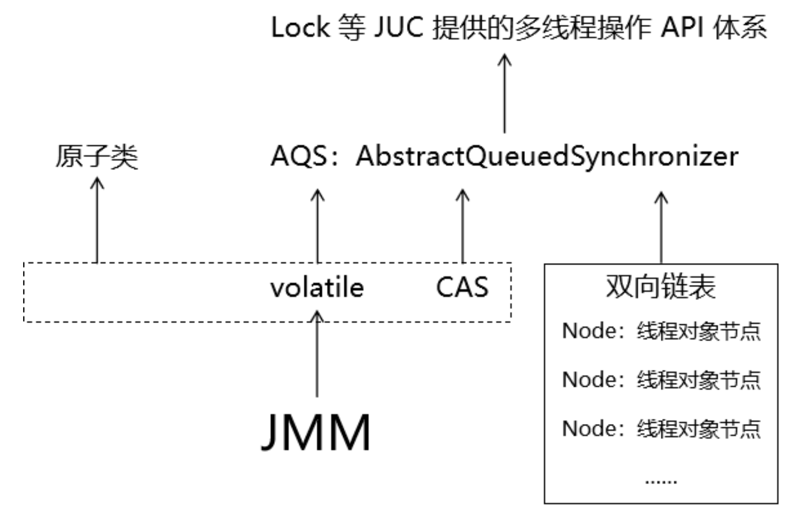

#### 名词解释

JMM 是 **Java Memory Model** 的缩写，意思是：Java 内存模型。

#### 产生背景

**高速缓存：**

现代计算机 CPU 的运算处理能力比内存 I/O 读写能力高几个数量级。如果让 CPU 对内存进行等待那将是对 CPU 资源的巨大浪费。可是如果将内存换成能够满足 CPU 需求的存储介质造价会高到无法承受。

为了让二者能力匹配、协调工作，在 CPU 和内存之间再添加一层高速缓存（具体硬件系统中可能是三级缓存，这里不深究），就可以让 CPU 从高速缓存读取和保存数据，数据修改后再从高速缓存同步回内存。

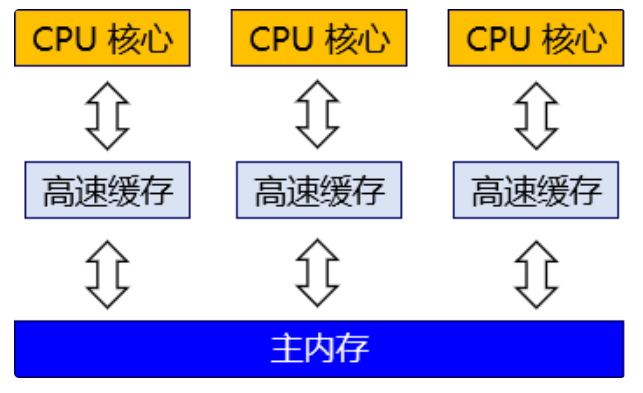

**缓存一致性协议：**

但是从上图我们很容易能发现问题：多个不同 CPU 核心都从主内存读取了同一个数据，又做了不同修改。那么同步会主内存的时候以哪个修改为准呢？这个问题有一个专门的名字：缓存一致性（Cache Coherence）。为了解决一致性的问题，需要各个处理器访问缓存时都要遵循一些协议，在读写时要根据协议来进行操作，这类协议有MSI、MESI（Illinois Protocol）、MOSI、Synapse、Firefly及Dragon Protocol等。

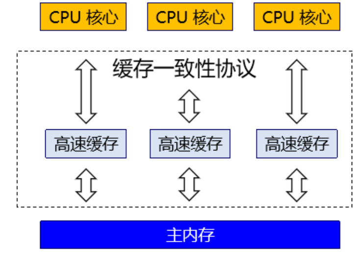

#### Java内存模型

**基本概念：**

对 Java 程序来说同样存在上面的问题。曾经同样的 Java 代码在不同的硬件平台上运行会出现计算结果不一致的情况。这就和不同硬件系统使用不同方式应对缓存不一致问题有关。

为了屏蔽系统和硬件的差异，让一套代码在不同平台下能到达相同的访问结果。JMM 从 Java 5 开始的 JSR-133 发布后，已经成熟和完善起来。

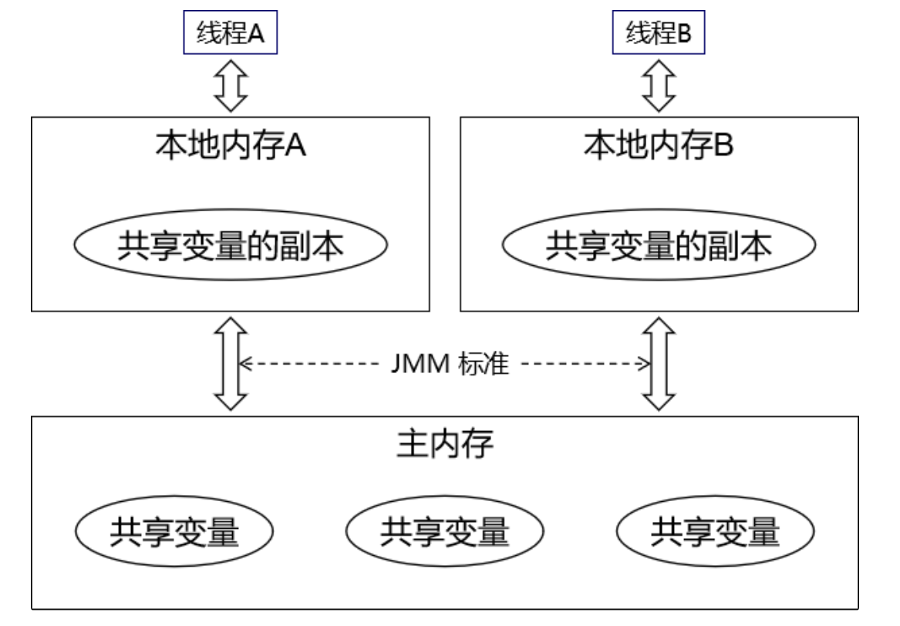

- 线程执行计算操作，其实是针对本地内存（也叫工作内存）里的数据来操作的。
- 本地内存中的数据是从主内存中读取进来的。
- 线程在本地内存修改了数据之后，需要写回主内存。
- 各个线程自己的本地内存都是自己私有的，任何线程都不能读写其它线程的本地内存。
- 多线程共同修改同一个数据时，本质上都是需要借助主内存来完成。

**主内存：**

主内存是各线程共享的内存区域。而JVM的内存结构中**<u>堆内存</u>**也是线程共享的。

**本地内存：**

本地内存（也叫工作内存）是各线程私有的内存区域。而JVM的内存结构中栈内存是线程私有的。所以 JVM 内存结构和 JMM 内存模型既有关联有不完全等同。

**作用：**

Java 内存模型（JMM）设计出来就是为了解决缓存一致性问题的，拆解开来说，缓存一致性涉及到三个具体问题：

- 原子性
- 可见性
- 有序性

### 5.1.2 原子性

#### 原子性概念

**内部视角：**

如果一个操作是不可分割的，那么我们就可以说这个操作是原子操作。比如：

- a = 0; （a 非 long、非 double 类型） 这个操作不可分割，所以是原子操作。
- a ++; 这个操作的本质是 a = a + 1 两步操作，可以分割，所以不是原子操作。

非原子操作都会存在线程安全问题，需要使用同步技术（sychronized）或者锁（Lock）来让它变成一个原子操作。一个操作是原子操作，那么我们称它具有原子性。Java 的 concurrent 包下提供了一些原子类，比如：`AtomicInteger`、`AtomicLong`、`AtomicReference` 等——它们也是原子性操作的一种体现。

**外部视角：**

在 JMM 模型框架下，两个线程各自修改一个共享变量采用的办法是：各自读取到自己的本地内存中，执行计算，然后 flush 回主内存。这就很可能会发生后面操作把前面操作的结果覆盖的问题。这种情况下最终的计算结果肯定是错的。

这样的问题同样需要使用同步机制（synchronized 或 Lock）将修改共享内存中数据的操作封装为原子操作：前面操作完，后面再操作；保证后面的操作在前面操作结果的基础上进行计算。

封装后内部操作仍然是多个，不能说是不可分割的，但是它们作为一个整体不会被多个线程交替执行。

所以从外部视角、宏观视角来说，原子性的含义是：一段代码在逻辑上可以看做一个整体，多个线程执行这段代码不是交替执行。

### 5.1.3 可见性

#### 示例代码

每个线程操作自己的本地内存，对其他线程是不可见的。看下面代码：

```java
public class Demo15CanSeeTest {

    private int data = 100;

    public int getData() {
        return data;
    }

    public void setData(int data) {
        this.data = data;
    }

    public static void main(String[] args) {

        Demo15CanSeeTest demo = new Demo15CanSeeTest();

        new Thread(()->{

            while (demo.getData() == 100) {}

            System.out.println("AAA 线程发现 data 新值：" + demo.getData());

        }, "AAA").start();

        new Thread(()->{

            try {
                TimeUnit.SECONDS.sleep(1);} catch (InterruptedException e) {}

            demo.setData(200);

            System.out.println("BBB 线程修改 data，新值是：" + demo.getData());

        }, "BBB").start();

    }

}
```

可以看到，程序一直在运行着没有停止。这是因为 `while (demo.getData() == 100)` 循环条件始终成立。证明 AAA 线程看到的 data 值始终是旧值。

### 5.1.4 有序性

#### 指令重排序

CPU 执行程序指令和 JVM 编译源程序之后，都会对指令做一定的重排序，目的是提高部分代码执行的效率。原则是重新排序后代码执行的结果和不重排执行的结果必须预期的一样。所以我们从开发的层面上完全感受不到。

#### 有序性概念

从宏观和表面层次来看，我们感觉不到指令重排的存在，指令重排都是系统内部做的优化。保证无论是否指令重排，程序运行的结果都和预期一样，就是有序性。


## 5.2 `volatile`关键词

### 5.2.1 原子性角度分析

被 volatile 关键字修饰的变量是否满足原子性其实并不是由 volatile 本身来决定，而是和变量自身的数据类型有关。**volatile 关键字不提供原子性保证。**

### 5.2.2 可见性角度分析

volatile 写的内存语义：当写一个 volatile 变量时，JMM 会把该线程对应的本地内存中的变量值 flush 到主内存。

volatile 读的内存语义：当读一个 volatile 变量时，JMM 会把该线程对应的本地内存置为无效。线程接下来将从主内存中读取共享变量。

**所以 volatile 关键字是能够保证可见性的。**

#### 测试

```java
public class Demo15CanSeeTest {

    private volatile int data = 100;

    public int getData() {
        return data;
    }

    public void setData(int data) {
        this.data = data;
    }

    public static void main(String[] args) {

        Demo15CanSeeTest demo = new Demo15CanSeeTest();

        new Thread(()->{

            while (demo.getData() == 100) {}

            System.out.println("AAA 线程发现 data 新值：" + demo.getData());

        }, "AAA").start();

        new Thread(()->{

            try {
                TimeUnit.SECONDS.sleep(5);} catch (InterruptedException e) {}

            demo.setData(200);

            System.out.println("BBB 线程修改 data，新值是：" + demo.getData());

        }, "BBB").start();

    }

}
```

### 5.2.3 有序性角度分析

volatile确实是一个为数不多的能够从编码层面影响指令重排序的关键字。因为它可以在底层指令中添加 **<u>内存屏障</u>** 。

> 所谓内存屏障，就是一种特殊的指令。底层指令中加入内存屏障，会禁止一定范围内指令的重排。

#### volatile写

在每个 volatile 写操作的前面插入一个 StoreStore 屏障。在每个 volatile 写操作的后面插入一个 StoreLoad 屏障。

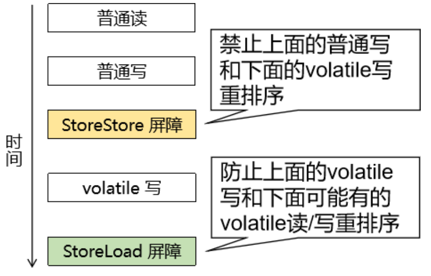

#### volatile读

在每个 volatile 读操作的后面插入一个 LoadLoad 屏障和一个 LoadStore 屏障。

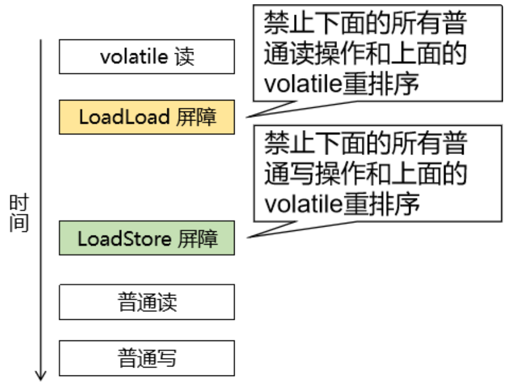

#### 小结

| JMM特性    | volatile能力 |
| ---------- | ------------ |
| 原子性     | 无           |
| **可见性** | **有**       |
| 有序性     | 有           |

### 5.2.4 补充

**volatile关键词只能修饰成员变量**


## 5.3 CAS机制

### 5.3.1 名词解释

CAS：**Compare And Swap** 比较并交换。

### 5.3.2 工作机制

#### Unsafe类

**引入：**

原子类 `AtomicInteger` 中就大量用到了 CAS 机制，`compareAndSet(int expect, int update);` 方法就是其中的典型代表。

```Java
    public final boolean compareAndSet(int expect, int update) {
        return unsafe.compareAndSwapInt(this, valueOffset, expect, update);
    }
```

从源码中我们可以看出，`compareAndSet(int expect, int update);` 方法里面其实是调用了 Unsafe 类的 c`ompareAndSwapInt()` 方法。

`Unsafe.compareAndSwapInt()` 方法的源码如下：

```Java
public final native boolean compareAndSwapInt(Object var1, long var2, int var4, int var5);
```

**介绍：**

C/C++ 代码可以直接操作内存空间。而 Java 程序屏蔽了对内存空间的直接访问，简化了代码复杂度，提高了安全性。但是凡事都有例外，Unsafe 类在一定程度上可以看作是一个可以用来操作内存空间的 Java 类。

正是因为使用 Unsafe 类可以直接操作内存，所以它的名字叫 Unsafe，也就是『危险』的意思——常规业务功能的开发中不能直接操作内存，这是非常危险的操作。

所以这里的 Unsafe 并不是指线程不安全。我们这里关注的是它提供的 CAS 方法。

#### 举例说明

**内存初始状态：**

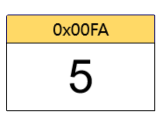

**尝试修改成功：**

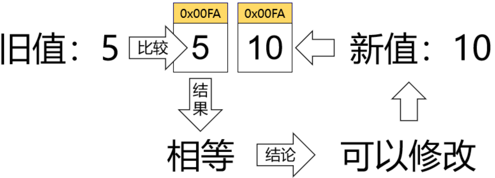

**尝试修改失败：**

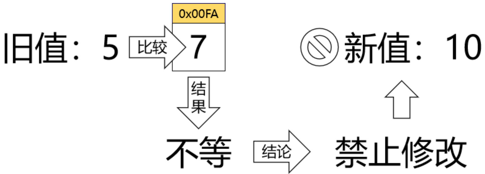

**自旋：**

> CAS本身并不包含自旋操作，而是经常配合自旋来实现功能。

修改被禁止，但操作不会结束。CAS 机制会引导修改者读取当前内存值，然后再次尝试修改。

注意：读取内存值之后的第二次尝试修改也不一定修改成功。自旋可能会执行多次。

#### 配合volatile

思考一个问题：我们前面提到的内存空间是工作内存还是主内存呢？很明显，应该是主内存。如果是在工作内存中一个线程内部自己和自己玩也就没必要整这些了，所以这里的内存空间指的是主内存。

但是每个线程修改数据又都是在工作内存完成的，修改完成执行 store 指令才会同步到主内存，执行 write 指令才会设置到对应变量中。

所以 CAS 操作通常都会配合 volatile 关键字：将需要通过CAS方式来修改的变量使用 volatile 修饰，实现可见性效果。

这一点我们看 AtomicInteger 类就可以发现：

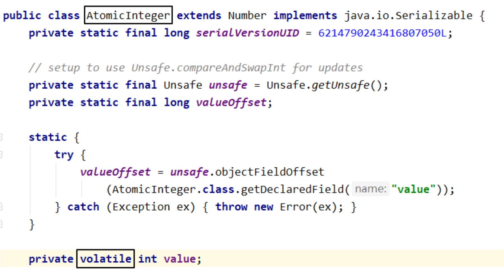

所以AtomicInteger等原子类可以看成是CAS机制配合volatile实现**非阻塞同步**的经典案例——程序运行的效果和加了同步锁一样，但是底层并没有阻塞线程。

### 5.3.3 非阻塞同步

前面我们比较过`AtomicInteger`和`synchronized`两种方案实现原子性操作的性能差距，`AtomicInteger`方式对比`synchronized`方式性能优势非常明显。

那`AtomicInteger`是如何做到既保证原子性（同步），又能够达到非常高的效率呢？

原因是：

- 使用 CAS 机制修改数据不需要对代码块加同步锁，各线程通过自旋的方式不断尝试修改，线程不会被阻塞。
- 配合 volatile 关键字使各个线程直接操作主内存避免了数据不一致。

所以 CAS 配合 volatile 不需要阻塞线程就能够实现同步效果，性能自然就会比 synchronized 更好。我们把这种机制称为：非阻塞同步。

当然，这种机制也并不能完全取代同步锁。因为 CAS 针对的是内存中的一个具体数据，无法对一段代码实现同步效果。

### 5.3.4 ABA问题

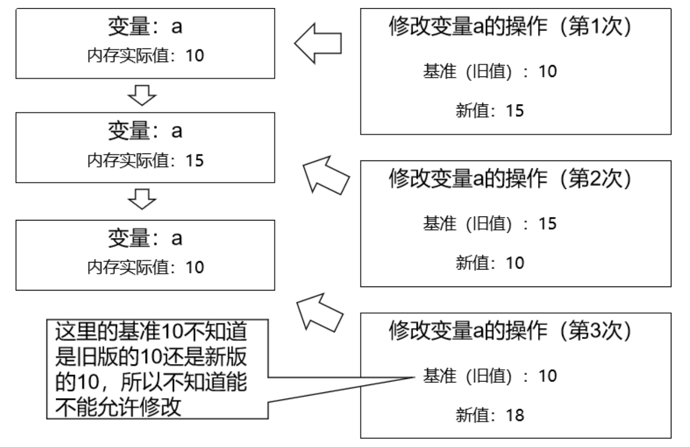

ABA 问题本质：一个原本不允许的操作，因为数据发生了变化，又允许操作了。但是 ABA 问题虽然存在，但如果只修改一个值在简单计算的场景下应该是没有问题的。当然如果确实涉及到复杂的业务逻辑还是要注意一下。

### 5.3.5 CAS和乐观锁

CAS 机制可以看做是乐观锁理念的一种具体实现。但是又不完整。因为乐观锁的具体实现通常是需要维护版本号的，但是 CAS 机制中并不包含版本号——如果有版本号辅助就不会有 ABA 问题了。

## 5.4 AQS

### 5.4.1 AQS简介

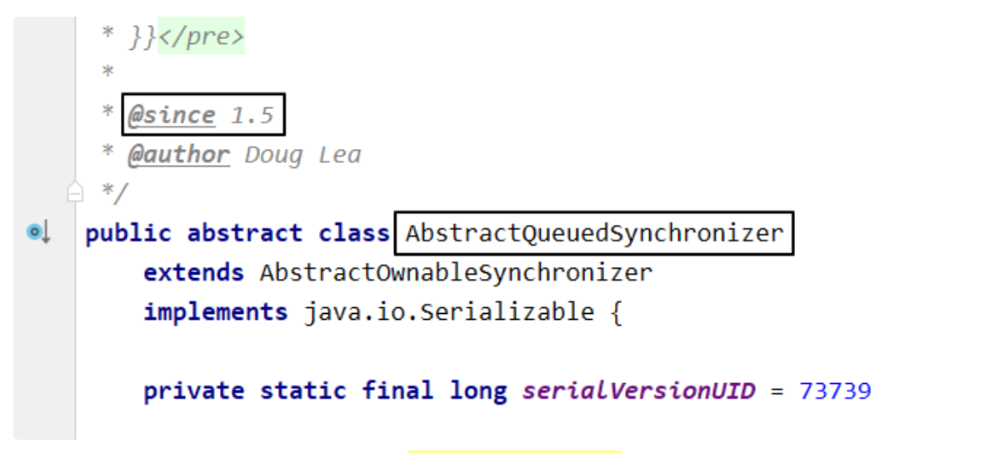

根据类的名字 `AbstractQueuedSynchronizer` 我们姑且可以翻译为：**抽象的队列式同步器**。AQS 定义了一套多线程访问共享资源的同步器框架，许多同步类实现都依赖于它。

它维护了一个 `volatile int state`（代表共享资源）和一个 FIFO 线程等待队列（多线程争用资源被阻塞时会进入此队列）。这里 volatile 是核心关键词。state 的访问方式有三种：

- `getState()`
- `setState()`
- `compareAndSetState()`

AQS定义两种资源共享方式：

- `Exclusive`（独占，只有一个线程能执行）
- `Share`（共享，多个线程可同时执行）

### 5.4.2 AQS核心方法介绍

不同的自定义同步器争用共享资源的方式也不同。自定义同步器在实现时只需要实现共享资源 state 的获取与释放方式即可，至于具体线程等待队列的维护（如获取资源失败入队/唤醒出队等），AQS已经在顶层实现好了。自定义同步器实现时主要实现以下几种方法：

| 方法名                        | 说明                                                         |
| ----------------------------- | ------------------------------------------------------------ |
| boolean isHeldExclusively()   | 该线程是否正在独占资源。只有用到 condition 才需要去重写它。  |
| boolean tryAcquire(int)       | 尝试以独占方式获取资源，成功则返回true，失败则返回false。  <br>int 类型的参数是用来累加 state 的 |
| boolean tryRelease(int)       | 尝试以独占方式释放资源，成功则返回true，失败则返回false。  <br>int 类型的参数是用来从 state 中减去的 |
| int tryAcquireShared(int)     | 尝试以共享方式获取资源。  <br>返回负数：获取失败  <br>返回正数：获取成功且有剩余资源  <br>返回0：获取成功但没有剩余资源 |
| boolean tryReleaseShared(int) | 尝试以共享方式释放资源，  <br>如果释放后允许唤醒后续等待结点返回 true，否则返回 false。 |

