# 7 线程池

## 7.1 阻塞队列

阻塞队列是线程池的**核心组件**，了解阻塞队列为学习线程池打好基础。

### 7.1.1 概念

`BlockingQueue`即阻塞队列，是`java.util.concurrent`下的一个接口，因此不难理解，`BlockingQueue`是为了解决多线程中数据高效安全传输而提出的。从阻塞这个词可以看出，在某些情况下对阻塞队列的访问可能会造成阻塞。被阻塞的情况主要有如下两种：

- 当队列满了的时候进行入队列操作；
- 当队列空了的时候进行出队列操作；

阻塞队列主要用在生产者/消费者的场景，下面这幅图展示了一个线程生产、一个线程消费的场景：

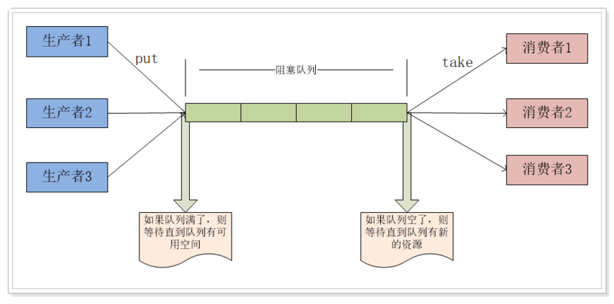

为什么需要`BlockingQueue`？好处是我们不需要关心什么时候需要阻塞线程，什么时候需要唤醒线程，因为这一切`BlockingQueue`都给你一手包办了。在concurrent包发布以前，在多线程环境下，我们每个程序员都必须去自己控制这些细节，尤其还要兼顾效率和线程安全，而这会给我们的程序带来不小的复杂度。

### 7.1.2 `BlockingQueue`接口

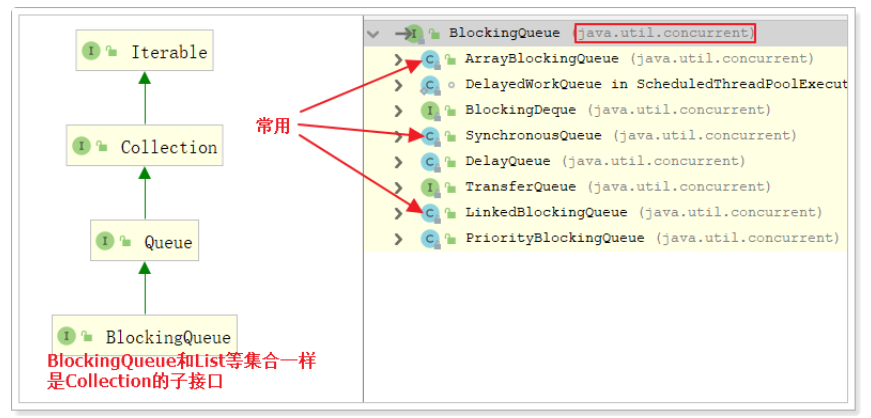

BlockingQueue接口主要有以下7个实现类：

- `ArrayBlockingQueue`：由数组结构组成的有界阻塞队列。
- `LinkedBlockingQueue`：由链表结构组成的有界（但大小默认值为 Integer.MAX_VALUE ）阻塞队列。
- `PriorityBlockingQueue`：支持优先级排序的无界阻塞队列。
- `DelayQueue`：使用优先级队列实现的延迟无界阻塞队列。
- `SynchronousQueue`：不存储元素的阻塞队列，也即单个元素的队列。
- `LinkedTransferQueue`：由链表组成的无界阻塞队列。
- `LinkedBlockingDeque`：由链表组成的双向阻塞队列。

#### 接口方法

|      | 抛出异常  | 特定值   | 阻塞   | 超时               |
| ---- | --------- | -------- | ------ | ------------------ |
| 插入 | add(e)    | offer(e) | put(e) | offer(e,tiem,unit) |
| 移除 | remove()  | poll()   | take() | poll(time,unit)    |
| 检查 | element() | peek()   | 不可用 | 不可用             |

#### 详细说明

| 方法               | 成功                                     | 失败                                                         |
| ------------------ | ---------------------------------------- | ------------------------------------------------------------ |
| add(e)             | 正常执行返回true                         | 当阻塞队列满时，再往队列里add插入元素会抛`legalStateException:Queue full` |
| remove()           | 返回阻塞队列中的第一个元素并删除这个元素 | 当阻塞队列空时：再往队列里remove()移除元素会抛`NoSuchElementException` |
| element()          | 返回阻塞队列中的第一个元素               | 当阻塞队列空时：再调用element()检查元素会抛出`NoSuchElementException` |
| offer(e)           | true                                     | false                                                        |
| poll()             | 队列中有元素：返回删除的元素             | 队列中无元素：返回null                                       |
| peek()             | 队列中有元素：返回队列中的第一个元素     | 队列中无元素：返回null                                       |
| put(e)             | 队列未满：添加成功                       | 队列已满：线程阻塞等待，直到能够添加为止                     |
| take()             | 队列非空：获取队列中的第一个元素         | 队列为空：线程阻塞等待，直到队列非空时获取第一个元素         |
| offer(e,time,unit) | true                                     | 如果试图执行的操作无法立即执行，该方法调用将会发生阻塞，直到能够执行，但等待时间不会超过给定值。 返回true或false以告知该操作是否成功 |
| poll(time,unit)    |                                          | 如果试图执行的操作无法立即执行，该方法调用将会发生阻塞，直到能够执行，但等待时间不会超过给定值。 |

## 7.2 概念与架构

### 7.2.1 基本概念

线程池的优势：线程池做的工作主要是控制运行的线程数量，处理过程中将任务放入队列，然后在线程创建后启动这些任务，如果线程数量达到了最大数量，超出数量的线程排队等候，等其他线程执行完毕，再从队列中取出任务来执行。 它的主要特点为：**<u>线程复用；控制最大并发数；管理线程</u>**。

- 降低资源消耗。通过重复利用已创建的线程降低线程创建和销毁造成的销耗；
- 提高响应速度。当任务到达时，任务可以不需要等待线程创建就能立即执行；
- 提高线程的可管理性。线程是稀缺资源，如果无限制的创建，不仅会销耗系统资源，还会降低系统的稳定性，使用线程池可以进行统一的分配，调优和监控；

### 7.2.2 API体系说明

Java中的线程池是通过`Executor`框架实现的，该框架中用到了`Executor`，`ExecutorService`，`ThreadPoolExecutor`这几个类。

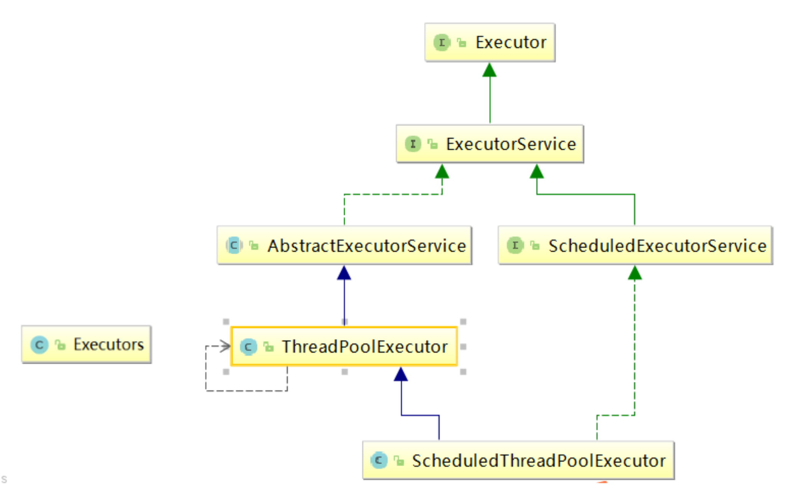`Executor` 接口是顶层接口，只有一个 `execute()` 方法，过于简单。通常不使用它，而是使用 `ExecutorService` 接口：

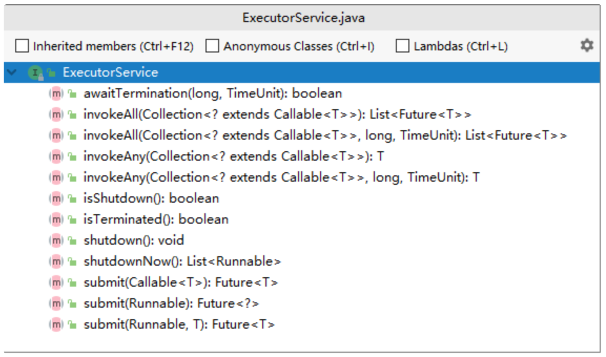

## 7.3 创建线程池

### 7.3.1 创建线程池

在 JDK 原生 API 中可以使用 `Executors` 工具类创建线程池对象。

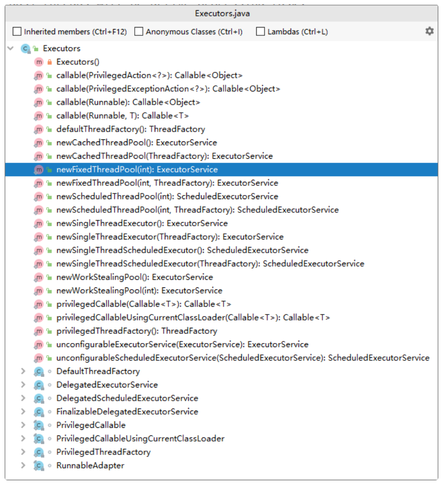

#### `newCachedThreadPool()`

执行很多短期异步任务，线程池根据需要创建多线程。并在先前创建的线程可用时将重用它们。可扩容，遇强则强。

#### `newFixedThreadPool(int nThreads)`

执行长期任务性能好，创建一个线程池，一池有N个固定的线程。

#### `newSingleThreadExecutor()`

一个任务一个任务的执行，一池一线程。

### 7.3.2 底层原理

上述案例中的三个方法的本质都是`ThreadPoolExecutor`的实例化对象，只是具体参数值不同。

```java
    public static ExecutorService newCachedThreadPool() {
        return new ThreadPoolExecutor(0, Integer.MAX_VALUE,
                                      60L, TimeUnit.SECONDS,
                                      new SynchronousQueue<Runnable>());
    }
    public static ExecutorService newFixedThreadPool(int nThreads) {
        return new ThreadPoolExecutor(nThreads, nThreads,
                                      0L, TimeUnit.MILLISECONDS,
                                      new LinkedBlockingQueue<Runnable>());
    }
    public static ExecutorService newSingleThreadExecutor() {
        return new FinalizableDelegatedExecutorService
            (new ThreadPoolExecutor(1, 1,
                                    0L, TimeUnit.MILLISECONDS,
                                    new LinkedBlockingQueue<Runnable>()));
    }
```

### 7.3.3 注意

使用 Executors 工具类创建的线程池参数设置**非常不合理**，实际开发时通常需要自己创建 `ThreadPoolExecutor` 的对象，自己指定参数。

## 7.4 七个重要参数

### 7.4.1 构造器源码

`ThreadPoolExecutor` 类的构造器有四个，其中三个都是调用这个 7 个参数的构造器。

```java
    public ThreadPoolExecutor(int corePoolSize,
                              int maximumPoolSize,
                              long keepAliveTime,
                              TimeUnit unit,
                              BlockingQueue<Runnable> workQueue,
                              ThreadFactory threadFactory,
                              RejectedExecutionHandler handler) {
        if (corePoolSize < 0 ||
            maximumPoolSize <= 0 ||
            maximumPoolSize < corePoolSize ||
            keepAliveTime < 0)
            throw new IllegalArgumentException();
        if (workQueue == null || threadFactory == null || handler == null)
            throw new NullPointerException();
        this.acc = System.getSecurityManager() == null ?
                null :
                AccessController.getContext();
        this.corePoolSize = corePoolSize;
        this.maximumPoolSize = maximumPoolSize;
        this.workQueue = workQueue;
        this.keepAliveTime = unit.toNanos(keepAliveTime);
        this.threadFactory = threadFactory;
        this.handler = handler;
    }
```

### 7.4.2 七个参数含义

- `corePoolSize`：线程池中的常驻核心线程数；
- `maximumPoolSize`：线程池中能够容纳同时执行的最大线程数，此值必须大于等于1；
- `keepAliveTime`：多余的空闲线程的存活时间。当前池中线程数量超过 `corePoolSize` 时，当空闲时间达到 `keepAliveTime` 的线程会被销毁，直到剩余线程数量等于 `corePoolSize`；
- `unit`：`keepAliveTime` 的时间单位；
- `workQueue`：任务队列，被提交但尚未被执行的任务；
- `threadFactory`：表示生成线程池中工作线程的工厂， 用于创建线程，一般默认的即可；
- `handler`：拒绝策略处理器。当任务队列已满，工作线程也达到了 `maximumPoolSize`，新增的工作任务将按照某个既定的拒绝策略被拒绝执行；

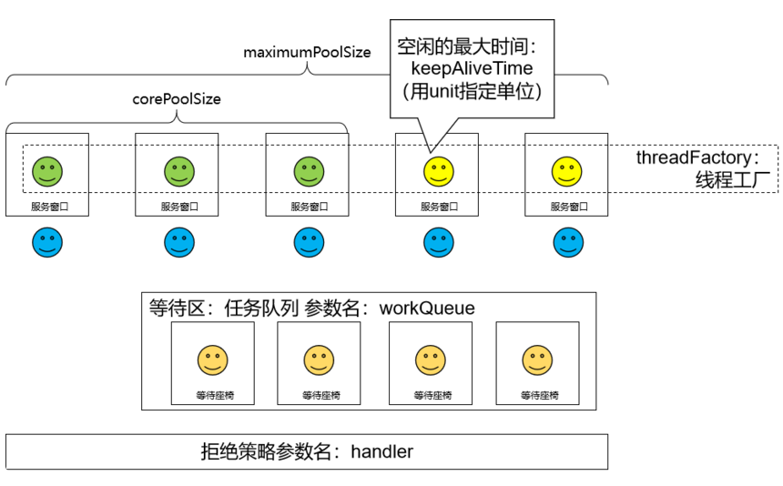

## 7.5 底层原理

刚创建线程池时，线程池中的**线程数为零**；

当调用`execute()`方法添加一个请求任务时，线程池会做出如下判断：
- 如果正在运行的线程数量小于`corePoolSize`，那么马上创建线程运行这个任务；

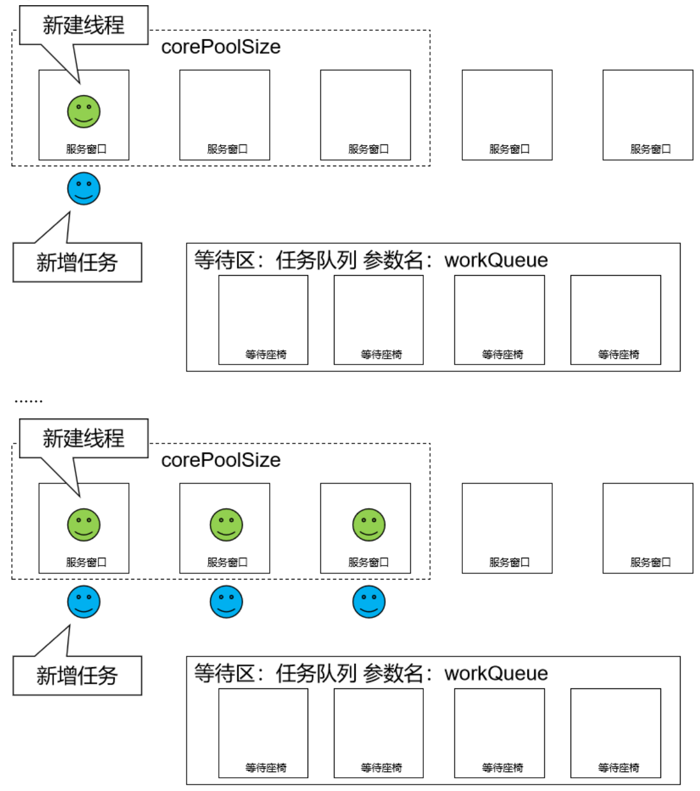

- 如果正在运行的线程数量大于或等于`corePoolSize`，那么将这个任务**<u>放入队列</u>**；

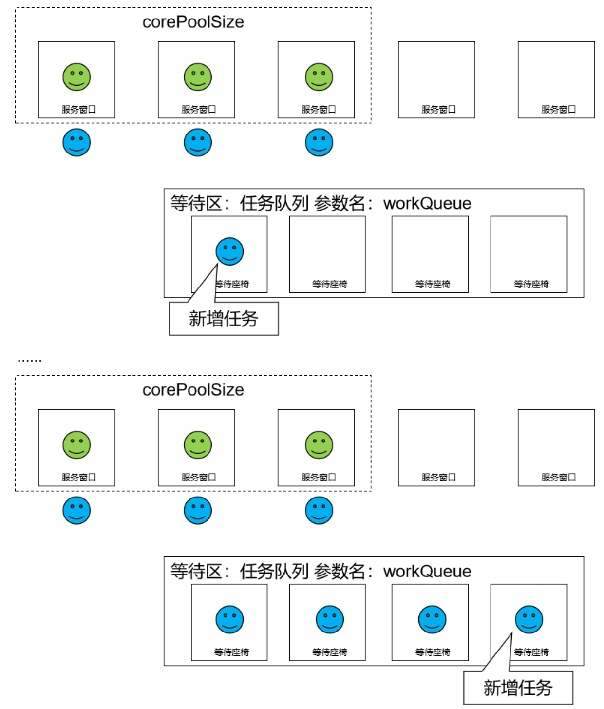

- 如果这个时候队列满了且正在运行的线程数量还小于`maximumPoolSize`，那么还是要**创建非核心线程立刻==运行这个新增的任务而不是等待时间最长的任务==；**

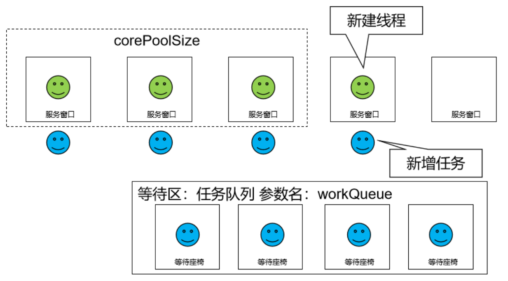

- 如果队列满了且正在运行的线程数量大于或等于`maximumPoolSize`，那么线程池会启动饱和拒绝策略来执行。

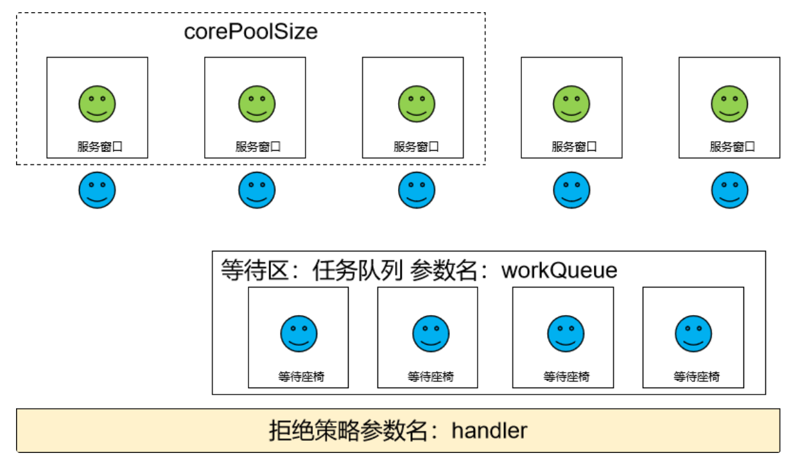

- 当一个线程完成任务时，它会从队列中取下一个任务来执行。

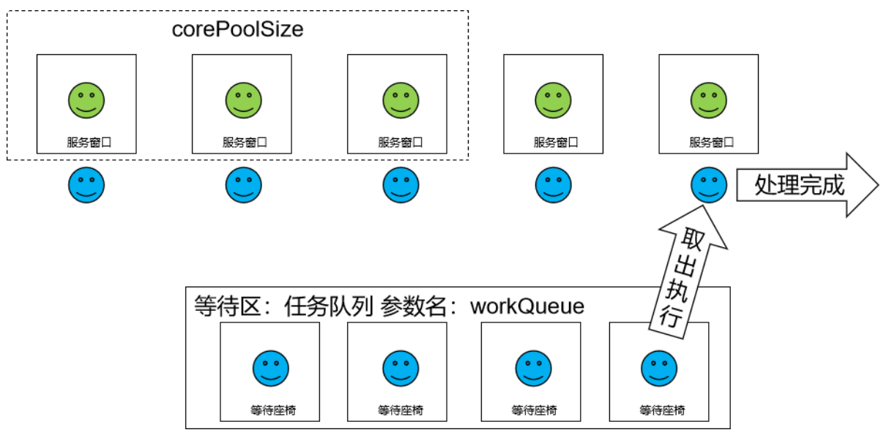

- 当一个线程空闲的时间超过`keepAliveTime`时，线程池会判断：
  - 当前运行线程数大于`corePoolSize`：空闲时间超时线程会被停掉

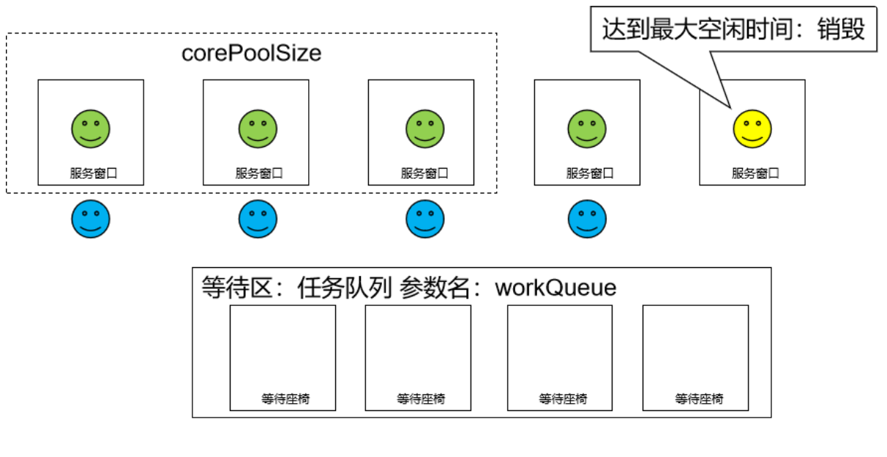

- 当前运行线程数小于等于`corePoolSize`：无动作（所以线程池的所有任务完成后，它最终会收缩到`corePoolSize`的大小。）

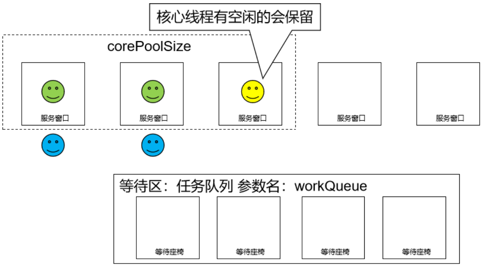

## 7.6 拒绝策略

一般我们创建线程池时，为防止资源被耗尽，任务队列都会选择创建有界任务队列，但这种模式下如果出现任务队列已满且线程池创建的线程数达到你设置的最大线程数时，这时就需要你指定ThreadPoolExecutor的RejectedExecutionHandler参数即合理的拒绝策略，来处理线程池“超载”的情况。

ThreadPoolExecutor自带的拒绝策略如下：

- AbortPolicy(默认)：直接抛出RejectedExecutionException异常，阻止接收新的任务。
- CallerRunsPolicy：“调用者运行”一种调节机制，该策略既不会抛弃任务，也不会抛出异常，而是将某些任务回退到调用者，从而降低新任务的流量。
- DiscardOldestPolicy：抛弃队列中等待最久的任务，然后把当前任务加入队列中尝试再次提交当前任务。
- DiscardPolicy：该策略默默地丢弃无法处理的任务，不予任何处理也不抛出异常。如果允许任务丢失，这是最好的一种策略。

以上内置的策略均实现了`RejectedExecutionHandler`接口，也可以自己扩展`RejectedExecutionHandler`接口，定义自己的拒绝策略。

## 7.7 自定义线程池

在《阿里巴巴Java开发手册》中指出了线程资源必须通过线程池提供，不允许在应用中自行显式的创建线程，这样一方面是线程的创建更加规范，可以合理控制开辟线程的数量；另一方面线程的细节管理交给线程池处理，优化了资源的开销。同时线程池不允许使用 `Executors` 去创建，而要通过 `ThreadPoolExecutor` 方式，这一方面是由于JDK 中 Executor 框架虽然提供了如 `newFixedThreadPool()`、`newSingleThreadExecutor()`、`newCachedThreadPool()` 等创建线程池的方法，但都有其局限性，不够灵活；使用 `ThreadPoolExecutor` 有助于大家明确线程池的运行规则，创建符合自己的业务场景需要的线程池，避免资源耗尽的风险。

本质上，自定义线程池同样是通过指定7个必要参数，创建`ThreadPoolExecutor`对象：

```java
public class ThreadPoolDemo {

    public static void main(String[] args) {

        // 自定义连接池
        ExecutorService threadPool = new ThreadPoolExecutor(2, 5,
                2, TimeUnit.SECONDS, new ArrayBlockingQueue<>(3),
                Executors.defaultThreadFactory(),
                //new ThreadPoolExecutor.AbortPolicy()
                //new ThreadPoolExecutor.CallerRunsPolicy()
                //new ThreadPoolExecutor.DiscardOldestPolicy()
                //new ThreadPoolExecutor.DiscardPolicy()
                new RejectedExecutionHandler() {
                    @Override
                    public void rejectedExecution(Runnable r, ThreadPoolExecutor executor) {
                        System.out.println("自定义拒绝策略");
                    }
                }
        );

        try {
            for (int i = 0; i < 9; i++) {
                threadPool.execute(() -> {
                    System.out.println(Thread.currentThread().getName() + "执行了业务逻辑");
                });
            }
        } catch (Exception e) {
            e.printStackTrace();
        } finally {
            threadPool.shutdown();
        }
    }
}
```

