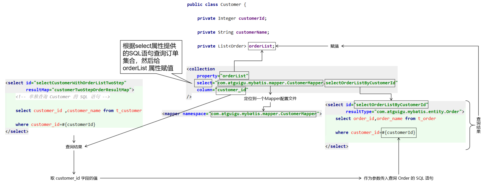

# Mybatis

**@author: Shuxin_Wang**

**@time: 2023.03.31**

---

[toc]

---

# 1 前言

## 1.1 总体技术体系

### 1.1.1 单一架构

一个项目，一个工程，导出为一个war包，在一个Tomcat上运行。也叫all in one。


### 1.1.2 分布式架构

一个项目（对应IDEA中的一个project），拆分成很多个模块，每个模块是一个IDEA中的一个module。每一个工程都是运行在自己的Tomcat上。模块之间可以互相调用。每一个模块内部可以看成是一个单一架构的应用。


## 1.2 框架的概念

框架 = jar包 + 配置文件


## 1.3 Mybatis历史

`MyBatis`最初是Apache的一个开源项目`iBatis`, 2010年6月这个项目由Apache Software Foundation迁移到了Google Code。随着开发团队转投Google Code旗下， `iBatis3.x`正式更名为`MyBatis`。代码于2013年11月迁移到Github；

`iBatis`一词来源于“`internet`”和“`abatis`”的组合，是一个基于Java的持久层框架。 `iBatis`提供的持久层框架包括SQL Maps和Data Access Objects（DAO）；

`Mybatis`的最大特点：轻量级。相对于Hibernate省略了大量不常用的功能，整体轻巧又高效；

## 1.4 Mybatis特性

- MyBatis支持定制化SQL、存储过程以及高级映射；
- MyBatis避免了几乎所有的JDBC代码和手动设置参数以及结果集解析操作；
- MyBatis可以使用简单的XML或注解实现配置和原始映射；将接口和Java的POJO（Plain Ordinary Java Object，普通的Java对象）映射成数据库中的记录；
- Mybatis是一个半自动的ORM（Object Relation Mapping）框架；

## 1.5 和其他持久化层技术对比

- JDBC
    - SQL 夹杂在Java代码中耦合度高，导致硬编码内伤；
    - 维护不易且实际开发需求中 SQL 有变化，频繁修改的情况多见；
    - 代码冗长，开发效率低；
- Hibernate 和 JPA
    - 操作简便，开发效率高；
    - 程序中的长难复杂SQL需要绕过框架；
    - 内部自动生成的SQL，不容易做特殊优化；
    - 基于全映射的全自动框架，大量字段的 POJO 进行部分映射时比较困难；
    - 反射操作太多，导致数据库性能下降；
- MyBatis
    - 轻量级，性能出色；
    - SQL 和 Java 编码分开，功能边界清晰。Java代码专注业务、SQL语句专注数据；
    - 开发效率稍逊于 HIbernate，但是完全能够接收；

开发效率：`Hibernate > Mybatis > JDBC`；

运行效率：`JDBC > Mybatis > Hibernate`；


# 2 日志框架

## 2.1 用日志打印代替sout

### 2.1.1 sout的问题

#### I/O影响性能

`System.out`对象是一个输出流对象，所以控制台输出信息本质上是I/O操作。而I/O操作是项目运行过程中两大性能瓶颈之一。

#### 无法统一管理

项目上线时，希望把所有（或一部分）`sout`打印关闭，但是只能手动一个一个查找，耗费开发人员的极大精力，因为`sout`的无度使用会使它分散在项目的各个角落。

### 2.1.2 使用好处

#### 设定级别，统一管理

日志框架会按照事件的严重程度来划分级别，例如：

- 错误（Error）：表示程序运行出错，比如抛异常等情况；
- 警告（Warning）：表示程序运行过程中有潜在风险，但此时并没有报错；
- 信息（Info）：表示程序运行过程中完成了一个关键动作，需要以程序运行信息的形式告知开发者；
- 调试（Debug）：表示程序运行过程中更加细致的信息，协助程序员调试程序；

通过在配置文件中指定某一个日志级别来控制系统要打印的内容。日志框架会打印**当前指定级别**的日志和比当前指定级别**更严重**的级别的日志。

例如在开发阶段，我们指定debug级别，项目上线修改成info级别，那么所有debug级别的日志就都不打印了，不需要到项目代码中一个一个修改，非常方便。

#### 灵活指定输出位置

使用日志框架不一定是打印到控制台，也可以保存到文件中或者保存到数据库。这就看具体的项目维护需求。

#### 自定义日志格式

打印日志数据可以使用日志框架的默认格式，也可以根据需要定制。

#### 基于日志分析问题

将来我们开发的应用系统中，不仅包含Java代码，还有很多中间件服务器。任何子系统出现故障我们都是通过日志来定位问题、分析故障原因。甚至更复杂的系统还会专门开发日志子系统，在主系统出现问题时抓取日志数据供维护人员参考。

而日志数据必须要有确定格式才便于格式化和抓取，这肯定不是随意写sout就能实现的。


## 2.2 Java日志体系的演变

### 2.2.1 门面

门面：类似于标准层、接口层

| 名称                                    | 说明                 |
| --------------------------------------- | -------------------- |
| JCL（Jakarta Commons Logging）          | 陈旧                 |
| SLF4J（Simple Logging Facade for Java） | 适合（**同一作者**） |
| jboss-logging                           | 特殊专业领域使用     |

### 2.2.2 实现

| 名称                     | 说明                                               |
| ------------------------ | -------------------------------------------------- |
| log4j                    | 最初版（**同一作者**）                             |
| JUL（java.util.logging） | JDK自带                                            |
| log4j2                   | Apache收购log4j后全面重构，内部实现和log4j完全不同 |
| logback                  | 优雅、强大（**同一作者**）                         |

### 2.2.3 最佳搭档

- 门面：`SLF4J`

- 实现：`logback`

### 2.2.4 用法

#### 导入依赖

```xml
<dependency>
  <groupId>ch.qos.logback</groupId>
  <artifactId>logback-classic</artifactId>
  <version>1.4.6</version>
  <scope>compile</scope>
</dependency>
```

#### 代码测试

```java
import org.junit.Test;
import org.slf4j.Logger;
import org.slf4j.LoggerFactory;

public class LogTest {
    private final Logger logger = LoggerFactory.getLogger(LogTest.class);

    @Test
    public void testLog(){
        logger.trace("hello trace");
        logger.debug("hello, debug");
        logger.info("hello info");
        logger.warn("hello warn");
        logger.error("hello error");
    }
}
```

#### 引入配置文件

`Logback`要求配置文件名称必须是`logback.xml`，存放路径在`main/resources`目录下。

配置文件示例如下：

```xml
<?xml version="1.0" encoding="UTF-8"?>
<configuration debug="true">
    <!-- 指定日志输出的位置，ConsoleAppender表示输出到控制台 -->
    <appender name="STDOUT"
              class="ch.qos.logback.core.ConsoleAppender">
        <encoder>
            <!-- 日志输出的格式 -->
            <!-- 按照顺序分别是：时间、日志级别、线程名称、打印日志的类、日志主体内容、换行 -->
            <pattern>[%d{HH:mm:ss.SSS}] [%-5level] [%thread] [%logger] [%msg]%n</pattern>
            <charset>UTF-8</charset>
        </encoder>
    </appender>
    <!-- 设置全局日志级别。日志级别按顺序分别是：TRACE、DEBUG、INFO、WARN、ERROR -->
    <!-- 指定任何一个日志级别都只打印当前级别和后面级别的日志。 -->
    <root level="INFO">
        <!-- 指定打印日志的appender，这里通过“STDOUT”引用了前面配置的appender -->
        <appender-ref ref="STDOUT" />
    </root>
    <!-- 根据特殊需求指定局部日志级别，可也是包名或全类名。 -->
    <logger name="com.atguigu.mybatis" level="DEBUG" />
</configuration>
```

## 2.3 Lombook插件使用

### 2.3.1 Lombok简介

使用`Lombok`注解就可以省略生成`getXxx()`、`setXxx()`方法、`toString()`方法、构造器等固定格式代码的繁琐操作，提高开发效率。包括`Logger`日志对象。

#### Lombok原理

`Lombok`是将自动生成的代码织入字节码文件中，从而实现：源代码没有，但是字节码文件有——毕竟我们最终运行的是字节码文件，只要字节码文件中有即可。而这个过程因为要参与源文件编译，所以需要安装IDEA插件。

### 2.3.2 使用Lombok注解

#### 加入依赖

```xml
<dependency>
  <groupId>org.projectlombok</groupId>
  <artifactId>lombok</artifactId>
  <version>1.18.26</version>
  <scope>compile</scope>
</dependency>
```

#### 注解功能

| 注解                | 作用                                                         |
| ------------------- | ------------------------------------------------------------ |
| @Data               | 生成getXxx()方法、setXxx()方法、toString()、equals()、canEqual()、hashCode()方法 |
| @AllArgsConstructor | 生成全参构造器                                               |
| @NoArgsConstructor  | 生成无参构造器                                               |
| @Slf4j              | 生成日志对象                                                 |
| @Getter             | 生成getXxx()方法                                             |
| @Setter             | 生成setXxx()方法                                             |
| @ToString           | 生成toString()方法                                           |

# 3 Mybatis基本用法

## 3.1 HelloWorld

### 3.1.1 物理建模

```sql
CREATE DATABASE `mybatis-example`;

USE `mybatis-example`;

CREATE TABLE `t_emp`(
  emp_id INT AUTO_INCREMENT,
  emp_name CHAR(100),
  emp_salary DOUBLE(10,5),
  PRIMARY KEY(emp_id)
);

INSERT INTO `t_emp`(emp_name,emp_salary) VALUES("tom",200.33);
INSERT INTO `t_emp`(emp_name,emp_salary) VALUES("jerry",666.66);
INSERT INTO `t_emp`(emp_name,emp_salary) VALUES("andy",777.77);
```

### 3.1.2 逻辑建模

#### 创建Maven项目加入依赖

```xml
<dependency>
  <groupId>org.projectlombok</groupId>
  <artifactId>lombok</artifactId>
  <version>1.18.26</version>
  <scope>compile</scope>
</dependency>
```

#### 创建Java实体类

实体类是和现实世界中某一个具体或抽象的概念对应，是软件开发过程中，为了管理现实世界中的数据而设计的模型。 实体类的多个不同的叫法：

- domain：领域模型；
- entity：实体；
- `POJO`：Plain Old Java Object；
- Java bean：一个Java类；

```java
/**
 * 和数据库表 t_emp 对应的实体类
 * emp_id INT AUTO_INCREMENT
 * emp_name CHAR(100)
 * emp_salary DOUBLE(10,5)
 *
 * Java 的实体类中，属性的类型不要使用基本数据类型，要使用包装类型。因为包装类型可以赋值为null，表示空，而基本数据类型不可以。
 */
@Data
@NoArgsConstructor
@AllArgsConstructor
public class Employee {

    private Integer empId;

    private String empName;

    private Double empSalary;

}

```

### 3.1.3 搭建框架环境

#### 导入依赖

```xml
<!-- Mybatis核心 -->
<dependency>
  <groupId>org.mybatis</groupId>
  <artifactId>mybatis</artifactId>
  <version>3.5.7</version>
</dependency>

<!-- junit测试 -->
<dependency>
  <groupId>junit</groupId>
  <artifactId>junit</artifactId>
  <version>4.12</version>
  <scope>test</scope>
</dependency>

<!-- MySQL驱动 -->
<dependency>
  <groupId>mysql</groupId>
  <artifactId>mysql-connector-java</artifactId>
  <version>5.1.3</version>
</dependency>
```

#### 配置文件

**<u>Mybatis全局配置文件:</u>**

习惯上命名为 `mybatis-config.xml`，这个文件名仅仅只是建议，并非强制要求。将来整合Spring之后，这个配置文件可以省略，所以大家操作时可以直接复制、粘贴。

```xml
<?xml version="1.0" encoding="UTF-8" ?>
<!DOCTYPE configuration
  PUBLIC "-//mybatis.org//DTD Config 3.0//EN"
  "http://mybatis.org/dtd/mybatis-3-config.dtd">

<configuration>

  <!-- environments表示配置Mybatis的开发环境，可以配置多个环境，在众多具体环境中，使用default属性指定实际运行时使用的环境。default属性的取值是environment标签的id属性的值。 -->
  <environments default="development">
  
    <!-- environment表示配置Mybatis的一个具体的环境 -->
    <environment id="development">

      <!-- Mybatis的内置的事务管理器 -->
      <transactionManager type="JDBC"/>

      <!-- 配置数据源 -->
      <dataSource type="POOLED">

        <!-- 建立数据库连接的具体信息 -->
        <property name="driver" value="com.mysql.cj.jdbc.Driver"/>
        <property name="url" value="jdbc:mysql://localhost:3306/mybatis-example"/>
        <property name="username" value="root"/>
        <property name="password" value="atguigu"/>
      </dataSource>

    </environment>
  </environments>

  <mappers>
    <!-- Mapper注册：指定Mybatis映射文件的具体位置 -->
    <!-- mapper标签：配置一个具体的Mapper映射文件 -->
    <!-- resource属性：指定Mapper映射文件的实际存储位置，这里需要使用一个以类路径根目录为基准的相对路径 -->
    <!--    对Maven工程的目录结构来说，resources目录下的内容会直接放入类路径，所以这里我们可以以resources目录为基准 -->
    <mapper resource="mappers/EmployeeMapper.xml"/>
  </mappers>

</configuration>
```

- ==**<u>注意：配置文件存放的位置是`src/main/resources`目录下</u>**==

**<u>Mybatis 映射配置文件:</u>**

相关概念：ORM（Object Relationship Mapping）对象关系映射。

- 对象：Java的实体类对象;
- 关系：关系型数据库;
- 映射：二者之间的对应关系;

下表列举的是最简单的单表映射（一个表和一个类）：

| Java概念 | 数据库概念 |
| -------- | ---------- |
| 类       | 表         |
| 属性     | 字段/列    |
| 对象     | 记录/行    |

==**<u>注意：`EmployeeMapper.xml`所在的目录要和`mybatis-config.xml`中使用`mapper`标签配置的一致。</u>**==

```xml
<?xml version="1.0" encoding="UTF-8" ?>
<!DOCTYPE mapper
        PUBLIC "-//mybatis.org//DTD Mapper 3.0//EN"
        "http://mybatis.org/dtd/mybatis-3-mapper.dtd">

<!-- mapper是根标签，namespace属性：在Mybatis全局范围内找到一个具体的Mapper配置 -->
<!-- 引入接口后，为了方便通过接口全类名来找到Mapper配置文件，所以通常将namespace属性设置为接口全类名 -->
<mapper namespace="com.atguigu.mybatis.dao.EmployeeMapper">

    <!-- 编写具体的SQL语句，使用id属性唯一的标记一条SQL语句 -->
    <!-- resultType属性：指定封装查询结果的Java实体类的全类名 -->
    <select id="selectEmployee" resultType="com.atguigu.mybatis.entity.Employee">
        <!-- Mybatis负责把SQL语句中的#{}部分替换成“?”占位符，在#{}内部还是要声明一个见名知意的名称 -->
        select emp_id empId,emp_name empName,emp_salary empSalary from t_emp where emp_id=#{empId}
    </select>
</mapper>
```

### 3.1.4 测试代码

```java
@Test
public void testSelectEmployee() throws IOException {

  // 1.创建SqlSessionFactory对象
  // ①声明Mybatis全局配置文件的路径
  String mybatisConfigFilePath = "mybatis-config.xml";

  // ②以输入流的形式加载Mybatis配置文件
  InputStream inputStream = Resources.getResourceAsStream(mybatisConfigFilePath);

  // ③基于读取Mybatis配置文件的输入流创建SqlSessionFactory对象
  SqlSessionFactory sessionFactory = new SqlSessionFactoryBuilder().build(inputStream);

  // 2.使用SqlSessionFactory对象开启一个会话
  SqlSession session = sessionFactory.openSession();

  // 3.根据Mapper配置文件的名称空间+SQL语句的id找到具体的SQL语句
  // 格式是：名称空间.SQL语句的id
  String statement = "com.atguigu.mybatis.dao.EmployeeMapper.selectEmployee";

  // 要传入SQL语句的参数
  Integer empId = 1;

  // 执行SQL语句
  Object result = session.selectOne(statement, empId);

  System.out.println("o = " + result);

  // 4.关闭SqlSession
  session.close();

}
```

说明：

- `SqlSession`：代表Java程序和数据库之间的会话。（`HttpSession`是Java程序和浏览器之间的会话）；
- `SqlSessionFactory`：是“生产”`SqlSession`的“工厂”；
- 工厂模式：如果创建某一个对象，使用的过程基本固定，那么我们就可以把创建这个对象的相关代码封装到一个“工厂类”中，以后都使用这个工厂类来“生产”我们需要的对象；


## 3.2 HelloWorld强化

### 3.2.1 加入日志

在Mybatis工作过程中，通过打印日志的方式，将要执行的SQL语句打印出来。

#### 加入依赖

```xml
<!-- 日志 -->
<dependency>
    <groupId>ch.qos.logback</groupId>
    <artifactId>logback-classic</artifactId>
    <version>1.2.3</version>
</dependency>
```

#### 加入配置文件

```xml
<?xml version="1.0" encoding="UTF-8"?>
<configuration debug="true">
    <!-- 指定日志输出的位置，ConsoleAppender表示输出到控制台 -->
    <appender name="STDOUT"
              class="ch.qos.logback.core.ConsoleAppender">
        <encoder>
            <!-- 日志输出的格式 -->
            <!-- 按照顺序分别是：时间、日志级别、线程名称、打印日志的类、日志主体内容、换行 -->
            <pattern>[%d{HH:mm:ss.SSS}] [%-5level] [%thread] [%logger] [%msg]%n</pattern>
            <charset>UTF-8</charset>
        </encoder>
    </appender>

    <!-- 设置全局日志级别。日志级别按顺序分别是：TRACE、DEBUG、INFO、WARN、ERROR -->
    <!-- 指定任何一个日志级别都只打印当前级别和后面级别的日志。 -->
    <root level="INFO">
        <!-- 指定打印日志的appender，这里通过“STDOUT”引用了前面配置的appender -->
        <appender-ref ref="STDOUT" />
    </root>

    <!-- 根据特殊需求指定局部日志级别 -->
    <logger name="com.atguigu.mybatis" level="DEBUG" />
</configuration>
```

#### 修改测试代码

这里我们仅仅修改查询结果的打印方式，为此需要做两件事：

- 在类上加`@Slf4j`注解；
- 使用`Logger`对象打印数据；

```java
if (result != null) {
    log.info(result.toString());
}
```

### 3.2.2 关联外部属性文件

在实际开发时，同一套代码往往会对应多个不同的具体服务器环境。使用的数据库连接参数也不同。为了更好的维护这些信息，我们建议把数据库连接信息提取到Mybatis全局配置文件外边。

#### 创建属性文件

```properties
wechat.dev.driver=com.mysql.jdbc.Driver
wechat.dev.url=jdbc:mysql://192.168.198.100:3306/mybatis-example
wechat.dev.username=root
wechat.dev.password=atguigu
    
wechat.test.driver=com.mysql.jdbc.Driver
wechat.test.url=jdbc:mysql://192.168.198.150:3306/mybatis-example
wechat.test.username=root
wechat.test.password=atguigu
    
wechat.product.driver=com.mysql.jdbc.Driver
wechat.product.url=jdbc:mysql://192.168.198.200:3306/mybatis-example
wechat.product.username=root
wechat.product.password=atguigu
```

#### 引入属性文件中的值

在`Mybatis`全局配置文件中指定外部`jdbc.properties`文件的位置。

```xml
<properties resource="jdbc.properties"/>
```

#### 引用属性文件中的值

在需要具体属性值的时候使用${key}格式引用属性文件中的键

```XML
<dataSource type="POOLED">
    <!-- 建立数据库连接的具体信息（引用了外部属性文件中的数据） -->
    <property name="driver" value="${wechat.dev.driver}"/>
    <property name="url" value="${wechat.dev.url}"/>
    <property name="username" value="${wechat.dev.username}"/>
    <property name="password" value="${wechat.dev.password}"/>
</dataSource>
```

### 3.2.3 用上Mapper接口

Mybatis中的`Mapper`接口相当于以前的Dao。但是区别在于，Mapper仅仅只是建接口即可，我们不需要提供实现类。该用法的思路如下图所示：


#### 测试类中抽取代码

这一步和Mapper接口没关系，只是对代码本身的优化：

```Java
    private SqlSession session;
    
    // junit会在每一个@Test方法前执行@Before方法
    @Before
    public void init() throws IOException {
         session = new SqlSessionFactoryBuilder()
                 .build(
                         Resources.getResourceAsStream("mybatis-config.xml"))
                 .openSession();
    }
    
    // junit会在每一个@Test方法后执行@After方法
    @After
    public void clear() {
        session.commit();
        session.close();
    }
```

#### 声明Mapper接口

```java
public interface EmployeeMapper {

    Employee selectEmployee(Integer empId);
    
}
```

- 方法名和SQL的`id`一致；
- 方法返回值和`resultType`一致；
- 方法的参数和SQL的参数一致；
- 接口的全类名和映射配置文件的名称空间一致；

#### 测试方法

```java
 @Test
public void testUsrMapperInterface() {
    // 1.根据EmployeeMapper接口的Class对象获取Mapper接口类型的对象
    EmployeeMapper employeeMapper = session.getMapper(EmployeeMapper.class);
    // 2.调用EmployeeMapper接口的方法完成对数据库的操作
    Employee emp = employeeMapper.selectEmployee(1);
    // 3.打印查询结果
    if (emp != null)
        log.info(emp.toString());
}
```

## 3.3 给SQL语句传参

### 3.3.1 `#{}`形式

Mybatis会将SQL语句中的`#{}`转换为问号占位符。

### 3.3.2 `${}`形式

`${}`形式传参，底层Mybatis做的是字符串拼接操作。

>  通常不会采用`${}`的方式传值。 一个特定的适用场景是：通过Java程序动态生成数据库表，表名部分需要Java程序通过参数传入；而JDBC对于表名部分是不能使用问号占位符的，此时只能使用`${}`。 结论：实际开发中，能用`#{}`实现的，肯定不用`${}`。


## 3.4 数据输入

### 3.4.1 MyBatis总体机制概括


### 3.4.2 概括说明

这里数据输入具体是指上层方法（例如Service方法）调用Mapper接口时，数据传入的形式。

- 简单类型：只包含一个值的数据类型
    - 基本数据类型：int、byte、short、double、……
    - 基本数据类型的包装类型：Integer、Character、Double、……
    - 字符串类型：String
- 复杂类型：包含多个值的数据类型
    - 实体类类型：Employee、Department、……
    - 集合类型：List、Set、Map、……
    - 数组类型：int[]、String[]、……
    - 复合类型：List<Employee>、实体类中包含集合……

### 3.4.3 单个简单类型参数

#### 抽象方法声明

```java
Employee selectEmployee(Integer empId);
```

#### SQL语句

```xml
<select id="selectEmployee" resultType="com.atguigu.mybatis.entity.Employee">

  select emp_id empId,emp_name empName,emp_salary empSalary from t_emp where emp_id=#{empId}

</select>
```

单个简单类型参数，在`#{}`中可以随意命名，但是没有必要。**<u>通常还是使用和接口方法参数同名</u>**。

### 3.4.4 实体类型参数

#### 抽象方法声明

```java
int insertEmployee(Employee employee);
```

#### SQL语句

```xml
<insert id="insertEmployee">

  insert into t_emp(emp_name,emp_salary) values(#{empName},#{empSalary})

</insert>
```


Mybatis会根据`#{}`中传入的数据，加工成`getXxx()`方法，通过反射在实体类对象中调用这个方法，从而获取到对应的数据。填充到`#{}`解析后的问号占位符这个位置。

### 3.4.5 零散的简单数据类型

#### 抽象方法声明

```java
int updateEmployee(@Param("empId") Integer empId,@Param("empSalary") Double empSalary);
```

#### SQL语句

```xml
<update id="updateEmployee">

  update t_emp set emp_salary=#{empSalary} where emp_id=#{empId}

</update>
```

### 3.4.6 Map类型参数

#### 抽象方法声明

```java
int updateEmployeeByMap(Map<String, Object> paramMap);
```

#### SQL语句

```xml
<update id="updateEmployeeByMap">

  update t_emp set emp_salary=#{empSalaryKey} where emp_id=#{empIdKey}

</update>
```

#### 测试

```java
@Test
public void testUpdateEmpNameByMap() {

  EmployeeMapper mapper = session.getMapper(EmployeeMapper.class);

  Map<String, Object> paramMap = new HashMap<>();

  paramMap.put("empSalaryKey", 999.99);

  paramMap.put("empIdKey", 5);

  int result = mapper.updateEmployeeByMap(paramMap);

  log.info("result = " + result);

}
```

#### 使用场景

有很多零散的参数需要传递，但是没有对应的实体类类型可以使用。使用@Param注解一个一个传入又太麻烦了。所以都封装到Map中。


## 3.5 数据输出

数据输出总体上有两种形式：

- 增删改操作返回的受影响行数：直接使用 int 或 long 类型接收即可
- 查询操作的查询结果

### 3.5.1 返回单个简单类型数据

#### 抽象方法

```java
int selectEmpCount();
```

#### SQL语句

```xml
<select id="selectEmpCount" resultType="int">

  select count(*) from t_emp

</select>
```

Mybatis内部给常用的数据类型设定了很多别名。 以`int`类型为例，可以写的名称有：`int`、`integer`、`Integer`、`java.lang.Integer`、`Int`、`INT`、`INTEGER`等等。

### 3.5.2 返回实体类对象

#### 抽象方法

```java
Employee selectEmployee(Integer empId);
```

#### SQL语句

```xml
<!-- 编写具体的SQL语句，使用id属性唯一的标记一条SQL语句 -->
<!-- resultType属性：指定封装查询结果的Java实体类的全类名 -->
<select id="selectEmployee" resultType="com.atguigu.mybatis.entity.Employee">

  <!-- Mybatis负责把SQL语句中的#{}部分替换成“?”占位符 -->
  <!-- 给每一个字段设置一个别名，让别名和Java实体类中属性名一致 -->
  select emp_id empId,emp_name empName,emp_salary empSalary from t_emp where emp_id=#{maomi}

</select>
```

通过给数据库表字段加别名，让查询结果的每一列都和Java实体类中属性对应起来。

#### 增加配置自动识别对应关系

在 Mybatis 全局配置文件中，做了下面的配置，select语句中可以不给字段设置别名

```XML
<!-- 在全局范围内对Mybatis进行配置 -->
<settings>
  <!-- 具体配置 -->
  <!-- 从org.apache.ibatis.session.Configuration类中可以查看能使用的配置项 -->
  <!-- 将mapUnderscoreToCamelCase属性配置为true，表示开启自动映射驼峰式命名规则 -->
  <!-- 规则要求数据库表字段命名方式：单词_单词 -->
  <!-- 规则要求Java实体类属性名命名方式：首字母小写的驼峰式命名 -->
  <setting name="mapUnderscoreToCamelCase" value="true"/>
</settings>
```

### 3.5.3 返回Map类型

适用于SQL查询返回的各个字段综合起来并不和任何一个现有的实体类对应，没法封装到实体类对象中。能够封装成实体类类型的，就不使用Map类型。

#### 抽象方法

```java
Map<String,Object> selectEmpNameAndMaxSalary();
```

#### SQL语句

```xml
<!-- Map<String,Object> selectEmpNameAndMaxSalary(); -->
<!-- 返回工资最高的员工的姓名和他的工资 -->
<select id="selectEmpNameAndMaxSalary" resultType="map">

  SELECT
    emp_name 员工姓名,
    emp_salary 员工工资,
    (SELECT AVG(emp_salary) FROM t_emp) 部门平均工资
  FROM t_emp WHERE emp_salary=(
    SELECT MAX(emp_salary) FROM t_emp
  )

</select>
```

### 3.5.4 返回List类型

查询结果返回多个实体类对象，希望把多个实体类对象放在List集合中返回。此时不需要任何特殊处理，在resultType属性中还是设置实体类类型即可。

#### 抽象方法

```java
List<Employee> selectAll();
```

#### SQL语句

```xml
<!-- List<Employee> selectAll(); -->

<select id="selectAll" resultType="com.atguigu.mybatis.entity.Employee">

  select emp_id empId,emp_name empName,emp_salary empSalary
  from t_emp

</select>
```

### 3.5.5 返回自增主键

#### 返回场景

例如：保存订单信息。需要保存`Order`对象和`List<OrderItem>`。其中，`OrderItem`对应的数据库表，包含一个外键，指向`Order`对应表的主键。  

在保存`List<OrderItem>`的时候，需要使用下面的SQL：

```sql
insert into t_order_item(item_name,item_price,item_count,order_id) values(...)
```

这里需要用到的order_id，是在保存Order对象时，数据库表以自增方式产生的，需要特殊办法拿到这个自增的主键值。至于，为什么不能通过查询最大主键的方式解决这个问题，参考下图：


#### SQL语句

```xml
<!-- int insertEmployee(Employee employee); -->
<!-- useGeneratedKeys属性字面意思就是“使用生成的主键” -->
<!-- keyProperty属性可以指定主键在实体类对象中对应的属性名，Mybatis会将拿到的主键值存入这个属性 -->
<insert id="insertEmployee" useGeneratedKeys="true" keyProperty="empId">

  insert into t_emp(emp_name,emp_salary)
  values(#{empName},#{empSalary})

</insert>
```

==**<u>Mybatis是将自增主键的值设置到实体类对象中，而不是以Mapper接口方法返回值的形式返回</u>**==

#### 不支持自增主键的数据库

而对于不支持自增型主键的数据库（例如 Oracle），则可以使用 selectKey 子元素：selectKey 元素将会首先运行，id 会被设置，然后插入语句会被调用

```XML
<insert id="insertEmployee" parameterType="com.atguigu.mybatis.beans.Employee"  databaseId="oracle">

  <selectKey order="BEFORE" keyProperty="id" resultType="integer">

    select employee_seq.nextval from dual 

  </selectKey>  

  insert into orcl_employee(id,last_name,email,gender) values(#{id},#{lastName},#{email},#{gender})

</insert>
```

或者是

```XML
<insert id="insertEmployee" parameterType="com.atguigu.mybatis.beans.Employee"  databaseId="oracle">

  <selectKey order="AFTER" keyProperty="id" resultType="integer">

    select employee_seq.currval from dual 

  </selectKey>  

  insert into orcl_employee(id,last_name,email,gender) values(employee_seq.nextval,#{lastName},#{email},#{gender})

</insert>
```

### 3.5.6 使用resultMap

使用resultMap标签定义对应关系，再在后面的SQL语句中引用这个对应关系

```XML
<!-- 专门声明一个resultMap设定column到property之间的对应关系 -->
<resultMap id="selectEmployeeByRMResultMap" type="com.atguigu.mybatis.entity.Employee">

  <!-- 使用id标签设置主键列和主键属性之间的对应关系 -->
  <!-- column属性用于指定字段名；property属性用于指定Java实体类属性名 -->
  <id column="emp_id" property="empId"/>

  <!-- 使用result标签设置普通字段和Java实体类属性之间的关系 -->
  <result column="emp_name" property="empName"/>

  <result column="emp_salary" property="empSalary"/>

</resultMap>

<!-- Employee selectEmployeeByRM(Integer empId); -->
<select id="selectEmployeeByRM" resultMap="selectEmployeeByRMResultMap">

  select emp_id,emp_name,emp_salary from t_emp where emp_id=#{empId}

</select>
```


# 4 使用Mybatis映射关联关系

## 4.1 概念

### 4.1.1 关联关系概念

#### 数量关系

主要体现在数据库表中

- 一对一

    夫妻关系，人和身份证号
- 一对多

    用户和用户的订单，锁和钥匙
- 多对多

    老师和学生，部门和员工

#### 关联方向

主要体现在Java实体类中

- 双向：双方都可以访问到对方
    - Customer：包含Order的集合属性
    - Order：包含单个Customer的属性
- 单向：双方中只有一方能够访问到对方
    - Customer：不包含Order的集合属性，访问不到Order
    - Order：包含单个Customer的属性

### 4.1.2 创建模型

#### 创建实体类

```java
public class Customer {

  private Integer customerId;

  private String customerName;

  private List<Order> orderList;// 体现的是对多的关系
}
```

```java
public class Order {

  private Integer orderId;

  private String orderName;

  private Customer customer;// 体现的是对一的关系   
}
```

#### 数据库测试数据

```sql
CREATE TABLE `t_customer` (`customer_id` INT NOT NULL AUTO_INCREMENT, `customer_name` CHAR(100), PRIMARY KEY (`customer_id`) );

CREATE TABLE `t_order` ( `order_id` INT NOT NULL AUTO_INCREMENT, `order_name` CHAR(100), `customer_id` INT, PRIMARY KEY (`order_id`) ); 

INSERT INTO `t_customer` (`customer_name`) VALUES ('c01');

INSERT INTO `t_order` (`order_name`, `customer_id`) VALUES ('o1', '1');
INSERT INTO `t_order` (`order_name`, `customer_id`) VALUES ('o2', '1');
INSERT INTO `t_order` (`order_name`, `customer_id`) VALUES ('o3', '1'); 
```

> 实际开发时，一般在开发过程中，不给数据库表设置外键约束。 原因是避免调试不方便。 一般是功能开发完成，再加外键约束检查是否有bug。

## 4.2 对一关系

### 4.2.1 OrderMapper配置文件

```xml
<!-- 创建resultMap实现“对一”关联关系映射 -->
<!-- id属性：通常设置为这个resultMap所服务的那条SQL语句的id加上“ResultMap” -->
<!-- type属性：要设置为这个resultMap所服务的那条SQL语句最终要返回的类型 -->
<resultMap id="selectOrderWithCustomerResultMap" type="com.atguigu.mybatis.entity.Order">

  <!-- 先设置Order自身属性和字段的对应关系 -->
  <id column="order_id" property="orderId"/>

  <result column="order_name" property="orderName"/>

  <!-- 使用association标签配置“对一”关联关系 -->
  <!-- property属性：在Order类中对一的一端进行引用时使用的属性名 -->
  <!-- javaType属性：一的一端类的全类名 -->
  <association property="customer" javaType="com.atguigu.mybatis.entity.Customer">

    <!-- 配置Customer类的属性和字段名之间的对应关系 -->
    <id column="customer_id" property="customerId"/>
    <result column="customer_name" property="customerName"/>

  </association>

</resultMap>

<!-- Order selectOrderWithCustomer(Integer orderId); -->
<select id="selectOrderWithCustomer" resultMap="selectOrderWithCustomerResultMap">

  SELECT order_id,order_name,c.customer_id,customer_name
  FROM t_order o
  LEFT JOIN t_customer c
  ON o.customer_id=c.customer_id
  WHERE o.order_id=#{orderId}

</select>
```

对应关系参考下图：


### 4.2.2 关键词

在“对一”关联关系中，我们的配置比较多，但是关键词就只有：`association`和`javaType`。


## 4.3 对多关系

### 4.3.1 CustomerMapper配置文件

```xml
<!-- 配置resultMap实现从Customer到OrderList的“对多”关联关系 -->
<resultMap id="selectCustomerWithOrderListResultMap"

  type="com.atguigu.mybatis.entity.Customer">

  <!-- 映射Customer本身的属性 -->
  <id column="customer_id" property="customerId"/>

  <result column="customer_name" property="customerName"/>

  <!-- collection标签：映射“对多”的关联关系 -->
  <!-- property属性：在Customer类中，关联“多”的一端的属性名 -->
  <!-- ofType属性：集合属性中元素的类型 -->
  <collection property="orderList" ofType="com.atguigu.mybatis.entity.Order">

    <!-- 映射Order的属性 -->
    <id column="order_id" property="orderId"/>

    <result column="order_name" property="orderName"/>

  </collection>

</resultMap>

<!-- Customer selectCustomerWithOrderList(Integer customerId); -->
<select id="selectCustomerWithOrderList" resultMap="selectCustomerWithOrderListResultMap">

  SELECT c.customer_id,c.customer_name,o.order_id,o.order_name
  FROM t_customer c
  LEFT JOIN t_order o
  ON c.customer_id=o.customer_id
  WHERE c.customer_id=#{customerId}

</select>
```

对应关系可以参考下图：


### 4.3.2 关键词

在“对多”关联关系中，同样有很多配置，但是提炼出来最关键的就是：`collection`和`ofType`。

## 4.4 分布查询

### 4.4.1 概念和需求

为了实现延迟加载，对`Customer`和`Order`的查询必须分开，分成两步来做，才能够实现。为此，我们需要单独查询`Order`，也就是需要在`Mapper`配置文件中，单独编写查询`Order`集合数据的SQL语句。

### 4.4.2 具体操作

#### 编写查询Cutomer的SQL语句

```xml
<!-- 专门指定一条SQL语句，用来查询Customer，而且是仅仅查询Customer本身，不携带Order -->
<select id="selectCustomerWithOrderList" resultMap="selectCustomerWithOrderListResultMap">

  select customer_id,customer_name from t_customer
  where customer_id=#{customerId}

</select>
```

#### 编写Order的SQL语句

```xml
<select id="selectOrderList" resultType="com.atguigu.mybatis.entity.Order">

  select order_id,order_name from t_order where customer_id=#{customer_id}

</select>
```

#### 引用SQL语句

```xml
<!-- 配置resultMap实现从Customer到OrderList的“对多”关联关系 -->
<resultMap id="selectCustomerWithOrderListResultMap"

  type="com.atguigu.mybatis.entity.Customer">

  <!-- 映射Customer本身的属性 -->
  <id column="customer_id" property="customerId"/>
  <result column="customer_name" property="customerName"/>

  <!-- orderList集合属性的映射关系，使用分步查询 -->
  <!-- 在collection标签中使用select属性指定要引用的SQL语句 -->
  <!-- select属性值的格式是：Mapper配置文件的名称空间.SQL语句id -->
  <!-- column属性：指定Customer和Order之间建立关联关系时所依赖的字段 -->
  <collection
    property="orderList"
    select="com.atguigu.mybatis.mapper.CustomerMapper.selectOrderList"
    column="customer_id"/>

</resultMap>
```

#### 各要素之间的关系



## 4.5 延迟加载

### 4.5.1 概念

查询到Customer的时候，不一定会使用Order的List集合数据。如果Order的集合数据始终没有使用，那么这部分数据占用的内存就浪费了。对此，我们希望不一定会被用到的数据，能够在需要使用的时候再去查询。  

例如：对Customer进行1000次查询中，其中只有15次会用到Order的集合数据，那么就在需要使用时才去查询能够大幅度节约内存空间。  

延迟加载的概念：对于实体类关联的属性到需要使用时才查询。也叫懒加载。

### 4.5.2 配置

#### 较低版本

```xml
<!-- 使用settings对Mybatis全局进行设置 -->
<settings>

  <!-- 开启延迟加载功能：需要配置两个配置项 -->
  <!-- 1、将lazyLoadingEnabled设置为true，开启懒加载功能 -->
  <setting name="lazyLoadingEnabled" value="true"/>

  <!-- 2、将aggressiveLazyLoading设置为false，关闭“积极的懒加载” -->
  <setting name="aggressiveLazyLoading" value="false"/>

</settings>
```

#### 较高版本

```xml
<!-- Mybatis全局配置 -->
<settings>

  <!-- 开启延迟加载功能 -->
  <setting name="lazyLoadingEnabled" value="true"/>

</settings>
```

**<u>效果：刚开始先查询Customer本身，需要用到`OrderList`的时候才发送SQL语句去查询</u>**

### 4.5.3 关键词总结

我们是在“对多”关系中举例说明延迟加载的，在“对一”中配置方式基本一样。

| 关联关系            | 配置项关键词                                                 | 所在配置文件和具体位置                |
| ------------------- | ------------------------------------------------------------ | ------------------------------------- |
| 对一                | association标签/javaType属性                                 | Mapper配置文件中的resultMap标签内     |
| 对多                | collection标签/ofType属性                                    | Mapper配置文件中的resultMap标签内     |
| 对一分步            | association标签/select属性/column属性                        | Mapper配置文件中的resultMap标签内     |
| 对多分步            | collection标签/select属性/column属性                         | Mapper配置文件中的resultMap标签内     |
| 延迟加载3.4.1版本前 | lazyLoadingEnabled设置为true  <br>aggressiveLazyLoading设置为false | Mybatis全局配置文件中的settings标签内 |
| 延迟加载3.4.1版本后 | lazyLoadingEnabled设置为true                                 | Mybatis全局配置文件中的settings标签内 |

# 5 动态SQL

## 5.1 简介

Mybatis框架的动态SQL技术是一种**<u>根据特定条件动态拼装SQL语句</u>**的功能，它存在的意义是为了解决拼接SQL语句字符串时的痛点问题。

MyBatis的一个强大的特性之一通常是它的动态SQL能力。如果你有使用`JDBC`或其他相似框架的经验，你就明白条件地串联SQL字符串在一起是多么的痛苦，确保不能忘了空格或在列表的最后省略逗号。动态SQL可以彻底处理这种痛苦。

> One of the most powerful features of MyBatis has always been its Dynamic SQL capabilities. If you have any experience with JDBC or any similar framework, you understand how painful it is to conditionally concatenate strings of SQL together, making sure not to forget spaces or to omit a comma at the end of a list of columns. Dynamic SQL can be downright painful to deal with.

## 5.2 `if`和`where`标签

```xml
<!-- List<Employee> selectEmployeeByCondition(Employee employee); -->
<select id="selectEmployeeByCondition" resultType="com.atguigu.mybatis.entity.Employee">
    select emp_id,emp_name,emp_salary from t_emp
    
    <!-- where标签会自动去掉“标签体内前面多余的and/or” -->
    <where>
        <!-- 使用if标签，让我们可以有选择的加入SQL语句的片段。这个SQL语句片段是否要加入整个SQL语句，就看if标签判断的结果是否为true -->
        <!-- 在if标签的test属性中，可以访问实体类的属性，不可以访问数据库表的字段 -->
        <if test="empName != null">
            <!-- 在if标签内部，需要访问接口的参数时还是正常写#{} -->
            or emp_name=#{empName}
        </if>
        <if test="empSalary &gt; 2000">
            or emp_salary>#{empSalary}
        </if>
        <!--
         第一种情况：所有条件都满足 WHERE emp_name=? or emp_salary>?
         第二种情况：部分条件满足 WHERE emp_salary>?
         第三种情况：所有条件都不满足 没有where子句
         -->
    </where>
</select>
```

## 5.3 `set`标签

### 5.3.1 相关业务举例

实际开发时，对一个实体类对象进行更新。往往不是更新所有字段，而是更新一部分字段。此时页面上的表单往往不会给不修改的字段提供表单项。

```HTML
<form action="" method="">
    
  <input type="hidden" name="userId" value="5232" />
  
  年  龄：<input type="text" name="userAge" /><br/>
  性  别：<input type="text" name="userGender" /><br/>
  坐  标：<input type="text" name="userPosition" /><br/>
  <!-- 用户名：<input type="text" name="userName" /><br/>   -->
  <!-- 余  额：<input type="text" name="userBalance" /><br/>-->
  <!-- 等  级：<input type="text" name="userGrade" /><br/>  -->
  
  <button type="submit">修改</button>
  
</form>
```

例如上面的表单，如果服务器端接收表单时，使用的是User这个实体类，那么`userName`、`userBalance`、`userGrade`接收到的数据就是`null`。  

如果不加判断，直接用User对象去更新数据库，在Mapper配置文件中又是每一个字段都更新，那就会把`userName`、`userBalance`、`userGrade`设置为null值，从而造成数据库表中对应数据被破坏。  

此时需要我们在Mapper配置文件中，对update语句的`set`子句进行定制，此时就可以使用动态SQL的`set`标签。

### 5.3.2 实际配置方式

```xml
<!-- void updateEmployeeDynamic(Employee employee) -->
<update id="updateEmployeeDynamic">
    update t_emp
    <!-- set emp_name=#{empName},emp_salary=#{empSalary} -->
    <!-- 使用set标签动态管理set子句，并且动态去掉两端多余的逗号 -->
    <set>
        <if test="empName != null">
            emp_name=#{empName},
        </if>
        <if test="empSalary &lt; 3000">
            emp_salary=#{empSalary},
        </if>
    </set>
    where emp_id=#{empId}
    <!--
         第一种情况：所有条件都满足 SET emp_name=?, emp_salary=?
         第二种情况：部分条件满足 SET emp_salary=?
         第三种情况：所有条件都不满足 update t_emp where emp_id=?
            没有set子句的update语句会导致SQL语法错误
     -->
</update>
```

## 5.4 `trim`标签

使用`trim`标签控制条件部分两端是否包含某些字符

- `prefix`属性：指定要动态添加的前缀；
- `suffix`属性：指定要动态添加的后缀；
- `prefixOverrides`属性：指定要动态去掉的前缀，使用`|`分隔有可能的多个值；
- `suffixOverrides`属性：指定要动态去掉的后缀，使用`|`分隔有可能的多个值；

```xml
<!-- List<Employee> selectEmployeeByConditionByTrim(Employee employee) -->
<select id="selectEmployeeByConditionByTrim" resultType="com.atguigu.mybatis.entity.Employee">
    select emp_id,emp_name,emp_age,emp_salary,emp_gender
    from t_emp
    
    <!-- prefix属性指定要动态添加的前缀 -->
    <!-- suffix属性指定要动态添加的后缀 -->
    <!-- prefixOverrides属性指定要动态去掉的前缀，使用“|”分隔有可能的多个值 -->
    <!-- suffixOverrides属性指定要动态去掉的后缀，使用“|”分隔有可能的多个值 -->
    <!-- 当前例子用where标签实现更简洁，但是trim标签更灵活，可以用在任何有需要的地方 -->
    <trim prefix="where" suffixOverrides="and|or">
        <if test="empName != null">
            emp_name=#{empName} and
        </if>
        <if test="empSalary &gt; 3000">
            emp_salary>#{empSalary} and
        </if>
        <if test="empAge &lt;= 20">
            emp_age=#{empAge} or
        </if>
        <if test="empGender=='male'">
            emp_gender=#{empGender}
        </if>
    </trim>
</select>
```

## 5.5 `choose/when/otherwise`标签

在多个分支条件中，仅执行一个。

- 从上到下依次执行条件判断
- 遇到的第一个满足条件的分支会被采纳
- 被采纳分支后面的分支都将不被考虑
- 如果所有的when分支都不满足，那么就执行otherwise分支

```XML
<!-- List<Employee> selectEmployeeByConditionByChoose(Employee employee) -->
<select id="selectEmployeeByConditionByChoose" resultType="com.atguigu.mybatis.entity.Employee">
    select emp_id,emp_name,emp_salary from t_emp
    where
    <choose>
        <when test="empName != null">emp_name=#{empName}</when>
        <when test="empSalary &lt; 3000">emp_salary &lt; 3000</when>
        <otherwise>1=1</otherwise>
    </choose>
    <!--
     第一种情况：第一个when满足条件 where emp_name=?
     第二种情况：第二个when满足条件 where emp_salary < 3000
     第三种情况：两个when都不满足 where 1=1 执行了otherwise
     -->
</select>
```

## 5.6 `foreach`标签

### 5.6.1 批量插入

```xml
<!--
    collection属性：要遍历的集合
    item属性：遍历集合的过程中能得到每一个具体对象，在item属性中设置一个名字，将来通过这个名字引用遍历出来的对象
    separator属性：指定当foreach标签的标签体重复拼接字符串时，各个标签体字符串之间的分隔符
    open属性：指定整个循环把字符串拼好后，字符串整体的前面要添加的字符串
    close属性：指定整个循环把字符串拼好后，字符串整体的后面要添加的字符串
    index属性：这里起一个名字，便于后面引用
        遍历List集合，这里能够得到List集合的索引值
        遍历Map集合，这里能够得到Map集合的key
 -->
<foreach collection="empList" item="emp" separator="," open="values" index="myIndex">
    <!-- 在foreach标签内部如果需要引用遍历得到的具体的一个对象，需要使用item属性声明的名称 -->
    (#{emp.empName},#{myIndex},#{emp.empSalary},#{emp.empGender})
</foreach>
```

### 5.6.2 批量更新

上面批量插入的例子本质上是一条SQL语句，而实现批量更新则需要多条SQL语句拼起来，用分号分开。也就是一次性发送多条SQL语句让数据库执行。此时需要在数据库连接信息的URL地址中设置：

```.properties
atguigu.dev.url=jdbc:mysql://192.168.198.100:3306/mybatis-example?allowMultiQueries=true
```

对应的foreach标签如下：

```XML
<!-- int updateEmployeeBatch(@Param("empList") List<Employee> empList) -->
<update id="updateEmployeeBatch">
    <foreach collection="empList" item="emp" separator=";">
        update t_emp set emp_name=#{emp.empName} where emp_id=#{emp.empId}
    </foreach>
</update>
```

### 5.6.3 collection属性

如果没有给接口中List类型的参数使用`@Param`注解指定一个具体的名字，那么在`collection`属性中默认可以使用collection或list来引用这个list集合。这一点可以通过异常信息看出来：

```XML
Parameter 'empList' not found. Available parameters are [arg0, collection, list]
```

在实际开发中，为了避免隐晦的表达造成一定的误会，建议使用`@Param`注解明确声明变量的名称，然后在`foreach`标签的collection属性中按照`@Param`注解指定的名称来引用传入的参数。

## 5.7 `sql`标签

### 5.7.1 抽取重复SQL片段

```xml
<!-- 使用sql标签抽取重复出现的SQL片段 -->
<sql id="mySelectSql">
    select emp_id,emp_name,emp_age,emp_salary,emp_gender from t_emp
</sql>
```

### 5.7.2 引用已抽取的SQL片段

```xml
<!-- 使用include标签引用声明的SQL片段 -->
<include refid="mySelectSql"/>
```


# 6 缓存

## 6.1 简介

### 6.1.1 缓存机制介绍


### 6.1.2 一级缓存和二级缓存

#### 使用顺序


查询的顺序是：

- 先查询二级缓存，因为二级缓存中可能会有其他程序已经查出来的数据，可以拿来直接使用；
- 如果二级缓存没有命中，再查询一级缓存；
- 如果一级缓存也没有命中，则查询数据库；
- `SqlSession`关闭之前，一级缓存中的数据会写入二级缓存；

#### 效用范围

- 一级缓存：`SqlSession`级别；

- 二级缓存：`SqlSessionFactory`级别；


## 6.2 整合EHCache

### 6.2.1 EHCache简介

官网地址：https://www.ehcache.org/

> Ehcache is an open source, standards-based cache that boosts performance, offloads your database, and simplifies scalability. It's the most widely-used Java-based cache because it's robust, proven, full-featured, and integrates with other popular libraries and frameworks. Ehcache scales from in-process caching, all the way to mixed in-process/out-of-process deployments with terabyte-sized caches.

### 6.2.2 整合操作

#### Mybatis环境

在Mybatis环境下整合EHCache，前提当然是要先准备好Mybatis的环境。

#### 添加依赖

```xml
<!-- Mybatis EHCache整合包 -->
<dependency>
    <groupId>org.mybatis.caches</groupId>
    <artifactId>mybatis-ehcache</artifactId>
    <version>1.2.1</version>
</dependency>
```

#### 整合EHCache

创建EHCache配置文件`ehcache.xml`：

```xml
<?xml version="1.0" encoding="utf-8" ?>
<ehcache xmlns:xsi="http://www.w3.org/2001/XMLSchema-instance"
         xsi:noNamespaceSchemaLocation="../config/ehcache.xsd">
    <!-- 磁盘保存路径 -->
    <diskStore path="D:\atguigu\ehcache"/>
    
    <defaultCache
            maxElementsInMemory="1000"
            maxElementsOnDisk="10000000"
            eternal="false"
            overflowToDisk="true"
            timeToIdleSeconds="120"
            timeToLiveSeconds="120"
            diskExpiryThreadIntervalSeconds="120"
            memoryStoreEvictionPolicy="LRU">
    </defaultCache>
</ehcache>
```

在查询操作所在的Mapper配置文件中，找到之前的cache标签：

```xml
<cache type="org.mybatis.caches.ehcache.EhcacheCache"/>
```

### 6.2.3 EHCache配置文件说明

当借助`CacheManager.add("缓存名称")`创建Cache时，EhCache便会采用`<defalutCache/>`指定的的管理策略。

`defaultCache`标签各属性说明：

| 属性名                          | 是否必须 | 作用                                                         |
| ------------------------------- | -------- | ------------------------------------------------------------ |
| maxElementsInMemory             | 是       | 在内存中缓存的element的最大数目                              |
| maxElementsOnDisk               | 是       | 在磁盘上缓存的element的最大数目，若是0表示无穷大             |
| eternal                         | 是       | 设定缓存的elements是否永远不过期。  <br>如果为true，则缓存的数据始终有效，  <br>如果为false那么还要根据timeToIdleSeconds、timeToLiveSeconds判断 |
| overflowToDisk                  | 是       | 设定当内存缓存溢出的时候是否将过期的element缓存到磁盘上      |
| timeToIdleSeconds               | 否       | 当缓存在EhCache中的数据前后两次访问的时间超过timeToIdleSeconds的属性取值时，  <br>这些数据便会删除，默认值是0,也就是可闲置时间无穷大 |
| timeToLiveSeconds               | 否       | 缓存element的有效生命期，默认是0.,也就是element存活时间无穷大 |
| diskSpoolBufferSizeMB           | 否       | DiskStore(磁盘缓存)的缓存区大小。默认是30MB。每个Cache都应该有自己的一个缓冲区 |
| diskPersistent                  | 否       | 在VM重启的时候是否启用磁盘保存EhCache中的数据，默认是false。 |
| diskExpiryThreadIntervalSeconds | 否       | 磁盘缓存的清理线程运行间隔，默认是120秒。每个120s，  <br>相应的线程会进行一次EhCache中数据的清理工作 |
| memoryStoreEvictionPolicy       | 否       | 当内存缓存达到最大，有新的element加入的时候， 移除缓存中element的策略。  <br>默认是LRU（最近最少使用），可选的有LFU（最不常使用）和FIFO（先进先出） |

`LFU：Least Frequently Used`，最不经常使用。在执行缓存回收时，删除访问数量最低的数据。Bug是访问量先高后低的数据无法删除；

`LRU：Least Recently Used`：

- 最近最少使用。在执行缓存回收时，删除近期访问数量最低的数据。典型案例：`HashMap`；
- 最近最久使用。在执行缓存回收时，删除近期闲置时间最长的数据。典型案例：`Redis`；

`FIFO：First In First Out`，先进先出。使用队列维护缓存数据，先存入的数据会被先删除；


## 6.3 缓存的的基本原理

### 6.3.1 Cache接口

#### Cache接口的重要地位

`org.apache.ibatis.cache.Cache`接口：所有缓存都必须实现的顶级接口


#### Cache接口中的方法

| 方法名                    | 作用             |
| ------------------------- | ---------------- |
| putObject(Object, Object) | 将对象存入缓存   |
| getObject(Object)         | 从缓存中取出对象 |
| removeObject(Object)      | 从缓存中删除对象 |

#### 缓存的本质

根据Cache接口中方法的声明我们能够看到，缓存的本质是一个Map。

### 6.3.2 PepetualCache


`org.apache.ibatis.cache.impl.PerpetualCache`是Mybatis的默认缓存，也是Cache接口的默认实现。Mybatis一级缓存和自带的二级缓存都是通过`PerpetualCache`来操作缓存数据的。但是这就奇怪了，同样是`PerpetualCache`这个类，怎么能区分出来两种不同级别的缓存呢？

其实很简单，调用者不同。

- 一级缓存：由`BaseExecutor`调用`PerpetualCache`；
- 二级缓存：由`CachingExecutor`调用`PerpetualCache`，而`CachingExecutor`可以看做是对`BaseExecutor`的装饰；

### 6.3.3 一级缓存机制


`org.apache.ibatis.executor.BaseExecutor`类中的关键方法：

#### `query()`方法

```java
public <E> List<E> query(MappedStatement ms, Object parameter, RowBounds rowBounds, ResultHandler resultHandler, CacheKey key, BoundSql boundSql) throws SQLException {
    ErrorContext.instance().resource(ms.getResource()).activity("executing a query").object(ms.getId());
    if (closed) {
        throw new ExecutorException("Executor was closed.");
    }
    if (queryStack == 0 && ms.isFlushCacheRequired()) {
        clearLocalCache();
    }
    List<E> list;
    try {
        queryStack++;
        
        // 尝试从本地缓存中获取数据
        list = resultHandler == null ? (List<E>) localCache.getObject(key) : null;
        
        if (list != null) {
            handleLocallyCachedOutputParameters(ms, key, parameter, boundSql);
        } else {
            
            // 如果本地缓存中没有查询到数据，则查询数据库
            list = queryFromDatabase(ms, parameter, rowBounds, resultHandler, key, boundSql);
        }
    } finally {
        queryStack--;
    }
    if (queryStack == 0) {
        for (org.apache.ibatis.executor.BaseExecutor.DeferredLoad deferredLoad : deferredLoads) {
            deferredLoad.load();
        }
        // issue #601
        deferredLoads.clear();
        if (configuration.getLocalCacheScope() == LocalCacheScope.STATEMENT) {
            // issue #482
            clearLocalCache();
        }
    }
    return list;
}
```

#### `queryFromDatabase()`方法

```java
private <E> List<E> queryFromDatabase(MappedStatement ms, Object parameter, RowBounds rowBounds, ResultHandler resultHandler, CacheKey key, BoundSql boundSql) throws SQLException {
    List<E> list;
    localCache.putObject(key, EXECUTION_PLACEHOLDER);
    try {
        // 从数据库中查询数据
        list = doQuery(ms, parameter, rowBounds, resultHandler, boundSql);
    } finally {
        localCache.removeObject(key);
    }
    
    // 将数据存入本地缓存
    localCache.putObject(key, list);
    if (ms.getStatementType() == StatementType.CALLABLE) {
        localOutputParameterCache.putObject(key, parameter);
    }
    return list;
}
```

### 6.3.4 二级缓存机制


# 7 逆向工程

## 7.1 概念与机制

### 7.1.1 概念

- 正向工程：先创建Java实体类，由框架负责根据实体类生成数据库表。Hibernate是支持正向工程的；
- 逆向工程：先创建数据库表，由框架负责根据数据库表，反向生成如下资源：
    - Java实体类；
    - Mapper接口；
    - Mapper配置文件；

### 7.1.2 基本原理


## 7.2 操作

### 7.2.1 配置POM

```xml
<!-- 依赖MyBatis核心包 -->
<dependencies>
  <dependency>
    <groupId>org.mybatis</groupId>
    <artifactId>mybatis</artifactId>
    <version>3.5.7</version>
  </dependency>
</dependencies>
  
<!-- 控制Maven在构建过程中相关配置 -->
<build>
    
  <!-- 构建过程中用到的插件 -->
  <plugins>
    
    <!-- 具体插件，逆向工程的操作是以构建过程中插件形式出现的 -->
    <plugin>
      <groupId>org.mybatis.generator</groupId>
      <artifactId>mybatis-generator-maven-plugin</artifactId>
      <version>1.3.0</version>
  
      <!-- 插件的依赖 -->
      <dependencies>
        
        <!-- 逆向工程的核心依赖 -->
        <dependency>
          <groupId>org.mybatis.generator</groupId>
          <artifactId>mybatis-generator-core</artifactId>
          <version>1.3.2</version>
        </dependency>
          
        <!-- 数据库连接池 -->
        <dependency>
          <groupId>com.mchange</groupId>
          <artifactId>c3p0</artifactId>
          <version>0.9.2</version>
        </dependency>
          
        <!-- MySQL驱动 -->
        <dependency>
          <groupId>mysql</groupId>
          <artifactId>mysql-connector-java</artifactId>
          <version>5.1.8</version>
        </dependency>
      </dependencies>
    </plugin>
  </plugins>
</build>
```

### 7.2.2 MBG配置文件

文件名必须是：`generatorConfig.xml`

```xml
<?xml version="1.0" encoding="UTF-8"?>
<!DOCTYPE generatorConfiguration
        PUBLIC "-//mybatis.org//DTD MyBatis Generator Configuration 1.0//EN"
        "http://mybatis.org/dtd/mybatis-generator-config_1_0.dtd">
<generatorConfiguration>
    <!--
            targetRuntime: 执行生成的逆向工程的版本
                    MyBatis3Simple: 生成基本的CRUD（清新简洁版）
                    MyBatis3: 生成带条件的CRUD（奢华尊享版）
     -->
    <context id="DB2Tables" targetRuntime="MyBatis3">
        <!-- 数据库的连接信息 -->
        <jdbcConnection driverClass="com.mysql.jdbc.Driver"
                        connectionURL="jdbc:mysql://192.168.200.100:3306/mybatis-example"
                        userId="root"
                        password="atguigu">
        </jdbcConnection>
        <!-- javaBean的生成策略-->
        <javaModelGenerator targetPackage="com.atguigu.mybatis.entity" targetProject=".\src\main\java">
            <property name="enableSubPackages" value="true" />
            <property name="trimStrings" value="true" />
        </javaModelGenerator>
        <!-- SQL映射文件的生成策略 -->
        <sqlMapGenerator targetPackage="com.atguigu.mybatis.mapper"  targetProject=".\src\main\java">
            <property name="enableSubPackages" value="true" />
        </sqlMapGenerator>
        <!-- Mapper接口的生成策略 -->
        <javaClientGenerator type="XMLMAPPER" targetPackage="com.atguigu.mybatis.mapper"  targetProject=".\src\main\java">
            <property name="enableSubPackages" value="true" />
        </javaClientGenerator>
        <!-- 逆向分析的表 -->
        <!-- tableName设置为*号，可以对应所有表，此时不写domainObjectName -->
        <!-- domainObjectName属性指定生成出来的实体类的类名 -->
        <table tableName="t_emp" domainObjectName="Employee"/>
        <table tableName="t_customer" domainObjectName="Customer"/>
        <table tableName="t_order" domainObjectName="Order"/>
    </context>
</generatorConfiguration>
```

- **<u>执行MBG插件的generate目标；</u>**

## 7.3 QBC查询

### 7.3.1 概念

`QBC：Query By Criteria`，`QBC`查询最大的特点就是将SQL语句中的WHERE子句进行了组件化的封装，让我们可以通过调用`Criteria`对象的方法自由的拼装查询条件。

### 7.3.2 例子

```java
// 1.创建EmployeeExample对象
EmployeeExample example = new EmployeeExample();

// 2.通过example对象创建Criteria对象
EmployeeExample.Criteria criteria01 = example.createCriteria();
EmployeeExample.Criteria criteria02 = example.or();

// 3.在Criteria对象中封装查询条件
criteria01
    .andEmpAgeBetween(9, 99)
    .andEmpNameLike("%o%")
    .andEmpGenderEqualTo("male")
    .andEmpSalaryGreaterThan(500.55);

criteria02
        .andEmpAgeBetween(9, 99)
        .andEmpNameLike("%o%")
        .andEmpGenderEqualTo("male")
        .andEmpSalaryGreaterThan(500.55);

SqlSession session = factory.openSession();

EmployeeMapper mapper = session.getMapper(EmployeeMapper.class);

// 4.基于Criteria对象进行查询
List<Employee> employeeList = mapper.selectByExample(example);

for (Employee employee : employeeList) {
    System.out.println("employee = " + employee);
}

session.close();

// 最终SQL的效果：
// WHERE ( emp_age between ? and ? and emp_name like ? and emp_gender = ? and emp_salary > ? ) or( emp_age between ? and ? and emp_name like ? and emp_gender = ? and emp_salary > ? )

```


# 8 其他

## 8.1 实体类类型别名

### 8.1.1 目标

让Mapper配置文件中使用的实体类类型名称更简洁。

### 8.1.2 操作

#### 全局配置文件

```xml
<!-- 配置类型的别名 -->
<typeAliases>
    <!-- 声明了实体类所在的包之后，在Mapper配置文件中，只需要指定这个包下的简单类名即可 -->
    <package name="com.atguigu.mybatis.entity"/>
</typeAliases>
```

#### Mapper配置文件

```xml
<!-- Employee selectEmployeeById(Integer empId); -->
<select id="selectEmployeeById" resultType="Employee">
    select emp_id,emp_name,emp_salary,emp_gender,emp_age from t_emp
    where emp_id=#{empId}
</select>
```

### 8.1.3 内置的类型别名


## 8.2 类型处理器

### 8.2.1 内置类型处理器

无论是 MyBatis 在预处理语句（`PreparedStatement`）中设置一个参数时，还是从结果集中取出一个值时，都会用类型处理器将获取的值以合适的方式转换成 Java 类型。


### 8.2.2 日期时间处理

日期和时间的处理，JDK1.8 以前一直是个头疼的问题。我们通常使用 JSR310 规范领导者 Stephen Colebourne 创建的 Joda-Time 来操作。JDK1.8 已经实现全部的 JSR310 规范了。

Mybatis 在日期时间处理的问题上，提供了基于 JSR310（Date and Time API）编写的各种日期时间类型处理器。

MyBatis3.4 以前的版本需要我们手动注册这些处理器，以后的版本都是自动注册的。

### 8.2.3 自定义类型处理器

当某个具体类型 Mybatis 靠内置的类型处理器无法识别时，可以使用 Mybatis 提供的自定义类型处理器机制。

- 第一步：实现`org.apache.ibatis.type.TypeHandler`接口或者继承`org.apache.ibatis.type.BaseTypeHandler`类；
- 第二步：指定其映射某个`JDBC`类型（可选操作）；
- 第三步：在Mybatis全局配置文件中注册；

#### 创建自定义类型转换器

```java
@MappedTypes(value = Address.class)
@MappedJdbcTypes(JdbcType.CHAR)
public class AddressTypeHandler extends BaseTypeHandler<Address> {
    @Override
    public void setNonNullParameter(PreparedStatement preparedStatement, int i, Address address, JdbcType jdbcType) throws SQLException {

    }

    @Override
    public Address getNullableResult(ResultSet resultSet, String columnName) throws SQLException {

        // 1.从结果集中获取原始的地址数据
        String addressOriginalValue = resultSet.getString(columnName);

        // 2.判断原始数据是否有效
        if (addressOriginalValue == null || "".equals(addressOriginalValue))
            return null;

        // 3.如果原始数据有效则执行拆分
        String[] split = addressOriginalValue.split(",");
        String province = split[0];
        String city = split[1];
        String street = split[2];

        // 4.创建Address对象
        Address address = new Address();
        address.setCity(city);
        address.setProvince(province);
        address.setStreet(street);

        return address;
    }

    @Override
    public Address getNullableResult(ResultSet resultSet, int i) throws SQLException {
        return null;
    }

    @Override
    public Address getNullableResult(CallableStatement callableStatement, int i) throws SQLException {
        return null;
    }
}
```

#### 注册自定义类型转换器

```xml
<!-- 注册自定义类型转换器 -->
<typeHandlers>
    <typeHandler 
                 jdbcType="CHAR" 
                 javaType="com.atguigu.mybatis.entity.Address" 
                 handler="com.atguigu.mybatis.type.handler.AddressTypeHandler"/>
</typeHandlers>
```


## 8.3 Mapper映射

### 8.3.1 需求

Mapper 配置文件很多时，在全局配置文件中一个一个注册太麻烦，希望有一个办法能够一劳永逸。

### 8.3.2 配置方式

只指定所在的包：

```xml
<mappers>
    <package name="com.atguigu.mybatis.dao"/>
</mappers>
```

此时这个包下的所有 Mapper 配置文件将被自动加载、注册，比较方便。

### 8.3.3 资源创建要求

#### 基本要求

- Mapper接口和 Mapper配置文件**<u>名称一致</u>**
    - Mapper接口：`EmployeeMapper.java`
    - Mapper配置文件：`EmployeeMapper.xml`
- Mapper配置文件放在Mapper接口所在的包内

==<u>**如果工程是Maven工程，那么Mapper配置文件还是要放在resources目录下：**</u>==


说白了就是：Mapper 配置文件所在目录的结构和 Mapper 接口所在包的目录结构一致。

## 8.4 插件机制

### 8.4.1 概述

插件是MyBatis提供的一个非常强大的机制，我们可以通过插件来修改MyBatis的一些核心行为。插件通过动态代理机制，可以介入**<u>四大对象</u>**的任何一个方法的执行。著名的Mybatis插件包括`PageHelper`（分页插件）、通用Mapper（SQL生成插件）等。

### 8.4.2 四大对象

#### `Executor`


#### `ParameterHandler`

```java
public interface ParameterHandler {

  Object getParameterObject();

  void setParameters(PreparedStatement ps) throws SQLException;

}
```

#### `ResultSetHandler`

```java
public interface ResultSetHandler {

  <E> List<E> handleResultSets(Statement stmt) throws SQLException;

  <E> Cursor<E> handleCursorResultSets(Statement stmt) throws SQLException;

  void handleOutputParameters(CallableStatement cs) throws SQLException;

}
```

#### `StatementHandle`

```java
public interface StatementHandler {

  Statement prepare(Connection connection, Integer transactionTimeout) throws SQLException;

  void parameterize(Statement statement) throws SQLException;

  void batch(Statement statement) throws SQLException;

  int update(Statement statement) throws SQLException;

  <E> List<E> query(Statement statement, ResultHandler resultHandler) throws SQLException;

  <E> Cursor<E> queryCursor(Statement statement) throws SQLException;

  BoundSql getBoundSql();

  ParameterHandler getParameterHandler();

}
```

### 8.4.3 Mybatis插件机制

插件是MyBatis提供的一个非常强大的机制，我们可以通过插件来修改MyBatis的一些核心行为。插件通过动态代理机制，可以介入四大对象的任何一个方法的执行。著名的Mybatis 插件包

如果想编写自己的Mybatis插件可以通过实现`org.apache.ibatis.plugin.Interceptor`接口来完成，表示对Mybatis常规操作进行拦截，加入自定义逻辑。


## 8.5 底层JDBC封装

`org.apache.ibatis.executor.statement.PreparedStatementHandler`类：

```java
@Override
public int update(Statement statement) throws SQLException {
    PreparedStatement ps = (PreparedStatement) statement;
    ps.execute();
    int rows = ps.getUpdateCount();
    Object parameterObject = boundSql.getParameterObject();
    KeyGenerator keyGenerator = mappedStatement.getKeyGenerator();
    keyGenerator.processAfter(executor, mappedStatement, ps, parameterObject);
    return rows;
}
```

查找上面目标时，Debug查看源码的切入点是：`org.apache.ibatis.session.defaults.DefaultSqlSession`类的`update()`方法:

```java
@Override
public int update(String statement, Object parameter) {
    try {
      dirty = true;
      MappedStatement ms = configuration.getMappedStatement(statement);
      return executor.update(ms, wrapCollection(parameter));
    } catch (Exception e) {
      throw ExceptionFactory.wrapException("Error updating database.  Cause: " + e, e);
    } finally {
      ErrorContext.instance().reset();
    }
}
```

