# Spring

**@author: Shuxin_Wang**

**@time: 2023.04.02**

---

[toc]

---

# 1 Spring简介

Spring官网：[Spring Home](https://spring.io/)

## 1.1 Spring Framework优良特性

`Spring Framework`：Spring的基础框架，可以视为Spring基础设施，基本上任何其他Spring项目都是以Spring Framework为基础的。

- 非侵入式：使用Spring Framework开发应用程序时，Spring对应用程序本身的结构影响非常小。对领域模型可以做到零污染；对功能性组件也只需要使用几个简单的注解进行标记，完全不会破坏原有结构，反而能将组件结构进一步简化。这就使得基于Spring Framework开发应用程序时结构清晰、简洁优雅；
- 控制反转：`IOC——Inversion of Control`，翻转资源获取方向。把自己创建资源、向环境索取资源变成环境将资源准备好，我们享受资源注入；
- 面向切面编程：`AOP——Aspect Oriented Programming`，在不修改源代码的基础上增强代码功能：
    - 抽取重复代码：将方法内部重复的代码抽取出来；
    - 代码增强：我使用抽取出来的代码套用到某个独立功能上，就对这个独立功能进行了增强；
- 容器：`Spring IOC`是一个容器，因为它包含并且管理组件对象的生命周期。组件享受到了容器化的管理，替程序员屏蔽了组件创建过程中的大量细节，极大的降低了使用门槛，大幅度提高了开发效率；
- 组件化：Spring实现了使用简单的组件配置组合成一个复杂的应用。在Spring中可以使用XML和Java注解组合这些对象。这使得我们可以基于一个个功能明确、边界清晰的组件有条不紊的搭建超大型复杂应用系统；
- 声明式：很多以前需要编写代码才能实现的功能，现在只需要声明需求即可由框架代为实现；
- 一站式：在`IOC`和`AOP`的基础上可以整合各种企业级应用的开源框架和优秀的第三方类库。而且Spring旗下的项目已经覆盖了广泛领域，很多方面的功能性需求可以在Spring Framework的基础上全部使用Spring来实现；

## 1.2 五大功能模块

| 功能模块                | 功能介绍                                                    |
| ----------------------- | ----------------------------------------------------------- |
| Core Container          | 核心容器，在 Spring 环境下使用任何功能都必须基于 IOC 容器。 |
| AOP&Aspects             | 面向切面编程                                                |
| Testing                 | 提供了对 junit 或 TestNG 测试框架的整合。                   |
| Data Access/Integration | 提供了对数据访问/集成的功能。                               |
| Spring MVC              | 提供了面向Web应用程序的集成功能。                           |


# 2 IOC容器

## 2.1 IOC容器的概念

### 2.1.1 组件的概念

#### 原生Web应用的组件

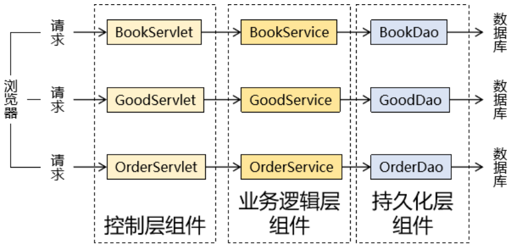

#### SSM整合组件

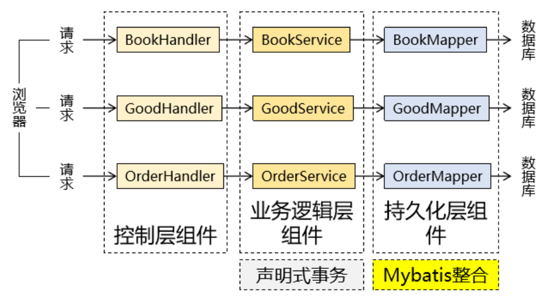

#### 组件管理

其实这里我们强调的仍然是我们自己为了开发业务功能而创建的组件，而除了我们开发的组件，框架内部也有很多组件需要管理。

那么不管是我们开发的还是框架内部的，Spring都可以通过IOC容器的方式对它们进行统一管理和调配。所以Spring在SSM三大框架中起到的是一个基础设置的作用。而IOC容器的作用就是帮助我们管理组件。

那到底什么是组件呢？

我们都知道，一个大型的项目可以包含很多子系统，子系统内又可以划分很多模块。这个层次结构是按照它们之间的逻辑关系划分的。那么从系统功能的具体实现的角度来看，我们可以说每一个功能模块都是由『组件』组合起来而实现的。

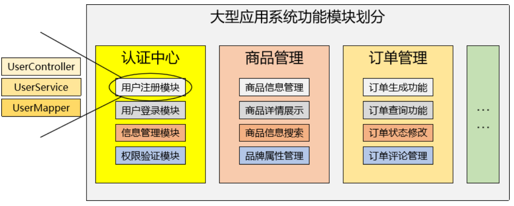

### 2.1.2 容器的概念

#### 普通容器

- 数组
- 集合：List
- 集合：Set

#### 复杂容器

Servlet容器能够管理 Servlet、Filter、Listener这样的组件的一生，所以它是一个复杂容器。我们即将要学习的IOC容器也是一个复杂容器。它们不仅要负责创建组件的对象、存储组件的对象，还要负责调用组件的方法让它们工作，最终在特定情况下销毁组件。

**<u>Servlet容器：</u>**

| 名称       | 时机                                                         | 次数 |
| ---------- | ------------------------------------------------------------ | ---- |
| 创建对象   | 默认情况：接收到第一次请求  <br>修改启动顺序后：Web应用启动过程中 | 一次 |
| 初始化操作 | 创建对象之后                                                 | 一次 |
| 处理请求   | 接收到请求                                                   | 多次 |
| 销毁操作   | Web应用卸载之前                                              | 一次 |

**<u>Filter生命周期：</u>**

| 生命周期阶段 | 执行时机         | 执行次数 |
| ------------ | ---------------- | -------- |
| 创建对象     | Web应用启动时    | 一次     |
| 初始化       | 创建对象后       | 一次     |
| 拦截请求     | 接收到匹配的请求 | 多次     |
| 销毁         | Web应用卸载前    | 一次     |

### 2.1.3 IOC和DI

`IOC：Inversion of Control`，翻译过来是反转控制。

#### 获取资源的传统方式

在应用程序中的组件需要获取资源时，传统的方式是组件主动的从容器中获取所需要的资源，在这样的模式下开发人员往往需要知道在具体容器中特定资源的获取方式，增加了学习成本，同时降低了开发效率。

比如我们在Servlet中自己创建Service对象：

```Java
private BookService bookService = new BookServiceImpl();
```

虽然创建`BookServiceImpl`对象不难，但是此时得到的仅仅是一个`BookServiceImpl`对象而已；如果我们需要附加事务功能，那就必须自己编写代码，执行事务操作。

#### 反转控制获取资源

反转控制的思想完全颠覆了应用程序组件获取资源的传统方式：反转了资源的获取方向——改由容器主动的将资源推送给需要的组件，开发人员不需要知道容器是如何创建资源对象的，只需要提供接收资源的方式即可，极大的降低了学习成本，提高了开发的效率。这种行为也称为查找的被动形式。

使用IOC容器后，同样是给BookService属性赋值：

```Java
@Autowired
private BookService bookService;
```

我们只需要声明要什么类型，Spring会自动将我们所需类型的对象注入到这个属性中，而且是已经附加事务操作的、被增强了的`BookService`对象。对象的创建和事务的增强都与业务功能的开发过程无关，确实能够大大简化业务代码的编写。所以使用框架就是为了让程序员能够尽可能专注于业务的开发，而不必为重复性的操作分散精力。

> 当然，我们也必须承认：要实现上面的效果，我们需要搭建环境。所谓搭建环境主要就是在配置文件中做必要的配置。

#### DI

`DI：Dependency Injection`，翻译过来是依赖注入。

DI是IOC的另一种表述方式：即组件以一些预先定义好的方式（例如：setter方法）接受来自于容器的资源注入。相对于IOC而言，这种表述更直接。

所以结论是：IOC就是一种反转控制的思想， 而DI是对IOC的一种具体实现。

> 起初是把DI看做是IOC的实现来对待，IOC作为一种思想或标准；后来发现基本上IOC只有DI这一种实现方式，所以后来也不做严格区分了，现在我们可以认为IOC和DI是等同的。

### 2.1.4 IOC在Spring中的实现

Spring的IOC容器就是IOC思想的一个落地的产品实现。IOC容器中管理的组件也叫做bean。在创建bean之前，首先需要创建IOC容器。Spring提供了IOC容器的两种实现方式：

#### `BeanFactory`接口

这是IOC容器的基本实现，是Spring内部使用的接口。面向Spring本身，不提供给开发人员使用。

> bean：本意是“豆”，在这里指的是我们IOC容器中管理的各个组件。
>
> factory：本意是“工厂”，在这里符合了23种设计模式中的工厂模式。如果某一个类是专门用来创建特定的对象，那么这样的类我们可以定义为工厂类。

#### `ApplicationContext`接口

`BeanFactory`的子接口，提供了更多高级特性。面向Spring的使用者，几乎所有场合都使用`ApplicationContext`而不是底层的 `BeanFactory`。

> 以后在 Spring 环境下看到一个类或接口的名称中包含`ApplicationContext`，那基本就可以断定，这个类或接口与 IOC 容器有关。
>
> 对我们开发人员来说，`ApplicationContext`就是代表整个IOC容器技术体系的顶级接口。

#### `ApplicationContext`的主要实现类

| 类型名                          | 简介                                                         |
| ------------------------------- | ------------------------------------------------------------ |
| ClassPathXmlApplicationContext  | 通过读取类路径下的XML格式的配置文件创建 IOC 容器对象         |
| FileSystemXmlApplicationContext | 通过文件系统路径读取XML格式的配置文件创建 IOC 容器对象       |
| ConfigurableApplicationContext  | ApplicationContext的子接口，包含一些扩展方法 refresh()和 close() ，让 ApplicationContext具有启动、关闭和刷新上下文的能力。 |
| WebApplicationContext           | 专门为Web应用准备，基于Web环境创建IOC容器对象，并将对象引入存入 ServletContext域中。 |

## 2.2 基于XML管理bean

### 2.2.1 创建bean

#### 目标和思路

由 Spring 的 IOC 容器创建类的对象。

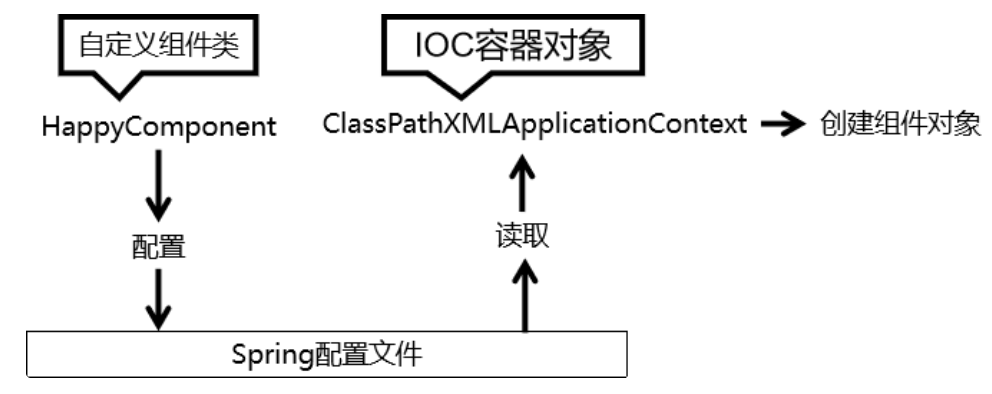

#### 创建Maven Module引入依赖

```xml
<dependencies>
    <!-- 基于Maven依赖传递性，导入spring-context依赖即可导入当前所需所有jar包 -->
    <dependency>
        <groupId>org.springframework</groupId>
        <artifactId>spring-context</artifactId>
        <version>5.3.1</version>
    </dependency>
    
    <!-- junit测试 -->
    <dependency>
        <groupId>junit</groupId>
        <artifactId>junit</artifactId>
        <version>4.12</version>
        <scope>test</scope>
    </dependency>
    
    <!-- 日志 -->
    <dependency>
        <groupId>ch.qos.logback</groupId>
        <artifactId>logback-classic</artifactId>
        <version>1.2.3</version>
    </dependency>
    
    <!-- Lombok -->
    <dependency>
        <groupId>org.projectlombok</groupId>
        <artifactId>lombok</artifactId>
        <version>1.18.12</version>
        <scope>provided</scope>
    </dependency>
</dependencies>
```

#### 创建组件类

`Component`是组件的意思，这里我们创建的这个类，就是我们希望由IOC容器创建对象的类：

```java
package com.atguigu.ioc.component;
    
import lombok.extern.slf4j.Slf4j;

@Slf4j
public class HappyComponent {
    public void doWork() {
        log.debug("component do work ...");
    }
}
```

#### 创建Spring配置文件

```xml
<!-- 实验一 [重要]创建bean -->
<bean id="happyComponent" class="com.atguigu.ioc.component.HappyComponent"/>
```

- `bean`标签：通过配置bean标签告诉IOC容器需要创建对象的组件是什么；
- `id`属性：bean的唯一标识；
- `class`属性：组件类的全类名；

#### 创建测试类

```java
public class IOCTest {
    
    // 创建 IOC 容器对象，为便于其他实验方法使用声明为成员变量
    private ApplicationContext iocContainer = new ClassPathXmlApplicationContext("applicationContext.xml");
    
    @Test
    public void testExperiment01() {
    
        // 从 IOC 容器对象中获取bean，也就是组件对象
        HappyComponent happyComponent = (HappyComponent) iocContainer.getBean("happyComponent");
    
        happyComponent.doWork();
    
    }
    
}
```

Spring底层默认通过反射技术调用组件类的==**<u>无参构造器</u>**==来创建组件对象，这一点需要注意。如果在需要无参构造器时，没有无参构造器，则会抛出异常。

#### 用IOC容器创建对象

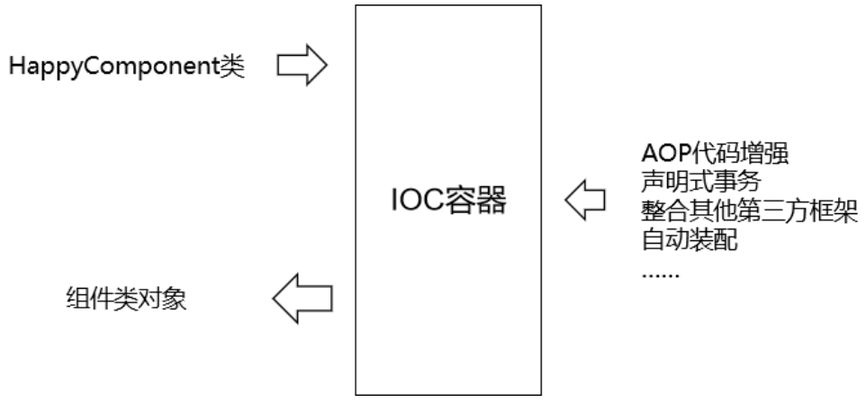

在Spring环境下能够享受到的所有福利，都必须通过IOC容器附加到组件类上，所以随着我们在Spring中学习的功能越来越多，IOC 容器创建的组件类的对象就会比自己new的对象强大的越来越多。

### 2.2.2 获取bean

#### 根据id获取

由于 id 属性指定了 bean 的唯一标识，所以根据 bean 标签的 id 属性可以精确获取到一个组件对象。上个实验中我们使用的就是这种方式。

#### 根据类型获取

**<u>指定类型bean唯一：</u>**

能够正常获取到

```java
@Test
public void testExperiment02() {
    
    HappyComponent component = iocContainer.getBean(HappyComponent.class);
    
    component.doWork();
    
}
```

**<u>指定类型bean不唯一：</u>**

```xml
<!-- 实验一 [重要]创建bean -->
<bean id="happyComponent" class="com.atguigu.ioc.component.HappyComponent"/>

<!-- 实验二 [重要]获取bean -->
<bean id="happyComponent2" class="com.atguigu.ioc.component.HappyComponent"/>
```

根据类型获取时会抛出异常。

#### 思考

如果组件类实现了接口，根据接口类型可以获取bean吗？

> 可以，前提是bean唯一

如果一个接口有多个实现类，这些实现类都配置了bean，根据接口类型可以获取bean吗？

> 不行，因为bean不唯一

根据类型来获取bean时，**<u>在满足bean唯一性的前提</u>**下，其实只是看：『对象 `instanceof` 指定的类型』的返回结果，只要返回的是true就可以认定为和类型匹配，能够获取到。

### 2.2.3 setter注入

#### 组件类添加属性

```java
import lombok.extern.slf4j.Slf4j;

@Slf4j
public class HappyComponent {
    
    private String componentName;
    
    public String getComponentName() {
        return componentName;
    }
    
    public void setComponentName(String componentName) {
        this.componentName = componentName;
    }
    
    public void doWork() {
        log.debug("component do work ...");
    }
    
}
```

#### 配置中指定属性

```xml
<!-- 实验三 [重要]给bean的属性赋值：setter注入 -->
<bean id="happyComponent3" class="com.atguigu.ioc.component.HappyComponent">
    
    <!-- property标签：通过组件类的setXxx()方法给组件对象设置属性 -->
    <!-- name属性：指定属性名（这个属性名是getXxx()、setXxx()方法定义的，和成员变量无关） -->
    <!-- value属性：指定属性值 -->
    <property name="componentName" value="veryHappy"/>
</bean>
```

#### 测试

```java
@Test
public void testExperiment03() {
    
    HappyComponent happyComponent3 = (HappyComponent) iocContainer.getBean("happyComponent3");
    
    String componentName = happyComponent3.getComponentName();
    
    log.debug("componentName = " + componentName);
    
}
```

### 2.2.4 引用外部声明bean

#### 声明新的组件

```java
public class HappyMachine {
    
    private String machineName;
    
    public String getMachineName() {
        return machineName;
    }
    
    public void setMachineName(String machineName) {
        this.machineName = machineName;
    }
}
```

#### 配置新组件bean

```xml
<bean id="happyMachine" class="com.atguigu.ioc.component.HappyMachine">
    <property name="machineName" value="makeHappy"/>
</bean>
```

#### 原组件bean中引用新组件的bean

```xml
<bean id="happyComponent4" class="com.atguigu.ioc.component.HappyComponent">
    <!-- ref 属性：通过 bean 的 id 引用另一个 bean -->
    <property name="happyMachine" ref="happyMachine"/>
</bean>
```

#### 测试

```java
@Test
public void testExperiment04() {
    HappyComponent happyComponent4 = (HappyComponent) iocContainer.getBean("happyComponent4");
    
    HappyMachine happyMachine = happyComponent4.getHappyMachine();
    
    String machineName = happyMachine.getMachineName();
    
    log.debug("machineName = " + machineName);
}
```

### 2.2.5 内部bean

#### 配置原组件

```xml
<!-- 实验五 [重要]给bean的属性赋值：内部bean -->
<bean id="happyComponent5" class="com.atguigu.ioc.component.HappyComponent">
    <property name="happyMachine">
        <!-- 在一个 bean 中再声明一个 bean 就是内部 bean -->
        <!-- 内部 bean 可以直接用于给属性赋值，可以省略 id 属性 -->
        <bean class="com.atguigu.ioc.component.HappyMachine">
            <property name="machineName" value="makeHappy"/>
        </bean>
    </property>
</bean>
```

#### 测试

```java
@Test
public void testExperiment05() {
    HappyComponent happyComponent5 = (HappyComponent) iocContainer.getBean("happyComponent5");
    
    HappyMachine happyMachine = happyComponent5.getHappyMachine();
    
    String machineName = happyMachine.getMachineName();
    
    log.debug("machineName = " + machineName);
}
```

### 2.2.6 引入外部属性文件

#### 加入依赖

```xml
<!-- MySQL驱动 -->
<dependency>
    <groupId>mysql</groupId>
    <artifactId>mysql-connector-java</artifactId>
    <version>5.1.3</version>
</dependency>
<!-- 数据源 -->
<dependency>
    <groupId>com.alibaba</groupId>
    <artifactId>druid</artifactId>
    <version>1.0.31</version>
</dependency>
```

#### 创建外部属性文件

```properties
jdbc.user=root
jdbc.password=atguigu
jdbc.url=jdbc:mysql://192.168.198.100:3306/mybatis-example
jdbc.driver=com.mysql.cj.jdbc.Driver
```

#### 在Spring中引入

```xml
<!-- 引入外部属性文件 -->
<context:property-placeholder location="classpath:jdbc.properties"/>
```

在 IDEA 中引入 Spring 配置文件中名称空间的两种操作方式： 

- 在打字标签名的过程中根据提示选择一个正确的名称空间；
- 对于直接复制过来的完整标签，可以在名称空间上点击，然后根据提示引入；

#### 使用

```xml
<!-- 实验六 [重要]给bean的属性赋值：引入外部属性文件 -->
<bean id="druidDataSource" class="com.alibaba.druid.pool.DruidDataSource">
    <property name="url" value="${jdbc.url}"/>
    <property name="driverClassName" value="${jdbc.driver}"/>
    <property name="username" value="${jdbc.user}"/>
    <property name="password" value="${jdbc.password}"/>
</bean>
```

#### 测试

```java
@Test
public void testExperiment06() throws SQLException {
    DataSource dataSource = iocContainer.getBean(DataSource.class);

    Connection connection = dataSource.getConnection();

    log.debug("connection = " + connection);
}
```

### 2.2.7 级联属性赋值

#### 配置关联对象的bean

```xml
<bean id="happyMachine2" class="com.atguigu.ioc.component.HappyMachine"/>
```

#### 装配关联对象并赋值级联属性

关联对象：`happyMachine`;

级联属性：`happyMachine.machineName`；

```xml
<!-- 实验七 给bean的属性赋值：级联属性赋值 -->
<bean id="happyComponent6" class="com.atguigu.ioc.component.HappyComponent">
    <!-- 装配关联对象 -->
    <property name="happyMachine" ref="happyMachine2"/>
    <!-- 对HappyComponent来说，happyMachine的machineName属性就是级联属性 -->
    <property name="happyMachine.machineName" value="cascadeValue"/>
</bean>
```

#### 测试

```java
@Test
public void testExperiment07() {
    
    HappyComponent happyComponent6 = (HappyComponent) iocContainer.getBean("happyComponent6");
    
    String machineName = happyComponent6.getHappyMachine().getMachineName();
    
    log.debug("machineName = " + machineName);

}
```

### 2.2.8 构造器注入

#### 声明组件类

```java
package com.atguigu.ioc.component;
    
import lombok.Data;
import lombok.NoArgsConstructor;

@Data
@NoArgsConstructor
public class HappyTeam {

    private String teamName;
    private Integer memberCount;
    private Double memberSalary;

    public HappyTeam(String teamName, Integer memberCount, Double memberSalary) {
        this.teamName = teamName;
        this.memberCount = memberCount;
        this.memberSalary = memberSalary;
    }
}
```

#### 配置

```xml
<!-- 实验八 给bean的属性赋值：构造器注入 -->
<bean id="happyTeam" class="com.atguigu.ioc.component.HappyTeam">
    <constructor-arg value="happyCorps"/>
    <constructor-arg value="10"/>
    <constructor-arg value="1000.55"/>
</bean>
```

#### 测试

```java
@Test
public void testExperiment08() {
    
    HappyTeam happyTeam = iocContainer.getBean(HappyTeam.class);
    
    log.debug("happyTeam = " + happyTeam);
    
}
```

#### 补充

`constructor-arg`标签还有两个属性可以进一步描述构造器参数：

- `index`属性：指定参数所在位置的索引（从0开始）；
- `name`属性：指定参数名；

### 2.2.9 特殊值处理

#### 声明类

```java
package com.atguigu.ioc.component;

import lombok.AllArgsConstructor;
import lombok.Data;
import lombok.NoArgsConstructor;

@Data
@NoArgsConstructor
@AllArgsConstructor
public class PropValue {

    private String commonValue;
    private String expression;

}
```

#### null值

```xml
<property name="commonValue">
    <!-- null标签：将一个属性值明确设置为null -->
    <null/>
</property>
```

#### xml实体

```xml
<!-- 实验九 给bean的属性赋值：特殊值处理 -->
<bean id="propValue" class="com.atguigu.ioc.component.PropValue">
    <!-- 小于号在XML文档中用来定义标签的开始，不能随便使用 -->
    <!-- 解决方案一：使用XML实体来代替 -->
    <property name="expression" value="a &lt; b"/>
</bean>
```

#### CDATA节

```xml
<!-- 实验九 给bean的属性赋值：特殊值处理 -->
<bean id="propValue" class="com.atguigu.ioc.component.PropValue">
    <property name="expression">
        <!-- 解决方案二：使用CDATA节 -->
        <!-- CDATA中的C代表Character，是文本、字符的含义，CDATA就表示纯文本数据 -->
        <!-- XML解析器看到CDATA节就知道这里是纯文本，就不会当作XML标签或属性来解析 -->
        <!-- 所以CDATA节中写什么符号都随意 -->
        <value><![CDATA[a < b]]></value>
    </property>
</bean>
```

### 2.2.10 使用`p`名称空间

#### 配置

使用`p`名称空间的方式可以省略子标签`property`，将组件属性的设置作为`bean`标签的属性来完成。

```XML
<!-- 实验十 给bean的属性赋值：使用p名称空间 -->
<bean id="happyMachine3"
      class="com.atguigu.ioc.component.HappyMachine"
      p:machineName="goodMachine"
/>
```

使用`p`名称空间需要导入相关的XML约束，在IDEA的协助下导入即可：

```XML
<?xml version="1.0" encoding="UTF-8"?>
<beans xmlns="http://www.springframework.org/schema/beans"
       xmlns:xsi="http://www.w3.org/2001/XMLSchema-instance"
       xmlns:context="http://www.springframework.org/schema/context" xmlns:p="http://www.springframework.org/schema/p"
       xsi:schemaLocation="http://www.springframework.org/schema/beans http://www.springframework.org/schema/beans/spring-beans.xsd http://www.springframework.org/schema/context https://www.springframework.org/schema/context/spring-context.xsd">
```

#### 测试

```java
@Test
public void testExperiment10() {
    HappyMachine happyMachine3 = (HappyMachine) iocContainer.getBean("happyMachine3");
    
    String machineName = happyMachine3.getMachineName();
    
    log.debug("machineName = " + machineName);
}
```

### 2.2.11 集合属性

#### 配置

```xml
<!-- 实验十三 集合类型的bean -->
<bean id="happyTeam2" class="com.atguigu.ioc.component.HappyTeam">
    <property name="memberList">
        <list>
            <value>member01</value>
            <value>member02</value>
            <value>member03</value>
        </list>
    </property>
</bean>
```

#### 测试

```java
@Test
public void testExperiment13() {
    
    HappyTeam happyTeam2 = (HappyTeam) iocContainer.getBean("happyTeam2");
    
    List<String> memberList = happyTeam2.getMemberList();
    
    for (String member : memberList) {
        log.debug("member = " + member);
    }
    
}
```

#### 其他变化形式

```xml
<!-- 实验十一 给bean的属性赋值：集合属性 -->
<bean id="happyTeam2" class="com.atguigu.ioc.component.HappyTeam">
    <property name="memberNameList">
        <!-- list标签：准备一组集合类型的数据，给集合属性赋值 -->
        <!--<list>
            <value>member01</value>
            <value>member02</value>
            <value>member03</value>
        </list>-->
        <!-- 使用set标签也能实现相同效果，只是附带了去重功能 -->
        <!--<set>
            <value>member01</value>
            <value>member02</value>
            <value>member02</value>
        </set>-->
        <!-- array也同样兼容 -->
        <array>
            <value>member01</value>
            <value>member02</value>
            <value>member02</value>
        </array>
    </property>
    <property name="managerList">
        <!-- 给Map类型的属性赋值 -->
        <!--<map>
            <entry key="财务部" value="张三"/>
            <entry key="行政部" value="李四"/>
            <entry key="销售部" value="王五"/>
        </map>-->
        <!-- 也可以使用props标签 -->
        <props>
            <prop key="财务部">张三2</prop>
            <prop key="行政部">李四2</prop>
            <prop key="销售部">王五2</prop>
        </props>
    </property>
</bean>
```

### 2.2.12 自动装配

#### 声明组件类

其中`HappyController`需要用到`HappyService`。所谓自动装配就是一个组件需要其他组件时，由IOC容器负责找到那个需要的组件，并装配进去。

```Java
public class HappyController {
        
    private HappyService happyService;
    
    public HappyService getHappyService() {
        return happyService;
    }
    
    public void setHappyService(HappyService happyService) {
        this.happyService = happyService;
    }
}
```

```Java
public class HappyService {
}

```

#### 配置

```xml
<!-- 实验十二 自动装配 -->
<bean id="happyService3" class="com.atguigu.ioc.component.HappyService"/>
<bean id="happyService" class="com.atguigu.ioc.component.HappyService"/>

<!-- 使用bean标签的autowire属性设置自动装配效果 -->
<!-- byType表示根据类型进行装配，此时如果类型匹配的bean不止一个，那么会抛NoUniqueBeanDefinitionException -->
<!-- byName表示根据bean的id进行匹配。而bean的id是根据需要装配组件的属性的属性名来确定的 -->
<bean id="happyController"
      class="com.atguigu.ioc.component.HappyController"
      autowire="byName"
>
    <!-- 手动装配：在property标签中使用ref属性明确指定要装配的bean -->
    <!--<property name="happyService" ref="happyService"/>-->
</bean>
```

#### 测试

```java
@Test
public void testExperiment12() {
    HappyController happyController = iocContainer.getBean(HappyController.class);
    HappyService happyService = happyController.getHappyService();
    log.debug("happyService = " + happyService);
}
```

### 2.2.13 集合类型的bean

#### 配置

```xml
<!-- 实验十一 给bean的属性赋值：集合属性 -->
<util:list id="machineList">
    <bean class="com.atguigu.ioc.component.HappyMachine">
        <property name="machineName" value="machineOne"/>
    </bean>
    <bean class="com.atguigu.ioc.component.HappyMachine">
        <property name="machineName" value="machineTwo"/>
    </bean>
    <bean class="com.atguigu.ioc.component.HappyMachine">
        <property name="machineName" value="machineThree"/>
    </bean>
</util:list>
```

#### 测试

```java
@Test
public void testExperiment11() {
    List<HappyMachine> machineList = (List<HappyMachine>) iocContainer.getBean("machineList");
    for (HappyMachine happyMachine : machineList) {
        log.debug("happyMachine = " + happyMachine);
    }
}
```

### 2.2.14 FactoryBean机制

#### 简介

`FactoryBean`是Spring提供的一种整合第三方框架的常用机制。和普通的bean不同，配置一个`FactoryBean`类型的bean，在获取 bean的时候得到的并不是class属性中配置的这个类的对象，而是`getObject()`方法的返回值。通过这种机制，Spring可以帮我们把复杂组件创建的详细过程和繁琐细节都屏蔽起来，只把最简洁的使用界面展示给我们。

将来我们整合Mybatis时，Spring 就是通过`FactoryBean`机制来帮我们创建`SqlSessionFactory`对象的。

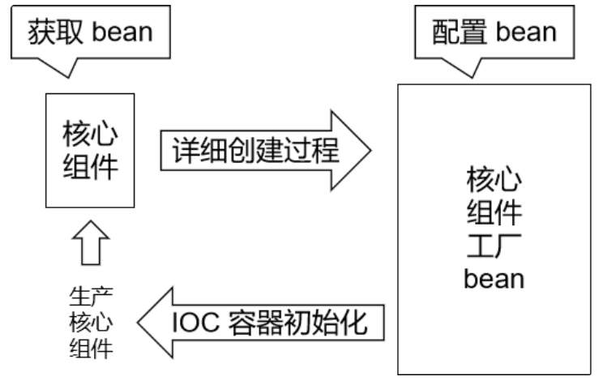

#### 实现`FactoryBean`接口

```java
// 实现FactoryBean接口时需要指定泛型
// 泛型类型就是当前工厂要生产的对象的类型
public class HappyFactoryBean implements FactoryBean<HappyMachine> {
    
    private String machineName;
    
    public String getMachineName() {
        return machineName;
    }
    
    public void setMachineName(String machineName) {
        this.machineName = machineName;
    }
    
    @Override
    public HappyMachine getObject() throws Exception {
    
        // 方法内部模拟创建、设置一个对象的复杂过程
        HappyMachine happyMachine = new HappyMachine();
    
        happyMachine.setMachineName(this.machineName);
    
        return happyMachine;
    }
    
    @Override
    public Class<?> getObjectType() {
    
        // 返回要生产的对象的类型
        return HappyMachine.class;
    }
}
```

#### 配置bean

```xml
<!-- 实验十四 FactoryBean机制 -->
<!-- 这个bean标签中class属性指定的是HappyFactoryBean，但是将来从这里获取的bean是HappyMachine对象 -->
<bean id="happyMachine3" class="com.atguigu.ioc.factory.HappyFactoryBean">
    <!-- property标签仍然可以用来通过setXxx()方法给属性赋值 -->
    <property name="machineName" value="iceCreamMachine"/>
</bean>
```

#### 测试获取bean

- 配置的bean：`HappyFactoryBean`；
- 获取bean后得到的bean：`HappyMachine`；

```java
@Test
public void testExperiment14() {
    HappyMachine happyMachine3 = (HappyMachine) iocContainer.getBean("happyMachine3");
    
    String machineName = happyMachine3.getMachineName();
    
    log.debug("machineName = " + machineName);
}
```

### 2.2.15 bean的作用域

#### 概念

在Spring中可以通过配置bean标签的scope属性来指定bean的作用域范围，各取值含义参加下表：

| 取值      | 含义                                        | 创建对象的时机   | 默认值 |
| --------- | ------------------------------------------- | ---------------- | ------ |
| singleton | 在 IOC 容器中，这个 bean 的对象始终为单实例 | IOC 容器初始化时 | 是     |
| prototype | 这个 bean 在 IOC 容器中有多个实例           | 获取 bean 时     | 否     |


> 说明：这里单实例、多实例指的是一个bean标签配置之后，对应一个对象还是多个对象。

如果是在`WebApplicationContext`环境下还会有另外两个作用域（但不常用）：

| 取值    | 含义                 |
| ------- | -------------------- |
| request | 在一个请求范围内有效 |
| session | 在一个会话范围内有效 |

#### 配置

```xml
<!-- 实验十五 bean的作用域 -->
<!-- scope属性：取值singleton（默认值），bean在IOC容器中只有一个实例，IOC容器初始化时创建对象 -->
<!-- scope属性：取值prototype，bean在IOC容器中可以有多个实例，getBean()时创建对象 -->
<bean id="happyMachine4" scope="prototype" class="com.atguigu.ioc.component.HappyMachine">
    <property name="machineName" value="iceCreamMachine"/>
</bean>

```

#### 测试

```java
@Test
public void testExperiment15() {
    HappyMachine happyMachine01 = (HappyMachine) iocContainer.getBean("happyMachine4");
    HappyMachine happyMachine02 = (HappyMachine) iocContainer.getBean("happyMachine4");
    
    log.debug(happyMachine01 == happyMachine02);
    
    log.debug("happyMachine01.hashCode() = " + happyMachine01.hashCode());
    log.debug("happyMachine02.hashCode() = " + happyMachine02.hashCode());
}
```

### 2.2.16 bean的生命周期

#### 生命周期清单

- bean 对象创建（调用无参构造器）
- 给 bean 对象设置属性（调用属性对应的 setter 方法）
- bean 对象初始化之前操作（由 bean 的后置处理器负责）
- bean 对象初始化（需在配置 bean 时指定初始化方法）
- bean 对象初始化之后操作（由 bean 的后置处理器负责）
- bean 对象就绪可以使用
- bean 对象销毁（需在配置 bean 时指定销毁方法）
- IOC 容器关闭

#### 指定初始化方法和销毁方法

```java
public void happyInitMethod() {
    log.debug("HappyComponent初始化");
}
    
public void happyDestroyMethod() {
    log.debug("HappyComponent销毁");
}
```

#### 配置初始化和销毁方法

```xml
<!-- 实验十六 bean的生命周期 -->
<!-- 使用init-method属性指定初始化方法 -->
<!-- 使用destroy-method属性指定销毁方法 -->
<bean id="happyComponent"
      class="com.atguigu.ioc.component.HappyComponent"
      init-method="happyInitMethod"
      destroy-method="happyDestroyMethod"
>
    <property name="happyName" value="uuu"/>
</bean>
```

#### bean后置处理器

```java
package com.atguigu.ioc.process;
    
import org.springframework.beans.BeansException;
import org.springframework.beans.factory.config.BeanPostProcessor;
    
// 声明一个自定义的bean后置处理器
// 注意：bean后置处理器不是单独针对某一个bean生效，而是针对IOC容器中所有bean都会执行
public class MyHappyBeanProcessor implements BeanPostProcessor {
    
    @Override
    public Object postProcessBeforeInitialization(Object bean, String beanName) throws BeansException {
    
        System.out.println("☆☆☆" + beanName + " = " + bean);
    
        return bean;
    }
    
    @Override
    public Object postProcessAfterInitialization(Object bean, String beanName) throws BeansException {
    
        System.out.println("★★★" + beanName + " = " + bean);
    
        return bean;
    }
}
```

#### 后置处理器放入容器

```xml
<!-- bean的后置处理器要放入IOC容器才能生效 -->
<bean id="myHappyBeanProcessor" class="com.atguigu.ioc.process.MyHappyBeanProcessor"/>
```

#### 执行效果

```bash
HappyComponent创建对象  
HappyComponent要设置属性了  
☆☆☆happyComponent = com.atguigu.ioc.component.HappyComponent@ca263c2  
HappyComponent初始化  
★★★happyComponent = com.atguigu.ioc.component.HappyComponent@ca263c2  
HappyComponent销毁
```

## 2.3 基于注解管理bean

### 2.3.1 标记与扫描

#### `@Component`注解标记的普通组件

```java
package com.atguigu.ioc.component;

import org.springframework.stereotype.Component;

@Component
public class CommonComponent {
}
```

#### `@Controller`注解标记的控制器组件

这个组件就是我们在三层架构中表述层里面，使用的控制器。以前是Servlet，以后我们将会使用Controller来代替Servlet。

```java
package com.atguigu.ioc.component;

import org.springframework.stereotype.Controller;

@Controller
public class SoldierController {
}
```

#### `@Service`注解标记的业务逻辑组件

```java
package com.atguigu.ioc.component;

import org.springframework.stereotype.Service;

@Service
public class SoldierService {

}
```

#### `@Repository`注解标记的持久化层组件

这个组件就是我们以前用的Dao类，但是以后我们整合了Mybatis，这里就变成了Mapper接口，而Mapper接口是由Mybatis和Spring的整合包负责扫描的。

由于Mybatis整合包想要把Mapper接口背后的代理类加入Spring的IOC容器需要结合Mybatis对Mapper配置文件的解析，所以这个事情是Mybatis和Spring的整合包来完成，将来由Mybatis负责扫描，也不使用@Repository注解。

```Java
package com.atguigu.ioc.component;

import org.springframework.stereotype.Repository;

@Repository
public class SoldierDao {
}
```

通过查看源码我们得知，`@Controller`、`@Service`、`@Repository`这三个注解只是在`@Component`注解的基础上起了三个新的名字。

对于Spring使用IOC容器管理这些组件来说没有区别，也就是语法层面没有区别。所以`@Controller`、`@Service`、`@Repository`这三个注解只是给开发人员看的，让我们能够便于分辨组件的作用。

注意：虽然它们本质上一样，但是为了代码的可读性，为了程序结构严谨我们肯定不能随便胡乱标记。

#### 扫描

1. **<u>最基本的扫描方式：</u>**

```xml
<!-- 配置自动扫描的包 -->
<!-- 最基本的扫描方式 -->
<context:component-scan base-package="com.atguigu.ioc.component"/>
```

2. **<u>指定匹配模式：</u>**

```xml
    <!-- 情况二：在指定扫描包的基础上指定匹配模式 -->
    <context:component-scan
            base-package="com.atguigu.ioc.component"
            resource-pattern="Soldier*.class"/>
```

3. **<u>指定要排除的组件：</u>**

```xml
<!-- 情况三：指定不扫描的组件 -->
<context:component-scan base-package="com.atguigu.ioc.component">
    
    <!-- context:exclude-filter标签：指定排除规则 -->
    <!-- type属性：指定根据什么来进行排除，annotation取值表示根据注解来排除 -->
    <!-- expression属性：指定排除规则的表达式，对于注解来说指定全类名即可 -->
    <context:exclude-filter type="annotation" expression="org.springframework.stereotype.Controller"/>
</context:component-scan>
```

4. **<u>仅扫描指定组件：</u>**

```xml
<!-- 情况四：仅扫描指定的组件 -->
<!-- 仅扫描 = 关闭默认规则 + 追加规则 -->
<!-- use-default-filters属性：取值false表示关闭默认扫描规则 -->
<context:component-scan base-package="com.atguigu.ioc.component" use-default-filters="false">
    
    <!-- context:include-filter标签：指定在原有扫描规则的基础上追加的规则 -->
    <context:include-filter type="annotation" expression="org.springframework.stereotype.Controller"/>
</context:component-scan>
```

#### 组件的bean ID

在我们使用XML方式管理bean的时候，每个bean都有一个唯一标识——id 属性的值，便于在其他地方引用。现在使用注解后，每个组件仍然应该有一个唯一标识。

**<u>默认情况：</u>**

简单类名首字母小写就是bean的id。例如：`SoldierController`类对应的 bean 的 id 就是`soldierController`。

**<u>使用value属性指定：</u>**

```java
@Controller(value = "tianDog")
public class SoldierController {
}
```

当注解中只设置一个属性时，value属性的属性名可以省略：

```Java
@Service("smallDog")
public class SoldierService {
}
```

### 2.3.2 自动装配

#### 自动装配的实现

**<u>前提：</u>**

参与自动装配的组件（需要装配别人、被别人装配）全部都必须在IOC容器中。

**<u>`@Autowired`注解:</u>**

在成员变量上直接标记`@Autowired`注解即可，不需要提供`setXxx()`方法。以后我们在项目中的正式用法就是这样。

```java
@Controller(value = "tianDog")
public class SoldierController {
    
    @Autowired
    private SoldierService soldierService;
    
    public void getMessage() {
        soldierService.getMessage();
    }
    
}
```

```java
@Service("smallDog")
public class SoldierService {
    
    @Autowired
    private SoldierDao soldierDao;
    
    public void getMessage() {
        soldierDao.getMessage();
    }
}
```

#### 标记在其他位置

**<u>构造器：</u>**

```java
@Controller(value = "tianDog")
public class SoldierController {
    
    private SoldierService soldierService;
    
    @Autowired
    public SoldierController(SoldierService soldierService) {
        this.soldierService = soldierService;
    }
    ……
```

**<u>`setXxx()`方法：</u>**

```java
@Controller(value = "tianDog")
public class SoldierController {

    private SoldierService soldierService;

    @Autowired
    public void setSoldierService(SoldierService soldierService) {
        this.soldierService = soldierService;
    }
    ……
```

#### 工作流程

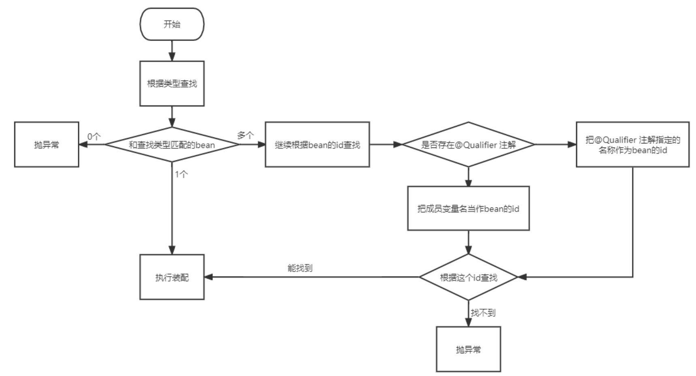

```java
@Controller(value = "tianDog")
public class SoldierController {
    
    @Autowired
    @Qualifier(value = "maomiService222")
    // 根据面向接口编程思想，使用接口类型引入Service组件
    private ISoldierService soldierService;
```

#### 佛系装配

给`@Autowired`注解设置`required = false`属性表示：能装就装，装不上就不装。但是实际开发时，基本上所有需要装配组件的地方都是必须装配的，用不上这个属性。

```Java
@Controller(value = "tianDog")
public class SoldierController {
    // 给@Autowired注解设置required = false属性表示：能装就装，装不上就不装
    @Autowired(required = false)
    private ISoldierService soldierService;
```

### 2.3.3 完全注解开发

#### 使用配置类取代配置文件

**<u>创建配置类：</u>**

```java
package com.atguigu.ioc.configuration;
    
import org.springframework.context.annotation.Configuration;
    
@Configuration
public class MyConfiguration {
}
```

**<u>创建IOC容器对象：</u>**

```java
// ClassPathXmlApplicationContext 根据 XM L配置文件创建 IOC 容器对象
private ApplicationContext iocContainer = new ClassPathXmlApplicationContext("applicationContext.xml");

// AnnotationConfigApplicationContext 根据配置类创建 IOC 容器对象
private ApplicationContext iocContainerAnnotation = new AnnotationConfigApplicationContext(MyConfiguration.class);
```

#### 配置类中的配置bean

使用`@Bean`注解

```java
@Configuration
public class MyConfiguration {
    
    // @Bean 注解相当于 XML 配置文件中的 bean 标签
    // @Bean 注解标记的方法的返回值会被放入 IOC 容器
    // 默认以方法名作为 bean 的 id
    @Bean
    public CommonComponent getComponent() {
    
        CommonComponent commonComponent = new CommonComponent();
    
        commonComponent.setComponentName("created by annotation config");
    
        return commonComponent;
    }
    
}
```

#### 在配置类中自动扫描包

```java
@Configuration
@ComponentScan("com.atguigu.ioc.component")
public class MyConfiguration {
    ……
```

### 2.3.4 整合junit4

#### 整合的好处

- 好处1：不需要自己创建IOC容器对象了；
- 好处2：任何需要的bean都可以在测试类中直接享受自动装配；

#### 操作

**<u>加入依赖：</u>**

```xml
<!-- Spring的测试包 -->
<dependency>
    <groupId>org.springframework</groupId>
    <artifactId>spring-test</artifactId>
    <version>5.3.1</version>
    <scope>test</scope>
</dependency>
```

**<u>创建测试类：</u>**

```java
@Slf4j

// junit的@RunWith注解：指定Spring为Junit提供的运行器
@RunWith(SpringJUnit4ClassRunner.class)

// Spring的@ContextConfiguration指定Spring配置文件的位置
@ContextConfiguration(value = {"classpath:applicationContext.xml"})
public class JunitIntegrationSpring {
    
    @Autowired
    private SoldierController soldierController;
    
    @Test
    public void testIntegration() {
        log.debug("soldierController = " + soldierController);
    }
    
}
```

# 3 AOP

## 3.1 代理模式

### 3.1.1 概念

#### 介绍

二十三种设计模式中的一种，属于结构型模式。它的作用就是通过提供一个代理类，让我们在调用目标方法的时候，不再是直接对目标方法进行调用，而是通过代理类间接调用。让不属于目标方法核心逻辑的代码从目标方法中剥离出来——解耦。调用目标方法时先调用代理对象的方法，减少对目标方法的调用和打扰，同时让附加功能能够集中在一起也有利于统一维护。

### 3.1.2 静态代理

创建静态代理类：

```java
@Slf4j
public class CalculatorStaticProxy implements Calculator {
    
    // 将被代理的目标对象声明为成员变量
    private Calculator target;
    
    public CalculatorStaticProxy(Calculator target) {
        this.target = target;
    }
    
    @Override
    public int add(int i, int j) {
    
        // 附加功能由代理类中的代理方法来实现
        log.debug("[日志] add 方法开始了，参数是：" + i + "," + j);
    
        // 通过目标对象来实现核心业务逻辑
        int addResult = target.add(i, j);
    
        log.debug("[日志] add 方法结束了，结果是：" + addResult);
    
        return addResult;
    }
    ……
```

静态代理确实实现了解耦，但是由于代码都写死了，完全不具备任何的灵活性。就拿日志功能来说，将来其他地方也需要附加日志，那还得再声明更多个静态代理类，那就产生了大量重复的代码，日志功能还是分散的，没有统一管理。

提出进一步的需求：将日志功能集中到一个代理类中，将来有任何日志需求，都通过这一个代理类来实现。这就需要使用动态代理技术了。

### 3.1.3 动态代理

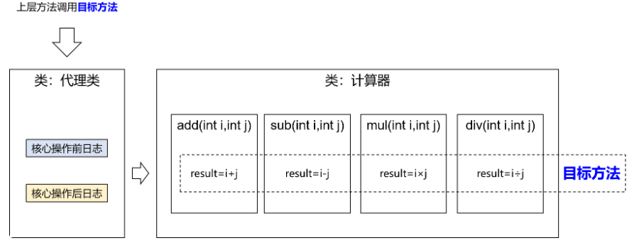

#### 生产代理对象的工厂类

JDK本身就支持动态代理，这是反射技术的一部分。下面我们还是创建一个代理类（生产代理对象的工厂类）：

```java
@Slf4j
// 泛型T要求是目标对象实现的接口类型，本代理类根据这个接口来进行代理
public class LogDynamicProxyFactory<T> {
    
    // 将被代理的目标对象声明为成员变量
    private T target;
    
    public LogDynamicProxyFactory(T target) {
        this.target = target;
    }
    
    public T getProxy() {
    
        // 创建代理对象所需参数一：加载目标对象的类的类加载器
        ClassLoader classLoader = target.getClass().getClassLoader();
    
        // 创建代理对象所需参数二：目标对象的类所实现的所有接口组成的数组
        Class<?>[] interfaces = target.getClass().getInterfaces();
    
        // 创建代理对象所需参数三：InvocationHandler对象
        // Lambda表达式口诀：
        // 1、复制小括号
        // 2、写死右箭头
        // 3、落地大括号
        InvocationHandler handler = (
                                    // 代理对象，当前方法用不上这个对象
                                    Object proxy,
    
                                     // method就是代表目标方法的Method对象
                                     Method method,
    
                                     // 外部调用目标方法时传入的实际参数
                                     Object[] args)->{
    
            // 我们对InvocationHandler接口中invoke()方法的实现就是在调用目标方法
            // 围绕目标方法的调用，就可以添加我们的附加功能
    
            // 声明一个局部变量，用来存储目标方法的返回值
            Object targetMethodReturnValue = null;
    
            // 通过method对象获取方法名
            String methodName = method.getName();
    
            // 为了便于在打印时看到数组中的数据，把参数数组转换为List
            List<Object> argumentList = Arrays.asList(args);
    
            try {
    
                // 在目标方法执行前：打印方法开始的日志
                log.debug("[动态代理][日志] " + methodName + " 方法开始了，参数是：" + argumentList);
    
                // 调用目标方法：需要传入两个参数
                // 参数1：调用目标方法的目标对象
                // 参数2：外部调用目标方法时传入的实际参数
                // 调用后会返回目标方法的返回值
                targetMethodReturnValue = method.invoke(target, args);
    
                // 在目标方法成功后：打印方法成功结束的日志【寿终正寝】
                log.debug("[动态代理][日志] " + methodName + " 方法成功结束了，返回值是：" + targetMethodReturnValue);
    
            }catch (Exception e){
    
                // 通过e对象获取异常类型的全类名
                String exceptionName = e.getClass().getName();
    
                // 通过e对象获取异常消息
                String message = e.getMessage();
    
                // 在目标方法失败后：打印方法抛出异常的日志【死于非命】
                log.debug("[动态代理][日志] " + methodName + " 方法抛异常了，异常信息是：" + exceptionName + "," + message);
    
            }finally {
    
                // 在目标方法最终结束后：打印方法最终结束的日志【盖棺定论】
                log.debug("[动态代理][日志] " + methodName + " 方法最终结束了");
    
            }
    
            // 这里必须将目标方法的返回值返回给外界，如果没有返回，外界将无法拿到目标方法的返回值
            return targetMethodReturnValue;
        };
    
        // 创建代理对象
        T proxy = (T) Proxy.newProxyInstance(classLoader, interfaces, handler);
    
        // 返回代理对象
        return proxy;
    }
}
```

#### 测试

```java
@Test
public void testDynamicProxy() {
    
    // 1.创建被代理的目标对象
    Calculator target = new CalculatorPureImpl();
    
    // 2.创建能够生产代理对象的工厂对象
    LogDynamicProxyFactory<Calculator> factory = new LogDynamicProxyFactory<>(target);
    
    // 3.通过工厂对象生产目标对象的代理对象
    Calculator proxy = factory.getProxy();
    
    // 4.通过代理对象间接调用目标对象
    int addResult = proxy.add(10, 2);
    log.debug("方法外部 addResult = " + addResult + "\n");
    
    int subResult = proxy.sub(10, 2);
    log.debug("方法外部 subResult = " + subResult + "\n");
    
    int mulResult = proxy.mul(10, 2);
    log.debug("方法外部 mulResult = " + mulResult + "\n");
    
    int divResult = proxy.div(10, 2);
    log.debug("方法外部 divResult = " + divResult + "\n");
}
```

## 3.2 AOP核心套路

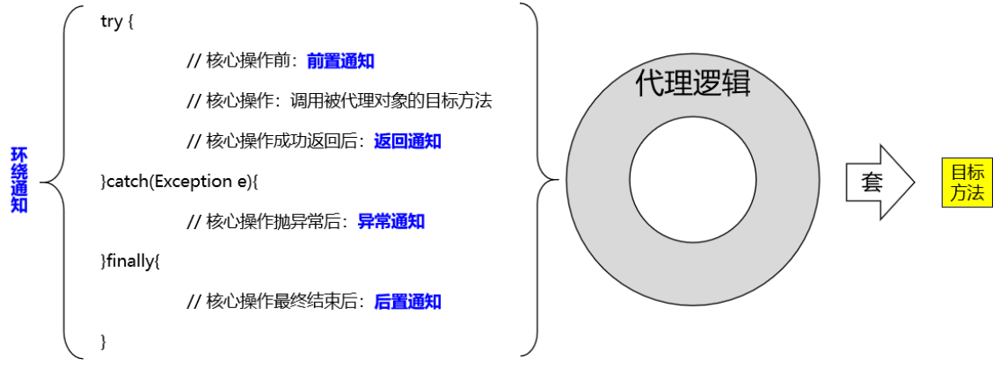

## 3.3 AOP术语

### 3.3.1 概念

#### 名词解释

`AOP：Aspect Oriented Programming`面向切面编程

#### AOP作用

下面两点是同一件事的两面，一枚硬币的两面：

- 代码简化：把方法中固定位置的重复的代码抽取出来，让被抽取的方法更专注于自己的核心功能，提高内聚性；
- 代码增强：把特定的功能封装到切面类中，看哪里有需要，就往上套，被套用了切面逻辑的方法就被切面给增强了；

### 3.3.2 横切关注点

从每个方法中抽取出来的同一类非核心业务。在同一个项目中，我们可以使用多个横切关注点对相关方法进行多个不同方面的增强。

这个概念不是语法层面天然存在的，而是根据附加功能的逻辑上的需要：有十个附加功能，就有十个横切关注点。

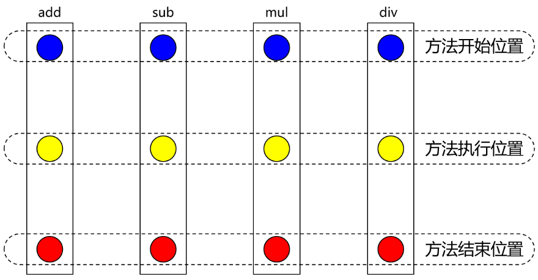

### 3.3.3 通知

每一个横切关注点上要做的事情都需要写一个方法来实现，这样的方法就叫通知方法。

- 前置通知：在被代理的目标方法前执行；
- 返回通知：在被代理的目标方法成功结束后执行（**寿终正寝**）；
- 异常通知：在被代理的目标方法异常结束后执行（**死于非命**）；
- 后置通知：在被代理的目标方法最终结束后执行（**盖棺定论**）；
- 环绕通知：使用try...catch...finally结构围绕整个被代理的目标方法，包括上面四种通知对应的所有位置；

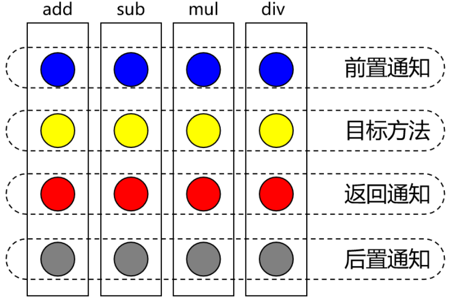

### 3.3.4 切面

封装通知方法的类。根据不同的非核心业务逻辑，我们可以创建不同的切面类：

- 日志功能：日志切面；
- 缓存功能：缓存切面；
- 事务功能：事务切面；

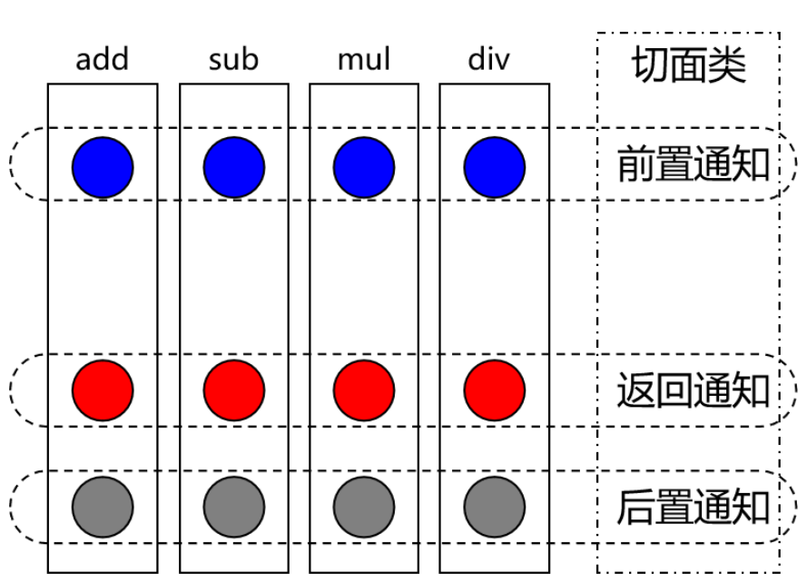

### 3.3.5 连接点

和横切关注点一样，这又是一个纯逻辑概念，不是语法定义的。

把方法排成一排，每一个横切位置看成x轴方向，把方法从上到下执行的顺序看成y轴，x轴和y轴的交叉点就是连接点。

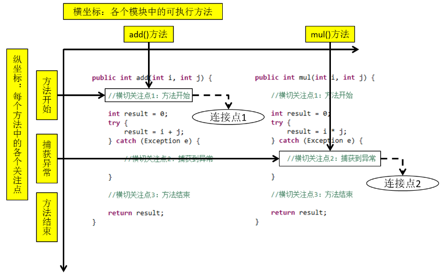

### 3.3.6 切入点

定位连接点的方式。

我们通过切入点，可以将通知方法精准的植入到被代理目标方法的指定位置。

每个类的方法中都包含多个连接点，所以连接点是类中客观存在的事物（从逻辑上来说）。

如果把连接点看作数据库中的记录，那么切入点就是查询记录的SQL语句。

Spring的AOP技术可以通过切入点定位到特定的连接点。

切点通过`org.springframework.aop.Pointcut` 接口进行描述，它使用类和方法作为连接点的查询条件。

封装了代理逻辑的通知方法就像一颗制导导弹，在切入点这个引导系统的指引下精确命中连接点这个打击目标：

## 3.4 基于注解的AOP

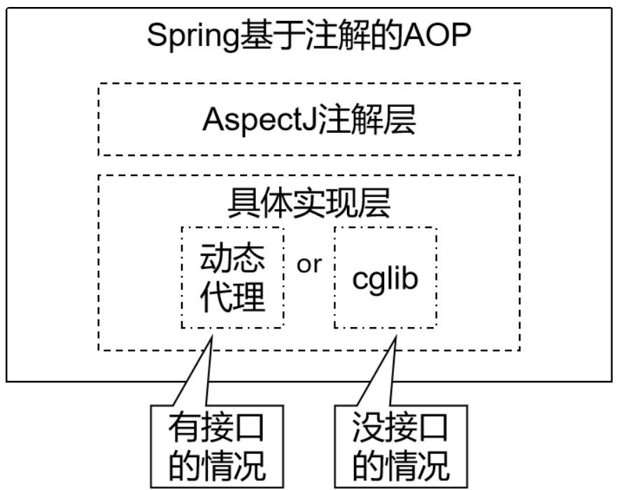

- 动态代理（`InvocationHandler`）：JDK原生的实现方式，需要被代理的目标类必须实现接口。因为这个技术要求代理对象和目标对象实现同样的接口（兄弟两个拜把子模式）；
- `cglib`：通过继承被代理的目标类（认干爹模式）实现代理，所以不需要目标类实现接口；
- `AspectJ`：本质上是静态代理，将代理逻辑“织入”被代理的目标类编译得到的字节码文件，所以最终效果是动态的。`weaver`就是织入器。Spring只是借用了`AspectJ`中的注解；

## 3.5 基于注解的操作

### 3.5.1 初步实现

#### 加入依赖

在IOC基础上加入依赖：

```xml
<!-- spring-aspects会帮我们传递过来aspectjweaver -->
<dependency>
    <groupId>org.springframework</groupId>
    <artifactId>spring-aspects</artifactId>
    <version>5.3.1</version>
</dependency>
```

#### 准备被代理的目标资源

<u>**接口**</u>

```java
public interface Calculator {
    
    int add(int i, int j);
    
    int sub(int i, int j);
    
    int mul(int i, int j);
    
    int div(int i, int j);
    
}
```

**<u>纯净的实现类：</u>**

```java
package com.atguigu.aop.imp;
    
import com.atguigu.aop.api.Calculator;
import org.springframework.stereotype.Component;

@Slf4j
@Component
public class CalculatorPureImpl implements Calculator {
    
    @Override
    public int add(int i, int j) {
    
        int result = i + j;
    
        log.debug("方法内部 result = " + result);
    
        return result;
    }
    
    @Override
    public int sub(int i, int j) {
    
        int result = i - j;
    
        log.debug("方法内部 result = " + result);
    
        return result;
    }
    
    @Override
    public int mul(int i, int j) {
    
        int result = i * j;
    
        log.debug("方法内部 result = " + result);
    
        return result;
    }
    
    @Override
    public int div(int i, int j) {
    
        int result = i / j;
    
        log.debug("方法内部 result = " + result);
    
        return result;
    }
}
```

#### 创建切面类

```java
// @Aspect表示这个类是一个切面类
@Aspect
// @Component注解保证这个切面类能够放入IOC容器
@Component
@Slf4j
public class LogAspect {
        
    // @Before注解：声明当前方法是前置通知方法
    // value属性：指定切入点表达式，由切入点表达式控制当前通知方法要作用在哪一个目标方法上
    @Before(value = "execution(public int com.atguigu.aop.api.Calculator.add(int,int))")
    public void printLogBeforeCore() {
        log.debug("[AOP前置通知] 方法开始了");
    }
    
    @AfterReturning(value = "execution(public int com.atguigu.aop.api.Calculator.add(int,int))")
    public void printLogAfterSuccess() {
        log.debug("[AOP返回通知] 方法成功返回了");
    }
    
    @AfterThrowing(value = "execution(public int com.atguigu.aop.api.Calculator.add(int,int))")
    public void printLogAfterException() {
        log.debug("[AOP异常通知] 方法抛异常了");
    }
    
    @After(value = "execution(public int com.atguigu.aop.api.Calculator.add(int,int))")
    public void printLogFinallyEnd() {
        log.debug("[AOP后置通知] 方法最终结束了");
    }
    
}
```

#### 创建配置文件

```xml
<?xml version="1.0" encoding="UTF-8"?>
<beans xmlns="http://www.springframework.org/schema/beans"
       xmlns:xsi="http://www.w3.org/2001/XMLSchema-instance" xmlns:aop="http://www.springframework.org/schema/aop"
       xmlns:context="http://www.springframework.org/schema/context"
       xsi:schemaLocation="http://www.springframework.org/schema/beans http://www.springframework.org/schema/beans/spring-beans.xsd http://www.springframework.org/schema/aop https://www.springframework.org/schema/aop/spring-aop.xsd http://www.springframework.org/schema/context https://www.springframework.org/schema/context/spring-context.xsd">
    
    <!-- 开启基于注解的AOP功能 -->
    <aop:aspectj-autoproxy/>
    
    <!-- 配置自动扫描的包 -->
    <context:component-scan base-package="com.atguigu.aop"/>
    
</beans>
```

#### 测试

```java
@Slf4j
@RunWith(SpringJUnit4ClassRunner.class)
@ContextConfiguration(value = {"classpath:applicationContext.xml"})
public class AOPTest {
    
    @Autowired
    private Calculator calculator;
    
    @Test
    public void testAnnotationAOP() {
    
        int add = calculator.add(10, 2);
        log.debug("方法外部 add = " + add);
    
    } 
}
```

#### 通知执行顺序

- Spring版本5.3.x以前：
    - 前置通知
    - 目标操作
    - 后置通知
    - 返回通知或异常通知
- Spring版本5.3.x以后：
    - 前置通知
    - 目标操作
    - 返回通知或异常通知
    - 后置通知

### 3.5.2 各个通知获取细节信息

#### `JoinPoint`接口

`org.aspectj.lang.JoinPoint`

- 要点1：`JoinPoint` 接口通过`getSignature()`方法获取目标方法的签名（方法声明时的完整信息）；
- 要点2：通过目标方法签名对象获取方法名；
- 要点3：通过`JoinPoint`对象获取外界调用目标方法时传入的实参列表组成的数组；

```java
// @Before注解标记前置通知方法
// value属性：切入点表达式，告诉Spring当前通知方法要套用到哪个目标方法上
// 在前置通知方法形参位置声明一个JoinPoint类型的参数，Spring就会将这个对象传入
// 根据JoinPoint对象就可以获取目标方法名称、实际参数列表
@Before(value = "execution(public int com.atguigu.aop.api.Calculator.add(int,int))")
public void printLogBeforeCore(JoinPoint joinPoint) {
    
    // 1.通过JoinPoint对象获取目标方法签名对象
    // 方法的签名：一个方法的全部声明信息
    Signature signature = joinPoint.getSignature();
    
    // 2.通过方法的签名对象获取目标方法的详细信息
    String methodName = signature.getName();
    System.out.println("methodName = " + methodName);
    
    int modifiers = signature.getModifiers();
    System.out.println("modifiers = " + modifiers);
    
    String declaringTypeName = signature.getDeclaringTypeName();
    System.out.println("declaringTypeName = " + declaringTypeName);
    
    // 3.通过JoinPoint对象获取外界调用目标方法时传入的实参列表
    Object[] args = joinPoint.getArgs();
    
    // 4.由于数组直接打印看不到具体数据，所以转换为List集合
    List<Object> argList = Arrays.asList(args);
    
    System.out.println("[AOP前置通知] " + methodName + "方法开始了，参数列表：" + argList);
}
```

#### 方法返回值

在返回通知中，通过`@AfterReturning`注解的`returning`属性获取目标方法的返回值。

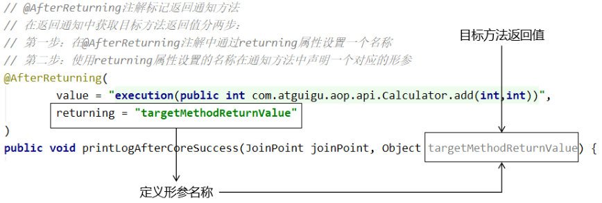

```java
// @AfterReturning注解标记返回通知方法
// 在返回通知中获取目标方法返回值分两步：
// 第一步：在@AfterReturning注解中通过returning属性设置一个名称
// 第二步：使用returning属性设置的名称在通知方法中声明一个对应的形参
@AfterReturning(
        value = "execution(public int com.atguigu.aop.api.Calculator.add(int,int))",
        returning = "targetMethodReturnValue"
)
public void printLogAfterCoreSuccess(JoinPoint joinPoint, Object targetMethodReturnValue) {
    
    String methodName = joinPoint.getSignature().getName();
    
    System.out.println("[AOP返回通知] "+methodName+"方法成功结束了，返回值是：" + targetMethodReturnValue);
}
```

#### 目标方法抛出的异常

在异常通知中，通过`@AfterThrowing`注解的`throwing`属性获取目标方法抛出的异常对象。

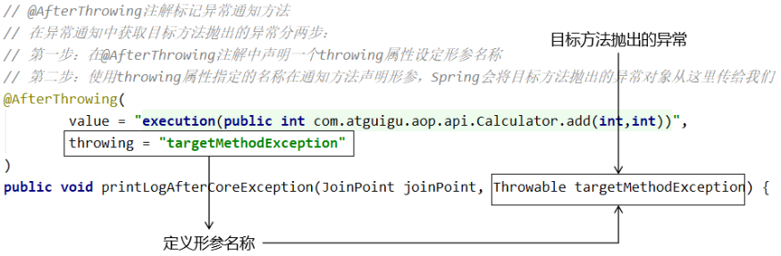

```java
// @AfterThrowing注解标记异常通知方法
// 在异常通知中获取目标方法抛出的异常分两步：
// 第一步：在@AfterThrowing注解中声明一个throwing属性设定形参名称
// 第二步：使用throwing属性指定的名称在通知方法声明形参，Spring会将目标方法抛出的异常对象从这里传给我们
@AfterThrowing(
        value = "execution(public int com.atguigu.aop.api.Calculator.add(int,int))",
        throwing = "targetMethodException"
)
public void printLogAfterCoreException(JoinPoint joinPoint, Throwable targetMethodException) {
    
    String methodName = joinPoint.getSignature().getName();
    
    System.out.println("[AOP异常通知] "+methodName+"方法抛异常了，异常类型是：" + targetMethodException.getClass().getName());
}
```

### 3.5.3 重用切入点表达式

#### 声明

在一处声明切入点表达式之后，其他有需要的地方引用这个切入点表达式。易于维护，一处修改，处处生效。声明方式如下：

```java
    // 切入点表达式重用
    @Pointcut("execution(public int com.atguigu.aop.api.Calculator.add(int,int)))")
    public void declarPointCut() {}
```

#### 同一个类内部引用

```java
@Before(value = "declarPointCut()")
public void printLogBeforeCoreOperation(JoinPoint joinPoint) {
```

#### 在不同类中引用

```java
@Around(value = "com.atguigu.spring.aop.aspect.LogAspect.declarPointCut()")
public Object roundAdvice(ProceedingJoinPoint joinPoint) {
```

#### 集中管理

而作为存放切入点表达式的类，可以把整个项目中所有切入点表达式全部集中过来，便于统一管理：

```java
@Component
public class AtguiguPointCut {
    
    @Pointcut(value = "execution(public int *..Calculator.sub(int,int))")
    public void atguiguGlobalPointCut(){}
    
    @Pointcut(value = "execution(public int *..Calculator.add(int,int))")
    public void atguiguSecondPointCut(){}
    
    @Pointcut(value = "execution(* *..*Service.*(..))")
    public void transactionPointCut(){}
}
```

### 3.5.4 切入点表达式语法

#### 切入点表达式的作用

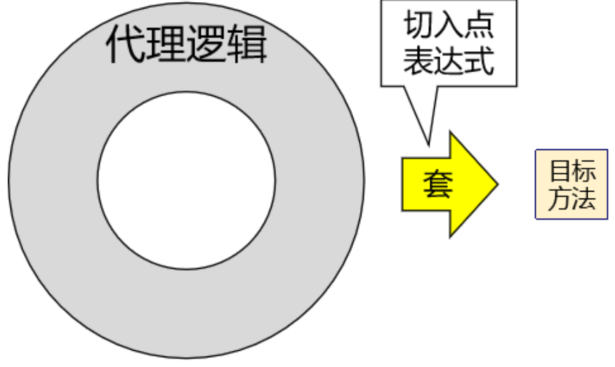

#### 语法细节

- 用`*`号代替“权限修饰符”和“返回值”这两个部分的整体，表示“权限修饰符”和“返回值”不限；
- 在包名的部分，一个`*`号只能代表包的层次结构中的一层，表示这一层是任意的。
    - 例如：`*.Hello`匹配`com.Hello`，不匹配`com.atguigu.Hello`；
- 在包名的部分，使用`*..`表示包名任意、包的层次深度任意；
- 在类名的部分，类名部分整体用`*`号代替，表示类名任意；
- 在类名的部分，可以使用`*`号代替类名的一部分；

```Java
*Service
```

上面例子表示匹配所有名称以`Service`结尾的类或接口。

- 在方法名部分，可以使用`*`号表示方法名任意；
- 在方法名部分，可以使用`*`号代替方法名的一部分；

```java
*Operation
```

上面例子表示匹配所有方法名以Operation结尾的方法。

- 在方法参数列表部分，使用`(..)`表示参数列表任意；
- 在方法参数列表部分，使用`(int,..)`表示参数列表以一个int类型的参数开头；
- 在方法参数列表部分，基本数据类型和对应的包装类型是不一样的：
    - 切入点表达式中使用`int`和实际方法中`Integer`是不匹配的；
- 在方法返回值部分，如果想要明确指定一个返回值类型，那么必须同时写明权限修饰符；

```java
execution(public int *..*Service.*(.., int))
```

上面例子是对的，下面例子是错的：

```Java
execution(* int *..*Service.*(.., int))
```

但是`public *`表示权限修饰符明确，返回值任意是可以的。

- 对于`execution()`表达式整体可以使用三个逻辑运算符号
    - `execution() || execution()`表示满足两个`execution()`中的任何一个即可；
    - `execution() && execution()`表示两个`execution()`表达式必须都满足；
    - `!execution()`表示不满足表达式的其他方法；

#### 总结

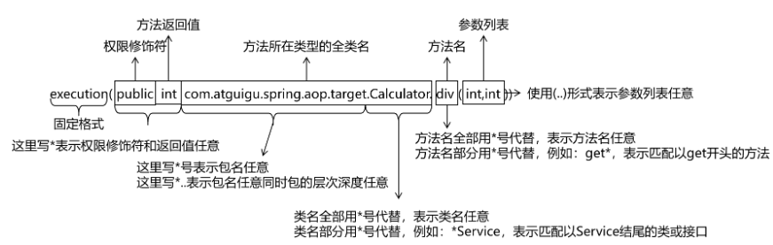

> 虽然我们上面介绍过的切入点表达式语法细节很多，有很多变化，但是实际上具体在项目中应用时有比较固定的写法。
>
> 典型场景：在基于 XML 的声明式事务配置中需要指定切入点表达式。这个切入点表达式通常都会套用到所有 Service 类（接口）的所有方法。那么切入点表达式将如下所示：

```java
execution(* *..*Service.*(..))
```

### 3.5.5 环绕通知

环绕通知对应整个`try...catch...finally`结构，包括前面四种通知的所有功能。

```java
// 使用@Around注解标明环绕通知方法
@Around(value = "com.atguigu.aop.aspect.AtguiguPointCut.transactionPointCut()")
public Object manageTransaction(
    
        // 通过在通知方法形参位置声明ProceedingJoinPoint类型的形参，
        // Spring会将这个类型的对象传给我们
        ProceedingJoinPoint joinPoint) {
    
    // 通过ProceedingJoinPoint对象获取外界调用目标方法时传入的实参数组
    Object[] args = joinPoint.getArgs();
    
    // 通过ProceedingJoinPoint对象获取目标方法的签名对象
    Signature signature = joinPoint.getSignature();
    
    // 通过签名对象获取目标方法的方法名
    String methodName = signature.getName();
    
    // 声明变量用来存储目标方法的返回值
    Object targetMethodReturnValue = null;
    
    try {
    
        // 在目标方法执行前：开启事务（模拟）
        log.debug("[AOP 环绕通知] 开启事务，方法名：" + methodName + "，参数列表：" + Arrays.asList(args));
    
        // 过ProceedingJoinPoint对象调用目标方法
        // 目标方法的返回值一定要返回给外界调用者
        targetMethodReturnValue = joinPoint.proceed(args);
    
        // 在目标方法成功返回后：提交事务（模拟）
        log.debug("[AOP 环绕通知] 提交事务，方法名：" + methodName + "，方法返回值：" + targetMethodReturnValue);
    
    }catch (Throwable e){
    
        // 在目标方法抛异常后：回滚事务（模拟）
        log.debug("[AOP 环绕通知] 回滚事务，方法名：" + methodName + "，异常：" + e.getClass().getName());
    
    }finally {
    
        // 在目标方法最终结束后：释放数据库连接
        log.debug("[AOP 环绕通知] 释放数据库连接，方法名：" + methodName);
    
    }
    
    return targetMethodReturnValue;
}
```

### 3.5.6 切面的优先级

#### 概念

相同目标方法上同时存在多个切面时，切面的优先级控制切面的内外嵌套顺序。

- 优先级高的切面：外面；
- 优先级低的切面：里面；

使用`@Order`注解可以控制切面的优先级：

- `@Order`(较小的数)：优先级高；
- `@Order`(较大的数)：优先级低；

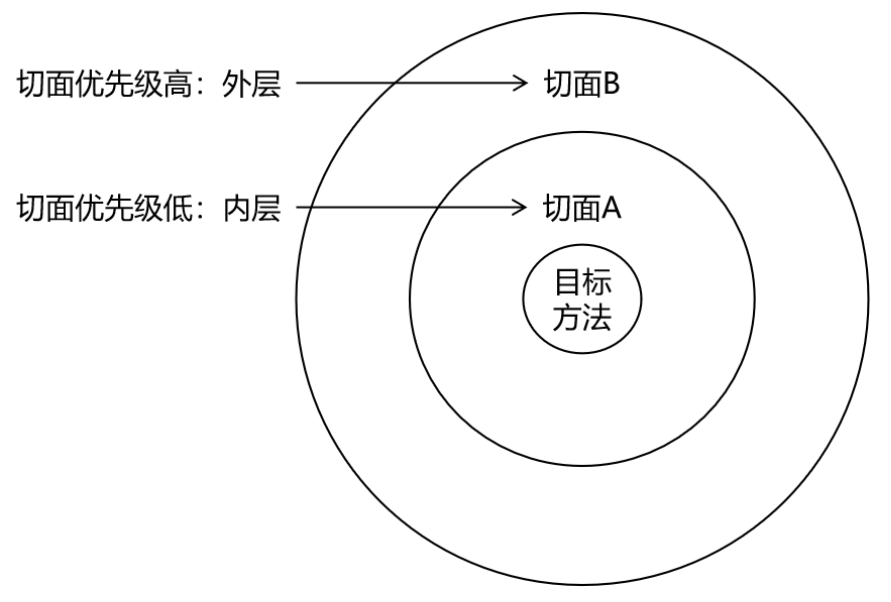

#### 实际意义

实际开发时，如果有多个切面嵌套的情况，要慎重考虑。例如：如果事务切面优先级高，那么在缓存中命中数据的情况下，事务切面的操作都浪费了。

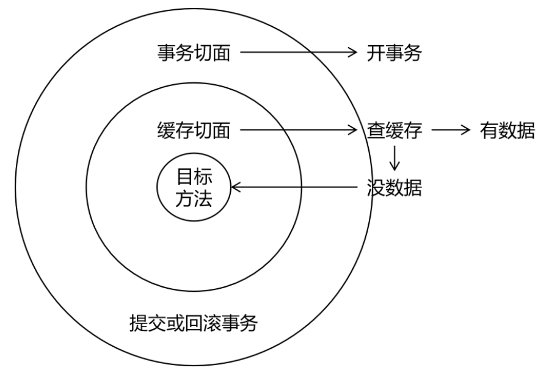

此时应该将缓存切面的优先级提高，在事务操作之前先检查缓存中是否存在目标数据。

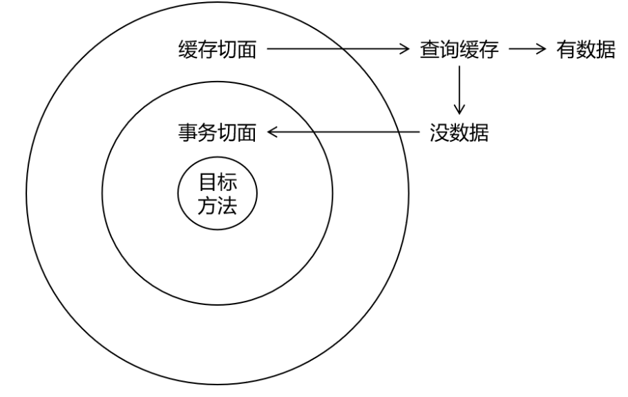

### 3.5.7 没有接口的情况

在目标类没有实现任何接口的情况下，Spring会自动使用`cglib`技术实现代理。

Mybatis 调用的 Mapper 接口类型的对象其实也是动态代理机制。


## 3.6 基于XML的AOP

### 3.6.1 加入依赖

和基于注解的AOP时一样，把测试基于注解功能时的Java类复制到新module中，去除所有注解。

### 3.6.2 配置Spring配置文件

```xml
<!-- 配置目标类的bean -->
<bean id="calculatorPure" class="com.atguigu.aop.imp.CalculatorPureImpl"/>
    
<!-- 配置切面类的bean -->
<bean id="logAspect" class="com.atguigu.aop.aspect.LogAspect"/>
    
<!-- 配置AOP -->
<aop:config>
    
    <!-- 配置切入点表达式 -->
    <aop:pointcut id="logPointCut" expression="execution(* *..*.*(..))"/>
    
    <!-- aop:aspect标签：配置切面 -->
    <!-- ref属性：关联切面类的bean -->
    <aop:aspect ref="logAspect">
        <!-- aop:before标签：配置前置通知 -->
        <!-- method属性：指定前置通知的方法名 -->
        <!-- pointcut-ref属性：引用切入点表达式 -->
        <aop:before method="printLogBeforeCore" pointcut-ref="logPointCut"/>
    
        <!-- aop:after-returning标签：配置返回通知 -->
        <!-- returning属性：指定通知方法中用来接收目标方法返回值的参数名 -->
        <aop:after-returning
                method="printLogAfterCoreSuccess"
                pointcut-ref="logPointCut"
                returning="targetMethodReturnValue"/>
    
        <!-- aop:after-throwing标签：配置异常通知 -->
        <!-- throwing属性：指定通知方法中用来接收目标方法抛出异常的异常对象的参数名 -->
        <aop:after-throwing
                method="printLogAfterCoreException"
                pointcut-ref="logPointCut"
                throwing="targetMethodException"/>
    
        <!-- aop:after标签：配置后置通知 -->
        <aop:after method="printLogCoreFinallyEnd" pointcut-ref="logPointCut"/>
    
        <!-- aop:around标签：配置环绕通知 -->
        <!--<aop:around method="……" pointcut-ref="logPointCut"/>-->
    </aop:aspect>
    
</aop:config>
```

### 3.6.3 测试

```java
@RunWith(SpringJUnit4ClassRunner.class)
@ContextConfiguration(value = {"classpath:spring-context.xml"})
@Slf4j
public class AOPTest {
    
    @Autowired
    private Calculator calculator;
    
    @Test
    public void testLogAspect() {
        int add = calculator.add(10, 2);
        log.debug("add = " + add);
    }
}
```

## 3.7 AOP对获取bean的影响

### 3.7.1 实现接口类的应用切面

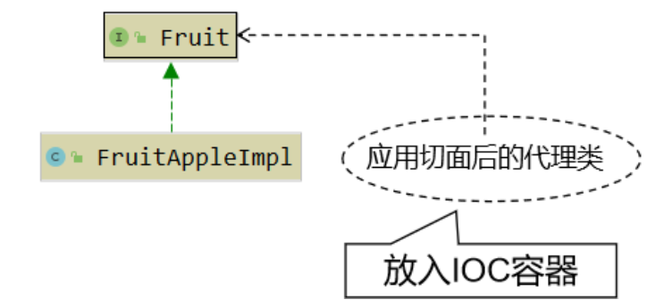

### 3.7.2 没实现接口类的应用切面

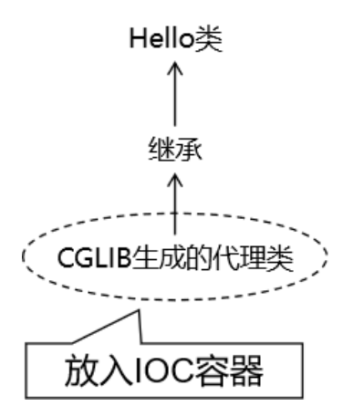

# 4 声明式事务

## 4.1 `JDBCTemplate`

### 4.1.1 简介

为了在特定领域帮助我们简化代码，Spring封装了很多『Template』形式的模板类。例如：`RedisTemplate`、`RestTemplate` 等等，包括我们今天要学习的`JDBCTemplate`。

### 4.1.2 加入依赖和资源文件

```xml
<dependencies>

    <!-- 基于Maven依赖传递性，导入spring-context依赖即可导入当前所需所有jar包 -->
    <dependency>
        <groupId>org.springframework</groupId>
        <artifactId>spring-context</artifactId>
        <version>5.3.1</version>
    </dependency>

    <!-- Spring 持久化层支持jar包 -->
    <!-- Spring 在执行持久化层操作、与持久化层技术进行整合过程中，需要使用orm、jdbc、tx三个jar包 -->
    <!-- 导入 orm 包就可以通过 Maven 的依赖传递性把其他两个也导入 -->
    <dependency>
        <groupId>org.springframework</groupId>
        <artifactId>spring-orm</artifactId>
        <version>5.3.1</version>
    </dependency>

    <!-- Spring 测试相关 -->
    <dependency>
        <groupId>org.springframework</groupId>
        <artifactId>spring-test</artifactId>
        <version>5.3.1</version>
        <scope>test</scope>
    </dependency>

    <!-- junit测试 -->
    <dependency>
        <groupId>junit</groupId>
        <artifactId>junit</artifactId>
        <version>4.12</version>
        <scope>test</scope>
    </dependency>

    <!-- MySQL驱动 -->
    <dependency>
        <groupId>mysql</groupId>
        <artifactId>mysql-connector-java</artifactId>
        <version>5.1.3</version>
    </dependency>
    
    <!-- 数据源 -->
    <dependency>
        <groupId>com.alibaba</groupId>
        <artifactId>druid</artifactId>
        <version>1.0.31</version>
    </dependency>
    
    <!-- 日志 -->
    <dependency>
        <groupId>ch.qos.logback</groupId>
        <artifactId>logback-classic</artifactId>
        <version>1.2.3</version>
    </dependency>

    <!-- Lombok -->
    <dependency>
        <groupId>org.projectlombok</groupId>
        <artifactId>lombok</artifactId>
        <version>1.18.12</version>
        <scope>provided</scope>
    </dependency>

</dependencies>
```

#### jdbc.properties

```properties
atguigu.url=jdbc:mysql://localhost:3306/mybatis-example
atguigu.driver=com.mysql.jdbc.Driver
atguigu.username=root
atguigu.password=atguigu
```

#### Spring配置文件

```xml
<?xml version="1.0" encoding="UTF-8"?>
<beans xmlns="http://www.springframework.org/schema/beans"
       xmlns:xsi="http://www.w3.org/2001/XMLSchema-instance"
       xmlns:context="http://www.springframework.org/schema/context"
       xsi:schemaLocation="http://www.springframework.org/schema/beans http://www.springframework.org/schema/beans/spring-beans.xsd http://www.springframework.org/schema/context https://www.springframework.org/schema/context/spring-context.xsd">

    <!-- 导入外部属性文件 -->
    <context:property-placeholder location="classpath:jdbc.properties" />

    <!-- 配置数据源 -->
    <bean id="druidDataSource" class="com.alibaba.druid.pool.DruidDataSource">
        <property name="url" value="${atguigu.url}"/>
        <property name="driverClassName" value="${atguigu.driver}"/>
        <property name="username" value="${atguigu.username}"/>
        <property name="password" value="${atguigu.password}"/>
    </bean>

    <!-- 配置 JdbcTemplate -->
	<bean id="jdbcTemplate" class="org.springframework.jdbc.core.JdbcTemplate">      
        <!-- 装配数据源 -->
        <property name="dataSource" ref="druidDataSource"/>        
	</bean>
</beans>
```

#### 测试

```java
@Slf4j
@RunWith(SpringJUnit4ClassRunner.class)
@ContextConfiguration(value = {"classpath:spring-context.xml"})
public class JDBCTest {
    
    @Autowired
    private DataSource dataSource;
    
    @Autowired
    private JdbcTemplate jdbcTemplate;
        
    @Test
    public void testJdbcTemplateUpdate() {
        
    }
    
    @Test
    public void testConnection() throws SQLException {
        Connection connection = dataSource.getConnection();
    
        log.debug("connection = " + connection);
    }
    
}
```

### 4.1.3 基本用法

#### 增删改操作

```java
@Test
public void testJdbcTemplateUpdate() {
    
    // 1.编写 SQL 语句。需要传参的地方写问号占位符
    String sql = "update t_emp set emp_salary=? where emp_id=?";
    
    // 2.调用 jdbcTemplate 的 update() 方法执行 update 语句
    int count = jdbcTemplate.update(sql, 999.99, 3);
    
    log.debug("count = " + count);
    
}
```

#### 查询返回简单类型

```java
@Test
public void testJdbcTemplateQueryForSingleValue() {
    
    // 1.编写 SQL 语句
    String sql = "select emp_name from t_emp where emp_id=?";
    
    // 2.调用 jdbcTemplate 的方法执行查询
    String empName = jdbcTemplate.queryForObject(sql, String.class, 6);
    
    log.debug("empName = " + empName);
    
}
```

#### 查询返回实体类型

```java
@Test
public void testJdbcTemplateQueryForEntity() {
    
    // 1.编写 SQL 语句
    String sql = "select emp_id,emp_name,emp_salary from t_emp where emp_id=?";
    
    // 2.准备 RowMapper 对象
    RowMapper<Emp> rowMapper = new BeanPropertyRowMapper<>(Emp.class);
    
    // 3.调用 jdbcTemplate 的方法执行查询
    Emp emp = jdbcTemplate.queryForObject(sql, rowMapper, 7);
    
    log.debug("emp = " + emp);
    
}
```

## 4.2 声明式事务概念

### 4.2.1 声明式事务

既然事务控制的代码有规律可循，代码的结构基本是确定的，所以框架就可以将固定模式的代码抽取出来，进行相关的封装。封装起来后，我们只需要在配置文件中进行简单的配置即可完成操作。

- 好处1：提高开发效率；
- 好处2：消除了冗余的代码；
- 好处3：框架会综合考虑相关领域中在实际开发环境下有可能遇到的各种问题，进行了健壮性、性能等各个方面的优化；

所以，我们可以总结下面两个概念：

- 编程式：自己写代码实现功能；
- 声明式：通过配置让框架实现功能；

### 4.2.2 事务管理器

```java
public interface PlatformTransactionManager {

  TransactionStatus getTransaction(TransactionDefinition definition) throws TransactionException;

  void commit(TransactionStatus status) throws TransactionException;

  void rollback(TransactionStatus status) throws TransactionException;

}
```

#### 技术体系

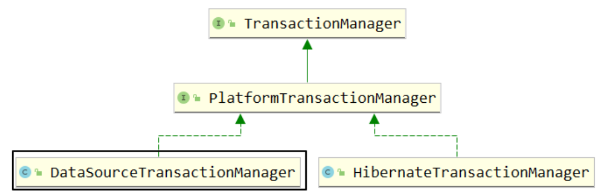

我们现在要使用的事务管理器是`org.springframework.jdbc.datasource.DataSourceTransactionManager`，将来整合Mybatis用的也是这个类。

`DataSourceTransactionManager`类中的主要方法：

- `doBegin()`：开启事务；
- `doSuspend()`：挂起事务；
- `doResume()`：恢复挂起的事务；
- `doCommit()`：提交事务；
- `doRollback()`：回滚事务；

## 4.3 基于注解的声明式事务

### 4.3.1 准备工作

#### 加入依赖

```xml
    <dependencies>
    
        <!-- 基于Maven依赖传递性，导入spring-context依赖即可导入IOC容器所需所有jar包 -->
        <dependency>
            <groupId>org.springframework</groupId>
            <artifactId>spring-context</artifactId>
            <version>5.3.1</version>
        </dependency>
    
        <!-- Spring 持久化层支持jar包 -->
        <!-- Spring 在执行持久化层操作、与持久化层技术进行整合过程中，需要使用orm、jdbc、tx三个jar包 -->
        <!-- 导入 orm 包就可以通过 Maven 的依赖传递性把其他两个也导入 -->
        <dependency>
            <groupId>org.springframework</groupId>
            <artifactId>spring-orm</artifactId>
            <version>5.3.1</version>
        </dependency>
    
        <!-- Spring 测试相关 -->
        <dependency>
            <groupId>org.springframework</groupId>
            <artifactId>spring-test</artifactId>
            <version>5.3.1</version>
        </dependency>
    
        <!-- junit测试 -->
        <dependency>
            <groupId>junit</groupId>
            <artifactId>junit</artifactId>
            <version>4.12</version>
            <scope>test</scope>
        </dependency>
    
        <!-- MySQL驱动 -->
        <dependency>
            <groupId>mysql</groupId>
            <artifactId>mysql-connector-java</artifactId>
            <version>5.1.3</version>
        </dependency>
        <!-- 数据源 -->
        <dependency>
            <groupId>com.alibaba</groupId>
            <artifactId>druid</artifactId>
            <version>1.0.31</version>
        </dependency>
        
        <!-- 日志 -->
        <dependency>
            <groupId>ch.qos.logback</groupId>
            <artifactId>logback-classic</artifactId>
            <version>1.2.3</version>
        </dependency>

        <!-- Lombok -->
        <dependency>
            <groupId>org.projectlombok</groupId>
            <artifactId>lombok</artifactId>
            <version>1.18.12</version>
            <scope>provided</scope>
        </dependency>
    
    </dependencies>
```

#### 外部属性文件

```properties
atguigu.url=jdbc:mysql://localhost:3306/mybatis-example
atguigu.driver=com.mysql.jdbc.Driver
atguigu.username=root
atguigu.password=atguigu
```

#### Spring配置文件

```xml
<!-- 配置自动扫描的包 -->
<context:component-scan base-package="com.atguigu.tx"/>

<!-- 导入外部属性文件 -->
<context:property-placeholder location="classpath:jdbc.properties" />
    
<!-- 配置数据源 -->
<bean id="druidDataSource" class="com.alibaba.druid.pool.DruidDataSource">
    <property name="url" value="${atguigu.url}"/>
    <property name="driverClassName" value="${atguigu.driver}"/>
    <property name="username" value="${atguigu.username}"/>
    <property name="password" value="${atguigu.password}"/>
</bean>
    
<!-- 配置 JdbcTemplate -->
<bean id="jdbcTemplate" class="org.springframework.jdbc.core.JdbcTemplate">
    
    <!-- 装配数据源 -->
    <property name="dataSource" ref="druidDataSource"/>
    
</bean>
```

#### 测试类

```java
@Slf4j
@RunWith(SpringJUnit4ClassRunner.class)
@ContextConfiguration(value = {"classpath:spring-context.xml"})
public class JDBCTest {
   
}
```

#### 创建组件

```java
@Repository
public class EmpDao {
    
    @Autowired
    private JdbcTemplate jdbcTemplate;
        
    public void updateEmpNameById(Integer empId, String empName) {
        String sql = "update t_emp set emp_name=? where emp_id=?";
        jdbcTemplate.update(sql, empName, empId);
    }
        
    public void updateEmpSalaryById(Integer empId, Double salary) {
        String sql = "update t_emp set emp_salary=? where emp_id=?";
        jdbcTemplate.update(sql, salary, empId);
    }
        
    public String selectEmpNameById(Integer empId) {
        String sql = "select emp_name from t_emp where emp_id=?";
    
        String empName = jdbcTemplate.queryForObject(sql, String.class, empId);
    
        return empName;
    }
    
}
```

`EmpDao`准备好之后最好测试一下，确认代码正确。养成随写随测的好习惯。

在三层结构中，事务通常都是加到业务逻辑层，针对Service类使用事务。

```java
@Service
public class EmpService {
    
    @Autowired
    private EmpDao empDao;
    
    // 为了便于核对数据库操作结果，不要修改同一条记录
    public void updateTwice(
            // 修改员工姓名的一组参数
            Integer empId4EditName, String newName,

            // 修改员工工资的一组参数
            Integer empId4EditSalary, Double newSalary
            ) {
    
        // 为了测试事务是否生效，执行两个数据库操作，看它们是否会在某一个失败时一起回滚
        empDao.updateEmpNameById(empId4EditName, newName);
    
        empDao.updateEmpSalaryById(empId4EditSalary, newSalary);
    }    
}
```

### 4.3.2 应用最基本的事务控制

#### 加事务前状态

修改`EmpDao`中的`updateEmpSalaryById()`方法：

```java
public void updateEmpSalaryById(Integer empId, Double salary) {

    // 为了看到操作失败后的效果人为将 SQL 语句破坏
    String sql = "upd222ate t_emp set emp_salary=? where emp_id=?";
    jdbcTemplate.update(sql, salary, empId);
}
```

```java
@Test
public void testBaseTransaction() {
    
    Integer empId4EditName = 2;
    String newName = "new-name";
    
    Integer empId4EditSalary = 3;
    Double newSalary = 444.44;
    
    empService.updateTwice(empId4EditName, newName, empId4EditSalary, newSalary);
    
}
```

效果：修改姓名的操作生效了，修改工资的操作没有生效。

#### 添加事务功能

**<u>配置事务管理器：</u>**

```xml
<!-- 配置事务管理器 -->
<bean id="transactionManager" class="org.springframework.jdbc.datasource.DataSourceTransactionManager">
   
    <!-- 事务管理器的bean只需要装配数据源，其他属性保持默认值即可 -->
    <property name="dataSource" ref="druidDataSource"/>
</bean>
```

#### 开启基于注解的声明式事务功能

```xml
<!-- 开启基于注解的声明式事务功能 -->
<!-- 使用transaction-manager属性指定当前使用是事务管理器的bean -->
<!-- transaction-manager属性的默认值是transactionManager，如果事务管理器bean的id正好就是这个默认值，则可以省略这个属性 -->
<tx:annotation-driven transaction-manager="transactionManager"/>
```

注意：导入名称空间时有好几个重复的，我们需要的是tx结尾的那个。

#### 在Service方法上添加注解

```java
@Transactional
public void updateTwice(
        // 修改员工姓名的一组参数
        Integer empId4EditName, String newName,
 
        // 修改员工工资的一组参数
        Integer empId4EditSalary, Double newSalary
        ) {
 
    // 为了测试事务是否生效，执行两个数据库操作，看它们是否会在某一个失败时一起回滚
    empDao.updateEmpNameById(empId4EditName, newName);
 
    empDao.updateEmpSalaryById(empId4EditSalary, newSalary); 
}
```

### 4.3.3 只读

#### 介绍

对一个查询操作来说，如果我们把它设置成只读，就能够明确告诉数据库，这个操作不涉及写操作。这样数据库就能够针对查询操作来进行优化。

#### 设置方式

```java
// readOnly = true把当前事务设置为只读
@Transactional(readOnly = true)
public String getEmpName(Integer empId) {
      
    return empDao.selectEmpNameById(empId);
}
```

#### `@Transactional`注解放在类中

如果一个类中每一个方法上都使用了 @Transactional 注解，那么就可以将 @Transactional 注解提取到类上。反过来说：@Transactional 注解在类级别标记，会影响到类中的每一个方法。同时，类级别标记的 @Transactional 注解中设置的事务属性也会延续影响到方法执行时的事务属性。除非在方法上又设置了 @Transactional 注解。

对一个方法来说，离它最近的 @Transactional 注解中的事务属性设置生效。

### 4.3.4 超时

#### 需求

事务在执行过程中，有可能因为遇到某些问题，导致程序卡住，从而长时间占用数据库资源。而长时间占用资源，大概率是因为程序运行出现了问题（可能是Java程序或MySQL数据库或网络连接等等）。

此时这个很可能出问题的程序应该被回滚，撤销它已做的操作，事务结束，把资源让出来，让其他正常程序可以执行。

概括来说就是一句话：**<u>超时回滚，释放资源</u>**。

#### 设置

```java
@Transactional(readOnly = false, timeout = 3)
public void updateTwice(
        // 修改员工姓名的一组参数
        Integer empId4EditName, String newName,

        // 修改员工工资的一组参数
        Integer empId4EditSalary, Double newSalary
        ) {

    // 为了测试事务是否生效，执行两个数据库操作，看它们是否会在某一个失败时一起回滚
    empDao.updateEmpNameById(empId4EditName, newName);

    empDao.updateEmpSalaryById(empId4EditSalary, newSalary);

}
```

### 4.3.5 回滚和不回滚的异常

#### 默认情况

默认只针对**运行时异常**回滚，编译时异常不回滚。情景模拟代码如下：

```Java
public void updateEmpSalaryById(Integer empId, Double salary) throws FileNotFoundException {
    
  // 为了看到操作失败后的效果人为将 SQL 语句破坏
  String sql = "update t_emp set emp_salary=? where emp_id=?";
  jdbcTemplate.update(sql, salary, empId);
    
//  抛出编译时异常测试是否回滚
  new FileInputStream("aaaa.aaa");
    
//  抛出运行时异常测试是否回滚
//  System.out.println(10 / 0);
}
```

#### 设置回滚的异常

- `rollbackFor`属性：需要设置一个Class类型的对象；
- `rollbackForClassName`属性：需要设置一个字符串类型的全类名；

```Java
@Transactional(rollbackFor = Exception.class)
```

#### 设置不回滚的异常

在默认设置和已有设置的基础上，再指定一个异常类型，碰到它不回滚。

```Java
    @Transactional(
            noRollbackFor = FileNotFoundException.class
    )
```

#### 回滚和不回滚同时设置

不管是哪个设置范围大，都是在大范围内再排除小范围的设定。例如：

- `rollbackFor = Exception.class`
- `noRollbackFor = FileNotFoundException.class`

意思是除了`FileNotFoundException`之外，其他所有`Exception`范围的异常都回滚；但是碰到`FileNotFoundException`不回滚。

### 4.3.6 事务隔离级别

#### 问题

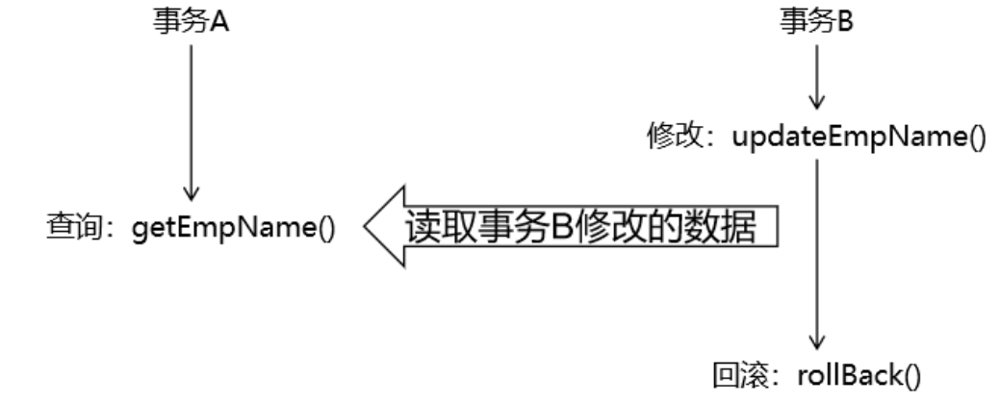

#### 测试读未提交

在`@Transactional`注解中使用`isolation`属性设置事务的隔离级别。 取值使用`org.springframework.transaction.annotation.Isolation`枚举类提供的数值。

```java
@Transactional(isolation = Isolation.READ_UNCOMMITTED)
public String getEmpName(Integer empId) {
    
    return empDao.selectEmpNameById(empId);
}
    
@Transactional(isolation = Isolation.READ_UNCOMMITTED, readOnly = false)
public void updateEmpName(Integer empId, String empName) {
    
    empDao.updateEmpNameById(empId, empName);
}
```

测试结果：执行查询操作的事务读取了另一个尚未提交的修改。

#### 测试读已提交

```java
@Transactional(isolation = Isolation.READ_COMMITTED)
public String getEmpName(Integer empId) {
    
    return empDao.selectEmpNameById(empId);
}
    
@Transactional(isolation = Isolation.READ_COMMITTED, readOnly = false)
public void updateEmpName(Integer empId, String empName) {
    
    empDao.updateEmpNameById(empId, empName);
}
```

测试结果：执行查询操作的事务读取的是数据库中正确的数据。

### 4.3.7 事务传播行为

#### 问题

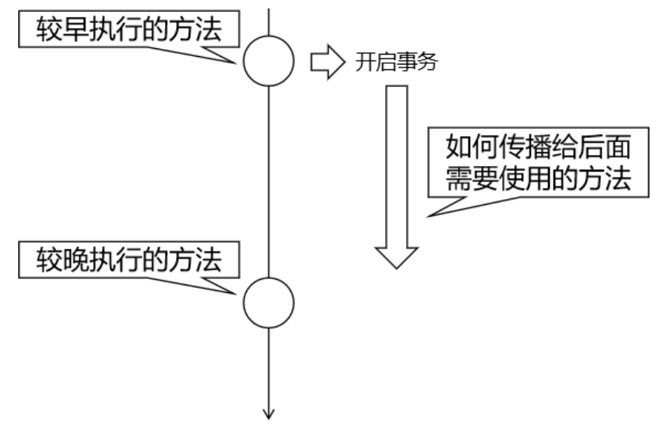

#### `propagation`属性

`@Transactional`注解通过`propagation`属性设置事务的传播行为。它的默认值是：

```Java
Propagation propagation() default Propagation.REQUIRED;
```

propagation 属性的可选值由 org.springframework.transaction.annotation.Propagation 枚举类提供：

| 名称                       | 含义                                                         |
| -------------------------- | ------------------------------------------------------------ |
| REQUIRED  <br>默认值       | 当前方法必须工作在事务中  <br>如果当前线程上有已经开启的事务可用，那么就在这个事务中运行  <br>如果当前线程上没有已经开启的事务，那么就自己开启新事务，在新事务中运行  <br>所以当前方法有可能和其他方法共用事务  <br>在共用事务的情况下：当前方法会因为其他方法回滚而受连累 |
| REQUIRES_NEW  <br>建议使用 | 当前方法必须工作在事务中  <br>不管当前线程上是否有已经开启的事务，都要开启新事务  <br>在新事务中运行  <br>不会和其他方法共用事务，避免被其他方法连累 |

#### 测试

**<u>在`EmpService`中声明两个内层方法：</u>**

```java
@Transactional(readOnly = false, propagation = Propagation.REQUIRED)
public void updateEmpNameInner(Integer empId, String empName) {
    
    empDao.updateEmpNameById(empId, empName);
}

@Transactional(readOnly = false, propagation = Propagation.REQUIRED)
public void updateEmpSalaryInner(Integer empId, Double empSalary) {
    
    empDao.updateEmpSalaryById(empId, empSalary);
}
```

**<u>创建`TopService`：</u>**

```java
@Service
public class TopService {
    
    // 这里我们只是为了测试事务传播行为，临时在Service中装配另一个Service
    // 实际开发时非常不建议这么做，因为这样会严重破坏项目的结构
    @Autowired
    private EmpService empService;
    
    @Transactional
    public void topTxMethod() {
    
        // 在外层方法中调用两个内层方法
        empService.updateEmpNameInner(2, "aaa");
        
        empService.updateEmpSalaryInner(3, 666.66);
    }
}
```

**<u>测试方法：</u>**

```java
@Autowired
private TopService topService;
    
@Test
public void testPropagation() {
    
    // 调用外层方法
    topService.topTxMethod();
    
}
```

#### REQUIRED模式

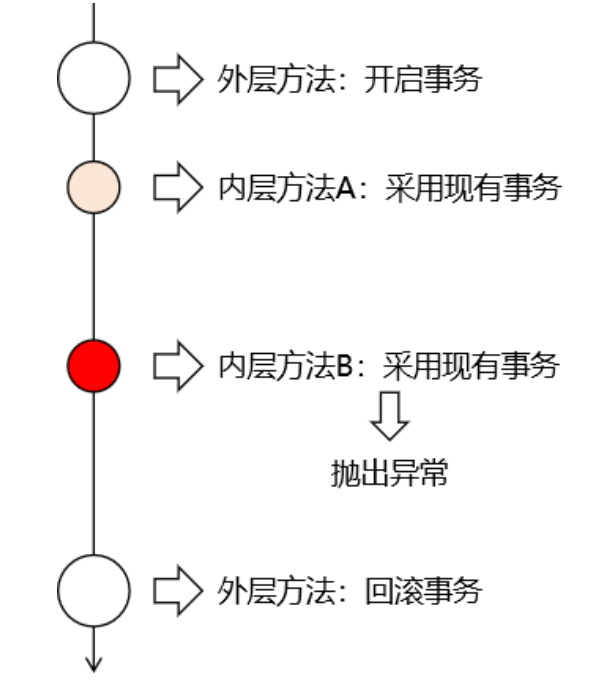

#### REQUIRES_NEW模式

```java
@Transactional(readOnly = false, propagation = Propagation.REQUIRES_NEW)
public void updateEmpNameInner(Integer empId, String empName) {
    
    empDao.updateEmpNameById(empId, empName);
}
    
@Transactional(readOnly = false, propagation = Propagation.REQUIRES_NEW)
public void updateEmpSalaryInner(Integer empId, Double empSalary) {
    
    empDao.updateEmpSalaryById(empId, empSalary);
}
```

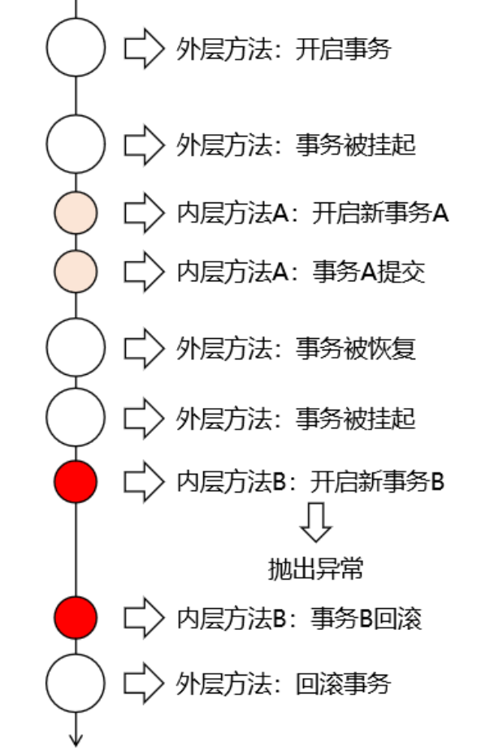

#### 实际开发场景

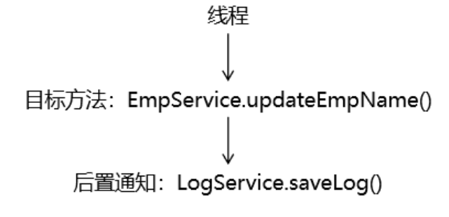

**<u>过滤器或拦截器组件：</u>**

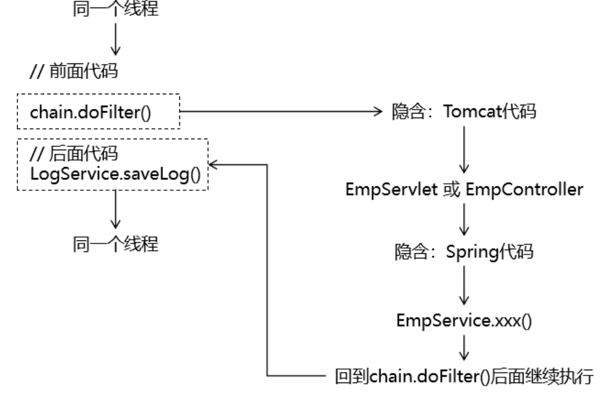

#### 总结

我们在事务传播行为这里，使用`REQUIRES_NEW`属性，也可以说是让不同事务方法从事务的使用上解耦合，不要互相影响。

## 4.4 基于XML的声明式事务

### 4.4.1 加入依赖

相比于基于注解的声明式事务，基于 XML 的声明式事务需要一个额外的依赖：

```XML
<dependency>
    <groupId>org.springframework</groupId>
    <artifactId>spring-aspects</artifactId>
    <version>5.3.1</version>
</dependency>
```

### 4.4.2 修改Spring配置文件

去掉 tx:annotation-driven 标签，然后加入下面的配置：

```XML
<aop:config>
    <!-- 配置切入点表达式，将事务功能定位到具体方法上 -->
    <aop:pointcut id="txPoincut" expression="execution(* *..*Service.*(..))"/>
    
    <!-- 将事务通知和切入点表达式关联起来 -->
    <aop:advisor advice-ref="txAdvice" pointcut-ref="txPoincut"/>
    
</aop:config>
    
<!-- tx:advice标签：配置事务通知 -->
<!-- id属性：给事务通知标签设置唯一标识，便于引用 -->
<!-- transaction-manager属性：关联事务管理器 -->
<tx:advice id="txAdvice" transaction-manager="transactionManager">
    <tx:attributes>
    
        <!-- tx:method标签：配置具体的事务方法 -->
        <!-- name属性：指定方法名，可以使用星号代表多个字符 -->
        <tx:method name="get*" read-only="true"/>
        <tx:method name="query*" read-only="true"/>
        <tx:method name="find*" read-only="true"/>
    
        <!-- read-only属性：设置只读属性 -->
        <!-- rollback-for属性：设置回滚的异常 -->
        <!-- no-rollback-for属性：设置不回滚的异常 -->
        <!-- isolation属性：设置事务的隔离级别 -->
        <!-- timeout属性：设置事务的超时属性 -->
        <!-- propagation属性：设置事务的传播行为 -->
        <tx:method name="save*" read-only="false" rollback-for="java.lang.Exception" propagation="REQUIRES_NEW"/>
        <tx:method name="update*" read-only="false" rollback-for="java.lang.Exception" propagation="REQUIRES_NEW"/>
        <tx:method name="delete*" read-only="false" rollback-for="java.lang.Exception" propagation="REQUIRES_NEW"/>
    </tx:attributes>
</tx:advice>
```

即使需要事务功能的目标方法已经被切入点表达式涵盖到了，但是如果没有给它配置事务属性，那么这个方法就还是没有事务。所以事务属性必须配置。
