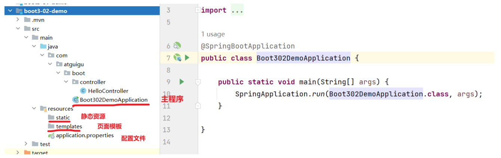
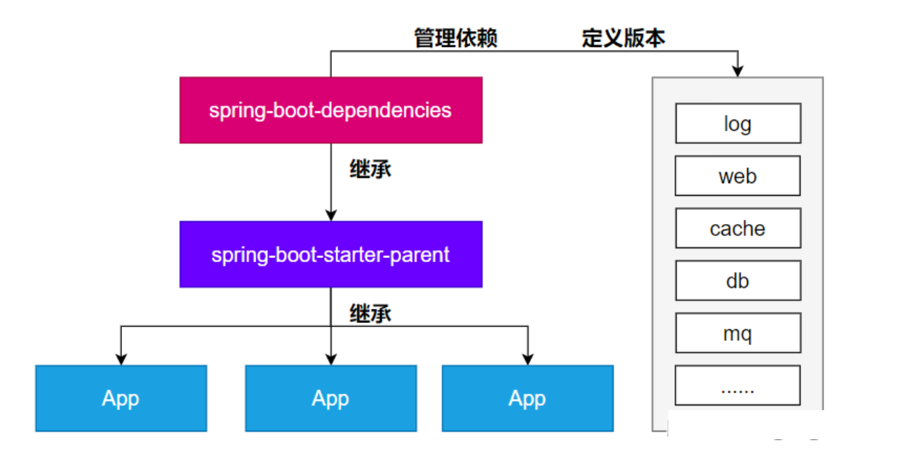
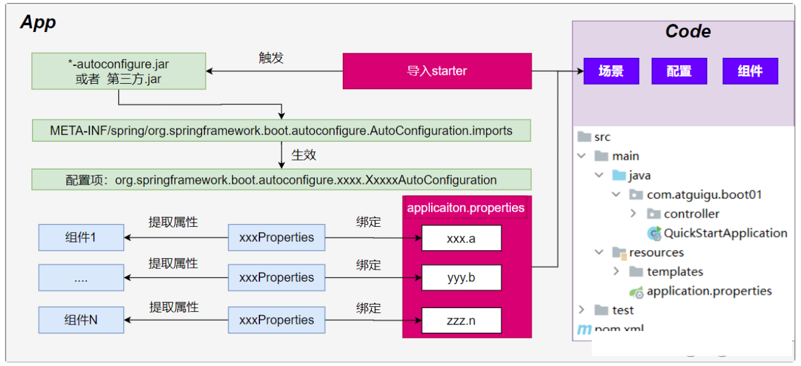
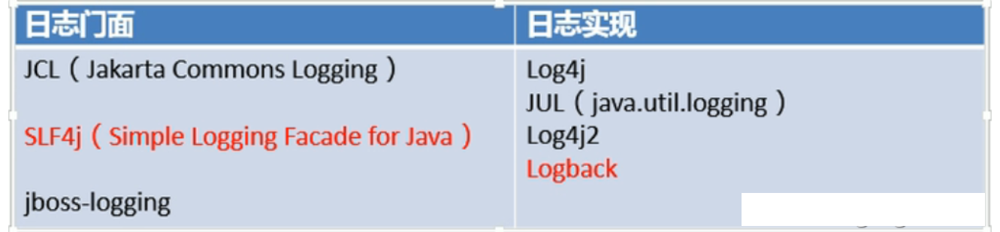
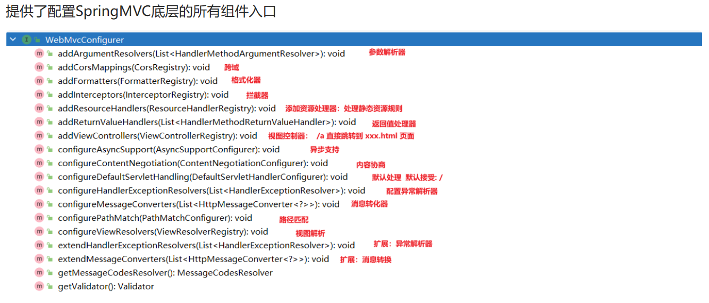

# SpringBoot

**@author: Shuxin_Wang**

**@time: 2023.04.15**

---

[toc]

---

# 1 SpringBoot快速入门


## 1.1 SpringBoot简介

### 1.1.1 简介

SpringBoot是一个集成了Spring技术栈的一个大整合，是一个简化了Spring应用开发的框架，可以一站式解决J2EE的开发流程。

### 1.1.2 特征

- `SpringBoot Starter`：他将常用的依赖分组进行了整合，将其合并到一个依赖中，这样就可以一次性添加到项目的`Maven`或`Gradle`构建中；
- 使编码变得简单，`SpringBoot`采用 `JavaConfig`的方式对Spring进行配置，并且提供了大量的注解，极大的提高了工作效率，比如`@Configuration`和`@bean`注解结合，基于`@Configuration`完成类扫描，基于`@bean`注解把返回值注入IOC容器；
- 自动配置：`SpringBoot`的自动配置特性利用了Spring对条件化配置的支持，合理地推测应用所需的bean并自动化配置他们；
- 使部署变得简单，`SpringBoot`内置了三种Servlet容器，`Tomcat`，`Jetty`，`undertow`.我们只需要一个Java的运行环境就可以跑`SpringBoot`的项目了，`SpringBoot`的项目可以打成一个jar包；

## 1.2 快速体验

> 场景：浏览器发送**/hello**请求，返回"**Hello,Spring Boot 3!**"

### 1.2.1 开发流程

#### 创建项目

maven项目

```xml
<!--    所有springboot项目都必须继承自 spring-boot-starter-parent -->
    <parent>
        <groupId>org.springframework.boot</groupId>
        <artifactId>spring-boot-starter-parent</artifactId>
        <version>3.0.5</version>
    </parent>
```


#### 导入场景

场景启动器

```xml
    <dependencies>
<!--        web开发的场景启动器 -->
        <dependency>
            <groupId>org.springframework.boot</groupId>
            <artifactId>spring-boot-starter-web</artifactId>
        </dependency>
    </dependencies>

```

#### 主程序

```java
@SpringBootApplication //这是一个SpringBoot应用
public class MainApplication {

    public static void main(String[] args) {
        SpringApplication.run(MainApplication.class,args);
    }
}
```

#### 业务

```java
@RestController
public class HelloController {

    @GetMapping("/hello")
    public String hello(){

        return "Hello,Spring Boot 3!";
    }

}
```

#### 测试

默认启动访问： `localhost:8080`

#### 打包

```xml
<!--    SpringBoot应用打包插件-->
    <build>
        <plugins>
            <plugin>
                <groupId>org.springframework.boot</groupId>
                <artifactId>spring-boot-maven-plugin</artifactId>
            </plugin>
        </plugins>
    </build>
```

`mvn clean package`把项目打成可执行的jar包

`java -jar demo.jar`启动项目


### 1.2.2 特征小结

#### 简化整合

导入相关的场景，拥有相关的功能。场景启动器

默认支持的所有场景：https://docs.spring.io/spring-boot/docs/current/reference/html/using.html#using.build-systems.starters

- 官方提供的场景：命名为：`spring-boot-starter-*`
- 第三方提供场景：命名为：`*-spring-boot-starter`

场景一导入，万物皆就绪

#### 简化开发

无需编写任何配置，直接开发业务

#### 简化配置

`application.properties`：

- 集中式管理配置。只需要修改这个文件就行 。
- 配置基本都有默认值
- 能写的所有配置都在： https://docs.spring.io/spring-boot/docs/current/reference/html/application-properties.html#appendix.application-properties

#### 简化部署

打包为可执行的jar包。

linux服务器上有java环境。

#### 简化运维

修改配置（外部放一个application.properties文件）、监控、健康检查。

### 1.2.3 Spring Initializr创建向导



## 1.3 应用分析

### 1.3.1 依赖管理机制

为什么导入`starter-web`所有相关依赖都导入进来？

- 开发什么场景，导入什么**场景启动器。**
- **maven依赖传递原则。A-B-C： A就拥有B和C**
- 导入 场景启动器。 场景启动器 自动把这个场景的所有核心依赖全部导入进来

2、为什么版本号都不用写？

- 每个boot项目都有一个父项目`spring-boot-starter-parent`
- parent的父项目是`spring-boot-dependencies`
- 父项目 **版本仲裁中心**，把所有常见的jar的依赖版本都声明好了。
- 比如：`mysql-connector-j`

3、自定义版本号

- 利用maven的就近原则

- - 直接在当前项目`properties`标签中声明父项目用的版本属性的key
  - 直接在**导入依赖的时候声明版本**

4、第三方的jar包

- boot父项目没有管理的需要自行声明好

```xml
<!-- https://mvnrepository.com/artifact/com.alibaba/druid -->
<dependency>
    <groupId>com.alibaba</groupId>
    <artifactId>druid</artifactId>
    <version>1.2.16</version>
</dependency>

```



### 1.3.2 自动配置机制

#### 初步理解

- **自动配置**的 Tomcat、SpringMVC 等

  - **导入场景**，容器中就会自动配置好这个场景的核心组件。

  - 以前：DispatcherServlet、ViewResolver、CharacterEncodingFilter....
  - 现在：自动配置好的这些组件
  - 验证：**容器中有了什么组件，就具有什么功能**

```java
      public static void main(String[] args) {
  
          //java10： 局部变量类型的自动推断
          var ioc = SpringApplication.run(MainApplication.class, args);
  
          //1、获取容器中所有组件的名字
          String[] names = ioc.getBeanDefinitionNames();
          //2、挨个遍历：
          // dispatcherServlet、beanNameViewResolver、characterEncodingFilter、multipartResolver
          // SpringBoot把以前配置的核心组件现在都给我们自动配置好了。
          for (String name : names) {
              System.out.println(name);
          }
  
      }
```

- **默认的包扫描机制：**

  - `@SpringBootApplication` 标注的类就是主程序类
  - **SpringBoot只会扫描主程序所在的包及其下面的子包，自动的component-scan功能**
  - **自定义扫描路径**
    - @SpringBootApplication(scanBasePackages = "com.atguigu")
    - `@ComponentScan("com.atguigu")` 直接指定扫描的路径

- **配置默认值：**

    - **配置文件**的所有配置项是和某个**类的对象**值进行一一绑定的。
    - 绑定了配置文件中每一项值的类： **属性类**。
    - 比如：

      - `ServerProperties`绑定了所有Tomcat服务器有关的配置
      - `MultipartProperties`绑定了所有文件上传相关的配置
      - ....参照[官方文档](https://docs.spring.io/spring-boot/docs/current/reference/html/application-properties.html#appendix.application-properties.server)：或者参照 绑定的  **属性类**。

- 按需加载自动配置

    - 导入场景`spring-boot-starter-web`

    - 场景启动器除了会导入相关功能依赖，导入一个`spring-boot-starter`，是所有`starter`的`starter`，基础核心starter
    - `spring-boot-starter`导入了一个包 `spring-boot-autoconfigure`。包里面都是各种场景的`AutoConfiguration`**自动配置类**
    - 虽然全场景的自动配置都在 `spring-boot-autoconfigure`这个包，但是不是全都开启的。

      - 导入哪个场景就开启哪个自动配置

总结： 导入场景启动器、触发 `spring-boot-autoconfigure`这个包的自动配置生效、容器中就会具有相关场景的功能


#### 完整流程

1、**SpringBoot怎么实现导一个**`starter`**、写一些简单配置，应用就能跑起来，我们无需关心整合**

2、为什么Tomcat的端口号可以配置在`application.properties`中，并且`Tomcat`能启动成功？

3、导入场景后哪些**自动配置能生效**？



**自动配置流程细节梳理：**

导入`starter-web`：导入了web开发场景

- 1、场景启动器导入了相关场景的所有依赖：`starter-json`、`starter-tomcat`、`springmvc`
- 2、每个场景启动器都引入了一个`spring-boot-starter`，核心场景启动器。
- 3、**核心场景启动器**引入了`spring-boot-autoconfigure`包。
- 4、`spring-boot-autoconfigure`里面囊括了所有场景的所有配置。
- 5、只要这个包下的所有类都能生效，那么相当于SpringBoot官方写好的整合功能就生效了。
- 6、SpringBoot默认却扫描不到 `spring-boot-autoconfigure`下写好的所有**配置类**。（这些**配置类**给我们做了整合操作），**默认只扫描主程序所在的包**。

**主程序**：`@SpringBootApplication`

- 1、`@SpringBootApplication`由三个注解组成`@SpringBootConfiguration`、`@EnableAutoConfiguratio`、`@ComponentScan`
- 2、SpringBoot默认只能扫描自己主程序所在的包及其下面的子包，扫描不到 `spring-boot-autoconfigure`包中官方写好的**配置类**
- 3、`@EnableAutoConfiguration`：SpringBoot **开启自动配置的核心**。
- - 是由`@Import(AutoConfigurationImportSelector.class)`提供功能：批量给容器中导入组件。
  - SpringBoot启动会默认加载 142个配置类。
  - 这**142个配置类**来自于`spring-boot-autoconfigure`下 `META-INF/spring/**org.springframework.boot.autoconfigure.AutoConfiguration**.imports`文件指定的
  - 项目启动的时候利用 @Import 批量导入组件机制把 `autoconfigure` 包下的142 `xxxxAutoConfiguration`类导入进来（**自动配置类**）
  - 虽然导入了`142`个自动配置类
- 4、按需生效：

  - 并不是这`142`个自动配置类都能生效
  - 每一个自动配置类，都有条件注解`@ConditionalOnxxx`，只有条件成立，才能生效 

`xxxxAutoConfiguration`**自动配置类**

- **1、给容器中使用@Bean 放一堆组件。**
- 2、每个**自动配置类**都可能有这个注解`@EnableConfigurationProperties(**ServerProperties**.class)`，用来把配置文件中配的指定前缀的属性值封装到 `xxxProperties`**属性类**中
- 3、以Tomcat为例：把服务器的所有配置都是以`server`开头的。配置都封装到了属性类中。
- 4、给**容器**中放的所有**组件**的一些**核心参数**，都来自于`**xxxProperties**`**。**`**xxxProperties**`**都是和配置文件绑定。**
- **只需要改配置文件的值，核心组件的底层参数都能修改**

写业务，全程无需关心各种整合（底层这些整合写好了，而且也生效了）


==**<u>核心流程总结：</u>**==

1、导入`starter`，就会导入`autoconfigure`包；

2、`autoconfigure` 包里面 有一个文件 `META-INF/spring/**org.springframework.boot.autoconfigure.AutoConfiguration**.imports`,里面指定的所有启动要加载的自动配置类；

3、`@EnableAutoConfiguration` 会自动的把上面文件里面写的所有**自动配置类都导入进来。`xxxAutoConfiguration` 是有条件注解进行按需加载**；

4、`xxxAutoConfiguration`给容器中导入一堆组件，组件都是从 `xxxProperties`中提取属性值；

5、`xxxProperties`又是和**配置文件**进行了绑定；

**效果：**导入`starter`、修改配置文件，就能修改底层行为；


#### 如何学好SpringBoot

框架的框架、底层基于Spring。能调整每一个场景的底层行为。100%项目一定会用到**底层自定义**

1. 理解**自动配置原理**
   - **导入`starter`** **--> 生效`xxxxAutoConfiguration` -->** **组件** **--> `xxxProperties` -->** **配置文件**
2. 理解**其他框架底层**

   - 拦截器
3. 可以随时**定制化任何组件**

   - **配置文件**

   - **自定义组件**

核心：

- 这个场景自动配置导入了哪些组件，我们能不能Autowired进来使用
- 能不能通过修改配置改变组件的一些默认参数
- 需不需要自己完全定义这个组件
- 场景定制化

最佳实践：

- **选场景**，导入到项目
  - 官方：starter
  - 第三方：去仓库搜

- **写配置，改配置文件关键项**

  - 数据库参数（连接地址、账号密码...）

- 分析这个场景给我们导入了**哪些能用的组件**

  - **自动装配**这些组件进行后续使用
  - 不满意boot提供的自动配好的默认组件

    - **定制化**

      - 改配置
      - 自定义组件


整合redis：

- [选场景](https://docs.spring.io/spring-boot/docs/current/reference/html/using.html#using.build-systems.starters)：`spring-boot-starter-data-redis `

  - 场景AutoConfiguration 就是这个场景的自动配置类

- 写配置：

  - 分析到这个场景的自动配置类开启了哪些属性绑定关系
  - `@EnableConfigurationProperties(RedisProperties.class)`
  - 修改redis相关的配置

- 分析组件：

  - 分析到 `RedisAutoConfiguration`  给容器中放了 `StringRedisTemplate`
  - 给业务代码中自动装配 `StringRedisTemplate`

- 定制化

  - 修改配置文件
  - 自定义组件，自己给容器中放一个 `StringRedisTemplate`

## 1.4 核心注解

### 1.4.1 常用注解

`SpringBoot`摒弃XML配置方式，改为**全注解驱动**

#### 组件注册

**`@Configuration`**、**`@SpringBootConfiguration`**

**`@Bean`**、**`@Scope`**

**`@Controller`、 `@Service`、`@Repository`、`@Component`**

**`@Import`**

`@ComponentScan`

步骤：

**1、@Configuration 编写一个配置类**

**2、在配置类中，自定义方法给容器中注册组件。配合@Bean**

**3、或使用@Import 导入第三方的组件**

#### 条件注解

如果注解指定的条件成立，则触发指定行为

***`@ConditionalOnXxx`***

**`@ConditionalOnClass`：如果类路径中存在这个类，则触发指定行为**；

**`@ConditionalOnMissingClass`：如果类路径中不存在这个类，则触发指定行为**；

**`@ConditionalOnBean`：如果容器中存在这个Bean（组件），则触发指定行为**；

**`@ConditionalOnMissingBean`：如果容器中不存在这个Bean（组件），则触发指定行为**；

**`@ConditionalOnBean(value=组件类型，name=组件名字)`：判断容器中是否有这个类型的组件，并且名字是指定的值**


> `@ConditionalOnRepositoryType (org.springframework.boot.autoconfigure.data)`
> `@ConditionalOnDefaultWebSecurity (org.springframework.boot.autoconfigure.security)`
> `@ConditionalOnSingleCandidate (org.springframework.boot.autoconfigure.condition)`
> `@ConditionalOnWebApplication (org.springframework.boot.autoconfigure.condition)`
> `@ConditionalOnWarDeployment (org.springframework.boot.autoconfigure.condition)`
> `@ConditionalOnJndi (org.springframework.boot.autoconfigure.condition)`
> `@ConditionalOnResource (org.springframework.boot.autoconfigure.condition)`
> `@ConditionalOnExpression (org.springframework.boot.autoconfigure.condition)`
> **`@ConditionalOnClass`** (org.springframework.boot.autoconfigure.condition)
> `@ConditionalOnEnabledResourceChain (org.springframework.boot.autoconfigure.web)`
> **`@ConditionalOnMissingClass`** (org.springframework.boot.autoconfigure.condition)
> `@ConditionalOnNotWebApplication (org.springframework.boot.autoconfigure.condition)`
> `@ConditionalOnProperty (org.springframework.boot.autoconfigure.condition)`
> `@ConditionalOnCloudPlatform (org.springframework.boot.autoconfigure.condition)`
> **`@ConditionalOnBean`** (org.springframework.boot.autoconfigure.condition)
> **`@ConditionalOnMissingBean`** (org.springframework.boot.autoconfigure.condition)
> `@ConditionalOnMissingFilterBean (org.springframework.boot.autoconfigure.web.servlet)`
> `@Profile (org.springframework.context.annotation)`
> `@ConditionalOnInitializedRestarter (org.springframework.boot.devtools.restart)`
> `@ConditionalOnGraphQlSchema (org.springframework.boot.autoconfigure.graphql)`
> `@ConditionalOnJava (org.springframework.boot.autoconfigure.condition)`

#### 属性绑定

**`@ConfigurationProperties`： 声明组件的属性和配置文件哪些前缀开始项进行绑定**

**`@EnableConfigurationProperties`：快速注册注解：**

- **场景：**SpringBoot默认只扫描自己主程序所在的包。如果导入第三方包，即使组件上标注了 `@Component`、`@ConfigurationProperties` 注解，也没用。因为组件都扫描不进来，此时使用这个注解就可以快速进行属性绑定并把组件注册进容器

将容器中任意**组件（Bean）的属性值**和**配置文件**的配置项的值**进行绑定**

- **1、给容器中注册组件（`@Component`、`@Bean`）**
- **2、使用`@ConfigurationProperties` 声明组件和配置文件的哪些配置项进行绑定**

### 1.4.2 YAML配置文件

**痛点**：SpringBoot 集中化管理配置，`application.properties`

**问题**：配置多以后难阅读和修改，**层级结构辨识度不高**

YAML 是 "YAML Ain't a Markup Language"（YAML 不是一种标记语言）。在开发的这种语言时，YAML 的意思其实是："Yet Another Markup Language"（是另一种标记语言）。

- 设计目标，就是**方便人类读写**
- **层次分明**，更适合做配置文件
- 使用`.yaml`或 `.yml`作为文件后缀

#### 基本语法

- **==大小写敏感==**
- 使用**缩进表示层级关系，k: v，使用==空格==分割k,v**
- 缩进时不允许使用Tab键，只允许**使用空格**。换行
- 缩进的空格数目不重要，只要**相同层级**的元素**左侧对齐**即可
- **# 表示注释**，从这个字符一直到行尾，都会被解析器忽略。

支持的写法：

- **对象**：**键值对**的集合，如：映射（map）/ 哈希（hash） / 字典（dictionary）
- **数组**：一组按次序排列的值，如：序列（sequence） / 列表（list）
- **纯量**：单个的、不可再分的值，如：字符串、数字、bool、日期

#### 示例

```java
@Component
@ConfigurationProperties(prefix = "person") //和配置文件person前缀的所有配置进行绑定
@Data //自动生成JavaBean属性的getter/setter
//@NoArgsConstructor //自动生成无参构造器
//@AllArgsConstructor //自动生成全参构造器
public class Person {
    private String name;
    private Integer age;
    private Date birthDay;
    private Boolean like;
    private Child child; //嵌套对象
    private List<Dog> dogs; //数组（里面是对象）
    private Map<String,Cat> cats; //表示Map
}

@Data
public class Dog {
    private String name;
    private Integer age;
}

@Data
public class Child {
    private String name;
    private Integer age;
    private Date birthDay;
    private List<String> text; //数组
}

@Data
public class Cat {
    private String name;
    private Integer age;
}
```

properties表示法：

```properties
person.name=张三
person.age=18
person.birthDay=2010/10/12 12:12:12
person.like=true
person.child.name=李四
person.child.age=12
person.child.birthDay=2018/10/12
person.child.text[0]=abc
person.child.text[1]=def
person.dogs[0].name=小黑
person.dogs[0].age=3
person.dogs[1].name=小白
person.dogs[1].age=2
person.cats.c1.name=小蓝
person.cats.c1.age=3
person.cats.c2.name=小灰
person.cats.c2.age=2
```

yaml表示法：

```yaml
person:
  name: 张三
  age: 18
  birthDay: 2010/10/10 12:12:12
  like: true
  child:
    name: 李四
    age: 20
    birthDay: 2018/10/10
    text: ["abc","def"]
  dogs:
    - name: 小黑
      age: 3
    - name: 小白
      age: 2
  cats:
    c1:
      name: 小蓝
      age: 3
    c2: {name: 小绿,age: 2} #对象也可用{}表示
```

#### 细节

- `birthDay` 推荐写为 `birth-day`；
- **文本**：

- - **单引号**不会转义【\n 则为普通字符串显示】
  - **双引号**会转义【\n会显示为**换行符**】

- **大文本**

  - `|`开头，大文本写在下层，**保留文本格式**，**换行符正确显示**
  - `>`开头，大文本写在下层，折叠换行符

- **多文档合并**

  - 使用`---`可以把多个yaml文档合并在一个文档中，每个文档区依然认为内容独立

### 1.4.3 日志配置

> 规范：项目开发不要编写`System.out.println()`，应该用**日志**记录信息



#### 简介

1. Spring使用`commons-logging`作为内部日志，但底层日志实现是开放的。可对接其他日志框架。
     - spring5及以后 commons-logging被spring直接自己写了。


2. 支持 `jul`，`log4j2`,`logback`。`SpringBoot` 提供了默认的控制台输出配置，也可以配置输出为文件。
3. `logback`是默认使用的。
4. 虽然**日志框架很多**，但是我们不用担心，使用 SpringBoot 的**默认配置就能工作的很好**。

#### SpringBoot怎么把日志默认配置好的

1、每个`starter`场景，都会导入一个核心场景`spring-boot-starter`

2、核心场景引入了日志的所用功能`spring-boot-starter-logging`

3、默认使用了`logback + slf4j` 组合作为默认底层日志

4、`日志是系统一启动就要用`，`xxxAutoConfiguration`是系统启动好了以后放好的组件，后来用的。

5、日志是利用**监听器机制**配置好的。`ApplicationListener`。

6、日志所有的配置都可以通过修改配置文件实现。以`logging`开始的所有配置。

#### 日志格式

```shell
2023-03-31T13:56:17.511+08:00  INFO 4944 --- [           main] o.apache.catalina.core.StandardService   : Starting service [Tomcat]
2023-03-31T13:56:17.511+08:00  INFO 4944 --- [           main] o.apache.catalina.core.StandardEngine    : Starting Servlet engine: [Apache Tomcat/10.1.7]
```

默认输出格式：

- 时间和日期：毫秒级精度
- 日志级别：ERROR, WARN, INFO, DEBUG, or TRACE.
- 进程 ID
- ---： 消息分割符
- 线程名： 使用[]包含
- Logger 名： 通常是产生日志的**类名**
- 消息： 日志记录的内容

注意： logback 没有FATAL级别，对应的是ERROR

#### 日志级别

- 由低到高：`ALL,TRACE, DEBUG, INFO, WARN, ERROR,FATAL,OFF`；

  - **只会打印指定级别及以上级别的日志**
  - ALL：打印所有日志
  - TRACE：追踪框架详细流程日志，一般不使用
  - DEBUG：开发调试细节日志
  - INFO：关键、感兴趣信息日志
  - WARN：警告但不是错误的信息日志，比如：版本过时
  - ERROR：业务错误日志，比如出现各种异常
  - FATAL：致命错误日志，比如jvm系统崩溃
  - OFF：关闭所有日志记录

- 不指定级别的所有类，都使用root指定的级别作为默认级别
- `SpringBoot`日志**默认级别是** **INFO**；

1. 在application.properties/yaml中配置logging.level.<logger-name>=<level>指定日志级别；
2. level可取值范围：`TRACE, DEBUG, INFO, WARN, ERROR, FATAL, or OFF`，定义在 `LogLevel`类中；
3. root 的`logger-name`叫`root`，可以配置`logging.level.root=warn`，代表所有未指定日志级别都使用 root 的 warn 级别；

#### 日志分组

比较有用的技巧是：

将相关的`logger`分组在一起，统一配置。`SpringBoot` 也支持。比如：`Tomcat` 相关的日志统一设置

```properties
logging.group.tomcat=org.apache.catalina,org.apache.coyote,org.apache.tomcat
logging.level.tomcat=trace
```

SpringBoot预定义两个分组

| Name | Loggers                                                      |
| ---- | ------------------------------------------------------------ |
| web  | org.springframework.core.codec, org.springframework.http, org.springframework.web, org.springframework.boot.actuate.endpoint.web, org.springframework.boot.web.servlet.ServletContextInitializerBeans |
| sql  | org.springframework.jdbc.core, org.hibernate.SQL, org.jooq.tools.LoggerListener |

#### 文件输出

`SpringBoot` 默认只把日志写在控制台，如果想额外记录到文件，可以在`application.properties`中添加`logging.file.name` 或者`logging.file.path`配置项。

| `logging.file.name` | `logging.file.path` | 示例       | 效果                             |
| ------------------- | ------------------- | ---------- | -------------------------------- |
| 未指定              | 未指定              |            | 仅控制台输出                     |
| **指定**            | 未指定              | `my.log`   | 写入指定文件。可以加路径         |
| 未指定              | **指定**            | `/var/log` | 写入指定目录，文件名为spring.log |
| **指定**            | **指定**            |            | 以`logging.file.name`为准        |

#### 文件归档与滚动切割

> 归档：每天的日志单独存到一个文档中。
>
> 切割：每个文件10MB，超过大小切割成另外一个文件。

1. 每天的日志应该独立分割出来存档。如果使用`logback`（`SpringBoot` 默认整合），可以通过`application.properties/yaml`文件指定日志滚动规则；
2. 如果是其他日志系统，需要自行配置（添加`log4j2.xml`或`log4j2-spring.xml`）；
3. 支持的滚动规则设置如下；

| 配置项                                               | 描述                                                         |
| ---------------------------------------------------- | ------------------------------------------------------------ |
| logging.logback.rollingpolicy.file-name-pattern      | 日志存档的文件名格式（默认值：${LOG_FILE}.%d{yyyy-MM-dd}.%i.gz） |
| logging.logback.rollingpolicy.clean-history-on-start | 应用启动时是否清除以前存档（默认值：false）                  |
| logging.logback.rollingpolicy.max-file-size          | 存档前，每个日志文件的最大大小（默认值：10MB）               |
| logging.logback.rollingpolicy.total-size-cap         | 日志文件被删除之前，可以容纳的最大大小（默认值：0B）。设置1GB则磁盘存储超过 1GB 日志后就会删除旧日志文件 |
| logging.logback.rollingpolicy.max-history            | 日志文件保存的最大天数(默认值：7).                           |

#### 自定义配置

通常我们配置 `application.properties` 就够了。当然也可以自定义。比如：

| 日志系统                | 自定义                                                       |
| ----------------------- | ------------------------------------------------------------ |
| Logback                 | logback-spring.xml, logback-spring.groovy, logback.xml, or logback.groovy |
| Log4j2                  | log4j2-spring.xml or log4j2.xml                              |
| JDK (Java Util Logging) | logging.properties                                           |

#### 切换日志组合

```xml
<dependency>
    <groupId>org.springframework.boot</groupId>
    <artifactId>spring-boot-starter-web</artifactId>
</dependency>
<dependency>
    <groupId>org.springframework.boot</groupId>
    <artifactId>spring-boot-starter</artifactId>
    <exclusions>
        <exclusion>
            <groupId>org.springframework.boot</groupId>
            <artifactId>spring-boot-starter-logging</artifactId>
        </exclusion>
    </exclusions>
</dependency>
<dependency>
    <groupId>org.springframework.boot</groupId>
    <artifactId>spring-boot-starter-log4j2</artifactId>
</dependency>
```

log4j2支持yaml和json格式的配置文件

| 格式 | 依赖                                                         | 文件名                   |
| ---- | ------------------------------------------------------------ | ------------------------ |
| YAML | com.fasterxml.jackson.core:jackson-databind + com.fasterxml.jackson.dataformat:jackson-dataformat-yaml | log4j2.yaml + log4j2.yml |
| JSON | com.fasterxml.jackson.core:jackson-databind                  | log4j2.json + log4j2.jsn |

#### 最佳实践

1. 导入任何第三方框架，先排除它的日志包，因为Boot底层控制好了日志；
2. 修改 `application.properties` 配置文件，就可以调整日志的所有行为。如果不够，可以编写日志框架自己的配置文件放在类路径下就行，比如`logback-spring.xml`，`log4j2-spring.xml`；
3. 如需对接**专业日志系统**，也只需要把 logback 记录的**日志**灌倒 **kafka**之类的中间件，这和SpringBoot没关系，都是日志框架自己的配置，**修改配置文件即可**；
4. **业务中使用slf4j-api记录日志。不要再 sout 了**；


# 2 SpringBoot3-Web开发

## 2.1 WebMvcAutoConfiguration原理

### 2.1.1 生效条件

```java
@AutoConfiguration(after = { DispatcherServletAutoConfiguration.class, TaskExecutionAutoConfiguration.class,
		ValidationAutoConfiguration.class }) //在这些自动配置之后
@ConditionalOnWebApplication(type = Type.SERVLET) //如果是web应用就生效，类型SERVLET、REACTIVE 响应式web
@ConditionalOnClass({ Servlet.class, DispatcherServlet.class, WebMvcConfigurer.class })
@ConditionalOnMissingBean(WebMvcConfigurationSupport.class) //容器中没有这个Bean，才生效。默认就是没有
@AutoConfigureOrder(Ordered.HIGHEST_PRECEDENCE + 10)//优先级
@ImportRuntimeHints(WebResourcesRuntimeHints.class)
public class WebMvcAutoConfiguration { 
}
```


### 2.1.2 效果

1. 放了两个Filter：

     - `HiddenHttpMethodFilter`；页面表单提交Rest请求（GET、POST、PUT、DELETE）；

     - `FormContentFilter`： 表单内容Filter，GET（数据放URL后面）、POST（数据放请求体）请求可以携带数据，PUT、DELETE 的请求体数据会被忽略；


2. 给容器中放了`WebMvcConfigurer`组件；给SpringMVC添加各种定制功能

     - 所有的功能最终会和配置文件进行绑定；

     - `WebMvcProperties`： `spring.mvc`配置文件；

     - `WebProperties`： `spring.web`配置文件；

```java
@Configuration(proxyBeanMethods = false)
@Import(EnableWebMvcConfiguration.class) //额外导入了其他配置
@EnableConfigurationProperties({ WebMvcProperties.class, WebProperties.class })
@Order(0)
public static class WebMvcAutoConfigurationAdapter implements WebMvcConfigurer, ServletContextAware{

}
```


### 2.1.3 WebMvcConfigurer接口



### 2.1.4 静态资源规则源码

```java
@Override
public void addResourceHandlers(ResourceHandlerRegistry registry) {
    if (!this.resourceProperties.isAddMappings()) {
        logger.debug("Default resource handling disabled");
        return;
    }
    //1、
    addResourceHandler(registry, this.mvcProperties.getWebjarsPathPattern(),
            "classpath:/META-INF/resources/webjars/");
    addResourceHandler(registry, this.mvcProperties.getStaticPathPattern(), (registration) -> {
        registration.addResourceLocations(this.resourceProperties.getStaticLocations());
        if (this.servletContext != null) {
            ServletContextResource resource = new ServletContextResource(this.servletContext, SERVLET_LOCATION);
            registration.addResourceLocations(resource);
        }
    });
}
```

1. 规则一：访问： `/webjars/**`路径就去 `classpath:/META-INF/resources/webjars/`下找资源.

   - maven 导入依赖

2. 规则二：访问： `/**`路径就去 `静态资源默认的四个位置找资源`

   -. `classpath:/META-INF/resources/`
   - `classpath:/resources/`
   - `classpath:/static/`
   - `classpath:/public/`

3. 规则三：**静态资源默认都有缓存规则的设置**

   - 所有缓存的设置，直接通过**配置文件**： `spring.web`
   - `cachePeriod`： 缓存周期； 多久不用找服务器要新的。 默认没有，以s为单位
   - `cacheControl`： **HTTP缓存**控制；[https://developer.mozilla.org/zh-CN/docs/Web/HTTP/Caching](https://developer.mozilla.org/zh-CN/docs/Web/HTTP/Caching#概览)
   4. **`useLastModified`**：是否使用最后一次修改。配合HTTP Cache规则

> 如果浏览器访问了一个静态资源 `index.js`，如果服务这个资源没有发生变化，下次访问的时候就可以直接让浏览器用自己缓存中的东西，而不用给服务器发请求。

```java
registration.setCachePeriod(getSeconds(this.resourceProperties.getCache().getPeriod()));
registration.setCacheControl(this.resourceProperties.getCache().getCachecontrol().toHttpCacheControl());
registration.setUseLastModified(this.resourceProperties.getCache().isUseLastModified());
```

### 2.1.5 EnableWebMvcConfiguration源码

```java
//SpringBoot 给容器中放 WebMvcConfigurationSupport 组件。
//我们如果自己放了 WebMvcConfigurationSupport 组件，Boot的WebMvcAutoConfiguration都会失效。
@Configuration(proxyBeanMethods = false)
@EnableConfigurationProperties(WebProperties.class)
public static class EnableWebMvcConfiguration extends DelegatingWebMvcConfiguration implements ResourceLoaderAware {
   
}
```

- `HandlerMapping`： 根据请求路径 ` /a` 找那个handler能处理请求

 - `WelcomePageHandlerMapping`： 

      - 访问 `/**`路径下的所有请求，都在以前四个静态资源路径下找，欢迎页也一样；
      - 找`index.html`：只要静态资源的位置有一个 `index.html`页面，项目启动默认访问；

### 2.1.6 为什么WebMvcConfigurer就能配置底层行为

1. WebMvcAutoConfiguration 是一个自动配置类，它里面有一个 `EnableWebMvcConfiguration`
2. `EnableWebMvcConfiguration`继承与 `DelegatingWebMvcConfiguration`，这两个都生效
3. `DelegatingWebMvcConfiguration`利用 DI 把容器中 所有 `WebMvcConfigurer `注入进来
4. 别人调用 ``DelegatingWebMvcConfiguration`` 的方法配置底层规则，而它调用所有 `WebMvcConfigurer`的配置底层方法。

### 2.1.7 `WebMvcConfigurationSupport`

提供了很多的默认设置。

判断系统中是否有相应的类：如果有，就加入相应的`HttpMessageConverter`

```java
jackson2Present = ClassUtils.isPresent("com.fasterxml.jackson.databind.ObjectMapper", classLoader) &&
				ClassUtils.isPresent("com.fasterxml.jackson.core.JsonGenerator", classLoader);
jackson2XmlPresent = ClassUtils.isPresent("com.fasterxml.jackson.dataformat.xml.XmlMapper", classLoader);
jackson2SmilePresent = ClassUtils.isPresent("com.fasterxml.jackson.dataformat.smile.SmileFactory", classLoader);
```

