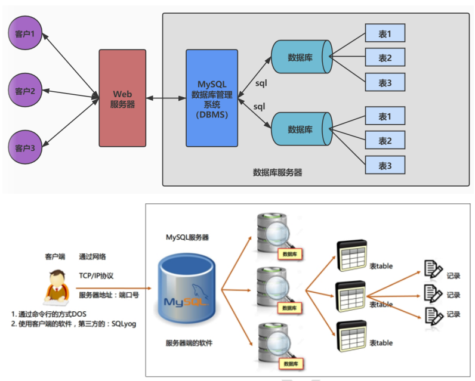

# 1 数据库概述

## 1.1 为什么使用数据库

- 持久化(persistence)：**把数据保存到可掉电式存储设备中以供之后使用**。大多数情况下，特别是企业级应用，**数据持久化意味着将内存中的数据保存到硬盘上加以”固化”**，而持久化的实现过程大多通过各种关系数据库来完成；
- 持久化的主要作用是**将内存中的数据存储在关系型数据库中**，当然也可以存储在磁盘文件、XML数据文件中；

## 1.2 数据库的相关概念

### 1.2.1 数据库相关概念

- **数据库（Database，DB）**：存储数据的仓库，其本质是一个文件系统，它保存了一系列有组织的数据；
- **数据库管理系统（Database Management System，DBMS）**：操作和管理数据库的大型软件，用于建立、使用和维护数据库，对数据库进行统一管理和控制。用户通过数据库管理系统访问数据库中表内的数据；
- **结构化查询语言（Structure Query Language，SQL）**：专门用来与数据库通信的语言；

### 1.2.2 数据库与数据库管理系统的关系

数据库管理系统(DBMS)可以管理多个数据库，一般开发人员会针对每一个应用创建一个数据库。为保存应用中实体的数据，一般会在数据库创建多个表，以保存程序中实体用户的数据。

数据库管理系统、数据库和表的关系如图所示：

### 1.2.3 常见数据库

MySQL、Oracle、db2、SQLServer

## 1.3 MySQL介绍

- MySQL是一个`开放源代码的关系型数据库管理系统` ，由瑞典MySQL AB（创始人Michael Widenius）公司，1995年开发，迅速成为开源数据库的 No.1；
- 2008被 `Sun` 收购（10亿美金），2009年Sun被 `Oracle` 收购。 `MariaDB` 应运而生。（MySQL 的创造者担心 MySQL 有闭源的风险，因此创建了 MySQL 的分支项目 MariaDB）；
- MySQL6.x 版本之后分为`社区版` 和 `商业版` ；
- MySQL是一种关联数据库管理系统，将数据保存在不同的表中，而不是将所有数据放在一个大仓库内，这样就增加了速度并提高了灵活性；
- MySQL是开源的，所以你不需要支付额外的费用；
- MySQL是可以定制的，采用了`GPL（GNU General Public License）`协议，你可以修改源码来开发自己的MySQL系统；
- MySQL支持大型的数据库。可以处理拥有上千万条记录的大型数据库；
- MySQL支持大型数据库，支持5000万条记录的数据仓库，32位系统表文件最大可支持`4GB` ，64位系统支持最大的表文件为`8TB` ；
- MySQL使用`标准的SQL数据语言`形式；
- MySQL可以允许运行于多个系统上，并且支持多种语言。这些编程语言包括C、C++、Python、Java、Perl、PHP和Ruby等。

## 1.4 RDBMS与非RDBMS

### 1.4.1 关系型数据库（RDBMS）

#### 实质

- 这种类型的数据库是`最古老`的数据库类型，关系型数据库模型是把复杂的数据结构归结为简单的`二元关系`（即二维表格形式）；
- 关系型数据库以 `行(row)` 和 `列(column)` 的形式存储数据，以便于用户理解。这一系列的行和列被称为 `表(table)` ，一组表组成了一个库(database)；  
- 表与表之间的数据记录有`关系(relationship)`。现实世界中的各种实体以及实体之间的各种联系均用`关系模型` 来表示。关系型数据库，就是建立在 `关系模型` 基础上的数据库；

#### 优势

- **复杂查询**。可以用SQL语句方便的在一个表以及多个表之间做非常复杂的数据查询；
- **事务支持**。使得对于安全性能很高的数据访问要求得以实现。

### 1.4.2 非关系型数据库

**非关系型数据库**，可看成传统关系型数据库的功能 `阉割版本` ，基于键值对存储数据，不需要经过SQL层的解析， `性能非常高` 。同时，通过减少不常用的功能，进一步提高性能。  

