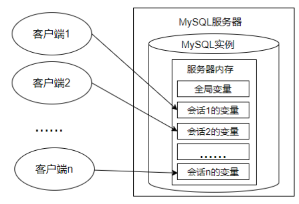

# 16 变量、流程控制与游标

## 16.1 变量

在MySQL数据库的存储过程和函数中，可以使用变量来存储查询或计算的中间结果数据，或者输出最终的结果数据。

在 MySQL 数据库中，变量分为 `系统变量` 以及 `用户自定义变量` 。

### 16.1.1 系统变量

#### 系统变量分类

变量由系统定义，不是用户定义，属于 `服务器` 层面。启动MySQL服务，生成MySQL服务实例期间， MySQL将为MySQL服务器内存中的系统变量赋值，这些系统变量定义了当前MySQL服务实例的属性、特征。这些系统变量的值要么是 编译MySQL时参数 的默认值，要么是 `配置文件` （例如my.ini等）中的参数值。大家可以通过网址 `https://dev.mysql.com/doc/refman/8.0/en/server-systemvariables.html `查看MySQL文档的系统变量。

系统变量分为**<u>全局系统变量（需要添加 global 关键字）</u>**以及**<u>会话系统变量（需要添加 session 关键字）</u>**，有时也把全局系统变量简称为全局变量，有时也把会话系统变量称为local变量。==**<u>如果不写，默认会话级别</u>**==。静态变量（在 MySQL 服务实例运行期间它们的值不能使用 set 动态修改）属于特殊的全局系统变量。

每一个MySQL客户机成功连接MySQL服务器后，都会产生与之对应的会话。会话期间，MySQL服务实例会在MySQL服务器内存中生成与该会话对应的会话系统变量，这些会话系统变量的初始值是全局系统变量值的复制。如下图：



- 全局系统变量针对于所有会话（连接）有效，但 `不能跨重启`；
- 会话系统变量仅针对于当前会话（连接）有效。会话期间，当前会话对某个会话系统变量值的修改，不会影响其他会话同一个会话系统变量的值；
- 会话1对某个全局系统变量值的修改会导致会话2中同一个全局系统变量值的修改；

在MySQL中有些系统变量**<u>只能是全局的</u>**，例如 `max_connections` 用于限制服务器的最大连接数；有些系统变量作用域**<u>既可以是全局又可以是会话</u>**，例如 `character_set_client` 用于设置客户端的字符集；有些系统变量的作用域**<u>只能是当前会话</u>**，例如 `pseudo_thread_id` 用于标记当前会话的 MySQL 连接 ID。  

#### 查看系统变量

作为 MySQL 编码规范，MySQL 中的系统变量以 两个`@` 开头，其中`@@global`仅用于标记全局系统变量，`@@session`仅用于标记会话系统变量。`@@`首先标记会话系统变量，如果会话系统变量不存在，则标记全局系统变量。  

```mysql
#查看指定的系统变量的值
SELECT @@global.变量名;

#查看指定的会话变量的值
SELECT @@session.变量名;
#或者
SELECT @@变量名;
```

#### 修改系统变量

有些时候，数据库管理员需要修改系统变量的默认值，以便修改当前会话或者MySQL服务实例的属性、特征。具体方法：

方式1：修改MySQL `配置文件` ，继而修改MySQL系统变量的值（该方法需要重启MySQL服务）；

方式2：在MySQL服务运行期间，使用`set`命令重新设置系统变量的值；

```mysql
#为某个系统变量赋值
#方式1：
SET @@global.变量名=变量值;
#方式2：
SET GLOBAL 变量名=变量值;

#为某个会话变量赋值
#方式1：
SET @@session.变量名=变量值;
#方式2：
SET SESSION 变量名=变量值;
```

### 16.1.2 用户变量

#### 用户变量分类

用户变量是用户自己定义的，作为 MySQL 编码规范，MySQL 中的用户变量以 一个`@` 开头。根据作用范围不同，又分为 `会话用户变量` 和 `局部变量` 。

- 会话用户变量：作用域和会话变量一样，只对 `当前连接` 会话有效；

- 局部变量：只在 `BEGIN` 和 `END` 语句块中有效。局部变量只能在 `存储过程和函数` 中使用；

#### 会话用户变量

```mysql
#方式1：“=”或“:=”
SET @用户变量 = 值;
SET @用户变量 := 值;

#方式2：“:=” 或 INTO关键字
SELECT @用户变量 := 表达式 [FROM 等子句];
SELECT 表达式 INTO @用户变量 [FROM 等子句];
```

#### 局部变量

定义：可以使用 `DECLARE` 语句定义一个局部变量；

作用域：仅仅在定义它的 `BEGIN ... END` 中有效；

位置：只能放在 `BEGIN ... END` 中，而且只能放在第一句；

```mysql
BEGIN
    #声明局部变量
    DECLARE 变量名1 变量数据类型 [DEFAULT 变量默认值];
    DECLARE 变量名2,变量名3,... 变量数据类型 [DEFAULT 变量默认值];
    
    #为局部变量赋值
    SET 变量名1 = 值;
    SELECT 值 INTO 变量名2 [FROM 子句];
    
    #查看局部变量的值
    SELECT 变量1,变量2,变量3;
END
```

## 16.2 定义条件与处理程序

`定义条件` 是事先定义程序执行过程中可能遇到的问题， `处理程序` 定义了在遇到问题时应当采取的处理方式，并且保证存储过程或函数在遇到警告或错误时能继续执行。这样可以增强存储程序处理问题的能力，避免程序异常停止运行。  

### 16.2.1 定义条件

定义条件就是给MySQL中的错误码命名，这有助于存储的程序代码更清晰。它将一个 `错误名字` 和 `指定的错误条件` 关联起来。这个名字可以随后被用在定义处理程序的 `DECLARE HANDLER` 语句中。

定义条件使用`DECLARE`语句，语法格式如下：

```mysql
DECLARE 错误名称 CONDITION FOR 错误码（或错误条件）
```

错误码的说明：  

- `MySQL_error_code` 和 `sqlstate_value` 都可以表示MySQL的错误：
  - `MySQL_error_code`是数值类型错误代码；
  - `sqlstate_value`是长度为`5`的字符串类型错误代码；

举例：定义`Field_Not_Be_NULL`错误名与MySQL中违反非空约束的错误类型是`ERROR 1048 (23000)`对应：

```mysql
#使用MySQL_error_code
DECLARE Field_Not_Be_NULL CONDITION FOR 1048;

#使用sqlstate_value
DECLARE Field_Not_Be_NULL CONDITION FOR SQLSTATE '23000'
```

### 16.2.2 定义处理程序

可以为SQL执行过程中发生的某种类型的错误定义特殊的处理程序。定义处理程序时，使用DECLARE语句的语法如下：

```mysql
DECLARE 处理方式 HANDLER FOR 错误类型 处理语句
```

- 处理方式：处理方式有3个取值：`CONTINUE`、`EXIT`、`UNDO`;
  - `CONTINUE` ：表示遇到错误不处理，继续执行；
  - `EXIT` ：表示遇到错误马上退出；
  - `UNDO` ：表示遇到错误后撤回之前的操作。MySQL中暂时不支持这样的操作；
- 错误类型（即条件）可以有如下取值：
  - `SQLSTATE` '字符串错误码' ：表示长度为5的`sqlstate_value`类型的错误代码；
  -  `MySQL_error_code` ：匹配数值类型错误代码；
  - 错误名称 ：表示`DECLARE ... CONDITION`定义的错误条件名称；
  - `SQLWARNING` ：匹配所有以`01`开头的`SQLSTATE`错误代码； 
  - `NOT FOUND` ：匹配所有以`02`开头的`SQLSTATE`错误代码；
  - `SQLEXCEPTION` ：匹配所有没有被`SQLWARNING`或`NOT FOUND`捕获的`SQLSTATE`错误代码；
- 处理语句：如果出现上述条件之一，则采用对应的处理方式，并执行指定的处理语句。语句可以是像 `SET 变量 = 值` 这样的简单语句，也可以是使用 `BEGIN ... END` 编写的复合语句

示例如下：

```mysql
#方法1：捕获sqlstate_value
DECLARE CONTINUE HANDLER FOR SQLSTATE '42S02' SET @info = 'NO_SUCH_TABLE';

#方法2：捕获mysql_error_value
DECLARE CONTINUE HANDLER FOR 1146 SET @info = 'NO_SUCH_TABLE';

#方法3：先定义条件，再调用
DECLARE no_such_table CONDITION FOR 1146;
DECLARE CONTINUE HANDLER FOR NO_SUCH_TABLE SET @info = 'NO_SUCH_TABLE';

#方法4：使用SQLWARNING
DECLARE EXIT HANDLER FOR SQLWARNING SET @info = 'ERROR';

#方法5：使用NOT FOUND
DECLARE EXIT HANDLER FOR NOT FOUND SET @info = 'NO_SUCH_TABLE';

#方法6：使用SQLEXCEPTION
DECLARE EXIT HANDLER FOR SQLEXCEPTION SET @info = 'ERROR';
```

## 16.3 流程控制

解决复杂问题不可能通过一个 SQL 语句完成，我们需要执行多个 SQL 操作。流程控制语句的作用就是控制存储过程中 SQL 语句的执行顺序，是我们完成复杂操作必不可少的一部分。只要是执行的程序，流程就分为三大类：

- `顺序结构` ：程序从上往下依次执行；

- `分支结构` ：程序按条件进行选择执行，从两条或多条路径中选择一条执行；

- `循环结构` ：程序满足一定条件下，重复执行一组语句；

针对于MySQL 的流程控制语句主要有 3 类。注意：只能用于存储程序。

- `条件判断语句` ：IF 语句和 CASE 语句；
- `循环语句` ：LOOP、WHILE 和 REPEAT 语句；
- `跳转语句` ：ITERATE 和 LEAVE 语句；

### 16.3.1 分支结构之`IF`

```mysql
IF 表达式1 THEN 操作1
[ELSEIF 表达式2 THEN 操作2]……
[ELSE 操作N]
END IF
```

### 16.3.2 分支结构之`CASE`

```mysql
#情况一：类似于switch
CASE 表达式
WHEN 值1 THEN 结果1或语句1(如果是语句，需要加分号)
WHEN 值2 THEN 结果2或语句2(如果是语句，需要加分号)
...
ELSE 结果n或语句n(如果是语句，需要加分号)
END [case]（如果是放在begin end中需要加上case，如果放在select后面不需要）

#情况二：类似于多重if
CASE
WHEN 条件1 THEN 结果1或语句1(如果是语句，需要加分号)
WHEN 条件2 THEN 结果2或语句2(如果是语句，需要加分号)
...
ELSE 结果n或语句n(如果是语句，需要加分号)
END [case]（如果是放在begin end中需要加上case，如果放在select后面不需要）
```

### 16.3.3 循环结构之`LOOP`

`LOOP`循环语句用来重复执行某些语句。`LOOP`内的语句一直重复执行直到循环被退出（使用`LEAVE`子句），跳出循环过程。

`LOOP`语句的基本格式如下：

```mysql
[loop_label:] LOOP
循环执行的语句
END LOOP [loop_label]
```

### 16.3.4 循环结构之`WHILE`

`WHILE`语句创建一个带条件判断的循环过程。`WHILE`在执行语句执行时，先对指定的表达式进行判断，如果为真，就执行循环内的语句，否则退出循环。`WHILE`语句的基本格式如下：  

```mysql
[while_label:] WHILE 循环条件 DO
	循环体
END WHILE [while_label];
```

`while_label`为`WHILE`语句的标注名称；如果循环条件结果为真，`WHILE`语句内的语句或语句群被执行，直至循环条件为假，退出循环。

### 16.3.5 循环结构之`REPEAT`

`REPEAT`语句创建一个带条件判断的循环过程。与`WHILE`循环不同的是，`REPEAT` 循环首先会执行一次循环，然后在 `UNTIL` 中进行表达式的判断，如果满足条件就退出，即 `END REPEAT`；如果条件不满足，则会就继续执行循环，直到满足退出条件为止。

`REPEAT`语句的基本格式如下：

```mysql
[repeat_label:] REPEAT
	循环体的语句
UNTIL 结束循环的条件表达式
END REPEAT [repeat_label]
```

### 16.3.6 跳转语句之`LEAVE`语句

`LEAVE`语句：可以用在循环语句内，或者以 `BEGIN` 和 `END` 包裹起来的程序体内，表示跳出循环或者跳出程序体的操作。如果你有面向过程的编程语言的使用经验，你可以把 `LEAVE` 理解为 `break`。

基本格式如下：

```mysql
LEAVE 标记名
```

### 16.3.7 跳转语句之`ITERATE`语句

ITERATE语句：只能用在循环语句（`LOOP`、`REPEAT`和`WHILE`语句）内，表示重新开始循环，将执行顺序转到语句段开头处。如果你有面向过程的编程语言的使用经验，你可以把 `ITERATE` 理解为 `continue`，意思为“再次循环”。

语句基本格式如下：

```mysql
ITERATE label
```

## 16.4 游标

### 16.4.1 什么是游标

虽然我们也可以通过筛选条件 `WHERE` 和 `HAVING`，或者是限定返回记录的关键字 `LIMIT` 返回一条记录，但是，却无法在结果集中像指针一样，向前定位一条记录、向后定位一条记录，或者是 `随意定位到某一条记录` ，并对记录的数据进行处理。

这个时候，就可以用到游标。`游标`，提供了一种灵活的操作方式，让我们能够对结果集中的每一条记录进行定位，并对指向的记录中的数据进行操作的数据结构。==**<u>游标让 SQL 这种面向集合的语言有了面向过程开发的能力</u>**==。

在 SQL 中，游标是一种临时的数据库对象，可以指向存储在数据库表中的数据行指针。这里游标 充当了指针的作用 ，我们可以通过操作游标来对数据行进行操作。

MySQL中游标可以在存储过程和函数中使用。

### 16.4.2 使用游标步骤

游标必须在声明处理程序之前被声明，并且变量和条件还必须在声明游标或处理程序之前被声明。如果我们想要使用游标，一般需要经历四个步骤。不同的 DBMS 中，使用游标的语法可能略有不同。  

#### 声明游标

```mysql
DECLARE cursor_name CURSOR FOR select_statement;
```

#### 打开游标

```mysql
OPEN cursor_name
```

#### 使用游标

```mysql
FETCH cursor_name INTO var_name [, var_name] ...
```

这句的作用是使用 `cursor_name` 这个游标来读取当前行，并且将数据保存到 `var_name` 这个变量中，==**<u>游标指针指到下一行</u>**==。如果游标读取的数据行有多个列名，则在 INTO 关键字后面赋值给多个变量名即可。

#### 关闭游标

```mysql
CLOSE cur_name
```

有 `OPEN` 就会有 `CLOSE`，也就是打开和关闭游标。当我们使用完游标后需要关闭掉该游标。`因为游标会占用系统资源` ，如果不及时关闭，==**<u>游标会一直保持到存储过程结束</u>**==，影响系统运行的效率。而关闭游标的操作，会释放游标占用的系统资源。

关闭游标之后，我们就不能再检索查询结果中的数据行，如果需要检索只能再次打开游标。  

