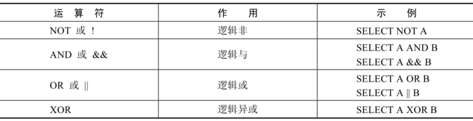

# 4 运算符

## 4.1 算数运算符

## 4.2 比较运算符

**安全等于运算符**（`<=>`）与等于运算符（`=`）的作用是相似的， 唯一的区别 是`<=>`可以用来对`NULL`进行判断。在两个操作数均为`NULL`时，其返回值为`1`，而不为`NULL`；当一个操作数为`NULL`时，其返回值为`0`，而不为`NULL`。  

**<u>非符号运算符：</u>**

## 4.3 逻辑运算符

## 4.4 运算符的优先级

