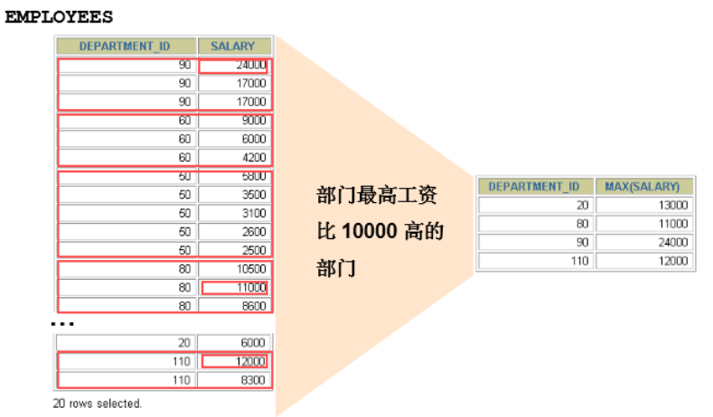

# 8 聚合函数

## 8.1 聚合函数介绍

**<u>聚合函数类型：</u>**

- `AVG()`
- `SUM()`
- `MAX()`
- `MIN()`
- `COUNT()`

**<u>语法：</u>**

```sql
SELECT		[column,] group function(column), ...
FROM 		table
[WHERE		condition]
[GROUP BY	column]
[ORDER BY	column];
```

- 聚合函数==不能嵌套调用==。比如不能出现类似`AVG(SUM(字段名称))`形式的调用。  

### `COUNT`函数

- `COUNT(*)`返回表中记录总数，适用于**任意数据类型**；
- `COUNT(expr)`返回**`expr`不为空**的记录总数；

## 8.2 `GROUP BY`

### 8.2.1 基本使用

可以使用`GROUP BY`子句将表中的数据分成若干组：

```mysql
SELECT department_id, AVG(salary)
FROM employees
GROUP BY department_id ;
```


### 8.2.2 使用多个列分组

```sql
SELECT department_id dept_id, job_id, SUM(salary)
FROM employees
GROUP BY department_id, job_id;
```


### 8.2.3 使用`WITH ROLLP`

使用 `WITH ROLLUP` 关键字之后，在所有查询出的分组记录之后增加一条记录，该记录计算查询出的所有记录的总和，即统计记录数量。

```sql
SELECT department_id,AVG(salary)
FROM employees
WHERE department_id > 80
GROUP BY department_id WITH ROLLUP;
```

> 当使用`ROLLUP`时，**不能同时使用**`ORDER BY`子句进行结果排序，即`ROLLUP`和`ORDER BY`是**互相排斥**的。

## 8.3 `HAVING`

### 8.3.1 基本使用

1. 行已经被分组；
2. 使用了聚合函数；
3. 满足`HAVING`子句中条件的分组将被显示；
4. `HAVING` 不能单独使用，必须要跟 `GROUP BY` 一起使用；

```mysql
SELECT department_id, MAX(salary)
FROM employees
GROUP BY department_id
HAVING MAX(salary)>10000 ;
```



- **非法使用聚合函数**：不能在 `WHERE` 子句中使用聚合函数  

### 8.3.2 `WHERE`和`HAVING`的对比

**<u>区别1：`WHERE` 可以直接使用表中的字段作为筛选条件，但不能使用分组中的计算函数作为筛选条件； `HAVING` 必须要与 `GROUP BY` 配合使用，可以把分组计算的函数和分组字段作为筛选条件。</u>**这决定了，在需要对数据进行分组统计的时候，`HAVING` 可以完成 `WHERE` 不能完成的任务。这是因为，在查询语法结构中，`WHERE` 在 `GROUP BY` 之前，所以无法对分组结果进行筛选。`HAVING` 在 `GROUP BY` 之后，可以使用分组字段和分组中的计算函数，对分组的结果集进行筛选，这个功能是 `WHERE` 无法完成的。另外，`WHERE`排除的记录不再包括在分组中；

**区别2：如果需要通过连接从关联表中获取需要的数据，`WHERE` 是先筛选后连接，而 `HAVING` 是先连接后筛选。** 这一点，就决定了在关联查询中，`WHERE` 比 `HAVING` 更高效。因为 `WHERE` 可以先筛选，用一个筛选后的较小数据集和关联表进行连接，这样占用的资源比较少，执行效率也比较高。`HAVING` 则需要先把结果集准备好，也就是用未被筛选的数据集进行关联，然后对这个大的数据集进行筛选，这样占用的资源就比较多，执行效率也较低。

|          | 优点                         | 缺点                                   |
| -------- | ---------------------------- | -------------------------------------- |
| `WHERE`  | 先筛选数据再关联，执行效率高 | 不能使用分组中的计算函数进行筛选       |
| `HAVING` | 可以使用分组中的计算函数     | 在最后的结果集中进行筛选，执行效率较低 |

## 8.4 SELECT的执行过程

### 8.4.1 查询的结构

```mysql
#方式1：
SELECT ...,....,...
FROM ...,...,....
WHERE 多表的连接条件
AND 不包含组函数的过滤条件
GROUP BY ...,...
HAVING 包含组函数的过滤条件
ORDER BY ... ASC/DESC
LIMIT ...,...

#方式2：
SELECT ...,....,...
FROM ... JOIN ...
ON 多表的连接条件
JOIN ...
ON ...
WHERE 不包含组函数的过滤条件
AND/OR 不包含组函数的过滤条件
GROUP BY ...,...
HAVING 包含组函数的过滤条件
ORDER BY ... ASC/DESC
LIMIT ...,...

#其中：
#（1）from：从哪些表中筛选
#（2）on：关联多表查询时，去除笛卡尔积
#（3）where：从表中筛选的条件
#（4）group by：分组依据
#（5）having：在统计结果中再次筛选
#（6）order by：排序
#（7）limit：分页
```

### 8.4.2 SELECT执行顺序

1. **关键词的顺序是不能颠倒的：**

```sql
SELECT ... FROM ... WHERE ... GROUP BY ... HAVING ... ORDER BY ... LIMIT...
```

2. **SELECT语句的执行顺序：**

```sql
FROM -> WHERE -> GROUP BY -> HAVING -> SELECT 的字段 -> DISTINCT -> ORDER BY -> LIMIT
```

在 SELECT 语句执行这些步骤的时候，每个步骤都会产生一个`虚拟表`，然后将这个虚拟表传入下一个步骤中作为输入。需要注意的是，这些步骤隐含在 SQL 的执行过程中，对于我们来说是不可见的。

###  8.4.3 SQL的执行原理

==**<u>SELECT 是先执行 `FROM` 这一步的。</u>**==在这个阶段，如果是多张表联查，还会经历下面的几个步骤：

1. 首先先通过 `CROSS JOIN` 求笛卡尔积，相当于得到虚拟表 `vt（virtual table）1-1`；

2. 通过 `ON` 进行筛选，在虚拟表 `vt1-1` 的基础上进行筛选，得到虚拟表 `vt1-2`；

3. 添加外部行。如果我们使用的是左连接、右链接或者全连接，就会涉及到外部行，也就是在虚拟表 `vt1-2` 的基础上增加外部行，得到虚拟表 `vt1-3`；

当然如果我们操作的是两张以上的表，还会重复上面的步骤，直到所有表都被处理完为止。这个过程得到是我们的原始数据。

当我们拿到了查询数据表的原始数据，也就是最终的虚拟表 `vt1` ，==**<u>就可以在此基础上再进行 `WHERE` 阶段</u>**== 。在这个阶段中，会根据 `vt1` 表的结果进行筛选过滤，得到虚拟表 `vt2` 。

==**<u>然后进入第三步和第四步，也就是 `GROUP` 和 `HAVING` 阶段</u>**== 。在这个阶段中，实际上是在虚拟表 `vt2` 的基础上进行分组和分组过滤，得到中间的虚拟表 `vt3` 和 `vt4` 。

当我们完成了条件筛选部分之后，就可以筛选表中提取的字段，也就是==**<u>进入到 `SELECT` 和 `DISTINCT`阶段</u>**== 。

首先在 `SELECT` 阶段会提取想要的字段，然后在 `DISTINCT` 阶段过滤掉重复的行，分别得到中间的虚拟表`vt5-1` 和 `vt5-2` 。

当我们提取了想要的字段数据之后，就可以按照指定的字段进行排序，==**<u>也就是 `ORDER BY` 阶段</u>**== ，得到虚拟表 `vt6` 。

==**<u>最后在 `vt6` 的基础上，取出指定行的记录，也就是 `LIMIT` 阶段</u>**==，得到最终的结果，对应的是虚拟表`vt7` 。

当然我们在写 `SELECT` 语句的时候，不一定存在所有的关键字，相应的阶段就会省略。

同时因为 `SQL` 是一门类似英语的结构化查询语言，所以我们在写 `SELECT` 语句的时候，还要注意相应的关键字顺序，**<u>所谓底层运行的原理，就是我们刚才讲到的执行顺序</u>**。


