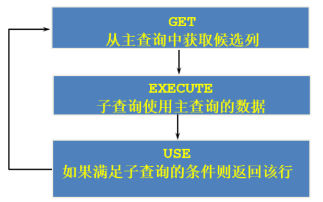

# 9 子查询

## 9.1 简述

### 9.1.1 子查询的基本使用

```sql
SELECT	select_list
FROM	table
WHERE	expr operator
				(SELECT	select_list
                 FROM	table);
```

### 9.1.2 子查询分类

#### 分类方式1

按内查询的结果**<u>返回一条还是多条</u>**记录，将子查询分为 **单行子查询**、**多行子查询**。

####   分类方式2

我们按**<u>内查询是否被执行多次</u>**，将子查询划分为**相关(或关联)子查询** 和 **不相关(或非关联)子查询** 。

子查询从数据表中查询了数据结果，如果这个数据结果只执行一次，然后这个数据结果作为主查询的条件进行执行，那么这样的子查询叫做不相关子查询。

同样，如果子查询需要执行多次，即采用循环的方式，先从外部查询开始，每次都传入子查询进行查询，然后再将结果反馈给外部，这种嵌套的执行方式就称为相关子查询。

## 9.2 单行子查询

### 9.2.1 单行比较操作符

| 操作符 | 含义                     |
| ------ | ------------------------ |
| =      | equal to                 |
| >      | greater than             |
| >=     | greater than or equal to |
| <      | less than                |
| <=     | less than or equal to    |
| <>     | not equal to             |

### 9.2.2 代码示例

```mysql
SELECT last_name, job_id, salary
FROM employees
WHERE job_id =
		(SELECT job_id
		 FROM employees
		 WHERE employee_id = 141)
AND salary >
		(SELECT salary
		 FROM employees
		 WHERE employee_id = 143);
```

### 9.2.3 `HAVING`中的子查询

- 首先执行子查询；
- 向主查询中的`HAVING` 子句返回结果；

```mysql
SELECT department_id, MIN(salary)
FROM employees
GROUP BY department_id
HAVING MIN(salary) >
		(SELECT MIN(salary)
		 FROM employees
		 WHERE department_id = 50);
```

### 9.2.4 `CASE`中的子查询

```mysql
SELECT employee_id, last_name,
		(CASE department_id
		 WHEN
			(SELECT department_id FROM departments
			 WHERE location_id = 1800)
        THEN 'Canada' ELSE 'USA' END) location
FROM employees;
```

### 9.2.5 子查询的空值问题

> ==**<u>子查询不返回任何行</u>**==

## 9.3 多行子查询

### 多行比较操作符

| 操作符 | 含义                                                         |
| ------ | ------------------------------------------------------------ |
| IN     | 等于列表中的**任意一个**                                     |
| ANY    | 需要和单行比较操作符一起使用，和子查询返回的**某一个**值比较 |
| ALL    | 需要和单行比较操作符一起使用，和子查询返回的**所有**值比较   |
| SOME   | 实际上是**ANY的别名**，作用相同，一般常使用ANY               |

## 9.4 相关子查询

### 9.4.1 相关子查询执行流程

如果子查询的执行依赖于外部查询，通常情况下都是因为子查询中的表用到了外部的表，并进行了条件关联，因此每执行一次外部查询，子查询都要重新计算一次，这样的子查询就称之为`关联子查询`。

==**<u>相关子查询按照一行接一行的顺序执行，主查询的每一行都执行一次子查询</u>**==。



### 9.4.2 代码示例

在`FROM`中使用子查询：

```mysql
SELECT last_name,salary,e1.department_id
FROM employees e1, (SELECT department_id,AVG(salary)  dept_avg_sal 
                    FROM employees 
                    GROUP BY department_id) e2
WHERE e1.`department_id` = e2.department_id
AND e2.dept_avg_sal < e1.`salary`;
```

在`OEDER BY`中使用子查询：

```mysql
SELECT employee_id,salary
FROM employees e
ORDER BY (
	SELECT department_name
	FROM departments d
	WHERE e.`department_id` = d.`department_id`);
```

### 9.4.3 `EXISTS`与`NOT EXISTS`

关联子查询通常也会和`EXISTS`操作符一起来使用，用来检查在子查询中是否存在满足条件的行。

- 如果在子查询中不存在满足条件的行：
  - 条件返回 `FALSE`；
  - 继续在子查询中查找；
- 如果在子查询中存在满足条件的行：
  - 不在子查询中继续查找；
  - 条件返回 `TRUE`；

`NOT EXISTS`关键字表示如果不存在某种条件，则返回`TRUE`，否则返回`FALSE`  。

### 9.4.4 相关更新

```sql
UPDATE table1 alias1
SET column = (SELECT expression
			  FROM table2 alias2
			  WHERE alias1.column = alias2.column);
```

### 9.4.5 相关删除

```sql
DELETE FROM table1 alias1
WHERE column operator (SELECT expression
					   FROM table2 alias2
					   WHERE alias1.column = alias2.column);
```

## 9.5 自连接vs子查询

在可以使用子查询，也可以使用自连接的情况下，一般情况建议使用自连接，因为在许多 DBMS 的处理过程中，对于自连接的处理速度要比子查询快得多。

可以这样理解：**<u>子查询实际上是通过未知表进行查询后的条件判断，而自连接是通过已知的自身数据表进行条件判断</u>**，因此在大部分DBMS 中都对自连接处理进行了优化。


