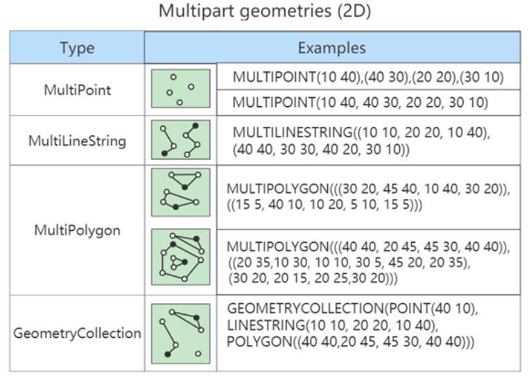

# 12 MySQL数据类型精讲

## 12.1 MySQL中的数据类型

| 类型             | 类型举例                                                     |
| ---------------- | ------------------------------------------------------------ |
| 整数类型         | TINYINT、SMALLINT、MEDIUMINT、INT(或INTEGER)、BIGINT         |
| 浮点类型         | FLOAT、DOUBLE                                                |
| 定点数类型       | DECIMAL                                                      |
| 位类型           | BIT                                                          |
| 日期时间类型     | YEAR、TIME、DATE、DATETIME、TIMESTAMP                        |
| 文本字符串类型   | CHAR、VARCHAR、TINYTEXT、TEXT、MEDIUMTEXT、LONGTEXT          |
| 枚举类型         | ENUM                                                         |
| 集合类型         | SET                                                          |
| 二进制字符串类型 | BINARY、VARBINARY、TINYBLOB、BLOB、MEDIUMBLOB、LONGBLOB      |
| JSON类型         | JSON对象、JSON数组                                           |
| 空间数据类型     | 单值类型：GEOMETRY、POINT、LINESTRING、POLYGON；集合类型：MULTIPOINT、MULTILINESTRING、MULTIPOLYGON、GEOMETRYCOLLECTION |

常见数据类型的属性，如下：

| MySQL关键字        | 含义                     |
| ------------------ | ------------------------ |
| NULL               | 数据列可包含NULL值       |
| NOT NULL           | 数据列不允许包含NULL值   |
| DEFAULT            | 默认值                   |
| PRIMARY KEY        | 主键                     |
| AUTO_INCREMENT     | 自动递增，适用于整数类型 |
| UNSIGNED           | 无符号                   |
| CHARACTER SET name | 指定一个字符集           |

## 12.2 整数类型

### 12.2.1 类型介绍

| 整数类型     | 字节 | 有符号数取值范围                         | 无符号数取值范围       |
| ------------ | ---- | ---------------------------------------- | ---------------------- |
| TINYINT      | 1    | -128~127                                 | 0~255                  |
| SMALLINT     | 2    | -32768~32767                             | 0~65535                |
| MEDIUMINT    | 3    | -8388608~8388607                         | 0~16777215             |
| INT、INTEGER | 4    | -2147483648~2147483647                   | 0~4294967295           |
| BIGINT       | 8    | -9223372036854775808~9223372036854775807 | 0~18446744073709551615 |

### 12.2.2 可选属性

#### `M`

`M` : 表示显示宽度，`M`的取值范围是(0, 255)。例如，`int(5)`：当数据宽度小于5位的时候在数字前面需要用字符填满宽度。该项功能需要配合“ `ZEROFILL` ”使用，表示用“`0`”填满宽度，否则指定显示宽度无效。

如果设置了显示宽度，那么插入的数据宽度超过显示宽度限制，会不会截断或插入失败？

答案：不会对插入的数据有任何影响，还是按照类型的实际宽度进行保存，即 `显示宽度与类型可以存储的值范围无关` 。**从MySQL 8.0.17开始，整数数据类型不推荐使用显示宽度属性**。

整型数据类型可以在定义表结构时指定所需要的显示宽度，如果不指定，则系统为每一种类型指定默认的宽度值。

#### `UNSIGNED`

`UNSIGNED` : 无符号类型（非负），所有的整数类型都有一个可选的属性`UNSIGNED`（无符号属性），无符号整数类型的最小取值为0。所以，如果需要在MySQL数据库中保存非负整数值时，可以将整数类型设置为无符号类型。

`int`类型默认显示宽度为`int(11)`，无符号`int`类型默认显示宽度为`int(10)`。

#### `ZEROFILL`

`ZEROFILL` : 0填充,（如果某列是`ZEROFILL`，那么MySQL会自动为当前列添加`UNSIGNED`属性），如果指定了ZEROFILL只是表示不够M位时，用0在左边填充，如果超过M位，只要不超过数据存储范围即可。

原来，在 int(M) 中，M 的值跟 int(M) 所占多少存储空间并无任何关系。 **<u>int(3)、int(4)、int(8) 在磁盘上都是占用 4 bytes 的存储空间</u>**。也就是说，**int(M)，必须和UNSIGNED ZEROFILL一起使用才有意义。**如果整数值超过M位，就按照实际位数存储。只是无须再用字符 0 进行填充。

#### 使用场景

`TINYINT` ：一般用于枚举数据，比如系统设定取值范围很小且固定的场景；

`SMALLINT` ：可以用于较小范围的统计数据，比如统计工厂的**固定资产库存数量**等；

`MEDIUMINT` ：用于较大整数的计算，比如车站每日的客流量等；

`INT、INTEGER`：取值范围足够大，一般情况下不用考虑超限问题，用得最多。比如商品编号；

`BIGINT` ：只有当**<u>处理特别巨大的整数</u>**时才会用到。比如双十一的交易量、大型门户网站点击量、证券公司衍生产品持仓等；

## 12.3 浮点类型

### 12.3.1 类型介绍

浮点数和定点数类型的特点是可以 `处理小数` ，你可以把整数看成小数的一个特例。因此，浮点数和定点数的使用场景，比整数大多了。 MySQL支持的浮点数类型，分别是 `FLOAT`、`DOUBLE`、`REAL`。

- `FLOAT` 表示单精度浮点数；

- `DOUBLE` 表示双精度浮点数；

- `REAL`默认就是 `DOUBLE`。如果你把 SQL 模式设定为启用“`REAL_AS_FLOAT` ”，那 么，MySQL 就认为`REAL` 是 `FLOAT`。如果要启用“`REAL_AS_FLOAT`”，可以通过以下 SQL语句实现：

```mysql
SET sql_mode = “REAL_AS_FLOAT”;
```

###   12.3.2 数据精度说明

对于浮点类型，在MySQL中单精度值使用 `4` 个字节，双精度值使用 `8` 个字节。

- MySQL允许使用 非标准语法（其他数据库未必支持，因此如果涉及到数据迁移，则最好不要这么用）： `FLOAT(M,D)` 或 `DOUBLE(M,D)` 。这里，M称为 `精度` ，D称为 `标度` 。(M,D)中 M=整数位+小数位，D=小数位。 D<=M<=255，0<=D<=30。例如，定义为`FLOAT(5,2)`的一个列可以显示为`-999.99-999.99`。如果超过这个范围会报错；
- `FLOAT`和`DOUBLE`类型在不指定(M,D)时，默认会按照实际的精度（由实际的硬件和操作系统决定）来显示；
- 说明：浮点类型，也可以加 `UNSIGNED` ，但是不会改变数据范围，例如：`FLOAT(3,2) UNSIGNED`仍然只能表示`0-9.99`的范围；
- 不管是否显式设置了精度(M,D)，这里MySQL的处理方案如下
  - 如果存储时，整数部分超出了范围，MySQL就会报错，不允许存这样的值；
  - 如果存储时，小数点部分若超出范围，就分以下情况
    - 若四舍五入后，整数部分没有超出范围，则只警告，但能成功操作并四舍五入删除多余的小数位后保存。例如在FLOAT(5,2)列内插入999.009，近似结果是999.01；
    - 若四舍五入后，整数部分超出范围，则MySQL报错，并拒绝处理。如FLOAT(5,2)列内插入999.995和-999.995都会报错。
- **<u>从MySQL 8.0.17开始，FLOAT(M,D) 和DOUBLE(M,D)用法在官方文档中已经明确不推荐使用</u>**，将来可能被移除。另外，关于浮点型FLOAT和DOUBLE的UNSIGNED也不推荐使用了，将来也可能被移除；

### 12.3.3 精度误差说明

MySQL 用 4 个字节存储 FLOAT 类型数据，用 8 个字节来存储 DOUBLE 类型数据。无论哪个，都是采用二进制的方式来进行存储的。比如 `9.625`，用二进制来表达，就是 `1001.101`，或者表达成`1.001101×2^3`。**<u>如果尾数不是 0 或 5（比如 9.624），你就无法用一个二进制数来精确表达。</u>**进而，就只好在取值允许的范围内进行四舍五入。  

在编程中，如果用到浮点数，要特别注意误差问题，**<u>因为浮点数是不准确的，所以我们要避免使用“=”来判断两个数是否相等</u>**。同时，在一些对精确度要求较高的项目中，千万不要使用浮点数，不然会导致结果错误，甚至是造成不可挽回的损失。那么，MySQL 有没有精准的数据类型呢？当然有，这就是定点数类型： `DECIMAL` 。    

## 12.4 定点数类型

### 12.4.1 类型介绍

| 数据类型                 | 字节数  | 含义               |
| ------------------------ | ------- | ------------------ |
| DECIMAL(M,D),DEC,NUMERIC | M+2字节 | 有效范围由M和D决定 |

使用 DECIMAL(M,D) 的方式表示高精度小数。其中，M被称为精度，D被称为标度。`0<=M<=65， 0<=D<=30`，D<M。例如，定义`DECIMAL（5,2）`的类型，表示该列取值范围是`-999.99~999.99`。

`DECIMAL(M,D)`的最大取值范围与`DOUBLE`类型一样，但是有效的数据范围是由M和D决定的。`DECIMAL` 的存储空间并不是固定的，由精度值M决定，总共占用的存储空间为`M+2`个字节。也就是说，在一些对精度要求不高的场景下，比起占用同样字节长度的定点数，浮点数表达的数值范围可以更大一些。

定点数在MySQL内部是以 ==**<u>字符串</u>**== 的形式进行存储，这就决定了它一定是精准的。

当DECIMAL类型不指定精度和标度时，其默认为DECIMAL(10,0)。当数据的精度超出了定点数类型的精度范围时，则MySQL同样会进行四舍五入处理。

**<u>浮点数 vs 定点数</u>**

- 浮点数相对于定点数的优点是在长度一定的情况下，浮点类型取值范围大，但是不精准，适用于需要取值范围大，又可以容忍微小误差的科学计算场景（比如计算化学、分子建模、流体动力学等）；
- 定点数类型取值范围相对小，但是精准，没有误差，适合于对精度要求极高的场景 （比如涉及金额计算的场景）；

> 由于 DECIMAL 数据类型的精准性，在项目中，除了极少数（比如商品编号）用到整数类型外，其他的数值都用的是 DECIMAL，原因就是这个项目所处的零售行业，要求精准，一分钱也不能差。

## 12.5 位类型：`BIT`

| 二进制字符串类型 | 长度 | 长度范围     | 占用空间            |
| ---------------- | ---- | ------------ | ------------------- |
| BIT(M)           | M    | 1 <= M <= 64 | 约为(M + 7)/8个字节 |

BIT类型，如果没有指定(M)，**<u>默认是1位</u>**。这个1位，表示只能存1位的二进制值。这里(M)是表示二进制的位数，位数最小值为1，最大值为64。  

注意：在向BIT类型的字段中插入数据时，一定要确保插入的数据在BIT类型支持的范围内。  使用SELECT命令查询位字段时，可以用 `BIN()` 或 `HEX()` 函数进行读取。


## 12.6 日期和时间类型

| 类型      | 名称     | 字节 | 日期格式            | 最小值                 | 最大值                 |
| --------- | -------- | ---- | ------------------- | ---------------------- | ---------------------- |
| YEAR      | 年       | 1    | YYYY或YY            | 1901                   | 2155                   |
| TIME      | 时间     | 3    | HH:MM:SS            | -838:59:59             | 838:59:59              |
| DATE      | 日期     | 3    | YYYY-MM-DD          | 1000-01-01             | 9999-12-03             |
| DATETIME  | 日期时间 | 8    | YYYY-MM-DD HH:MM:SS | 1000-01-0100:00:00     | 9999-12-31 23:59:59    |
| TIMESTAMP | 日期时间 | 4    | YYYY-MM-DD HH:MM:SS | 1970-01-0100:00:00 UTC | 2038-01-19 03:14:07UTC |

可以看到，不同数据类型表示的时间内容不同、取值范围不同，而且占用的字节数也不一样，你要根据实际需要灵活选取。

为什么时间类型 TIME 的取值范围不是 -23:59:59～23:59:59 呢？原因是 MySQL 设计的 TIME 类型，不光表示一天之内的时间，而且可以用来表示一个时间间隔，这个时间间隔可以超过 24 小时

### 12.6.1 `YEAR`类型

`YEAR`类型用来表示年份，在所有的日期时间类型中所占用的存储空间最小，只需要 `1个字节`的存储空间。

在MySQL中，YEAR有以下几种存储格式：

- 以4位字符串或数字格式表示YEAR类型，其格式为YYYY，最小值为1901，最大值为2155；
- 以2位字符串格式表示YEAR类型，最小值为00，最大值为99：
  - 当取值为01到69时，表示2001到2069；
  - 当取值为70到99时，表示1970到1999；
  - 当取值整数的0或00添加的话，那么是0000年；
  - 当取值是日期/字符串的'0'添加的话，是2000年；

**从MySQL5.5.27开始，2位格式的YEAR已经不推荐使用**。YEAR默认格式就是“YYYY”，没必要写成YEAR(4)，从MySQL 8.0.19开始，不推荐使用指定显示宽度的YEAR(4)数据类型。

### 12.6.2 `DATA`类型

DATE类型表示日期，没有时间部分，格式为 `YYYY-MM-DD` ，其中，YYYY表示年份，MM表示月份，DD表示日期。需要 `3个字节` 的存储空间。在向DATE类型的字段插入数据时，同样需要满足一定的格式条件。

- 以 `YYYY-MM-DD` 格式或者 `YYYYMMDD` 格式表示的字符串日期，其最小取值为`1000-01-01`，最大取值为`9999-12-03`。`YYYYMMDD`格式会被转化为`YYYY-MM-DD`格式；
- 以 `YY-MM-DD` 格式或者 `YYMMDD` 格式表示的字符串日期，此格式中，年份为两位数值或字符串满足YEAR类型的格式条件为：当年份取值为`00`到`69`时，会被转化为`2000`到`2069`；当年份取值为70到99时，会被转化为`1970`到`1999`；
- 使用 `CURRENT_DATE()` 或者 `NOW()` 函数，会插入当前系统的日期；

### 12.6.3 `TIME`类型

 TIME类型用来表示时间，不包含日期部分。在MySQL中，需要 `3个字节` 的存储空间来存储TIME类型的数据，可以使用`“HH:MM:SS”`格式来表示TIME类型，其中，HH表示小时，MM表示分钟，SS表示秒。

在MySQL中，向TIME类型的字段插入数据时，也可以使用几种不同的格式。 

（1）可以使用带有冒号的字符串，比如`' D HH:MM:SS'` 、`' HH:MM:SS '`、`' HH:MM '`、`' D HH:MM '`、`' D HH '`或`' SS '`格式，都能被正确地插入TIME类型的字段中。其中D表示天，其最小值为0，最大值为34。如果使用带有D格式的字符串插入TIME类型的字段时，D会被转化为小时，计算格式为`D*24+HH`。当使用带有冒号并且不带D的字符串表示时间时，表示当天的时间，比如12:10表示12:10:00，而不是00:12:10。 

（2）可以使用不带有冒号的字符串或者数字，格式为' HHMMSS '或者 HHMMSS 。**<u>如果插入一个不合法的字符串或者数字，MySQL在存储数据时，会将其自动转化为00:00:00进行存储</u>**。比如1210，MySQL会将最右边的两位解析成秒，表示00:12:10，而不是12:10:00。 

（3）使用 `CURRENT_TIME()` 或者 `NOW()` ，会插入当前系统的时间。

### 12.6.4 `DATETIME`类型

DATETIME类型在所有的日期时间类型中占用的存储空间最大，总共需要 8 个字节的存储空间。在格式上为DATE类型和TIME类型的组合，可以表示为 YYYY-MM-DD HH:MM:SS ，其中YYYY表示年份，MM表示月份，DD表示日期，HH表示小时，MM表示分钟，SS表示秒。

在向DATETIME类型的字段插入数据时，同样需要满足一定的格式条件。

- 以 `YYYY-MM-DD HH:MM:SS` 格式或者 `YYYYMMDDHHMMSS` 格式的字符串插入DATETIME类型的字段时，最小值为1000-01-01 00:00:00，最大值为9999-12-03 23:59:59；
  - 以`YYYYMMDDHHMMSS`格式的数字插入DATETIME类型的字段时，会被转化为YYYY-MM-DD HH:MM:SS格式
- 以 `YY-MM-DD HH:MM:SS` 格式或者 `YYMMDDHHMMSS` 格式的字符串插入DATETIME类型的字段时，两位数的年份规则符合YEAR类型的规则，00到69表示2000到2069；70到99表示1970到1999；
- 使用函数 `CURRENT_TIMESTAMP()` 和 `NOW()` ，可以向DATETIME类型的字段插入系统的当前日期和时间

### 12.6.5 `TIMESTAMP`类型

TIMESTAMP类型也可以表示日期时间，其显示格式与DATETIME类型相同，都是 YYYY-MM-DDHH:MM:SS ，需要4个字节的存储空间。但是TIMESTAMP存储的时间范围比DATETIME要小很多，只能存储“1970-01-01 00:00:01 UTC”到“2038-01-19 03:14:07 UTC”之间的时间。其中，UTC表示世界统一时间，也叫作世界标准时间。

存储数据的时候需要对当前时间所在的时区进行转换，查询数据的时候再将时间转换回当前的时区。因此，使用TIMESTAMP存储的同一个时间值，在不同的时区查询时会显示不同的时间。

向TIMESTAMP类型的字段插入数据时，当插入的数据格式满足YY-MM-DD HH:MM:SS和YYMMDDHHMMSS时，两位数值的年份同样符合YEAR类型的规则条件，只不过表示的时间范围要小很多。

如果向TIMESTAMP类型的字段插入的时间超出了TIMESTAMP类型的范围，则MySQL会抛出错误信息。

### 12.6.6 开发经验

用得最多的日期时间类型，就是 DATETIME 。虽然 MySQL 也支持 YEAR（年）、 TIME（时间）、DATE（日期），以及 TIMESTAMP 类型，但是在实际项目中，尽量用 DATETIME 类型。因为这个数据类型包括了完整的日期和时间信息，取值范围也最大，使用起来比较方便。毕竟，如果日期时间信息分散在好几个字段，很不容易记，而且查询的时候，SQL 语句也会更加复杂。

此外，一般存注册时间、商品发布时间等，不建议使用DATETIME存储，而是使用 `时间戳` ，因为`DATETIME`虽然直观，但不便于计算。

## 12.7 文本字符串类型

MySQL中，文本字符串总体上分为 `CHAR` 、 `VARCHAR` 、 `TINYTEXT` 、 `TEXT` 、 `MEDIUMTEXT` 、`LONGTEXT` 、 `ENUM` 、 `SET` 等类型。 

### 12.7.1 `CHAR`与`VARCHAR`类型

| 字符串(文本)类型 | 特点     | 长度 | 长度范围        | 占用的存储空间        |
| ---------------- | -------- | ---- | --------------- | --------------------- |
| CHAR(M)          | 固定长度 | M    | 0 <= M <= 255   | M个字节               |
| VARCHAR(M)       | 可变长度 | M    | 0 <= M <= 65535 | (实际长度 + 1) 个字节 |

**<u>CHAR类型：</u>**

- CHAR(M) 类型一般需要预先定义字符串长度。如果不指定(M)，则表示长度**默认是1个字符**；
- 如果保存时，数据的实际长度比CHAR类型声明的长度小，则会在 右侧填充 空格以达到指定的长度。当MySQL检索CHAR类型的数据时，CHAR类型的字段会去除尾部的空格；
- 定义CHAR类型字段时，声明的字段长度即为CHAR类型字段所占的存储空间的字节数。

**<u>VARCHAR类型：</u>**

- `VARCHAR(M)` 定义时， ==**<u>必须指定</u>**== 长度M，否则报错；
- MySQL4.0版本以下，varchar(20)：指的是20字节，如果存放UTF8汉字时，只能存6个（每个汉字3字节） ；MySQL5.0版本以上，varchar(20)：指的是20字符；
- 检索`VARCHAR`类型的字段数据时，会保留数据尾部的空格。VARCHAR类型的字段所占用的存储空间为字符串实际长度加1个字节。

| 类型       | 特点     | 空间上       | 时间上 | 适用场景             |
| ---------- | -------- | ------------ | ------ | -------------------- |
| CHAR(M)    | 固定长度 | 浪费存储空间 | 效率高 | 存储不大，速度要求高 |
| VARCHAR(M) | 可变长度 | 节省存储空间 | 效率低 | 非CHAR的情况         |

- `MyISAM` 数据存储引擎和数据列：MyISAM数据表，最好使用固定长度(CHAR)的数据列代替可变长度(VARCHAR)的数据列。这样使得整个表静态化，从而使 数据检索更快，用空间换时间；
- `MEMORY` 存储引擎和数据列：MEMORY数据表目前都使用固定长度的数据行存储，因此无论使用CHAR或VARCHAR列都没有关系，两者都是作为CHAR类型处理的；
- `InnoDB` 存储引擎，建议使用VARCHAR类型。因为对于InnoDB数据表，内部的行存储格式并没有区分固定长度和可变长度列（所有数据行都使用指向数据列值的头指针），而且主要影响性能的因素是数据行使用的存储总量，由于char平均占用的空间多于varchar，所以除了简短并且固定长度的，其他考虑varchar。这样节省空间，对磁盘I/O和数据存储总量比较好。


### 12.7.2 `TEXT`类型

| 文本字符串类型 | 特点               | 长 度 | 长度范围                         | 占用的存储空 间 |
| -------------- | ------------------ | ----- | -------------------------------- | --------------- |
| TINYTEXT       | 小文本、可变长度   | L     | 0 <= L <= 255                    | L + 2 个字节    |
| TEXT           | 文本、可变长度     | L     | 0 <= L <= 65535                  | L + 2 个字节    |
| MEDIUMTEXT     | 中等文本、可变长度 | L     | 0 <= L <= 16777215               | L + 3 个字节    |
| LONGTEXT       | 大文本、可变长度   | L     | 0 <= L<= 4294967295（相当于4GB） | L + 4 个字节    |

**由于实际存储的长度不确定，MySQL==<u>不允许</u>== TEXT 类型的字段做主键**。遇到这种情况，你只能采用CHAR(M)，或者 VARCHAR(M)。  

`TEXT`文本类型，可以存比较大的文本段，搜索速度稍慢，因此如果不是特别大的内容，建议使用`CHAR`， `VARCHAR`来代替。还有TEXT类型不用加默认值，加了也没用。而且text和blob类型的数据删除后容易导致“空洞”，使得文件碎片比较多，所以频繁使用的表不建议包含TEXT类型字段，建议单独分出去，单独用一个表。

## 12.8 `ENUM`类型

| 文本字符串类型 | 长度 | 长度范围        | 占用的存储空间 |
| -------------- | ---- | --------------- | -------------- |
| ENUM           | L    | 1 <= L <= 65535 | 1或2个字节     |

- 当ENUM类型包含1～255个成员时，需要1个字节的存储空间；

- 当ENUM类型包含256～65535个成员时，需要2个字节的存储空间。

- ENUM类型的成员个数的上限为65535个

## 12.9 `SET`类型

SET表示一个字符串对象，可以包含0个或多个成员，但成员个数的上限为 `64` 。设置字段值时，可以取取值范围内的 0 个或多个值。

当SET类型包含的成员个数不同时，其所占用的存储空间也是不同的，具体如下：

| 成员个数范围（L表示实际成员个数） | 占用的存储空间 |
| --------------------------------- | -------------- |
| 1 <= L <= 8                       | 1个字节        |
| 9 <= L <= 16                      | 2个字节        |
| 17 <= L <= 24                     | 3个字节        |
| 25 <= L <= 32                     | 4个字节        |
| 33 <= L <= 64                     | 8个字节        |

SET类型在存储数据时成员个数越多，其占用的存储空间越大。注意：**<u>SET类型在选取成员时，可以一次选择多个成员</u>**，这一点与ENUM类型不同。

## 12.10 二进制字符串类型

MySQL中的**<u>二进制字符串类型主要存储一些二进制数据</u>**，比如可以存储图片、音频和视频等二进制数据。

MySQL中支持的二进制字符串类型主要包括`BINARY`、`VARBINARY`、`TINYBLOB`、`BLOB`、`MEDIUMBLOB` 和`LONGBLOB`类型。

### 12.10.1 `BINARY`与`VARBINARY`类型

`BINARY`和`VARBINARY`类似于`CHAR`和`VARCHAR`，只是它们存储的是二进制字符串。

BINARY (M)为固定长度的二进制字符串，M表示最多能存储的字节数，取值范围是0~255个字符。如果未指定(M)，表示只能存储 1个字节 。例如BINARY (8)，表示最多能存储8个字节，如果字段值不足(M)个字节，将在右边填充'\0'以补齐指定长度。

VARBINARY (M)为可变长度的二进制字符串，M表示最多能存储的字节数，总字节数不能超过行的字节长度限制65535，另外还要考虑额外字节开销，VARBINARY类型的数据除了存储数据本身外，还需要1或2个字节来存储数据的字节数。VARBINARY类型 必须指定(M) ，否则报错。

| 二进制字符串类型 | 特点     | 值的长度             | 占用空间  |
| ---------------- | -------- | -------------------- | --------- |
| BINARY(M)        | 固定长度 | M （0 <= M <= 255）  | M个字节   |
| VARBINARY(M)     | 可变长度 | M（0 <= M <= 65535） | M+1个字节 |

### 12.10.2 `BLOB`类型

BLOB是一个 `二进制大对象` ，可以容纳可变数量的数据。

MySQL中的BLOB类型包括`TINYBLOB`、`BLOB`、`MEDIUMBLOB`和`LONGBLOB` 4种类型，它们可容纳值的最大长度不同。可以存储一个二进制的大对象，比如 `图片` 、 `音频` 和 `视频` 等。

需要注意的是，在实际工作中，往往不会在MySQL数据库中使用BLOB类型存储大对象数据，通常会将图片、音频和视频文件存储到 `服务器的磁盘上` ，并将图片、音频和视频的访问路径存储到MySQL中。

| 二进制字符串类型 | 值的长度 | 长度范围                          | 占用空间     |
| ---------------- | -------- | --------------------------------- | ------------ |
| TINYBLOB         | L        | 0 <= L <= 255                     | L + 1 个字节 |
| BLOB             | L        | 0 <= L <= 65535（相当于64KB）     | L + 2 个字节 |
| MEDIUMBLOB       | L        | 0 <= L <= 16777215 （相当于16MB） | L + 3 个字节 |
| LONGBLOB         | L        | 0 <= L <= 4294967295（相当于4GB） | L + 4 个字节 |

**<u>TEXT和BLOB的使用注意事项：</u>**

在使用text和blob字段类型时要注意以下几点，以便更好的发挥数据库的性能。

① `BLOB`和`TEXT`值也会引起自己的一些问题，特别是执行了大量的删除或更新操作的时候。删除这种值会在数据表中留下很大的" `空洞` "，以后填入这些"空洞"的记录可能长度不同。为了提高性能，建议定期使用 `OPTIMIZE TABLE` 功能对这类表进行 `碎片整理`；

② 如果需要对大文本字段进行模糊查询，MySQL 提供了 `前缀索引`。但是仍然要在不必要的时候避免检索大型的BLOB或TEXT值。例如，`SELECT *` 查询就不是很好的想法，除非你能够确定作为约束条件的`WHERE`子句只会找到所需要的数据行。否则，你可能毫无目的地在网络上传输大量的值；

③ 把BLOB或TEXT列 `分离到单独的表` 中。在某些环境中，如果把这些数据列移动到第二张数据表中，可以让你把原数据表中的数据列转换为固定长度的数据行格式，那么它就是有意义的。这会 `减少主表中的碎片` ，使你得到固定长度数据行的性能优势。它还使你在主数据表上运行 SELECT * 查询的时候不会通过网络传输大量的BLOB或TEXT值；

## 12.11 `JSON`类型

`JSON（JavaScript Object Notation）`是一种轻量级的 `数据交换格式` 。简洁和清晰的层次结构使得 JSON 成为理想的数据交换语言。它易于人阅读和编写，同时也易于机器解析和生成，并有效地提升网络传输效率。JSON 可以将 JavaScript 对象中表示的一组数据转换为字符串，然后就可以在网络或者程序之间轻松地传递这个字符串，并在需要的时候将它还原为各编程语言所支持的数据格式。

在MySQL 5.7中，就已经支持JSON数据类型。在MySQL 8.x版本中，JSON类型提供了可以进行自动验证的JSON文档和优化的存储结构，使得在MySQL中存储和读取JSON类型的数据更加方便和高效。 创建数据表，表中包含一个JSON类型的字段 js

当需要检索JSON类型的字段中数据的某个具体值时，可以使用“`->`”和“`->>`”符号：

```mysql
SELECT js -> '$.name' AS NAME,js -> '$.age' AS age ,js -> '$.address.province' AS province, js -> '$.address.city' AS city
FROM test_json;
```

## 12.12 空间类型

MySQL 空间类型扩展支持地理特征的生成、存储和分析。这里的地理特征表示世界上具有位置的任何东西，可以是一个实体，例如一座山；可以是空间，例如一座办公楼；也可以是一个可定义的位置，例如一个十字路口等等。MySQL中使用 Geometry（几何） 来表示所有地理特征。Geometry指一个点或点的集合，代表世界上任何具有位置的事物。

MySQL的空间数据类型`（Spatial Data Type）`对应于OpenGIS类，包括单值类型：`GEOMETRY`、`POINT`、`LINESTRING`、`POLYGON`以及集合类型：`MULTIPOINT`、`MULTILINESTRING`、`MULTIPOLYGON`、`GEOMETRYCOLLECTION` 。

- `Geometry`是所有空间集合类型的基类，其他类型如POINT、LINESTRING、POLYGON都是Geometry的子类。
  - `Point`，顾名思义就是点，有一个坐标值。例如`POINT(121.213342 31.234532)`，POINT(30 10)，坐标值支持DECIMAL类型，经度（longitude）在前，维度（latitude）在后，用空格分隔；
  - `LineString`，线，由一系列点连接而成。如果线从头至尾没有交叉，那就是简单的（simple）；如果起点和终点重叠，那就是封闭的（closed）。例如`LINESTRING(30 10,10 30,40 40)`，点与点之间用逗号分隔，一个点中的经纬度用空格分隔，与POINT格式一致；
  - `Polygon`，多边形。可以是一个实心平面形，即没有内部边界，也可以有空洞，类似纽扣。最简单的就是只有一个外边界的情况，例如`POLYGON((0 0,10 0,10 10, 0 10))`； 




