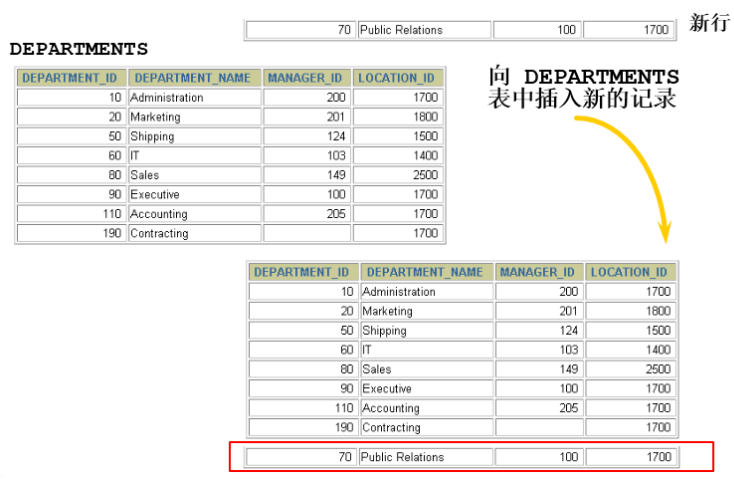

# 11 数据处理之增删改

## 11.1 插入数据

### 11.1.1 实际问题



### 11.1.2 `VALUES` 的方式添加

使用这种语法一次只能向表中插入**<u>一条数据</u>**。 

1. 为所有字段按默认顺序插入

```mysql
INSERT INTO 表名
VALUES (value1,value2,....);
```

2. 为表指定子段插入

```mysql
INSERT INTO 表名(column1 [, column2, …, columnn])
VALUES (value1 [,value2, …, valuen]);
```

3. 同时插入多条记录

```mysql
INSERT INTO table_name
VALUES
(value1 [,value2, …, valuen]),
(value1 [,value2, …, valuen]),
……
(value1 [,value2, …, valuen])

或者
INSERT INTO table_name(column1 [, column2, …, columnn])
VALUES
(value1 [,value2, …, valuen]),
(value1 [,value2, …, valuen]),
……
(value1 [,value2, …, valuen]);
```

> 一个同时插入多行记录的INSERT语句等同于多个单行插入的INSERT语句，但是多行的INSERT语句在处理过程中 效率更高 。因为MySQL执行单条INSERT语句插入多行数据比使用多条INSERT语句快，所以在插入多条记录时最好选择使用单条INSERT语句的方式插入。  

- `VALUES` 也可以写成 `VALUE` ，但是`VALUES`是标准写法；
- 字符和日期型数据应包含在`单引号`中。

### 11.1.3 查询结果插入表中

```mysql
INSERT INTO 目标表名
(tar_column1 [, tar_column2, …, tar_columnn])
SELECT
(src_column1 [, src_column2, …, src_columnn])
FROM 源表名
[WHERE condition]
```

- 在 `INSERT` 语句中加入子查询；
- 不必书写 `VALUES` 子句；
- 子查询中的值列表应与 `INSERT` 子句中的列名对应。

## 11.2 更新数据

```mysql
UPDATE table_name
SET column1=value1, column2=value2, … , column=valuen
[WHERE condition]
```

- 可以一次更新多条数据；
- 如果需要回滚数据，需要保证在**<u>`DML`</u>**前，进行设置：`SET AUTOCOMMIT = FALSE`;

## 11.3 删除数据

```mysql
DELETE FROM table_name [WHERE <condition>];
```

- 如果省略 `WHERE` 子句，则表中的全部数据将被删除。


