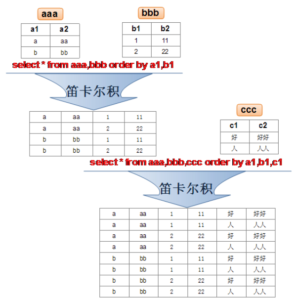
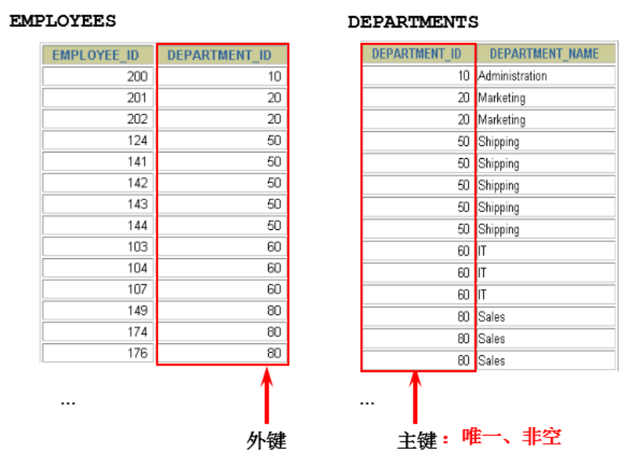
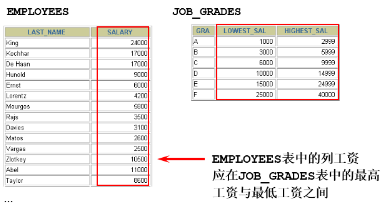
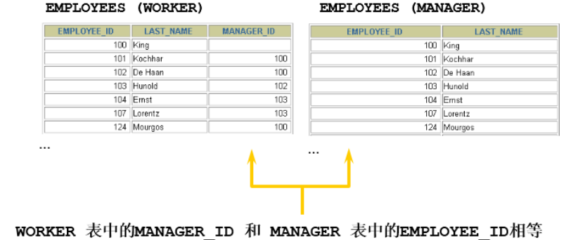

# 6 多表查询

## 6.1 笛卡尔积



在如下情况会出现笛卡尔积：

```mysql
#查询员工姓名和所在部门名称
SELECT last_name,department_name FROM employees,departments;
SELECT last_name,department_name FROM employees CROSS JOIN departments;
SELECT last_name,department_name FROM employees INNER JOIN departments;
SELECT last_name,department_name FROM employees JOIN departments;
```

## 6.2 多表查询分类

### 6.2.1 等值vs非等值连接

#### 等值连接



==**<u>总结：连接n个表，至少需要n-1个连接条件</u>**==

#### 非等值连接



```mysql
SELECT e.last_name, e.salary, j.grade_level
FROM employees e, job_grades j
WHERE e.salary BETWEEN j.lowest_sal AND j.highest_sal;
```

### 6.2.3 自连接vs非自连接

连接两张不同的表叫做**<u>非自连接</u>**如上节介绍，下面的为**<u>自连接</u>**：



### 6.2.4 内连接vs外连接

- 内连接: 合并具有同一列的两个以上的表的行, **结果集中不包含一个表与另一个表不匹配的行**；
- 外连接: 两个表在连接过程中除了返回满足连接条件的行以外**还返回左（或右）表中不满足条件的行 ，这种连接称为左（或右） 外连接**。没有匹配的行时, 结果表中相应的列为空(NULL)；
- 如果是左外连接，则连接条件中**左边**的表也称为`主表` ，**右边**的表称为 `从表` ；
- 如果是右外连接，则连接条件中**右边**的表也称为 `主表` ，**左边**的表称为 `从表` ；

## 6.3 SQL99语法实现多表查询

### 6.3.1 基本语法

`JOIN...ON`语法结构如下：

```sql
SELECT table1.column, table2.column,table3.column
FROM table1
	JOIN table2 ON table1 和 table2 的连接条件
		JOIN table3 ON table2 和 table3 的连接条件
```

- 可以使用 `ON` 子句指定额外的连接条件；
- 这个连接条件是与其它条件分开的；
- `ON` 子句使语句具有更高的易读性；
- 关键字`JOIN`、`INNER JOIN`、`CROSS JOIN` 的含义是一样的，都表示内连接；

### 6.3.2 内连接

#### 语法

```sql
SELECT 字段列表
FROM A表 INNER JOIN B表
ON 关联条件
WHERE 等其他子句;
```

### 6.3.3 外连接

#### 左外连接

```mysql
# 实现查询结果是A
SELECT 字段列表
FROM A表 LEFT JOIN B表
ON 关联条件
WHERE 等其他子句;
```


#### 右外连接

```mysql
#实现查询结果是B
SELECT 字段列表
FROM A表 RIGHT JOIN B表
ON 关联条件
WHERE 等其他子句;
```


#### 满外连接

- 满外连接的结果 = 左右表匹配的数据 + 左表没有匹配到的数据 + 右表没有匹配到的数据；
- SQL99是支持满外连接的。使用`FULL JOIN` 或 `FULL OUTER JOIN`来实现；
- 需要注意的是，MySQL不支持`FULL JOIN`，但是可以用 `LEFT JOIN UNION RIGHT JOIN`代替；

## 6.4 `UNION`的使用

**合并查询结果** 利用`UNION`关键字，可以给出多条SELECT语句，并将它们的结果组合成单个结果集。合并时，两个表对应的列数和数据类型必须相同，并且相互对应。各个SELECT语句之间使用`UNION`或`UNION ALL`关键字分隔。

语法格式：

```sql
SELECT column,... FROM table1
UNION [ALL]
SELECT column,... FROM table2
```

- `UNION` 操作符返回两个查询的结果集的并集，**<u>去除重复记录</u>**；
- `UNION ALL`操作符返回两个查询的结果集的并集。对于两个结果集的重复部分，**<u>不去重</u>**；

