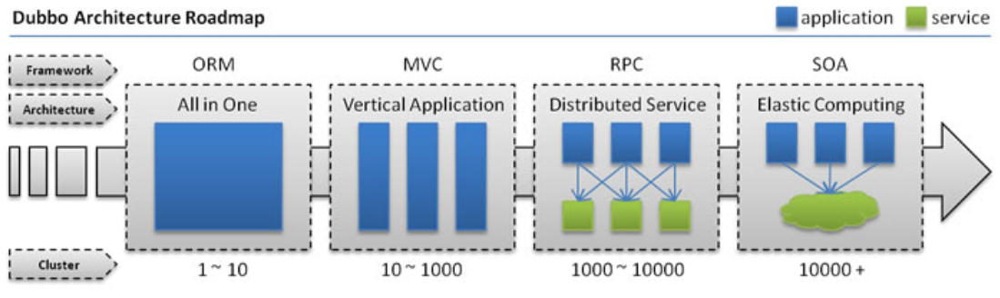

# Redis

**@author: Shuxin_Wang**

**@time: 2023.04.14**

---

[toc]

---

# 1 大型网站的系统特点

## 1.1 高并发、大流量

大型网站系统需要面对高并发用户，大流量访问。Google日均PV数35亿，日均IP访问数3亿；腾讯QQ的最大在线用户数1.4亿（2011年数据）；微信用户量已超11亿；2019年天猫双十一交易额突破2500亿。

## 1.2 高可用

系统7×24小时不间断服务。大型互联网站的宕机事件通常会成为新闻焦点，例如2010年百度域名被黑客劫持导致不能访问，成为重大新闻热点。

## 1.3 海量数据

需要存储、管理海量数据，需要使用大量服务器。Facebook每周上传的照片数目接近10亿，百度收录的网页数目有数百亿，Google有近百万台服务器为全球用户提供服务。

## 1.4 用户分布广泛，网络情况复杂

许多大型互联网都是为全球用户提供服务的，用户分布范围广，各地网络情况千差万别。在国内，还有各个运营商网络互通难的问题。而中美光缆的数次故障，也让一些对国外用户依赖较大的网站不得不考虑在海外建立数据中心。

## 1.5 安全环境恶劣

由于互联网的开放性，使得互联网站更容易受到攻击，大型网站几 乎每天都会被黑客攻击。任何系统漏洞都会被攻击者利用，造成重大损失。

## 1.6 需求快速变更，发布频繁

和传统软件的版本发布频率不同，互联网产品为快速适应市场，满足用户需求，其产品发布频率是极高的。Office的产品版本以年为单位发布，而一般大型网站的产品每周都有新版本发布上线，至于中小型网站的发布就更频繁了，有时候一天会发布几十次。

## 1.7 渐进式发展

与传统软件产品或企业应用系统一开始就规划好全部的功能和非功能需求不同，几乎所有的大型互联网站都是从一个小网站开始，渐进地发展起来的。

Facebook是伯克扎克同学在哈佛大学的宿舍里开发的；Google的第一台服务器部署在斯坦福大学的实验室里；

阿里巴巴则是在马云家的客厅里诞生的。好的互联网产品都是慢慢运营出来的，不是一开始就开发好的，这也正好与网站架构的发展演化过程对应。

# 2 大型网站架构发展历程



## 2.1 单一应用架构

当网站流量很小时，只需一个应用，将所有功能都部署在一起，以减少部署节点和成本。此时，用于简化增删改查工作量的数据访问框架(ORM)是关键。

## 2.2 垂直应用架构

当访问量逐渐增大，单一应用增加机器带来的加速度越来越小，提升效率的方法之一是将应用拆成互不相干的几个应用，以提升效率。此时，用于加速前端页面开发的Web框架(MVC)是关键。

## 2.3 分布式服务架构

当垂直应用越来越多，应用之间交互不可避免，将核心业务抽取出来，作为独立的服务，逐渐形成稳定的服务中心，使前端应用能更快速的响应多变的市场需求。此时，用于提高业务复用及整合的分布式服务框架(RPC)是关键。

## 2.4 流动计算架构

当服务越来越多，容量的评估，小服务资源的浪费等问题逐渐显现，此时需增加一个调度中心基于访问压力实时管理集群容量，提高集群利用率。此时，用于提高机器利用率的资源调度和治理中心(SOA)是关键。

# 3 NoSQL

NoSQL是Not only SQL的缩写，大意为“不只是SQL”，说明这项技术是**传统关系型数据库的补充**而非替代。在整个NoSQL技术栈中**MemCache**、**Redis**、**MongoDB**被称为NoSQL三剑客。那么时代为什么需要NoSQL数据库呢？我们来做个对比：

|              | 关系型数据库             | NoSQL数据库                            |
| ------------ | ------------------------ | -------------------------------------- |
| 数据存储位置 | 硬盘                     | 内存                                   |
| 数据结构     | 高度组织化结构化数据     | 没有预定义的模式                       |
| 数据操作方式 | SQL                      | 所有数据都是键值对，没有声明性查询语言 |
| 事务控制     | 严格的基础事务ACID原则   | 基于乐观锁的松散事务控制               |
| 访问控制     | 细粒度的用户访问权限控制 | 简单的基于IP绑定或密码的访问控制       |
| 外键         | 支持                     | 不支持                                 |
| 索引         | 支持                     | 不支持                                 |

所以NoSQL数据库的最大优势体现为：高性能、高可用性和可伸缩性。

# 4 Redis简介

## 4.1 基本信息

Redis是一个开源（BSD许可）的，内存中的数据结构存储系统，它可以用作数据库、缓存和消息中间件。 它支持多种类型的数据结构，如字符串（`strings`），散列（`hashes`），列表（`lists`），集合（`sets`），有序集合（`sorted sets`） 与范围查询，`bitmaps`，`hyperloglogs`和地理空间（`geospatial`） 索引半径查询。 Redis 内置了复制（`replication`），LUA脚本（`Lua scripting`）， LRU驱动事件（`LRU eviction`），事务（`transactions`）和不同级别的 磁盘持久化（`persistence`）， 并通过Redis哨兵（`Sentinel`）和自动分区（`Cluster`）提供高可用性（`high availability`）。

> Redis is an open source (BSD licensed), in-memory data structure store, used as a database, cache and message broker. It supports data structures such as strings, hashes, lists, sets, sorted sets with range queries, bitmaps, hyperloglogs and geospatial indexes with radius queries. Redis has built-in replication, Lua scripting, LRU eviction, transactions and different levels of on-disk persistence, and provides high availability via Redis Sentinel and automatic partitioning with Redis Cluster.

- Redis的名字是Remote Dictionary Server的缩写。
- 开发语言是ANSI C。
- 支持多种不同语言的客户端。
- 官方给出的性能参考（在并发量50的情况下）：
  - GET: 110000/s:读的速度每秒11万次
  - SET: 81000/s: 写的速度每秒8万次

中文官网http://www.redis.cn

英文官网http://redis.io

Redis命令参考文档网址：http://redisdoc.com

## 4.2 Redis的应用场景

### 4.2.1 典型应用场景

#### 缓存

使用Redis可以建立性能非常出色的缓存服务器，查询请求先在Redis中查找所需要的数据，如果能够查询到（命中）则直接返回，大大减轻关系型数据库的压力。

#### 数据临时存储位置

使用token（令牌）作为用户登录系统时的身份标识，这个token就可以在Redis中临时存储。

#### 分布式Session不一致

Spring提供了一种技术解决分布式环境下Session不一致问题，叫SpringSession。而Redis就可以为SpringSession提供一个数据存储空间。

#### 流式数据去重

在Redis中有一种数据类型是set，和Java中的Set集合很像，不允许存储重复数据。借助这个特性我们可以在Redis中使用set类型存储流式数据达到去重的目的。

### 4.2.2 不适应场景

#### 直接查询value

Redis是一个严格的Key-value数据库，所有数据都必须通过key去找到value，Redis没有提供直接根据查询条件匹配value的方法。

#### 用多键一值表示特定关系

Redis中一个key对应一个value，没有多个key对应同一个value的情况。

#### 事务中回滚

Redis不支持回滚。如果一个命令在加入队列时没有检测出问题，那么队列执行时不会因为某一条命令失败而回滚。

# 5 Redis安装

对于CentOS 7.6+系统，使用如下命令：

## 5.1 命令安装

```shell
# 下载EPEL包
$ sudo yum install epel-release
# 下载并使能snapd
$ sudo yum install snapd
$ sudo systemctl enable --now snapd.socket
$ sudo ln -s /var/lib/snapd/snap /snap
# 下载Redis
$ sudo snapd install redis
# 启动Redis
$ sudo snapd start redis
# 停止Redis
$ sudo snapd stop redis
# 重启Redis
$ sudo snap restart redis
#  卸载Redis
$ sudo snap remove redis
```

##   5.2 离线安装

```shell
# 下载源码压缩文件
$ wget https://download.redis.io/redis-stable.tar.gz
# 解压源码文件
$ tar -zxvf redis-stable.tar.gz
# 1.进入解压文件夹；2.修改安装路径（确保安装路径存在）
$ vim ./src/Makefile
# 修改 PREFIX?=/usr/local/redis
# 编译（确保gcc安装）
$ make
# 安装
$ make install 
```

### 5.2.1 默认启动

 ```shell
 /usr/local/redis/bin/redis-server
 ```


### 5.2.2 定制配置项启动

####  准备配置文件

```shell
cp redis解压目录/redis.conf /usr/local/redis/
```

#### 修改配置项

| 配置项名称 | 作用                                  | 取值                  |
| ---------- | ------------------------------------- | --------------------- |
| daemonize  | 控制是否以守护进程形式运行Redis服务器 | yes                   |
| logfile    | 指定日志文件位置                      | "/var/logs/redis.log" |
| dir        | Redis工作目录                         | /usr/local/redis      |

==**注意：/var/logs目录需要我们提前创建好**==

#### 制定配置文件启动

```shell
# redis-server文件路径 redis.conf文件路径
/usr/local/redis/redis-server /usr/local/redis/redis.conf
```

### 5.2.3 客户端登陆

```shell
/usr/local/redis/bin/redis-cli
```

测试链接或推出

```shell
127.0.0.1:6379> ping
PONG
127.0.0.1:6379> exit
```

# 6 Redis常用数据结构

## 6.1 总体结构

- string
- list
- set
- hash
- zset

Redis中的数据，总体上是键值对，不同数据类型指的是键值对中值的类型。

## 6.2 string

Redis中最基本的类型，它是key对应的一个单一值。二进制安全，不必担心由于编码等问题导致二进制数据变化。所以redis的string可以包含任何数据，比如jpg图片或者序列化的对象。Redis中一个字符串值的最大容量是512M

## 6.3 list类型

Redis 列表是简单的字符串列表，按照插入顺序排序。你可以添加一个元素到列表的头部（左边）或者尾部（右边）。它的底层是双向链表，所以它操作时头尾效率高，中间效率低（额外花费查找插入位置的时间）。

在Redis中list类型是按照插入顺序排序的字符串链表。和数据结构中的普通链表一样，我们可以在其头部(left)和尾部(right)添加新的元素。在插入时，如果该键并不存在，Redis将为该键创建一个新的链表。与此相反，如果链表中所有的元素均被移除，那么该键也将会被从数据库中删除。List中可以包含的最大元素数量是2^32-1个。

**list是一个有序可以重复的数据类型**。


## 6.4 set类型

Redis的set是string类型的无序集合。它是基于哈希表实现的。set类型插入数据时会自动去重。最大可以包含2^32-1个元素。

## 6.5 hash类型

本身就是一个键值对集合。可以当做Java中的Map<String,String>对待。每一个hash可以存储2^32-1个键值对。

## 6.6 zset类型

Redis zset 和 set 一样也是string类型元素的集合,且不允许重复的成员。不同的是每个元素都会关联一个double类型的分数。redis正是通过分数来为集合中的成员进行从小到大的排序。zset的成员是唯一的,但分数(score)却可以重复。

## 6.7 Geospatial

Redis 在 3.2 推出 Geo 类型，该功能可以推算出地理位置信息，两地之间的距离。

## 6.8 HyperLogLogs

用于大数据量基数统计，速度非常快，占用内存非常小。每个HyperLogLog键只需要花费12KB内存，就可以计算接近 2^64个不同元素的基数。比如计算网站UV（User view，用户访问数量，一个用户一天访问同一个URL地址多次合并为一次）。

## 6.9 bitmap

直接对string的二进制位进行操作的一组命令

## 6.10 常用数据类型应用场景

| 数据类型     | 应用场景                                                |
| ------------ | ------------------------------------------------------- |
| string       | 分布式Session存储 分布式数据库ID 计数器：统计网站访问量 |
| hash         | 存储对象信息（购物车中的商品信息） 存储表的信息         |
| list         | 实现队列、栈操作 汇总日志 粉丝列表 关注的人列表         |
| set          | 签到 打卡 点赞                                          |
| zset         | 排行榜 百度热点搜索                                     |
| geospatial   | 获取地理位置信息 两地之间的距离                         |
| hyperloglogs | 基数统计                                                |
| bitmaps      | 统计用户访问次数                                        |

# 7 Redis命令行操作

## 7.1 Redis命令套路

- NX：not exist
- EX：expire
- M：multi

## 7.2 基本操作

7.2.1 切换操作
