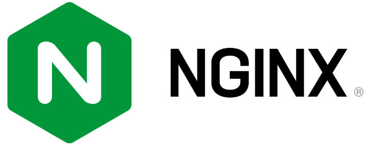

# 1 Nginx简介

Nginx（发音同"engine x"）是一个高性能的反向代理和 Web 服务器软件，最初是由俄罗斯人 Igor Sysoev 开发的。Nginx 的第一个版本发布于 2004 年，其源代码基于双条款 BSD 许可证发布，因其系统资源消耗低、运行稳定且具有高性能的并发处理能力等特性，Nginx 在互联网企业中得到广泛应用。

## 1.1 Nginx不同版本

作为最受欢迎的 Web 服务器之一，Nginx自2004年发布以来已经得到很多互联网企业的应用。官方目前有Nginx开源版和Nginx Plus商业版两个版本，开源版是目前使用最多的版本，商业版除了包含开源版本的全部功能外，还提供了一些独有的企业级功能。

Nginx在国内互联网企业中也得到了广泛应用，企业在实际使用中会根据自身的需求进行相应的扩展和增强。目前国内流行的Nginx主要有两个开源版本，分别是由淘宝网技术团队维护的Tengine项目和由章亦春发起的OpenResty项目。

### 1.1.1 开源Nginx

Nginx 自推出以来，一直专注于低资源消耗、高稳定、高性能的并发处理能力，除了提供 Web 服务器的功能外，还实现了访问代理、负载均衡、内容缓存、访问安全及带宽控制等功能。其基于模块化的代码架构及可与其他开发语言（如 Perl、JavaScript 和 Lua）有效集成的可编程特性，使其具有强大的扩展能力。

部署和优化具有高效率、高性能并发请求处理能力的应用架构是应用架构师一直追求的目标，在应用架构技术的迭代中，各种分离式思想成为主流，比如将访问入口和 Web 服务器分离、将 Web 服务器和动态脚本解析器分开、将 Web 功能不断拆分、微服务等。

Nginx 不仅提供了 Web 服务器的功能，还极大满足了这一主流架构的需求并提供了如下应用特性。

#### 访问路由

现今大型网站的请求量早已不是单一Web服务器可以支撑的了。单一入口、访问请求被分配到不同的业务功能服务器集群，是目前大型网站的通用应用架构。Nginx可以通过访问路径、URL关键字、客户端IP、灰度分流等多种手段实现访问路由分配；

#### 反向代理

就反向代理功能而言，Nginx本身并不产生响应数据，只是应用自身的异步非阻塞事件驱动架构，高效、稳定地将请求反向代理给后端的目标应用服务器，并把响应数据返回给客户端。其不仅可以代理HTTP协议，还支持HTTPS、HTTP/2、FastCGI、uWSGI、SCGI、gRPC 及TCP/UDP等目前大部分协议的反向代理；

#### 负载均衡

Nginx在反向代理的基础上集合自身的上游（upstream）模块支持多种负载均衡算法，使后端服务器可以非常方便地进行横向扩展，从而有效提升应用的处理能力，使整体应用架构可轻松应对高并发的应用场景；

#### 内容缓存

动态处理与静态内容分离是应用架构优化的主要手段之一，Nginx的内容缓存技术不仅可以实现预置静态文件的高速缓存，还可以对应用响应的动态结果实现缓存，为响应结果变化不大的应用提供更高速的响应能力；

#### 可编程

Nginx模块化的代码架构方式为其提供了高度可定制的特性，但可以用C语言开发Nginx模块以满足自身使用需求的用户只是少数。Nginx在开发之初就具备了使用Perl脚本语言实现功能增强的能力。Nginx对JavaScript语言及第三方模块对Lua语言的支持，使得其可编程能力更强；

