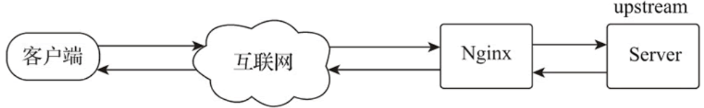

# 8 HTTP代理服务

代理功能根据应用方式的不同可以分为正向代理和反向代理。正向代理是客户端设置代理地址后，以代理服务器的 IP 作为源 IP 访问互联网应用服务的代理方式；反向代理则是客户端直接访问代理服务器，代理服务器再根据客户端请求的主机名、端口号及 URI 路径等条件判断后，将客户端请求转发到应用服务器获取响应数据的代理方式。

## 8.1 模块指令

Nginx 的 HTTP 代理功能是通过 ngx_http_proxy_module 模块实现的，该模块会被默认构建，无须特殊配置编译参数。配置指令如下表所示：

| 指令名称                       | 指令值格式                                                   | 默认值                | 指令说明                                                     |
| :----------------------------- | :----------------------------------------------------------- | :-------------------- | :----------------------------------------------------------- |
| proxy_bind                     | address[transparent] 或 off                                  | --                    | 设置从指定的本地 IP 地址及端口与被代理服务器建立连接，指令值可以是变量。指令值参数为 transparent 时，允许将客户端的真实 IP 透传给被代理服务器，并将客户端的真实 IP 设置为访问被代理服务器的源 IP；指令值参数为 off 时，取消上一层指令域同名指令的配置 |
| proxy_buffering                | on 或 off                                                    | on                    | 设置是否启用响应数据缓冲区                                   |
| proxy_buffers                  | number size                                                  | 4k 或 8k              | 设置每个连接从被代理服务器接收响应数据的缓冲区数量及单个缓冲区的大小。默认单个缓冲区的大小与操作系统的单个内存页（Page Size）的大小相等。缓冲区至少有 2 个 |
| proxy_buffer_size              | size                                                         | 4k 或 8k              | 设置用于读取被代理服务器响应数据第一部分的缓冲区大小，默认值等于操作系统的单个内存页的大小 |
| proxy_busy_buffers_size        | size                                                         | 8k 或 16k             | 当每个连接从被代理服务器接收响应数据时，限制 proxy_buffers 设置的缓冲区中可用于向客户端发送响应数据的缓冲区大小，以使其余的缓冲区用于从被代理服务器接收响应数据。该值必须大于单个缓冲区或 proxy_buffer_size 的大小，小于总缓冲区减掉一个缓冲区的大小。默认值为单个缓冲区大小的 2 倍 |
| proxy_limit_rate               | rate                                                         | 0                     | 限制从被代理服务器读取响应的每个请求的流量速度，单位是字节/秒，指令值为"0"时表示不限制。该指令只有在 proxy_buffering 启用时才有效 |
| proxy_max_temp_file_size       | size                                                         | 1024m                 | 当响应数据超出响应数据缓冲区的大小时，超出部分数据将存储到临时文件中。该指令设置临时文件的最大值，指令值为"0"时，关闭存储临时文件的功能。该值必须大于单个缓冲区或 proxy_buffer_size 的大小 |
| proxy_temp_file_write_size     | size                                                         | 8k 或 16k             | 限制一次写入临时文件的数据大小，默认值为 2 个缓冲区的大小。在默认配置下，缓冲区大小由 proxy_buffer_size 和 proxy_buffers 指令配置限制，最大值是 proxy_max_temp_file_size 指令的值 |
| proxy_temp_path                | path [level1 [level2 [level3]]]                              | proxy_temp            | 设置临时文件存储目录                                         |
| proxy_request_buffering        | on 或 off                                                    | on                    | 设置是否将请求转发给被代理服务器之前，先从客户端读取整个请求体。若禁用该功能，Nginx 接收到请求体时会立即转发给被代理服务器，已经发送请求体的请求，将无法使用 proxy_next_upstream 指令功能。对于基于 HTTP/1.1 协议的分块传输请求，会强制读取完整请求体 |
| proxy_pass                     | address                                                      | --                    | 设置连接被代理服务器的协议、IP 地址或套接字，也可以是域名或 upstream 定义的服务器组 |
| proxy_method                   | method                                                       | --                    | 将当前客户端的请求方法改为指令值设定的请求方法，并向被代理服务器发送请求 |
| proxy_pass_request_body        | on 或 off                                                    | on                    | 设置是否将客户端请求体传递给被代理服务器                     |
| proxy_pass_request_headers     | on 或 off                                                    | on                    | 设置是否将客户端请求头传递给被代理服务器                     |
| proxy_set_header               | field value                                                  | --                    | 在转发给被代理服务器前，修改或添加客户端的请求头属性字段     |
| proxy_set_body                 | value                                                        | --                    | 修改客户端的请求体为指令值指定的内容，指令值可以是文本、变量及其组合 |
| proxy_redirect                 | default 或 off 或 redirect replacement                       | default               | 替换被代理服务器返回的响应头中属性字段 location 或 Refresh 的值，并返回给客户端。指令值为 default 时，使用 proxy_pass 指令值的内容进行替换 |
| proxy_cookie_domain            | off 或 domain replacement                                    | off                   | 修改被代理服务器返回的响应头属性字段 Set-Cookie 中 domain 的内容，支持正则及变量 |
| proxy_cookie_path              | off 或 path replacement                                      | off                   | 修改被代理服务器返回的响应头属性字段 Set-Cookie 中 path 的内容，支持正则及变量 |
| proxy_force_ranges             | on 或 off                                                    | off                   | 无论被代理服务器的 HTTP 响应头中是否有属性字段 Accept-Ranges，都启用 byte-range 请求支持 |
| proxy_hide_header              | field                                                        | --                    | 指定被代理服务器响应数据中不向客户端传递的 HTTP 头字段名称   |
| proxy_pass_header              | field                                                        | --                    | 默认配置下 Nginx 不会将头属性字段 Status 和 X-Accel-... 传递给客户端，可通过该指令开放传递 |
| proxy_headers_hash_bucket_size | size                                                         | 64                    | 设置指令 proxy_set_header 及 proxy_hide_header 使用哈希表的桶的大小 |
| proxy_headers_hash_max_size    | size                                                         | 512                   | 设置指令 proxy_set_header 及 proxy_hide_header 使用哈希表的大小 |
| proxy_ignore_headers           | field...                                                     | --                    | 设置 Nginx 对被代理服务器响应头包含指定字段时，不执行响应操作。如 Expires 和 Cache-Control |
| proxy_send_lowat               | size                                                         | 0                     | 设置 FreeBSD 系统中，使用 kqueue 驱动时 socket 接口 SO_SNDLOWAT 选项的大小。在 Linux、Solaris 及 Windows 平台，该指令无效 |
| proxy_connect_timeout          | time                                                         | 60s                   | Nginx 与被代理服务器建立连接的超时时间，通常不应该超过 75s，与请求是否返回响应无关 |
| proxy_read_timeout             | time                                                         | 60s                   | 在连续两个从被代理服务器接收数据的读操作之间的间隔时间超过设置的时间时，将关闭连接 |
| proxy_send_timeout             | time                                                         | 60s                   | 在连续两个发送到被代理服务器的操作之间的间隔时间超过设置的时间时，将关闭连接 |
| proxy_ignore_client_abort      | on 或 off                                                    | off                   | 设置当客户端未接收响应就关闭连接时，是否关闭 Nginx 与被代理服务器的连接。默认配置下，Nginx 会记录日志响应码 499，并关闭连接 |
| proxy_http_version             | 1.0                                                          | 1.0 或 1.1            | 设置用于代理的 HTTP 协议版本，若使用 keepalive 或 NTLM 认证，建议指令值设置为 1.1 |
| proxy_socket_keepalive         | on 或 off                                                    | off                   | 设置 Nginx 与被代理服务器的 TCP keepalive 行为的心跳检测机制，默认使用操作系统的 socket 配置。若指令值为 on，则开启 SO_KEEPALIVE 选项进行心跳检测 |
| proxy_intercept_errors         | on 或 off                                                    | off                   | 当指令值为 on 时，将拦截被代理服务器响应码大于或等于 300 的结果，error_page 指令可对该结果做后续处理；当指令值为 off 时，直接返回给客户端 |
| proxy_next_upstream            | error、timeout、 invalid_header、 http_500、http_502、 http_503、http_504、 http_403、http_404、 http_429、 non_idempotent、 off... | enror timeout         | 当出现指令值中指定的条件时，将未返回响应的客户端请求传递给 upstream 中的下一个服务器 |
| proxy_next_upstream_timeout    | time                                                         | 0                     | 设置将符合条件的客户端请求传递给 upstream 中下一个服务器的超时时间。"0"为不做超时限制，此时须遍历完所有上游服务器组中的服务器 |
| proxy_next_upstream_tries      | number                                                       | 0                     | 设置将符合条件的客户端请求传递给 upstream 中下一个服务器的尝试次数，包括第一次失败次数。"0"为不做尝试次数限制，此时须遍历完所有上游服务器组中的服务器 |
| proxy_ssl_protocols            | [SSLv2][SSLv3] [TLSv1][TLSv1.1] [TLSv1.2][TLSv1.3]           | TLSv1 TLSv1.1 TLSv1.2 | 指定可用于 Nginx 与被代理服务器建立 SSL 连接的 SSL 协议版本  |
| proxy_ssl_server_name          | on 或 off                                                    | off                   | 在与被代理服务器建立 HTTPS 连接时，设置是否启用通过 SNI 或 RFC 6066 传递主机名 |
| proxy_ssl_ciphers              | ciphers                                                      | DEFAULT               | 设置与被代理服务器建立 SSL 连接时用于协商使用的加密算法组合，又称密码套件，指令值内容为 openssl 的密码套件名称，多个套件名称由":"分隔 |
| proxy_ssl_session_reuse        | on 或 off                                                    | off                   | 决定是否启用与被代理服务器 HTTPS 连接的 SSL 会话重用功能     |
| proxy_ssl_certificate          | file                                                         | --                    | 指定被代理服务器对 Nginx 服务器身份验证的 PEM 格式 SSL 证书文件 |
| proxy_ssl_certificate_key      | file                                                         | --                    | 指定被代理服务器对 Nginx 服务器身份验证的 PEM 格式 SSL 证书私钥文件 |
| proxy_ssl_password_file        | file                                                         | --                    | 存放被代理服务器对 Nginx 服务器身份验证的 PEM 格式 SSL 证书私钥文件的密码文件，一个密码一行。有多个密码时，Nginx 会依次尝试 |
| proxy_ssl_verify               | on 或 off                                                    | off                   | 设置是否启用对被代理服务器的 SSL 证书验证功能                |
| proxy_ssl_crl                  | file                                                         | --                    | 证书吊销列表文件，用以验证被代理服务器 SSL 证书有效性的 PEM 格式文件 |
| proxy_ssl_trusted_certificate  | file                                                         | --                    | 指定一个 PEM 格式 CA 证书（根或中间证书）文件，该证书用作被代理服务器的证书链验证 |
| proxy_ssl_name                 | name                                                         | $proxy_host           | 指定对被代理服务器 SSL 证书验证的主机名                      |
| proxy_ssl_verify_depth         | number                                                       | 1                     | 设置对被代理服务器 SSL 证书链的验证深度                      |

- 在`ngx_http_proxy_module`模块指令列表中，除`proxy_pass`指令以外，其余指令使用的指令域范围都是http、server或location；
- 缓冲区的大小默认为操作系统中单个内存页的大小，在CentOS下可通过如下命令查询：

```shell
> getconf PAGE_SIZE
```

## 8.2 正向代理

正向代理是客户端设置代理地址后，通过将代理服务器的 IP 作为源 IP 访问互联网应用服务的代理方式。通过对正向代理访问设置，可以实现限制客户端的访问行为、下载速度、访问记录统计、隐藏客户端信息等目的。实现原理如下图所示：


### 8.2.1 HTTP正向代理配置

配置样例如下：

```bash
map $host $deny {
     hostnames;
     default 0;
     www.google.com 1;                             # 禁止访问www.google.com
}

server {
    listen 8080;
    resolver 114.114.114.114;
    resolver_timeout 30s;
    access_log logs/proxy_access.log;              # 记录访问日志
    location / {

        if ( $deny ) {
            return 403;                            # 被禁止访问的网址返回403错误
        }
        proxy_limit_rate    102400;                # 限制客户端的下载速率是100KB/s
        proxy_buffering on ;                       # 启用代理缓冲
        proxy_buffers   8 8k;                      # 代理缓冲区大小为64KB
        proxy_buffer_size   8k;                    # 响应数据第一部分的缓冲区大小为8KB
        proxy_busy_buffers_size 16k;               # 向客户端发送响应的缓冲区大小16KB
        proxy_temp_file_write_size  16k;           # 一次写入临时文件的数据大小为16KB

        # 设置所有代理客户端的agent
        proxy_set_header User-Agent "Mozilla/5.0 (Windows; U; Windows NT 5.1; zh-CN; rv:1.8.1.14) Gecko/20080404 Firefox/2.0.0.14" ;

        proxy_set_header Host $http_host;
        proxy_connect_timeout   70s;               # 代理连接超时时间
        proxy_http_version  1.1;                   # 代理协议为http/1.1
        proxy_pass $scheme://$http_host$request_uri; # 代理到远端服务器
    }
}
```

## 8.3 反向代理

反向代理是用户客户端访问代理服务器后，被反向代理服务器软件按照一定的规则从一个或多个被代理服务器中获取响应资源并返回给客户端的代理模式，客户端只知道代理服务器的IP，并不知道后端服务器的IP，原因是代理服务器隐藏了被代理服务器的信息。

因为编写Nginx的反向代理配置时，被代理服务器通常会被编写在upstream指令域中，所以被代理服务器也被称为上游服务器。实现原理如下图所示：



### 8.3.1 反向代理配置

反向代理配置样例如下：

```bash
server {
    listen       80;

    location ~ ^/ {
        proxy_pass   http://127.0.0.1:8080; #被代理服务器
        break;
    }
}
```

