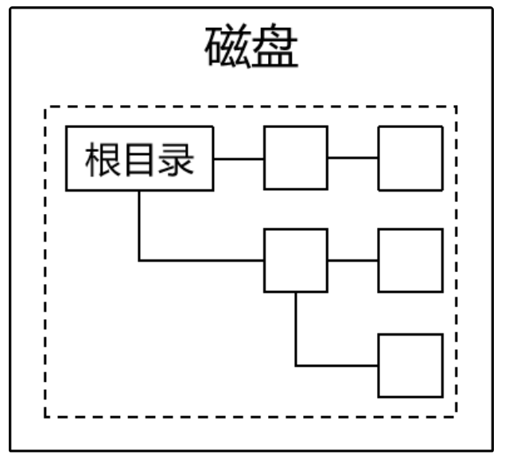
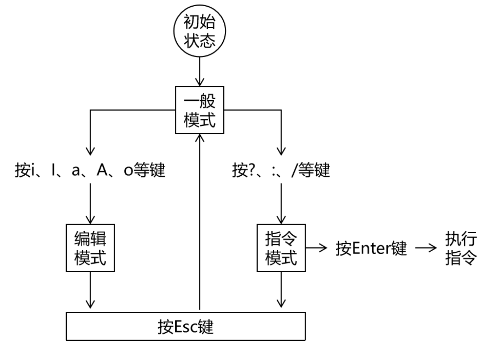
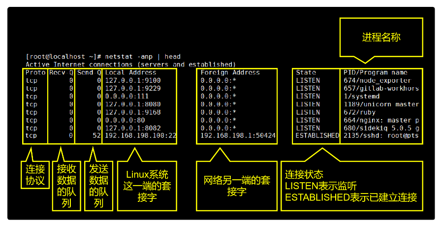
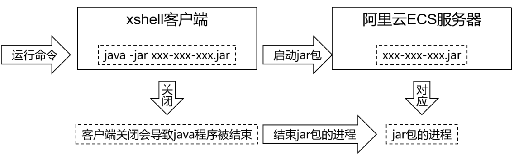
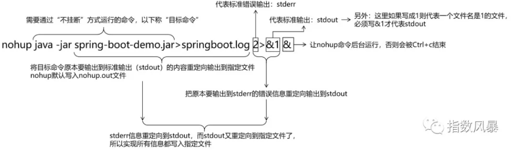
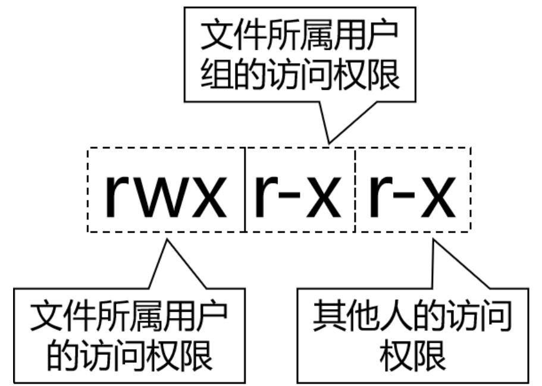

# Linux

**@author: Shuxin_Wang**

**@time: 2023.04.08**

---

[toc]

---

# 1 常用命令

## 1.1 背景知识

### 1.1.1 一切皆文件

在Linux系统中任何东西都是以文件形式来存储的。这其中不仅包括我们熟知的文本文件、可执行文件等等，还包括硬件设备、虚拟设备、网络连接等等，甚至连目录其实都是一种特殊的文件。

### 1.1.2 文件系统

在Linux系统中不管创建了多少个硬盘分区都只有一个文件系统。整个文件系统的根目录是“`/`”，从“`/`”出发可以找到Linux系统中的所有目录和文件。



### 1.1.3 系统中的路径

- 绝对路径：从“/”根目录开始逐层查找文件和目录；
- 相对路径：以当前目录或上一级目录为基准逐层查找文件和目录：
  - 当前目录：“`./`” 当前目录的上一级目录：“`../`”；
  - “`./`”可以省略不写，也同样表示当前目录；

### 1.1.4 文件扩展名不敏感

在Windows系统中，操作系统会负责根据文件扩展名识别文件类型，然后再根据文件类型匹配打开这种文件的应用程序。让用户不必记忆大量的对应关系，用哪个直接打开就好了。

而Linux是一个命令行系统，虽然现在也有了图形化界面，但是还是以命令行使用为主。所以Linux系统中通常是使用命令去打开文件。而这个命令和文件是否匹配，那就需要运行命令的人自己注意。

### 1.1.5 一级目录简介

| 目录名       | 是否重要 | 作用                                                         |
| ------------ | -------- | ------------------------------------------------------------ |
| /bin         |          | bin是binary的缩写，这个目录存放着最经常使用的命令。          |
| /boot        |          | 这里存放的是启动Linux时用到的引导程序文件。                  |
| /dev         |          | device(设备)的缩写，该目录下存放的是Linux的外部设备。        |
| /etc         | √        | 存放系统和第三方应用程序的配置文件。                         |
| /home        | √        | 存放普通用户家目录。                                         |
| /lib和/lib64 |          | 系统开机所需要最基本的动态连接共享库。                       |
| /media       |          | 挂载Linux系统会自动识别的设备，例如U盘、光驱等。             |
| /mnt         |          | mnt是mount（挂载）的缩写，这个目录专门用于挂载操作的目录。   |
| /opt         | √        | 存放安装第三方应用程序时使用的压缩包文件。                   |
| /proc        |          | 这个目录是一个虚拟的目录，它是系统内存的映射。               |
| /root        | √        | 超级管理员root用户的家目录。                                 |
| /run         |          | 存放进程产生的临时文件，关机重启后会消失。                   |
| /sbin        |          | s是Super User的意思，这里存放的是系统管理员使用的系统管理程序。 |
| /srv         |          | service缩写，该目录存放一些服务启动之后需要提取的数据。      |
| /sys         |          | 该目录下安装了2.6内核中新出现的一个文件系统sysfs。           |
| /tmp         |          | 存放临时文件。                                               |
| /usr         | √        | 应用程序的默认安装目录，类似于Windows下的program files目录。 |
| /var         | √        | 存放经常变化的内容，例如日志文件。                           |

## 1.2 文件和目录相关命令

### 1.2.1 快捷键

命令行环境下快捷键：

| 按键         | 作用         |
| ------------ | ------------ |
| Ctrl+l       | 清屏         |
| Ctrl+c       | 强制终止程序 |
| Ctrl+Insert  | 复制         |
| Shift+Insert | 粘贴         |
| Ctrl+s       | 锁屏         |
| Ctrl+q       | 解除锁屏     |
| tab          | 自动补全     |

### 1.2.2 创建目录

格式：

```shell
mkdir [OPTION] DIRECTORY
```

- 单层目录：

`mkdir aaa/bbb/ccc`其中`aaa/bbb`是存在的目录，要创建的仅仅是`ccc`;

- 多层目录：

`mkdir -p aaa/bbb/ccc/ddd`其中`bbb/ccc/ddd`都不存在，现在想一次性把这些目录都建出来；

### 1.2.3 切换目录

格式：

```shell
cd [DIRECTORY]
```

用法1：使用绝对路径；

用法2：使用相对路径；

用法3：使用~回到家目录；

### 1.2.4 `ls`

列出目录中的内容，这里所说的目录可以是当前目录也可以是其他目录（需要指定路径）

```shell
ls [OPTION] [FILE]
```

常用参数

| 参数 | 说明                               |
| ---- | ---------------------------------- |
| -A   | 显示目录内容时把隐藏资源也显示出来 |
| -l   | 以详细信息形式显示资源             |
| -R   | 递归查看目录内容                   |

命令的参数既可以单独使用也可以组合使用。同时`ls -l`可以简写为`ll`

### 1.2.5 打印目录

格式：

```shell
pwd
```

打印当前所在的目录print work directory

### 1.2.6 创建空文件

格式：

```shell
touch [FILE]
```

### 1.2.7 复制文件或目录

格式：

```shell
cp [OPTION] [DIRECTORY or FILE]
```

复制文件：`cp 被复制的文件的路径 目标目录的路径`

复制目录：`cp -r 被复制的目录的路径 目标目录的路径`

### 1.2.8 移动目录文件

格式：

```shell
mv [被移动的文件或目录的路径] [目标目录]
```

**<u>将目录或文件在当前位置移动可以起到重命名的作用</u>**

### 1.2.9 删除目录文件

```shell
rm [OPTION] [目标文件 目录]
```

删除文件：`rm 被删除的文件的路径`

强制删除文件：`rm -f 被删除的文件的路径`

递归删除目录：`rm -r 被删除的目录的路径`

强制删除目录：`rm -rf 被删除的目录的路径`

### 1.2.10 cat

显示文件全部内容，适用短小的文件

### 1.2.11 less

分屏查看文件内容

```shell
less [file]
```

#### 控制方式

| 按键    | 效果                           |
| ------- | ------------------------------ |
| 空格    | 向下滚动一屏                   |
| b       | 向上滚动一屏                   |
| 回车    | 向下滚动一行                   |
| q       | 退出                           |
| /关键词 | 搜索  <br>n向下找  <br>N向上找 |
| =       | 显示详细的文件信息             |

### 1.2.12 tail

显示文件末尾的部分文件

```shell
tail [[OPTION] [ARGS]] [FILE]
```

- 查看文件word末尾5行内容：

```shell
tail -n 5 word
```

- 实时查看文件末尾新增的内容：

```shell
tail -F word
```

### 1.2.13 find

查找文件或目录：

```shell
find [查找范围] [参数] [表达式]
```

示例：


### 1.2.14 locate

#### 简介

locate命令同样是用来查询文件或目录，但它是基于索引查询，速度快很多。

#### locate命令的原理

系统启动时把每一个目录、每一个文件的完整路径保存到索引库中。使用locate命令搜索关键词时，就使用关键词查询索引库，把匹配的路径字符串返回。

而新建的文件或目录不会被系统吧路径存入索引库，那么使用locate命令就搜索不到。此时使用`updatedb`命令更新一下索引库就行了。

### 1.2.15 grep

将文本内容中匹配的行返回：

```shell
grep [参数] [查找内容] [文件]
```

`grep`命令使用`-v`参数可以返回不匹配的行；

### 1.2.16 管道pip

管道不是命令，而是一个符号：“`|`”。它的用法是：`命令A | 命令B`。作用是把命令A的输出作为命令B的输入。

### 1.2.17 tar

在Linux系统环境中，很多程序安装包都是以tar包的形式提供下载的所以通常我们需要从官网下载这些tar包，再上传到Linux服务器上，然后在Linux系统内解压。

```shell
tar -zxvf 包路径
```

默认解压到当前目录下，如果当前目录下有同名的目录或文件会被直接覆盖，没有任何提示，这一点请大家注意。

参数作用说明：

| 参数名称 | 作用                              |
| -------- | --------------------------------- |
| -z       | 用 gzip 对存档压缩或解压          |
| -x       | 解压                              |
| -v       | 详细显示处理的文件                |
| -f       | 指定存档或设备 (缺省为 /dev/rmt0) |

## 1.3 vim

### 1.3.1 简介

在命令行环境下编辑文本文件，在命令行模式下没有鼠标，所以刚开始使用的时候会觉得非常不习惯。但是慢慢的熟练之后你会发现，不需要鼠标全部用键盘就可以操作效率很高。

### 1.3.2 三种模式



一般模式：通过按键控制VIM工作

编辑模式：可以自由输入

指令模式：通过执行指令完成一些特殊操作

### 1.3.3 基本操作

#### 打开文件

```shell
vim [FILE]
```

即使这个文件不存在也没关系，vim知道我们打算新建一个文件。

#### 编辑模式

进入编辑模式有很多种方法，现在我们先使用其中一种方法：按一下i键。进按键的时候屏幕上是不显示“`i`”这个字母的，这个需要注意。然后可以随意输入一些内容。然后再按`Esc`键回到一般模式。

#### 显示行号

接着上一步继续，在回到一般模式后，输入`:set nu`。

#### 保存内容

当指令执行完成后，vim就回到了一般模式，使用指令`:w`保存文件。

#### 推出

使用`:q`指令退出vim

#### 保存退出

- `:w`是保存；

- `:`q是退出；

- `:wq`就是保存退出；
- `:q!`不保存退出；

### 1.3.4 查看

#### 移动

一是使用方向键，另一种方法使用基准键位：

- H：左移；
- J：下移；
- K：上移；
- L：右移；

#### 前往指定行

- 第一行：`gg`；
- 最后一行：`G`；
- 指定行号：`xxG`；

### 1.3.5 修改

**<u>在==一般模式==下：</u>**

| 按键   | 效果                                                         |
| ------ | ------------------------------------------------------------ |
| dd     | 删除光标所在的行                                             |
| d5d    | 从光标所在行开始，向下连续删除5行（包括光标所在行）          |
| u      | 撤销刚才的操作                                               |
| Ctrl+r | 重做刚才撤销的操作                                           |
| yy     | 复制光标所在的行                                             |
| p      | 将当前复制的行粘贴到光标所在位置的下一行                     |
| y5y    | 从光标所在行开始，向下连续复制5行（包括光标所在行）          |
| r      | 替换光标所在位置的一个字符<br>第一步：按一下r键<br>第二步：输入新的字符 |

### 1.3.6 进入编辑模式

| 按键 | 大小写说明 | 光标动作                                                     |
| ---- | ---------- | ------------------------------------------------------------ |
| i    | 小写       | 不动，就在当前位置，开始输入                                 |
| I    | 大写       | 移动到行的开头，开始输入                                     |
| a    | 小写       | 光标向后移动一格，然后开始输入                               |
| A    | 大写       | 光标移动到行的末尾，然后开始输入                             |
| o    | 小写       | 先在光标所在行的下面插入空行  <br>然后把光标移动到空行的开头，再开始输入 |

### 1.3.7 搜索

在一般模式下，输入`/`，进入专门用于搜索关键词的指令模式，输入关键词回车执行，关键词匹配到发内容会被==高亮==显示，**<u>区分大小写</u>**。

在匹配到搜索结果后，可以逐个遍历各个匹配内容：

- `n`：向下找；
- `N`：向上找；

使用`:noh`指令可取消高亮；

### 1.3.8 替换

```shell
:%s/[被替换内容]/[新内容][/[OPTION]]
```

每一行只有第一个匹配的内容被替换了，后面的没有被替换。这是因为对正则表达式来说，它是以行为单位查找匹配的内容。每一行只要找到第一个匹配那么就可以判断这一行就是匹配的，没有必要继续向后查找了。如果我们需要将一行中的每一个匹配都替换，可以在指令后加`/g`；

### 1.3.9 常见问题

#### 存在交换文件

vim在打开一个文件的时候会同时创建一个临时文件，命名方式是“.`原文件名.swp`”，这就是所谓的交换文件。而当vim正常退出时，这个交换文件会被删除。所以如果正常操作我们是看不到这个提示界面的。

而之所以会出现上面的提示，是因为当前的vim命令在创建新的交换文件之前就已经检测到了已存在的交换文件。

再往前推理一步，为什么会有交换文件残留？

- 可能原因1：其他窗口正在使用vim打开同一个文件；
- 可能原因2：非正常关机等原因导致vim没有正常退出；

先根据提示输入Q退出，然后检查是否在其他窗口已经用vim打开了这个文件：

- 是：继续在这个vim中编辑文件；
- 否：删除交换文件，重新编辑；

#### 没有vim命令

```shell
yum install -y vim
```

## 1.4 进程相关命令

### 1.4.1 ps

#### 简介

查看当前正在运行的进程，常用参数组合：`ps -ef`

- `-e`参数：对应单词entire，表示全部。具体指显示系统中全部的进程信息；
- `-f`参数：对应单词full-formate，表示完整格式；

#### 数据说明

| 列名  | 含义                                                     |
| ----- | -------------------------------------------------------- |
| UID   | 进程的用户信息                                           |
| PID   | 进程id。由系统分配，不会重复。                           |
| PPID  | 父进程的id。父进程和子进程的关系是：父进程启动了子进程。 |
| CMD   | 当前进程所对应的程序。                                   |
| C     | 用整数表示的CPU使用率                                    |
| STIME | 进程启动时间                                             |
| TTY   | 进程所在终端。所谓终端就是用户输入命令的操作界面。       |
| TIME  | 进程所占用的CPU时间                                      |

#### 父子进程关系

命令`pstree`查看整个进程树

### 1.4.2 kill

杀死进程，本质上是给进程发送信号：

```shell
kill -s kill [进程号]
```

### 1.4.3 top

#### 简介

实时查看系统运行情况和健康状态。

#### 命令及参数

| 命令名 | 更新时间间隔（秒） | 不显示任何闲置或者僵死进程 | 通过进程id监控单一进程 |
| ------ | ------------------ | -------------------------- | ---------------------- |
| top    | -d 间隔秒数        | -i                         | -p 进程id              |

#### 操作控制

| 按键 | 功能                             |
| ---- | -------------------------------- |
| P    | 默认值，根据CPU使用率排序        |
| M    | 以内存的使用率排序               |
| N    | 以PID排序                        |
| d    | 设置数据刷新的时间间隔，单位是秒 |
| q    | 退出                             |


在`top`命令模式下按`h`键会显示如下的帮助信息。

#### 具体字段解释

**<u>第一行：</u>**

| 内容举例                      | 说明                                                         |
| ----------------------------- | ------------------------------------------------------------ |
| 12:26:49                      | 系统当前时间                                                 |
| up 1 day, 13:32               | 系统的运行时间，前面例子表示本机已经运行1天13小时32分钟      |
| 2 users                       | 当前登录了2个用户                                            |
| load average:0.00, 0.00, 0.00 | 系统在之前1分钟，5分钟，15分钟的平均负载。  <br>一般认为小于1时，负载较小。如果大于1，系统已经超出负荷。 |

**<u>第二行：</u>**

| 内容举例        | 说明                                      |
| --------------- | ----------------------------------------- |
| Tasks: 95 total | 系统中的进程总数                          |
| 1 running       | 正在运行的进程数                          |
| 94 sleeping     | 睡眠的进程                                |
| 0 stopped       | 正在停止的进程                            |
| 0 zombie        | 僵尸进程。如果不是0，需要手工检查僵尸进程 |

**<u>第三行：</u>**

| 内容举例      | 说明                                                         |
| ------------- | ------------------------------------------------------------ |
| Cpu(s):0.1%us | 用户空间占用的CPU百分比，us对应user                          |
| 0.1%sy        | 内核空间占用的CPU百分比，sy对应system                        |
| 0.0%ni        | 改变过优先级的进程占用的CPU百分比，ni对应niced               |
| 99.7%id       | 空闲CPU的CPU百分比                                           |
| 0.1%wa        | 等待输入/输出的进程的占用CPU百分比，wa对应IO wait            |
| 0.0%hi        | 硬中断请求服务占用的CPU百分比，hi对应hardware IRQ            |
| 0.1%si        | 软中断请求服务占用的CPU百分比，si对应software IRQ            |
| 0.0%st        | st（Steal time）虚拟时间百分比，也叫被hypervisor偷走的时间。  <br>就是当有虚拟机时，虚拟CPU等待实际CPU的时间百分比。 |

**<u>第四行：</u>**

| 内容举例          | 说明                   |
| ----------------- | ---------------------- |
| 2031912 total     | 物理内存的总量，单位KB |
| 70496 free        | 空闲的物理内存数量     |
| 1780676 used      | 已经使用的物理内存数量 |
| 174864 buff/cache | 作为缓冲的内存数量     |

使用中的内存总量（used）指的是现在系统内核控制的内存数，空闲内存总量（free）是还未纳入内核管控范围的数量。

纳入内核管理的内存不见得都在使用中，还包括过去使用过的现在可以被重复利用的内存，内核并不把这些可被重新使用的内存还给free，因此Linux系统运行过程中free内存会越来越少，但不影响系统运行。因为这表示更多的空闲内存被内核管理了。

**<u>第五行：</u>**

| 内容举例        | 说明                                             |
| --------------- | ------------------------------------------------ |
| 2097148 total   | 交换分区（虚拟内存）的总大小                     |
| 1137824 free    | 空闲交换分区的大小                               |
| 959324 used     | 已经使用的交互分区的大小                         |
| 58640 avail Mem | 在不交换的情况下，对启动新应用程序可用内存的估计 |

交换分区是一个非常值得关注的地方，如果swap区的used数值持续发生变化那么说明在内核和交换分区之间正在持续发生数据交换，这表示内存不够用了——必须不断把内存中的数据保存到硬盘上。

### 1.4.4 `netstat`

#### 简介

查看网络状态，常用参数：

| 参数名 | 作用                                             |
| ------ | ------------------------------------------------ |
| -a     | 显示所有正在或不在侦听的套接字。                 |
| -n     | 显示数字形式地址而不是去解析主机、端口或用户名。 |
| -p     | 显示套接字所属进程的PID和名称。                  |

#### 说明

`netstat`命令显示的网络状态信息包含两部分内容：

- 本机和外部的连接状态信息；
- 本机系统内部进程间通信信息；



## 1.5 辅助命令

### 1.5.1 history

查看命令历史；

将命令的运行结果写入文件：

- 覆盖写：`命令 > 文件路径`；
- 追加写：`命令 >> 文件路径`；

`/dev/null`，被称为Linux系统的黑洞，因为不管写入多少数据到这个文件，数据都会被销毁。

### 1.5.2 echo

将数据输出到`standard output`（标准输出），主要用来打印环境变量的值。

#### 输出环境变量

在Linux系统中通过『`$`』来引用环境变量，例如：`PATH`；

### 1.5.3 help

#### 概述

在我们学习一个新的命令时，Linux系统自带的官方命令手册就是非常权威的参考文档。而man命令和info命令都可以调出一个命令对应的文档。区别在于man命令阅读体验略好，info命令文档内容更完整。

#### man命令

```shell
man [要查询的命令]
```

| 按键    | 说明                                 |
| ------- | ------------------------------------ |
| 空格    | 向下滚动一屏                         |
| 回车    | 向下滚动一行                         |
| b       | 向上滚动一屏                         |
| q       | 退出                                 |
| /关键词 | 搜索关键词  <br>n向下找  <br>N向上找 |

#### info命令

```shell
info [要查询的命令]
```

| 按键       | 说明             |
| ---------- | ---------------- |
| 方向键：上 | 控制光标向上移动 |
| 方向键：下 | 控制光标向下移动 |
| delete键   | 向上翻页         |
| 空格       | 向下翻页         |
| PgUp       | 向上翻页         |
| PgDn       | 向下翻页         |
| q          | 退出             |

#### 补充

大部分命令都有`--help`参数，也起到参考文档作用。

### 1.5.4 shutdown

#### 原则

服务器端不要轻易关机！执行关机或重启操作前一定要问自己下面六个问题：

- 我现在操作的具体是哪一台服务器？
- 这台服务器是否是生产服务器？
- 这台服务器可能有哪些人登录？
- 我关机或重启后对其他人是否有影响？
- 这台服务器关机或重启是否会导致其他服务器无法正常工作？
- 我现在的操作是否必须通过关机或重启来实现？

一旦错误的关闭或重启了服务器，有可能会给公司造成无法弥补的损失。

#### 相关命令

| 命令     | 作用                   |
| -------- | ---------------------- |
| sync     | 将内存数据保存到硬盘上 |
| poweroff | 关机                   |
| reboot   | 重启                   |

### 1.5.5 backslash

符号：`\`，如果一个命令特别长，那么可以使用反斜杠表示到下一行继续输入。

### 1.5.6 curl

语法：

```shell
curl [-X 请求方式] [URL地址]
```

### 1.5.7 wget

语法：

```shell
wget [-P 目标目录] [下载URL地址]
```

### 1.5.8 nohup

我们把一个 `SpringBoot` 工程导出为 jar 包，jar 包上传到阿里云 ECS 服务器上，使用 `java -jar xxx-xxx.jar` 命令启动这个 `SpringBoot` 程序。此时我们本地的`xshell`客户端必须一直开着，一旦 `xshell` 客户端关闭，`java -jar xxx-xxx.jar`进程就会被结束，`SpringBoot`程序就访问不了了。

所以我们希望启动`SpringBoot` 的`jar`包之后，对应的进程可以一直运行，不会因为`xshell`客户端关闭而被结束。



#### 不挂断运行

所谓“不挂断”就是指客户端断开连接后，命令启动的进程仍然运行。`nohup` 命令就是 “no hang up” 的缩写。使用`nohup`命令启动`SpringBoot`微服务工程的完整写法是：

```shell
nohup java -jar spring-boot-demo.jar>springboot.log 2>&1 &
```



## 1.6 字符串处理命令

### 1.6.1 正则表达式符号

| 符号     | 含义                     |
| -------- | ------------------------ |
| ^        | 匹配字符串开始位置的字符 |
| $        | 匹配字符串结束位置的字符 |
| .        | 匹配任何一个字符         |
| *        | 匹配前面的字符出现0~n次  |
| [a,m,u]  | 匹配字符a或m或u          |
| [a-z]    | 匹配所有小写字母         |
| [A-Z]    | 匹配所有大写字母         |
| [a-zA-Z] | 匹配所有字母             |
| [0-9]    | 匹配所有数字             |
| \        | 特殊符号转义             |

### 1.6.2 basename

返回路径字符串中的资源（文件或目录本身）部分

```shell
[root@apple w]# basename /aa/bb/cc/dd
dd
```

如果指定了后缀，basename会帮我们把后缀部分也去掉

```shell
[root@apple workspace]# basename /aa/bb/cc/dd.txt .txt
dd
```

### 1.6.3 dirname

返回路径字符串中的目录部分

```shell
[root@apple w]# dirname /aa/bb/cc/dd
/aa/bb/cc
```

# 2 Linux系统的管理与维护

## 2.1 权限控制

### 2.1.1 权限

- 用户：系统使用者登录系统时使用的账号、密码。系统通过“用户”来识别使用者的身份。使用者以“用户”的名义操作系统资源；
- 登录：使用者想要让系统认可自己的身份就必须提供账号、密码等信息。更专业的说法是：“认证（authentication）”；
- 资源：权限控制系统要保护的对象。权限控制系统中必须要保存每一个资源所要求的访问权限。哪怕是“不需要任何权限，任何人都可以使用”也是权限信息的一种描述——没有要求也是一种要求；
- 授权：authorization，系统给用户分配权限。这些权限代表了用户可以做什么；
- 校验：一个用户访问一个资源的时候，权限控制系统必须要检查这个用户持有的权限是否满足目标资源所要求的权限；
- 用户组：同一类的用户归到同一个组，也可以叫做角色；

### 2.1.2 基础命令

| 命令                   | 作用                           |
| ---------------------- | ------------------------------ |
| groupadd 组名          | 创建用户组                     |
| id 用户名              | 返回用户信息，检查用户是否存在 |
| useradd -g 组名 用户名 | 创建用户，同时指定所属用户组   |
| passwd 用户名          | 给用户账号设置密码             |

### 2.1.3 权限信息

权限信息共分三组，每组三位：



下面介绍rwx-分别是什么意思：

- r：读（read）
    - 读文件：查看文件内容
    - 例如：cat、less、tail等命令
    - 读目录：查看目录内容
    - 例如：使用ll命令查看目录内容
- w：写（write）
    - 写文件：向文件中写入新内容
    - 写目录：在目录里面增删内容
    - 例如：在目录内新建文件、删除文件、新建目录、删除目录给目录重命名
- x：执行（execute）
    - 执行文件：把文件当作可执行程序来运行
    - 执行目录：使用cd命令进入目录
- -：无权限

由于每一位要么有权限要么没有权限，所以天然可以使用二进制来表示权限信息：

- 1：有
- 0：无

| 权限的符号表示 | 权限的二进制表示 | 权限的十进制表示 |
| -------------- | ---------------- | ---------------- |
| rwx r-x r-x    | 111 101 101      | 7 5 5            |
| rw- r-- r--    | 110 100 100      | 6 4 4            |

### 2.1.4 chxxx命令

| 命令名 | 作用                     |
| ------ | ------------------------ |
| chmod  | 修改权限信息             |
| chown  | 修改文件或目录的所属用户 |
| chgrp  | 修改文件或目录的所属组   |

- 用户、组、其他人做相同设置

```shell
chmod [+|-][r|w|x] [目标目录文件]
```

- 精确控制

```shell
chmod [权限十进制表示] [目标目录文件]
```


## 2.2 服务管理

### 2.2.1 服务的概念

操作系统中在后台持续运行的程序，本身并没有操作界面，需要通过端口号访问和操作。CentOS 6和CentOS 7的服务管理有很大区别，我们分别来看。

### 2.2.2 CentOS6服务

#### service服务

启动服务：`service 服务名 start`

停止服务：`service 服务名 stop`

重启服务：`service 服务名 restart`

重新加载服务：`service 服务名 reload`

查看服务状态：`service 服务名 status`

#### chkconfig命令

查看服务列表：`chkconfig [--list]`

设置具体服务**开机自动启动**状态：`chkconfig 服务名 on/off`

#### 运行级别

`vim /etc/inittab`查看系统配置。CentOS6系统使用0~6这7个数字来控制Linux系统的启动方式。

- 运行级别0：系统停机状态，系统默认运行级别不能设为0，否则不能正常启动；

- 运行级别1：单用户工作状态，root权限，用于系统维护，禁止远程登陆；

- 运行级别2：多用户状态(没有NFS)，没有网络服务；
- 运行级别3：完全的多用户状态(有NFS)，登录后进入控制台命令行模式；
- 运行级别4：系统未使用，保留；
- 运行级别5：X11表示控制台，进入图形界面；
- 运行级别6：系统正常关闭并重启，默认运行级别不能设为6，否则不能正常启动；

常用的是3或5。

`chkconfig` 命令使用 `--level` 参数和一`个数值`可以控制一个服务在某个运行级别的是否自动启动。

### 2.2.3 CentOS7服务

#### systemctl命令

- 启动服务：`systemctl start 服务名(xxxx.service)`；
- 重启服务：`systemctl restart 服务名(xxxx.service)`；
- 停止服务：`systemctl stop 服务名(xxxx.service)`；
- 重新加载服务：`systemctl reload 服务名(xxxx.service)`；
- 查看服务状态：`systemctl status 服务名(xxxx.service)`；
- 查看所有已经启动的服务：`systemctl list-units --type=service`；
- 设置开机自启动：`systemctl enable 服务名(xxxx.service)`；
- 禁止开机自启动：`systemctl disable 服务名(xxxx.service)`；


