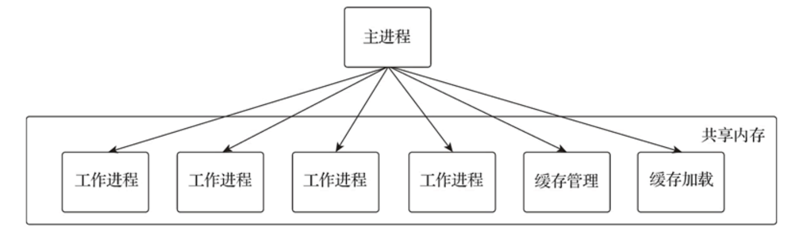
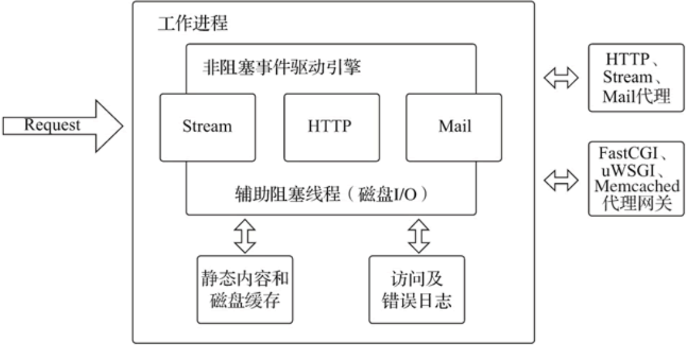
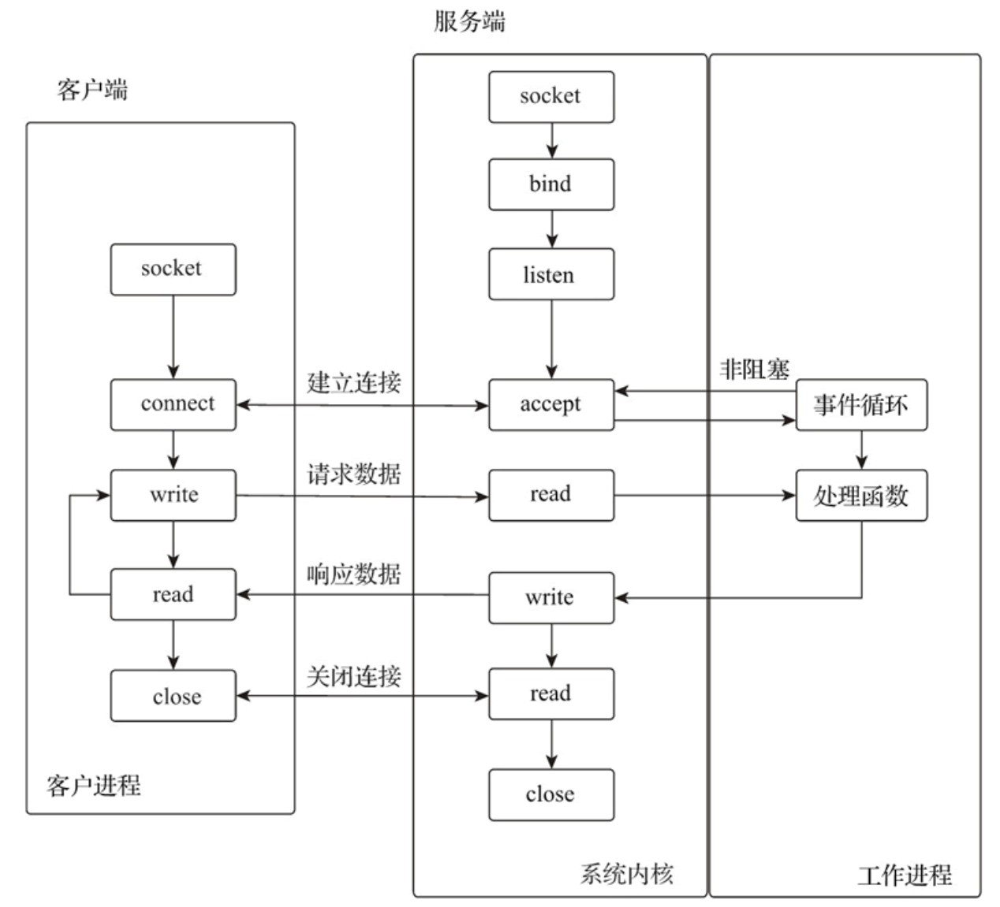
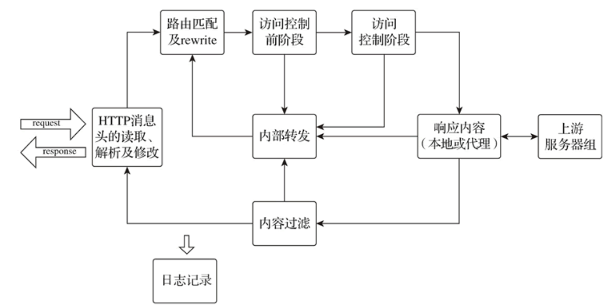
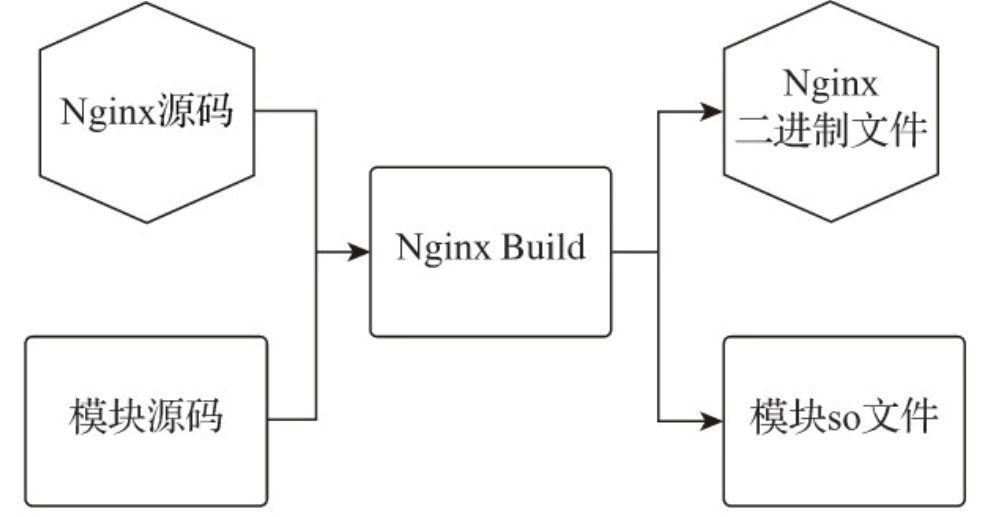
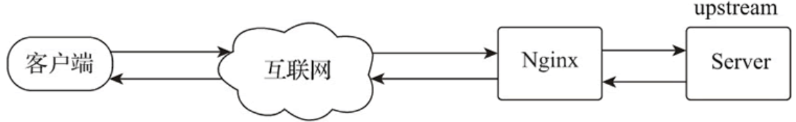

# Nginx

**@author: Shuxin_Wang**

**@time: 2023.04.15**

---

[toc]

---

# 1 Nginx简介

Nginx（发音同"engine x"）是一个高性能的反向代理和 Web 服务器软件，最初是由俄罗斯人 Igor Sysoev 开发的。Nginx 的第一个版本发布于 2004 年，其源代码基于双条款 BSD 许可证发布，因其系统资源消耗低、运行稳定且具有高性能的并发处理能力等特性，Nginx 在互联网企业中得到广泛应用。


## 1.1 Nginx不同版本

作为最受欢迎的 Web 服务器之一，Nginx自2004年发布以来已经得到很多互联网企业的应用。官方目前有Nginx开源版和Nginx Plus商业版两个版本，开源版是目前使用最多的版本，商业版除了包含开源版本的全部功能外，还提供了一些独有的企业级功能。

Nginx在国内互联网企业中也得到了广泛应用，企业在实际使用中会根据自身的需求进行相应的扩展和增强。目前国内流行的Nginx主要有两个开源版本，分别是由淘宝网技术团队维护的Tengine项目和由章亦春发起的OpenResty项目。

### 1.1.1 开源Nginx

Nginx 自推出以来，一直专注于低资源消耗、高稳定、高性能的并发处理能力，除了提供 Web 服务器的功能外，还实现了访问代理、负载均衡、内容缓存、访问安全及带宽控制等功能。其基于模块化的代码架构及可与其他开发语言（如 Perl、JavaScript 和 Lua）有效集成的可编程特性，使其具有强大的扩展能力。

部署和优化具有高效率、高性能并发请求处理能力的应用架构是应用架构师一直追求的目标，在应用架构技术的迭代中，各种分离式思想成为主流，比如将访问入口和 Web 服务器分离、将 Web 服务器和动态脚本解析器分开、将 Web 功能不断拆分、微服务等。

Nginx 不仅提供了 Web 服务器的功能，还极大满足了这一主流架构的需求并提供了如下应用特性。

#### 访问路由

现今大型网站的请求量早已不是单一Web服务器可以支撑的了。单一入口、访问请求被分配到不同的业务功能服务器集群，是目前大型网站的通用应用架构。Nginx可以通过访问路径、URL关键字、客户端IP、灰度分流等多种手段实现访问路由分配；

#### 反向代理

就反向代理功能而言，Nginx本身并不产生响应数据，只是应用自身的异步非阻塞事件驱动架构，高效、稳定地将请求反向代理给后端的目标应用服务器，并把响应数据返回给客户端。其不仅可以代理HTTP协议，还支持HTTPS、HTTP/2、FastCGI、uWSGI、SCGI、gRPC 及TCP/UDP等目前大部分协议的反向代理；

#### 负载均衡

Nginx在反向代理的基础上集合自身的上游（upstream）模块支持多种负载均衡算法，使后端服务器可以非常方便地进行横向扩展，从而有效提升应用的处理能力，使整体应用架构可轻松应对高并发的应用场景；

#### 内容缓存

动态处理与静态内容分离是应用架构优化的主要手段之一，Nginx的内容缓存技术不仅可以实现预置静态文件的高速缓存，还可以对应用响应的动态结果实现缓存，为响应结果变化不大的应用提供更高速的响应能力；

#### 可编程

Nginx模块化的代码架构方式为其提供了高度可定制的特性，但可以用C语言开发Nginx模块以满足自身使用需求的用户只是少数。Nginx在开发之初就具备了使用Perl脚本语言实现功能增强的能力。Nginx对JavaScript语言及第三方模块对Lua语言的支持，使得其可编程能力更强；

# 2 Nginx源码架构分析

Nginx低资源消耗、高稳定、高性能的并发处理能力，来源于其优秀的代码架构。它采用了多进程模型，使自身具有低资源消耗的特性。以事件驱动的异步非阻塞多进程请求处理模型，使 Nginx 的工作进程通过异步非阻塞的事件处理机制，实现了高性能的并发处理能力，让每个连接的请求均可在Nginx进程中以工作流的方式得到快速处理。

Nginx 代码架构充分利用操作系统的各种机制，发挥了软硬件的最大性能，使它在普通硬件上也可以处理数十万个并发连接。而且 Nginx 支持在多种操作系统下部署运行，为发挥Nginx的最大性能，需要对不同的平台进行细微的调整，为方便了解Nginx架构的特点，本教程仅以 Linux 系统平台为例进行介绍。

## 2.1 多进程模型

进程是操作系统资源分配的最小单位，由于CPU数量有限，多个进程间通过被分配的时间片来获得CPU的使用权，系统在进行内核管理和进程调度时，要执行保存当前进程上下文、更新控制信息、选择另一就绪进程、恢复就绪进程上下文等一系列操作，而频繁切换进程会造成资源消耗。

Nginx采用的是固定数量的多进程模型，由一个主进程（Master Process）和==**<u>数量与主机CPU核数相同</u>**==的工作进程协同处理各种事件。主管理进程负责工作进程的配置加载、启停等操作，工作进程负责处理具体请求。



进程间的资源都是独立的，每个工作进程处理多个连接，每个连接由一个工作进程全权处理，不需要进行进程切换，也就不会产生由进程切换引起的资源消耗问题。默认配置下，工作进程的数量与主机CPU核数相同，充分利用CPU和进程的亲缘性（affinity）将工作进程与CPU绑定，从而最大限度地发挥多核CPU的处理能力。



Nginx主进程负责**<u>监听外部控制信号</u>**，通过**<u>频道机制</u>**将相关信号操作传递给工作进程，多个工作进程间通过**<u>共享内存</u>**来共享数据和信息。

### 2.1.1 信号

信号（signal）又称软中断信号，可通过调用系统命令` kill `来发送信号实现进程通信。在Nginx系统中，主进程负责监听外部信号，实现对进程的热加载、平滑重启及安全关闭等操作的响应。

Nginx 支持的信号如下表所示：

| 信号        | 命令行参数 | 功能                    |
| :---------- | :--------- | :---------------------- |
| TERM 或 INT | stop       | 快速关闭 Nginx 服务     |
| QUIT        | quit       | 安全关闭 Nginx 服务     |
| HUP         | reload     | 热加载配置文件          |
| WINCH       |            | 安全关闭工作进程        |
| USR1        | reopen     | 重新创建日志文件        |
| USR2        |            | 平滑更新 Nginx 执行文件 |

在Linux系统下可以通过kill命令向Nginx进程发送信号指令，代码如下：

- `kill -HUP 'cat nginx.pid'`

在Linux系统下也可以通过`nginx -s`命令行参数实现信号指令的发送，代码如下：

- `nginx -s reload`

### 2.1.2 频道

频道（channel）是Nginx主进程向工作进程传递信号操作的通信方式，用于将控制工作进程的信号操作传递给工作进程。通信频道的原理是应用`socketpair`方法使用本机的socket方式实现进程间的通信。主进程发送频道消息，工作进程接收频道消息并执行相应操作，如工作进程的创建与停止等。

创建工作进程时会将接收频道消息的套接字注册到对应的事件引擎（如epoll）中，当事件引擎监听到主进程发送的频道消息时，就会触发回调函数通知工作进程执行响应操作。

### 2.1.3 共享内存

共享内存是 Linux 操作系统下进程间的一种简单、高效的通信方式，其允许多个进程访问同一个内存地址，一个进程改变了内存中的内容后，其他进程都可以使用变更后的内容。Nginx的多个进程间就是通过共享内存的方式共享数据的，主进程启动时创建共享内存，工作进程创建（fork方式）完成后，所有的进程都开始使用共享内存。

用户可以在配置文件中配置共享内存名称和大小，定义不同的共享内存块供Nginx不同的功能使用，Nginx解析完配置文件后，会将定义的共享内存通过slab机制进行内部统一划分和管理。

### 2.1.4 进程调度

当工作进程被创建时，每个工作进程都继承了主进程的监听套接字（socket），所以所有工作进程的事件监听列表中会共享相同的监听套接字。但是多个工作进程间同一时间内只能由一个工作进程接收网络连接，为使多个工作进程间能够协调工作，Nginx的工作进程有如下几种调度方式。

#### 无调度模式

所有工作进程都会在连接事件被触发时争相与客户端建立连接，建立连接成功则开始处理客户端请求。无调度模式下所有进程都会争抢资源，但最终只有一个进程可以与客户端建立连接，对于系统而言这将在瞬间产生大量的资源消耗，这就是所谓的惊群现象；

#### 互斥锁模式（accept_mutex）

互斥锁是一种声明机制，每个工作进程都会周期性地争抢互斥锁，一旦某个工作进程抢到互斥锁，就表示其拥有接收HTTP建立连接事件的处理权，并将当前进程的socket监听注入事件引擎（如epoll）中，接收外部的连接事件。

其他工作进程只能继续处理已经建立连接的读写事件，并周期性地轮询查看互斥锁的状态，只有互斥锁被释放后工作进程才可以抢占互斥锁，获取HTTP建立连接事件的处理权。当工作进程最大连接数的1/8与该进程可用连接（free_connection）的差大于或等于1时，则放弃本轮争抢互斥锁的机会，不再接收新的连接请求，只处理已建立连接的读写事件。

互斥锁模式有效地避免了惊群现象，对于大量HTTP的短连接，该机制有效避免了因工作进程争抢事件处理权而产生的资源消耗。但对于大量启用长连接方式的HTTP连接，互斥锁模式会将压力集中在少数工作进程上，进而因工作进程负载不均而导致QPS下降。

#### 套接字分片（Socket Sharding）

套接字分片是由内核提供的一种分配机制，该机制允许每个工作进程都有一组相同的监听套接字。当有外部连接请求时，由内核决定哪个工作进程的套接字监听可以接收连接。这有效避免了惊群现象的发生，相比互斥锁机制提高了多核系统的性能。该功能需要在配置 listen指令时启用reuseport参数。

Nginx 1.11.3以后的版本中互斥锁模式默认是关闭的，由于Nginx的工作进程数量有限，且Nginx通常会在高并发场景下应用，很少有空闲的工作进程，所以惊群现象的影响不大。无调度模式因少了争抢互斥锁的处理，在高并发场景下可提高系统的响应能力。套接字分片模式则因为由Linux内核提供进程的调度机制，所以性能最好。

### 2.1.5 事件驱动

事件驱动程序设计（Event-Driven Programming）是一种程序设计模型，这种模型的程序流程是由外部操作或消息交互事件触发的。其代码架构通常是预先设计一个事件循环方法，再由这个事件循环方法不断地检查当前要处理的信息，并根据相应的信息触发事件函数进行事件处理。通常未被处理的事件会放在事件队列中等待处理，而被事件函数处理的事件也会形成一个事件串，因此事件驱动模型的重点就在于事件处理的弹性和异步化。

为了确保操作系统运行的稳定性，Linux系统将用于寻址操作的虚拟存储器分为内核空间和用户空间，所有硬件设备的操作都是在内核空间中实现的。当应用程序监听的网络接口接收到网络数据时，内核会先把数据保存在内核空间的缓冲区中，然后再由应用程序复制到用户空间进行处理。

Linux操作系统下所有的设备都被看作文件来操作，所有的文件都通过文件描述符（File Descriptor，FD）集合进行映射管理。套接字是应用程序与TCP/IP协议通信的中间抽象层，也是一种特殊的文件，应用程序以文件描述符的方式对其进行读/写（I/O）、打开或关闭操作。每次对socket进行读操作都需要等待数据准备（数据被读取到内核缓冲区），然后再将数据从内核缓冲区复制到用户空间。

为了提高网络I/O操作的性能，操作系统设计了多种I/O网络模型。在Linux系统下，网络并发应用处理最常用的就是I/O多路复用模型，该模型是一种一个进程可以监视多个文件描述符的机制，一旦某个文件描述符就绪（数据准备就绪），进程就可以进行相应的读写操作。

epoll模型是Linux系统下I/O多路复用模型里最高效的I/O事件处理模型，其最大并发连接数仅受内核的最大打开文件数限制，在1GB内存下可以监听10万个端口。epoll模型监听的所有连接中，只有数据就绪的文件描述符才会调用应用进程、触发响应事件，从而提升数据处理效率。epoll模型利用mmap映射内存加速与内核空间的消息传递，从而减少复制消耗。

作为Web服务器，Nginx的基本功能是处理网络事件，快速从网络接口读写数据。Nginx结合操作系统的特点，基于I/O多路复用模型的事件驱动程序设计，采用了异步非阻塞的事件循环方法响应处理套接字上的accept事件，使其在调用accept时不会长时间占用进程的CPU时间片，从而能够及时处理其他工作。通过事件驱动的异步非阻塞机制，使大量任务可以在工作进程中得到高效处理，以应对高并发的连接和请求。



## 2.2 工作流机制

Nginx在处理客户端请求时，每个连接仅由一个进程进行处理，每个请求仅运行在一个工作流中，工作流被划分为多个阶段，请求在不同阶段由功能模块进行数据处理，处理结果异常或结束则将结果返回客户端，否则将进入下一阶段。工作进程维护工作流的执行，并通过工作流的状态推动工作流完成请求操作的闭环。



### 2.2.1 HTTP请求处理阶段

HTTP 请求的处理过程可分为 11 个阶段，HTTP 请求处理阶段如下表所示：

| 阶段标识                      | 阶段说明                                                     |
| :---------------------------- | :----------------------------------------------------------- |
| NGX_HTTP_POST_READ_PHASE      | 读取请求阶段，会进行 HTTP 请求头的读取和解析处理             |
| NGX_HTTP_SERVER_REWRITE_PHASE | server重定向阶段，会在URI进入location路由前修改URI的内容，进行重定向处理 |
| NGX_HTTP_FIND_CONFIG_PHASE    | URI匹配阶段，URI进行location匹配处理，该阶段不支持外部模块引入 |
| NGX_HTTP_REWRITE_PHASE        | rewrite重写阶段，对URI执行rewrite规则修改处理                |
| NGX_HTTP_POST_REWRITE_PHASE   | rewrite重写结束阶段，对rewrite的结果执行跳转操作并进行次数验证，超过10次的则认为是死循环，返回500错误。该阶段不支持外部模块引入 |
| NGX_HTTP_PREACCESS_PHASE      | 访问控制前阶段，进行连接数、单IP访问频率等的处理             |
| NGX_HTTP_ACCESS_PHASE         | 访问控制阶段，进行用户认证、基于源IP的访问控制等处理         |
| NGX_HTTP_POST_ACCESS_PHASE    | 访问控制结束阶段，对访问控制的结果进行处理，如向用户发送拒绝访问等响应。该阶段不支持外部模块引入 |
| NGX_HTTP_PRECONTENT_PHASE     | 访问内容前阶段，对目标数据进行内容检验等操作。以前的版本称为 NGX_HTTP_TRY_FILES_PHASE，try_files 和 mirror 功能在这个阶段被执行 |
| NGX_HTTP_CONTENT_PHASE        | 访问内容阶段，执行读取本地文件，返回响应内容等操作           |
| NGX_HTTP_LOG_PHASE            | 日志记录阶段，处理完请求，进行日志记录                       |

HTTP 请求处理阶段可以让每个模块仅在该阶段独立完成该阶段可实现的功能，而整个 HTTP 请求则是由多个功能模块共同处理完成的。

### 2.2.2 TCP/UDP处理阶段

TCP/UDP会话一共会经历7个处理阶段，每个TCP/UDP会话会自上而下地按照7个阶段进行流转处理，每个处理阶段的说明如下表所示：

| 阶段标识    | 阶段说明                                                     |
| :---------- | :----------------------------------------------------------- |
| Post-accept | 接收客户端连接请求后的第一阶段。模块 ngx_stream_realip_module 在这个阶段被调用 |
| Pre-access  | 访问处理前阶段。模块 ngx_stream_limit_conn_module 在这个阶段被调用 |
| Access      | 访问处理阶段。模块 ngx_stream_access_module 在这个阶段被调用 |
| SSL         | TLS/SSL 处理阶段。模块 ngx_stream_ssl_module 在这个阶段被调用 |
| Preread     | 数据预读阶段。将 TCP/UDP 会话数据的初始字节读入预读缓冲区，以允许 ngx_stream_ssl_preread_module 之类的模块在处理之前分析 |
| Content     | 数据数据处理阶段。通常将 TCP/UDP 会话数据代理到上游服务器，或将模块 ngx_stream_return_module 指定的值返回给客户端 |
| Log         | 记录客户端会话处理结果的最后阶段。模块 ngx_stream_log_module 在这个阶段被调用 |

Nginx功能模块就是根据不同的功能目的，按照模块开发的加载约定嵌入不同的处理阶段的。

## 2.3 模块化

Nginx 一直秉持模块化的理念，其模块化的架构中，除了少量的主流程代码，都是模块。模块化的设计为 Nginx 提供了高度的可配置、可扩展、可定制特性。模块代码包括核心模块和功能模块两个部分：核心模块负责维护进程的运行、内存及事件的管理；功能模块则负责具体功能应用的实现，包括路由分配、内容过滤、网络及磁盘数据读写、代理转发、负载均衡等操作。Nginx 的高度抽象接口使用户很容易根据开发规范进行模块开发，有很多非常实用的第三方模块被广泛使用。

### 2.3.1 模块分类

#### 核心模块（core）

该模块提供了Nginx服务运行的基本功能，如Nginx的进程管理、CPU亲缘性、内存管理、配置文件解析、日志等功能；

#### 事件模块（event）

该模块负责进行连接处理，提供对不同操作系统的I/O网络模型支持和自动根据系统平台选择最有效I/O网络模型的方法；

#### HTTP模块（http）

该模块提供HTTP处理的核心功能和部分功能模块，HTTP核心功能维护了HTTP多个阶段的工作流，并实现了对各种HTTP功能模块的管理和调用；

#### Mail模块（mail）

该模块实现邮件代理功能，代理IMAP、POP3、SMTP协议；

#### Stream模块（stream）

该模块提供TCP/UDP会话的代理和负载相关功能；

#### 第三方模块

第三方模块即非Nginx官方开发的功能模块，据统计，在开源社区发布的第三方模块已经达到 100 多个，其中lua-resty、nginx-module-vts等模块的使用度非常高；

### 2.3.2 动态模块

Nginx 早期版本在进行模块编译时，通过编译配置（configure）选项` --with_module `和` --without-module `决定要编译哪些模块，被选择的模块代码与Nginx核心代码被编译到同一个Nginx二进制文件中，Nginx文件每次启动时都会加载所有的模块。这是一种静态加载模块的方式。随着第三方模块的增多和Nginx Plus的推出，模块在不重新编译Nginx的情况下被动态加载成为迫切的需求。

Nginx 从1.9.11版本开始支持动态加载模块的功能，该功能使Nginx可以在运行时有选择地加载Nginx官方或第三方模块。为使动态模块更易于使用，Nginx官方还提供了pkg-oss工具，该工具可为任何动态模块创建可安装的动态模块包。

在Nginx开源版本的代码中，编译配置选项中含有`=dynamic`选项，表示支持动态模块加载。例如，模块http_xslt_module的动态模块编译配置选项示例如下：

- `./configure --with-http_xslt_module=dynamic`

编译后，模块文件以so文件的形式独立存储于Nginx的modules文件夹中。动态模块编译如下图所示：



在不同编译配置选项下，Nginx 在编译时会因为某些结构字段未被使用而不会将其编译到代码中，因此就会出现不同编译配置选项的动态模块无法加载的问题。为解决这个问题，Nginx 在编译配置选项中提供了`--with-compat`选项，在进行 Nginx 及动态模块编译配置时如果使用了该选项，在相同版本的 Nginx 代码下，动态模块即使与 Nginx 执行文件的其他编译配置选项不同，也可以被 Nginx 执行文件加载。启用兼容参数编译的示例如下：

- `./configure --with-compat --with-http_xslt_module=dynamic`

可以在配置文件中使用 load_module 指令加载动态模块，示例如下：

- `load_module "modules/ngx_http_xslt_filter_module.so"`

# 3 Nginx编译安装

Nginx是一款优秀的开源软件，支持在FreeBSD、Linux、Windows、macOS等多种操作系统平台下编译及运行。CentOS拥有良好的系统结构和工具软件生态环境，是一款基于 Linux 的非常流行的发行版本。CentOS源自RedHat企业版，按照Linux的开源协议编译而成，在稳定性及技术的可持续性方面完全可以代替RedHat企业版，因此我们选择将它CentOS作为本教程的操作系统环境。

## 3.1 编译环境准备

### 3.1.1 操作系统的准备

Nginx 是一款优秀的开源软件，是运行在操作系统上的应用程序，因此 Nginx 的性能依赖于操作系统及其对底层硬件的管理机制，为了使 Nginx 在运行时发挥最大的性能，需要对操作系统的服务配置和参数做一些调整。系统服务配置可用如下方式实现。

#### 系统服务安装

CentOS 可用最小化安装，安装完毕后，用如下命令补充工具。

```shell
yum -y install epel-release              # 安装扩展工具包yum源
yum install net-tools wget nscd lsof      # 安装工具
```

#### DNS 缓存

编辑 `/etc/resolv.conf` 配置DNS服务器，打开NSCD服务，缓存DNS，提高域名解析响应速度。

```shell
systemctl start nscd.service             # 启动NSCD服务
systemctl enable nscd.service`
```

#### ③ 修改文件打开数限制

操作系统默认单进程最大打开文件数为 1024，要想实现高并发，可以把单进程的文件打开数调整为 65536。

```shell
echo "* soft nofile 65536               # *号表示所用用户
\* hard nofile 65536" >>/etc/security/limits.conf
```

### 3.1.2 Linux内核参数

Linux 系统是通过`proc`文件系统实现访问内核内部数据结构及改变内核参数的，`proc`文件系统是一个伪文件系统，通常挂载在 `/proc`目录下，可以通过改变`/proc/sys`目录下文件中的值对内核参数进行修改。

`/proc/sys`目录下的目录与内核参数类别如下表所示：

| 目录   | 内核参数类别 |
| :----- | :----------- |
| fs     | 文件系统     |
| kernel | CPU、进程    |
| net    | 网络         |
| vm     | 内存         |

Linux 系统环境下，所有的设备都被看作文件来进行操作，建立的网络连接数同样受限于操作系统的最大打开文件数。最大打开文件数会是系统内存的10%（以 KB 来计算），称为系统级限制，可以使用` sysctl -a | grep fs.file-max `命令查看系统级别的最大打开文件数。

同时，内核为了不让某个进程消耗掉所有的文件资源，也会对单个进程最大打开文件数做默认值处理，称之为用户级限制，默认值一般是 1024，使用` ulimit -n `命令可以查看用户级文件描述符的最大打开数。

## 3.2 Nginx源码编译

### 3.2.1 源码获取

Nginx 源码可通过官网直接下载，源码获取命令如下：

```shell
mkdir -p /opt/data/source
cd /opt/data/source
wget http://nginx.org/download/nginx-1.24.0.tar.gz
tar zxmf nginx-1.24.0.tar.gz
```

### 3.2.2 编译配置参数

编译Nginx源码文件时，首先需要通过编译配置命令 configure 进行编译配置。编译配置命令 configure 的常用编译配置参数如下表所示：

| 编译配置参数                              | 默认值/默认编译状态 | 参数说明                                                     |
| :---------------------------------------- | :------------------ | :----------------------------------------------------------- |
| --prefix=PATH                             | /usr/local          | 编译后代码的安装目录                                         |
| --with-select_module                      | 不编译              | 编译 select I/O 事件机制模块，在不支持 Nginx 默认 I/O 事件机制的操作系统下自动编译该模块 |
| --without-select_module                   | 编译                | 不编译 select I/O 事件机制模块                               |
| --with-poll_module                        | 不编译              | 编译 poll/O 事件机制模块，在不支持 Nginx 默认 I/O 事件机制的操作系统下自动编译该模块 |
| --without-poll_module                     | 编译                | 不编译 poll I/O 事件机制模块                                 |
| --with-threads                            | 不编译              | 启用线程池支持                                               |
| --with-file-aio                           | 不编译              | 启用 AIO 支持                                                |
| --with-http_ssl_module                    | 不编译              | 编译 SSL 模块                                                |
| --with-http_v2_module                     | 不编译              | 编译 HTTP/2 模块                                             |
| --with-http_realip_module                 | 不编译              | 编译 HTTP 的真实 IP 模块                                     |
| --with-http_addition_module               | 不编译              | 编译响应内容追加模块                                         |
| --with-http_xslt_module                   | 不编译              | 编译 XSLT 样式表转换模块                                     |
| --with-http_xslt_module=dynamic           | --                  | 动态编译 XSLT 样式表转换 XML 响应模块                        |
| --with-http_image_filter_module           | 编译                | 编译图像转换模块                                             |
| --with-http_image_filter_module=dynamic   | --                  | 动态编译图像转换模块                                         |
| --with-http_geoip_module                  | 编译                | 编译客户端 IP 解析城市地址模块                               |
| --with-http_geoip_module=dynamic          | --                  | 动态编译客户端 IP 解析城市地址模块                           |
| --with-http_sub_module                    | 不编译              | 编译字符串替换模块                                           |
| --with-http_dav_module                    | 不编译              | 编译 WebDAV 协议支持模块                                     |
| --with-http_flv_module                    | 不编译              | 编译 FLV 文件伪流媒体服务器支持模块                          |
| --with-http_mp4_module                    | 不编译              | 编译 MP4 文件伪流媒体服务器支持模块                          |
| --with-http_gunzip_module                 | 不编译              | 编译 gzip 压缩兼容模块                                       |
| --with-http_gzip_static_module            | 不编译              | 编译发送 gz 预压缩文件数据模块                               |
| --with-http_auth_request_module           | 不编译              | 编译请求认证模块                                             |
| --with-http_random_index_module           | 不编译              | 编译随机首页模块                                             |
| --with-http_secure_link_module            | 不编译              | 编译请求连接安全检查模块                                     |
| --with-http_degradation_module            | 不编译              | 编译内存不足响应模块                                         |
| --with-http_slice_module                  | 不编译              | 编译文件切片模块                                             |
| --with-http_stub_status_module            | 不编译              | 编译运行状态模块                                             |
| --without-http_charset_module             | 编译                | 不编译字符集转换模块                                         |
| --without-http_gzip__module               | 编译                | 不编译 gzip 方式压缩输出模块                                 |
| --without-http_ssi_module                 | 编译                | 不编译 SSI 支持模块                                          |
| --without-http_userid_module              | 编译                | 不编译 cookie 操作模块                                       |
| --without-http_access_module              | 编译                | 不编译基于 IP 的访问控制模块                                 |
| --without-http_auth_basic_module          | 编译                | 不编译 HTTP 基本认证模块                                     |
| --without-http_mirror_module              | 编译                | 不编译访问镜像模块                                           |
| --without-http_autoindex_module           | 编译                | 不编译自动目录索引模块                                       |
| --without-http_geo_module                 | 编译                | 不编译根据客户 IP 创建变量模块                               |
| --without-http_map_module                 | 编译                | 不编译变量映射模块                                           |
| --without-http_split_clients_module       | 编译                | 不编译自定义客户请求分配模块                                 |
| --without-http_referer_module             | 编译                | 不编译 referer 操作模块                                      |
| --without-http_rewrite_module             | 编译                | 不编译 rewrite 规则模块                                      |
| --without-http_proxy_module               | 编译                | 不编译代理功能模块                                           |
| --without-http_fastcgi_module             | 编译                | 不编译 FastCGI 支持模块                                      |
| --without-http_uwsgi_module               | 编译                | 不编译 uWSGI 支持模块                                        |
| --without-http_scgi_module                | 编译                | 不编译 SCGI 支持模块                                         |
| --without-http_grpc_module                | 编译                | 不编译 gRPC 支持模块                                         |
| --without-http_memcached_module           | 编译                | 不编译 Memcached 服务访问模块                                |
| --without-http_limit_conn_module          | 编译                | 不编译并发连接数控制模块                                     |
| --without-http_limit_req_module           | 编译                | 不编译单 IP 请求数限制模块                                   |
| --without-http_empty_gif_module           | 编译                | 不编译空 GIF 图片模块                                        |
| --without-http_browser_module             | 编译                | 不编译客户端浏览器识别模块                                   |
| --without-http_upstream_hash_module       | 编译                | 不编译 hash 负载均衡算法模块                                 |
| --without-http_upstream_ip_hash_module    | 编译                | 不编译 HTTP 协议 ip-hash 负载均衡模块                        |
| --without-http_upstream_least_conn_module | 编译                | 不编译最少连接数算法负载均衡模块                             |
| --without-http_upstream_random_module     | 编译                | 不编译随机选择算法负载均衡模块                               |
| --without-http_upstream_keepalive_module  | 编译                | 不编译负载均衡后端长连接支持模块                             |
| --without-http_upstream_zone_module       | 编译                | 不编译负载均衡共享内存支持模块                               |
| --with-http_perl_module                   | 不编译              | 编译 Perl 脚本支持模块                                       |
| --with-http_perl_module=dynamic           | --                  | 动态编译 Perl 脚本支持模块                                   |
| --with-stream                             | 不编译              | 编译 TCP/UDP 代理模块                                        |
| --with-stream=dynamic                     | --                  | 动态编译 TCP/UDP 代理模块                                    |
| --with-stream_ssl_module                  | 不编译              | 编译 TCP/UDP 代理 SSL 支持模块                               |
| --with-stream_realip_module               | 不编译              | 编译 TCP/UDP 代理真实 IP 模块                                |
| --with-stream_geoip_module                | 不编译              | 编译地域信息解析模块                                         |
| --with-stream_geoip_module=dynamic        | --                  | 动态编译地域信息解析模块                                     |
| --with-stream_ssl_preread_module          | 不编译              | 编译 TCP/UDP 代理的 SSL 预处理模块                           |

更多编译参数可以见官网说明：[Building nginx from Sources](https://nginx.org/en/docs/configure.html)

对于上表，有以下三点说明：

- TCMalloc是谷歌开源的一个内存管理分配器，优于Glibc的malloc内存管理分配器；
- upstream 是被代理服务器组的 Nginx 内部标识，通常称为上游服务器；
- 开启 pcre JIT 支持，可以提升处理正则表达式的速度。

如上表所示，具有带`--with`前缀的编译配置参数的模块都不会被默认编译，若要使用该功能模块，需要使用提供的编译配置参数进行编译配置。相反，具有带`--without`前缀的编译配置参数的模块都会被默认编译，如果不想使用某个功能模块，在进行编译配置时添加带有`--without`前缀的参数即可。此处只列出了常用功能的编译配置参数，也可以通过编译配置命令的帮助参数获得更多的编译配置参数。

- `./configure --help`

### 3.2.3 添加第三方模块

Nginx 的功能是以模块方式存在的，同时也支持添加第三方开发的功能模块。执行configure时，通过` --add-module=PATH `参数指定第三方模块的代码路径，在make时就可以进行同步编译了。

添加第三方静态模块的方法如下：

- `./configure --add-module=../ngx_http_proxy_connect_module`

添加第三方动态模块的方法如下：

- `./configure --add-dynamic-module=../ngx_http_proxy_connect_module --with-compat`

# 4 Nginx配置简述

## 4.1 环境配置

用vim打开`/etc/profile`文件：

```shell
vim /etc/profile
```

在文件末尾添加：

```bash
export PATH=$PATH:/usr/local/nginx/sbin
```

保存退出，刷新：

```shell
source /etc/profile
```

## 4.2 命令行参数

启动Nginx：

```shell
> nginx
```

命令语法格式：

```shell
nginx [-?hvVtTq] [-s signal] [-c filename] [-p prefix] [-g directives]
```

- -v 参数：显示 Nginx 执行文件的版本信息；
- -V 参数：显示 Nginx 执行文件的版本信息和编译配置参数；
- -t 参数：进行配置文件语法检查，测试配置文件的有效性；
- -T 参数：进行配置文件语法检查，测试配置文件的有效性，同时输出所有有效配置内容；
- -q 参数：在测试配置文件有效性时，不输出非错误信息；
- -s 参数：发送信号给 Nginx 主进程，信号可以为以下 4 个；
  - stop：快速关闭；
  - quit：正常关闭；
  - reopen：重新打开日志文件；
  - reload：重新加载配置文件，启动一个加载新配置文件的 Worker Process，正常关闭一个加载旧配置文件的 Worker Process；
- -p 参数：指定Nginx的执行目录，默认为configure时的安装目录，通常为`/usr/local/nginx`；
- -c 参数：指定`nginx.conf`文件的位置，默认为`conf/nginx.conf`；
- -g 参数：外部指定配置文件中的全局指令；

示例如下：

```bash
nginx -t               # 执行配置文件检测
nginx -t -q            # 执行配置文件检测，且只输出错误信息
nginx -s stop          # 快速停止Nginx
nginx -s quit          # 正常关闭Nginx
nginx -s reopen        # 重新打开日志文件
nginx -s reload        # 重新加载配置文件
nginx -p /usr/local/newnginx            # 指定Nginx的执行目录
nginx -c /etc/nginx/nginx.conf          # 指定nginx.conf文件的位置
# 外部指定pid和worker_processes配置指令参数
nginx -g "pid /var/run/nginx.pid; worker_processes 'sysctl -n hw.ncpu';"
```

# 5 Nginx配置文件详解

Nginx**<u>默认编译</u>**安装后，配置文件都会保存在`/usr/local/nginx/conf`目录下，在配置文件目录下，Nginx默认的主配置文件是 `nginx.conf`，这也是Nginx唯一的默认配置入口。

## 5.1 配置文件目录

Nginx配置文件在conf目录下，其默认目录结构如下：

```bash
conf/
    ├── fastcgi.conf
    ├── fastcgi.conf.default
    ├── fastcgi_params
    ├── fastcgi_params.default
    ├── koi-utf
    ├── koi-win
    ├── mime.types
    ├── mime.types.default
    ├── nginx.conf
    ├── nginx.conf.default
    ├── scgi_params
    ├── scgi_params.default
    ├── uwsgi_params
    ├── uwsgi_params.default
    └── win-utf
```

其中，以"`.default`"为扩展名的文件是Nginx配置文件的配置样例文件。各配置文件的说明如下：

- `fastcgi_params`：Nginx在配置FastCGI代理服务时会根据`fastcgi_params`文件的配置向FastCGI服务器传递变量，该配置文件现已由`fastcgi.conf`代替；
- `fastcgi.conf`：为了规范配置指令SCRIPT_FILENAME的用法，引入FastCGI变量传递配置；
- `mime.types`：MIME类型映射表，Nginx会根据服务端文件后缀名在映射关系中获取所属文件类型，将文件类型添加到HTTP消息头字段"`Content-Type`"中；
- `nginx.conf`：Nginx 默认的配置入口文件；
- `scgi_params`：Nginx 在配置SCGI代理服务时会根据`scgi_params`文件的配置向SCGI服务器传递变量；
- `uwsgi_params`：Nginx 在配置uWSGI代理服务时会根据`uwsgi_params`文件的配置向uWSGI服务器传递变量；
- `koi-utf`、`koi-win`、`win-utf`：这 3 个文件是KOI8-R编码转换的映射文件，因为Nginx的作者是俄罗斯人，在Unicode流行之前，KOI8-R 是使用最为广泛的俄语编码。

## 5.2 配置文件结构

### 5.2.1 配置指令

在配置文件中，由Nginx约定的内部固定字符串，Nginx官方文档中的英文单词为directive，本教程中则统一称为配置指令，简称指令。指令是Nginx中功能配置的最基本元素，Nginx的每个功能配置都是通过多个不同的指令组合来实现的；

### 5.2.2 配置指令值

每个配置指令都有对应的内容来表示该指令的控制参数，本教程中约定其对应的内容为配置指令值，简称指令值。指令值可以是字符串、数字或变量等多种类型；

### 5.2.3 配置指令语句

指令与指令值组合构成指令语句。一条指令语句可以包含多个配置指令值，在Nginx配置文件中，每条指令语句都要用`;`作为语句结束的标识符；

### 5.2.4 配置指令域

配置指令值有时会是由`{ }`括起来的指令语句集合，本教程中约定`{ }`括起来的部分为配置指令域，简称指令域。指令域既可以包含多个指令语句，也可以包含多个指令域；

### 5.2.5 配置全局域

配置文件`nginx.conf`中上层没有其他指令域的区域被称为配置全局域，简称全局域。

Nginx 的常见配置指令域如下表所示：

| 域名称   | 域类型 | 域说明                                                       |
| :------- | :----- | :----------------------------------------------------------- |
| main     | 全局域 | Nginx 的根级别指令区域。该区域的配置指令是全局有效的，该指令名为隐性显示，nginx.conf 的整个文件内容都写在该指令域中 |
| events   | 指令域 | Nginx 事件驱动相关的配置指令域                               |
| http     | 指令域 | Nginx HTTP 核心配置指令域，包含客户端完整 HTTP 请求过程中每个过程的处理方法的配置指令 |
| upstream | 指令域 | 用于定义被代理服务器组的指令区域，也称"上游服务器"           |
| server   | 指令域 | Nginx 用来定义服务 IP、绑定端口及服务相关的指令区域          |
| location | 指令域 | 对用户 URI 进行访问路由处理的指令区域                        |
| stream   | 指令域 | Nginx 对 TCP 协议实现代理的配置指令域                        |
| types    | 指令域 | 定义被请求文件扩展名与 MIME 类型映射表的指令区域             |
| if       | 指令域 | 按照选择条件判断为真时使用的配置指令域                       |

打开系统默认的`nginx.conf`文件，可以看到整个文件的结构如下：

```bash
#user  nobody;
worker_processes  1;                             # 只启动一个工作进程
events {
    worker_connections  1024;               # 每个工作进程的最大连接为1024
}
http {
    include       mime.types;                    # 引入MIME类型映射表文件
    default_type  application/octet-stream;   # 全局默认映射类型为application/octet-stream

    #log_format  main  '$remote_addr - $remote_user [$time_local] "$request" '
    #                  '$status $body_bytes_sent "$http_referer" '
    #                  '"$http_user_agent" "$http_x_forwarded_for"';
    #access_log  logs/access.log  main;
    sendfile        on;                             # 启用零复制机制
    keepalive_timeout  65;                  # 保持连接超时时间为65s
    server {
        listen       80;                              # 监听80端口的网络连接请求
        server_name  localhost;             # 虚拟主机名为localhost
        #charset koi8-r;
        #access_log  logs/host.access.log  main;
        location / {
            root   html;
            index  index.html index.htm;
        }
        error_page   500 502 503 504  /50x.html;
        location = /50x.html {
            root   html;
        }
    }
}
```

由上述配置文件可以看出，配置文件中的指令和指令值是以类似于`key-value`的形式书写的。写在配置文件全局域的指令是Nginx配置文件的核心指令，主要是对Nginx自身软件运行进行配置的指令。其中，`events`和`http`所包含的部分分别为事件指令域和`HTTP`指令域，指令域内的指令则明确约定了该区域内的指令的应用范围。

`server`指令域被包含于`http`指令域中，同时又包含了`location`指令域，各指令域中的共用范围逐层被上层指令域限定，可见各指令域匹配的顺序是由外到内的。`Nginx`的配置指令按照内部设定可以同时编写在不同指令域中，包含在最内层的指令将对外层同名指令进行指令值覆盖，并以最内层指令配置为最终生效配置。

编写Nginx配置文件时，为了便于维护，也会把一些指令或指令域写在外部文件中，再通过`include`指令引入`nginx.conf`主配置文件中。例如，配置文件中把写有types指令域的`mime.types`文件引用到`http`指令域中。此处使用的是`nginx.conf`文件的相对路径。

## 5.3 配置文件中的计量单位

在 Nginx 配置文件中有很多与容量、时间相关的指令值，Nginx 配置文件有如下规范。

1. 容量单位可以使用字节、千字节、兆字节或千兆字节，示例如下：

```bash
512
1k或1K
10m或10M
1g或10G
```

2. 时间的最小单位是毫秒，示例如下:

```bash
10ms  # 10毫秒
30s     # 30秒
2m      # 2分钟
5h      # 5小时
1h 30m  # 1小时30分
6d      # 6天
3w      # 3周
5M      # 5个月
2y      # 2年
```

## 5.4 配置文件中的哈希表

Nginx 使用哈希表加速对Nginx配置中常量的处理，如server中的主机名、types中的MIME类型映射表、请求头属性字段等数据集合。哈希表是通过关键码来快速访问常量对应值的数据存储结构，在通过哈希表获取数据的过程中，其内部实现通过相关函数将常量名转换为一个关键码来实现对应值的快速定位和读取。

由于数据的复杂性，会出现不同常量名转换的关键码是一样的情况，这就会导致读取对应值时发生冲突。为了解决这个问题，Nginx同时引入了哈希桶机制，就是把相同关键码的哈希键存在一个哈希桶定义的存储空间中，然后再进行二次计算来获取对应的值。

单个哈希桶的大小等于CPU缓存行大小的倍数。这样就可以通过减少内存访问的数量来加速在CPU中搜索哈希关键码的速度。如果哈希桶的大小等于CPU的缓存行的大小，在Nginx进行哈希关键码搜索期间，内存的访问次数最多是两次，一次是计算哈希桶的地址，另一次是在哈希桶内进行哈希关键码的搜索。

Linux系统下查看CPU缓存行的指令如下：

`cat /proc/cpuinfo |grep cache_alignment`

Nginx在每次启动或重新加载配置时会选择合适大小的最小初始化哈希表。哈希表的大小会随哈希桶数量的增加而不断调整，直到哈希桶总的大小达到哈希表设置的最大值。因此，在Nginx提示需要增加哈希表或哈希桶的大小时，要先调整哈希表的大小。

# 6 进程配置

## 6.1 进程管理

Nginx本身是一款应用软件，在其运行时，用户可对其运行方式、动态加载模块、日志输出等使用其内建的基础配置指令进行配置，指令说明如下表所示：

| 指令        | 默认值               | 指令说明                                                     |
| :---------- | :------------------- | :----------------------------------------------------------- |
| daemon      | on                   | 用于设定 Nginx 进程是否以守护进程的方式在后台运行，on 为启用，off 为不启用 |
| pid         | logs/nginx.pid       | 设定保存 Nginx 主进程 ID 的文件路径                          |
| user        | nobody nobody        | 用于设定 Nginx 启动后，主进程唤起的工作进程运行的用户及用户组 |
| load_module | --                   | 加载动态模块的指令                                           |
| include     | --                   | 加载外部配置文件                                             |
| error_log   | logs/error.log error | 指定错误日志文件路径及文件名                                 |
| pcre_jit    | off                  | 用于设定在配置文件中的正则表达式是否使用 pcre_jit 技术，off 为不使用，on 为使用 |
| ssl_engine  | --                   | 指定使用的OpenSSL加速引擎名称                                |

其中，`pcre_jit`需要Nginx在配置编译时加上`--with-pcre-jit`参数；error_log 的日志级别可以为如下值：`debug、info、notice、warn、error、crit、alert、emerg`。

在 Linux 系统中，可用如下命令查看当前系统支持的OpenSSL加速引擎信息：

- `openssl engine -t`

## 6.2 进程调优

Nginx 是按照事件驱动架构设计的。每个外部请求都以事件的形式被工作进程（Worker Process）响应，并发完成各种功能的操作处理。Nginx工作进程的性能依赖于硬件和操作系统的配置，在实际应用场景中，用户需要按照硬件、操作系统或应用场景需求的侧重点进行相应的配置调整。

Nginx的进程调优配置指令如下面表格中所示：

### 6.2.1 线程池指令

| 名 称    | 线程池指令                                                   |
| :------- | :----------------------------------------------------------- |
| 指令     | thread_pool                                                  |
| 作用 域  | main                                                         |
| 默认值   | thread_pool default threads=32 max_queue=65536;              |
| 指令说明 | 线程池配置指令，允许调整默认线程池或创建新的线程池，用于读取和发送文件的场景中。在线程池中所有线程都繁忙时，新的请求任务将在队列中等待，默认情况下，等待队列中的最大任务数是65536，使用线程池机制时，通过配置该指令，可以在因读取和发送文件引发阻塞的场景中提升Nginx读取和发送文件的处理性能。 |

配置样例如下：

- `thread_pool pool_1 threads=16`;

具体参数说明如下。

- `thread_pool` 也可以编写在 http 指令域中；
- threads参数定义了线程池的线程数；
- max_queue 参数指定了等待队列中的最大任务数，在线程池中所有线程都处于繁忙状态时，新任务将进入等待队列。等待队列中的最大任务数为 65536；
- 线程池指令需要在编译配置时增加`--with-threads`参数；

### 6.2.2 定时器方案指令

| 名 称    | 定时器方案指令                                               |
| :------- | :----------------------------------------------------------- |
| 指令     | timer_resolution                                             |
| 作用域   | main                                                         |
| 默认值   | --                                                           |
| 指令说明 | Nginx 中的处理事件超时管理方案有两种，一种是设定一个定时器，每过一段时间就对所有超时事件进行一次扫描；另一种是先计算出距离当前时间最近的将要发生超时事件的时间，然后等待这个时间之后再去进行一次超时检测。默认配置下使用第二种超时检测方案，该方案是依据事件超时时间与当前时间的时间差进行检测的，所以每次事件返回都需要进行新的检测时间计算，在 I/O 事件比较多的场景下，这会导致频繁地调用时间函数 gettimeofday 进行计算并更新下次检测的时间，资源消耗相对较高。而设置一个指定的时间值启用第一种方案时，Nginx 内置的事件超时检测定时器会在指定时间周期内进行事件超时检测，无须调用时间函数 gettimeofday 更新时间，资源消耗相对较低 |

配置样例如下：

- `timer_resolution 100ms`;

在因频繁调用时间函数引发的资源消耗不大的场景中可不设定该指令。

### 6.2.3 工作进程优先级指令

| 名 称    | 工作进程优先级指令                                           |
| :------- | :----------------------------------------------------------- |
| 指令     | worker_priority                                              |
| 作用域   | main                                                         |
| 默认值   | 0                                                            |
| 指令说明 | 工作进程优先级设定指令，可以通过该指令设定工作进程在 Linux 系统中的优先级（nice值） |

配置样例如下：

- `worker_priority -5`;

worker_priority 指令值的取值范围是 -20～19，数值越小，优先级越高，获得的 CPU 时间就越多。配置生效后可以通过如下命令查看：

- `ps axo command,pid,ni | grep nginx | grep -v grep`；

### 6.2.4 工程进程数指令

| 名 称      | 工作进程数指令                                               |
| :--------- | :----------------------------------------------------------- |
| 指令       | worker_processes                                             |
| 作用域     | main                                                         |
| 默认值     | 1                                                            |
| 可配置选项 | number 或 auto                                               |
| 指令说明   | 依据 Nginx 架构可知，工作进程数量的最佳配置是小于或等于 CPU 内核的数量。通过该指令可以手动设置工作进程的数量，该指令也支持 auto 指令值，由 Nginx 进行自动分配 |

配置样例如下：

- `worker_processes auto`;

工作进程数指令的指令值有两种类型，分别为数字和 auto。指令值为 auto 时，Nginx 会根据 CPU 的内核数生成等数量的工作进程。

### 6.2.5 工程进程CPU绑定指令

| 名 称      | 工作进程 CPU 绑定指令                                        |
| :--------- | :----------------------------------------------------------- |
| 指令       | worker_cpu_affinity                                          |
| 作用域     | main                                                         |
| 默认值     | --                                                           |
| 可配置选项 | cpumark 或 auto                                              |
| 指令说明   | Nginx 工作进程处于高效的工作状态是因为充分利用了进程与 CPU 的亲缘性，使每个工作进程均可固定在一个 CPU 上运行。该指令可以手动进行工作进程与 CPU 的绑定，当然也可以通过设定指令值 auto 交由 Nginx 自动分配 |

配置样例如下：

```shell
worker_processes 8;
worker_cpu_affinity 00000001 00000010 00000100 00001000 00010000 00100000 01000000 10000000;
```

指令值是用 CPU 掩码来表示的，使用与 CPU 数量相等位数的二进制值来表示。单个 CPU 用单个二进制值表示，多个 CPU 组合可用二进制值相加来表示。如配置样例所示，CPU 有 8 个核，分别表示绑定了从第 0 核到第 7 核的 CPU。CPU 核数是从 0 开始计数的。

指令值除了可以是 CPU 掩码外，还可以是 auto。当指令值为 auto 时，Nginx 会自动进行 CPU 绑定，配置样例如下：

```shell
worker_processes auto; 
worker_cpu_affinity auto;
```

工作进程与 CPU 核数也可以是多种对应组合，指令语句如下：

```shell
worker_processes 4; 
worker_cpu_affinity 01 10 01 10; # 表示把第1、3工作进程绑定在2核CPU的第0核，第2、4工作
                 # 进程绑定在2核CPU的第1核

worker_processes 2; 
worker_cpu_affinity 0101 1010;  # 表示把第1工作进程绑定在CPU的第0核和第2核，第2工作进程
                 # 绑定在CPU的第1核和第3核
```

工作进程CPU绑定指令仅适合于FreeBSD和Linux操作系统。

# 7 访问静态资源

## 7.1 server作用域配置

### 7.1.1 端口监听

| 名称     | 端口监听指令                          |
| :------- | :------------------------------------ |
| 指令     | listen                                |
| 作用域   | server                                |
| 默认值   | listen*:80                            |
| 指令说明 | 服务监听端口、绑定 IP、监听方式的配置 |

Nginx 服务通过 listen 指令的指令值监听网络请求，可以是 IP 协议的形式，也可以是 UNIX 域套接字。如果不设置 listen 指令，Nginx 在以超级用户运行时则监听 80 端口，以非超级用户运行时则监听 8000 端口。

listen 指令的指令值还针对监听方式提供了丰富的参数，如下表所示：

| 参数           | 默认值       | 参数说明                                                     |
| :------------- | :----------- | :----------------------------------------------------------- |
| address        | --           | 若为 IP 协议，该参数值为指定绑定监听端口的 IP 或主机名；若为 UNIX 域套接字，则该参数值为 sock 文件路径 |
| port           | 80           | IP 协议监听的端口                                            |
| bind           | address:port | 指定 IP 及端口                                               |
| ipv6only       | on           | 只接收 IPv6 连接或接收 IPv6 和 IPv4 连接                     |
| default_server | --           | 当 http 指令域中包含多个虚拟主机时，该参数用于指定哪个虚拟主机是默认服务，默认将第一个顺序的 server 设为默认服务。默认服务可以用来处理没有 server_name 匹配成功的请求 |
| http2          | --           | HTTP/2 协议支持                                              |
| spdy           | --           | SDPY 协议支持，与 HTTP/2 协议不能同时存在                    |
| ssl            | --           | SSL 支持                                                     |
| proxy_protocol | --           | 在指定监听端口上启用 proxy_protocol 协议支持                 |
| fastopen       | number       | HTTP 处于保持连接（keepalive）状态时，允许不经过三次握手的 TCP 连接的队列的最大数 |
| deferred       | --           | 添加该参数后，在 TCP 三次握手的过程中，检测到客户端有数据时才将 TCP 状态置为 ESTABLISHED 状态，没有数据则直接丢弃 |
| reuseport      | --           | 默认情况下，所有的工作进程会共享一个 socket 去监听同一 IP 和端口的组合。该参数启用后，允许每个工作进程有独立的 socket 去监听同一 IP 和端口的组合，内核会对传人的连接进行负载均衡。适用于 Linux 3.9+，DragonFly BSD 和 FreeBSD 12+ |
| so_keepalive   | off          | 配置是否在监听的端口启用"TCP keepalive"机制。当设置为 on 时，默认等同于 so_keepalive=30m::10，表示 30 分钟无数据传输时发送探测包，发送 10 次，发送间隔使用系统内核参数 tcp_keepalive_intvl 的设定值 |
| backlog        | -1/511       | 当阻塞时，设置挂起连接队列的最大长度，在 FreeBSD，DragonFly BSD 和 MacOS 操作系统上，默认值为 -1，其他平台上值为 511 |
| rcvbuf         | --           | socket 接收缓冲的大小，默认为 8k 字节，在接收数据比较大的场景中可以适当调整 |
| sndbuf         | --           | socket 发送缓冲的大小，默认为 8k 字节，在发送数据较大的场景中可以适当调整 |
| setfib         | number       | 为监听套接字设置关联路由表，仅在 FreeBSD 系统上有效          |
| accept_filter  | filter       | 为监听套接字设置过滤器，仅支持 FreeBSD 和 NetBSD 5.0+ 系统   |

配置样例如下：

```shell
http {
    server {
        listen 127.0.0.1:8000;           # 监听127.0.0.1的8000端口
        listen 127.0.0.1;                    # 监听127.0.0.1的默认80端口（root权限）
        listen 8000;                          # 监听本机所有IP的8000端口
        listen *:8000;                        # 监听本机所有IP的8000端口
        listen localhost:8000;           # 监听locahost的8000端口
        listen [::]:8000;                      # 监听IPv6的8000端口
        listen [::1];                             # 监听IPv6的回环IP的默认80端口(root权限)
        listen unix:/var/run/nginx.sock; # 监听域套接字文件

        listen *:8000 \                     # 监听本机的8000端口
                default_server \          # 当前服务是http指令域的主服务
                fastopen=30 \            # 开启fastopen功能并限定最大队列数为30
                deferred \                   # 拒绝空数据连接
                reuseport \                 # 工作进程共享socket这个监听端口
                backlog=1024 \          # 请求阻塞时挂起队列数是1024个
                so_keepalive=on;        # 当socket为保持连接时，开启状态检测功能
    }
}
```

### 7.1.2 配置主机名称

| 名称     | 主机名指令                     |
| :------- | :----------------------------- |
| 指令     | server_name                    |
| 作用域   | server                         |
| 默认值   | --                             |
| 指令说明 | 设定所在 server 指令域的主机名 |

配置样例如下：

```shell
http {
    server {
        server_name example.com .example.com;       # 泛域名的使用
        server_name www.example.;                   # 多个后缀域名的使用server_name
        www.example.com ~^www.example.com$;         # 正则表达式匹配
        # 正则匹配变量的场景
        server_name ~^(www\.)?(.+)$;
        location / {
            root /sites/$2;
        }

        # 正则匹配为变量的场景
        server_name ~^(www\.)?(?<domain>.+)$;
        location / {
            root /sites/$domain;
        }
    }
}
```

当`server_name`指令值中有多个主机名时，第一个主机名为首主机名。

### 7.1.3 路由匹配规则

#### URI匹配规则

location 是 Nginx 对 HTTP 请求中的 URI 进行匹配处理的指令，location 的语法形式如下：

```shell
location [=|~|~*|^~|@] pattern { ... }
```

- 无修饰语：完全匹配URI中除访问参数以外的内容，匹配项的内容只能是字符串，不能是正则表达式；
- 修饰语`=`：完全匹配URI中除访问参数以外的内容，Linux系统下会区分大小写，Windows系统下则不会；
- 修饰语`~`：完全匹配URI中除访问参数以外的内容，Linux系统下会区分大小写，Windows系统下则会无效。匹配项的内容必须是正则表达式；
- 修饰语`~*`：完全匹配URI中除访问参数以外的内容，不区分大小写。匹配项的内容必须是正则表达式；
- 修饰语`^~`：完全匹配URI中除访问参数以外的内容，匹配项的内容如果不是正则表达式，则不再进行正则表达式测试；
- 修饰语`@`：定义一个只能内部访问的location区域，可以被其他内部跳转指令使用，如try_files或error_page；

#### 匹配顺序

1. 先检测匹配项的内容为非正则表达式修饰语的location，然后再检测匹配项的内容为正则表达式修饰语的location；

2) 匹配项的内容为正则与非正则都匹配的location，按照匹配项的内容为正则匹配的location执行；

3) 所有匹配项的内容均为非正则表达式的location，按照匹配项的内容完全匹配的内容长短进行匹配，即匹配内容多的location被执行；

4) 所有匹配项的内容均为正则表达式的location，按照书写的先后顺序进行匹配，匹配后就执行，不再做后续检测；

### 7.1.4 根目录配置

用户请求的最终结果是要返回数据，当响应文件在Nginx服务器本地时，需要进行本地文件位置、读或写、返回执行结果的操作。Nginx中的root指令可以设定请求URL的本地文件根目录，如下表所示：


| 名称     | 根目录指令                    |
| :------- | :---------------------------- |
| 指令     | root                          |
| 作用域   | http, server, location        |
| 默认值   | on                            |
| 指令说明 | 设定请求 URL 的本地文件根目录 |

配置样例如下：

```shell
location /flv/ {
    root /data/web;
}
```

当`root`指令在`location`指令域时，`root`设置的是`location`匹配访问路径的上一层目录，样例中被请求文件的实际本地路径为`/data/web/flv/`。

location 中的路径是否带"`/`"，对本地路径的访问无任何影响。

### 7.1.5 访问路径别名

Nginx 中想要配置虚拟目录可以使用 alias 指令，该指令的介绍如下表所示：

| 名 称    | 访问路径别名指令                                             |
| :------- | :----------------------------------------------------------- |
| 指令     | alias                                                        |
| 作用域   | location                                                     |
| 默认值   | --                                                           |
| 指令说明 | 默认情况下，本地文件的路径是 root 指令设定根目录的相对路径，通过 alias 指令可以将匹配的访问路径重新指定为新定义的文件路径。 |

配置样例如下：

```shell
server{
    listen 8080;
    server_name www.nginxtest.org;
    root /opt/nginx-web/www;
    location /flv/ {
        alias /opt/nginx-web/flv/;
    }

    location /js {
        alias /opt/nginx-web/js;
    }

    location /img {
        alias /opt/nginx-web/img/;
    }
}
```

alias指定的目录是location路径的实际目录，其所在location的rewrite指令不能使用break参数。

## 7.2 静态资源服务器搭建

HTML 是一种标记语言，提供 HTML 文件读取是静态服务器最基本的功能，静态服务器的配置样例如下：

```bash
server {
    listen 80;
    root /opt/nginx-web/www;                # 存放静态文件的文件目录
    location / {
        index index.html;
    }
    location /js {
        alias /opt/nginx-web/static/js/;    # 存放JavaScript文件的文件目录
        index index.html;
    }
}
```

在以上配置中，每个`server`指令域等同于一个虚拟服务器，每个`location`指令域等同于一个虚拟目录。8 


# 8 HTTP代理服务

代理功能根据应用方式的不同可以分为正向代理和反向代理。正向代理是客户端设置代理地址后，以代理服务器的 IP 作为源 IP 访问互联网应用服务的代理方式；反向代理则是客户端直接访问代理服务器，代理服务器再根据客户端请求的主机名、端口号及 URI 路径等条件判断后，将客户端请求转发到应用服务器获取响应数据的代理方式。

## 8.1 模块指令

Nginx 的 HTTP 代理功能是通过 ngx_http_proxy_module 模块实现的，该模块会被默认构建，无须特殊配置编译参数。配置指令如下表所示：

| 指令名称                       | 指令值格式                                                   | 默认值                | 指令说明                                                     |
| :----------------------------- | :----------------------------------------------------------- | :-------------------- | :----------------------------------------------------------- |
| proxy_bind                     | address[transparent] 或 off                                  | --                    | 设置从指定的本地 IP 地址及端口与被代理服务器建立连接，指令值可以是变量。指令值参数为 transparent 时，允许将客户端的真实 IP 透传给被代理服务器，并将客户端的真实 IP 设置为访问被代理服务器的源 IP；指令值参数为 off 时，取消上一层指令域同名指令的配置 |
| proxy_buffering                | on 或 off                                                    | on                    | 设置是否启用响应数据缓冲区                                   |
| proxy_buffers                  | number size                                                  | 4k 或 8k              | 设置每个连接从被代理服务器接收响应数据的缓冲区数量及单个缓冲区的大小。默认单个缓冲区的大小与操作系统的单个内存页（Page Size）的大小相等。缓冲区至少有 2 个 |
| proxy_buffer_size              | size                                                         | 4k 或 8k              | 设置用于读取被代理服务器响应数据第一部分的缓冲区大小，默认值等于操作系统的单个内存页的大小 |
| proxy_busy_buffers_size        | size                                                         | 8k 或 16k             | 当每个连接从被代理服务器接收响应数据时，限制 proxy_buffers 设置的缓冲区中可用于向客户端发送响应数据的缓冲区大小，以使其余的缓冲区用于从被代理服务器接收响应数据。该值必须大于单个缓冲区或 proxy_buffer_size 的大小，小于总缓冲区减掉一个缓冲区的大小。默认值为单个缓冲区大小的 2 倍 |
| proxy_limit_rate               | rate                                                         | 0                     | 限制从被代理服务器读取响应的每个请求的流量速度，单位是字节/秒，指令值为"0"时表示不限制。该指令只有在 proxy_buffering 启用时才有效 |
| proxy_max_temp_file_size       | size                                                         | 1024m                 | 当响应数据超出响应数据缓冲区的大小时，超出部分数据将存储到临时文件中。该指令设置临时文件的最大值，指令值为"0"时，关闭存储临时文件的功能。该值必须大于单个缓冲区或 proxy_buffer_size 的大小 |
| proxy_temp_file_write_size     | size                                                         | 8k 或 16k             | 限制一次写入临时文件的数据大小，默认值为 2 个缓冲区的大小。在默认配置下，缓冲区大小由 proxy_buffer_size 和 proxy_buffers 指令配置限制，最大值是 proxy_max_temp_file_size 指令的值 |
| proxy_temp_path                | path [level1 [level2 [level3]]]                              | proxy_temp            | 设置临时文件存储目录                                         |
| proxy_request_buffering        | on 或 off                                                    | on                    | 设置是否将请求转发给被代理服务器之前，先从客户端读取整个请求体。若禁用该功能，Nginx 接收到请求体时会立即转发给被代理服务器，已经发送请求体的请求，将无法使用 proxy_next_upstream 指令功能。对于基于 HTTP/1.1 协议的分块传输请求，会强制读取完整请求体 |
| proxy_pass                     | address                                                      | --                    | 设置连接被代理服务器的协议、IP 地址或套接字，也可以是域名或 upstream 定义的服务器组 |
| proxy_method                   | method                                                       | --                    | 将当前客户端的请求方法改为指令值设定的请求方法，并向被代理服务器发送请求 |
| proxy_pass_request_body        | on 或 off                                                    | on                    | 设置是否将客户端请求体传递给被代理服务器                     |
| proxy_pass_request_headers     | on 或 off                                                    | on                    | 设置是否将客户端请求头传递给被代理服务器                     |
| proxy_set_header               | field value                                                  | --                    | 在转发给被代理服务器前，修改或添加客户端的请求头属性字段     |
| proxy_set_body                 | value                                                        | --                    | 修改客户端的请求体为指令值指定的内容，指令值可以是文本、变量及其组合 |
| proxy_redirect                 | default 或 off 或 redirect replacement                       | default               | 替换被代理服务器返回的响应头中属性字段 location 或 Refresh 的值，并返回给客户端。指令值为 default 时，使用 proxy_pass 指令值的内容进行替换 |
| proxy_cookie_domain            | off 或 domain replacement                                    | off                   | 修改被代理服务器返回的响应头属性字段 Set-Cookie 中 domain 的内容，支持正则及变量 |
| proxy_cookie_path              | off 或 path replacement                                      | off                   | 修改被代理服务器返回的响应头属性字段 Set-Cookie 中 path 的内容，支持正则及变量 |
| proxy_force_ranges             | on 或 off                                                    | off                   | 无论被代理服务器的 HTTP 响应头中是否有属性字段 Accept-Ranges，都启用 byte-range 请求支持 |
| proxy_hide_header              | field                                                        | --                    | 指定被代理服务器响应数据中不向客户端传递的 HTTP 头字段名称   |
| proxy_pass_header              | field                                                        | --                    | 默认配置下 Nginx 不会将头属性字段 Status 和 X-Accel-... 传递给客户端，可通过该指令开放传递 |
| proxy_headers_hash_bucket_size | size                                                         | 64                    | 设置指令 proxy_set_header 及 proxy_hide_header 使用哈希表的桶的大小 |
| proxy_headers_hash_max_size    | size                                                         | 512                   | 设置指令 proxy_set_header 及 proxy_hide_header 使用哈希表的大小 |
| proxy_ignore_headers           | field...                                                     | --                    | 设置 Nginx 对被代理服务器响应头包含指定字段时，不执行响应操作。如 Expires 和 Cache-Control |
| proxy_send_lowat               | size                                                         | 0                     | 设置 FreeBSD 系统中，使用 kqueue 驱动时 socket 接口 SO_SNDLOWAT 选项的大小。在 Linux、Solaris 及 Windows 平台，该指令无效 |
| proxy_connect_timeout          | time                                                         | 60s                   | Nginx 与被代理服务器建立连接的超时时间，通常不应该超过 75s，与请求是否返回响应无关 |
| proxy_read_timeout             | time                                                         | 60s                   | 在连续两个从被代理服务器接收数据的读操作之间的间隔时间超过设置的时间时，将关闭连接 |
| proxy_send_timeout             | time                                                         | 60s                   | 在连续两个发送到被代理服务器的操作之间的间隔时间超过设置的时间时，将关闭连接 |
| proxy_ignore_client_abort      | on 或 off                                                    | off                   | 设置当客户端未接收响应就关闭连接时，是否关闭 Nginx 与被代理服务器的连接。默认配置下，Nginx 会记录日志响应码 499，并关闭连接 |
| proxy_http_version             | 1.0                                                          | 1.0 或 1.1            | 设置用于代理的 HTTP 协议版本，若使用 keepalive 或 NTLM 认证，建议指令值设置为 1.1 |
| proxy_socket_keepalive         | on 或 off                                                    | off                   | 设置 Nginx 与被代理服务器的 TCP keepalive 行为的心跳检测机制，默认使用操作系统的 socket 配置。若指令值为 on，则开启 SO_KEEPALIVE 选项进行心跳检测 |
| proxy_intercept_errors         | on 或 off                                                    | off                   | 当指令值为 on 时，将拦截被代理服务器响应码大于或等于 300 的结果，error_page 指令可对该结果做后续处理；当指令值为 off 时，直接返回给客户端 |
| proxy_next_upstream            | error、timeout、 invalid_header、 http_500、http_502、 http_503、http_504、 http_403、http_404、 http_429、 non_idempotent、 off... | enror timeout         | 当出现指令值中指定的条件时，将未返回响应的客户端请求传递给 upstream 中的下一个服务器 |
| proxy_next_upstream_timeout    | time                                                         | 0                     | 设置将符合条件的客户端请求传递给 upstream 中下一个服务器的超时时间。"0"为不做超时限制，此时须遍历完所有上游服务器组中的服务器 |
| proxy_next_upstream_tries      | number                                                       | 0                     | 设置将符合条件的客户端请求传递给 upstream 中下一个服务器的尝试次数，包括第一次失败次数。"0"为不做尝试次数限制，此时须遍历完所有上游服务器组中的服务器 |
| proxy_ssl_protocols            | [SSLv2][SSLv3] [TLSv1][TLSv1.1] [TLSv1.2][TLSv1.3]           | TLSv1 TLSv1.1 TLSv1.2 | 指定可用于 Nginx 与被代理服务器建立 SSL 连接的 SSL 协议版本  |
| proxy_ssl_server_name          | on 或 off                                                    | off                   | 在与被代理服务器建立 HTTPS 连接时，设置是否启用通过 SNI 或 RFC 6066 传递主机名 |
| proxy_ssl_ciphers              | ciphers                                                      | DEFAULT               | 设置与被代理服务器建立 SSL 连接时用于协商使用的加密算法组合，又称密码套件，指令值内容为 openssl 的密码套件名称，多个套件名称由":"分隔 |
| proxy_ssl_session_reuse        | on 或 off                                                    | off                   | 决定是否启用与被代理服务器 HTTPS 连接的 SSL 会话重用功能     |
| proxy_ssl_certificate          | file                                                         | --                    | 指定被代理服务器对 Nginx 服务器身份验证的 PEM 格式 SSL 证书文件 |
| proxy_ssl_certificate_key      | file                                                         | --                    | 指定被代理服务器对 Nginx 服务器身份验证的 PEM 格式 SSL 证书私钥文件 |
| proxy_ssl_password_file        | file                                                         | --                    | 存放被代理服务器对 Nginx 服务器身份验证的 PEM 格式 SSL 证书私钥文件的密码文件，一个密码一行。有多个密码时，Nginx 会依次尝试 |
| proxy_ssl_verify               | on 或 off                                                    | off                   | 设置是否启用对被代理服务器的 SSL 证书验证功能                |
| proxy_ssl_crl                  | file                                                         | --                    | 证书吊销列表文件，用以验证被代理服务器 SSL 证书有效性的 PEM 格式文件 |
| proxy_ssl_trusted_certificate  | file                                                         | --                    | 指定一个 PEM 格式 CA 证书（根或中间证书）文件，该证书用作被代理服务器的证书链验证 |
| proxy_ssl_name                 | name                                                         | $proxy_host           | 指定对被代理服务器 SSL 证书验证的主机名                      |
| proxy_ssl_verify_depth         | number                                                       | 1                     | 设置对被代理服务器 SSL 证书链的验证深度                      |

- 在`ngx_http_proxy_module`模块指令列表中，除`proxy_pass`指令以外，其余指令使用的指令域范围都是http、server或location；
- 缓冲区的大小默认为操作系统中单个内存页的大小，在CentOS下可通过如下命令查询：

```shell
> getconf PAGE_SIZE
```

## 8.2 正向代理

正向代理是客户端设置代理地址后，通过将代理服务器的 IP 作为源 IP 访问互联网应用服务的代理方式。通过对正向代理访问设置，可以实现限制客户端的访问行为、下载速度、访问记录统计、隐藏客户端信息等目的。实现原理如下图所示：


### 8.2.1 HTTP正向代理配置

配置样例如下：

```bash
map $host $deny {
     hostnames;
     default 0;
     www.google.com 1;                             # 禁止访问www.google.com
}

server {
    listen 8080;
    resolver 114.114.114.114;
    resolver_timeout 30s;
    access_log logs/proxy_access.log;              # 记录访问日志
    location / {

        if ( $deny ) {
            return 403;                            # 被禁止访问的网址返回403错误
        }
        proxy_limit_rate    102400;                # 限制客户端的下载速率是100KB/s
        proxy_buffering on ;                       # 启用代理缓冲
        proxy_buffers   8 8k;                      # 代理缓冲区大小为64KB
        proxy_buffer_size   8k;                    # 响应数据第一部分的缓冲区大小为8KB
        proxy_busy_buffers_size 16k;               # 向客户端发送响应的缓冲区大小16KB
        proxy_temp_file_write_size  16k;           # 一次写入临时文件的数据大小为16KB

        # 设置所有代理客户端的agent
        proxy_set_header User-Agent "Mozilla/5.0 (Windows; U; Windows NT 5.1; zh-CN; rv:1.8.1.14) Gecko/20080404 Firefox/2.0.0.14" ;

        proxy_set_header Host $http_host;
        proxy_connect_timeout   70s;               # 代理连接超时时间
        proxy_http_version  1.1;                   # 代理协议为http/1.1
        proxy_pass $scheme://$http_host$request_uri; # 代理到远端服务器
    }
}
```

## 8.3 反向代理

反向代理是用户客户端访问代理服务器后，被反向代理服务器软件按照一定的规则从一个或多个被代理服务器中获取响应资源并返回给客户端的代理模式，客户端只知道代理服务器的IP，并不知道后端服务器的IP，原因是代理服务器隐藏了被代理服务器的信息。

因为编写Nginx的反向代理配置时，被代理服务器通常会被编写在upstream指令域中，所以被代理服务器也被称为上游服务器。实现原理如下图所示：



### 8.3.1 反向代理配置

反向代理配置样例如下：

```bash
server {
    listen       80;

    location ~ ^/ {
        proxy_pass   http://127.0.0.1:8080; #被代理服务器
        break;
    }
}
```

